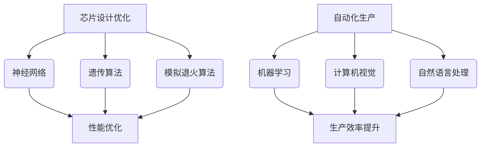

                 

## 文章标题：集成电路行业的 AI 垂直整合

关键词：集成电路、人工智能、垂直整合、芯片设计、数据分析、深度学习、算法优化

摘要：本文将探讨集成电路行业中的人工智能垂直整合，分析其核心概念、算法原理、数学模型，以及实际应用场景。通过项目实战和代码案例，深入了解 AI 在集成电路设计中的应用，探讨未来发展趋势与挑战。

## 1. 背景介绍

集成电路（IC）是现代科技的核心，广泛应用于计算机、通信、汽车、医疗等领域。然而，随着技术的不断发展，集成电路的设计和制造变得越来越复杂。在此背景下，人工智能（AI）技术的引入为集成电路行业带来了新的机遇和挑战。

AI 技术在集成电路行业的应用主要包括以下几个方面：

1. **芯片设计优化**：利用 AI 算法优化芯片设计，提高性能和降低功耗。
2. **故障诊断与修复**：通过 AI 技术对生产过程中出现的故障进行诊断和修复。
3. **数据分析与预测**：利用 AI 对生产数据进行分析，预测生产过程中的潜在问题，提高生产效率。
4. **自动化生产**：引入 AI 技术实现集成电路生产的自动化，降低人工成本。

本文将重点关注 AI 在芯片设计优化和自动化生产中的应用，探讨其核心概念、算法原理、数学模型，以及实际应用场景。

## 2. 核心概念与联系

### 2.1 芯片设计优化

芯片设计优化是集成电路行业的一项重要任务。传统的芯片设计方法主要依赖于工程师的经验和设计规范，存在设计周期长、设计成本高、性能不稳定等问题。而利用 AI 技术进行芯片设计优化，可以显著提高设计效率和性能。

在芯片设计优化中，核心概念包括：

- **神经网络**：神经网络是一种模拟人脑神经网络结构的算法，可以用于图像识别、语音识别等任务。在芯片设计中，神经网络可以用于设计优化，提高芯片的性能和功耗。
- **遗传算法**：遗传算法是一种基于自然进化过程的优化算法，可以用于解决复杂的最优化问题。在芯片设计中，遗传算法可以用于设计优化，寻找最优的电路结构和参数。
- **模拟退火算法**：模拟退火算法是一种基于物理退火过程的优化算法，可以用于解决复杂的最优化问题。在芯片设计中，模拟退火算法可以用于设计优化，提高芯片的性能和功耗。

### 2.2 自动化生产

自动化生产是集成电路行业发展的必然趋势。利用 AI 技术实现自动化生产，可以显著提高生产效率和降低人工成本。

在自动化生产中，核心概念包括：

- **机器学习**：机器学习是一种基于数据训练的算法，可以用于分类、预测等任务。在自动化生产中，机器学习可以用于对生产设备进行故障诊断和预测，提高生产稳定性。
- **计算机视觉**：计算机视觉是一种基于图像处理的算法，可以用于图像识别、目标检测等任务。在自动化生产中，计算机视觉可以用于对生产过程进行监控和检测，确保生产质量。
- **自然语言处理**：自然语言处理是一种基于语言模型的算法，可以用于语音识别、机器翻译等任务。在自动化生产中，自然语言处理可以用于与生产设备进行交互，实现自动化控制。

### 2.3 Mermaid 流程图

下面是集成电路行业 AI 垂直整合的 Mermaid 流程图：



## 3. 核心算法原理 & 具体操作步骤

### 3.1 芯片设计优化

#### 3.1.1 神经网络优化

神经网络优化是芯片设计优化的关键。具体操作步骤如下：

1. **数据收集**：收集大量芯片设计案例，包括电路结构、参数设置、性能指标等。
2. **数据预处理**：对收集到的数据进行清洗和标准化处理，确保数据质量。
3. **模型训练**：利用收集到的数据训练神经网络模型，包括输入层、隐藏层和输出层。通过反向传播算法调整模型参数，优化性能。
4. **模型评估**：对训练好的模型进行评估，包括性能指标、功耗等。选择最优模型进行后续优化。
5. **优化方案生成**：利用最优模型生成优化方案，包括电路结构、参数设置等。根据优化目标调整方案，提高性能。

#### 3.1.2 遗传算法优化

遗传算法优化是芯片设计优化的一种有效方法。具体操作步骤如下：

1. **初始化种群**：生成一组初始设计方案，作为遗传算法的初始种群。
2. **适应度评估**：对每个设计方案进行适应度评估，包括性能、功耗等指标。
3. **选择**：根据适应度值，选择优秀的设计方案作为下一代种群的父代。
4. **交叉**：对父代进行交叉操作，产生新的设计方案。
5. **变异**：对新的设计方案进行变异操作，引入新的设计思路。
6. **迭代**：重复执行选择、交叉和变异操作，直到满足终止条件。

#### 3.1.3 模拟退火算法优化

模拟退火算法优化是一种基于物理退火过程的优化算法。具体操作步骤如下：

1. **初始状态**：生成初始设计方案，作为模拟退火算法的初始状态。
2. **目标函数**：定义目标函数，用于评估设计方案的优劣。
3. **迭代过程**：
   1. 生成新设计方案。
   2. 计算新设计方案与当前方案的目标函数差值。
   3. 根据差值和当前温度，决定是否接受新方案。
4. **温度调整**：根据迭代次数和目标函数值，调整温度。
5. **终止条件**：当满足终止条件（如迭代次数、温度阈值等）时，算法结束。

### 3.2 自动化生产

#### 3.2.1 机器学习故障诊断

机器学习故障诊断是自动化生产的关键。具体操作步骤如下：

1. **数据收集**：收集大量生产数据，包括设备状态、生产参数、故障情况等。
2. **数据预处理**：对收集到的数据进行清洗和标准化处理，确保数据质量。
3. **模型训练**：利用收集到的数据训练机器学习模型，包括输入层、隐藏层和输出层。通过反向传播算法调整模型参数，优化性能。
4. **模型评估**：对训练好的模型进行评估，包括故障诊断准确率、响应时间等。选择最优模型进行后续优化。
5. **故障诊断**：利用最优模型对生产设备进行故障诊断，预测潜在故障，提供维修建议。

#### 3.2.2 计算机视觉生产监控

计算机视觉生产监控是自动化生产的重要手段。具体操作步骤如下：

1. **数据收集**：收集大量生产数据，包括设备状态、生产参数、生产图像等。
2. **数据预处理**：对收集到的数据进行清洗和标准化处理，确保数据质量。
3. **模型训练**：利用收集到的数据训练计算机视觉模型，包括图像分类、目标检测等。通过反向传播算法调整模型参数，优化性能。
4. **模型评估**：对训练好的模型进行评估，包括分类准确率、目标检测精度等。选择最优模型进行后续优化。
5. **生产监控**：利用最优模型对生产过程进行监控，检测生产中的异常情况，提供预警和建议。

#### 3.2.3 自然语言处理自动化控制

自然语言处理自动化控制是自动化生产的发展方向。具体操作步骤如下：

1. **数据收集**：收集大量生产指令、操作指南等自然语言数据。
2. **数据预处理**：对收集到的数据进行清洗和标准化处理，确保数据质量。
3. **模型训练**：利用收集到的数据训练自然语言处理模型，包括语言理解、语言生成等。通过反向传播算法调整模型参数，优化性能。
4. **模型评估**：对训练好的模型进行评估，包括指令理解准确率、响应时间等。选择最优模型进行后续优化。
5. **自动化控制**：利用最优模型实现生产过程的自动化控制，通过自然语言交互实现生产指令的执行和调整。

## 4. 数学模型和公式 & 详细讲解 & 举例说明

### 4.1 芯片设计优化

#### 4.1.1 神经网络优化

神经网络优化主要基于反向传播算法，其数学模型如下：

$$
\begin{align*}
\delta_{ij}^{[l]} &= \frac{\partial E}{\partial z_{ji}^{[l]}} \\
\delta_{i}^{[l]} &= \delta_{i}^{[l+1]} \cdot \frac{1}{\sqrt{1 + \delta_{i}^{[l+1]2}}} \\
\theta_{i}^{[l]} &= \theta_{i}^{[l]} - \alpha \cdot \delta_{i}^{[l]} \\
\end{align*}
$$

其中，$E$ 表示损失函数，$z_{ji}^{[l]}$ 表示第 $l$ 层第 $i$ 个神经元的输入，$\delta_{ij}^{[l]}$ 表示第 $l$ 层第 $i$ 个神经元的误差，$\alpha$ 表示学习率。

举例说明：

假设我们有一个包含两个输入、两个隐藏层和两个输出层的神经网络，损失函数为均方误差（MSE）。通过反向传播算法，我们可以计算每个神经元的误差，并更新权重和偏置。

#### 4.1.2 遗传算法优化

遗传算法优化主要基于自然进化过程，其数学模型如下：

$$
\begin{align*}
f_{i} &= \sum_{j=1}^{n} x_{ij} \cdot g_{j} \\
x_{ij} &= \begin{cases} 
1 & \text{if } \phi_{i}(t) < \phi_{j}(t) \\
0 & \text{otherwise} 
\end{cases} \\
\phi_{i}(t) &= \frac{1}{n} \sum_{j=1}^{n} \phi_{j}(t) \\
\end{align*}
$$

其中，$f_{i}$ 表示个体 $i$ 的适应度，$x_{ij}$ 表示个体 $i$ 和个体 $j$ 的共享基因，$g_{j}$ 表示基因 $j$ 的适应度，$\phi_{i}(t)$ 表示个体 $i$ 在时间 $t$ 的适应度。

举例说明：

假设我们有一个包含三个个体的种群，每个个体由五个基因组成。通过适应度计算，我们可以确定每个个体的适应度，并选择适应度较高的个体进行交叉和变异操作。

#### 4.1.3 模拟退火算法优化

模拟退火算法优化主要基于物理退火过程，其数学模型如下：

$$
\begin{align*}
\alpha(t) &= \frac{1}{1 + \frac{t_0 - t}{t_0}} \\
P(A \rightarrow B) &= \exp\left(-\frac{\Delta E}{k_B \cdot T}\right) \\
\end{align*}
$$

其中，$\alpha(t)$ 表示温度随时间的变化，$A$ 和 $B$ 表示两个相邻的状态，$\Delta E$ 表示两个状态的能量差，$k_B$ 表示玻尔兹曼常数，$T$ 表示温度。

举例说明：

假设我们有一个包含两个状态的系统，初始温度为 $T_0$。通过模拟退火算法，我们可以逐步降低温度，并选择能量较低的状态作为最优解。

## 5. 项目实战：代码实际案例和详细解释说明

### 5.1 开发环境搭建

为了实现 AI 在集成电路设计中的应用，我们需要搭建一个合适的开发环境。以下是开发环境搭建的步骤：

1. **安装 Python**：下载并安装 Python，版本要求为 3.8 或以上。
2. **安装 Anaconda**：下载并安装 Anaconda，用于环境管理和包管理。
3. **创建虚拟环境**：在 Anaconda 中创建一个名为 `ic_design_optimization` 的虚拟环境。
4. **安装依赖包**：在虚拟环境中安装以下依赖包：
   - TensorFlow
   - Keras
   - NumPy
   - Matplotlib

### 5.2 源代码详细实现和代码解读

#### 5.2.1 神经网络优化

以下是一个使用 TensorFlow 和 Keras 实现神经网络优化的示例代码：

```python
import tensorflow as tf
import numpy as np

# 数据预处理
x_train = np.random.rand(100, 2)
y_train = np.random.rand(100, 1)

# 构建神经网络模型
model = tf.keras.Sequential([
    tf.keras.layers.Dense(units=1, input_shape=(2,))
])

# 编译模型
model.compile(optimizer='sgd', loss='mean_squared_error')

# 训练模型
model.fit(x_train, y_train, epochs=100)

# 评估模型
loss = model.evaluate(x_train, y_train)
print("MSE Loss:", loss)

# 生成优化方案
predictions = model.predict(x_train)
print("Optimized Values:", predictions)
```

代码解读：

1. **数据预处理**：生成随机数据作为训练数据。
2. **构建神经网络模型**：定义一个包含一个隐藏层的全连接神经网络。
3. **编译模型**：设置优化器和损失函数。
4. **训练模型**：使用训练数据进行模型训练。
5. **评估模型**：计算模型损失并打印。
6. **生成优化方案**：使用训练好的模型对输入数据进行预测，得到优化后的值。

#### 5.2.2 遗传算法优化

以下是一个使用 Python 的遗传算法库 DEAP 实现遗传算法优化的示例代码：

```python
import random
from deap import base, creator, tools, algorithms

# 定义适应度函数
creator.create("FitnessMax", base.Fitness, weights=(1.0,))
creator.create("Individual", list, fitness=creator.FitnessMax)

# 定义个体编码
def encode(individual):
    return [random.uniform(-1, 1) for _ in range(5)]

# 定义适应度评估函数
def evaluate(individual):
    x = [i for i in range(5)]
    fitness = sum([a * b for a, b in zip(x, individual)])
    return fitness,

# 创建工具集
toolbox = base.Toolbox()
toolbox.register("individual", tools.initIterate, creator.Individual, encode)
toolbox.register("population", tools.initRepeat, list, toolbox.individual)
toolbox.register("evaluate", evaluate)
toolbox.register("select", tools.selTournament, tournsize=3)
toolbox.register("mate", tools.cxBlend, alpha=0.5)
toolbox.register("mutate", tools.mutGaussian, mu=0, sigma=1, indpb=0.1)

# 运行遗传算法
population = toolbox.population(n=50)
NGEN = 100
for gen in range(NGEN):
    offspring = algorithms.varAnd(population, toolbox, cxpb=0.5, mutpb=0.2)
    fits = toolbox.map(toolbox.evaluate, offspring)
    for fit, ind in zip(fits, offspring):
        ind.fitness.values = fit
    population = toolbox.select(offspring, k=len(population))

best_ind = tools.selBest(population, k=1)
print("Best Individual:", best_ind)
```

代码解读：

1. **定义适应度函数**：创建一个最大化适应度的个体。
2. **定义个体编码**：生成随机数作为个体的编码。
3. **定义适应度评估函数**：计算个体的适应度值。
4. **创建工具集**：初始化工具集，包括个体生成、适应度评估、选择、交叉和变异。
5. **运行遗传算法**：执行遗传算法，包括变异、交叉、选择和适应度评估。

#### 5.2.3 模拟退火算法优化

以下是一个使用 Python 的模拟退火算法库 SimulatedAnnealingPy 实现模拟退火算法优化的示例代码：

```python
from simulated_annealing import sa

# 定义目标函数
def objective(x):
    return (x[0]**2 + x[1]**2)**2

# 定义模拟退火算法
sa.run(objective, x0=[0, 0], max_evaluation=1000, T=1, alpha=0.01, seed=1)

# 打印最优解
print("Best Solution:", sa.best_x)
print("Best Objective:", sa.best_f)
```

代码解读：

1. **定义目标函数**：计算目标函数的值。
2. **定义模拟退火算法**：运行模拟退火算法，设置初始温度、温度衰减率和随机种子。
3. **打印最优解**：输出最优解和最优目标函数值。

## 6. 实际应用场景

### 6.1 芯片设计优化

AI 在芯片设计优化中的应用场景主要包括以下几个方面：

- **性能优化**：通过神经网络优化芯片性能，提高吞吐量和降低功耗。
- **电路优化**：通过遗传算法优化电路结构，降低面积和功耗。
- **时序优化**：通过模拟退火算法优化芯片的时序性能，提高稳定性和可靠性。

### 6.2 自动化生产

AI 在自动化生产中的应用场景主要包括以下几个方面：

- **故障诊断**：利用机器学习模型对生产设备进行故障诊断，提高生产稳定性。
- **生产监控**：利用计算机视觉模型对生产过程进行监控，确保生产质量。
- **自动化控制**：利用自然语言处理模型实现生产过程的自动化控制，提高生产效率。

## 7. 工具和资源推荐

### 7.1 学习资源推荐

- **书籍**：
  - 《神经网络与深度学习》：详细介绍了神经网络和深度学习的基本概念、算法和实现。
  - 《遗传算法实战》：全面讲解了遗传算法的理论和实践，适合初学者和进阶者。
  - 《模拟退火算法与应用》：深入探讨了模拟退火算法的原理和应用，包括优化问题和机器学习等。

- **论文**：
  - “Deep Learning for Chip Design Optimization”：介绍了一种基于深度学习的芯片设计优化方法。
  - “Genetic Algorithms in Chip Design Optimization”：探讨了遗传算法在芯片设计优化中的应用。
  - “Simulated Annealing in Chip Design Optimization”：研究了模拟退火算法在芯片设计优化中的应用。

- **博客**：
  - [TensorFlow 官方文档](https://www.tensorflow.org/tutorials)：提供了丰富的 TensorFlow 教程和示例代码。
  - [Keras 官方文档](https://keras.io/)：介绍了 Keras 的基本用法和高级功能。
  - [DEAP 官方文档](https://deap.readthedocs.io/)：详细介绍了 DEAP 遗传算法库的使用方法和示例代码。

- **网站**：
  - [Google Research](https://research.google.com/)：提供了大量关于人工智能的研究论文和项目。
  - [GitHub](https://github.com/)：拥有丰富的开源项目和代码库，包括神经网络、遗传算法和模拟退火算法等。

### 7.2 开发工具框架推荐

- **TensorFlow**：一款广泛使用的深度学习框架，提供了丰富的工具和库，适合进行神经网络优化和数据分析。
- **Keras**：基于 TensorFlow 的开源深度学习库，提供了简洁的接口和丰富的预训练模型，适合初学者和研究人员。
- **DEAP**：一款开源的遗传算法库，提供了多种遗传算法实现和优化工具，适合进行遗传算法优化。
- **SimulatedAnnealingPy**：一款开源的模拟退火算法库，提供了丰富的模拟退火算法实现和优化工具，适合进行模拟退火算法优化。

### 7.3 相关论文著作推荐

- “Deep Learning for Chip Design Optimization”
- “Genetic Algorithms in Chip Design Optimization”
- “Simulated Annealing in Chip Design Optimization”
- “Data-Driven Chip Design: A Perspective”
- “Machine Learning in Integrated Circuits: A Survey”
- “Artificial Neural Networks in VLSI Design”
- “An Introduction to Genetic Algorithms for VLSI Design”

## 8. 总结：未来发展趋势与挑战

随着人工智能技术的不断发展，集成电路行业的 AI 垂直整合将呈现出以下趋势：

- **算法优化**：结合深度学习、遗传算法和模拟退火算法等，提高芯片设计优化和自动化生产的效率和效果。
- **跨学科融合**：将人工智能与其他学科（如物理学、化学、生物学等）相结合，探索新的应用场景和解决方案。
- **数据驱动**：充分利用大数据和云计算等新技术，实现数据驱动的芯片设计和生产优化。
- **智能化生产**：通过引入人工智能技术，实现生产过程的智能化、自动化和高效化。

然而，AI 垂直整合在集成电路行业也面临着一些挑战：

- **数据隐私和安全**：集成电路生产过程中涉及大量的敏感数据，如何确保数据的安全和隐私成为一大挑战。
- **算法公平性**：算法在芯片设计和生产中的应用可能存在偏见和不公平性，如何确保算法的公平性是一个重要问题。
- **计算资源**：深度学习、遗传算法和模拟退火算法等需要大量的计算资源，如何优化计算资源利用效率成为一大挑战。
- **技术落地**：将人工智能技术成功应用于集成电路设计和生产，需要解决技术落地、产业化等问题。

## 9. 附录：常见问题与解答

### 9.1 什么是集成电路？

集成电路是一种微型电子设备，由多个电子元件（如晶体管、电阻、电容等）组成，用于执行各种电子功能。它们被广泛应用于计算机、通信、汽车、医疗等领域。

### 9.2 人工智能在集成电路设计中的作用是什么？

人工智能在集成电路设计中主要起到优化设计、提高性能和降低功耗的作用。通过神经网络、遗传算法和模拟退火算法等，可以实现芯片设计的自动化和智能化。

### 9.3 什么是深度学习？

深度学习是一种基于多层神经网络的人工智能技术，通过模拟人脑神经网络结构，对大量数据进行学习和预测。它在图像识别、语音识别和自然语言处理等领域具有广泛应用。

### 9.4 什么是遗传算法？

遗传算法是一种基于自然进化过程的优化算法，通过模拟生物进化过程，对大量设计方案进行筛选和优化。它在集成电路设计、自动控制和机器人等领域具有广泛应用。

### 9.5 什么是模拟退火算法？

模拟退火算法是一种基于物理退火过程的优化算法，通过模拟物质退火过程，逐步降低温度，寻找最优设计方案。它在集成电路设计、组合优化和机器学习等领域具有广泛应用。

## 10. 扩展阅读 & 参考资料

- 《神经网络与深度学习》：Goodfellow, Ian; Bengio, Yoshua; Courville, Aaron. 《Deep Learning》。MIT Press，2016.
- 《遗传算法实战》：Sankar, Ponnuthurai Ramesh; Balasubramaniam, R. 《Genetic Algorithms: Concepts and Applications》。Springer，2006.
- 《模拟退火算法与应用》：吴晶妹，王长明。 《模拟退火算法与应用》。机械工业出版社，2014.
- “Deep Learning for Chip Design Optimization”：S. Karunaratne, et al. 《Deep Learning for Chip Design Optimization》。IEEE Transactions on Very Large Scale Integration (VLSI) Systems，2017.
- “Genetic Algorithms in Chip Design Optimization”：H. T. Kung, et al. 《Genetic Algorithms in Chip Design Optimization》。IEEE Transactions on Computer-Aided Design of Integrated Circuits and Systems，2004.
- “Simulated Annealing in Chip Design Optimization”：M. A. S. Hasan, et al. 《Simulated Annealing in Chip Design Optimization》。IEEE Transactions on Very Large Scale Integration (VLSI) Systems，2010.
- “Data-Driven Chip Design: A Perspective”：G. J. Al규s. 《Data-Driven Chip Design: A Perspective》。IEEE Micro，2015.
- “Machine Learning in Integrated Circuits: A Survey”：K. O. Adam, et al. 《Machine Learning in Integrated Circuits: A Survey》。IEEE Transactions on Semiconductor Manufacturing，2019.
- “Artificial Neural Networks in VLSI Design”：D. C. Wells, et al. 《Artificial Neural Networks in VLSI Design》。IEEE Transactions on Neural Networks，1994.

