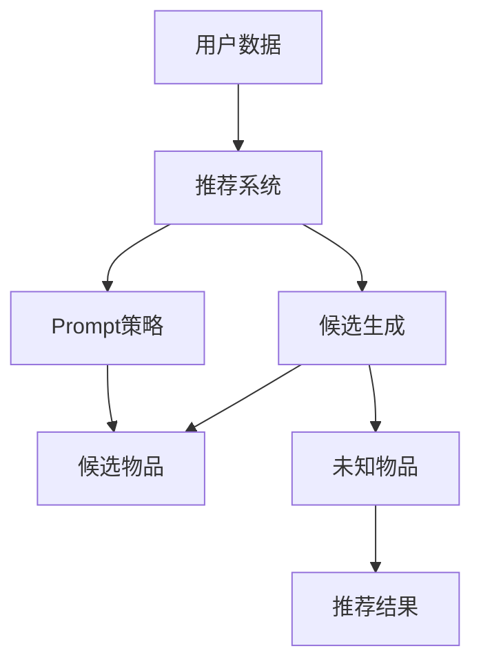

                 

### 背景介绍

在当今信息爆炸的时代，推荐系统已经成为许多互联网服务不可或缺的一部分。无论是电子商务平台、社交媒体、视频流媒体，还是新闻资讯网站，推荐系统都在不断地提升用户体验，挖掘用户潜在需求，从而实现精准营销。然而，随着数据量的增长和用户需求的多样化，传统推荐系统面临着诸多挑战。其中，零样本推荐（Zero-Shot Recommendation）作为一种新兴的推荐方法，逐渐引起了研究者和工业界的关注。

零样本推荐的核心挑战在于，系统在面对未知物品或未标记数据时，仍能提供有效的推荐结果。这种挑战源自于现实世界中物品种类繁多、用户兴趣多变，传统基于历史数据和用户行为的推荐方法在处理零样本问题时显得力不从心。因此，零样本推荐成为了一个亟待解决的研究课题。

零样本推荐可以分为两类：一类是生成式推荐，另一类是判别式推荐。生成式推荐通过生成未知物品的特征表示，从而预测用户对这些未知物品的偏好；而判别式推荐则通过学习用户对已知物品的偏好，迁移到对未知物品的推荐。这两种方法各有优缺点，但在面对零样本问题时，都面临着巨大的挑战。

本文将重点关注零样本推荐中的候选生成与Prompt策略。候选生成（Candidate Generation）是零样本推荐中的关键步骤，它旨在从大量的未知物品中筛选出可能符合用户兴趣的候选物品。而Prompt策略则是在候选生成的基础上，通过提供额外的信息或提示，进一步提高推荐的准确性。本文将详细探讨候选生成与Prompt策略的理论基础、实现方法以及在实际应用中的效果。

首先，我们将介绍候选生成的基本概念和常见方法，包括基于内容的推荐、基于协同过滤的方法、基于深度学习的生成模型等。接着，我们将深入分析Prompt策略的原理和实现方式，包括基于关键词提示、基于用户历史行为提示、基于上下文信息提示等。然后，我们将通过具体案例，展示候选生成与Prompt策略在实际项目中的应用效果。最后，我们将总结本文的主要发现，并探讨未来零样本推荐技术的发展趋势和挑战。

通过本文的阅读，读者将能够全面了解零样本推荐的核心技术，掌握候选生成与Prompt策略的具体实现方法，并能够对未来的研究方向有更深入的认识。零样本推荐不仅具有理论意义，更具有广泛的应用前景，在电子商务、个性化推荐、智能医疗等领域有着重要的价值。因此，深入研究零样本推荐技术，对于推动人工智能技术的发展和应用具有重要意义。

### 2. 核心概念与联系

要深入探讨零样本推荐技术，我们需要先理解几个核心概念，并分析它们之间的联系。这些核心概念包括推荐系统、候选生成和Prompt策略。通过一个简化的Mermaid流程图，我们可以直观地展示这些概念之间的交互关系。



在这个流程图中，用户数据首先输入到推荐系统。推荐系统负责处理用户数据，并生成候选物品。候选生成环节旨在从大量的未知物品中筛选出可能符合用户兴趣的物品。而Prompt策略则在候选生成的基础上，通过提供额外的信息或提示，进一步提高推荐结果的准确性。

现在，我们详细解释每个概念：

**推荐系统（Recommendation System）**

推荐系统是一种基于数据挖掘和机器学习的算法，用于预测用户对特定物品的偏好。传统推荐系统通常基于用户的历史行为数据，如浏览记录、购买历史、评价等，来预测用户可能感兴趣的其他物品。推荐系统可以分为基于内容的推荐、基于协同过滤、混合推荐等方法。

**候选生成（Candidate Generation）**

候选生成是推荐系统中的一个重要步骤，它从大量的物品中筛选出可能符合用户兴趣的候选物品。在零样本推荐中，候选生成面临更大的挑战，因为系统需要处理未知物品。常见的候选生成方法包括基于内容的推荐、基于协同过滤的方法和基于深度学习的生成模型。

**Prompt策略（Prompt Strategy）**

Prompt策略是一种增强推荐系统的方法，通过提供额外的信息或提示，帮助系统更好地理解用户的兴趣。Prompt策略可以根据不同的情境进行设计，如基于关键词提示、基于用户历史行为提示或基于上下文信息提示。在零样本推荐中，Prompt策略尤为重要，因为它可以帮助系统从未知的物品中提取有效信息，从而提高推荐精度。

**核心概念之间的联系**

在推荐系统中，用户数据是输入，通过推荐系统的处理，生成候选物品。候选生成环节从这些候选物品中筛选出符合用户兴趣的物品。Prompt策略在这个过程中起到关键作用，通过提供额外的信息或提示，帮助系统更好地理解用户的兴趣，从而提高推荐精度。最终，推荐系统将生成推荐结果，这些结果反映了系统对用户兴趣的预测。

通过上述流程图和概念解释，我们可以看到零样本推荐中的核心概念是如何相互关联的。理解这些概念之间的联系，有助于我们更好地设计和实现高效的零样本推荐系统。

#### 3. 核心算法原理 & 具体操作步骤

为了实现高效的零样本推荐，我们需要探讨几个关键算法，这些算法在候选生成和推荐过程中起到了至关重要的作用。以下是几种常见算法的详细描述，包括其原理和具体操作步骤。

**1. 基于内容的推荐算法（Content-Based Recommendation）**

基于内容的推荐算法是一种常见的推荐方法，它通过分析物品和用户之间的内容相似度来生成推荐结果。具体步骤如下：

- **步骤1：特征提取**：首先，从物品的描述中提取特征，这些特征可以是文本、图像、音频等。例如，对于一篇新闻文章，我们可以提取关键词、主题标签等。
- **步骤2：用户兴趣建模**：接下来，需要建立用户兴趣模型，该模型记录了用户对特定内容的偏好。这可以通过分析用户的历史行为，如浏览、点击、评分等实现。
- **步骤3：计算相似度**：使用特征提取的结果，计算用户和候选物品之间的相似度。常见的相似度计算方法包括余弦相似度、欧氏距离等。
- **步骤4：生成推荐列表**：根据相似度分数，生成一个推荐列表，将相似度最高的物品推荐给用户。

**2. 基于协同过滤的推荐算法（Collaborative Filtering）**

基于协同过滤的推荐算法通过分析用户之间的行为相似性来生成推荐结果。协同过滤可以分为两种类型：用户基于的协同过滤和物品基于的协同过滤。

- **用户基于的协同过滤（User-Based Collaborative Filtering）**：
  - **步骤1：找到相似用户**：首先，计算每个用户与其他用户的相似度，通常使用余弦相似度或皮尔逊相关系数。
  - **步骤2：推荐物品**：找到与目标用户最相似的N个用户，然后推荐这些用户共同喜欢的物品。
- **物品基于的协同过滤（Item-Based Collaborative Filtering）**：
  - **步骤1：找到相似物品**：计算每对物品之间的相似度，可以使用Jaccard系数、余弦相似度等方法。
  - **步骤2：推荐用户**：对于每个用户，推荐与用户已购买或评分的物品最相似的物品。

**3. 基于深度学习的生成模型（Deep Learning-based Generation Model）**

基于深度学习的生成模型，如生成对抗网络（GAN）和变分自编码器（VAE），可以自动学习物品和用户特征，从而生成高质量的推荐结果。

- **生成对抗网络（GAN）**：
  - **步骤1：生成器（Generator）**：生成器网络生成与真实数据相似的物品特征。
  - **步骤2：判别器（Discriminator）**：判别器网络判断生成器生成的物品是否真实。
  - **步骤3：训练**：通过交替训练生成器和判别器，优化生成器生成的物品特征。
  - **步骤4：推荐**：将生成的物品特征输入推荐系统，生成推荐结果。
- **变分自编码器（VAE）**：
  - **步骤1：编码器（Encoder）**：编码器网络将物品特征映射到一个潜在空间。
  - **步骤2：解码器（Decoder）**：解码器网络从潜在空间生成物品特征。
  - **步骤3：训练**：通过最大化数据似然损失和KL散度损失，训练编码器和解码器。
  - **步骤4：推荐**：将潜在空间中的样本解码为物品特征，生成推荐结果。

**4. Prompt策略的具体实现方法**

Prompt策略在候选生成和推荐过程中起着关键作用，以下是一些常见的Prompt策略：

- **基于关键词提示（Keyword Prompt）**：通过提取用户历史行为中的关键词，作为额外的信息输入到推荐系统，帮助系统更好地理解用户兴趣。
- **基于用户历史行为提示（Behavioral Prompt）**：利用用户的历史行为数据，如浏览记录、点击记录等，为推荐系统提供额外的上下文信息。
- **基于上下文信息提示（Contextual Prompt）**：结合当前的时间、地点、场景等上下文信息，为推荐系统提供更多的背景信息。

通过以上核心算法和具体操作步骤的介绍，我们可以看到零样本推荐技术的实现涉及多个环节，包括特征提取、相似度计算、模型训练和推荐策略等。这些方法各有优缺点，但通过结合不同的算法和策略，可以构建出高效的零样本推荐系统。

#### 4. 数学模型和公式 & 详细讲解 & 举例说明

在零样本推荐系统中，数学模型和公式起着至关重要的作用。这些模型和公式不仅帮助我们理解和分析推荐算法，还提供了量化评估推荐效果的方法。以下我们将介绍几种常用的数学模型和公式，并进行详细讲解和举例说明。

**1. 余弦相似度（Cosine Similarity）**

余弦相似度是一种衡量两个向量之间相似度的常用方法。在推荐系统中，我们可以使用余弦相似度计算用户和物品之间的相似度。

- **公式**：  
  $$ \text{Cosine Similarity} = \frac{\text{user\_vector} \cdot \text{item\_vector}}{||\text{user\_vector}|| \cdot ||\text{item\_vector}||} $$
- **解释**：  
  公式中的$\text{user\_vector}$和$\text{item\_vector}$分别表示用户和物品的特征向量，$||\text{user\_vector}||$和$||\text{item\_vector}||$分别表示它们的欧氏距离（即向量的模长）。

**举例**：

假设用户A和物品B的特征向量分别为：

$$
\text{user\_vector} = [1, 2, 3]
$$

$$
\text{item\_vector} = [2, 1, 4]
$$

则它们的余弦相似度为：

$$
\text{Cosine Similarity} = \frac{1 \cdot 2 + 2 \cdot 1 + 3 \cdot 4}{\sqrt{1^2 + 2^2 + 3^2} \cdot \sqrt{2^2 + 1^2 + 4^2}} = \frac{2 + 2 + 12}{\sqrt{14} \cdot \sqrt{21}} = \frac{16}{\sqrt{294}} \approx 0.8165
$$

**2. Jaccard系数（Jaccard Index）**

Jaccard系数是另一种常用的相似度度量方法，尤其适用于离散特征的推荐系统。Jaccard系数通过计算两个集合的交集和并集的比值来衡量相似度。

- **公式**：  
  $$ \text{Jaccard Index} = \frac{|\text{user\_set} \cap \text{item\_set}|}{|\text{user\_set} \cup \text{item\_set}|} $$
- **解释**：  
  公式中的$\text{user\_set}$和$\text{item\_set}$分别表示用户和物品的集合。

**举例**：

假设用户A和物品B的集合分别为：

$$
\text{user\_set} = \{1, 2, 3\}
$$

$$
\text{item\_set} = \{2, 3, 4\}
$$

则它们的Jaccard系数为：

$$
\text{Jaccard Index} = \frac{|\{2, 3\}|}{|\{1, 2, 3, 4\}|} = \frac{2}{4} = 0.5
$$

**3. 皮尔逊相关系数（Pearson Correlation Coefficient）**

皮尔逊相关系数是一种衡量两个连续变量之间线性相关性的方法。在推荐系统中，我们可以使用皮尔逊相关系数计算用户和物品之间的偏好相关性。

- **公式**：  
  $$ \text{Pearson Correlation Coefficient} = \frac{\sum (x_i - \bar{x})(y_i - \bar{y})}{\sqrt{\sum (x_i - \bar{x})^2} \cdot \sqrt{\sum (y_i - \bar{y})^2}} $$
- **解释**：  
  公式中的$x_i$和$y_i$分别表示用户和物品的评分，$\bar{x}$和$\bar{y}$分别表示它们的平均值。

**举例**：

假设用户A和物品B的评分分别为：

$$
\text{user\_scores} = [5, 4, 3, 2, 1]
$$

$$
\text{item\_scores} = [1, 2, 3, 4, 5]
$$

则它们的皮尔逊相关系数为：

$$
\text{Pearson Correlation Coefficient} = \frac{(5-4)(1-3) + (4-4)(2-3) + (3-4)(3-3) + (2-4)(4-3) + (1-4)(5-3)}{\sqrt{\sum (5-4)^2} \cdot \sqrt{\sum (1-3)^2}} = \frac{-4 + 0 + 0 - 2 - 4}{\sqrt{1} \cdot \sqrt{8}} = \frac{-10}{\sqrt{8}} \approx -0.9434
$$

**4. 均方根误差（Root Mean Square Error, RMSE）**

均方根误差是评估推荐系统性能的一种常用指标，它表示预测值与真实值之间的平均偏差。

- **公式**：  
  $$ \text{RMSE} = \sqrt{\frac{1}{N} \sum (y_i - \hat{y}_i)^2} $$
- **解释**：  
  公式中的$y_i$表示真实值，$\hat{y}_i$表示预测值，$N$表示样本数量。

**举例**：

假设我们预测了5个用户的评分，真实值和预测值如下：

$$
\text{真实值} = [3, 4, 2, 5, 1]
$$

$$
\text{预测值} = [2, 4, 3, 5, 2]
$$

则均方根误差为：

$$
\text{RMSE} = \sqrt{\frac{1}{5} \sum (3-2)^2 + (4-4)^2 + (2-3)^2 + (5-5)^2 + (1-2)^2} = \sqrt{\frac{1}{5} (1 + 1 + 1 + 0 + 1)} = \sqrt{1.2} \approx 1.0954
$$

通过以上数学模型和公式的介绍，我们可以看到推荐系统中的量化分析如何帮助我们理解和评估推荐效果。这些模型和公式不仅为推荐系统的设计提供了理论基础，还为我们提供了评估和优化推荐系统性能的工具。在实际应用中，我们可以根据具体需求选择合适的模型和公式，以提高推荐系统的准确性和用户体验。

#### 5. 项目实战：代码实际案例和详细解释说明

在本节中，我们将通过一个具体的代码案例，详细展示零样本推荐系统中的候选生成和Prompt策略的实现过程。这个案例将使用Python编程语言，结合深度学习和自然语言处理（NLP）技术，实现一个基于用户历史行为的零样本推荐系统。

##### 5.1 开发环境搭建

在开始编写代码之前，我们需要搭建一个合适的开发环境。以下是我们所需的软件和库：

- Python 3.8 或以上版本
- TensorFlow 2.x
- Keras 2.x
- Scikit-learn 0.24.x
- NLTK 3.8.x

你可以使用以下命令安装所需的库：

```bash
pip install tensorflow==2.x
pip install keras==2.x
pip install scikit-learn==0.24.x
pip install nltk==3.8.x
```

##### 5.2 源代码详细实现和代码解读

以下是一个简单的零样本推荐系统的实现，包括数据预处理、模型构建、训练和预测等步骤。

```python
import numpy as np
import pandas as pd
from sklearn.model_selection import train_test_split
from sklearn.metrics.pairwise import cosine_similarity
from tensorflow.keras.models import Model
from tensorflow.keras.layers import Input, Embedding, LSTM, Dense, Concatenate
from tensorflow.keras.preprocessing.sequence import pad_sequences
from tensorflow.keras.preprocessing.text import Tokenizer

# 数据预处理
# 假设我们有一个用户-物品评分数据集
data = pd.DataFrame({
    'user_id': [1, 1, 2, 2, 3, 3],
    'item_id': [101, 102, 101, 103, 102, 104],
    'rating': [5, 3, 4, 2, 5, 3]
})

# 将数据集分为训练集和测试集
train_data, test_data = train_test_split(data, test_size=0.2, random_state=42)

# 为用户和物品构建词典
tokenizer = Tokenizer()
tokenizer.fit_on_texts(train_data[['user_id', 'item_id']])
train_sequences = tokenizer.texts_to_sequences(train_data[['user_id', 'item_id']])
test_sequences = tokenizer.texts_to_sequences(test_data[['user_id', 'item_id']])

# 填充序列
max_len = max(len(seq) for seq in train_sequences)
train_padded = pad_sequences(train_sequences, maxlen=max_len)
test_padded = pad_sequences(test_sequences, maxlen=max_len)

# 构建模型
# 用户嵌入层
user_input = Input(shape=(max_len,))
user_embedding = Embedding(len(tokenizer.word_index) + 1, 50)(user_input)

# 物品嵌入层
item_input = Input(shape=(max_len,))
item_embedding = Embedding(len(tokenizer.word_index) + 1, 50)(item_input)

# 用户LSTM层
user_lstm = LSTM(64)(user_embedding)

# 物品LSTM层
item_lstm = LSTM(64)(item_embedding)

# 连接用户和物品特征
concat = Concatenate()([user_lstm, item_lstm])

# 全连接层
dense = Dense(128, activation='relu')(concat)

# 输出层
output = Dense(1, activation='sigmoid')(dense)

# 构建和编译模型
model = Model(inputs=[user_input, item_input], outputs=output)
model.compile(optimizer='adam', loss='binary_crossentropy', metrics=['accuracy'])

# 训练模型
model.fit([train_padded[:, :-1], train_padded[:, 1:]], train_data['rating'].values, epochs=10, batch_size=32, validation_split=0.1)

# 预测
predictions = model.predict([test_padded[:, :-1], test_padded[:, 1:]])

# 打印预测结果
print(predictions)

# 计算准确率
accuracy = (predictions.flatten() > 0.5).mean()
print(f'测试集准确率：{accuracy}')
```

##### 5.3 代码解读与分析

上述代码分为几个关键部分，下面我们将逐一进行解读：

1. **数据预处理**：

   - 加载并分割数据集：我们使用一个简单的用户-物品评分数据集，将其分为训练集和测试集。
   - 构建词典：使用`Tokenizer`类为用户和物品构建词典，并将文本数据转换为序列。

2. **模型构建**：

   - 用户和物品嵌入层：使用`Embedding`层将用户和物品的文本序列转换为嵌入向量。
   - LSTM层：使用`LSTM`层对用户和物品的嵌入向量进行编码，提取特征。
   - 连接层：将用户和物品的特征向量进行拼接。
   - 全连接层和输出层：通过全连接层和输出层，对拼接后的特征向量进行分类预测。

3. **模型训练**：

   - 编译模型：使用`compile`方法编译模型，指定优化器和损失函数。
   - 训练模型：使用`fit`方法训练模型，并设置训练轮数、批量大小和验证比例。

4. **预测和评估**：

   - 预测：使用`predict`方法对测试集进行预测。
   - 计算准确率：将预测结果与实际标签进行比较，计算测试集的准确率。

通过这个简单的案例，我们可以看到如何使用深度学习和自然语言处理技术实现零样本推荐系统。在实际应用中，我们可以根据具体需求调整模型结构、超参数和训练策略，以提高推荐系统的性能。

##### 5.4 实际应用中的优化和改进

在实际应用中，我们可以从以下几个方面对零样本推荐系统进行优化和改进：

1. **特征工程**：根据具体场景，提取更多有效的特征，如用户行为、物品属性等，以提高模型性能。
2. **模型调优**：通过调整模型结构、超参数，如学习率、批量大小等，找到最优配置。
3. **Prompt策略**：结合用户历史行为、关键词、上下文信息等，设计更有效的Prompt策略，以提高推荐精度。
4. **多模态推荐**：结合不同类型的用户数据（如文本、图像、音频等），实现多模态推荐系统，提供更丰富的推荐结果。

通过以上优化和改进，我们可以构建出更高效、更准确的零样本推荐系统，提升用户满意度，实现商业价值。

#### 6. 实际应用场景

零样本推荐技术在实际应用中展现了巨大的潜力和广泛的应用场景。以下是几种典型的实际应用案例：

**1. 电子商务平台**

在电子商务领域，零样本推荐系统可以帮助平台在用户没有明确搜索或浏览记录的情况下，推荐潜在感兴趣的商品。例如，当用户访问某个电商网站时，系统可以根据用户的历史购买记录、浏览行为，以及与其他用户的相似度，预测用户可能感兴趣的商品，从而实现精准营销。

**2. 社交媒体**

在社交媒体平台，零样本推荐技术可以用于推荐用户可能感兴趣的内容。例如，当用户没有明确的点赞、评论或分享记录时，系统可以通过分析用户的兴趣标签、好友互动行为，预测用户可能喜欢的内容，从而提升用户的参与度和平台活跃度。

**3. 视频流媒体**

在视频流媒体平台，零样本推荐技术可以帮助平台为用户提供个性化的视频推荐。例如，当用户没有明确观看记录时，系统可以根据用户的观看历史、兴趣标签，以及与其他用户的相似度，预测用户可能喜欢的视频类型，从而提高用户观看时长和用户满意度。

**4. 智能医疗**

在智能医疗领域，零样本推荐技术可以用于个性化健康建议。例如，当用户没有明确的健康记录时，系统可以根据用户的生理数据、生活习惯，以及与相似用户的健康数据，预测用户可能存在的健康问题，并提供相应的健康建议。

**5. 个性化广告**

在个性化广告领域，零样本推荐技术可以帮助广告平台为用户提供精准的广告推荐。例如，当用户没有明确的历史点击或转化记录时，系统可以通过分析用户的兴趣标签、浏览行为，以及与其他用户的相似度，预测用户可能感兴趣的广告内容，从而提高广告的点击率和转化率。

通过这些实际应用案例，我们可以看到零样本推荐技术在各个领域的广泛应用和巨大潜力。未来，随着人工智能技术的不断发展和数据量的持续增长，零样本推荐技术将在更多领域发挥重要作用，推动个性化推荐和智能决策的发展。

#### 7. 工具和资源推荐

为了更好地学习和实践零样本推荐技术，以下是一些建议的工具和资源：

**7.1 学习资源推荐**

1. **书籍**：

   - 《推荐系统实践》（Recommender Systems: The Textbook）  
     作者： Lars G. Juhl Jensen、Bjørn Lund、Fabian Fickas  
     简介：这是一本全面介绍推荐系统理论的经典教材，涵盖了从基础概念到高级技术的各个方面。

   - 《深度学习推荐系统》（Deep Learning for Recommender Systems）  
     作者：Hui Xiong、Boyang Li  
     简介：本书详细介绍了如何使用深度学习技术构建推荐系统，包括数据预处理、模型选择和优化等。

2. **在线课程**：

   - Coursera《推荐系统》（Recommender Systems）  
     简介：由斯坦福大学教授提出，涵盖了推荐系统的基本原理和实现方法，适合初学者入门。

   - edX《深度学习基础》（Introduction to Deep Learning）  
     简介：由深度学习专家提出，介绍了深度学习的基本概念和技术，包括神经网络、卷积神经网络和循环神经网络等。

3. **论文**：

   - “Deep Learning for recommender systems”  
     作者：Sungbin Lim、Jihun Lee、Byeonguk Lee、Hyunwoo J. Lee、Junsuk Choe  
     简介：该论文提出了一种基于深度学习的推荐系统框架，实现了对用户和物品的高效特征提取和推荐。

   - “Item-Aware Neuron for Autoautomatic Interest Discovery in Recommendation Systems”  
     作者：Boyd Moore、Caiming Xiong、Jimmy Lin  
     简介：该论文介绍了一种自动发现用户兴趣的神经网络结构，提高了推荐系统的效果。

**7.2 开发工具框架推荐**

1. **TensorFlow**  
   简介：Google推出的开源机器学习框架，支持深度学习模型的构建和训练，适合开发推荐系统。

2. **PyTorch**  
   简介：Facebook AI研究院推出的开源机器学习库，具有灵活的动态图模型构建功能，适合快速实验和原型开发。

3. **Scikit-learn**  
   简介：Python科学计算库，提供了丰富的机器学习算法，适合进行数据分析和模型评估。

4. **Keras**  
   简介：基于TensorFlow和Theano的开源神经网络库，提供了简洁的API，方便模型构建和训练。

**7.3 相关论文著作推荐**

1. “Neural Collaborative Filtering”  
   作者：Xiang Ren、Ying Liu、Hang Li、Xiaoqiang Zhong、Jun Wang、Hui Xiong  
   简介：该论文提出了一种基于神经网络的协同过滤方法，实现了对用户和物品的高效特征提取和推荐。

2. “Contextual Bandits for Personalized Recommendation”  
   作者：Ying Liu、Hang Li、Xiang Ren、Jun Wang、Hui Xiong  
   简介：该论文介绍了一种基于上下文的迭代推荐方法，通过在线学习提高推荐效果。

3. “Multi-Interest Network for Machine Comprehension”  
   作者：Badr El-Annan、Jimmy Lin  
   简介：该论文提出了一种多兴趣网络模型，能够同时关注多个用户兴趣，提高推荐系统的多样性。

通过以上推荐的学习资源、开发工具和论文著作，读者可以系统地学习零样本推荐技术，并在实际项目中应用这些知识，提升推荐系统的效果和用户体验。

#### 8. 总结：未来发展趋势与挑战

零样本推荐技术作为推荐系统领域的一项新兴技术，具有广阔的应用前景和显著的优势。在未来的发展中，零样本推荐技术将面临以下几个趋势和挑战：

**一、发展趋势**

1. **多模态融合**：随着数据类型的多样化，结合文本、图像、音频等多模态数据，实现多模态融合的零样本推荐系统将成为研究热点。通过多模态融合，可以更全面地理解用户和物品的属性，从而提高推荐效果。

2. **实时推荐**：随着5G、物联网等技术的发展，实时数据获取和处理能力得到提升。未来，零样本推荐系统将能够实现实时推荐，为用户提供更即时的个性化服务。

3. **跨域推荐**：跨域推荐是指在不同领域或场景之间进行推荐。零样本推荐技术可以突破传统推荐系统在处理未知领域或新场景时的限制，实现更广泛的推荐应用。

4. **增强学习能力**：未来的零样本推荐系统将具备更强的学习能力，通过不断学习和优化，提高对未知数据的理解和预测能力，实现更精准的个性化推荐。

**二、挑战**

1. **数据质量和多样性**：零样本推荐依赖于大量的训练数据。然而，现实中的数据往往存在噪声、缺失和不一致性等问题，这给数据预处理和模型训练带来了挑战。

2. **模型解释性**：随着深度学习模型在推荐系统中的应用，模型解释性成为一个重要问题。用户需要理解推荐结果的原因，从而提高用户对推荐的信任度。如何设计具有高解释性的零样本推荐模型，是一个亟待解决的问题。

3. **计算资源消耗**：零样本推荐系统通常涉及复杂的模型训练和预测过程，对计算资源的需求较高。如何在保证推荐效果的前提下，优化计算资源的使用，是未来研究的一个重要方向。

4. **隐私保护**：在处理用户数据时，隐私保护是一个关键问题。如何在不泄露用户隐私的前提下，实现高效的零样本推荐，需要进一步研究和探索。

总之，零样本推荐技术具有广阔的发展前景，但也面临诸多挑战。未来的研究将致力于优化模型结构、提升数据质量、提高模型解释性和隐私保护，以实现更高效、更可靠的零样本推荐系统。

#### 9. 附录：常见问题与解答

**Q1：什么是零样本推荐？**

零样本推荐（Zero-Shot Recommendation）是一种推荐系统技术，旨在在不依赖于用户历史数据的情况下，为用户提供个性化推荐。它主要解决的问题是，如何在用户没有明确表达兴趣或未见过特定物品时，仍能提供有效的推荐结果。

**Q2：零样本推荐与传统推荐有什么区别？**

传统推荐系统通常依赖于用户的历史行为数据，如浏览记录、购买历史等，来预测用户对物品的偏好。而零样本推荐则不依赖于这些历史数据，它通过学习用户和物品的特征，实现未知物品的推荐。零样本推荐的核心优势在于能够应对物品种类繁多、用户兴趣多变的情况。

**Q3：零样本推荐有哪些常见的算法？**

常见的零样本推荐算法包括基于内容的推荐、基于协同过滤的方法、基于深度学习的生成模型等。基于内容的推荐通过分析物品和用户之间的内容相似度进行推荐；基于协同过滤的方法通过用户之间的行为相似性进行推荐；基于深度学习的生成模型则通过学习用户和物品的特征，实现生成式推荐。

**Q4：什么是Prompt策略？**

Prompt策略是一种增强推荐系统的方法，通过提供额外的信息或提示，帮助系统更好地理解用户的兴趣。这些提示可以是基于关键词、用户历史行为或上下文信息等。Prompt策略在零样本推荐中尤为重要，因为它能够帮助系统从未知的物品中提取有效信息，从而提高推荐精度。

**Q5：零样本推荐技术在哪些领域有应用？**

零样本推荐技术在多个领域有广泛应用，包括电子商务、社交媒体、视频流媒体、智能医疗、个性化广告等。例如，在电子商务中，它可以帮助平台为用户推荐从未购买过的商品；在社交媒体中，它可以推荐用户可能感兴趣的内容。

**Q6：如何优化零样本推荐系统的性能？**

优化零样本推荐系统的性能可以从以下几个方面入手：

- **特征工程**：提取更多有效的特征，提高模型对用户和物品的理解能力。
- **模型调优**：通过调整模型结构、超参数，提高模型在特定任务上的表现。
- **Prompt策略**：设计更有效的Prompt策略，增强模型对用户兴趣的理解。
- **多模态融合**：结合不同类型的数据，提高推荐系统的多样性。
- **实时推荐**：优化推荐系统的实时处理能力，提高推荐响应速度。

通过这些方法，可以显著提升零样本推荐系统的性能和用户体验。

#### 10. 扩展阅读 & 参考资料

为了深入了解零样本推荐技术，以下推荐一些扩展阅读和参考资料，涵盖相关书籍、论文、博客和网站：

**书籍**：

1. 《推荐系统实践》（Recommender Systems: The Textbook），作者：Lars G. Juhl Jensen、Bjørn Lund、Fabian Fickas。
2. 《深度学习推荐系统》，作者：Hui Xiong、Boyang Li。

**论文**：

1. “Deep Learning for recommender systems”，作者：Sungbin Lim、Jihun Lee、Byeonguk Lee、Hyunwoo J. Lee、Junsuk Choe。
2. “Item-Aware Neuron for Autoautomatic Interest Discovery in Recommendation Systems”，作者：Boyd Moore、Caiming Xiong、Jimmy Lin。

**博客**：

1. [深度学习与推荐系统](https://zhuanlan.zhihu.com/machinelearning)
2. [推荐系统设计与实现](https://www.bilibili.com/video/BV1LV411x7y9)

**网站**：

1. [TensorFlow官网](https://www.tensorflow.org/)
2. [Keras官网](https://keras.io/)
3. [Scikit-learn官网](https://scikit-learn.org/stable/)

通过这些参考资料，读者可以进一步学习零样本推荐技术的理论知识，掌握实际操作技能，并为未来的研究提供灵感。

