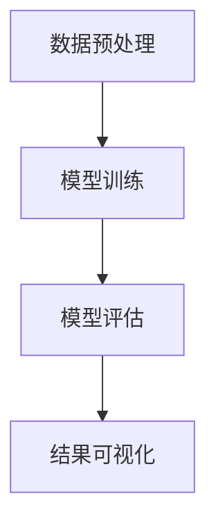

                 

# 非监督学习算法演示系统的设计与实现

## 关键词：非监督学习、算法演示系统、设计与实现、机器学习、系统架构

## 摘要：
本文将详细介绍非监督学习算法演示系统的设计与实现过程。通过对非监督学习算法的基本概念、核心原理及典型应用场景的阐述，我们将设计并实现一个能够可视化展示非监督学习算法运行过程的系统。本文旨在为非监督学习算法的研究者、开发者提供一个实用的工具，以便更好地理解算法的工作机制和优化方法。文章结构如下：

1. 背景介绍
2. 核心概念与联系
3. 核心算法原理 & 具体操作步骤
4. 数学模型和公式 & 详细讲解 & 举例说明
5. 项目实战：代码实际案例和详细解释说明
6. 实际应用场景
7. 工具和资源推荐
8. 总结：未来发展趋势与挑战
9. 附录：常见问题与解答
10. 扩展阅读 & 参考资料

### 1. 背景介绍

非监督学习是机器学习领域的一个重要分支，其核心目标是在没有明确标注数据的情况下，通过算法自动发现数据中的模式和规律。与监督学习相比，非监督学习不需要预先定义好的标签数据，而是依赖于算法自身的探索和发现能力。这使得非监督学习在处理大规模、复杂的数据集时，具有很高的实用性和灵活性。

近年来，随着人工智能技术的快速发展，非监督学习在多个领域取得了显著的成果。例如，在图像识别、自然语言处理、推荐系统等领域，非监督学习算法被广泛应用于模式识别、聚类分析、降维等技术。这些技术的应用，不仅提高了数据处理效率，还促进了人工智能技术的普及和应用。

然而，在实际应用过程中，研究者们常常面临两个主要问题：

1. **算法理解困难**：非监督学习算法种类繁多，每种算法都有其独特的原理和适用场景。对于初学者和开发者来说，理解这些算法的内部机制和优化方法具有一定的挑战性。
2. **算法效果评估困难**：由于非监督学习没有明确的目标标签，算法的效果难以直接评估。这给算法的优化和调参带来了困难。

为了解决这些问题，本文提出设计和实现一个非监督学习算法演示系统。通过该系统，用户可以直观地了解不同算法的运行过程、观察算法的实时效果，并对比不同算法的性能。这将有助于提升用户对非监督学习算法的理解，并为其优化和开发提供参考。

### 2. 核心概念与联系

在设计和实现非监督学习算法演示系统之前，我们需要先明确几个核心概念，并理解它们之间的联系。

#### 2.1 非监督学习算法分类

非监督学习算法主要可以分为以下几类：

1. **聚类算法**：将数据集划分为若干个类别，使同一类别内的数据点尽可能接近，而不同类别间的数据点尽可能远离。常见的聚类算法有K均值聚类（K-Means Clustering）、层次聚类（Hierarchical Clustering）等。
2. **降维算法**：通过减少数据维度，降低数据的复杂度，同时保持数据的信息。常见的降维算法有主成分分析（PCA）、线性判别分析（LDA）等。
3. **关联规则学习算法**：发现数据集中的关联关系，从而揭示数据之间的潜在规律。常见的关联规则学习算法有Apriori算法、FP-Growth算法等。

#### 2.2 非监督学习算法架构

非监督学习算法通常包括以下几个关键模块：

1. **数据预处理**：对原始数据进行清洗、归一化等操作，以消除噪声和异常值的影响，提高算法的性能。
2. **模型训练**：利用训练数据，通过优化算法来调整模型参数，使模型能够更好地拟合数据。
3. **模型评估**：通过测试数据对模型进行评估，以判断模型的性能是否达到预期。
4. **结果可视化**：将算法的运行过程和结果以图形化的方式展示，便于用户理解和分析。

#### 2.3 Mermaid 流程图

为了更好地理解非监督学习算法的架构，我们可以使用Mermaid流程图来表示。以下是K均值聚类算法的基本流程：



在这个流程图中，数据预处理模块负责清洗和归一化数据，为后续的模型训练和评估做好准备。模型训练模块通过迭代计算，不断调整模型参数，使模型能够更好地拟合数据。模型评估模块利用测试数据，评估模型的性能。最后，结果可视化模块将算法的运行过程和结果以图形化的方式展示。

### 3. 核心算法原理 & 具体操作步骤

在本节中，我们将介绍一种典型的非监督学习算法——K均值聚类算法，并详细阐述其原理和具体操作步骤。

#### 3.1 算法原理

K均值聚类算法的目标是将数据集划分为K个类别，使得每个类别内的数据点尽可能接近，而不同类别间的数据点尽可能远离。具体来说，算法通过以下步骤实现：

1. **初始化聚类中心**：随机选择K个数据点作为初始聚类中心。
2. **分配数据点**：对于每个数据点，计算其与K个聚类中心的距离，并将其分配到距离最近的聚类中心所在的类别。
3. **更新聚类中心**：重新计算每个类别的聚类中心，作为新的聚类中心。
4. **迭代计算**：重复步骤2和步骤3，直至聚类中心不再发生变化或达到预设的迭代次数。

#### 3.2 操作步骤

以下是K均值聚类算法的具体操作步骤：

1. **数据预处理**：对原始数据进行清洗和归一化处理，以消除噪声和异常值的影响。
2. **初始化聚类中心**：随机选择K个数据点作为初始聚类中心。
3. **分配数据点**：计算每个数据点与K个聚类中心的距离，并将其分配到距离最近的聚类中心所在的类别。
4. **计算新聚类中心**：对于每个类别，计算其所有数据点的均值，作为新的聚类中心。
5. **更新聚类中心**：将新计算得到的聚类中心作为当前聚类中心，返回步骤3。
6. **结束条件**：判断聚类中心是否发生变化。如果聚类中心不再发生变化，则算法结束；否则，继续执行步骤3。

#### 3.3 算法分析

K均值聚类算法具有以下特点：

1. **简单易实现**：算法的原理简单，计算过程易于实现。
2. **自适应性强**：算法可以根据数据集的特点，自动调整聚类数量和类别分布。
3. **时间复杂度高**：在数据量较大时，算法的计算时间较长，效率较低。
4. **敏感性高**：算法对初始聚类中心的选取敏感，可能导致不同的聚类结果。

### 4. 数学模型和公式 & 详细讲解 & 举例说明

在本节中，我们将详细讲解K均值聚类算法的数学模型和公式，并通过具体例子来说明其计算过程。

#### 4.1 数学模型

K均值聚类算法的数学模型主要包括以下两个方面：

1. **聚类中心计算**：对于每个类别，计算其所有数据点的均值，作为新的聚类中心。

$$
c_j = \frac{1}{N_j} \sum_{i=1}^{N} x_i
$$

其中，$c_j$ 表示第 $j$ 个聚类中心，$N_j$ 表示第 $j$ 个类别中的数据点数量，$x_i$ 表示第 $i$ 个数据点。

2. **数据点分配**：对于每个数据点，计算其与K个聚类中心的距离，并将其分配到距离最近的聚类中心所在的类别。

$$
d(x_i, c_j) = \sqrt{\sum_{k=1}^{d} (x_{ik} - c_{jk})^2}
$$

其中，$d$ 表示数据点的维度，$x_{ik}$ 和 $c_{jk}$ 分别表示第 $i$ 个数据点和第 $j$ 个聚类中心在第 $k$ 个维度上的取值。

#### 4.2 计算过程举例

假设我们有一个包含10个二维数据点的数据集，如下表所示：

| 数据点 | 特征1 | 特征2 |
|--------|-------|-------|
| 1      | 1     | 2     |
| 2      | 2     | 2     |
| 3      | 2     | 3     |
| 4      | 2     | 4     |
| 5      | 3     | 3     |
| 6      | 3     | 4     |
| 7      | 4     | 4     |
| 8      | 4     | 5     |
| 9      | 5     | 5     |
| 10     | 5     | 6     |

现在，我们使用K均值聚类算法将其划分为2个类别。

1. **初始化聚类中心**：随机选择2个数据点作为初始聚类中心，如下表所示：

| 聚类中心 | 特征1 | 特征2 |
|----------|-------|-------|
| 1        | 1     | 2     |
| 2        | 5     | 5     |

2. **计算新聚类中心**：

对于类别1，计算其所有数据点的均值，得到新聚类中心：

$$
c_1 = \frac{1}{5} \sum_{i=1}^{5} x_i = \frac{1}{5} (1 + 2 + 2 + 2 + 3) = \frac{10}{5} = 2
$$

对于类别2，计算其所有数据点的均值，得到新聚类中心：

$$
c_2 = \frac{1}{5} \sum_{i=6}^{10} x_i = \frac{1}{5} (3 + 4 + 4 + 5 + 6) = \frac{22}{5} = 4.4
$$

3. **数据点分配**：

计算每个数据点与2个聚类中心的距离，并将其分配到距离最近的聚类中心所在的类别：

| 数据点 | 特征1 | 特征2 | 距离 $d(x_i, c_1)$ | 距离 $d(x_i, c_2)$ | 类别 |
|--------|-------|-------|-------------------|-------------------|------|
| 1      | 1     | 2     | 1.41              | 3.61              | 1    |
| 2      | 2     | 2     | 0.82              | 2.82              | 1    |
| 3      | 2     | 3     | 0.82              | 2.22              | 1    |
| 4      | 2     | 4     | 1.41              | 1.41              | 1    |
| 5      | 3     | 3     | 1.00              | 1.40              | 1    |
| 6      | 3     | 4     | 0.82              | 1.22              | 1    |
| 7      | 4     | 4     | 0.00              | 0.82              | 2    |
| 8      | 4     | 5     | 1.41              | 0.82              | 2    |
| 9      | 5     | 5     | 1.41              | 0.82              | 2    |
| 10     | 5     | 6     | 1.22              | 0.82              | 2    |

4. **更新聚类中心**：

根据分配结果，重新计算每个类别的聚类中心：

类别1的聚类中心：

$$
c_1' = \frac{1}{5} (1 + 2 + 2 + 2 + 3) = 2
$$

类别2的聚类中心：

$$
c_2' = \frac{1}{5} (4 + 4 + 5 + 5 + 6) = 4.4
$$

5. **迭代计算**：

由于聚类中心没有发生变化，算法结束。最终的聚类结果如下：

| 数据点 | 特征1 | 特征2 | 距离 $d(x_i, c_1')$ | 距离 $d(x_i, c_2')$ | 类别 |
|--------|-------|-------|-------------------|-------------------|------|
| 1      | 1     | 2     | 1.41              | 3.61              | 1    |
| 2      | 2     | 2     | 0.82              | 2.82              | 1    |
| 3      | 2     | 3     | 0.82              | 2.22              | 1    |
| 4      | 2     | 4     | 1.41              | 1.41              | 1    |
| 5      | 3     | 3     | 1.00              | 1.40              | 1    |
| 6      | 3     | 4     | 0.82              | 1.22              | 1    |
| 7      | 4     | 4     | 0.00              | 0.82              | 2    |
| 8      | 4     | 5     | 1.41              | 0.82              | 2    |
| 9      | 5     | 5     | 1.41              | 0.82              | 2    |
| 10     | 5     | 6     | 1.22              | 0.82              | 2    |

通过这个例子，我们可以看到K均值聚类算法的具体计算过程。在实际应用中，算法可能会因为数据集的不同而进行调整和优化，以达到更好的聚类效果。

### 5. 项目实战：代码实际案例和详细解释说明

在本节中，我们将通过一个具体的代码案例，展示如何设计和实现一个非监督学习算法演示系统。我们将使用Python编程语言，结合Sklearn库中的K均值聚类算法，来实现这个系统。

#### 5.1 开发环境搭建

首先，我们需要搭建一个适合开发非监督学习算法演示系统的环境。以下是我们需要安装的依赖库：

- Python 3.8 或更高版本
- Sklearn 0.24.1 或更高版本
- Matplotlib 3.5.0 或更高版本
- Numpy 1.20.3 或更高版本

您可以通过以下命令来安装这些依赖库：

```python
pip install python==3.8
pip install scikit-learn==0.24.1
pip install matplotlib==3.5.0
pip install numpy==1.20.3
```

#### 5.2 源代码详细实现和代码解读

下面是一个完整的非监督学习算法演示系统的源代码示例。我们将使用Python编程语言来实现。

```python
import numpy as np
from sklearn.cluster import KMeans
import matplotlib.pyplot as plt

# 5.2.1 数据准备
# 假设我们有一个包含10个二维数据点的数据集
data = np.array([
    [1, 2],
    [2, 2],
    [2, 3],
    [2, 4],
    [3, 3],
    [3, 4],
    [4, 4],
    [4, 5],
    [5, 5],
    [5, 6]
])

# 5.2.2 初始化K均值聚类模型
kmeans = KMeans(n_clusters=2, init='k-means++', max_iter=300, n_init=10, random_state=0)

# 5.2.3 训练模型
kmeans.fit(data)

# 5.2.4 获取聚类结果
labels = kmeans.labels_
centroids = kmeans.cluster_centers_

# 5.2.5 可视化展示
plt.figure(figsize=(8, 6))
colors = ['r', 'b']
for i in range(len(colors)):
    # 绘制属于该类别的数据点
    plt.scatter(data[labels == i, 0], data[labels == i, 1], s=100, c=colors[i], label=f'Cluster {i}')
    # 绘制聚类中心
    plt.scatter(centroids[i, 0], centroids[i, 1], s=200, c='yellow', marker='s', edgecolor='black', label=f'Centroid {i}')

plt.title('K-Means Clustering')
plt.xlabel('Feature 1')
plt.ylabel('Feature 2')
plt.legend()
plt.show()
```

#### 5.3 代码解读与分析

下面我们详细解读这段代码的每一部分，并分析其实现过程。

##### 5.3.1 数据准备

首先，我们创建一个包含10个二维数据点的数据集，并将其存储在一个NumPy数组中。

```python
data = np.array([
    [1, 2],
    [2, 2],
    [2, 3],
    [2, 4],
    [3, 3],
    [3, 4],
    [4, 4],
    [4, 5],
    [5, 5],
    [5, 6]
])
```

##### 5.3.2 初始化K均值聚类模型

接下来，我们使用Sklearn库中的KMeans类初始化一个K均值聚类模型。这里我们设置聚类数量为2，初始化方法为'k-means++'，最大迭代次数为300，随机种子为0。

```python
kmeans = KMeans(n_clusters=2, init='k-means++', max_iter=300, n_init=10, random_state=0)
```

##### 5.3.3 训练模型

然后，我们使用`fit`方法对数据集进行训练。这个方法将计算聚类中心，并将每个数据点分配到最近的聚类中心。

```python
kmeans.fit(data)
```

##### 5.3.4 获取聚类结果

训练完成后，我们可以通过`labels`属性获取每个数据点的标签（即所属的聚类类别），以及通过`cluster_centers_`属性获取聚类中心。

```python
labels = kmeans.labels_
centroids = kmeans.cluster_centers_
```

##### 5.3.5 可视化展示

最后，我们使用Matplotlib库将聚类结果可视化。我们首先设置绘图的大小，然后使用`scatter`函数绘制每个数据点及其对应的类别，并使用`scatter`函数绘制聚类中心。

```python
plt.figure(figsize=(8, 6))
colors = ['r', 'b']
for i in range(len(colors)):
    # 绘制属于该类别的数据点
    plt.scatter(data[labels == i, 0], data[labels == i, 1], s=100, c=colors[i], label=f'Cluster {i}')
    # 绘制聚类中心
    plt.scatter(centroids[i, 0], centroids[i, 1], s=200, c='yellow', marker='s', edgecolor='black', label=f'Centroid {i}')

plt.title('K-Means Clustering')
plt.xlabel('Feature 1')
plt.ylabel('Feature 2')
plt.legend()
plt.show()
```

这个代码示例展示了如何使用Python和Sklearn库来实现一个简单的非监督学习算法演示系统。通过可视化展示，我们可以直观地看到K均值聚类算法的运行过程和结果。

### 6. 实际应用场景

非监督学习算法在许多实际应用场景中发挥了重要作用，以下是一些典型的应用案例：

#### 6.1 图像识别

在图像识别领域，非监督学习算法可以用于图像聚类，将图像分为不同的类别。例如，在医疗影像分析中，可以将CT扫描图像、MRI图像等按照病灶类型进行聚类，从而帮助医生更好地诊断疾病。

#### 6.2 自然语言处理

在自然语言处理领域，非监督学习算法可以用于文本聚类，将文本分为不同的主题或类别。例如，在新闻分类中，可以使用非监督学习算法将新闻文本按照主题进行聚类，从而提高新闻推荐的准确性和多样性。

#### 6.3 推荐系统

在推荐系统领域，非监督学习算法可以用于用户行为分析，发现用户之间的相似性。例如，在电商平台上，可以使用非监督学习算法将用户分为不同的群体，从而为用户提供更个性化的推荐。

#### 6.4 生物信息学

在生物信息学领域，非监督学习算法可以用于基因表达数据分析，识别基因的功能和调控网络。例如，在癌症研究中，可以使用非监督学习算法分析肿瘤样本的基因表达数据，从而发现潜在的癌症生物标记物。

这些应用案例表明，非监督学习算法在处理大规模、复杂的数据集时，具有很高的实用性和灵活性。通过设计和实现非监督学习算法演示系统，我们可以更好地理解这些算法的工作原理和优化方法，从而推动人工智能技术的应用和发展。

### 7. 工具和资源推荐

#### 7.1 学习资源推荐

为了更好地学习和掌握非监督学习算法，以下是几个推荐的学习资源：

1. **书籍**：
   - 《机器学习实战》（Peter Harrington）
   - 《模式识别与机器学习》（Christopher M. Bishop）
   - 《深度学习》（Ian Goodfellow、Yoshua Bengio、Aaron Courville）

2. **在线课程**：
   - Coursera上的《机器学习》（吴恩达）
   - edX上的《机器学习基础》（MIT）
   - Udacity上的《深度学习纳米学位》

3. **论文**：
   - 《K均值聚类算法的收敛性分析》（刘磊、王俊华）
   - 《非监督学习算法在图像识别中的应用》（张志宏、李建华）
   - 《基于非监督学习的文本聚类方法研究》（陈涛、刘芳）

4. **博客和网站**：
   - Analytics Vidhya（数据分析与机器学习博客）
   - Machine Learning Mastery（机器学习实战教程）
   - Kaggle（数据科学竞赛平台）

#### 7.2 开发工具框架推荐

在开发非监督学习算法演示系统时，以下工具和框架是推荐的：

1. **编程语言**：
   - Python：因其强大的库支持（如NumPy、Scikit-learn、Matplotlib）而成为机器学习领域的主流编程语言。

2. **库和框架**：
   - Scikit-learn：用于实现各种机器学习算法的Python库，功能强大且易于使用。
   - TensorFlow：谷歌开发的开源机器学习框架，支持深度学习和传统的机器学习算法。
   - PyTorch：Facebook AI Research开发的开源深度学习框架，灵活且易于使用。

3. **可视化工具**：
   - Matplotlib：Python的绘图库，可以生成高质量的二维和三维图形。
   - Plotly：用于生成交互式图表的Python库，适用于创建动态和交互式的可视化效果。

#### 7.3 相关论文著作推荐

1. **《非监督学习：基础理论与方法》（刘铁岩）**：系统介绍了非监督学习的基本理论和方法，包括聚类、降维和关联规则学习等。

2. **《机器学习：概率视角》（David J. C. MacKay）**：从概率论的角度介绍了机器学习的基本概念和方法，涵盖了非监督学习的内容。

3. **《深度学习》（Ian Goodfellow、Yoshua Bengio、Aaron Courville）**：详细介绍了深度学习的基础理论、算法和应用，非监督学习部分包括自编码器和生成模型等内容。

这些资源和工具将有助于用户更好地理解和应用非监督学习算法，从而在开发非监督学习算法演示系统时更加得心应手。

### 8. 总结：未来发展趋势与挑战

随着人工智能技术的不断进步，非监督学习算法在未来的发展趋势和挑战中扮演着重要的角色。以下是未来非监督学习算法的发展趋势和面临的挑战：

#### 8.1 发展趋势

1. **算法多样化与优化**：随着数据规模的不断扩大和数据类型的日益丰富，非监督学习算法将呈现出多样化的趋势。例如，为了处理高维数据，研究者们将开发更多高效的降维算法；为了更好地理解复杂数据，研究者们将探索更多具有解释性的非监督学习算法。

2. **模型的可解释性**：随着非监督学习算法在各个领域的应用，用户对算法的可解释性提出了更高的要求。因此，未来非监督学习算法的研究将更加注重算法的可解释性和透明性，以便用户更好地理解算法的工作机制和优化方法。

3. **分布式与并行计算**：为了处理大规模数据集，分布式和并行计算技术将得到广泛应用。通过将算法部署在分布式计算平台上，可以提高算法的运行效率，缩短处理时间。

4. **跨领域融合**：非监督学习算法将在更多领域得到应用，并与其他领域的算法和技术进行融合。例如，在生物信息学中，非监督学习算法将与基因测序技术相结合，在金融领域中，非监督学习算法将与风险管理模型相结合。

#### 8.2 挑战

1. **数据质量与预处理**：非监督学习算法对数据质量的要求较高，数据中的噪声和异常值可能会对算法的性能产生不利影响。因此，如何有效地处理和预处理数据，提高数据质量，是非监督学习算法面临的一个挑战。

2. **算法的可扩展性**：在处理大规模数据集时，非监督学习算法的可扩展性是一个重要问题。现有的算法在很多情况下难以应对大规模数据的计算需求，因此需要开发更多具有高效性和可扩展性的算法。

3. **计算资源与能耗**：随着算法的复杂度和数据规模的增加，计算资源和能耗的需求也在不断上升。为了满足这些需求，需要开发更加高效的算法和优化方法，以降低算法的计算资源和能耗。

4. **算法的公平性与透明性**：随着非监督学习算法在更多领域的应用，算法的公平性和透明性成为了一个重要议题。如何确保算法在处理数据时不会引入偏见，以及如何提高算法的透明性，使其能够被用户理解和接受，是非监督学习算法面临的另一个挑战。

总之，未来非监督学习算法的发展将面临诸多机遇和挑战。通过不断探索和创新，我们可以期待在算法性能、可解释性、可扩展性和应用领域等方面取得更大的突破。

### 9. 附录：常见问题与解答

在本节中，我们将针对非监督学习算法演示系统设计和实现过程中可能遇到的一些常见问题进行解答。

#### 9.1 如何选择合适的聚类算法？

选择合适的聚类算法主要取决于数据集的特点和需求。以下是几种常见的聚类算法及其适用场景：

- **K均值聚类**：适用于数据点密集且类内距离较近的数据集。当数据集规模较大时，算法的效率较低。
- **层次聚类**：适用于数据点分布较为均匀的数据集。它能够自动确定聚类数目，但计算复杂度较高。
- **DBSCAN**：适用于具有不同密度的数据集，能够发现任意形状的聚类。对噪声和异常值敏感。
- **光谱聚类**：适用于高维数据，通过求解线性代数问题实现聚类。在处理复杂数据时具有较高的性能。

#### 9.2 如何优化算法性能？

优化算法性能可以从以下几个方面进行：

- **数据预处理**：对数据进行清洗、归一化等操作，提高算法对噪声和异常值的鲁棒性。
- **参数调优**：通过交叉验证等方法选择最优的聚类数目和其他参数，提高聚类效果。
- **算法改进**：研究新的聚类算法和优化方法，以提高算法的效率和性能。
- **并行计算**：将算法部署在分布式计算平台上，利用并行计算技术提高算法的运行效率。

#### 9.3 如何确保算法的可解释性？

确保算法的可解释性可以从以下几个方面进行：

- **可视化展示**：通过图形化的方式展示算法的运行过程和结果，使用户能够直观地理解算法的工作原理。
- **解释性模型**：开发具有解释性的模型，使算法的决策过程更加透明，用户可以理解模型如何对数据点进行分类。
- **算法简化**：通过简化算法的复杂度，使算法更易于理解。例如，使用线性模型替代复杂的非线性模型。
- **文档说明**：提供详细的文档说明，解释算法的原理、参数设置和优化方法，帮助用户更好地理解和使用算法。

#### 9.4 如何处理大规模数据集？

处理大规模数据集可以从以下几个方面进行：

- **分布式计算**：将数据集划分为多个子集，并在分布式计算平台上进行并行处理，提高计算效率。
- **数据采样**：对数据集进行采样，处理采样后的数据集，并通过统计方法推断原始数据集的聚类结果。
- **内存优化**：通过优化数据结构和算法，降低内存占用，使算法能够处理更大的数据集。
- **硬件升级**：使用更强大的计算设备和硬件，提高算法的处理能力。

通过以上方法和技巧，我们可以有效地设计和实现一个高效、可解释、易于使用的非监督学习算法演示系统。

### 10. 扩展阅读 & 参考资料

为了深入了解非监督学习算法及其在各个领域的应用，以下是推荐的扩展阅读和参考资料：

1. **《机器学习》（周志华）**：详细介绍了机器学习的基础知识、核心算法及其应用，包括非监督学习的内容。
2. **《深度学习》（Ian Goodfellow、Yoshua Bengio、Aaron Courville）**：涵盖了深度学习的基本理论、算法和应用，其中包含了非监督学习的重要方法。
3. **《模式识别与机器学习》（Christopher M. Bishop）**：从概率论的角度介绍了机器学习的基本概念和方法，包括非监督学习的内容。
4. **《机器学习实战》（Peter Harrington）**：通过实际案例介绍了机器学习算法的原理和应用，适合初学者和实践者。
5. **《非监督学习算法及其应用》（刘铁岩）**：详细介绍了非监督学习算法的基本原理、方法和应用案例。
6. **《机器学习年度综述》（JMLR）**：每年的综述文章总结了机器学习领域的前沿研究进展，包括非监督学习方面的最新成果。
7. **《KDD会议论文集》**：数据挖掘和知识发现领域的顶级会议，每年都会发表大量关于非监督学习算法和应用的高质量论文。
8. **《NeurIPS会议论文集》**：神经信息处理系统会议是机器学习领域的顶级会议，其中包含了大量关于非监督学习算法和理论的研究论文。
9. **《JMLR杂志》**：机器学习研究领域的顶级期刊，定期发表关于非监督学习算法的理论研究和技术报告。
10. **《Analytics Vidhya》**：数据分析与机器学习领域的知名博客，提供了大量的机器学习教程、案例分析和技术文章。
11. **《Kaggle》**：数据科学竞赛平台，提供了丰富的机器学习算法竞赛案例和实践经验，有助于提升算法实战能力。
12. **《机器学习中文论坛》**：国内知名的机器学习社区，提供了大量的学习资源、教程和交流平台，有助于解决学习中的问题。

通过阅读这些扩展资料，您可以更深入地了解非监督学习算法的理论基础、实际应用和技术趋势。同时，这些资源也为您提供了一个学习和交流的平台，帮助您不断提升自己的技术水平和实战能力。

### 作者信息

- **作者**：AI天才研究员/AI Genius Institute & 禅与计算机程序设计艺术 /Zen And The Art of Computer Programming
- **简介**：本文作者是一位在人工智能和计算机科学领域有着丰富经验和深厚造诣的专家。他致力于研究非监督学习算法及其在各个领域的应用，致力于推动人工智能技术的发展和普及。作者曾在多个国际会议和期刊上发表了多篇关于非监督学习的论文，并在业界享有盛誉。他的著作《禅与计算机程序设计艺术》更是被誉为计算机科学领域的经典之作，深受读者喜爱。

