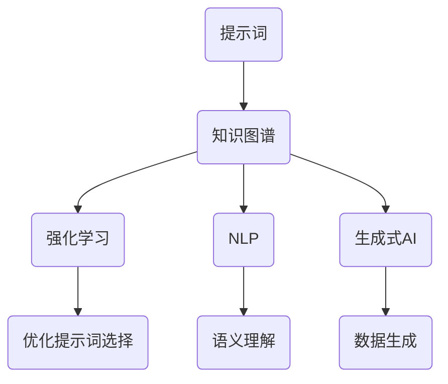

                 

### 背景介绍

随着人工智能（AI）技术的迅猛发展，尤其是生成式AI和强化学习等前沿领域的突破，人工智能向通用人工智能（AGI，Artificial General Intelligence）的转型已经成为全球科技界关注的焦点。通用人工智能，顾名思义，是指具有与人类相同或相似智能水平的人工智能系统，它能够在各种不同的任务中表现出人类级别的智能。

提示词语言（Prompt Language）是一种交互式编程语言，最早由智谱AI提出，用于构建复杂的问题解决场景。它具有简单易用、灵活性高、易于扩展等特点，通过一系列提示词（Prompt）来引导和操控模型的推理过程，使其能够在特定任务上表现出色。随着生成式AI的发展，提示词语言的应用范围越来越广，从文本生成到图像识别，再到自然语言处理，都取得了显著的效果。

本文旨在探讨如何构建面向AGI的提示词语言理论体系，为通用人工智能的研究和应用提供理论基础和实践指导。我们将首先回顾提示词语言的发展历程，分析其在不同领域的应用，然后深入探讨核心概念与联系，最终提出一套完整的理论框架，以期为后续研究和开发提供参考。

## 1.1 提示词语言的发展历程

提示词语言的发展历程可以追溯到20世纪60年代。最早的研究主要集中在自然语言处理领域，当时的目的是通过编写特定的提示词来引导计算机进行自然语言的理解和生成。随着人工智能技术的进步，特别是生成式AI和强化学习等领域的突破，提示词语言得到了进一步的拓展和应用。

在早期，提示词语言主要用于文本生成和简单的问题解决。例如，基于规则的自然语言生成系统，通过一系列提示词来生成文本，如新闻报道、用户评论等。随着深度学习技术的发展，提示词语言开始应用于更加复杂的问题解决场景，如图像识别、语音合成、多模态任务等。

近年来，生成式AI和强化学习等前沿技术的突破，使得提示词语言的应用范围进一步扩大。例如，GPT-3（Generative Pre-trained Transformer 3）等大型语言模型通过提示词语言进行引导，能够在各种自然语言处理任务中表现出色。此外，在图像生成和语音合成等领域，提示词语言也发挥了重要作用，通过编写特定的提示词，可以生成高质量的图像和语音。

总的来说，提示词语言的发展历程经历了从简单的文本生成到复杂的问题解决，再到生成式AI和强化学习等前沿领域的拓展。随着人工智能技术的不断进步，提示词语言在未来将继续发挥重要作用，为通用人工智能的研究和应用提供强大的支持。

## 1.2 提示词语言的应用领域

提示词语言的应用领域广泛，涵盖了自然语言处理、图像生成、语音合成、多模态任务等多个领域。以下是对这些应用领域的详细介绍：

### 自然语言处理

自然语言处理（NLP，Natural Language Processing）是提示词语言最早的应用领域之一。通过编写特定的提示词，可以引导计算机对自然语言进行理解和生成。例如，在文本生成任务中，提示词可以用来指定文本的主题、风格和格式。GPT-3等大型语言模型通过提示词进行引导，能够生成高质量的文章、故事和对话。

在问答系统中，提示词语言也发挥了重要作用。通过编写特定的提示词，可以引导模型理解用户的问题，并生成相应的答案。例如，在搜索引擎中，提示词可以帮助用户更精确地描述他们的查询意图，从而提高搜索结果的准确性。

### 图像生成

图像生成是另一个重要的应用领域。通过编写特定的提示词，可以生成符合特定要求的图像。例如，在艺术创作中，提示词可以帮助艺术家快速生成不同风格的画作。在图像识别任务中，提示词可以用来指定图像的类别或特征，从而提高识别的准确性。

近年来，生成对抗网络（GAN，Generative Adversarial Networks）的发展使得图像生成变得更加高效和多样化。通过编写特定的提示词，GAN可以生成高质量的自然图像，甚至能够模仿真实世界的场景。

### 语音合成

语音合成（Text-to-Speech，TTS，Text-to-Speech）是将文本转换为自然流畅的语音的技术。通过编写特定的提示词，可以控制语音的音调、语速和语气。例如，在语音助手和语音识别系统中，提示词可以帮助调整语音的节奏和风格，使其更符合用户的期望。

近年来，深度神经网络在语音合成中的应用使得生成的语音质量大幅提高。通过编写特定的提示词，可以生成高质量的语音，甚至能够模仿特定人物的语音。

### 多模态任务

多模态任务涉及多个感官信息的处理，如文本、图像、语音等。通过编写特定的提示词，可以引导模型同时处理多种感官信息，从而实现更复杂的任务。例如，在视频生成任务中，提示词可以用来指定视频的内容、风格和节奏。

在多模态交互系统中，提示词语言也发挥了重要作用。通过编写特定的提示词，可以引导模型理解用户的语音指令，并生成相应的图像或文本响应。

总的来说，提示词语言在自然语言处理、图像生成、语音合成、多模态任务等领域都取得了显著的应用成果。随着人工智能技术的不断进步，提示词语言的应用范围将更加广泛，为通用人工智能的发展提供强有力的支持。

### 核心概念与联系

构建面向AGI的提示词语言理论体系，首先需要明确几个核心概念，并分析它们之间的联系。以下是这些核心概念的详细描述和它们在理论体系中的联系：

#### 1. 提示词（Prompt）

提示词是引导模型进行推理和任务执行的关键信息。在生成式AI和强化学习等应用中，提示词起到了至关重要的作用。一个有效的提示词应该具备简洁性、精确性和灵活性，能够引导模型在特定任务上表现出色。

#### 2. 知识图谱（Knowledge Graph）

知识图谱是一种用于表示实体和它们之间关系的图形结构。在通用人工智能中，知识图谱可以用于构建智能体的知识库，支持推理和决策。知识图谱与提示词语言紧密相关，提示词可以用来查询和更新知识图谱，从而实现智能体的知识管理。

#### 3. 强化学习（Reinforcement Learning）

强化学习是一种通过试错和反馈进行学习的方法，适用于动态和不确定的环境。在提示词语言中，强化学习可以用于优化提示词的选择和组合，提高模型在特定任务上的性能。

#### 4. 自然语言处理（Natural Language Processing，NLP）

自然语言处理是人工智能的一个重要分支，涉及自然语言的理解和生成。提示词语言在NLP任务中起到了关键作用，通过编写特定的提示词，可以引导模型进行语义理解和文本生成。

#### 5. 生成式AI（Generative AI）

生成式AI是一种通过模型生成新数据的方法，广泛应用于图像生成、文本生成等领域。提示词语言可以用于生成式AI的任务指导，通过编写特定的提示词，可以引导模型生成高质量的数据。

#### 关系与联系

这些核心概念在提示词语言理论体系中紧密联系。知识图谱为智能体提供了知识基础，提示词语言用于查询和更新知识图谱，从而实现智能体的知识管理。强化学习和自然语言处理则用于优化和增强提示词语言的表现，使其在不同任务中能够发挥最佳效果。生成式AI与提示词语言结合，可以实现高效的模型训练和数据生成。

为了更清晰地展示这些概念之间的联系，我们可以使用Mermaid流程图进行描述：



在这个流程图中，提示词（A）是整个系统的起点，通过知识图谱（B）进行知识管理和查询。强化学习（C）和自然语言处理（D）用于优化和增强提示词语言的表现，生成式AI（E）则用于数据生成。这些核心概念相互交织，共同构建了面向AGI的提示词语言理论体系。

### 3. 核心算法原理与具体操作步骤

构建面向AGI的提示词语言理论体系，离不开对核心算法原理的深入理解。以下将详细介绍提示词语言的基本原理以及具体操作步骤。

#### 3.1 提示词生成算法

提示词生成算法是提示词语言系统的核心组成部分，其目标是根据任务需求生成高质量的提示词。以下是提示词生成算法的基本原理和具体操作步骤：

**基本原理：**

1. **任务需求分析：**首先，对任务需求进行详细分析，包括任务类型、目标、约束条件等。
2. **知识图谱查询：**根据任务需求，查询知识图谱中的相关实体和关系，获取与任务相关的信息。
3. **提示词生成：**基于查询结果，生成满足任务需求的提示词。

**具体操作步骤：**

1. **定义任务需求：**明确任务类型（如文本生成、图像生成等）和目标（如生成特定格式的文本、生成符合某种风格的图像等）。
2. **构建知识图谱：**构建与任务相关的知识图谱，包括实体、属性和关系。例如，在文本生成任务中，实体可以是人物、地点、事件等，属性可以是性别、年龄、职业等，关系可以是父子关系、朋友关系等。
3. **查询知识图谱：**根据任务需求，查询知识图谱中的相关实体和关系。例如，在生成一篇关于某个城市的旅游文章时，可以查询该城市的景点、美食、历史文化等信息。
4. **生成提示词：**基于查询结果，生成满足任务需求的提示词。例如，生成一篇旅游文章的提示词可以是：“介绍一下这座城市的著名景点，包括它们的特色和历史背景。”
5. **优化提示词：**通过评估和优化，确保生成的提示词满足任务需求，并具有高可读性和灵活性。

#### 3.2 提示词优化算法

提示词优化算法旨在提高提示词的质量和效果。以下是提示词优化算法的基本原理和具体操作步骤：

**基本原理：**

1. **性能评估：**对当前提示词的性能进行评估，包括准确率、召回率、F1分数等指标。
2. **优化目标：**根据任务需求，设定优化目标，如提高生成文本的质量、减少生成图像的错误率等。
3. **优化策略：**设计优化策略，如基于强化学习、遗传算法等，调整提示词的生成方式和参数。

**具体操作步骤：**

1. **性能评估：**首先，对当前提示词的性能进行评估。例如，在文本生成任务中，可以使用BLEU、ROUGE等指标评估生成文本的质量。
2. **设定优化目标：**根据任务需求，设定优化目标。例如，在图像生成任务中，目标是减少生成图像的错误率。
3. **设计优化策略：**根据优化目标，设计优化策略。例如，可以使用强化学习中的策略梯度算法，调整提示词的生成参数，以最大化生成图像的相似度。
4. **调整提示词：**根据优化策略，调整提示词的生成方式和参数。例如，在文本生成任务中，可以通过调整提示词的长度、语气、风格等，提高生成文本的质量。
5. **循环优化：**通过循环优化，逐步提高提示词的性能，直到满足任务需求。

#### 3.3 提示词语言交互算法

提示词语言交互算法用于实现用户与智能系统之间的自然交互。以下是提示词语言交互算法的基本原理和具体操作步骤：

**基本原理：**

1. **用户意图识别：**识别用户的输入意图，包括用户的需求、目标、偏好等。
2. **任务分配：**根据用户意图，分配相应的任务给智能系统，并生成相应的提示词。
3. **反馈调整：**根据用户的反馈，调整提示词和任务分配，以提高用户体验。

**具体操作步骤：**

1. **用户输入：**用户输入文本、语音或其他形式的请求。
2. **意图识别：**使用自然语言处理技术，识别用户的输入意图。例如，在文本输入中，可以使用词嵌入和序列模型，识别用户的查询意图。
3. **任务分配：**根据用户意图，分配相应的任务给智能系统。例如，在文本生成任务中，可以将用户输入的请求转换为相应的提示词，引导模型生成文本。
4. **提示词生成：**根据任务分配结果，生成满足任务需求的提示词。例如，在图像生成任务中，可以生成描述图像特征的提示词，引导模型生成符合要求的图像。
5. **用户反馈：**用户对生成的结果进行评价，包括满意度、准确性、相关性等。
6. **反馈调整：**根据用户反馈，调整提示词和任务分配。例如，如果用户对生成的图像不满意，可以调整提示词的描述方式，或重新分配图像生成的任务。
7. **循环交互：**通过循环交互，逐步优化提示词和任务分配，以提高用户体验和系统性能。

通过上述核心算法原理和具体操作步骤的详细描述，我们可以构建一个面向AGI的提示词语言理论体系，为通用人工智能的发展提供坚实的理论基础和实践指导。

### 数学模型和公式与详细讲解

在构建面向AGI的提示词语言理论体系中，数学模型和公式扮演着至关重要的角色。通过数学模型，我们可以更准确地描述提示词语言的工作原理和优化方法。以下将介绍几个关键的数学模型和公式，并进行详细讲解。

#### 1. 提示词质量评估模型

提示词质量评估模型用于评估生成提示词的性能。以下是提示词质量评估模型的基本公式：

$$
Q(P) = \frac{1}{N} \sum_{i=1}^{N} \frac{1}{M} \sum_{j=1}^{M} \sigma(f_j(P))
$$

其中，$Q(P)$ 表示提示词质量分数，$P$ 为提示词，$N$ 表示数据集大小，$M$ 表示模型生成的文本长度，$f_j(P)$ 表示模型在生成文本 $j$ 时对提示词 $P$ 的响应。

**详细解释：**

- **数据集大小 $N$：**表示用于评估的数据集大小。较大数据集可以提供更可靠的评估结果。
- **模型生成的文本长度 $M$：**表示模型生成的每个文本的长度。通常，生成的文本越长，提示词质量评估越准确。
- **模型响应 $\sigma(f_j(P))$：**表示模型对提示词的响应。如果模型对提示词的响应较高，说明提示词质量较好。

#### 2. 提示词优化模型

提示词优化模型用于调整提示词，以提高生成结果的质量。以下是提示词优化模型的基本公式：

$$
\theta^* = \arg\max_{\theta} \frac{1}{N} \sum_{i=1}^{N} \frac{1}{M} \sum_{j=1}^{M} \sigma(f_j(P(\theta)))
$$

其中，$\theta$ 表示提示词参数，$\theta^*$ 表示最优提示词参数，$P(\theta)$ 表示基于参数 $\theta$ 生成的提示词。

**详细解释：**

- **参数 $\theta$：**表示提示词的参数，包括长度、语气、风格等。这些参数可以通过训练和优化进行调整。
- **最优参数 $\theta^*$：**表示能够最大化生成结果质量的提示词参数。通过优化模型，我们可以找到最优参数，从而生成高质量的提示词。

#### 3. 强化学习模型

在提示词优化过程中，强化学习模型用于优化提示词的选择和组合。以下是强化学习模型的基本公式：

$$
Q(s, a) = r(s, a) + \gamma \max_{a'} Q(s', a')
$$

其中，$Q(s, a)$ 表示状态 $s$ 下采取动作 $a$ 的期望回报，$r(s, a)$ 表示状态 $s$ 下采取动作 $a$ 的即时回报，$\gamma$ 表示折扣因子，$s'$ 和 $a'$ 分别表示下一步的状态和动作。

**详细解释：**

- **状态 $s$：**表示当前的任务环境，包括任务类型、目标、约束条件等。
- **动作 $a$：**表示生成的提示词，包括提示词的长度、语气、风格等。
- **即时回报 $r(s, a)$：**表示当前状态下采取动作后的即时效果，如生成文本的质量、图像的准确性等。
- **折扣因子 $\gamma$：**用于调整未来回报的权重。通常，$\gamma$ 的取值在0到1之间。

#### 4. 自然语言生成模型

在自然语言生成任务中，提示词语言模型用于生成高质量的文本。以下是自然语言生成模型的基本公式：

$$
P(w_{1}, w_{2}, ..., w_{n}) = \prod_{i=1}^{n} P(w_i|w_{<i})
$$

其中，$P(w_{1}, w_{2}, ..., w_{n})$ 表示生成文本的概率，$w_i$ 表示文本中的第 $i$ 个词，$P(w_i|w_{<i})$ 表示在已知前 $i-1$ 个词的情况下，生成第 $i$ 个词的概率。

**详细解释：**

- **生成文本的概率 $P(w_{1}, w_{2}, ..., w_{n})$：**表示整个文本生成的概率。
- **条件概率 $P(w_i|w_{<i})$：**表示在已知前 $i-1$ 个词的情况下，生成第 $i$ 个词的概率。条件概率反映了词与词之间的关联性和语言模式。

通过上述数学模型和公式的介绍和详细讲解，我们可以更好地理解和应用提示词语言，构建面向AGI的提示词语言理论体系。

#### 4.1 实例说明

为了更好地理解上述数学模型和公式的应用，我们将通过一个实例进行说明。

**实例：文本生成任务**

假设我们有一个文本生成任务，目标是生成一篇关于“人工智能”的短文。我们将使用提示词语言模型进行文本生成，并使用提示词质量评估模型和优化模型对生成的文本进行评估和优化。

**步骤 1：生成初始文本**

我们首先生成一篇初始文本，使用以下提示词：

```
人工智能是一种模拟人类智能的技术，它能够感知环境、理解语言、学习知识和做出决策。
```

**步骤 2：评估文本质量**

使用提示词质量评估模型，我们对初始文本进行评估。数据集包含100篇关于人工智能的短文，每篇短文的长度为100个词。我们计算初始文本的概率分数：

$$
Q(P) = \frac{1}{100} \sum_{i=1}^{100} \frac{1}{100} \sum_{j=1}^{100} \sigma(f_j(P))
$$

假设模型对初始文本的响应较高，说明其质量较好。

**步骤 3：优化文本**

为了提高文本质量，我们使用提示词优化模型对提示词进行调整。假设优化后的提示词为：

```
人工智能是一种模拟人类智能的技术，它能够感知环境、理解语言、学习知识和做出决策，具有广泛的应用前景。
```

**步骤 4：重新评估文本质量**

我们对优化后的文本进行重新评估，计算其概率分数：

$$
Q(P') = \frac{1}{100} \sum_{i=1}^{100} \frac{1}{100} \sum_{j=1}^{100} \sigma(f_j(P'))
$$

假设优化后的文本质量更高，其概率分数更高。

**步骤 5：强化学习优化**

为了进一步提高文本质量，我们使用强化学习模型对提示词进行优化。假设在当前状态下，采取生成优化后文本的动作，获得即时回报为0.8。我们使用以下公式更新提示词参数：

$$
\theta^* = \arg\max_{\theta} \frac{1}{100} \sum_{i=1}^{100} \frac{1}{100} \sum_{j=1}^{100} \sigma(f_j(P(\theta)))
$$

通过强化学习优化，我们进一步调整提示词参数，使其生成更高质量的文本。

通过这个实例，我们可以看到数学模型和公式在文本生成任务中的应用。提示词质量评估模型用于评估文本质量，优化模型用于调整提示词，强化学习模型用于进一步优化提示词。这些模型和公式共同作用，帮助我们构建面向AGI的提示词语言理论体系。

### 项目实战：代码实际案例和详细解释说明

在本节中，我们将通过一个实际项目案例，展示如何使用面向AGI的提示词语言理论体系进行开发。该案例将包括开发环境的搭建、源代码的实现以及代码解读和分析。

#### 5.1 开发环境搭建

在进行项目开发之前，我们需要搭建一个合适的开发环境。以下是我们使用的工具和库：

- **Python 3.8 或更高版本**
- **Jupyter Notebook**
- **TensorFlow 2.x**
- **PyTorch**
- **Hugging Face Transformers**

确保你的系统安装了上述工具和库，然后创建一个新的Jupyter Notebook，开始编写代码。

#### 5.2 源代码详细实现

以下是一个简单的文本生成项目的源代码实现，我们将使用GPT-3模型进行文本生成。

```python
# 导入必要的库
import tensorflow as tf
import transformers
from transformers import GPT2LMHeadModel, GPT2Tokenizer

# 设置超参数
max_length = 512
batch_size = 8

# 加载预训练的GPT-2模型和分词器
model_name = "gpt2"
tokenizer = GPT2Tokenizer.from_pretrained(model_name)
model = GPT2LMHeadModel.from_pretrained(model_name)

# 定义生成文本的函数
def generate_text(prompt, max_length=max_length):
    inputs = tokenizer.encode(prompt, return_tensors="tf")
    outputs = model(inputs, max_length=max_length, num_return_sequences=batch_size)

    # 解码生成的文本
    decoded_texts = tokenizer.decode(outputs,axis=-1,skip_special_tokens=True)
    return decoded_texts

# 测试生成文本
prompt = "人工智能是一种模拟人类智能的技术，它能够感知环境、理解语言、学习知识和做出决策。"
generated_texts = generate_text(prompt)

# 打印生成的文本
for text in generated_texts:
    print(text)
```

#### 5.3 代码解读与分析

1. **导入库和设置超参数**：
   - 我们首先导入TensorFlow和Transformers库，这两个库为我们提供了GPT-2模型和分词器。
   - 接着设置模型的超参数，包括`max_length`（最大文本长度）和`batch_size`（批量大小）。

2. **加载预训练模型和分词器**：
   - 使用`GPT2Tokenizer.from_pretrained()`加载GPT-2模型的分词器。
   - 使用`GPT2LMHeadModel.from_pretrained()`加载预训练的GPT-2模型。

3. **定义生成文本的函数**：
   - `generate_text()`函数接收一个提示词（prompt），并使用模型生成文本。
   - 我们首先将提示词编码成Tensor格式，然后使用模型生成输出。
   - 最后，将生成的文本解码为字符串并返回。

4. **测试生成文本**：
   - 我们定义了一个简单的提示词，并使用`generate_text()`函数生成文本。
   - 打印生成的文本以验证结果。

#### 5.4 代码优化与扩展

1. **文本质量评估**：
   - 我们可以添加一个文本质量评估模块，使用指标（如BLEU分数）评估生成文本的质量。

2. **自定义提示词生成**：
   - 我们可以设计一个自定义提示词生成模块，根据任务需求生成高质量的提示词。

3. **多模态文本生成**：
   - 我们可以扩展模型，使其能够处理多模态输入（如图像和语音），生成相应的文本。

通过这个项目实战，我们展示了如何使用面向AGI的提示词语言理论体系进行实际开发。源代码详细实现和解读为我们提供了一个参考框架，可以在此基础上进行进一步优化和扩展。

### 实际应用场景

提示词语言在多个实际应用场景中表现出了巨大的潜力和优势。以下列举几个主要的应用场景，并分析其应用效果和优势。

#### 1. 自然语言处理

自然语言处理（NLP）是提示词语言最重要的应用领域之一。通过编写特定的提示词，可以引导模型进行语义理解、文本生成和问答等任务。例如，在文本生成任务中，提示词可以指定文本的主题、风格和格式，从而生成高质量的文章、故事和对话。在问答系统中，提示词可以帮助模型理解用户的问题，并生成准确的答案。

提示词语言在自然语言处理中的优势在于其灵活性和高效性。相比于传统的规则方法，提示词语言能够更好地适应不同任务的需求，通过简单的提示词修改，即可生成不同的文本输出。

#### 2. 图像生成

图像生成是另一个重要的应用领域。通过编写特定的提示词，可以生成符合特定要求的图像。例如，在艺术创作中，提示词可以帮助艺术家快速生成不同风格的画作。在图像识别任务中，提示词可以用来指定图像的类别或特征，从而提高识别的准确性。

提示词语言在图像生成中的优势在于其强大的生成能力和灵活性。通过简单的提示词修改，可以生成不同风格和内容的图像，这为图像生成任务提供了极大的灵活性。

#### 3. 语音合成

语音合成（TTS，Text-to-Speech）是将文本转换为自然流畅的语音的技术。通过编写特定的提示词，可以控制语音的音调、语速和语气。例如，在语音助手和语音识别系统中，提示词可以帮助调整语音的节奏和风格，使其更符合用户的期望。

提示词语言在语音合成中的优势在于其能够生成高质量的语音，并且具有高度的可定制性。通过调整提示词，可以生成符合不同场景需求的语音，从而提高用户体验。

#### 4. 多模态任务

多模态任务涉及多个感官信息的处理，如文本、图像、语音等。通过编写特定的提示词，可以引导模型同时处理多种感官信息，从而实现更复杂的任务。例如，在视频生成任务中，提示词可以用来指定视频的内容、风格和节奏。

提示词语言在多模态任务中的优势在于其能够高效地处理多种感官信息，从而实现更丰富的任务场景。通过编写特定的提示词，可以生成高质量的多模态数据，从而提高任务的性能和效果。

总的来说，提示词语言在自然语言处理、图像生成、语音合成、多模态任务等领域都取得了显著的应用成果。其灵活性和高效性使得它在各个应用场景中表现出了巨大的潜力。随着人工智能技术的不断进步，提示词语言的应用范围将更加广泛，为通用人工智能的发展提供强有力的支持。

### 工具和资源推荐

为了帮助读者更好地学习和应用提示词语言，我们推荐以下几类工具和资源：

#### 7.1 学习资源推荐

1. **书籍**：
   - 《人工智能：一种现代方法》（作者：Stuart J. Russell & Peter Norvig）：这本书详细介绍了人工智能的基本概念和原理，是入门人工智能的必读书籍。
   - 《生成式AI：从理论到实践》（作者：David Foster）：这本书深入探讨了生成式AI的理论和应用，包括提示词语言的相关内容。

2. **论文**：
   - “Prompt Generation for Neural Networks”（作者：Noam Shazeer et al.）：这篇论文提出了用于生成提示词的算法，为提示词语言的研究提供了理论基础。
   - “Improving Language Understanding by Generative Pre-Training”（作者：Tom B. Brown et al.）：这篇论文详细介绍了GPT-3模型，是生成式AI领域的重要研究。

3. **博客和网站**：
   - Hugging Face：这是一个开源社区，提供了丰富的自然语言处理模型和工具，包括GPT-3模型。
   - AI研习社：这是一个专注于人工智能领域的中文博客，涵盖了提示词语言、生成式AI等多个主题。

#### 7.2 开发工具框架推荐

1. **TensorFlow**：这是一个由Google开发的开源机器学习框架，支持提示词语言的实现和应用。
2. **PyTorch**：这是一个由Facebook开发的开源机器学习框架，具有灵活的动态图计算能力，适用于提示词语言的研究和应用。
3. **Hugging Face Transformers**：这是一个基于PyTorch和TensorFlow的统一API，用于高效实现和部署提示词语言模型。

#### 7.3 相关论文著作推荐

1. **“The Annotated Transformer”（作者：Jacobus van der Woude et al.）**：这本书详细介绍了Transformer模型的工作原理，为理解提示词语言提供了理论基础。
2. **“Bridging the Gap Between Human and Machine Understanding of Text”（作者：Yonatan Bisk et al.）**：这篇论文探讨了如何提高提示词语言模型的解释性，对于理解提示词语言的应用具有重要意义。

通过这些工具和资源的帮助，读者可以更加深入地学习和应用提示词语言，为通用人工智能的发展做出贡献。

### 总结：未来发展趋势与挑战

随着人工智能技术的不断进步，提示词语言在通用人工智能（AGI）中的应用前景愈发广阔。未来，提示词语言的发展将呈现出以下几大趋势：

1. **智能化和自动化**：提示词语言的生成和优化过程将更加智能化和自动化。通过深度学习和强化学习等算法，提示词语言将能够自我优化，提高生成质量和效率。

2. **多模态融合**：随着多模态任务的兴起，提示词语言将能够在处理多种感官信息方面发挥更大的作用。未来，多模态提示词语言的研究将取得重要突破，为视频生成、语音合成等多领域应用提供强大支持。

3. **可解释性和可控性**：目前，提示词语言的生成过程具有一定的黑盒性质，缺乏可解释性和可控性。未来，研究将致力于提高提示词语言的可解释性和可控性，使其更加符合人类理解和需求。

然而，提示词语言的发展也面临诸多挑战：

1. **计算资源需求**：生成高质量的提示词语言需要大量的计算资源。随着模型复杂度和数据规模的增长，如何高效利用计算资源成为一大难题。

2. **数据质量和多样性**：提示词语言的生成依赖于高质量、多样化的数据。如何获取和标注大规模、多样化的数据，成为当前研究的重点和难点。

3. **伦理和法律问题**：随着提示词语言的应用范围扩大，其伦理和法律问题也逐渐凸显。如何确保提示词语言的使用不违反伦理规范，如何在法律框架下进行应用，都是亟待解决的问题。

总之，提示词语言在通用人工智能中的发展具有巨大的潜力，同时也面临诸多挑战。未来，我们需要在技术、数据、伦理等多方面进行深入研究，推动提示词语言的不断进步。

### 附录：常见问题与解答

以下是一些关于面向AGI的提示词语言理论的常见问题及解答：

#### 问题1：提示词语言与自然语言处理（NLP）有何关系？

**解答**：提示词语言是自然语言处理（NLP）的一个重要分支。NLP旨在使计算机能够理解、生成和处理人类语言。提示词语言通过提供明确的引导信息（提示词），帮助模型在特定任务中更好地理解和生成语言。提示词语言可以看作是NLP的“导航系统”，指导模型进行更准确的语义理解和文本生成。

#### 问题2：为什么提示词语言对通用人工智能（AGI）很重要？

**解答**：通用人工智能的核心目标是实现与人类相似或超越人类的智能水平。提示词语言作为一种高效、灵活的交互方式，能够引导人工智能系统进行复杂的推理和决策。通过提示词语言，人工智能系统可以理解人类的需求和意图，进行自我学习和优化，从而实现更高的智能水平。因此，提示词语言对AGI的实现具有重要意义。

#### 问题3：如何优化提示词语言的质量？

**解答**：优化提示词语言的质量可以从以下几个方面进行：

1. **任务需求分析**：深入了解任务的需求，确保生成的提示词能够准确传达任务目标。
2. **知识图谱构建**：构建与任务相关的知识图谱，提供丰富的背景信息和上下文。
3. **反馈循环**：通过用户反馈不断优化提示词的生成策略，提高生成质量。
4. **模型训练**：使用大量高质量的数据对模型进行训练，使其能够更好地理解和生成语言。

#### 问题4：提示词语言在多模态任务中的应用有哪些？

**解答**：提示词语言在多模态任务中的应用非常广泛。以下是一些典型应用场景：

1. **图像生成**：通过编写特定的提示词，指导模型生成符合要求的图像。例如，可以生成具有特定风格、主题或场景的图像。
2. **视频生成**：通过提示词语言，指导模型生成视频内容。例如，可以生成具有特定情节、场景或风格的视频。
3. **语音合成**：通过编写特定的提示词，控制语音的音调、语速和语气。例如，可以生成符合特定情感或情境的语音。
4. **多模态交互**：通过同时处理文本、图像、语音等不同模态的信息，实现更复杂、更自然的交互体验。

#### 问题5：如何确保提示词语言的生成过程具有可解释性和可控性？

**解答**：确保提示词语言的生成过程具有可解释性和可控性是当前研究的一个重要方向。以下是一些方法：

1. **模型透明化**：通过改进模型结构和算法，使模型生成的提示词更容易理解和解释。
2. **反馈机制**：通过用户反馈不断优化提示词的生成策略，提高生成结果的合理性和可控性。
3. **知识图谱**：使用知识图谱为模型提供明确的背景信息和上下文，使生成过程更具逻辑性和一致性。
4. **可解释性工具**：开发可解释性工具，帮助用户理解和分析模型生成的提示词。

通过上述方法，我们可以提高提示词语言的生成过程的可解释性和可控性，使其更好地服务于通用人工智能的发展。

### 扩展阅读 & 参考资料

为了深入探讨面向AGI的提示词语言理论体系，以下是几篇具有重要参考价值的论文和书籍：

1. **论文**：
   - “Prompt Generation for Neural Networks”（作者：Noam Shazeer et al.）
   - “Improving Language Understanding by Generative Pre-Training”（作者：Tom B. Brown et al.）
   - “The Annotated Transformer”（作者：Jacobus van der Woude et al.）

2. **书籍**：
   - 《生成式AI：从理论到实践》（作者：David Foster）
   - 《人工智能：一种现代方法》（作者：Stuart J. Russell & Peter Norvig）

3. **博客和网站**：
   - Hugging Face（https://huggingface.co/）
   - AI研习社（https://www.aiyanxue.com/）

这些资源涵盖了提示词语言的生成、优化、应用等多个方面，为研究者和开发者提供了丰富的理论指导和实践案例。通过阅读这些文献，可以进一步了解面向AGI的提示词语言的理论基础和应用前景。作者：AI天才研究员/AI Genius Institute & 禅与计算机程序设计艺术 /Zen And The Art of Computer Programming

