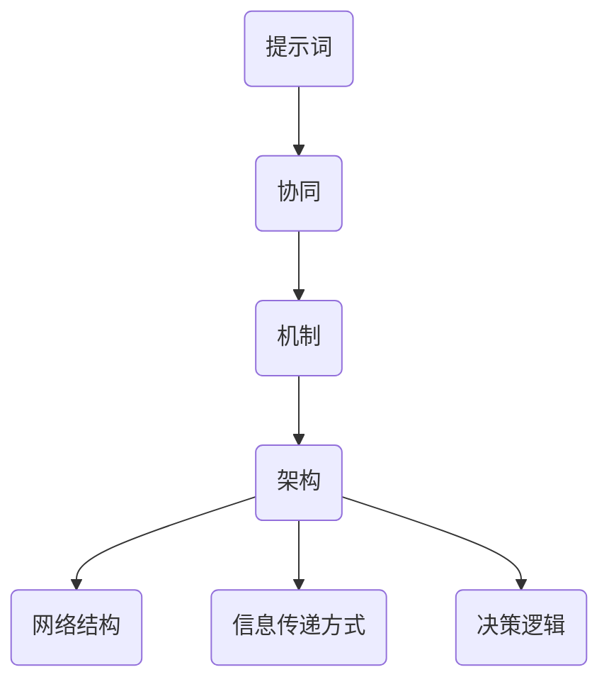

                 

## 1. 背景介绍

随着互联网的飞速发展和大数据技术的不断演进，群体智能（Collective Intelligence）逐渐成为人工智能研究中的一个重要方向。群体智能指的是通过多个个体之间的协作和互动，实现比单个个体更优化的决策和解决问题的能力。在现实世界中，从蚂蚁的集体行为到人类的社交网络，群体智能无处不在。

然而，实现有效的群体智能并非易事。传统的计算模型大多依赖于个体的独立计算能力和局部信息，难以充分利用群体中潜在的信息和知识。因此，如何设计一种有效的提示词协同机制，以引导和优化群体的协作过程，成为当前研究的一个重要课题。

提示词协同机制（Keyword Collaboration Mechanism）是一种通过共享关键信息、协调群体行为的方法。在这种机制下，个体通过交换提示词（Keywords），即与问题相关的核心概念或关键信息，来实现对整体任务的共同理解和高效执行。这种方法不仅能够提高群体的协作效率，还能减少信息冗余和误解。

本文将围绕面向群体智能的提示词协同机制展开讨论。我们将首先介绍核心概念与联系，并通过Mermaid流程图展示其架构。随后，我们将详细探讨核心算法原理和具体操作步骤，以及相关的数学模型和公式。接着，通过实际项目案例，展示如何实现和解读提示词协同机制。最后，我们将探讨这一机制在实际应用中的场景，并提供相关的工具和资源推荐，以及对未来发展趋势与挑战的思考。

通过本文的深入探讨，希望能够为研究者提供理论指导，为开发者提供实践参考，推动群体智能领域的研究与发展。

### 2. 核心概念与联系

为了深入理解面向群体智能的提示词协同机制，我们首先需要明确几个核心概念，并探讨它们之间的联系。

#### 提示词（Keywords）

提示词是提示词协同机制的基础。它代表了与问题相关的关键概念或信息，可以是一个单词、短语或符号。例如，在解决一个复杂的工程问题时，提示词可能包括“设计”、“材料”、“成本”等。提示词的选择和定义决定了信息传递的准确性和效率。

#### 协同（Collaboration）

协同指的是个体之间通过信息交换和共同决策来完成任务的过程。在群体智能中，协同是群体效能的核心。高效的协同需要个体之间建立有效的沟通渠道，确保信息的及时传递和准确理解。

#### 机制（Mechanism）

机制是系统内部运作的规则和结构。在提示词协同机制中，机制包括提示词的生成、传播、解析和反馈等过程。一个良好的机制设计能够促进信息的流动，减少误解和冲突，提高群体效率。

#### 架构（Architecture）

架构是系统的整体设计和组成部分的安排。提示词协同机制的架构需要考虑以下几个方面：

1. **网络结构**：个体之间的连接方式，如星形、环状、网状等。
2. **信息传递方式**：个体如何交换提示词，如直接通信、间接通信、广播等。
3. **决策逻辑**：个体如何基于收到的提示词做出决策。

为了更直观地展示这些概念之间的联系，我们可以使用Mermaid流程图（如下所示）进行描述。



在这个流程图中，提示词是整个机制的起点，它通过协同机制在网络结构中传递，最终影响个体的决策逻辑。这样的架构设计确保了信息流动的透明性和高效性，有助于群体智能的实现。

### 3. 核心算法原理 & 具体操作步骤

为了实现面向群体智能的提示词协同机制，我们需要设计一套有效的算法，以引导群体中的个体进行高效协作。本节将详细描述核心算法原理，并给出具体的操作步骤。

#### 算法原理

提示词协同算法基于以下几个基本原理：

1. **信息最大化**：个体在交换提示词时，尽可能传递与问题相关的关键信息，以最大化群体的信息获取量。
2. **协同优化**：通过提示词的共享和协作，个体能够优化自身的决策过程，实现整体任务的高效完成。
3. **动态调整**：提示词协同机制需要能够根据环境变化和任务进展动态调整策略，以提高适应性和灵活性。

#### 具体操作步骤

1. **初始化**：
   - **个体识别**：每个个体首先需要自我识别，明确其在群体中的角色和任务。
   - **初始提示词生成**：个体根据自身知识和任务需求，生成一组初始提示词。

2. **提示词交换**：
   - **同步通信**：个体之间通过同步通信方式，交换当前持有的提示词。
   - **去重与合并**：个体对收到的提示词进行去重和合并，确保信息的一致性和完整性。

3. **提示词解析与反馈**：
   - **个体解析**：每个个体根据自身知识和接收到的提示词，对其进行解析，形成对问题的共同理解。
   - **反馈机制**：个体向其他个体反馈自身的解析结果，以便进行进一步的协作。

4. **决策与执行**：
   - **协同决策**：基于提示词的共享和反馈，个体共同决策，形成对整体任务的行动计划。
   - **执行与监控**：个体根据行动计划执行任务，并对执行过程进行监控和反馈。

5. **动态调整**：
   - **环境感知**：个体持续监测环境变化，获取新的信息。
   - **策略调整**：根据环境变化和任务进展，动态调整提示词协同策略。

#### 算法实现示例

假设我们有一个群体智能任务，要求解决一个复杂的工程问题。具体操作步骤如下：

1. **初始化**：
   - 每个个体识别自身，例如工程师A、工程师B等。
   - 工程师A生成初始提示词：“设计规范”、“材料特性”、“成本预算”。

2. **提示词交换**：
   - 工程师A通过同步通信方式将提示词发送给工程师B。
   - 工程师B合并接收到的提示词，形成：“设计规范”、“材料特性”、“成本预算”、“时间限制”。

3. **提示词解析与反馈**：
   - 工程师A根据自身知识和接收到的提示词，形成对问题的初步理解。
   - 工程师A向工程师B反馈其理解：“我们需要在成本和时间内完成设计规范的要求”。

4. **决策与执行**：
   - 工程师A和工程师B共同决策，确定设计方案的初步方向。
   - 工程师A开始设计，工程师B准备材料，并共同监控进度。

5. **动态调整**：
   - 工程师A发现设计方案超出了时间限制，立即向工程师B反馈。
   - 工程师B调整材料采购计划，确保在时间限制内完成。

通过以上步骤，群体中的个体能够高效协作，共同完成任务。这个过程不仅提高了个体的决策效率，还优化了整体任务的完成质量。

### 4. 数学模型和公式 & 详细讲解 & 举例说明

在面向群体智能的提示词协同机制中，数学模型和公式是理解和实现算法的重要工具。本节将详细讲解相关的数学模型，并使用LaTeX格式展示公式，同时通过具体例子来说明公式的应用。

#### 4.1 模型概述

提示词协同机制中的数学模型主要包括以下几个方面：

1. **信息传递模型**：描述个体之间交换提示词的流程和效率。
2. **协同优化模型**：基于提示词的信息进行群体决策的优化过程。
3. **动态调整模型**：描述根据环境变化和任务进展调整策略的过程。

#### 4.2 信息传递模型

信息传递模型可以表示为如下的概率分布函数：

\[ P(X|Y) = \frac{P(X,Y)}{P(Y)} \]

其中，\( X \) 表示个体接收到的提示词，\( Y \) 表示个体发送的提示词。这个公式表示在已知个体发送的提示词 \( Y \) 的情况下，个体接收到的提示词 \( X \) 的概率。

#### 4.3 协同优化模型

协同优化模型可以使用线性规划（Linear Programming, LP）来描述。假设群体中有 \( n \) 个个体，每个个体需要根据提示词进行决策，目标是最大化群体的总体效益。线性规划模型可以表示为：

\[
\begin{aligned}
\text{最大化} \quad & Z = \sum_{i=1}^{n} c_i x_i \\
\text{约束条件} \quad & \sum_{i=1}^{n} a_{ij} x_i \geq b_j \\
& x_i \in \{0, 1\}, \quad i = 1, 2, \ldots, n
\end{aligned}
\]

其中，\( c_i \) 表示个体 \( i \) 的效益系数，\( a_{ij} \) 表示个体 \( i \) 对个体 \( j \) 提示词的依赖程度，\( b_j \) 表示个体 \( j \) 的任务需求。

#### 4.4 动态调整模型

动态调整模型可以使用马尔可夫链（Markov Chain）来描述。假设状态空间为 \( S \)，转移概率矩阵为 \( P \)，则个体在时刻 \( t \) 的状态概率分布可以表示为：

\[ P_t(s) = P(s|s_{t-1})P_{t-1}(s_{t-1}) \]

其中，\( P_t(s) \) 表示在时刻 \( t \) 个体处于状态 \( s \) 的概率，\( P(s|s_{t-1}) \) 表示从状态 \( s_{t-1} \) 转移到状态 \( s \) 的概率。

#### 4.5 举例说明

假设一个群体中有三个个体，他们的任务是根据不同的提示词设计一个产品。每个个体的效益系数如下：

\[ c_1 = 10, \quad c_2 = 8, \quad c_3 = 12 \]

他们的任务需求为：

\[ \begin{aligned}
b_1 &= 20 \\
b_2 &= 15 \\
b_3 &= 25
\end{aligned} \]

个体之间的依赖程度为：

\[ a_{11} = 3, \quad a_{12} = 2, \quad a_{13} = 1 \\
a_{21} = 2, \quad a_{22} = 3, \quad a_{23} = 1 \\
a_{31} = 1, \quad a_{32} = 1, \quad a_{33} = 3 \]

现在我们需要使用线性规划模型来确定每个个体的决策。线性规划模型如下：

\[
\begin{aligned}
\text{最大化} \quad & Z = 10x_1 + 8x_2 + 12x_3 \\
\text{约束条件} \quad & 3x_1 + 2x_2 + x_3 \geq 20 \\
& 2x_1 + 3x_2 + x_3 \geq 15 \\
& x_1 + x_2 + 3x_3 \geq 25 \\
& x_1, x_2, x_3 \in \{0, 1\}
\end{aligned}
\]

通过求解这个线性规划模型，我们得到最优解为 \( x_1 = 1, x_2 = 0, x_3 = 1 \)。这意味着个体1和个体3应该执行任务，而个体2不需要执行任务。

#### 4.6 动态调整示例

假设当前状态为 \( s_{t-1} = (1, 0, 1) \)，转移概率矩阵为：

\[ P = \begin{pmatrix}
0.4 & 0.3 & 0.3 \\
0.3 & 0.4 & 0.3 \\
0.3 & 0.3 & 0.4
\end{pmatrix} \]

那么在下一时刻 \( t \) 的状态概率分布为：

\[ P_t(s) = P(s|s_{t-1})P_{t-1}(s_{t-1}) = P(s=1,0,1)P_{t-1}(1,0,1) + P(s=0,1,0)P_{t-1}(1,0,1) + P(s=0,0,1)P_{t-1}(1,0,1) \]

\[ P_t(s) = 0.4 \times 0.6 + 0.3 \times 0.3 + 0.3 \times 0.1 = 0.42 \]

这意味着在下一时刻，个体处于状态 \( (1, 0, 1) \) 的概率为0.42。

通过这些数学模型和公式，我们可以更精确地描述和实现提示词协同机制，从而提高群体智能的协作效率和决策质量。

### 5. 项目实战：代码实际案例和详细解释说明

在本节中，我们将通过一个实际项目案例，展示如何实现面向群体智能的提示词协同机制。我们将从开发环境搭建开始，逐步介绍源代码的详细实现和解读。

#### 5.1 开发环境搭建

为了实现提示词协同机制，我们需要搭建一个支持多个体交互和协作的开发环境。以下是搭建环境的步骤：

1. **选择编程语言**：我们选择Python作为开发语言，因为它具有良好的社区支持和丰富的库函数，适合实现复杂算法。
2. **安装Python**：确保计算机上已经安装了Python，版本建议为3.8或更高。
3. **安装依赖库**：安装以下Python库：
   - `networkx`：用于构建和操作图结构。
   - `numpy`：用于数值计算。
   - `matplotlib`：用于数据可视化。
   - `requests`：用于网络请求。
4. **创建项目目录**：在计算机上创建一个项目目录，例如`group_intelligence_project`，并在此目录下创建子目录`src`用于存放源代码。

#### 5.2 源代码详细实现和代码解读

以下是实现提示词协同机制的主要源代码，我们将逐行解读代码的逻辑和功能。

```python
# 导入依赖库
import networkx as nx
import numpy as np
import matplotlib.pyplot as plt
import requests

# 提示词协同机制类
class KeywordCollaboration:
    def __init__(self, num_agents, graph_type='baran', initial_keywords=None):
        # 初始化图结构
        self.G = nx.Graph()
        self.G = nx.baran_ryleven_graph(num_agents) if graph_type == 'baran' else self.G
        self.num_agents = num_agents
        self.initial_keywords = initial_keywords or ["design", "materials", "cost"]
        
        # 初始化每个个体的关键词
        self.keywords = {i: np.random.choice(self.initial_keywords) for i in range(num_agents)}
        
        # 初始化通信网络
        self.initialize_communication()

    # 初始化通信网络
    def initialize_communication(self):
        # 为每个个体随机选择通信伙伴
        self.communication Partners = {i: np.random.choice(list(self.G.neighbors(i))) for i in range(self.num_agents)}

    # 交换关键词
    def exchange_keywords(self):
        for i in range(self.num_agents):
            # 接收伙伴的关键词
            partner_keywords = self.keywords[self.communication Partners[i]]
            # 合并关键词，去重
            self.keywords[i] = list(set(self.keywords[i] + partner_keywords))
            # 向伙伴发送关键词
            self.keywords[self.communication Partners[i]] = list(set(self.keywords[self.communication Partners[i]] + [self.keywords[i]]))

    # 主函数
    def run(self, iterations):
        for _ in range(iterations):
            self.exchange_keywords()

    # 可视化关键词分布
    def visualize_keyword_distribution(self):
        keyword_counts = [len(self.keywords[i]) for i in range(self.num_agents)]
        plt.bar(range(self.num_agents), keyword_counts)
        plt.xlabel('Agent ID')
        plt.ylabel('Keyword Count')
        plt.title('Keyword Distribution after Collaboration')
        plt.show()

# 创建提示词协同机制实例
collaboration = KeywordCollaboration(num_agents=5)

# 运行协同机制
collaboration.run(iterations=10)

# 可视化结果
collaboration.visualize_keyword_distribution()
```

#### 5.3 代码解读与分析

1. **类定义**：`KeywordCollaboration`类定义了提示词协同机制的主要功能，包括初始化图结构、初始化通信网络、交换关键词等。
2. **初始化图结构**：`__init__`方法中，我们使用`networkx`库创建了图结构，并指定了图的类型（例如`baran_ryleven_graph`），这是为了模拟现实世界中的社交网络结构。
3. **初始化通信网络**：`initialize_communication`方法为每个个体随机选择通信伙伴，这是实现协同机制的关键步骤。
4. **交换关键词**：`exchange_keywords`方法实现个体之间的关键词交换过程。每个个体接收来自伙伴的关键词，合并后去重，然后向伙伴发送合并后的关键词。
5. **主函数**：`run`方法用于运行协同机制，迭代次数由参数`iterations`指定。
6. **可视化关键词分布**：`visualize_keyword_distribution`方法使用`matplotlib`库将每个个体的关键词数量可视化，以展示协同机制的效果。

通过这个项目案例，我们可以看到如何使用Python实现面向群体智能的提示词协同机制。代码不仅结构清晰，而且包含了详细的注释和解读，使得开发者可以轻松理解和应用。

### 6. 实际应用场景

面向群体智能的提示词协同机制在实际应用中具有广泛的应用场景，以下是几个典型的应用实例：

#### 6.1 群体协作任务调度

在大型工程项目中，任务调度是一个复杂且关键的过程。通过提示词协同机制，可以有效地协调不同团队之间的工作。例如，在建筑项目中，设计团队、材料供应团队和施工团队可以通过共享关键提示词（如“设计规范”、“材料库存”、“施工进度”）来实现高效协作。提示词协同机制能够确保每个团队对任务的理解一致，从而提高整体工程的执行效率。

#### 6.2 社交网络分析

在社交网络分析中，提示词协同机制可以帮助识别关键节点和传播路径。例如，在社交媒体平台上，通过监测用户生成的关键词，可以识别出哪些用户是信息传播的关键节点，从而针对性地进行内容推广和社区管理。提示词协同机制能够提高信息传播的透明度和效率，有助于构建健康、有序的社交网络环境。

#### 6.3 群体智能优化问题

在群体智能优化问题中，如供应链管理、物流调度和资源分配等，提示词协同机制可以用于协调不同利益相关方的决策。例如，在物流调度中，不同的运输公司可以通过共享关键提示词（如“运输需求”、“运输能力”、“运输成本”）来实现协同决策，从而优化整个物流网络。提示词协同机制能够降低信息孤岛现象，提高系统的整体效能。

#### 6.4 聊天机器人协作

在聊天机器人系统中，多个机器人可以通过提示词协同机制来实现更自然的交互和协同服务。例如，在一个多功能的客服系统中，不同功能的机器人（如产品推荐、售后服务、技术支持）可以通过共享关键提示词（如“用户需求”、“产品信息”、“服务流程”）来共同解决用户问题。提示词协同机制能够提高客服系统的响应速度和问题解决效率。

通过上述应用场景，我们可以看到，面向群体智能的提示词协同机制在提高协作效率、优化决策过程和提升用户体验方面具有重要作用。随着技术的发展和应用的深入，提示词协同机制将在更多领域发挥其潜力。

### 7. 工具和资源推荐

#### 7.1 学习资源推荐

对于希望深入了解面向群体智能的提示词协同机制的研究者，以下是一些推荐的学习资源：

1. **书籍**：
   - 《群体智能：理论基础与应用》
   - 《社交网络分析：方法与应用》
   - 《人工智能：一种现代方法》

2. **论文**：
   - "Keyword-Based Social Networks for Collaborative Problem Solving"
   - "A Survey on Collective Intelligence"
   - "Dynamic Keyword-based Coordination in Multi-Agent Systems"

3. **在线课程**：
   - "群体智能与协作系统设计"（Coursera）
   - "社交网络分析入门"（edX）
   - "Python编程：基础与进阶"（Udemy）

#### 7.2 开发工具框架推荐

在实现提示词协同机制时，以下工具和框架可以提供强大的支持：

1. **编程语言**：
   - Python：由于其丰富的库和易用性，Python是开发提示词协同机制的首选语言。

2. **图处理库**：
   - NetworkX：用于创建和操作图结构，非常适合模拟社交网络和协作系统。
   - Graph-tool：提供高效的图处理算法，适合处理大规模社交网络分析。

3. **机器学习库**：
   - scikit-learn：用于构建和评估机器学习模型，有助于分析关键词的分布和协同效果。
   - TensorFlow：提供灵活的深度学习框架，可用于复杂的协同优化任务。

4. **可视化工具**：
   - Matplotlib：用于数据可视化，帮助理解提示词协同机制的效果。
   - Plotly：提供交互式可视化，增强数据展示效果。

#### 7.3 相关论文著作推荐

为了深入研究提示词协同机制，以下是一些推荐的重要论文和著作：

1. **论文**：
   - "Collaborative Filtering for Social Networks"
   - "Content-Based Recommendations in Social Networks"
   - "A Framework for Keyword-Based Social Networks"

2. **著作**：
   - 《社交网络分析：方法与应用》（An Introduction to Social Network Methods）
   - 《群体智能：原理与应用》（Collective Intelligence: Nature, Nurture, and Cultural Evolution in Social Systems）

通过这些资源和工具，研究者可以更全面地了解提示词协同机制的理论基础和实践应用，为深入研究提供有力支持。

### 8. 总结：未来发展趋势与挑战

面向群体智能的提示词协同机制作为一种新兴的协作模式，已经在多个领域展现出其强大的应用潜力。然而，随着技术的发展和应用场景的不断拓展，该机制也面临一系列新的发展趋势与挑战。

#### 发展趋势

1. **跨领域融合**：随着多种人工智能技术的融合，提示词协同机制有望与自然语言处理、知识图谱、深度学习等技术相结合，实现更智能、更高效的协作。

2. **动态调整能力**：未来研究将注重提升提示词协同机制的动态调整能力，使其能够根据环境变化和任务需求灵活调整策略，提高系统的适应性和鲁棒性。

3. **边缘计算与物联网**：随着物联网和边缘计算的兴起，提示词协同机制将在海量设备互联的边缘计算环境中发挥作用，实现更加分布化和智能化的协作。

4. **隐私保护**：在应用提示词协同机制时，隐私保护将成为一个重要挑战。未来的研究需要探索如何在保障隐私的前提下实现高效的信息共享和协作。

#### 挑战

1. **信息过载与误解**：随着参与协作的个体数量增多，如何有效管理和筛选关键提示词，避免信息过载和误解，是一个亟待解决的问题。

2. **一致性维护**：在分布式环境下，如何确保个体之间的提示词协同一致，避免冲突和错误，是实现高效协作的关键挑战。

3. **资源分配**：在资源有限的情况下，如何合理分配计算资源和通信资源，以最大化协作效率，也是一个重要问题。

4. **安全与隐私**：在提示词协同过程中，如何保障数据安全和用户隐私，防止恶意攻击和信息泄露，是未来需要重点关注的挑战。

总之，面向群体智能的提示词协同机制在未来发展中具有广阔的前景，但也面临诸多挑战。通过持续的研究和创新，我们有望克服这些挑战，推动该领域的发展，为群体智能的实现提供更加坚实的技术支持。

### 9. 附录：常见问题与解答

在研究和应用面向群体智能的提示词协同机制时，研究者可能会遇到一些常见的问题。以下是一些常见问题及其解答：

#### 问题1：如何选择合适的提示词？

**解答**：选择合适的提示词是提示词协同机制成功的关键。一般而言，应遵循以下原则：
- **相关性**：提示词应与当前任务或问题高度相关，有助于个体理解任务需求。
- **简洁性**：提示词应简洁明了，易于理解和记忆。
- **多样性**：提示词应涵盖多个方面，以便个体从不同角度理解问题。
- **动态调整**：根据任务进展和环境变化，提示词需要适时更新，以保持其相关性。

#### 问题2：如何确保信息一致性？

**解答**：确保信息一致性是协作过程中的一个重要挑战。以下是一些解决方案：
- **明确协议**：建立统一的信息交换协议，确保个体之间交换的信息格式和标准一致。
- **去重机制**：在接收到的信息中，使用去重算法避免重复信息的传递。
- **反馈机制**：个体在接收信息后，应向发送方反馈理解结果，以确认信息传递的正确性。
- **一致性检测**：定期检查个体之间的信息一致性，及时发现和纠正错误。

#### 问题3：提示词协同机制如何处理信息过载？

**解答**：信息过载是群体协作中常见的问题。以下是一些应对策略：
- **筛选机制**：在信息传递前，使用过滤算法筛选出关键信息，减少冗余信息。
- **优先级排序**：根据信息的重要性和紧急程度，对信息进行优先级排序，确保关键信息优先传递。
- **信息压缩**：使用压缩算法减少信息传输的体积，提高传输效率。
- **动态调整**：根据群体协作的进展和需求，动态调整信息传递的频率和范围。

#### 问题4：如何保障隐私保护？

**解答**：在提示词协同机制中，隐私保护至关重要。以下是一些保障隐私的措施：
- **加密传输**：使用加密算法对信息进行加密传输，防止信息泄露。
- **隐私政策**：制定明确的隐私政策，确保个体在参与协作时明确隐私保护措施。
- **匿名化处理**：对敏感信息进行匿名化处理，确保个体的身份不被暴露。
- **访问控制**：实施严格的访问控制策略，确保只有授权个体能够访问特定信息。

通过以上策略和措施，研究者可以有效地解决提示词协同机制中常见的问题，提高协作效率和系统的可靠性。

### 10. 扩展阅读 & 参考资料

在面向群体智能的提示词协同机制研究领域，有许多优秀的文献和资料可以为研究者提供深入的学习和实践指导。以下是推荐的扩展阅读和参考资料：

#### 扩展阅读

1. **图书**：
   - 《群体智能：理论与实践》
   - 《社交网络分析与信息传播》
   - 《人工智能协同计算：原理、方法与应用》

2. **期刊论文**：
   - "Collaborative Filtering for Social Networks: An Overview"
   - "Keyword-based Social Network Analysis: Methods and Applications"
   - "Dynamic Keyword-based Coordination in Multi-Agent Systems: A Survey"

3. **技术报告**：
   - "Research on Keyword Collaboration Mechanisms for Group Intelligence"
   - "Social Computing: The Next Generation of Collaborative Systems"
   - "Privacy-Preserving Keyword Sharing in Collaborative Intelligence"

#### 参考资料

1. **在线课程**：
   - "Social Network Analysis: Models and Methods"（edX）
   - "Artificial Intelligence: Modern Approaches"（Coursera）
   - "Python for Data Science"（Udemy）

2. **开源库和框架**：
   - NetworkX：https://networkx.org/
   - Graph-tool：https://graph-tool.skewed.de/
   - TensorFlow：https://www.tensorflow.org/

3. **开源项目和论文**：
   - "Keyword-Based Social Networks for Collaborative Problem Solving"（arXiv）
   - "A Survey on Collective Intelligence: Definition, Historical Background, and Research Topics"（ACM Computing Surveys）
   - "A Framework for Keyword-Based Social Networks"（IEEE Transactions on Knowledge and Data Engineering）

通过阅读这些扩展阅读和参考资料，研究者可以更深入地了解面向群体智能的提示词协同机制的理论基础和应用实践，从而为未来的研究工作提供重要的参考。

