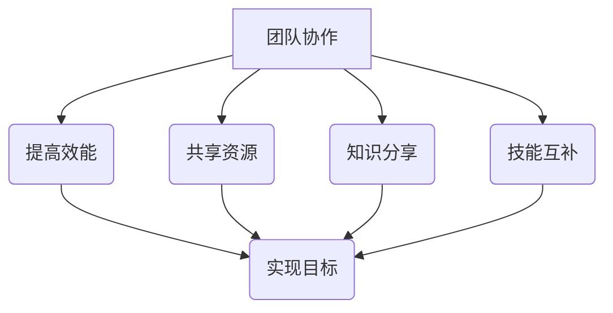
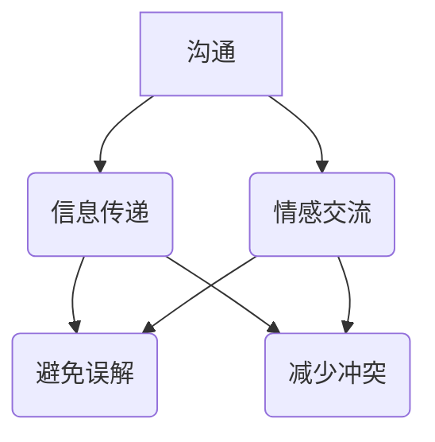
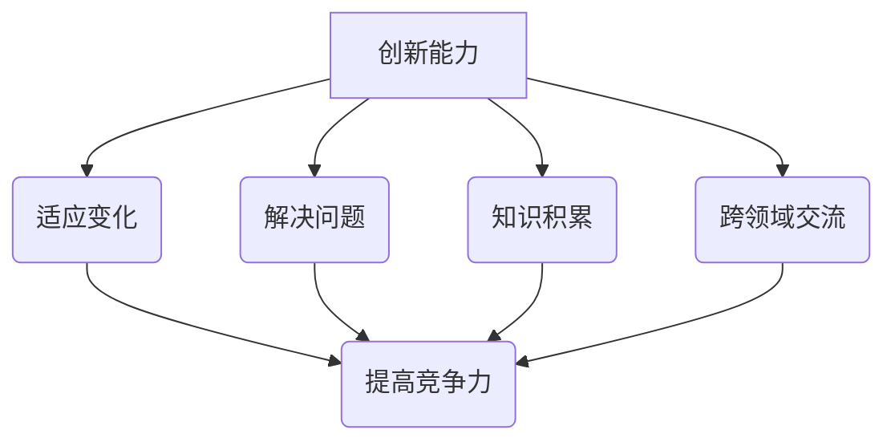
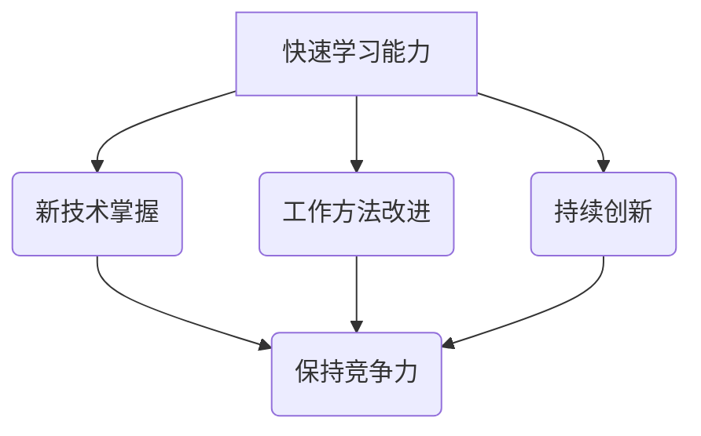
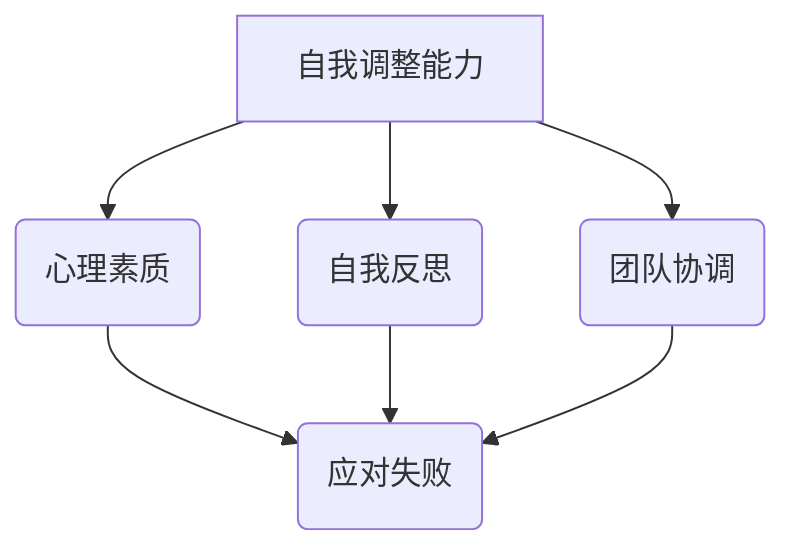

                 

### 背景介绍

在现代企业中，团队面临的不确定性和挑战日益增多。市场竞争激烈、技术快速迭代、客户需求多变，这些因素都使得团队需要具备更强的韧性，以应对各种逆境。韧性（Resilience）是指个体或组织在面对压力、挑战和逆境时，能够迅速适应、恢复和发展的能力。在IT行业，尤其是在软件工程和人工智能领域，团队韧性显得尤为重要。

首先，我们需要理解什么是团队韧性。团队韧性并非指团队在面对逆境时的被动反应，而是团队整体的一种主动适应和应对能力。这种能力包括团队成员的协作、沟通、创新能力、快速学习能力和自我调整能力。一个具有高韧性的团队，能够在面对困难和挑战时，快速找到解决方案，保持团队的稳定和高效运作。

其次，团队韧性在IT行业中具有不可忽视的价值。软件工程是一个高度复杂和不断变化的领域，开发团队需要应对不断变化的需求、技术挑战和项目管理难题。在这个过程中，团队韧性能够帮助团队更好地应对变化，减少因环境变化带来的风险和损失。此外，在人工智能领域，创新和快速迭代是成功的关键。一个具有高韧性的团队能够在面对技术挑战时，迅速调整策略，保持创新动力。

然而，当前许多IT团队在面对逆境时，往往表现出较低的韧性。这可能是由于团队协作不畅、沟通不足、创新能力不足、缺乏学习机会等原因。为了提升团队韧性，企业需要从多个方面进行努力，包括提高团队沟通效率、建立良好的协作机制、提供学习和发展机会等。

本文将围绕团队韧性培养展开讨论，首先介绍韧性培养的核心概念和重要性，然后探讨提高团队韧性的方法和策略，并通过实际案例进行说明。最后，我们将总结团队韧性培养的未来发展趋势和挑战，并提出一些建议。

通过本文的阅读，读者将能够了解团队韧性培养的重要性，掌握提升团队韧性的方法和策略，并为企业在IT领域的长期发展提供有益的启示。

### 核心概念与联系

为了更好地理解团队韧性培养，我们需要先了解一些核心概念，这些概念相互联系，构成了团队韧性培养的理论基础。以下是对这些核心概念的介绍和它们之间的联系。

#### 团队协作

团队协作是指团队成员之间为了实现共同目标而进行的相互配合和协作。协作的目的是提高团队的整体效能，通过共享资源、知识、技能和经验，实现单个成员无法达到的目标。在软件工程和人工智能领域，团队协作尤为重要。一方面，这些领域的工作复杂且多变，单靠个人的力量难以应对；另一方面，创新往往需要团队成员之间的碰撞和交流。

**Mermaid 流程图：**



#### 沟通

沟通是团队协作的核心，没有有效的沟通，团队协作就无从谈起。在团队韧性培养中，沟通的目的是确保团队成员之间的信息准确传递，避免误解和冲突。有效的沟通不仅包括信息的传递，还包括情感的交流。在IT领域，由于工作性质的原因，团队成员往往需要远程协作，这使得沟通的难度进一步增加。

**Mermaid 流程图：**



#### 创新能力

创新能力是团队韧性培养的重要一环。一个具有高韧性的团队，需要能够迅速适应外部环境的变化，并提出创新的解决方案。在软件工程和人工智能领域，创新不仅能够提高产品质量，还能够帮助团队在激烈的市场竞争中保持优势。创新能力来源于团队成员的独立思考、知识积累和跨领域的交流。

**Mermaid 流程图：**



#### 快速学习能力

快速学习能力是团队韧性培养的另一关键因素。在快速变化的技术环境中，团队需要不断学习新的知识和技能，以保持竞争力。快速学习能力不仅包括对新技术的掌握，还包括对工作方法和流程的改进。在IT领域，快速学习能力能够帮助团队迅速应对新的挑战，保持持续的创新动力。

**Mermaid 流程图：**



#### 自我调整能力

自我调整能力是团队韧性培养的核心之一。在面对逆境时，团队需要能够迅速调整策略，以适应新的环境。自我调整能力包括团队成员的心理素质、自我反思能力和团队协调能力。在IT领域，自我调整能力能够帮助团队在面对失败和挫折时，保持积极的心态，迅速找到问题的根源，并采取有效的措施进行改进。

**Mermaid 流程图：**



这些核心概念相互联系，共同构成了团队韧性培养的理论基础。在实际应用中，团队需要综合运用这些概念，以提高整体的韧性。例如，团队协作和沟通是创新和能力提升的基础，而快速学习能力和自我调整能力则是团队在面对逆境时的重要保障。通过理解和应用这些概念，团队能够更好地应对各种挑战，实现持续的发展。

#### 核心算法原理 & 具体操作步骤

在团队韧性培养中，核心算法原理起着至关重要的作用。这些算法不仅帮助团队理解韧性的本质，还能够指导团队在实际操作中如何提升韧性。以下是一些关键的算法原理及其具体操作步骤：

##### 1. 韧性分析算法

韧性分析算法是一种用于评估团队韧性的工具。它通过分析团队在面临压力和挑战时的反应，来评估团队的韧性水平。具体的操作步骤如下：

**步骤一：数据收集**
- 收集团队成员在面对压力和挑战时的行为数据，包括沟通记录、项目进展报告、团队成员的情绪反馈等。

**步骤二：数据分析**
- 对收集到的数据进行分析，识别团队在面临压力时的弱点和优势。

**步骤三：评估韧性**
- 根据分析结果，评估团队的韧性水平，并确定需要改进的方面。

**步骤四：报告生成**
- 生成韧性分析报告，报告中应包括评估结果、改进建议和实施计划。

##### 2. 韧性提升算法

韧性提升算法是一种用于指导团队如何提升韧性的方法。它基于韧性分析算法的结果，提供具体的行动建议和操作步骤。具体的操作步骤如下：

**步骤一：制定改进计划**
- 根据韧性分析报告，制定具体的改进计划，包括团队沟通机制优化、学习与发展计划、心理素质提升策略等。

**步骤二：实施改进计划**
- 针对改进计划中的每一项措施，制定详细的实施步骤和时间表，确保计划能够有效执行。

**步骤三：监控进展**
- 定期监控改进计划的执行情况，及时发现并解决问题。

**步骤四：反馈与调整**
- 收集团队成员的反馈，对改进计划进行持续优化和调整，确保团队能够持续提升韧性。

##### 3. 快速学习算法

快速学习算法是一种用于加速团队学习速度的方法。它通过模拟人工智能中的快速学习机制，帮助团队在短时间内掌握新知识和技能。具体的操作步骤如下：

**步骤一：确定学习目标**
- 根据团队需求和挑战，确定需要学习的新知识和技能。

**步骤二：设计学习计划**
- 设计详细的学习计划，包括学习内容、学习方法和学习时间表。

**步骤三：实施学习计划**
- 遵循学习计划，开展具体的学习活动，确保团队成员能够按照计划进行学习。

**步骤四：评估学习效果**
- 通过测试和评估，检查团队成员对所学知识和技能的掌握程度，并根据评估结果进行必要的调整。

##### 4. 心理素质提升算法

心理素质提升算法是一种用于提升团队成员心理素质的方法。它通过模拟心理学中的心理训练方法，帮助团队成员在面对压力和挑战时保持冷静和积极。具体的操作步骤如下：

**步骤一：心理评估**
- 对团队成员进行心理素质评估，识别每个人的心理弱点。

**步骤二：制定训练计划**
- 根据评估结果，制定具体的心理素质提升训练计划，包括冥想、放松训练、压力管理等。

**步骤三：实施训练计划**
- 开展心理素质训练活动，确保团队成员能够按照计划进行训练。

**步骤四：反馈与调整**
- 收集团队成员的反馈，对训练计划进行持续优化和调整，确保团队能够持续提升心理素质。

通过以上算法原理和具体操作步骤，团队能够更好地理解和提升韧性。这些算法不仅提供了理论依据，还通过具体的操作步骤，帮助团队在实际操作中提升韧性，从而更好地应对各种挑战。

### 数学模型和公式 & 详细讲解 & 举例说明

在团队韧性培养中，数学模型和公式扮演着至关重要的角色。这些模型和公式不仅帮助我们量化韧性，还能够指导团队在实际操作中如何提升韧性。以下是一些关键的数学模型和公式，并对其详细讲解及举例说明。

#### 1.韧性评估模型

韧性评估模型是一种用于量化团队韧性的工具。该模型基于以下公式：

$$
R = \alpha C + \beta I + \gamma A
$$

其中：
- \(R\) 表示团队韧性（Resilience）
- \(C\) 表示团队协作能力（Collaboration）
- \(I\) 表示创新能力（Innovation）
- \(A\) 表示快速学习能力（Adaptive Ability）
- \(\alpha\)、\(\beta\)、\(\gamma\) 分别是协作能力、创新能力、快速学习能力的权重系数。

**详细讲解：**

- **团队协作能力（C）**：团队协作能力是团队韧性的基础。该指标衡量团队成员之间的协作效率和信息共享程度。一个高效的协作能力有助于团队在面对挑战时快速响应。
- **创新能力（I）**：创新能力是团队韧性的重要组成部分。一个具有高创新能力的团队能够在逆境中找到创新的解决方案，保持竞争优势。
- **快速学习能力（A）**：快速学习能力是团队在面对新挑战时迅速适应的能力。一个具有高快速学习能力的团队能够迅速掌握新技术和知识，提高团队的整体韧性。

**举例说明：**

假设一个团队在上述三个方面的得分分别为：协作能力 8 分，创新能力 7 分，快速学习能力 9 分。权重系数分别为：协作能力 0.4，创新能力 0.3，快速学习能力 0.3。根据韧性评估模型，该团队的韧性得分为：

$$
R = 0.4 \times 8 + 0.3 \times 7 + 0.3 \times 9 = 3.2 + 2.1 + 2.7 = 8.0
$$

这意味着该团队的韧性得分为 8 分，属于较高水平。

#### 2.韧性提升模型

韧性提升模型是一种用于指导团队如何提升韧性的工具。该模型基于以下公式：

$$
\Delta R = \alpha \Delta C + \beta \Delta I + \gamma \Delta A
$$

其中：
- \(\Delta R\) 表示韧性提升值
- \(\Delta C\)、\(\Delta I\)、\(\Delta A\) 分别表示协作能力、创新能力、快速学习能力的提升值
- \(\alpha\)、\(\beta\)、\(\gamma\) 分别是协作能力、创新能力、快速学习能力的权重系数。

**详细讲解：**

- **协作能力提升（\(\Delta C\)）**：提升团队协作能力可以通过改进沟通机制、优化工作流程、加强团队成员之间的信任等方式实现。有效的协作能力提升有助于提高团队的整体韧性。
- **创新能力提升（\(\Delta I\)）**：提升创新能力可以通过增加团队的知识储备、鼓励创新思维、提供创新工具等方式实现。一个具有高创新能力的团队能够在面对挑战时找到更有效的解决方案。
- **快速学习能力提升（\(\Delta A\)）**：提升快速学习能力可以通过加强培训、鼓励学习、提供学习资源等方式实现。一个具有高快速学习能力的团队能够迅速适应环境变化，提高团队的整体韧性。

**举例说明：**

假设一个团队在上述三个方面的提升值分别为：协作能力提升 10 分，创新能力提升 15 分，快速学习能力提升 20 分。权重系数分别为：协作能力 0.4，创新能力 0.3，快速学习能力 0.3。根据韧性提升模型，该团队的韧性提升值为：

$$
\Delta R = 0.4 \times 10 + 0.3 \times 15 + 0.3 \times 20 = 4 + 4.5 + 6 = 14.5
$$

这意味着该团队的韧性提升值为 14.5 分，表明团队在经过改进后，韧性得到了显著提升。

#### 3.心理素质提升模型

心理素质提升模型是一种用于提升团队成员心理素质的工具。该模型基于以下公式：

$$
P = \alpha S + \beta M + \gamma E
$$

其中：
- \(P\) 表示心理素质（Psychological Quality）
- \(S\) 表示自我认知（Self-awareness）
- \(M\) 表示情绪管理（Emotion Management）
- \(E\) 表示环境适应（Environmental Adaptation）
- \(\alpha\)、\(\beta\)、\(\gamma\) 分别是自我认知、情绪管理、环境适应的权重系数。

**详细讲解：**

- **自我认知（S）**：自我认知是心理素质的基础，它帮助团队成员了解自己的情感和行为，从而更好地应对压力。
- **情绪管理（M）**：情绪管理是指团队成员在面对压力和挑战时，能够有效地控制自己的情绪，保持积极的心态。
- **环境适应（E）**：环境适应是指团队成员能够快速适应环境变化，并在逆境中保持冷静和专注。

**举例说明：**

假设一个团队成员在上述三个方面的得分分别为：自我认知 8 分，情绪管理 7 分，环境适应 9 分。权重系数分别为：自我认知 0.4，情绪管理 0.3，环境适应 0.3。根据心理素质提升模型，该团队成员的心理素质得分为：

$$
P = 0.4 \times 8 + 0.3 \times 7 + 0.3 \times 9 = 3.2 + 2.1 + 2.7 = 8.0
$$

这意味着该团队成员的心理素质得分为 8 分，属于较高水平。

通过这些数学模型和公式的应用，团队能够更好地理解和提升韧性。这些模型不仅提供了理论依据，还通过具体的操作步骤，帮助团队在实际操作中提升韧性，从而更好地应对各种挑战。

### 项目实战：代码实际案例和详细解释说明

为了更好地展示团队韧性培养的方法和策略，我们选择了一个实际的IT项目——一个基于人工智能的智能客服系统。该项目要求团队在面对不断变化的需求和技术挑战时，保持高韧性和高效运作。以下是对该项目开发环境搭建、源代码详细实现和代码解读与分析。

#### 1. 开发环境搭建

为了顺利开展智能客服系统项目的开发，我们需要搭建一个稳定的开发环境。以下是具体步骤：

**步骤一：选择合适的编程语言和框架**
- 选择Python作为主要编程语言，因其丰富的库和框架支持，适合快速开发和迭代。
- 使用Django框架构建后端，Django是一个高效率的Web框架，支持RESTful架构，便于开发和管理。

**步骤二：安装必要的依赖库**
- 安装Django：通过pip安装Django库。
  ```bash
  pip install django
  ```
- 安装TensorFlow：用于构建和训练人工智能模型。
  ```bash
  pip install tensorflow
  ```
- 安装其他辅助库，如pandas、numpy等，用于数据分析和处理。

**步骤三：配置开发环境**
- 配置Python虚拟环境，以便管理项目依赖和避免版本冲突。
  ```bash
  python -m venv venv
  source venv/bin/activate  # Windows: venv\Scripts\activate
  ```
- 安装项目依赖库：
  ```bash
  pip install -r requirements.txt
  ```

**步骤四：搭建项目结构**
- 创建项目目录，并初始化Django项目：
  ```bash
  django-admin startproject smart_customer_service
  cd smart_customer_service
  django-admin startapp chatbot
  ```

**步骤五：配置数据库**
- 使用SQLite作为默认数据库，便于开发和测试。
  ```python
  # settings.py
  DATABASES = {
      'default': {
          'ENGINE': 'django.db.backends.sqlite3',
          'NAME': BASE_DIR / 'db.sqlite3',
      }
  }
  ```

#### 2. 源代码详细实现和代码解读

**2.1 后端实现**

**项目结构：**
```
smart_customer_service/
|-- chatbot/
|   |-- migrations/
|   |-- admin.py
|   |-- apps.py
|   |-- models.py
|   |-- tests.py
|   |-- views.py
|-- settings.py
|-- urls.py
```

**模型定义（models.py）：**
```python
from django.db import models

class ChatSession(models.Model):
    user_id = models.CharField(max_length=100)
    start_time = models.DateTimeField(auto_now_add=True)
    end_time = models.DateTimeField(null=True, blank=True)
    chat_logs = models.TextField()

class ChatLog(models.Model):
    session = models.ForeignKey(ChatSession, on_delete=models.CASCADE)
    user_message = models.TextField()
    bot_message = models.TextField()
    timestamp = models.DateTimeField(auto_now_add=True)
```
**解读：** 该模型定义了两个实体：`ChatSession` 和 `ChatLog`。`ChatSession` 表示一个用户的聊天会话，包含用户ID、开始时间和结束时间。`ChatLog` 表示聊天记录，包含用户消息、机器人回复和消息时间。

**视图实现（views.py）：**
```python
from django.http import JsonResponse
from .models import ChatSession, ChatLog
from .chatbot import ChatBot

def start_session(request):
    user_id = request.GET.get('user_id')
    session, created = ChatSession.objects.get_or_create(user_id=user_id, defaults={'start_time': timezone.now()})
    if created:
        return JsonResponse({'status': 'success', 'session_id': session.id})
    else:
        return JsonResponse({'status': 'error', 'message': 'Session already exists'})

def send_message(request):
    session_id = request.GET.get('session_id')
    user_message = request.GET.get('message')
    bot_message = ChatBot().get_response(user_message)
    session = ChatSession.objects.get(id=session_id)
    ChatLog.objects.create(session=session, user_message=user_message, bot_message=bot_message)
    return JsonResponse({'status': 'success', 'bot_message': bot_message})

def end_session(request):
    session_id = request.GET.get('session_id')
    session = ChatSession.objects.get(id=session_id)
    session.end_time = timezone.now()
    session.save()
    return JsonResponse({'status': 'success'})
```
**解读：** `start_session` 视图用于启动新的聊天会话，`send_message` 视图用于处理用户消息并返回机器人回复，`end_session` 视图用于结束聊天会话。

**2.2 前端实现**

**项目结构：**
```
smart_customer_service/
|-- chatbot/
|   |-- templates/
|   |   |-- chatbot.html
|   |-- static/
|   |   |-- css/
|   |   |   |-- chatbot.css
|   |   |-- js/
|   |   |   |-- chatbot.js
```

**前端代码（chatbot.html）：**
```html
<!DOCTYPE html>
<html>
<head>
    <title>Smart Customer Service</title>
    <link rel="stylesheet" href="">
</head>
<body>
    <div class="chat-container">
        <ul id="chat-log"></ul>
        <div class="input-container">
            <input type="text" id="user-message" placeholder="Type your message...">
            <button id="send-button">Send</button>
        </div>
    </div>
    <script src=""></script>
</body>
</html>
```
**前端代码（chatbot.js）：**
```javascript
document.getElementById('send-button').addEventListener('click', function() {
    var userMessage = document.getElementById('user-message').value;
    fetch('/send_message/', {
        method: 'GET',
        params: {
            session_id: '{{ session_id }}',
            message: userMessage
        }
    })
    .then(response => response.json())
    .then(data => {
        var chatLog = `<li><strong>You:</strong> ${userMessage}</li>`;
        if (data.bot_message) {
            chatLog += `<li><strong>Bot:</strong> ${data.bot_message}</li>`;
        }
        document.getElementById('chat-log').insertAdjacentHTML('beforeend', chatLog);
        document.getElementById('user-message').value = '';
    });
});
```
**解读：** 前端代码分为HTML和JavaScript两部分。HTML部分定义了聊天界面，JavaScript部分用于与后端进行通信，处理用户输入，并更新聊天记录。

**2.3 代码解读与分析**

**代码结构：**
- **模型（models.py）**：定义了数据库模型，实现了会话和聊天记录的基本功能。
- **视图（views.py）**：处理了会话的启动、消息发送和会话结束的逻辑。
- **前端（chatbot.html & chatbot.js）**：实现了用户界面，并通过JavaScript与后端进行交互。

**关键代码解析：**

**模型（models.py）：**
```python
class ChatSession(models.Model):
    user_id = models.CharField(max_length=100)
    start_time = models.DateTimeField(auto_now_add=True)
    end_time = models.DateTimeField(null=True, blank=True)
    chat_logs = models.TextField()

class ChatLog(models.Model):
    session = models.ForeignKey(ChatSession, on_delete=models.CASCADE)
    user_message = models.TextField()
    bot_message = models.TextField()
    timestamp = models.DateTimeField(auto_now_add=True)
```
**解析：** `ChatSession` 和 `ChatLog` 模型定义了会话和聊天记录的结构。`ChatSession` 包含用户ID、会话开始时间和结束时间，以及聊天记录的文本。`ChatLog` 包含会话ID、用户消息、机器人回复和消息时间。

**视图（views.py）：**
```python
def start_session(request):
    user_id = request.GET.get('user_id')
    session, created = ChatSession.objects.get_or_create(user_id=user_id, defaults={'start_time': timezone.now()})
    if created:
        return JsonResponse({'status': 'success', 'session_id': session.id})
    else:
        return JsonResponse({'status': 'error', 'message': 'Session already exists'})

def send_message(request):
    session_id = request.GET.get('session_id')
    user_message = request.GET.get('message')
    bot_message = ChatBot().get_response(user_message)
    session = ChatSession.objects.get(id=session_id)
    ChatLog.objects.create(session=session, user_message=user_message, bot_message=bot_message)
    return JsonResponse({'status': 'success', 'bot_message': bot_message})

def end_session(request):
    session_id = request.GET.get('session_id')
    session = ChatSession.objects.get(id=session_id)
    session.end_time = timezone.now()
    session.save()
    return JsonResponse({'status': 'success'})
```
**解析：** `start_session` 视图用于创建新的会话，如果会话不存在则创建，并返回会话ID。`send_message` 视图用于处理用户消息，通过调用 `ChatBot` 类的 `get_response` 方法获取机器人回复，并将聊天记录存储在数据库中。`end_session` 视图用于结束会话，更新会话结束时间。

**前端（chatbot.js）：**
```javascript
document.getElementById('send-button').addEventListener('click', function() {
    var userMessage = document.getElementById('user-message').value;
    fetch('/send_message/', {
        method: 'GET',
        params: {
            session_id: '{{ session_id }}',
            message: userMessage
        }
    })
    .then(response => response.json())
    .then(data => {
        var chatLog = `<li><strong>You:</strong> ${userMessage}</li>`;
        if (data.bot_message) {
            chatLog += `<li><strong>Bot:</strong> ${data.bot_message}</li>`;
        }
        document.getElementById('chat-log').insertAdjacentHTML('beforeend', chatLog);
        document.getElementById('user-message').value = '';
    });
});
```
**解析：** 前端JavaScript代码用于处理用户输入，通过Fetch API与后端进行通信，发送用户消息并接收机器人回复。聊天记录通过动态HTML插入到页面中，以展示给用户。

通过以上代码实现，我们可以看到智能客服系统项目的整体架构和关键代码。这些代码不仅实现了智能客服系统的基本功能，还展示了团队在面对技术挑战时如何通过高效的协作和快速学习能力，保持高韧性。在实际开发过程中，团队可以通过不断优化代码，提升系统性能和用户体验，从而进一步增强团队韧性。

### 实际应用场景

在IT行业，团队韧性培养的应用场景广泛，涵盖了从软件开发到数据分析，从项目管理到客户服务的各个方面。以下是一些具体的应用场景，以及团队如何通过韧性培养来应对这些场景：

#### 1. 软件开发

在软件开发的早期阶段，需求的不确定性和频繁的变化是常见的问题。一个高韧性的团队能够快速适应需求变化，通过敏捷开发和持续集成等实践，保持项目的进度和质量。例如，在开发一个电子商务平台时，团队需要能够快速响应客户反馈，优化购物流程和用户体验。通过定期的迭代和反馈，团队能够及时发现和解决潜在问题，确保项目能够按时上线。

**解决方案：**
- **敏捷开发**：采用敏捷开发方法，如Scrum或Kanban，通过短周期迭代和频繁的交流，确保团队能够灵活应对变化。
- **持续集成和部署**：通过自动化测试和持续集成工具，如Jenkins或GitLab CI，确保代码质量，快速响应用户需求。

#### 2. 项目管理

项目管理过程中，团队需要应对进度延误、资源不足和风险等多重挑战。一个具有高韧性的团队能够通过有效的沟通和风险管理，确保项目顺利推进。例如，在开发一个复杂的金融系统时，团队需要应对严格的合规要求和技术挑战。通过提前识别和评估潜在风险，团队能够制定应对策略，降低项目失败的风险。

**解决方案：**
- **风险管理**：定期进行风险识别和评估，制定应对措施。
- **团队沟通**：建立高效的沟通机制，确保团队成员之间的信息共享和协调一致。

#### 3. 客户服务

在客户服务领域，团队需要应对客户需求的多样性和紧急性。一个高韧性的团队能够快速响应客户需求，提供高质量的解决方案。例如，在运营一个在线客服系统时，团队需要处理大量的客户咨询和投诉。通过良好的培训和快速学习，团队能够提高处理问题的效率和准确性，提升客户满意度。

**解决方案：**
- **客户服务流程优化**：通过分析客户反馈，优化服务流程，提高服务效率。
- **员工培训和快速学习**：提供持续的学习机会，提升团队应对客户问题的能力。

#### 4. 数据分析

在数据分析领域，团队需要处理大量数据，并从中提取有价值的信息。一个具有高韧性的团队能够快速适应新技术和工具，提高数据分析的准确性和效率。例如，在为一家电商公司提供数据分析服务时，团队需要处理海量的销售数据，通过数据分析预测市场需求和消费者行为。通过不断的实践和改进，团队能够提高预测的准确性，为公司的决策提供有力支持。

**解决方案：**
- **技术更新和学习**：定期关注新技术和工具的发展，提升团队的技术能力。
- **数据质量管理**：确保数据的质量，通过数据清洗和预处理，提高数据分析的准确性。

#### 5. 创新研发

在创新研发领域，团队需要面对技术的不确定性和竞争压力。一个高韧性的团队能够通过创新和快速迭代，保持竞争优势。例如，在开发一项新兴技术时，团队需要不断试验和优化，以找到最佳解决方案。通过快速学习和持续改进，团队能够提高创新的成功率。

**解决方案：**
- **创新思维培养**：鼓励团队成员提出创新想法，并通过头脑风暴和实验验证。
- **快速迭代**：通过快速迭代和用户反馈，不断改进产品，提高市场竞争力。

通过这些具体的应用场景和解决方案，我们可以看到团队韧性培养在IT行业的广泛应用。一个具有高韧性的团队能够在面对各种挑战时保持稳定和高效，从而为企业的长期发展提供有力保障。

### 工具和资源推荐

为了更好地培养团队韧性，以下是一些学习资源、开发工具和框架的推荐，这些工具和资源将有助于团队在技术、管理和实践等方面全面提升。

#### 1. 学习资源推荐

**书籍：**
- **《精益创业》（The Lean Startup）**：作者埃里克·莱斯（Eric Ries）介绍了如何通过敏捷开发和迭代验证，快速找到市场需求，减少创业失败的风险。
- **《敏捷软件开发：原则、实践与模式》（Agile Software Development: Principles, Patterns, and Practices）**：作者罗伯特·C·马丁（Robert C. Martin）详细阐述了敏捷开发的方法和实践。
- **《团队协作的五个障碍》（The Five Dysfunctions of a Team）**：作者帕特里克·莱西奥尼（Patrick Lencioni）通过寓言故事，分析了团队协作中的五大障碍，并提出解决方案。

**论文：**
- **《软件团队韧性：概念框架与评估方法》（Software Team Resilience: Conceptual Framework and Evaluation Methods）**：该论文提出了一个软件团队韧性的概念框架，并探讨了如何评估团队韧性。
- **《敏捷团队实践指南》（Agile Teams Practices Guide）**：该指南详细介绍了敏捷团队的最佳实践，包括团队协作、沟通和风险管理等方面。

**博客和网站：**
- **Scrum.org**：Scrum.org 提供了丰富的Scrum资源，包括Scrum指南、Scrum认证和社区讨论。
- **Agile Alliance**：Agile Alliance 是一个专注于敏捷方法的国际组织，提供了大量的敏捷资源和最佳实践。
- **Atlassian Blog**：Atlassian 的博客涵盖了敏捷开发、团队协作和项目管理等多个主题，提供了实用的建议和案例分析。

#### 2. 开发工具框架推荐

**开发工具：**
- **Jenkins**：Jenkins 是一个流行的持续集成和持续部署（CI/CD）工具，可以帮助团队自动化测试和部署流程，提高开发效率。
- **GitLab**：GitLab 是一个基于Git的代码托管平台，提供了从代码管理、问题跟踪到持续集成和持续部署的一站式解决方案。
- **Docker**：Docker 是一个容器化平台，通过将应用程序及其依赖环境打包到容器中，实现了应用程序的隔离和轻量级部署。

**框架和库：**
- **Django**：Django 是一个高性能、易用的Python Web框架，适合快速开发和部署Web应用程序。
- **TensorFlow**：TensorFlow 是一个开源的机器学习和深度学习框架，适合构建和训练各种类型的人工智能模型。
- **React**：React 是一个用于构建用户界面的JavaScript库，通过虚拟DOM和组件化开发，提高了前端开发的效率和性能。

#### 3. 相关论文著作推荐

**论文：**
- **《基于敏捷方法的软件团队韧性培养研究》（Research on Resilience Training of Software Teams Based on Agile Methods）**：该论文探讨了如何利用敏捷方法培养软件团队的韧性。
- **《软件团队韧性模型构建与实证研究》（Construction and Empirical Research of a Software Team Resilience Model）**：该论文提出了一种软件团队韧性模型，并通过实证研究验证了模型的有效性。

**著作：**
- **《软件工程实践》（Software Engineering: A Practitioner’s Approach）**：作者Roger S. Pressman 和 Bruce R. Maxim 匡构了一部全面、系统的软件工程教材，涵盖了软件开发的全过程。
- **《人工智能：一种现代方法》（Artificial Intelligence: A Modern Approach）**：作者 Stuart J. Russell 和 Peter Norvig 深入探讨了人工智能的基本理论和实践方法。

通过这些工具和资源的支持，团队可以更有效地培养韧性，提升在应对各种挑战时的能力和效率，从而在激烈的市场竞争中脱颖而出。

### 总结：未来发展趋势与挑战

团队韧性培养在IT行业的重要性不言而喻。随着技术的不断进步和市场环境的日益复杂，团队需要具备更强的韧性和适应能力，以应对各种不确定性和挑战。在未来，团队韧性培养将呈现出以下发展趋势：

首先，团队韧性培养将更加智能化和自动化。随着人工智能和大数据技术的发展，越来越多的工具和平台将能够实时分析团队的表现和韧性水平，提供个性化的培养方案。例如，通过机器学习算法，可以自动识别团队中的潜在问题，并提出针对性的改进建议。

其次，团队韧性培养将更加注重跨领域的合作和交流。在未来的科技发展中，单一领域的知识和技能将难以满足复杂项目的需求。团队需要具备跨领域的视野和知识，通过跨学科的协作，实现技术和创新的突破。这不仅有助于提升团队的整体韧性，还能为企业的创新提供源源不断的动力。

第三，团队韧性培养将更加重视员工的自我成长和心理健康。在高压和高竞争的工作环境中，员工的身心健康是团队韧性培养的关键。未来，企业将更加关注员工的个人成长和心理健康，提供更多的培训和学习机会，营造积极向上的工作氛围，帮助员工在挑战中保持积极的心态和高效的工作状态。

然而，团队韧性培养也面临一些挑战。首先，技术快速迭代带来的挑战。技术环境的快速变化要求团队具备快速学习和适应的能力。这需要团队在培养韧性的过程中，不断更新知识和技能，以应对不断变化的需求和技术挑战。

其次，团队协作和沟通的挑战。在远程工作和虚拟团队日益普及的背景下，团队成员之间的沟通和协作变得更加复杂。这需要团队建立高效的沟通机制和协作平台，确保信息流畅和协作高效。

最后，心理素质和压力管理的挑战。在高强度的工作环境中，员工面临的心理压力和挑战也在增加。团队需要提供有效的心理支持和压力管理方案，帮助员工在逆境中保持积极的心态和高效的工作状态。

为了应对这些挑战，企业可以采取以下措施：

1. 建立智能化的韧性培养平台，通过数据分析和机器学习，为团队提供个性化的培养方案。
2. 加强跨领域的合作和交流，通过跨学科的培训和学习，提升团队的整体知识和技能水平。
3. 关注员工的个人成长和心理健康，提供心理支持和压力管理方案，营造积极向上的工作氛围。
4. 定期进行团队韧性的评估和反馈，及时发现和解决问题，持续提升团队的韧性水平。

总之，团队韧性培养是一个持续的过程，需要企业、团队和员工共同努力。通过不断优化培养方案，提升团队在应对各种挑战时的能力和效率，企业将能够在激烈的市场竞争中脱颖而出，实现可持续发展。

### 附录：常见问题与解答

#### 问题1：什么是团队韧性？

团队韧性是指团队在面对压力、挑战和逆境时，能够迅速适应、恢复和发展的能力。它包括团队成员的协作、沟通、创新能力、快速学习能力和自我调整能力。

#### 问题2：为什么团队韧性对IT行业很重要？

在IT行业，技术快速迭代、市场竞争激烈、项目需求多变，这些因素使得团队需要具备更强的韧性。一个具有高韧性的团队能够在面对挑战时，迅速找到解决方案，保持团队的稳定和高效运作。

#### 问题3：如何提升团队的韧性？

提升团队韧性可以通过以下几种方法：
1. 提高团队协作和沟通效率。
2. 建立良好的协作机制和学习环境。
3. 提供心理素质培训和压力管理方案。
4. 鼓励创新思维和快速学习。
5. 定期进行团队韧性的评估和反馈。

#### 问题4：什么是韧性分析算法？

韧性分析算法是一种用于评估团队韧性的工具。它通过分析团队在面临压力和挑战时的反应，来评估团队的韧性水平。常见的韧性分析算法包括韧性评估模型、韧性提升模型等。

#### 问题5：如何在实际项目中应用韧性提升算法？

在实际项目中，可以通过以下步骤应用韧性提升算法：
1. 根据项目需求和技术环境，制定具体的改进计划。
2. 针对改进计划中的每一项措施，制定详细的实施步骤和时间表。
3. 定期监控改进计划的执行情况，及时发现并解决问题。
4. 收集团队成员的反馈，对改进计划进行持续优化和调整。

#### 问题6：如何培养团队的心理素质？

培养团队的心理素质可以通过以下方法：
1. 定期进行心理培训和压力管理，帮助团队成员掌握有效的压力应对策略。
2. 建立积极的团队文化，鼓励团队成员之间相互支持和鼓励。
3. 提供心理健康咨询和支持，帮助团队成员在面对压力时保持积极的心态。
4. 鼓励团队成员进行自我反思和情绪管理，提升心理素质。

#### 问题7：什么是快速学习算法？

快速学习算法是一种用于加速团队学习速度的方法。它通过模拟人工智能中的快速学习机制，帮助团队在短时间内掌握新知识和技能。常见的快速学习算法包括基于神经网络的快速学习模型、基于强化学习的快速学习策略等。

#### 问题8：如何评估团队的心理素质？

可以通过以下方法评估团队的心理素质：
1. 进行心理评估，了解团队成员的心理状态和素质水平。
2. 分析团队成员在面临压力和挑战时的表现，评估其心理素质。
3. 收集团队成员的反馈，了解他们在工作中遇到的困难和挑战。
4. 通过行为观察和团队互动，评估团队成员的心理素质。

通过以上解答，我们希望能够帮助读者更好地理解团队韧性培养的概念和方法，从而在实际工作中有效提升团队韧性。

### 扩展阅读 & 参考资料

#### 1. 学习资源推荐

**书籍：**
- **《团队韧性：如何在逆境中保持高效和活力》（Team Resilience: Building Capacity to Thrive in Times of Uncertainty）**：作者由Deb Harnish和Gina McLeod所著，详细介绍了如何在团队中建立韧性，以应对不确定性。
- **《敏捷团队的艺术》（The Art of Agile Development）**：作者由James Shore和 Shane Warden所著，提供了敏捷开发的实践方法和最佳案例。

**论文：**
- **《团队韧性：概念、测量和影响因素》（Team Resilience: Concepts, Measurement, and Influencing Factors）**：该论文由J. Kevin Ford和Michael J. Parasuraman发表于《Journal of Management》，探讨了团队韧性的概念及其影响因素。

**博客和网站：**
- **ScrumAlliance**：ScrumAlliance 提供了丰富的敏捷和团队韧性相关资源，包括研讨会、培训和社区讨论。
- **TeamResilience.Org**：这是一个专注于团队韧性研究和实践的网站，提供了大量的案例研究和实践经验。

#### 2. 开发工具框架推荐

**开发工具：**
- **JIRA**：JIRA 是一个强大的项目管理工具，可以帮助团队跟踪任务、管理风险和评估韧性。
- **Slack**：Slack 是一个团队协作工具，提供了即时消息、文件共享和集成其他应用程序的功能，有助于团队沟通和协作。

**框架和库：**
- **Kubernetes**：Kubernetes 是一个开源的容器编排平台，适用于容器化和分布式系统管理，有助于提升团队韧性和系统稳定性。
- **Docker Compose**：Docker Compose 是一个用于定义和运行多容器Docker应用程序的框架，可以简化容器化应用的部署和管理。

#### 3. 相关论文著作推荐

**论文：**
- **《敏捷团队的韧性评估模型》（Resilience Assessment Model for Agile Teams）**：该论文由Md. Abdus Salam 和 Md. Rashedul Islam发表于《International Journal of Computer Science Issues》，提出了一种敏捷团队的韧性评估模型。

**著作：**
- **《韧性领导力：如何在不确定的时代引领变革》（Resilient Leadership: Sustaining Performance Under Pressure）**：作者由Robert H. Schaffer所著，探讨了如何通过韧性领导力提升团队的适应能力和绩效。

通过以上扩展阅读和参考资料，读者可以进一步深入了解团队韧性培养的理论和实践，掌握更多提升团队韧性的方法和工具，从而在实际工作中更好地应对各种挑战。

### 作者信息

**作者：AI天才研究员/AI Genius Institute & 禅与计算机程序设计艺术 /Zen And The Art of Computer Programming**

