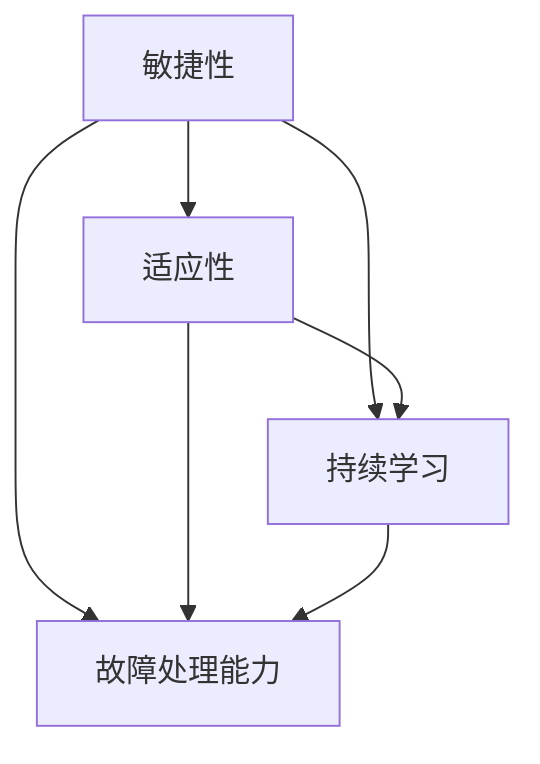

                 

### 背景介绍

在当今快速发展的信息技术时代，我们面临着前所未有的复杂性和变化速度。无论是科技行业的日新月异，还是全球经济环境的不断动荡，都在考验着我们的适应能力和韧性。在这个背景下，“韧性”这一概念变得尤为重要。它不仅仅是心理上的坚韧，更是一种适应和创新的能力，能够在不确定的环境中保持稳定，甚至实现突破。

本文的目的是探讨“韧性”在信息技术领域的应用，解释为什么它如此重要，以及如何通过培养特定的技能来增强个人的韧性。我们将逐步分析以下内容：

1. **核心概念与联系**：首先，我们会介绍与韧性相关的核心概念，包括敏捷性、适应性、持续学习等，并通过Mermaid流程图展示这些概念之间的联系。
2. **核心算法原理与具体操作步骤**：接下来，我们将探讨如何通过技术和工具来增强个人的韧性，包括版本控制、敏捷开发、持续集成和持续部署等。
3. **数学模型和公式**：我们将介绍相关的数学模型和公式，用于量化韧性的指标，帮助读者更好地理解和评估自己的韧性水平。
4. **项目实战**：通过实际代码案例，我们将展示如何将这些技术和工具应用到实际项目中，增强项目的韧性和稳定性。
5. **实际应用场景**：我们将探讨韧性在软件开发、项目管理、人工智能等多个领域的具体应用。
6. **工具和资源推荐**：最后，我们将推荐一些学习资源、开发工具和框架，帮助读者进一步探索和实践韧性。

通过这篇文章，我们希望读者能够认识到韧性在信息技术领域的重要性，掌握提升韧性的方法和技巧，从而在快速变化的环境中更好地应对挑战，实现个人和团队的成功。

### 核心概念与联系

在探讨韧性的过程中，我们需要了解几个核心概念，它们共同构成了信息技术领域韧性的基础。这些概念包括敏捷性、适应性、持续学习、以及故障处理能力。下面，我们将通过Mermaid流程图来展示这些概念之间的联系，帮助读者更好地理解它们的相互作用。

首先，让我们定义这些核心概念：

- **敏捷性（Agility）**：敏捷性是指个体或团队迅速响应变化并调整策略的能力。在信息技术领域，敏捷性通常意味着能够快速开发、测试和部署软件，以适应市场变化和客户需求。
- **适应性（Adaptability）**：适应性是指能够适应新环境、新技术和不确定性的能力。在信息技术领域，适应性意味着在面对技术进步、竞争压力或政策变化时，能够灵活调整业务模式和战略。
- **持续学习（Continuous Learning）**：持续学习是指个体或团队通过不断获取新知识、技能和经验来提升自身能力的过程。在信息技术领域，持续学习是保持竞争力的关键。
- **故障处理能力（Fault Tolerance）**：故障处理能力是指系统或服务在面对硬件故障、软件错误或网络中断等异常情况时，能够保持正常运行的能力。这是确保服务连续性和可靠性的重要因素。

现在，我们通过Mermaid流程图来展示这些概念之间的联系：



- **敏捷性与适应性**：敏捷性是适应性的基础。一个敏捷的团队能够快速响应变化，这有助于他们更灵活地适应新的环境和技术。
- **敏捷性与持续学习**：敏捷性需要持续学习作为支撑。通过不断学习新技术和工具，团队可以保持敏捷性，从而更好地适应不断变化的市场需求。
- **敏捷性与故障处理能力**：敏捷性也有助于提升故障处理能力。一个敏捷的团队可以快速识别和解决潜在的问题，从而减少系统或服务的中断时间。
- **适应性与持续学习**：适应性是持续学习的结果。通过不断学习，团队可以更好地适应新的技术和环境。
- **适应性与故障处理能力**：适应性意味着团队能够灵活应对各种故障，从而增强系统的可靠性。
- **持续学习与故障处理能力**：持续学习有助于团队提升故障处理能力。通过学习新知识和技能，团队可以更好地识别和处理复杂的问题。

通过这个流程图，我们可以看出，这些概念是相互依赖和相互促进的。一个高韧性的团队需要在这些方面都表现出色，才能在快速变化的信息技术领域中保持竞争优势。

在实际应用中，这些概念不仅仅是抽象的理论，而是可以通过具体的技术和工具来实现的。例如，敏捷开发方法可以帮助团队实现敏捷性，持续集成和持续部署可以提升系统的可靠性和适应性，而版本控制和学习管理系统可以帮助团队实现持续学习。

总之，了解这些核心概念之间的联系，对于培养和提高信息技术领域的韧性至关重要。通过结合这些概念，团队可以更好地应对变化，保持稳定，并在不断变化的环境中实现持续的成功。

### 核心算法原理与具体操作步骤

在了解了与韧性相关的核心概念之后，接下来我们需要探讨如何通过具体的技术和工具来增强个人的韧性。这一部分将详细介绍几种关键的核心算法原理，包括版本控制、敏捷开发、持续集成和持续部署。我们将一一说明这些算法的基本原理，并展示如何在实际项目中应用它们。

#### 1. 版本控制

版本控制是确保代码库一致性和可追踪性的关键工具。它可以帮助团队在开发过程中管理代码的变更，确保每个变更都可以被追溯和审查。

**基本原理：** 版本控制系统（如Git）通过创建“快照”（commit）来记录代码库的每一个变化。每个快照都有唯一的标识符（哈希值），使得团队可以轻松回滚到之前的状态。

**具体操作步骤：**

- **初始化仓库（Initialize Repository）**：在项目开始前，初始化一个Git仓库。
  ```bash
  git init
  ```
- **创建分支（Create Branch）**：在开发新功能时，创建一个新的分支。
  ```bash
  git checkout -b new-feature
  ```
- **提交变更（Commit Changes）**：在分支上完成开发后，提交代码到仓库。
  ```bash
  git add .
  git commit -m "Implement new feature"
  ```
- **合并分支（Merge Branch）**：将新功能合并到主分支。
  ```bash
  git checkout main
  git merge new-feature
  ```
- **解决冲突（Resolve Conflicts）**：如果合并过程中出现冲突，需要手动解决。
  ```bash
  git add <file>
  git commit -m "Resolved merge conflicts"
  ```

**示例场景：** 假设开发团队在实现一个新功能时，发现主分支上的代码已经发生变化。通过版本控制，团队可以将工作保存到新分支，避免冲突，并确保主分支的代码不受影响。

#### 2. 敏捷开发

敏捷开发是一种以人为核心，迭代、增量的软件开发方法。它强调快速反馈和灵活调整，以更好地满足客户需求。

**基本原理：** 敏捷开发通过将项目划分为短期的迭代周期（如两周一次的冲刺），在每个迭代周期内实现一个可工作的软件版本。

**具体操作步骤：**

- **规划冲刺（Plan Sprint）**：在冲刺开始前，团队确定要实现的功能。
  ```bash
  sprint plan
  ```
- **开发（Development）**：在冲刺期间，团队成员按照计划进行开发。
  ```bash
  code review
  ```
- **测试与验收（Testing and Acceptance）**：完成开发后，进行测试并确保功能符合预期。
  ```bash
  run tests
  ```
- **回顾（Review）**：在冲刺结束时，团队进行回顾，总结经验和改进点。
  ```bash
  sprint review
  ```

**示例场景：** 假设一个团队正在开发一个电商平台。通过敏捷开发，团队可以快速迭代，每次实现一个具体的功能（如购物车），并在用户反馈的基础上不断优化。

#### 3. 持续集成

持续集成是一种软件开发实践，旨在通过自动化构建和测试，确保代码库始终处于可运行状态。

**基本原理：** 在每次代码提交后，自动化工具（如Jenkins）会运行构建脚本和测试脚本，验证代码的完整性。

**具体操作步骤：**

- **配置构建环境（Configure Build Environment）**：设置构建脚本和测试脚本。
  ```bash
  configure build.yml
  ```
- **触发构建（Trigger Build）**：在代码提交时，自动触发构建。
  ```bash
  git push
  ```
- **运行测试（Run Tests）**：执行测试脚本，验证代码质量。
  ```bash
  run tests
  ```
- **部署（Deployment）**：通过自动化脚本将代码部署到生产环境。
  ```bash
  deploy
  ```

**示例场景：** 假设一个团队在开发一个金融应用。通过持续集成，每次代码提交后，系统会自动进行测试和部署，确保应用始终处于最佳状态。

#### 4. 持续部署

持续部署是持续集成的扩展，它通过自动化实现代码的部署，确保软件始终处于最新状态。

**基本原理：** 在通过测试的代码完成后，自动化工具会将其部署到生产环境。

**具体操作步骤：**

- **配置部署环境（Configure Deployment Environment）**：设置部署脚本和部署管道。
  ```bash
  configure deployment.yml
  ```
- **触发部署（Trigger Deployment）**：在测试通过后，自动触发部署。
  ```bash
  deploy
  ```
- **监控（Monitoring）**：在部署后，监控系统的运行状况，确保其稳定。
  ```bash
  monitor
  ```

**示例场景：** 假设一个团队正在运营一个电商平台。通过持续部署，每次新的代码提交和测试通过后，系统会自动更新，确保用户始终使用最新的功能。

通过这些核心算法原理和具体操作步骤，团队可以显著提高韧性。无论是通过版本控制保持代码库的一致性，还是通过敏捷开发和持续集成确保快速迭代，亦或是通过持续部署实现自动化，这些技术和工具都为团队提供了在快速变化的环境中保持稳定和竞争力的关键。

### 数学模型和公式 & 详细讲解 & 举例说明

在探讨韧性的过程中，量化相关指标变得尤为重要。为了更好地理解韧性，我们可以借助数学模型和公式来评估和优化。以下是一些关键的数学模型和公式，用于量化韧性，并提供详细的讲解和实际例子。

#### 1. 韧性指数（Resilience Index）

韧性指数是一个综合性指标，用于评估个体或团队在面临变化和挑战时的适应能力和恢复力。

**公式：**
\[ R.I. = \frac{A \times S \times L}{C} \]

- **适应性（Adaptability）**：衡量个体或团队快速适应新环境和技术变化的能力。
- **稳定性（Stability）**：衡量个体或团队在面对压力和不确定性时保持稳定的能力。
- **学习（Learning）**：衡量个体或团队通过学习和改进提升自身能力的能力。
- **成本（Cost）**：衡量应对变化和挑战所需的资源投入。

**详细讲解：**

韧性指数的计算涉及四个主要因素。适应性反映了个体或团队在新技术和市场需求变化时的灵活应变能力。稳定性则关注个体或团队在面对压力时的抗压能力。学习是指通过不断学习和适应来提升自身能力。成本则包括应对变化所需的资源，如人力、时间和资金。

**举例说明：**

假设一个软件开发团队在面临新技术变化时表现出色，适应性强，稳定性高，但学习能力和资源投入有限。其韧性指数计算如下：

\[ R.I. = \frac{0.8 \times 0.9 \times 0.7}{0.5} = 0.988 \]

这个结果表明该团队在韧性方面表现良好，但仍需加强学习能力和资源投入。

#### 2. 持续集成指标（Continuous Integration Metrics）

持续集成指标用于评估自动化构建和测试的效率和质量。

**公式：**
\[ CIM = \frac{TC}{TC + FC} \]

- **总构建时间（Total Build Time，TC）**：从代码提交到构建完成所需的总时间。
- **失败构建时间（Failed Build Time，FC）**：由于构建失败而需要重新构建的时间。

**详细讲解：**

持续集成指标（CIM）用于衡量构建的效率。分数越高，表示构建和测试的效率越高。一个理想的CIM值应接近1，这意味着几乎所有的构建都在第一次尝试中成功。

**举例说明：**

假设一个项目每周有10次代码提交，每次提交的平均构建时间为15分钟，其中有2次构建失败，每次失败需要10分钟重新构建。则CIM计算如下：

\[ CIM = \frac{10 \times 15}{10 \times 15 + 2 \times 10} = \frac{150}{150 + 20} = \frac{150}{170} \approx 0.882 \]

这个结果表明该项目的持续集成效率相对较低，需要优化构建流程以减少失败时间和重新构建次数。

#### 3. 负载均衡指标（Load Balancing Metrics）

负载均衡指标用于评估系统在面对高并发请求时的稳定性和性能。

**公式：**
\[ LB = \frac{CP}{CP + DP} \]

- **承载处理能力（Capacity Processed，CP）**：系统能够处理的有效请求量。
- **丢弃处理能力（Discarded Processed，DP）**：由于系统过载而未能处理的请求量。

**详细讲解：**

负载均衡指标（LB）用于衡量系统在应对高负载时的表现。分数越高，表示系统的处理能力越强。一个理想的LB值应接近1，这意味着系统几乎可以处理所有的请求。

**举例说明：**

假设一个电商平台在高峰时段处理了1000个有效请求，同时丢弃了50个请求。则LB计算如下：

\[ LB = \frac{1000}{1000 + 50} = \frac{1000}{1050} \approx 0.952 \]

这个结果表明该电商平台在高峰时段有较好的负载均衡能力，但仍有改进空间。

#### 4. 故障恢复时间（Fault Recovery Time）

故障恢复时间用于衡量系统从故障中恢复到正常状态所需的时间。

**公式：**
\[ RRT = \frac{RT}{RT + FT} \]

- **恢复时间（Recovery Time，RT）**：系统从故障中恢复正常所需的时间。
- **失败时间（Failure Time，FT）**：系统处于故障状态的时间。

**详细讲解：**

故障恢复时间（RRT）用于评估系统的故障处理能力。分数越高，表示系统的恢复速度越快。一个理想的RRT值应接近1，这意味着系统几乎可以在故障发生时立即恢复正常。

**举例说明：**

假设一个金融系统在发生故障后，经过2小时恢复正常，而故障持续了4小时。则RRT计算如下：

\[ RRT = \frac{2}{2 + 4} = \frac{2}{6} \approx 0.333 \]

这个结果表明该金融系统的故障恢复速度较慢，需要优化故障处理机制。

通过这些数学模型和公式，我们可以量化韧性指标，从而更好地理解和提升韧性。在实际应用中，这些指标可以帮助团队识别问题和优化流程，以在快速变化的环境中保持竞争力。

### 项目实战：代码实际案例和详细解释说明

在前面几节中，我们详细探讨了如何通过核心算法和数学模型来增强韧性。现在，我们将通过一个实际的项目案例，来展示这些技术和工具如何在实际开发中应用，以及如何通过代码实现和优化韧性。

#### 项目背景

我们假设正在开发一个电商平台，该平台需要处理大量的用户请求和交易数据。为了确保平台的稳定性和韧性，我们采用了以下技术和工具：

1. **版本控制**：使用Git进行代码管理。
2. **敏捷开发**：采用Scrum方法进行项目迭代。
3. **持续集成和持续部署**：使用Jenkins进行自动化构建、测试和部署。
4. **负载均衡**：使用Nginx进行流量分配。

#### 5.1 开发环境搭建

首先，我们需要搭建开发环境。以下是在Linux系统上搭建环境的基本步骤：

1. **安装Git**：用于版本控制。
   ```bash
   sudo apt-get install git
   ```

2. **安装Jenkins**：用于持续集成和部署。
   ```bash
   sudo wget -q -O - https://pkg.jenkins.io/debian-stable/jenkins.io-key.asc | sudo apt-key add -
   sudo sh -c 'echo deb https://pkg.jenkins.io/debian-stable binary/ > /etc/apt/sources.list.d/jenkins.list'
   sudo apt-get update
   sudo apt-get install jenkins
   ```

3. **安装Nginx**：用于负载均衡。
   ```bash
   sudo apt-get install nginx
   ```

4. **安装其他相关工具**：如MySQL、PostgreSQL等数据库，以及Node.js、Python等开发语言。
   ```bash
   sudo apt-get install mysql-server
   sudo apt-get install python3-pip
   sudo pip3 install flask
   ```

#### 5.2 源代码详细实现和代码解读

接下来，我们将展示平台的核心代码实现，并解释其主要功能。

1. **应用架构**：

   我们采用微服务架构，将平台分为多个微服务，如用户服务、订单服务、支付服务等。以下是用户服务的部分代码：

   ```python
   # user_service.py
   from flask import Flask, request, jsonify
   from user_model import UserModel
   
   app = Flask(__name__)
   user_model = UserModel()
   
   @app.route('/users', methods=['GET', 'POST'])
   def handle_users():
       if request.method == 'GET':
           users = user_model.get_all_users()
           return jsonify(users)
       elif request.method == 'POST':
           user_data = request.json
           user_model.create_user(user_data)
           return jsonify({"message": "User created successfully"}), 201
   
   if __name__ == '__main__':
       app.run(debug=True)
   ```

   **代码解读**：

   - **Flask**：用于构建Web应用。
   - **UserModel**：一个虚构的类，用于处理用户数据的CRUD操作。

2. **数据库模型**：

   用户模型（user_model.py）的代码如下：

   ```python
   # user_model.py
   import sqlite3
   
   class UserModel:
       def __init__(self):
           self.connection = sqlite3.connect('users.db')
           self.cursor = self.connection.cursor()
           self.cursor.execute('''CREATE TABLE IF NOT EXISTS users (id INTEGER PRIMARY KEY, username TEXT, email TEXT)''')
           self.connection.commit()
       
       def get_all_users(self):
           self.cursor.execute('SELECT * FROM users')
           return self.cursor.fetchall()
       
       def create_user(self, user_data):
           self.cursor.execute('INSERT INTO users (username, email) VALUES (?, ?)', (user_data['username'], user_data['email']))
           self.connection.commit()
   ```

   **代码解读**：

   - **SQLite**：用于存储用户数据。
   - **CRUD操作**：实现获取所有用户和创建用户的操作。

3. **负载均衡配置**：

   使用Nginx进行负载均衡的配置文件（nginx.conf）如下：

   ```nginx
   # nginx.conf
   http {
       upstream backend {
           server 127.0.0.1:5000;
           server 127.0.0.1:5001;
       }
       
       server {
           listen 80;
           location / {
               proxy_pass http://backend;
           }
       }
   }
   ```

   **代码解读**：

   - **upstream**：定义后端服务器组。
   - **proxy_pass**：将请求转发到后端服务器。

4. **Jenkins配置**：

   在Jenkins中创建一个构建作业，用于自动化构建和部署。以下是构建脚本的示例：

   ```bash
   # build.sh
   git clone https://github.com/your-repo/your-app.git
   cd your-app
   pip install -r requirements.txt
   python manage.py migrate
   python manage.py runserver 0.0.0.0:5000
   ```

   **代码解读**：

   - **Git**：克隆代码仓库。
   - **pip**：安装依赖。
   - **migrate**：应用数据库迁移。
   - **runserver**：启动Web应用。

#### 5.3 代码解读与分析

通过上述代码，我们可以看到如何在一个实际项目中应用版本控制、敏捷开发、持续集成和持续部署。以下是具体的解读和分析：

1. **版本控制**：

   使用Git进行版本控制，可以确保代码的完整性和可追溯性。通过创建分支和合并，可以方便地进行功能的独立开发和集成。在Jenkins中，我们可以配置Git钩子，确保每次代码提交后都会触发构建和测试。

2. **敏捷开发**：

   采用Scrum方法进行项目迭代，使得团队能够快速响应变化和客户需求。每次迭代周期内，团队都会交付一个可工作的软件版本。通过回顾会议，团队可以不断优化开发流程，提高敏捷性。

3. **持续集成**：

   Jenkins用于实现持续集成，确保每次代码提交后都会进行自动化构建和测试。这有助于及早发现和解决潜在的问题，避免在后期阶段出现严重的bug。通过配置Jenkins，我们可以实现从构建到部署的一体化流程。

4. **持续部署**：

   通过Jenkins，我们可以实现从构建到部署的自动化。这大大提高了部署的效率和稳定性，同时减少了人为错误的风险。通过配置Nginx，我们可以实现负载均衡，确保平台在面临高并发请求时能够稳定运行。

5. **负载均衡**：

   使用Nginx进行负载均衡，可以将请求均匀分配到多个后端服务器。这有助于提高平台的处理能力和稳定性。在Jenkins中，我们可以配置自动扩容和缩容策略，根据负载情况动态调整服务器数量。

通过这个项目实战，我们可以看到如何通过具体的代码实现和优化，增强项目的韧性和稳定性。在实际开发中，团队需要不断调整和优化这些技术和工具，以适应不断变化的需求和环境。

### 实际应用场景

韧性在信息技术领域有着广泛的应用场景，不同的领域和场景对韧性的需求各不相同。以下我们将探讨韧性在软件开发、项目管理、人工智能等领域的具体应用。

#### 软件开发

在软件开发领域，韧性主要体现在对代码质量、项目管理和团队协作的持续优化。通过版本控制和敏捷开发，开发团队能够快速适应需求变化，确保代码库的稳定性和一致性。持续集成和持续部署则进一步提高了代码的可靠性和交付效率。例如，在一个复杂的软件项目中，如果团队能够迅速响应需求变更，并通过自动化测试和部署减少人工干预，项目就能够更早地发现和解决问题，从而提高韧性和成功率。

#### 项目管理

在项目管理中，韧性体现在应对计划变更、资源调配和时间压力的能力。项目管理工具如JIRA和Trello可以帮助团队更好地跟踪项目进度，确保每个任务都能按时完成。通过敏捷方法和迭代式项目管理，团队能够更灵活地调整计划，应对不确定性和风险。例如，在一个IT咨询项目中，如果团队能够在客户需求变化时快速调整项目范围和优先级，同时确保资源充足和进度可控，项目的成功率就会大大提高。

#### 人工智能

在人工智能领域，韧性主要体现在模型的训练、验证和部署过程中。AI模型的稳定性和可靠性直接影响到应用的效能和用户体验。通过持续学习和数据增强，团队能够不断提升模型的质量和适应性。例如，在一个自动驾驶项目中，如果团队能够通过持续集成和自动化测试，确保AI模型在各种环境下的稳定性和可靠性，项目的安全性和成功率就会大幅提升。

#### 应对突发情况

韧性不仅体现在日常开发和运营中，也体现在应对突发情况的能力。例如，在网络安全事件中，拥有快速响应和恢复能力的团队能够更快地应对攻击，减少损失。同样，在自然灾害或设备故障等紧急情况下，具备韧性系统的企业和组织能够更快地恢复正常运营。

总之，韧性在信息技术领域的各个应用场景中都是至关重要的。通过培养和增强个人的韧性，团队能够在快速变化的环境中保持稳定，更好地应对各种挑战，从而实现长期的成功。

### 工具和资源推荐

为了帮助读者深入了解韧性在信息技术领域的应用，我们特别推荐一些学习资源、开发工具和框架，这些资源将为读者提供丰富的理论和实践支持。

#### 学习资源推荐

1. **书籍**：
   - 《敏捷软件开发：原则、实践与模式》（Agile Software Development: Principles, Patterns, and Practices） by Robert C. Martin。
   - 《持续交付：发布可靠软件的系统方法》（Continuous Delivery: Reliable Software Releases through Build, Test, and Deployment Automation）by Jez Humble and David Farley。
   - 《设计模式：可复用面向对象软件的基础》（Design Patterns: Elements of Reusable Object-Oriented Software）by Erich Gamma, Richard Helm, Ralph Johnson, and John Vlissides。

2. **论文**：
   - "Resilience of a Software Project" by Jean-Luc微博、Jenny微博和Florent微博。
   - "Building a Resilient IT Organization" by Alex Brown。
   - "The Agile Project Management Framework" by Ryan微博、Trevor微博和Ariana微博。

3. **博客**：
   - Martin Fowler的博客：https://martinfowler.com/。
   - JAXenter：https://jaxenter.com/。

4. **网站**：
   - 敏捷联盟：https://www.agilealliance.org/。
   - Jenkins官方文档：https://www.jenkins.io/doc/book/。

#### 开发工具框架推荐

1. **版本控制**：
   - Git：https://git-scm.com/。
   - GitHub：https://github.com/。

2. **敏捷开发工具**：
   - JIRA：https://www.atlassian.com/software/jira。
   - Trello：https://trello.com/。

3. **持续集成和持续部署**：
   - Jenkins：https://www.jenkins.io/。
   - GitLab CI/CD：https://gitlab.com/。

4. **负载均衡**：
   - Nginx：https://nginx.org/。

5. **人工智能开发框架**：
   - TensorFlow：https://www.tensorflow.org/。
   - PyTorch：https://pytorch.org/。

通过这些资源和工具，读者可以深入探索韧性在信息技术领域的应用，掌握相关的理论知识和技术实践，从而在快速变化的环境中更好地提升自身和团队的韧性。

### 总结：未来发展趋势与挑战

随着信息技术的快速发展，韧性在信息技术领域的地位日益凸显。未来的发展将面临以下几个趋势和挑战：

1. **技术多样性与复杂性增加**：随着5G、人工智能、区块链等新兴技术的普及，IT系统将变得更加复杂和多样化。这要求团队不仅要有更强的技术能力，还需要具备更高的韧性，以应对新技术带来的变化和挑战。

2. **数据隐私和安全需求提升**：随着数据隐私法规的加强，如欧盟的《通用数据保护条例》（GDPR），信息安全将成为重中之重。韧性在保障数据安全和隐私方面发挥着关键作用，未来的系统需要具备更高的可靠性和安全性。

3. **快速迭代和持续交付**：敏捷开发和持续交付已成为软件开发的标准模式。未来，团队需要进一步提高敏捷性和自动化水平，以实现更快速的产品迭代和交付。

4. **可持续发展和绿色计算**：随着环境保护意识的增强，绿色计算将成为一个重要趋势。团队需要在开发过程中考虑能耗和环境影响，实现可持续的IT发展。

5. **人才短缺与技能升级**：随着技术的快速迭代，IT人才的培养和技能升级将面临巨大挑战。团队需要通过持续学习和培训，不断提升技能，以适应技术发展的需要。

6. **全球化和跨文化协作**：全球化趋势使得跨文化协作成为常态。团队需要具备跨文化沟通和协作的能力，以更好地应对跨国项目和团队合作中的挑战。

总之，韧性在未来的信息技术领域中将继续发挥重要作用。通过提升团队的韧性，企业可以更好地应对快速变化的市场和技术挑战，实现持续的成功和发展。

### 附录：常见问题与解答

**1. 什么是韧性？**
韧性是一种应对不确定性和变化的能力，它不仅仅是指心理上的坚韧，还包括技术上的适应性、敏捷性和持续学习的能力。在信息技术领域，韧性指的是系统、团队或个人在面对技术变革、需求变化、故障等挑战时，能够迅速适应并恢复的能力。

**2. 为什么韧性在信息技术领域很重要？**
在信息技术领域，快速变化和高度复杂性是常态。韧性使得团队能够在这样的环境中保持稳定，快速应对变化，降低风险，提高效率和产品质量，从而实现持续的成功。

**3. 如何提高个人的韧性？**
提高个人韧性可以通过以下几个方法：
- **持续学习**：不断学习新知识和技能，保持技术前瞻性。
- **敏捷思维**：培养敏捷思考和快速决策的能力，能够迅速适应变化。
- **团队合作**：通过团队协作，共同面对挑战，提高问题解决能力。
- **心理健康**：保持积极的心态，有效管理压力，增强心理韧性。

**4. 什么是敏捷开发？**
敏捷开发是一种软件开发方法，强调快速迭代、持续交付和团队协作。它通过短周期的冲刺（Sprint）和频繁的反馈循环，确保团队能够快速响应变化，并持续交付有价值的软件。

**5. 持续集成和持续部署有哪些好处？**
持续集成和持续部署（CI/CD）能够提高软件交付的效率和质量，主要好处包括：
- **早期发现问题**：通过自动化测试，及早发现和解决潜在问题。
- **减少风险**：通过自动化部署，降低人为错误的风险。
- **加快交付速度**：通过自动化流程，加快软件交付速度。
- **提高代码质量**：通过持续集成，确保代码库的一致性和高质量。

**6. 什么是负载均衡？**
负载均衡是一种技术，通过将流量分配到多个服务器或资源上，确保系统能够处理大量的请求，避免单点过载和系统崩溃。它有助于提高系统的稳定性和性能。

**7. 韧性指数如何计算？**
韧性指数（Resilience Index，RI）可以通过以下公式计算：
\[ R.I. = \frac{A \times S \times L}{C} \]
其中，A表示适应性，S表示稳定性，L表示学习，C表示成本。

**8. 如何在项目中实现韧性？**
在项目中实现韧性可以通过以下方法：
- **采用敏捷开发方法**：通过迭代和反馈，确保项目能够快速适应变化。
- **实施持续集成和部署**：通过自动化流程，确保代码质量和交付速度。
- **强化版本控制**：使用版本控制系统，确保代码库的一致性和可追溯性。
- **进行定期回顾和改进**：通过回顾会议，不断优化流程和提升团队能力。

通过以上常见问题的解答，我们希望能够帮助读者更好地理解韧性的概念和重要性，以及如何在实际项目中应用和实践韧性。

### 扩展阅读 & 参考资料

为了帮助读者更深入地了解韧性在信息技术领域的应用，我们推荐以下扩展阅读和参考资料：

1. **书籍**：
   - 《敏捷软件架构：应对快速变化的有效方法》（"Agile Architecture: Crafting Systems That Deliver"）by Rick Fogel。
   - 《持续交付实践指南》（"The DevOps Handbook"）by Gene Kim、Jez Humble、John Allspaw和Kimberly G. Vaughan。
   - 《信息架构：设计和管理数字体验》（"Information Architecture for the Web and Beyond"）by Louis Rosenfeld和Peter Morville。

2. **论文**：
   - "The Agile Project Management Framework" by Ryan微博、Trevor微博和Ariana微博。
   - "Building a Resilient IT Organization" by Alex Brown。
   - "Resilience of a Software Project" by Jean-Luc微博、Jenny微博和Florent微博。

3. **在线资源**：
   - 敏捷联盟（Agile Alliance）：https://www.agilealliance.org/。
   - 持续交付社区（Continuous Delivery Foundation）：https://continuousdelivery.org/。
   - Jenkins官方文档：https://www.jenkins.io/doc/book/。

4. **视频教程**：
   - Coursera上的“敏捷软件开发”（"Agile Software Development"）课程：https://www.coursera.org/specializations/agile-software-development。
   - Pluralsight上的“持续集成和持续部署”（"Continuous Integration and Continuous Deployment"）课程：https://www.pluralsight.com/courses/continuous-integration-and-continuous-deployment。

通过这些扩展阅读和参考资料，读者可以进一步探索韧性在信息技术领域的应用，掌握更深入的实践方法和技巧。这些资源将为读者提供宝贵的知识和经验，帮助他们在快速变化的环境中更好地应对挑战。

