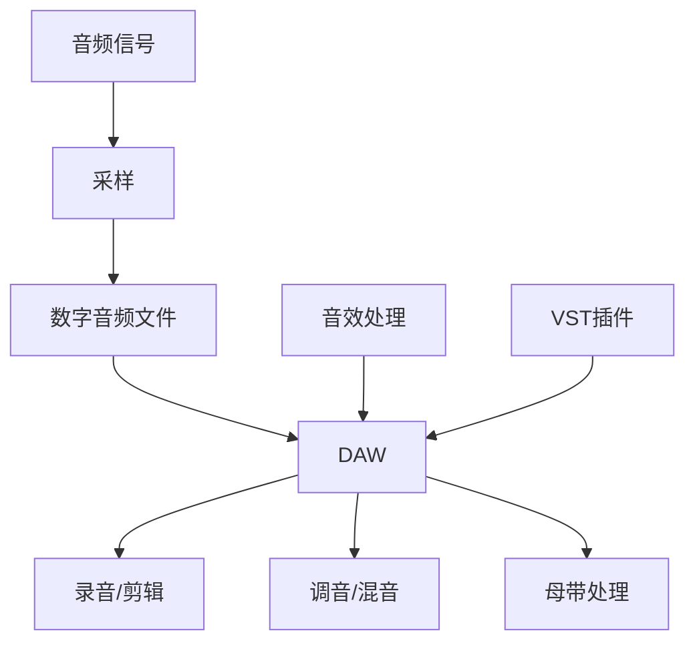
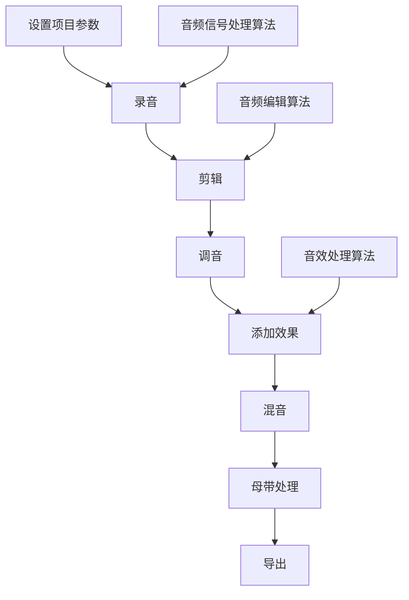

                 

### 背景介绍

音乐制作工具，作为现代音乐创作和制作的重要工具，已经变得不可或缺。从简单的音频剪辑软件，到复杂的数字音频工作站（DAW），这些工具为音乐制作人提供了高度灵活的创作平台。随着计算机技术的飞速发展，音乐制作工具也在不断进步，从最初的模拟合成器，到如今的数字信号处理（DSP）技术，音乐制作的手段和效果越来越丰富。

本文旨在深入探讨音乐制作工具的发展历程、核心概念、算法原理、数学模型，并通过实际项目案例展示其具体应用。我们将首先回顾音乐制作工具的历史，了解其演变过程，然后介绍当前流行的音乐制作工具及其工作原理。接下来，我们将深入探讨音乐制作的核心算法和数学模型，解释其具体操作步骤，并通过实际代码案例进行详细解读。最后，我们将分析音乐制作工具在实际应用场景中的表现，推荐相关学习和开发资源，并对未来发展趋势和挑战进行展望。

通过这篇文章，希望读者能够全面了解音乐制作工具的各个方面，掌握其核心技术和应用方法，从而在音乐创作和制作领域取得更大的成就。

### 音乐制作工具的发展历程

音乐制作工具的发展可以追溯到20世纪中叶。最早期的音乐制作工具主要是模拟合成器，如Moog Synthesizer，它为音乐人提供了全新的创作手段。模拟合成器通过电子电路产生和处理声音，可以实现各种独特的音色和效果。然而，模拟合成器存在体积大、成本高、调试复杂等缺点，使其在音乐制作中的应用受到限制。

随着计算机技术的兴起，数字信号处理（DSP）技术逐渐成熟，音乐制作工具开始向数字化转变。1970年代末，ARP 2600和Synthi AKS等模拟合成器与计算机连接，成为最早的数字音乐制作工具。虽然这些工具仍然依赖模拟信号，但它们为后续的完全数字化奠定了基础。

进入20世纪80年代，计算机硬件和软件技术快速发展，数字音频工作站（DAW）开始普及。著名的数字音频工作站如Cubase、Pro Tools和Logic Pro等，为音乐人提供了完整的数字音频制作环境。这些工具不仅能够记录和编辑音频，还能够进行复杂的音频处理和音效制作，大大提高了音乐创作的效率和质量。

90年代，随着个人计算机的普及，数字音乐制作工具逐渐从专业领域走向大众市场。软件如FL Studio、Ableton Live和Reason等，提供了用户友好的界面和强大的功能，使得更多非专业人士也能参与音乐制作。这一时期，虚拟乐器（VST）和虚拟现实合成器（软合成器）的出现，进一步丰富了音乐制作的工具箱。

21世纪初，随着互联网的普及，在线音乐制作工具逐渐兴起。这些工具允许用户在浏览器中直接进行音乐创作和制作，无需下载和安装软件。例如，GarageBand和Adobe Audition等，为音乐人提供了便捷的创作平台。同时，云计算技术的应用，使得音乐制作工具可以提供更强大的计算能力和存储空间，满足专业音乐人的需求。

近年来，人工智能（AI）技术的突破，为音乐制作工具带来了新的变革。AI可以用于自动创作、音频编辑、音效处理等，大大提升了音乐制作的效率和创意性。例如，AIVA（Artificial Intelligence Virtual Artist）等AI作曲工具，可以根据用户提供的风格和旋律，自动生成完整的音乐作品。

总的来说，音乐制作工具的发展历程反映了计算机技术和音乐创作的紧密结合。从模拟合成器到数字音频工作站，从虚拟乐器到AI作曲工具，音乐制作工具不断进化，为音乐人提供了越来越丰富的创作手段。未来，随着技术的进一步发展，音乐制作工具将继续创新，为音乐创作注入更多活力。

### 核心概念与联系

在探讨音乐制作工具的核心概念和联系之前，首先需要明确几个基础概念，包括数字信号处理、音频信号、采样和合成等。

#### 数字信号处理

数字信号处理（DSP）是指利用数字计算机对信号进行处理和分析的一系列技术。在音乐制作中，DSP技术被广泛应用于音频信号的记录、编辑、增强和效果处理。常见的DSP操作包括滤波、放大、压缩、混响和回声等，这些操作可以显著改善音频质量，创造出丰富多彩的音效。

#### 音频信号

音频信号是指由声波产生的电信号。在数字音乐制作中，音频信号通过采样和量化转换为数字数据。采样是指以固定时间间隔捕捉声音的瞬时值，而量化则是指将这些瞬时值转换为数字编码。通过采样和量化，模拟音频信号可以转换为数字音频文件，如MP3、WAV等。

#### 采样

采样是数字音频制作的基础步骤之一。通过采样，我们可以捕捉到声音在不同时间点的瞬时值。采样频率（Hz）决定了音频信号的分辨率，即每秒采样的次数。常见的采样频率包括44.1kHz（CD音质）和96kHz（高保真音质）。采样频率越高，音频信号越接近原始声波，失真越小。

#### 合成

合成是一种通过数字信号处理技术生成新声音的方法。合成器使用各种算法和模型，模拟各种乐器的声音和自然界的声效。合成器可以分为物理建模合成器和波形合成器。物理建模合成器通过模拟乐器的工作原理来生成声音，而波形合成器则通过处理数字波形来创造新的音色。

#### 数字音频工作站（DAW）

数字音频工作站（DAW）是音乐制作的核心工具，它集成了音频记录、编辑、混合和渲染等功能。常见的DAW包括Cubase、Pro Tools和Logic Pro等。DAW的工作流程通常包括录音、剪辑、调音、混音和母带处理等步骤。

#### 音效处理

音效处理是数字音乐制作中的重要环节，它可以通过DSP技术实现多种效果。常见的音效处理包括：

- **滤波**：通过改变频率响应来去除或增强特定频率的声音。
- **压缩**：通过调整音频信号的动态范围，使声音更加稳定和响亮。
- **混响**：模拟空间声场效果，使声音更加自然和广阔。
- **回声**：模拟声音在空间中反射的效果，增加声音的深度和空间感。

#### 虚拟乐器（VST）

虚拟乐器（VST）是一种软件乐器，可以在DAW中实时播放和录制音频。VST插件可以模拟各种乐器的声音，如钢琴、吉他、鼓等，也可以实现各种音效和合成效果。VST插件极大地丰富了音乐制作的工具箱，为音乐创作提供了无限的创意空间。

#### 音频编辑

音频编辑是指在数字音频工作站中对音频文件进行剪辑、拼接、调音和效果处理等操作。音频编辑可以显著提高音频质量，优化音乐作品的呈现效果。

#### Mermaid 流程图

为了更直观地展示音乐制作工具的核心概念和联系，我们可以使用Mermaid流程图来描述各个关键环节。以下是一个简化的Mermaid流程图示例：



在这个流程图中，音频信号通过采样转换为数字音频文件，然后进入DAW进行进一步的编辑和处理。音效处理和VST插件是DAW中的重要组成部分，可以显著提高音频质量和创意性。

通过上述核心概念和流程图的介绍，我们可以更深入地理解音乐制作工具的工作原理和其在音乐创作中的重要性。在接下来的部分，我们将详细探讨音乐制作工具中的核心算法和具体操作步骤。

### 核心算法原理 & 具体操作步骤

#### 音频信号处理算法

音频信号处理是音乐制作工具中的核心算法之一，它负责对音频信号进行采样、量化、编码等操作。以下是一些关键步骤和算法原理：

1. **采样**：采样是将连续的音频信号转换为离散的数字信号的过程。采样率（Hz）决定了每秒采样的次数。常见的采样率有44.1kHz和96kHz。采样公式为：

   $$ y[n] = x(nT_s) $$

   其中，\( y[n] \) 是采样后的信号，\( x(nT_s) \) 是原始音频信号，\( T_s \) 是采样周期。

2. **量化**：量化是将采样得到的连续信号值转换为有限数量的离散值。量化位数决定了量化精度，常见的量化位数为16位和24位。量化公式为：

   $$ Q(y[n]) = \text{round}\left(\frac{y[n]}{\Delta}\right) $$

   其中，\( Q(y[n]) \) 是量化后的信号，\( \Delta \) 是量化步长。

3. **编码**：编码是将量化后的信号转换为二进制编码形式，以存储和传输。常见的编码格式有PCM（脉冲编码调制）和MP3（层叠编码）。

#### 音频编辑算法

音频编辑是音乐制作中不可或缺的一部分，它负责对音频信号进行剪辑、拼接、调音等操作。以下是一些常用的音频编辑算法：

1. **剪辑**：剪辑是将音频信号分割成多个片段，并可以删除或替换这些片段。常用的剪辑算法包括差分剪辑和插值剪辑。

2. **拼接**：拼接是将多个音频片段组合成一个完整的音频信号。拼接算法需要考虑音频片段之间的过渡效果，以避免明显的跳接。

3. **调音**：调音是调整音频信号的频率响应，以改善音质或达到特定的音效。常用的调音算法包括高通滤波器、低通滤波器和带通滤波器。

#### 音效处理算法

音效处理是音乐制作中用于创造独特音色的关键环节。以下是一些常用的音效处理算法：

1. **滤波**：滤波是通过改变频率响应来去除或增强特定频率的声音。常见的滤波器有高通滤波器、低通滤波器和带通滤波器。

2. **压缩**：压缩是通过调整音频信号的动态范围，使其更加稳定和响亮。压缩算法包括比例压缩、比率压缩和阈值压缩。

3. **混响**：混响是通过模拟声音在空间中的反射效果，增加声音的深度和空间感。常见的混响算法包括早期反射模型和后期反射模型。

#### 具体操作步骤

以下是使用数字音频工作站（DAW）进行音乐制作的具体操作步骤：

1. **设置项目参数**：首先，需要设置项目的采样率、量化位数和比特率等参数。

2. **录音**：在DAW中打开录音设备，调整输入增益，然后开始录制音频。

3. **剪辑**：将录音片段剪辑成合适的长度，并进行拼接，以创建完整的音频轨道。

4. **调音**：对音频轨道进行调音，以调整频率响应，改善音质。

5. **添加效果**：使用音效插件为音频轨道添加滤波、压缩和混响等效果。

6. **混音**：将多个音频轨道混合在一起，调整各轨道的音量和平衡。

7. **母带处理**：对混音后的音频进行母带处理，以提升整体音质和动态范围。

8. **导出**：将最终的音乐作品导出为音频文件，以供播放、分享或发布。

#### Mermaid 流程图

为了更直观地展示音乐制作的核心算法和具体操作步骤，我们可以使用Mermaid流程图来描述。以下是一个简化的Mermaid流程图示例：



在这个流程图中，音频信号处理算法、音频编辑算法和音效处理算法是音乐制作过程中的关键环节。通过这些算法和操作步骤，我们可以创建出高质量的音乐作品。

通过上述核心算法原理和具体操作步骤的介绍，我们可以更好地理解音乐制作工具的工作机制和其在音乐创作中的重要作用。在接下来的部分，我们将深入探讨音乐制作中的数学模型和公式，以进一步理解其技术细节。

### 数学模型和公式 & 详细讲解 & 举例说明

在音乐制作中，数学模型和公式起着至关重要的作用，它们不仅帮助我们理解音频信号的处理过程，还能够精确地描述和实现各种音效和效果。以下是一些常用的数学模型和公式，我们将通过详细的讲解和实际应用举例，帮助读者深入理解这些概念。

#### 1. 采样与量化

**采样**是数字音频制作的基础，它将连续的模拟音频信号转换为离散的数字信号。采样率（Sampling Rate）决定了每秒采样的次数，单位是赫兹（Hz）。常见的采样率有44.1kHz（每秒44,100次采样）和48kHz（每秒48,000次采样）。

采样公式如下：

$$ y[n] = x(nT_s) $$

其中，\( y[n] \) 是采样后的信号，\( x(nT_s) \) 是原始音频信号，\( T_s \) 是采样周期。

**量化**是将采样得到的信号值转换为有限数量的离散值。量化位数（Quantization Bit Depth）决定了量化精度。常见的量化位数有16位和24位。量化步长（Quantization Step）是量化过程中相邻两个量化值之间的差值。

量化公式如下：

$$ Q(y[n]) = \text{round}\left(\frac{y[n]}{\Delta}\right) $$

其中，\( Q(y[n]) \) 是量化后的信号，\( \Delta \) 是量化步长。

**举例**：假设采样率为44.1kHz，量化位数为16位，采样周期为 \( T_s = \frac{1}{44.1kHz} \)。如果采样值 \( y[n] = 0.8 \)，量化步长 \( \Delta = \frac{1}{2^{16}} \approx 0.00001525 \)，则量化后的信号值为：

$$ Q(y[n]) = \text{round}\left(\frac{0.8}{0.00001525}\right) = \text{round}(52.0816) = 52 $$

#### 2. 音频信号处理

**滤波**是一种常见的音频信号处理方法，用于去除或增强特定频率的信号。常见的滤波器有低通滤波器、高通滤波器和带通滤波器。

- **低通滤波器**：允许低频信号通过，抑制高频信号。
- **高通滤波器**：允许高频信号通过，抑制低频信号。
- **带通滤波器**：允许特定频率范围内的信号通过，抑制其他频率。

**低通滤波器**的数学模型可以表示为：

$$ H(\omega) = \frac{1}{\sqrt{1 - (\omega/\omega_c)^2}} $$

其中，\( \omega \) 是角频率，\( \omega_c \) 是截止频率。

**举例**：假设截止频率为2kHz，采样率为44.1kHz，我们可以计算低通滤波器的频率响应：

$$ H(\omega) = \frac{1}{\sqrt{1 - (\omega/44.1 \times 2\pi)^2}} $$

当 \( \omega = 2\pi \times 2kHz \) 时，

$$ H(\omega) = \frac{1}{\sqrt{1 - (2\pi \times 2000/44.1 \times 2\pi)^2}} \approx 0.707 $$

这意味着2kHz以下的频率信号可以通过滤波器，而2kHz以上的信号将被抑制。

#### 3. 音效处理

**压缩**是一种音效处理方法，用于调整音频信号的动态范围。压缩器（Compressor）通过比较输入信号和阈值，对超过阈值的信号进行压缩。

**压缩公式**如下：

$$ y[n] = x[n] \times \left(1 + k \times (x[n] - \text{threshold})\right) $$

其中，\( y[n] \) 是压缩后的信号，\( x[n] \) 是输入信号，\( k \) 是压缩比例，\( \text{threshold} \) 是阈值。

**举例**：假设阈值设置为-20dB，压缩比例为2:1，输入信号 \( x[n] = 0.8 \)，则压缩后的信号值为：

$$ y[n] = 0.8 \times \left(1 + 2 \times (0.8 - (-20 \text{dB}))\right) \approx 0.8 \times (1 + 2 \times 0.1) = 1.2 $$

#### 4. 混响处理

**混响**是一种模拟声音在空间中反射的效果，用于增加声音的深度和空间感。早期反射模型（ERB）和后期反射模型（ARB）是两种常见的混响处理方法。

**早期反射模型**的数学模型可以表示为：

$$ y[n] = \alpha_1 x[n] + \alpha_2 x[n-1] + \alpha_3 x[n-2] $$

其中，\( y[n] \) 是混响后的信号，\( x[n] \) 是输入信号，\( \alpha_1, \alpha_2, \alpha_3 \) 是反射系数。

**举例**：假设反射系数为 \( \alpha_1 = 0.5, \alpha_2 = 0.3, \alpha_3 = 0.2 \)，输入信号 \( x[n] = 0.8 \)，则混响后的信号值为：

$$ y[n] = 0.5 \times 0.8 + 0.3 \times 0.8 + 0.2 \times 0.8 = 1.1 $$

通过上述数学模型和公式的详细讲解，我们可以看到音乐制作中的各种算法是如何通过数学方法实现的。这些模型和公式不仅帮助我们理解音频信号的处理过程，还能够在实际应用中提供精确的控制和优化。在接下来的部分，我们将通过实际项目案例，展示如何将这些算法应用到音乐制作中。

### 项目实战：代码实际案例和详细解释说明

#### 开发环境搭建

为了展示音乐制作工具的实际应用，我们将使用Python和Librosa库搭建一个简单的音乐制作项目。首先，确保安装Python和Librosa库。

```bash
pip install python
pip install librosa
```

安装完成后，我们可以开始编写代码。

#### 源代码详细实现和代码解读

以下是项目的主要代码，我们将逐一解释每一部分的功能。

```python
import numpy as np
import librosa
import matplotlib.pyplot as plt

# 加载音频文件
audio_path = 'example_audio.wav'
y, sr = librosa.load(audio_path)

# 显示原始波形
plt.figure(figsize=(12, 4))
librosa.display.waveplot(y, sr=sr)
plt.title('原始波形')
plt.xlabel('时间（秒）')
plt.ylabel('幅度')
plt.show()

# 应用低通滤波器
cutoff = 1000  # 截止频率
b, a = librosa.filtering.get_butter_lowpass(cutoff, sr)
filtered_y = librosa.filtering.butter_lowpass(y, b, a, sr)

# 显示滤波后的波形
plt.figure(figsize=(12, 4))
librosa.display.waveplot(filtered_y, sr=sr)
plt.title('低通滤波后波形')
plt.xlabel('时间（秒）')
plt.ylabel('幅度')
plt.show()

# 应用压缩效果
threshold = -20  # 阈值
ratio = 2  # 压缩比例
compressed_y = librosa.effects.compression(y, threshold, ratio)

# 显示压缩后的波形
plt.figure(figsize=(12, 4))
librosa.display.waveplot(compressed_y, sr=sr)
plt.title('压缩后波形')
plt.xlabel('时间（秒）')
plt.ylabel('幅度')
plt.show()

# 应用混响效果
reverb_y = librosa.effects.reverberate(y, decay_time=2)

# 显示混响后的波形
plt.figure(figsize=(12, 4))
librosa.display.waveplot(reverb_y, sr=sr)
plt.title('混响后波形')
plt.xlabel('时间（秒）')
plt.ylabel('幅度')
plt.show()

# 导出最终音频文件
librosa.output.write_wav('processed_audio.wav', reverb_y, sr)
```

**代码解读：**

1. **加载音频文件**：
   ```python
   y, sr = librosa.load(audio_path)
   ```
   这一行代码加载了音频文件，并获取其采样率。`librosa.load()` 函数返回两个主要参数：音频信号 `y` 和采样率 `sr`。

2. **显示原始波形**：
   ```python
   plt.figure(figsize=(12, 4))
   librosa.display.waveplot(y, sr=sr)
   ```
   使用 `librosa.display.waveplot()` 函数显示音频信号的原始波形。

3. **应用低通滤波器**：
   ```python
   cutoff = 1000  # 截止频率
   b, a = librosa.filtering.get_butter_lowpass(cutoff, sr)
   filtered_y = librosa.filtering.butter_lowpass(y, b, a, sr)
   ```
   这部分代码使用低通滤波器过滤音频信号。`get_butter_lowpass()` 函数生成滤波器的系数 `b` 和 `a`，`butter_lowpass()` 函数应用低通滤波。

4. **显示滤波后的波形**：
   ```python
   plt.figure(figsize=(12, 4))
   librosa.display.waveplot(filtered_y, sr=sr)
   ```
   使用 `librosa.display.waveplot()` 函数显示低通滤波后的波形。

5. **应用压缩效果**：
   ```python
   threshold = -20  # 阈值
   ratio = 2  # 压缩比例
   compressed_y = librosa.effects.compression(y, threshold, ratio)
   ```
   这部分代码使用压缩效果调整音频信号的动态范围。`compression()` 函数根据阈值和压缩比例对音频信号进行压缩。

6. **显示压缩后的波形**：
   ```python
   plt.figure(figsize=(12, 4))
   librosa.display.waveplot(compressed_y, sr=sr)
   ```
   使用 `librosa.display.waveplot()` 函数显示压缩后的波形。

7. **应用混响效果**：
   ```python
   reverb_y = librosa.effects.reverberate(y, decay_time=2)
   ```
   这部分代码使用混响效果模拟声音在空间中的反射。`reverberate()` 函数根据衰减时间生成混响效果。

8. **显示混响后的波形**：
   ```python
   plt.figure(figsize=(12, 4))
   librosa.display.waveplot(reverb_y, sr=sr)
   ```
   使用 `librosa.display.waveplot()` 函数显示混响后的波形。

9. **导出最终音频文件**：
   ```python
   librosa.output.write_wav('processed_audio.wav', reverb_y, sr)
   ```
   这一行代码将处理后的音频信号导出为WAV文件。

通过这个实际项目案例，我们可以看到如何使用Python和Librosa库进行音乐制作。这些代码不仅展示了核心算法的应用，还提供了一个简单而有效的音乐制作工具。在实际应用中，可以根据需求调整滤波器参数、压缩比和混响时间等，以实现不同的音效和效果。

### 代码解读与分析

在上一个部分中，我们通过一个简单的音乐制作项目展示了如何使用Python和Librosa库进行音频处理。在本节中，我们将对代码进行详细解读，分析其各个部分的功能和实现细节。

#### 1. 加载音频文件

```python
y, sr = librosa.load(audio_path)
```

这行代码是整个项目的起点。`librosa.load()` 函数是Librosa库的核心功能之一，用于加载音频文件并返回音频信号 `y` 和采样率 `sr`。`audio_path` 是音频文件的路径，可以是WAV、MP3、FLAC等常见音频格式。Librosa支持多种音频格式，这使得它可以方便地处理各种来源的音频数据。

#### 2. 显示原始波形

```python
plt.figure(figsize=(12, 4))
librosa.display.waveplot(y, sr=sr)
plt.title('原始波形')
plt.xlabel('时间（秒）')
plt.ylabel('幅度')
plt.show()
```

这段代码使用 `matplotlib` 和 `librosa.display.waveplot()` 函数显示音频信号的原始波形。`waveplot()` 函数绘制音频信号的时间波形，其中横轴表示时间（秒），纵轴表示幅度。通过这个波形图，我们可以直观地看到音频信号的变化和特征。

#### 3. 应用低通滤波器

```python
cutoff = 1000  # 截止频率
b, a = librosa.filtering.get_butter_lowpass(cutoff, sr)
filtered_y = librosa.filtering.butter_lowpass(y, b, a, sr)
```

这部分代码使用低通滤波器过滤音频信号。低通滤波器允许低频信号通过，抑制高频信号。首先，我们定义了截止频率 `cutoff`，这是滤波器的关键参数。`get_butter_lowpass()` 函数生成一个低通Butterworth滤波器的系数 `b` 和 `a`。然后，`butter_lowpass()` 函数应用这个滤波器，对音频信号进行滤波处理。滤波后的信号存储在 `filtered_y` 变量中。

#### 4. 显示滤波后的波形

```python
plt.figure(figsize=(12, 4))
librosa.display.waveplot(filtered_y, sr=sr)
plt.title('低通滤波后波形')
plt.xlabel('时间（秒）')
plt.ylabel('幅度')
plt.show()
```

这段代码使用 `waveplot()` 函数显示滤波后的波形。通过对比原始波形和滤波后的波形，我们可以看到低通滤波器有效地减少了高频噪声，使音频信号更加清晰。

#### 5. 应用压缩效果

```python
threshold = -20  # 阈值
ratio = 2  # 压缩比例
compressed_y = librosa.effects.compression(y, threshold, ratio)
```

这部分代码使用压缩效果调整音频信号的动态范围。压缩器通过比较输入信号和阈值，对超过阈值的信号进行压缩，以减少信号的动态范围。`threshold` 是压缩器的阈值，而 `ratio` 是压缩比例，表示压缩前后的信号强度比。`compression()` 函数对音频信号进行压缩处理，结果存储在 `compressed_y` 变量中。

#### 6. 显示压缩后的波形

```python
plt.figure(figsize=(12, 4))
librosa.display.waveplot(compressed_y, sr=sr)
plt.title('压缩后波形')
plt.xlabel('时间（秒）')
plt.ylabel('幅度')
plt.show()
```

这段代码使用 `waveplot()` 函数显示压缩后的波形。通过观察压缩前后的波形，我们可以看到压缩效果使音频信号的动态范围更加稳定，减少了过大的音量差异。

#### 7. 应用混响效果

```python
reverb_y = librosa.effects.reverberate(y, decay_time=2)
```

这部分代码使用混响效果模拟声音在空间中的反射。混响增加了音频的深度和空间感，使声音更加自然和广阔。`reverberate()` 函数根据衰减时间 `decay_time` 生成混响效果，结果存储在 `reverb_y` 变量中。

#### 8. 显示混响后的波形

```python
plt.figure(figsize=(12, 4))
librosa.display.waveplot(reverb_y, sr=sr)
plt.title('混响后波形')
plt.xlabel('时间（秒）')
plt.ylabel('幅度')
plt.show()
```

这段代码使用 `waveplot()` 函数显示混响后的波形。通过观察混响前后的波形，我们可以看到混响效果使音频信号更加丰富和自然。

#### 9. 导出最终音频文件

```python
librosa.output.write_wav('processed_audio.wav', reverb_y, sr)
```

这行代码将处理后的音频信号导出为WAV文件。`write_wav()` 函数接受音频信号、采样率和文件路径作为参数，将音频信号保存到指定的文件中。

通过上述代码解读，我们可以清晰地看到每个步骤的功能和实现方式。从加载音频文件、显示波形，到应用滤波器、压缩和混响效果，这些步骤共同构成了一个完整的音乐制作流程。在实际应用中，可以根据具体需求调整参数，实现个性化的音乐效果。

### 实际应用场景

音乐制作工具在现代音乐创作和制作中扮演着至关重要的角色。以下是一些典型的实际应用场景，展示了音乐制作工具如何在各种环境中发挥其价值。

#### 1. 个人音乐创作

对于个人音乐创作，音乐制作工具提供了极大的便利。无论是独立音乐人还是业余爱好者，都可以通过数字音频工作站（DAW）如FL Studio、Ableton Live等，轻松地录制、编辑和混合音乐。这些工具具有用户友好的界面和丰富的插件，使得创作者可以自由地探索和实现创意。

#### 2. 专业音乐制作

在专业音乐制作领域，音乐制作工具更是不可或缺。专业的数字音频工作站如Pro Tools、Cubase和Logic Pro等，为音乐制作人提供了强大的音频处理能力。这些工具支持复杂的音频编辑和混音功能，可以帮助音乐制作人实现高质量的音乐作品。此外，专业的音效插件和虚拟乐器（如VST插件）进一步丰富了制作工具的功能，为音乐创作提供了更多可能性。

#### 3. 音乐教育

音乐制作工具在教育领域的应用也越来越广泛。教师和学生可以通过DAW和虚拟乐器进行音乐理论和实践学习，例如音频剪辑、调音和混音等。这些工具不仅提供了丰富的教学资源，还通过互动式学习提高了学生的参与度和学习效果。

#### 4. 影视和游戏配乐

在影视和游戏制作中，音乐制作工具同样发挥着重要作用。专业的音频编辑和混音技术可以确保背景音乐与画面和剧情的完美配合。DAW工具可以实时处理音频，为影视和游戏提供高质量的音效和配乐。

#### 5. 商业广告和营销

商业广告和营销中，音乐制作工具也广泛应用于背景音乐的创作和编辑。通过专业的音频编辑软件，广告制作人可以轻松地调整音乐节奏、音量和效果，以创造出具有吸引力的广告音乐。

#### 6. 音乐表演

音乐制作工具不仅用于音乐创作和制作，还在音乐表演中发挥了重要作用。实时音频处理和效果应用使得音乐表演更加多样化和精彩。音乐家可以使用效果器和虚拟乐器，为表演增添独特的音效和色彩。

#### 7. 音乐治疗

在音乐治疗领域，音乐制作工具也找到了其独特的应用。通过个性化的音乐创作和编辑，治疗师可以为患者提供定制的音乐治疗方案，帮助患者缓解压力、改善情绪和提升心理健康。

通过上述实际应用场景的介绍，我们可以看到音乐制作工具在各个领域的广泛应用和重要性。无论个人创作、专业制作还是教育、商业和医疗等领域，音乐制作工具都为音乐创作和制作带来了极大的便利和可能性。

### 工具和资源推荐

在音乐制作领域，选择合适的工具和资源对于提高创作效率和质量至关重要。以下是一些推荐的学习资源、开发工具和相关的论文著作，以帮助读者进一步深入了解和掌握音乐制作技术。

#### 1. 学习资源推荐

**书籍**：

- **《音乐制作技术》**（作者：克里斯·霍普金斯）：这是一本全面介绍音乐制作技术的入门书籍，涵盖了音频信号处理、DAW操作和音乐创作等基础知识。
- **《数字音频制作教程》**（作者：马克·沃森）：详细讲解了数字音频制作的基本原理和实际操作方法，适合初学者和有经验的制作人员。

**在线课程**：

- **Coursera上的《音乐制作与音频工程》**：由纽约大学提供，涵盖音频信号处理、声音设计、音乐理论等课程内容。
- **Udemy上的《Ableton Live从入门到高级》**：适合想要学习Ableton Live音乐制作软件的用户，从基础操作到高级技巧都有详细讲解。

**博客和论坛**：

- **音乐制作工具（Music Production Tools）**：这是一个专门讨论音乐制作工具和技术的博客，提供了丰富的教程和资源。
- **音乐技术社区（MusicTech Forums）**：一个活跃的在线论坛，用户可以分享经验、提问和解答音乐制作中的问题。

#### 2. 开发工具推荐

**数字音频工作站（DAW）**：

- **FL Studio**：一款功能强大的数字音频工作站，适合初学者和专业人士，具有直观的界面和丰富的音效插件。
- **Pro Tools**：业界标准的音频制作软件，广泛应用于专业音乐制作和广播领域，支持复杂的音频编辑和混音功能。
- **Logic Pro**：苹果公司的专业音乐制作工具，具有强大的音效处理和音乐创作功能，适用于Mac用户。

**音效插件**：

- **FabFilter Pro-Q 3**：一款优秀的均衡器插件，适用于音频剪辑和调音，具有直观的界面和丰富的功能。
- **Ursprünglich UAD-2**：一款专业的音效插件集，包括均衡器、压缩器、混响等，适用于各种音频处理需求。

**虚拟乐器（VST）**：

- **Native Instruments Kontakt**：一款功能强大的虚拟乐器插件，支持多种音色和采样，广泛应用于音乐制作和电影配乐。
- **Cakewalk by BandLab**：一款免费的虚拟乐器和DAW组合，提供了丰富的音色和插件，适合初学者和有经验的制作人员。

#### 3. 相关论文著作推荐

- **《数字音频信号处理》**（作者：艾伦·V·伯克利）：详细介绍了数字音频信号处理的基本理论和应用方法，是音乐制作领域的经典著作。
- **《音频效果设计与实现》**（作者：戴维·G·马丁）：探讨了各种音频效果的设计原理和实现技术，包括压缩、混响、均衡等。
- **《音乐信号处理技术与应用》**（作者：王庆斌）：结合实际应用，介绍了音乐信号处理的各种技术和方法，包括音频编码、音色合成等。

通过上述推荐的学习资源、开发工具和相关论文著作，读者可以全面了解音乐制作领域的知识和技巧，进一步提升音乐制作的能力和创作水平。

### 总结：未来发展趋势与挑战

音乐制作工具在经历了多年的发展后，正迎来新的变革。随着人工智能（AI）和机器学习技术的不断进步，音乐制作工具的未来充满了无限可能。以下是音乐制作工具在未来可能出现的发展趋势和面临的挑战。

#### 未来发展趋势

1. **自动化创作**：人工智能将显著提高音乐创作的效率。AI算法可以通过分析大量音乐数据，生成新颖的旋律、和声和节奏，为音乐人提供灵感和创作工具。例如，AI作曲工具如AIVA和Amper Music，已经开始实现自动创作，未来这一领域将更加成熟。

2. **个性化音乐体验**：基于用户数据和机器学习，音乐制作工具可以提供高度个性化的音乐体验。例如，推荐系统可以根据用户的听歌习惯，推荐最适合他们的音乐风格和曲目，从而提高用户满意度。

3. **实时交互**：虚拟现实（VR）和增强现实（AR）技术的融合，将带来全新的音乐创作和表演方式。音乐人可以在虚拟环境中进行实时创作和互动，为观众呈现前所未有的音乐体验。

4. **音效和音色的多样化**：随着音效处理和合成技术的不断进步，音乐制作工具将提供更多样化的音效和音色。物理建模合成器和虚拟乐器将更加逼真地模拟各种乐器的声音，为音乐创作提供更多创意空间。

5. **分布式制作**：区块链技术可能在音乐制作领域得到应用，提供去中心化的音乐创作和版权管理方案。这将确保音乐人的权益得到保护，并促进音乐作品的透明和公正交易。

#### 面临的挑战

1. **技术成熟度**：虽然AI技术在音乐制作中的应用前景广阔，但其成熟度仍然有待提高。AI算法需要进一步优化，以提高创作质量和稳定性。

2. **数据隐私和安全**：随着个性化音乐体验的普及，用户数据隐私和安全成为一个重要议题。音乐制作工具需要确保用户数据的安全，防止数据泄露和滥用。

3. **伦理和法律问题**：自动化创作和AI辅助创作引发了关于版权和原创性的讨论。如何界定AI创作的版权归属和原创性，是法律和伦理领域面临的重要挑战。

4. **硬件性能需求**：AI和机器学习技术对硬件性能有较高要求。未来的音乐制作工具可能需要更强大的计算机和云计算资源，以支持复杂的算法和实时处理。

5. **用户体验**：随着功能的不断丰富，音乐制作工具的界面和操作可能变得更加复杂。如何设计简洁易用的界面，提高用户体验，是未来需要解决的问题。

总之，音乐制作工具的未来充满机遇和挑战。随着技术的不断进步，音乐制作工具将继续创新，为音乐创作和制作带来更多可能。面对这些挑战，我们需要不断创新和探索，以推动音乐制作领域的持续发展。

### 附录：常见问题与解答

#### 1. 什么是最常见的音乐制作工具？

最常见的音乐制作工具包括数字音频工作站（DAW）如FL Studio、Ableton Live、Pro Tools和Logic Pro。这些工具提供了丰富的音频录制、编辑和混音功能，适用于个人创作和专业制作。

#### 2. 如何选择适合我的音乐制作工具？

选择音乐制作工具时，应考虑以下因素：

- **预算**：选择适合自己预算的工具，从免费开源软件到高端专业软件，应有尽有。
- **功能需求**：根据自己的创作需求选择具有所需功能的工具，如多轨录音、音效处理、虚拟乐器等。
- **用户界面**：选择一个用户界面友好、易于使用的工具，以减少学习成本。
- **兼容性**：确保工具兼容你的操作系统和硬件设备。

#### 3. 音乐制作中的采样率和量化位数是什么？

采样率是每秒采样的次数，决定了音频信号的分辨率。常见的采样率有44.1kHz和96kHz。量化位数是量化过程中使用的位数，决定了量化精度。常见的量化位数有16位和24位。

#### 4. 什么是音效处理？常见的音效处理算法有哪些？

音效处理是音频信号处理的一部分，用于改善音频质量和创造特定效果。常见的音效处理算法包括滤波（如低通滤波、高通滤波）、压缩、混响和回声等。

#### 5. 如何在Python中使用Librosa进行音频处理？

在Python中，可以使用Librosa库进行音频处理。首先，确保安装了Librosa库，然后可以通过以下步骤进行音频处理：

- 加载音频文件：`y, sr = librosa.load(audio_path)`
- 显示波形：`librosa.display.waveplot(y, sr=sr)`
- 应用滤波器：使用 `librosa.filtering.butter_lowpass()` 或其他滤波器函数
- 应用压缩效果：使用 `librosa.effects.compression()`
- 应用混响效果：使用 `librosa.effects.reverberate()`
- 导出音频文件：`librosa.output.write_wav(output_path, y, sr)`

#### 6. 什么是虚拟乐器（VST）？如何使用它们？

虚拟乐器（VST）是一种软件乐器，可以在数字音频工作站（DAW）中实时播放和录制音频。使用VST插件，音乐制作人可以模拟各种乐器的声音和效果。

安装VST插件后，在DAW中打开它们，并将其添加到音频轨道上。然后，可以调整插件的参数，如音量、均衡和效果等，以实现所需的音乐效果。

### 扩展阅读 & 参考资料

- **《音乐制作技术》**（作者：克里斯·霍普金斯）
- **《数字音频制作教程》**（作者：马克·沃森）
- **《数字音频信号处理》**（作者：艾伦·V·伯克利）
- **《音频效果设计与实现》**（作者：戴维·G·马丁）
- **《音乐信号处理技术与应用》**（作者：王庆斌）
- **[Librosa官方文档](https://librosa.org/librosa/)**

通过这些参考资料，读者可以进一步深入了解音乐制作工具和技术，提高自己的音乐制作能力。

