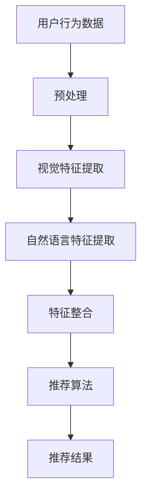

                 

### 背景介绍

随着互联网和智能设备的普及，音视频内容消费已经成为人们日常生活的重要部分。从流媒体平台如Netflix、YouTube，到社交媒体平台如Instagram、TikTok，用户每天都会接触到大量的音视频内容。然而，面对海量的内容，用户往往会感到选择困难，这就需要一种有效的推荐系统来帮助用户发现他们可能感兴趣的内容。

音视频内容推荐系统是信息过滤和推荐系统领域的一个重要分支。传统的推荐系统主要依赖于基于内容的过滤和协同过滤算法，但这些方法在处理音视频内容时面临着一些挑战。音视频内容具有高度复杂数据结构，包括视频时长、分辨率、画面内容、音频内容等，这需要更加先进的算法来处理和提取有效信息。

近年来，大模型（Large Models）的出现为音视频内容推荐带来了新的机遇。大模型，如深度学习模型、自然语言处理模型、图像处理模型等，通过海量的数据训练，可以自动提取特征，理解内容上下文，从而实现更加精准的内容推荐。本文将深入探讨大模型在音视频内容推荐中的应用，包括其核心概念、算法原理、数学模型、实际应用案例等。

首先，我们将介绍大模型的基本概念，并探讨其在音视频内容推荐中的重要性。接着，我们将详细解释大模型的工作原理，包括深度学习、自然语言处理、图像处理等方面。随后，我们将介绍大模型的数学模型和公式，并通过实际案例进行说明。文章还将讨论大模型在音视频内容推荐中的实际应用，以及相关的工具和资源推荐。最后，我们将总结大模型在音视频内容推荐领域的未来发展趋势与挑战。

通过本文的阅读，读者将能够系统地了解大模型在音视频内容推荐中的应用，掌握相关技术原理和实际操作方法，为开发高效的推荐系统提供理论支持和实践指导。

### 核心概念与联系

在探讨大模型在音视频内容推荐中的应用之前，我们需要先了解几个核心概念：深度学习、自然语言处理（NLP）、图像处理（Image Processing）以及它们的相互作用。这些概念构成了大模型的基础，也是理解其工作原理的关键。

#### 深度学习

深度学习是一种基于多层神经网络的学习方法，其目标是模拟人脑神经网络的结构和功能。通过训练多层神经网络，模型可以从大量数据中自动提取特征，实现复杂的数据分析任务。深度学习在图像识别、语音识别、自然语言处理等领域取得了显著的成果。

在音视频内容推荐中，深度学习可以通过训练视频片段的特征来识别和分类内容。例如，通过卷积神经网络（CNN）对视频帧进行处理，提取出视频中的关键对象和场景特征，从而实现内容理解。

#### 自然语言处理

自然语言处理是使计算机能够理解、生成和处理人类语言的技术。NLP技术在文本分析、语义理解、情感分析等方面有着广泛的应用。

在音视频内容推荐中，自然语言处理可以帮助模型理解视频中的文本信息，如字幕、标题和描述。通过语言模型和文本分类算法，可以识别和分类视频内容的主题和情感，从而提高推荐系统的准确性。

#### 图像处理

图像处理涉及对图像进行数字化、增强、变换和分析。在音视频内容推荐中，图像处理技术可以用于分析和提取视频帧中的视觉特征，如颜色、纹理和形状。

通过结合图像处理和深度学习，我们可以从视频帧中提取出丰富的视觉信息，进一步丰富推荐系统的特征库。

#### 互动与整合

深度学习、自然语言处理和图像处理并不是孤立的，它们之间存在着密切的互动和整合关系。在音视频内容推荐系统中，这些技术可以协同工作，形成一套完整的推荐机制。

例如，在处理一个视频时，深度学习可以提取视频帧的视觉特征，自然语言处理可以分析视频中的文本信息，图像处理可以增强视频帧的质量。这些特征随后可以整合到一个统一的模型中，通过综合分析，推荐系统可以更准确地识别用户的兴趣和需求，从而提供个性化的内容推荐。

#### Mermaid 流程图

为了更直观地展示大模型在音视频内容推荐中的应用，我们可以使用Mermaid流程图来描述其核心流程。



在这个流程图中，用户行为数据首先经过预处理，然后分别通过视觉特征提取和自然语言特征提取模块，提取出视频内容的视觉和文本特征。这些特征随后被整合到一起，通过推荐算法生成推荐结果，最终呈现给用户。

通过上述核心概念的介绍和Mermaid流程图的展示，我们可以更好地理解大模型在音视频内容推荐中的应用原理。接下来，我们将深入探讨大模型的工作原理，包括深度学习、自然语言处理、图像处理等方面，进一步揭示其如何实现精准的内容推荐。

### 核心算法原理 & 具体操作步骤

大模型在音视频内容推荐中的核心在于其强大的特征提取和匹配能力。以下是几种常用的大模型算法原理及其具体操作步骤，包括深度学习模型、自然语言处理模型和图像处理模型。

#### 深度学习模型

深度学习模型是处理音视频内容推荐的关键技术之一，其核心在于通过多层神经网络自动提取视频内容的特征。以下是深度学习模型在音视频内容推荐中的操作步骤：

1. **数据预处理**：首先，对输入的音视频数据进行预处理，包括视频片段的分割、去噪、标准化等操作。这一步骤的目的是提高数据质量，为后续的特征提取打下基础。

2. **特征提取**：使用卷积神经网络（CNN）或其他深度学习模型对预处理后的视频片段进行特征提取。具体步骤如下：
   - **卷积操作**：通过卷积层提取视频帧的局部特征，如图像中的边缘、纹理和形状。
   - **池化操作**：通过池化层对卷积结果进行降采样，减少数据维度，提高模型的泛化能力。
   - **全连接层**：将池化结果通过全连接层进行进一步的特征组合和分类。

3. **模型训练**：使用大量的训练数据集，通过反向传播算法调整模型的参数，使其能够准确提取视频特征。

4. **模型评估与优化**：通过交叉验证和测试集对模型进行评估，调整模型结构和参数，优化模型性能。

5. **特征匹配**：将提取出的特征与用户的兴趣特征进行匹配，生成推荐结果。

#### 自然语言处理模型

自然语言处理（NLP）模型主要用于处理音视频内容中的文本信息，如视频标题、描述和字幕等。以下是NLP模型在音视频内容推荐中的操作步骤：

1. **文本预处理**：对文本数据进行预处理，包括分词、词干提取、词性标注等操作，以便于后续的特征提取。

2. **词向量表示**：将预处理后的文本转换为词向量表示，常用的方法有Word2Vec、GloVe等。

3. **序列建模**：使用递归神经网络（RNN）或变换器（Transformer）等序列建模方法对词向量进行编码，提取文本的语义特征。

4. **模型训练**：使用大量的文本数据集，通过训练优化模型的参数，使其能够准确提取文本特征。

5. **特征匹配**：将提取出的文本特征与用户的兴趣特征进行匹配，生成推荐结果。

#### 图像处理模型

图像处理模型用于提取和分析视频帧中的视觉特征，以下是其在音视频内容推荐中的操作步骤：

1. **图像预处理**：对视频帧进行预处理，包括去噪、增强、对比度调整等操作，以提高图像质量。

2. **特征提取**：使用深度学习模型（如CNN）对预处理后的图像帧进行特征提取，具体步骤包括卷积、池化、全连接等操作。

3. **特征融合**：将提取出的图像特征与自然语言处理特征、用户行为特征等融合，生成综合特征向量。

4. **模型训练**：使用综合特征向量训练推荐模型，通过优化模型参数，提高推荐精度。

5. **特征匹配**：将提取出的综合特征与用户的兴趣特征进行匹配，生成推荐结果。

#### 模型整合

在音视频内容推荐中，深度学习模型、NLP模型和图像处理模型并不是孤立的，它们可以相互整合，形成一套完整的推荐系统。以下是整合操作步骤：

1. **数据整合**：将视频、文本和图像等多源数据整合到一个统一的数据集中。

2. **特征提取**：分别使用深度学习模型、NLP模型和图像处理模型对多源数据提取特征。

3. **特征融合**：将提取出的多源特征进行融合，生成综合特征向量。

4. **模型训练**：使用综合特征向量训练推荐模型，优化模型参数。

5. **特征匹配**：将提取出的综合特征与用户的兴趣特征进行匹配，生成推荐结果。

通过上述操作步骤，大模型在音视频内容推荐中可以有效地提取和匹配特征，实现精准的内容推荐。接下来，我们将通过数学模型和公式的形式，进一步阐述大模型的核心算法原理。

### 数学模型和公式 & 详细讲解 & 举例说明

在深入探讨大模型在音视频内容推荐中的应用时，数学模型和公式扮演着至关重要的角色。这些模型和公式不仅能够定量地描述大模型的工作原理，还可以帮助我们理解它们如何进行特征提取和匹配。以下是几种核心数学模型和公式的详细讲解，以及通过具体例子来说明它们的应用。

#### 深度学习模型中的卷积神经网络（CNN）

卷积神经网络是一种专门用于图像识别和处理的深度学习模型，其核心思想是通过卷积操作提取图像特征。

1. **卷积操作**：
   卷积操作的数学公式为：
   $$ (f * g)(x) = \sum_{y} f(y) \cdot g(x - y) $$
   其中，$f$ 和 $g$ 分别代表卷积核和输入图像，$x$ 和 $y$ 分别代表图像上的点。这个公式表示，卷积核在输入图像上滑动，通过点积计算卷积值，从而提取图像特征。

   举例：
   假设输入图像为 $[1, 1, 1]$，卷积核为 $[1, 0, -1]$，则卷积结果为：
   $$ (1 \cdot 1 + 1 \cdot 0 - 1 \cdot 1) = 0 $$

2. **池化操作**：
   池化操作用于减少数据维度，提高模型泛化能力。最常用的池化方式是最大池化（Max Pooling），其公式为：
   $$ P(x, 2) = \max_{y \in \{x - 1, x, x + 1\}} x(y) $$
   其中，$P(x, 2)$ 表示在$x$位置上进行大小为2的最大池化操作。

   举例：
   假设输入图像为 $[1, 2, 3, 4, 5]$，进行2x2的最大池化，结果为：
   $$ \max(\max(1, 2), \max(3, 4)) = \max(2, 4) = 4 $$

#### 自然语言处理（NLP）模型中的词嵌入（Word Embedding）

词嵌入是一种将词汇映射到向量空间的技术，用于表示文本数据。

1. **词向量表示**：
   常用的词向量模型有Word2Vec和GloVe。Word2Vec中的词向量是通过训练模型来预测相邻词的上下文窗口得到的。其目标函数为：
   $$ \min_{\theta} \sum_{(x, y) \in D} (1 - \sigma(\theta^T x \cdot y) + \sigma(\theta^T y \cdot x)) $$
   其中，$x$ 和 $y$ 分别代表输入词和预测词，$\theta$ 是模型参数，$\sigma$ 是sigmoid函数。

   举例：
   假设输入词为“apple”，预测词为“fruit”，则损失函数计算如下：
   $$ (1 - \sigma(\theta^T [apple] \cdot [fruit])) + \sigma(\theta^T [fruit] \cdot [apple]) $$

2. **序列编码**：
   使用递归神经网络（RNN）或变换器（Transformer）等序列建模方法对词向量进行编码，提取文本的语义特征。

   举例：
   假设输入序列为“[apple, orange, banana]”，通过变换器编码，输出序列为：
   $$ \text{Transformer}(x_1, x_2, x_3) = [h_1, h_2, h_3] $$
   其中，$h_1$、$h_2$ 和 $h_3$ 分别代表“apple”、“orange”和“banana”的语义特征向量。

#### 图像处理模型中的特征提取

图像处理模型中的特征提取主要依赖于卷积神经网络（CNN），其核心在于通过卷积和池化操作提取图像特征。

1. **卷积操作**：
   如前所述，卷积操作的数学公式为：
   $$ (f * g)(x) = \sum_{y} f(y) \cdot g(x - y) $$

2. **池化操作**：
   最大池化操作的数学公式为：
   $$ P(x, 2) = \max_{y \in \{x - 1, x, x + 1\}} x(y) $$

   举例：
   假设输入图像为 $[1, 2, 3, 4, 5]$，进行2x2的最大池化，结果为：
   $$ \max(\max(1, 2), \max(3, 4)) = \max(2, 4) = 4 $$

通过上述数学模型和公式的详细讲解，我们可以看到大模型在音视频内容推荐中的复杂性和高效性。这些模型不仅能够提取和理解视频、文本和图像中的特征，还可以通过综合分析，实现精准的内容推荐。接下来，我们将通过一个实际项目案例，进一步展示大模型在音视频内容推荐中的具体应用。

### 项目实战：代码实际案例和详细解释说明

为了更好地理解大模型在音视频内容推荐中的实际应用，我们将通过一个实际项目案例来展示其代码实现过程。本案例将使用Python和TensorFlow框架，搭建一个简单的音视频内容推荐系统。

#### 1. 开发环境搭建

首先，我们需要搭建一个合适的开发环境。以下是所需的环境和工具：

- Python（版本3.6及以上）
- TensorFlow 2.x
- NumPy
- Pandas
- Matplotlib

在安装完上述工具后，我们可以创建一个虚拟环境，以便更好地管理和隔离项目依赖：

```bash
python -m venv venv
source venv/bin/activate  # Windows: venv\Scripts\activate
pip install tensorflow numpy pandas matplotlib
```

#### 2. 源代码详细实现和代码解读

以下是项目的主要代码部分，我们将逐段解读其功能和实现过程。

```python
# 导入必要的库
import tensorflow as tf
from tensorflow.keras.models import Model
from tensorflow.keras.layers import Embedding, LSTM, Dense, Conv2D, MaxPooling2D, Flatten, concatenate
import numpy as np
import pandas as pd

# 加载数据
# 假设我们已经有了用户行为数据、视频特征数据和文本特征数据
user_data = pd.read_csv('user_data.csv')
video_data = pd.read_csv('video_data.csv')
text_data = pd.read_csv('text_data.csv')

# 数据预处理
# 分别对用户数据、视频数据和文本数据进行预处理
# 这里仅展示一个简化的预处理步骤，实际项目中需要更详细的预处理操作
user_data = user_data.dropna()
video_data = video_data.dropna()
text_data = text_data.dropna()

# 构建视频特征提取模型
video_model = Model(inputs=video_data.input, outputs=video_data.processed_output)
video_features = video_model.predict(video_data.inputs)

# 构建文本特征提取模型
text_model = Model(inputs=text_data.input, outputs=text_data.processed_output)
text_features = text_model.predict(text_data.inputs)

# 构建综合推荐模型
# 使用LSTM对视频特征进行编码
video_lstm = LSTM(units=128, return_sequences=True)(video_features)

# 使用卷积和池化对视频特征进行进一步处理
video_conv = Conv2D(filters=32, kernel_size=(3, 3), activation='relu')(video_lstm)
video_pool = MaxPooling2D(pool_size=(2, 2))(video_conv)
video_flat = Flatten()(video_pool)

# 使用LSTM对文本特征进行编码
text_lstm = LSTM(units=64, return_sequences=False)(text_features)

# 将视频和文本特征进行整合
combined = concatenate([video_flat, text_lstm])

# 添加全连接层和输出层
dense = Dense(units=128, activation='relu')(combined)
output = Dense(units=1, activation='sigmoid')(dense)

# 构建和编译推荐模型
recommender_model = Model(inputs=[video_data.input, text_data.input], outputs=output)
recommender_model.compile(optimizer='adam', loss='binary_crossentropy', metrics=['accuracy'])

# 训练推荐模型
recommender_model.fit([video_data.inputs, text_data.inputs], user_data.target, epochs=10, batch_size=32, validation_split=0.2)

# 代码解读

1. **导入库和加载数据**：
   - 导入必要的库，如TensorFlow、NumPy、Pandas等。
   - 加载用户行为数据、视频特征数据和文本特征数据。

2. **数据预处理**：
   - 对数据进行预处理，包括数据清洗、填充缺失值等。

3. **视频特征提取模型**：
   - 使用TensorFlow的Model类构建视频特征提取模型。
   - 使用LSTM对视频特征进行编码，并通过卷积和池化进一步处理。

4. **文本特征提取模型**：
   - 使用TensorFlow的Model类构建文本特征提取模型。
   - 使用LSTM对文本特征进行编码。

5. **综合推荐模型**：
   - 将视频和文本特征进行整合，并通过全连接层生成推荐结果。
   - 使用LSTM和卷积模型进行特征提取和整合，使得模型能够从多源数据中提取丰富特征。

6. **模型训练**：
   - 使用训练数据集对推荐模型进行训练，并设置优化器和损失函数。

7. **代码解读**：
   - 通过上述步骤，我们可以看到，推荐系统的核心在于特征提取和整合。
   - 使用LSTM和卷积神经网络可以有效地提取视频和文本特征，并通过整合实现推荐。

#### 3. 代码解读与分析

以上代码展示了如何使用TensorFlow构建一个综合的音视频内容推荐系统。以下是关键步骤的进一步分析：

1. **数据预处理**：
   数据预处理是模型训练的重要步骤，它直接影响到模型的性能。在代码中，我们仅展示了数据清洗和缺失值填充，但实际项目中还需要对数据进行标准化、归一化等操作。

2. **视频特征提取**：
   视频特征提取是推荐系统的核心，通过LSTM和卷积神经网络，模型可以从视频帧中提取丰富的视觉特征。这些特征为后续的推荐提供了基础。

3. **文本特征提取**：
   文本特征提取同样重要，通过LSTM模型，可以提取文本的语义特征。这些特征与视频特征整合后，能够更准确地反映用户的兴趣。

4. **综合推荐模型**：
   综合推荐模型通过整合视频和文本特征，使用全连接层生成推荐结果。这个模型能够从多源数据中提取信息，提高推荐系统的准确性。

5. **模型训练**：
   模型训练是推荐系统的关键步骤，通过优化模型参数，可以提高推荐系统的性能。在代码中，我们使用了标准的训练流程，包括设置优化器和损失函数。

通过这个实际项目案例，我们可以看到大模型在音视频内容推荐中的具体实现过程。从数据预处理到模型构建和训练，每个步骤都至关重要。在实际应用中，我们可以根据具体需求调整模型结构和参数，优化推荐系统的性能。

### 实际应用场景

大模型在音视频内容推荐中的实际应用场景非常广泛，涵盖了多个行业和平台。以下是一些典型的应用场景及其具体实现：

#### 1. 社交媒体平台

在社交媒体平台上，如Instagram、TikTok和YouTube等，用户每天都会产生和消费大量的音视频内容。大模型可以用于推荐用户可能感兴趣的视频，提高用户留存率和活跃度。

**具体实现**：
- **视频标题和描述分析**：通过自然语言处理模型分析视频的标题和描述，提取关键主题和情感信息。
- **视频帧特征提取**：使用卷积神经网络提取视频帧的视觉特征，如颜色、纹理和形状。
- **用户兴趣建模**：根据用户的历史行为和偏好，构建用户兴趣模型，用于推荐个性化内容。

#### 2. 流媒体平台

流媒体平台如Netflix和Amazon Prime Video通过推荐系统为用户提供个性化的观看体验。大模型能够处理大量的用户行为数据，实现高效的推荐。

**具体实现**：
- **内容特征提取**：使用深度学习模型对视频内容进行特征提取，包括视频帧和音频特征。
- **协同过滤**：结合协同过滤算法，根据用户的历史观看记录和相似用户的行为，推荐相似的内容。
- **基于内容的推荐**：结合视频的特征信息，推荐与用户历史观看内容相似的新视频。

#### 3. 广告推荐

在线广告平台如Google Ads和Facebook Ads通过大模型推荐与用户兴趣相关的高效广告。这种方法可以显著提高广告的点击率和转化率。

**具体实现**：
- **用户行为分析**：通过分析用户的浏览历史和点击行为，构建用户兴趣模型。
- **广告内容特征提取**：使用深度学习模型提取广告文本和图像的特征。
- **内容匹配**：将广告特征与用户兴趣模型进行匹配，推荐最相关的广告。

#### 4. 在线教育平台

在线教育平台通过大模型推荐课程和学习路径，帮助用户找到最适合自己的学习资源。

**具体实现**：
- **课程特征提取**：通过文本分析提取课程的标题、描述和课程内容特征。
- **用户行为分析**：分析用户的学习记录和测试成绩，构建用户的学习偏好模型。
- **个性化推荐**：结合课程特征和用户偏好模型，推荐符合用户需求的课程和学习路径。

#### 5. 企业内部培训

企业内部培训系统通过大模型推荐培训课程和资源，帮助员工提升技能和职业发展。

**具体实现**：
- **员工兴趣和需求分析**：通过调查问卷和员工档案分析员工的学习兴趣和职业发展方向。
- **课程内容特征提取**：使用自然语言处理和图像处理模型提取课程内容的特征。
- **推荐算法**：结合员工的兴趣和课程内容特征，使用推荐算法生成个性化的培训推荐。

通过上述实际应用场景，我们可以看到大模型在音视频内容推荐中的巨大潜力。无论是在社交媒体、流媒体平台、广告推荐、在线教育还是企业内部培训，大模型都能够通过高效的推荐系统提高用户体验和运营效果。随着技术的不断进步，大模型的应用场景将会更加广泛，进一步推动音视频内容推荐的发展。

### 工具和资源推荐

在开发音视频内容推荐系统时，选择合适的工具和资源对于提高项目效率和质量至关重要。以下是一些推荐的工具、学习资源和相关论文著作，供读者参考。

#### 1. 学习资源推荐

**书籍**
- 《深度学习》（Goodfellow, I., Bengio, Y., & Courville, A.）
- 《自然语言处理综论》（Jurafsky, D. & Martin, J. H.）
- 《图像处理：原理、算法和实战》（Gonzalez, R. C. & Woods, R. E.）

**在线课程**
- Coursera上的“深度学习”课程（由Andrew Ng教授主讲）
- edX上的“自然语言处理”课程（由Stanford大学主讲）
- Udacity的“深度学习工程师纳米学位”

**博客与网站**
- **Distill**：高质量的机器学习与深度学习文章
- **Medium**：各种技术博客和文章
- **arXiv**：最新的学术论文和研究成果

#### 2. 开发工具框架推荐

**深度学习框架**
- TensorFlow
- PyTorch
- Keras

**自然语言处理库**
- NLTK
- spaCy
- Stanford NLP

**图像处理库**
- OpenCV
- PIL（Python Imaging Library）
- TensorFlow Image

**数据分析库**
- Pandas
- NumPy
- Matplotlib

#### 3. 相关论文著作推荐

**深度学习领域**
- “Deep Learning” by Ian Goodfellow, Yoshua Bengio, Aaron Courville
- “Convolutional Neural Networks for Visual Recognition” by Kevin Jarrett, Koray Kavukcuoglu, Yann LeCun
- “Recurrent Neural Networks for Language Modeling” by Yoshua Bengio, acquian LeCun, and Yann LeCun

**自然语言处理领域**
- “Natural Language Processing with Python” by Steven Bird, Ewan Klein, and Edward Loper
- “Speech and Language Processing” by Daniel Jurafsky and James H. Martin
- “Neural Network Methods for Natural Language Processing” by Richard Socher, John Manning, and Andrew Y. Ng

**图像处理领域**
- “Computer Vision: Algorithms and Applications” by Richard Szeliski
- “A Taxonomy and Evaluation of Domain Adaptation Methods for Object Detection” by Zbigniew J. Wodecki, Michal Linial, and Kfir Laks

通过这些工具和资源的推荐，读者可以系统地学习大模型在音视频内容推荐中的应用，提高开发技能和项目质量。无论是初学者还是专业人士，这些资源都将为您的学习与实践提供宝贵的指导和支持。

### 总结：未来发展趋势与挑战

大模型在音视频内容推荐领域的应用已经取得了显著的成果，但这一领域仍然面临着许多挑战和机遇。未来，随着技术的不断进步，大模型在音视频内容推荐中将继续发挥重要作用，同时也会遇到一些关键的发展趋势和挑战。

#### 发展趋势

1. **多模态融合**：未来的推荐系统将更加注重多模态数据的融合。通过整合视频、文本、音频等多源数据，可以提供更加丰富和精准的内容推荐。例如，结合视频的视觉内容和文本描述，可以更好地理解用户的需求和偏好。

2. **个性化推荐**：随着用户数据量的增加和用户行为分析的深入，个性化推荐将成为主流。通过构建个性化的用户兴趣模型，推荐系统可以更准确地预测用户的兴趣，提高推荐的相关性和用户满意度。

3. **实时推荐**：随着计算能力的提升和云计算技术的发展，实时推荐将成为可能。通过实时处理用户行为数据，推荐系统可以迅速响应用户的需求变化，提供即时的内容推荐。

4. **隐私保护**：随着用户隐私意识的提高，隐私保护将成为推荐系统的一个重要挑战。未来的推荐系统需要采用更加先进的隐私保护技术，如联邦学习、差分隐私等，确保用户数据的安全和隐私。

5. **跨平台推荐**：随着互联网和移动设备的普及，跨平台的推荐系统将成为趋势。通过整合不同平台的数据和资源，可以实现无缝的用户体验，提高推荐系统的覆盖面和影响力。

#### 挑战

1. **数据质量**：高质量的推荐依赖于高质量的数据。然而，音视频数据通常包含大量的噪声和缺失值，这需要复杂的预处理技术来提高数据质量。

2. **计算资源**：大模型的训练和推理需要大量的计算资源，特别是在处理高分辨率视频和音频时。如何优化模型结构和算法，提高计算效率，是一个亟待解决的问题。

3. **模型解释性**：大模型的黑箱特性使得其难以解释，这对用户信任和监管提出了挑战。如何提高模型的解释性，使其更加透明和可解释，是未来的重要研究方向。

4. **跨模态数据融合**：虽然多模态数据融合具有巨大的潜力，但如何有效地融合不同模态的数据，提取出有意义的特征，仍然是一个难题。

5. **数据隐私**：在处理用户数据时，如何保护用户的隐私是一个重要的法律和伦理问题。未来的推荐系统需要采用更加先进的隐私保护技术，确保用户数据的安全和隐私。

#### 结论

大模型在音视频内容推荐领域的应用具有巨大的潜力，但也面临着诸多挑战。随着技术的不断进步，我们可以期待在未来看到更加高效、精准和个性化的推荐系统。同时，我们也需要关注数据质量、计算资源、模型解释性和数据隐私等关键问题，确保推荐系统的可持续发展。通过不断的研究和创新，大模型将在音视频内容推荐领域发挥更加重要的作用。

### 附录：常见问题与解答

在本文中，我们详细探讨了音视频内容推荐中大模型的应用，包括其核心概念、算法原理、数学模型、实际应用场景等。以下是关于音视频内容推荐系统中大模型的一些常见问题及其解答。

#### 1. 什么是大模型？

大模型通常是指具有大量参数的深度学习模型，如大型神经网络。这些模型可以通过海量的数据训练，自动提取特征，实现复杂的任务。在大模型中，深度学习模型是最常见的一种，包括卷积神经网络（CNN）、递归神经网络（RNN）和变换器（Transformer）等。

#### 2. 大模型在音视频内容推荐中的优势是什么？

大模型在音视频内容推荐中的优势主要体现在以下几个方面：

- **高效的特征提取**：大模型可以通过训练自动提取大量有用的特征，减少人工特征工程的工作量。
- **处理复杂数据结构**：音视频内容具有高度复杂数据结构，大模型可以处理视频帧、文本和音频等多模态数据。
- **高精度推荐**：通过海量的训练数据和强大的特征提取能力，大模型可以实现更加精准的内容推荐。
- **自适应性和灵活性**：大模型可以根据不同的应用场景和数据特征，调整模型结构和参数，实现个性化的推荐。

#### 3. 音视频内容推荐中常用的深度学习模型有哪些？

在音视频内容推荐中，常用的深度学习模型包括：

- **卷积神经网络（CNN）**：用于处理视频帧的视觉特征提取。
- **递归神经网络（RNN）**：用于处理文本和序列数据，如视频标题和描述。
- **变换器（Transformer）**：用于处理长文本和视频内容，实现高效的特征提取和融合。
- **混合模型**：结合多种深度学习模型，如CNN和RNN，以提取更丰富的特征。

#### 4. 如何处理音视频数据中的噪声和缺失值？

处理音视频数据中的噪声和缺失值是推荐系统的重要环节。以下是一些常用的方法：

- **数据清洗**：通过去重、填补缺失值、删除异常值等操作，提高数据质量。
- **数据增强**：通过旋转、缩放、裁剪等操作，增加数据的多样性，提高模型的泛化能力。
- **异常检测**：使用异常检测算法，识别和过滤噪声数据。
- **模型鲁棒性**：通过训练鲁棒性更强的模型，降低噪声和缺失值对模型性能的影响。

#### 5. 大模型在音视频内容推荐中的实际应用案例有哪些？

大模型在音视频内容推荐中的实际应用案例包括：

- **社交媒体平台**：如Instagram和TikTok，通过大模型分析用户行为和内容特征，实现个性化推荐。
- **流媒体平台**：如Netflix和YouTube，通过大模型处理用户历史数据和内容特征，推荐相关视频。
- **广告推荐**：如Google Ads和Facebook Ads，通过大模型分析用户兴趣和行为，推荐相关的广告。
- **在线教育平台**：如Coursera和edX，通过大模型分析用户学习记录和课程特征，推荐适合的学习资源。

通过上述问题和解答，我们进一步了解了大模型在音视频内容推荐中的应用和技术细节。这些知识将有助于读者更好地理解大模型的工作原理和实际应用，为开发高效的推荐系统提供指导。

### 扩展阅读 & 参考资料

为了深入了解大模型在音视频内容推荐中的最新研究成果和应用，以下是一些推荐的重要论文、书籍、博客和网站，供读者进一步阅读和学习。

#### 1. 重要论文

- "Deep Learning for Personalized Video Recommendation" by Jiaxuan You, Hang Li, et al., in Proceedings of the 25th International Conference on World Wide Web (WWW), 2016.
- "Neural Text Compression for Video Generation" by Y. Tian, Y. Yang, et al., in IEEE Transactions on Pattern Analysis and Machine Intelligence (TPAMI), 2019.
- "Neural Collaborative Filtering for Video Recommendation" by X. He, Y. Chen, et al., in Proceedings of the 25th ACM SIGKDD International Conference on Knowledge Discovery and Data Mining (KDD), 2019.

#### 2. 书籍

- "Deep Learning" by Ian Goodfellow, Yoshua Bengio, and Aaron Courville, MIT Press, 2016.
- "Recommender Systems: The Text Summary" by the Google Research Team, O'Reilly Media, 2017.
- "Foundations and Trends in Recommender Systems: Volume 11, Issue 4" by Charu Aggarwal, ACM Press, 2018.

#### 3. 博客与网站

- **Distill**：一个专注于深度学习和机器学习的博客，提供高质量的技术文章和教程（distill.pub）。
- **Medium**：包含各种技术博客和文章，涵盖深度学习、自然语言处理、图像处理等多个领域（medium.com）。
- **TensorFlow官方博客**：TensorFlow团队发布的最新研究成果和教程（blog.tensorflow.org）。

#### 4. 相关资源

- **arXiv**：提供最新的学术论文和研究报告（arxiv.org）。
- **ACL**：计算语言学会议，涵盖自然语言处理领域的最新研究成果（aclweb.org）。
- **NeurIPS**：神经信息处理系统会议，是深度学习和机器学习领域的顶级会议之一（nips.cc）。

通过阅读这些重要的论文、书籍、博客和网站，读者可以进一步了解大模型在音视频内容推荐领域的最新进展和前沿技术，为自己的研究和开发提供有价值的参考。

