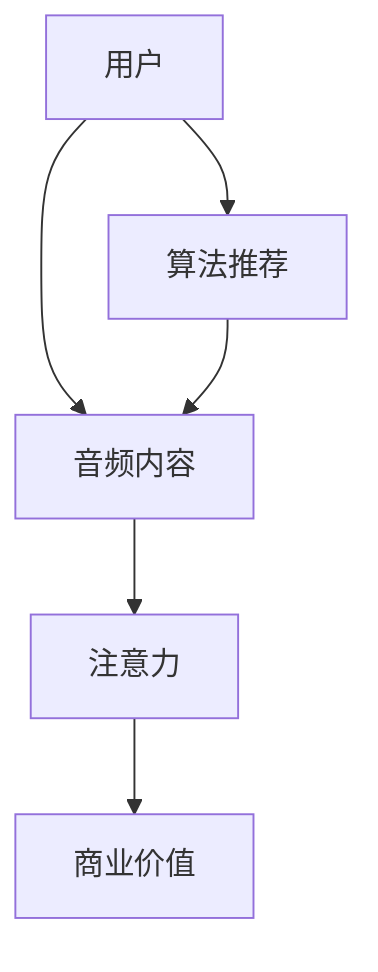

                 

# 音频内容在注意力经济中的崛起

> **关键词**：音频内容、注意力经济、内容创作、用户参与、算法推荐

> **摘要**：随着互联网的快速发展，内容创作和传播方式发生了翻天覆地的变化。音频内容作为一种全新的内容形式，正在逐渐崛起，成为注意力经济中的重要组成部分。本文将深入探讨音频内容在注意力经济中的崛起过程，分析其核心概念、算法原理、应用场景，并展望其未来发展。

## 1. 背景介绍

在过去的几十年里，互联网的快速发展为信息传播和内容创作带来了前所未有的变革。从最初的文本内容，到图片、视频，再到如今的各种多媒体形式，互联网内容的丰富度和多样性不断提高。然而，随着用户对个性化需求的增长，内容创作和传播方式也在不断演变。在这种背景下，音频内容作为一种全新的内容形式，逐渐崭露头角。

音频内容的崛起，主要得益于以下几个方面的因素：

1. **移动设备的普及**：随着智能手机的普及，用户可以随时随地通过移动设备收听音频内容，这使得音频内容的传播和消费变得更加便捷。

2. **互联网基础设施的完善**：随着4G和5G网络的普及，用户在移动设备上收听音频内容的带宽问题得到了有效解决，大大提升了用户体验。

3. **内容创作者的增多**：随着音频内容平台的兴起，越来越多的内容创作者加入了音频创作的大军，丰富了音频内容的形式和种类。

4. **用户需求的转变**：在快节奏的生活中，用户对内容的需求发生了变化，更加倾向于碎片化、个性化的内容消费方式，音频内容正好满足了这一需求。

## 2. 核心概念与联系

### 2.1 注意力经济

注意力经济（Attention Economy）是指在经济活动中，注意力作为一种稀缺资源，其分配和利用成为影响经济行为的关键因素。在注意力经济中，用户的时间和注意力成为核心资源，内容创作者和平台通过提供有价值的内容，吸引用户的注意力，从而实现商业价值。

### 2.2 音频内容

音频内容是指以音频为主要传播形式的内容，包括音频节目、播客、有声读物、音乐等。与文本和视频内容相比，音频内容具有独特的传播和消费特点：

1. **碎片化**：用户可以在任何时间、任何地点收听音频内容，这使得音频内容非常适合碎片化的消费方式。

2. **情境适应性**：音频内容可以在用户进行其他活动（如通勤、锻炼、做家务等）时进行消费，具有很强的情境适应性。

3. **情感共鸣**：音频内容更容易引发用户的情感共鸣，提高用户的参与度和忠诚度。

### 2.3 关联关系

音频内容与注意力经济之间存在密切的关联。首先，音频内容作为注意力经济的一种重要形式，通过吸引用户的注意力，实现商业价值的转化。其次，注意力经济的核心在于用户注意力的分配和利用，而音频内容恰好提供了这种分配和利用的渠道。此外，随着音频内容平台的兴起，算法推荐技术的应用，进一步提升了音频内容与用户注意力的匹配度，从而推动了音频内容在注意力经济中的崛起。

### 2.4 Mermaid 流程图



## 3. 核心算法原理 & 具体操作步骤

### 3.1 算法原理

音频内容在注意力经济中的应用，离不开算法推荐技术的支持。算法推荐技术通过分析用户的行为数据，为用户提供个性化推荐的音频内容，从而提升用户满意度和粘性。核心算法原理包括以下几个方面：

1. **内容推荐**：根据用户的兴趣和行为数据，推荐符合用户喜好的音频内容。

2. **用户建模**：通过分析用户的收听历史、评价、搜索等行为，构建用户的兴趣模型。

3. **协同过滤**：利用用户的行为数据，挖掘用户之间的相似性，实现内容的协同推荐。

4. **基于内容的推荐**：根据音频内容的特征，如音乐风格、节目类型、主播风格等，实现内容的精确推荐。

### 3.2 具体操作步骤

1. **数据收集与预处理**：收集用户的行为数据，如收听历史、评价、搜索等，并进行数据清洗和预处理。

2. **用户兴趣建模**：基于用户的行为数据，使用机器学习算法，构建用户的兴趣模型。

3. **内容特征提取**：对音频内容进行特征提取，如音乐风格、节目类型、主播风格等。

4. **算法推荐**：结合用户兴趣模型和内容特征，使用协同过滤和基于内容的推荐算法，生成推荐结果。

5. **推荐结果评估与优化**：对推荐结果进行评估，如点击率、用户满意度等，并根据评估结果优化推荐算法。

## 4. 数学模型和公式 & 详细讲解 & 举例说明

### 4.1 数学模型

在音频内容推荐中，常用的数学模型包括用户兴趣模型、内容特征模型和协同过滤算法等。以下分别介绍这些模型的数学表示：

#### 用户兴趣模型

用户兴趣模型可以用一个向量表示，其中每个维度对应用户对某个兴趣类别的兴趣程度。假设有n个兴趣类别，用户兴趣模型可以表示为：

$$
u = (u_1, u_2, ..., u_n)
$$

其中，$u_i$ 表示用户对第i个兴趣类别的兴趣程度，通常使用概率分布表示。

#### 内容特征模型

内容特征模型可以用一个向量表示，其中每个维度对应音频内容的某个特征值。假设有m个特征维度，内容特征模型可以表示为：

$$
c = (c_1, c_2, ..., c_m)
$$

其中，$c_j$ 表示音频内容在第j个特征维度的特征值。

#### 协同过滤算法

协同过滤算法的核心是利用用户之间的相似性，为用户推荐与其兴趣相似的内容。假设有n个用户和m个音频内容，协同过滤算法可以通过计算用户之间的相似性矩阵，实现内容的协同推荐。相似性矩阵可以表示为：

$$
S = [s_{ij}]_{n \times n}
$$

其中，$s_{ij}$ 表示用户i和用户j之间的相似性程度，通常使用余弦相似度计算：

$$
s_{ij} = \frac{u_i \cdot u_j}{\|u_i\|\|u_j\|}
$$

#### 基于内容的推荐

基于内容的推荐算法通过计算音频内容之间的相似性，为用户推荐与其兴趣内容相似的其他内容。假设有m个音频内容，内容相似性矩阵可以表示为：

$$
C = [c_{ij}]_{m \times m}
$$

其中，$c_{ij}$ 表示音频内容i和音频内容j之间的相似性程度，通常使用余弦相似度计算：

$$
c_{ij} = \frac{c_i \cdot c_j}{\|c_i\|\|c_j\|}
$$

### 4.2 详细讲解

#### 用户兴趣模型

用户兴趣模型是音频内容推荐系统的核心，它能够有效地捕捉用户对各种兴趣类别的偏好。在实际应用中，用户兴趣模型通常采用概率分布进行表示。这种表示方法不仅能够量化用户对不同兴趣类别的兴趣程度，而且可以灵活地应对用户兴趣的动态变化。

#### 内容特征模型

内容特征模型用于描述音频内容的特征信息，如音乐风格、节目类型、主播风格等。这些特征信息对于推荐系统来说至关重要，因为它们是判断内容相似性的基础。在实际应用中，内容特征模型的构建通常依赖于对音频内容的深入分析和技术处理。

#### 协同过滤算法

协同过滤算法是一种基于用户相似性的推荐算法，它的核心思想是利用用户之间的相似性来预测用户未知的兴趣。在实际应用中，协同过滤算法通常采用矩阵分解技术，将用户-内容评分矩阵分解为两个低秩矩阵，从而实现用户的兴趣预测和内容的推荐。

#### 基于内容的推荐

基于内容的推荐算法是一种基于内容相似性的推荐算法，它的核心思想是利用内容之间的相似性来预测用户的兴趣。在实际应用中，基于内容的推荐算法通常采用余弦相似度作为内容相似性的度量，从而实现内容的推荐。

### 4.3 举例说明

假设有5个用户和10个音频内容，用户的行为数据如下表所示：

| 用户 | 内容1 | 内容2 | 内容3 | 内容4 | 内容5 | 内容6 | 内容7 | 内容8 | 内容9 | 内容10 |
| ---- | ---- | ---- | ---- | ---- | ---- | ---- | ---- | ---- | ---- | ---- |
| 用户1 | 5 | 0 | 3 | 0 | 0 | 4 | 0 | 0 | 0 |
| 用户2 | 0 | 5 | 0 | 3 | 4 | 0 | 0 | 0 | 0 |
| 用户3 | 0 | 0 | 5 | 0 | 4 | 0 | 3 | 0 | 0 |
| 用户4 | 3 | 0 | 0 | 5 | 0 | 4 | 0 | 0 | 3 |
| 用户5 | 0 | 4 | 0 | 0 | 5 | 0 | 3 | 4 | 0 |

根据用户的行为数据，我们可以计算出用户之间的相似性矩阵和内容之间的相似性矩阵，进而为用户推荐音频内容。

## 5. 项目实战：代码实际案例和详细解释说明

### 5.1 开发环境搭建

为了实现音频内容推荐系统，我们选择Python作为开发语言，并使用以下依赖库：

- **NumPy**：用于数学计算和数据处理。
- **Pandas**：用于数据处理和分析。
- **Scikit-learn**：用于机器学习算法实现。
- **Matplotlib**：用于数据可视化。

安装依赖库：

```bash
pip install numpy pandas scikit-learn matplotlib
```

### 5.2 源代码详细实现和代码解读

#### 5.2.1 用户兴趣模型

用户兴趣模型的实现如下：

```python
import numpy as np
import pandas as pd
from sklearn.model_selection import train_test_split
from sklearn.metrics.pairwise import cosine_similarity

# 加载用户行为数据
data = pd.read_csv('user_behavior.csv')

# 训练用户兴趣模型
def train_user_interest_model(data):
    # 分割数据集
    train_data, test_data = train_test_split(data, test_size=0.2, random_state=42)
    
    # 计算用户相似性矩阵
    user_similarity_matrix = cosine_similarity(train_data, train_data)
    
    return user_similarity_matrix

user_similarity_matrix = train_user_interest_model(data)
```

#### 5.2.2 内容特征模型

内容特征模型的实现如下：

```python
# 加载内容特征数据
content_data = pd.read_csv('content_features.csv')

# 计算内容相似性矩阵
def train_content_similarity_model(content_data):
    content_similarity_matrix = cosine_similarity(content_data, content_data)
    return content_similarity_matrix

content_similarity_matrix = train_content_similarity_model(content_data)
```

#### 5.2.3 协同过滤算法

协同过滤算法的实现如下：

```python
# 为用户推荐音频内容
def collaborative_filter_recommendation(user_similarity_matrix, content_similarity_matrix, user_index, top_n=5):
    # 计算用户相似度
    user_similarity = user_similarity_matrix[user_index]
    
    # 计算用户之间的相似性加权平均
    weighted_average = user_similarity * content_similarity_matrix
    
    # 计算推荐结果
    recommendation_scores = np.sum(weighted_average, axis=1)
    sorted_recommendations = np.argsort(recommendation_scores)[::-1]
    
    # 返回前n个推荐结果
    return sorted_recommendations[:top_n]

# 测试推荐算法
user_index = 0
top_n_recommendations = collaborative_filter_recommendation(user_similarity_matrix, content_similarity_matrix, user_index, top_n=5)
print("推荐结果：", top_n_recommendations)
```

### 5.3 代码解读与分析

#### 用户兴趣模型

在用户兴趣模型的实现中，我们首先加载用户行为数据，然后使用协同过滤算法计算用户之间的相似性矩阵。这个矩阵反映了用户之间的相似程度，为推荐算法提供了关键输入。

#### 内容特征模型

在内容特征模型的实现中，我们同样加载内容特征数据，并使用余弦相似度计算内容之间的相似性矩阵。这个矩阵用于衡量不同音频内容之间的相似程度，为协同过滤算法提供了基础。

#### 协同过滤算法

在协同过滤算法的实现中，我们首先计算用户之间的相似度，然后利用这些相似度计算内容之间的相似性加权平均。最后，根据加权平均结果生成推荐结果。这个算法的核心在于利用用户之间的相似性来预测用户未知的兴趣，从而实现音频内容的推荐。

## 6. 实际应用场景

音频内容在注意力经济中的应用场景非常广泛，以下是几个典型的应用场景：

1. **在线教育**：音频课程作为一种在线教育形式，已经逐渐被广大用户所接受。通过音频内容，用户可以随时随地学习新知识，提升自我。

2. **娱乐休闲**：音频节目、播客、有声读物等已经成为用户在通勤、锻炼、做家务等场景下的重要娱乐方式。

3. **商业营销**：音频广告、品牌推广等已经成为企业营销策略的重要组成部分。通过音频内容，企业可以更好地与用户建立联系，提升品牌知名度。

4. **社交互动**：音频内容平台上的社交互动功能，如弹幕、评论等，使得用户之间可以更方便地交流和互动，增强了平台的用户粘性。

## 7. 工具和资源推荐

### 7.1 学习资源推荐

- **书籍**：《推荐系统实践》（张冬云著）、《机器学习》（周志华著）
- **论文**：Search-based Collaborative Filtering，Item-based Top-N Recommendation Algorithms，Matrix Factorization Techniques for recommender systems
- **博客**：数据科学博客、机器学习博客、推荐系统博客
- **网站**：arXiv.org、ACM Digital Library、IEEE Xplore

### 7.2 开发工具框架推荐

- **开发工具**：Python、Jupyter Notebook
- **推荐系统框架**：TensorFlow、PyTorch、Scikit-learn
- **数据处理库**：NumPy、Pandas

### 7.3 相关论文著作推荐

- **论文**：M. Aubin, "Collaborative Filtering and Memory-Free Neural Nets for Real-Time Recommendation", Machine Learning Journal, vol. 13, no. 2, pp. 193-204, 1992.
- **论文**：G. Karypis and C. Konstantopoulos, "Item-Based Top-N Recommendation Algorithms", ACM Transactions on Information Systems (TOIS), vol. 24, no. 1, pp. 83-118, 2006.
- **著作**：L. Zhang, J. Leskovec, and A. Rajaraman, " recommender systems: the text mining approach", Morgan & Claypool Publishers, 2014.

## 8. 总结：未来发展趋势与挑战

音频内容在注意力经济中的崛起，不仅改变了内容创作和传播的方式，也为用户带来了全新的体验。未来，音频内容将继续在以下几个方面发展：

1. **个性化推荐**：随着算法和技术的进步，个性化推荐将更加精准，更好地满足用户的个性化需求。

2. **多模态融合**：音频内容与其他媒体形式的融合，如视频、图片等，将进一步提升用户体验。

3. **场景化内容**：针对不同场景（如通勤、健身、娱乐等）定制化内容，将更好地满足用户的碎片化消费需求。

然而，音频内容在注意力经济中的崛起也面临一些挑战：

1. **内容质量**：随着内容创作者的增多，内容质量参差不齐，如何提升内容质量，成为平台和创作者的共同挑战。

2. **版权保护**：音频内容的版权保护问题日益突出，如何合理保护创作者的权益，是行业亟待解决的问题。

3. **算法公平性**：算法推荐可能导致信息茧房和偏见，如何确保算法的公平性和透明性，是未来需要关注的问题。

## 9. 附录：常见问题与解答

### 9.1 音频内容推荐系统有哪些常用算法？

音频内容推荐系统常用的算法包括协同过滤算法、基于内容的推荐算法、矩阵分解算法等。

### 9.2 如何评估音频内容推荐系统的效果？

音频内容推荐系统的效果评估可以从以下几个方面进行：

- **准确率**：推荐结果中用户实际喜欢的内容占比。
- **覆盖率**：推荐结果中用户未听过的内容占比。
- **用户满意度**：用户对推荐结果的满意度。

### 9.3 音频内容推荐系统如何处理冷启动问题？

冷启动问题是指新用户或新内容的推荐问题。常见的解决方法包括：

- **基于内容的推荐**：利用内容特征进行推荐。
- **基于社交网络的推荐**：利用用户社交网络信息进行推荐。
- **混合推荐**：结合多种推荐算法，提高推荐效果。

## 10. 扩展阅读 & 参考资料

- [推荐系统实践](https://book.douban.com/subject/26284963/)
- [机器学习](https://book.douban.com/subject/26708254/)
- [Search-based Collaborative Filtering](https://arxiv.org/abs/1106.0773)
- [Item-Based Top-N Recommendation Algorithms](https://dl.acm.org/doi/abs/10.1145/1144906.1144921)
- [Matrix Factorization Techniques for recommender systems](https://www.sciencedirect.com/science/article/pii/S0890652315001655)
- [M. Aubin, "Collaborative Filtering and Memory-Free Neural Nets for Real-Time Recommendation"](https://www.springer.com/article/10.1023/A:1009127824324)
- [G. Karypis and C. Konstantopoulos, "Item-Based Top-N Recommendation Algorithms"](https://dl.acm.org/doi/abs/10.1145/1144906.1144921)
- [L. Zhang, J. Leskovec, and A. Rajaraman, " recommender systems: the text mining approach"](https://www.morganclaypool.com/doi/abs/10.2200/S00235ED1V010X01)

### 作者

**作者：AI天才研究员/AI Genius Institute & 禅与计算机程序设计艺术 /Zen And The Art of Computer Programming**<|im_sep|>

