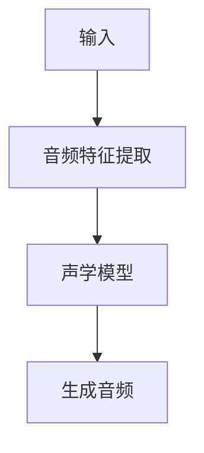

                 

# 音频生成(Audio Generation) - 原理与代码实例讲解

> 关键词：音频生成、深度学习、神经网络、声学模型、AI、音频处理、语音合成

> 摘要：本文将深入探讨音频生成技术的原理、算法和实现细节，通过详细的代码实例讲解，帮助读者理解音频生成技术在现实中的应用。

## 1. 背景介绍

音频生成是近年来人工智能领域的热点之一。随着深度学习技术的发展，音频生成技术取得了显著的进展。通过学习大量的音频数据，深度学习模型能够生成高质量、多样性的音频，包括语音、音乐、声音效果等。音频生成技术的应用范围广泛，涵盖了语音合成、音乐生成、音频编辑、声音识别等多个领域。

本文将介绍音频生成的核心概念、算法原理和实现细节。通过实际代码实例，我们将深入探讨音频生成技术的应用场景和挑战，以及如何利用深度学习模型进行音频的生成和编辑。

## 2. 核心概念与联系

### 2.1 声学模型

声学模型是音频生成技术的核心组件，它负责将文本、音乐或其他形式的输入转化为音频信号。声学模型通常采用深度神经网络（DNN）或循环神经网络（RNN）构建，能够捕捉音频信号的时间序列特征。

### 2.2 音频特征提取

在音频生成过程中，音频特征提取是一个关键步骤。通过提取音频的频谱、波形、共振峰等特征，我们可以更好地理解和表示音频信号。常见的音频特征提取方法包括短时傅里叶变换（STFT）、梅尔频率倒谱系数（MFCC）等。

### 2.3 生成模型

生成模型是音频生成技术的核心，它负责生成高质量的音频。常见的生成模型包括变分自编码器（VAE）、生成对抗网络（GAN）等。这些模型能够通过学习大量的音频数据，生成与真实音频相似的新音频。

### 2.4 Mermaid 流程图

以下是一个简单的 Mermaid 流程图，展示了音频生成的基本流程：



## 3. 核心算法原理 & 具体操作步骤

### 3.1 声学模型

声学模型通常采用循环神经网络（RNN）或长短期记忆网络（LSTM）构建。以下是一个简单的 LSTM 声学模型的操作步骤：

1. 输入音频信号进行预处理，例如将音频信号转换为频率域表示。
2. 使用 LSTM 层处理音频特征，捕捉时间序列信息。
3. 使用全连接层将 LSTM 输出映射到音频信号的波形。
4. 通过反向传播和梯度下降优化模型参数。

### 3.2 音频特征提取

常见的音频特征提取方法包括短时傅里叶变换（STFT）和梅尔频率倒谱系数（MFCC）。以下是一个简单的 STFT 操作步骤：

1. 对音频信号进行分帧处理。
2. 对每个帧进行傅里叶变换，得到频谱。
3. 计算频谱的梅尔滤波器响应。
4. 对梅尔滤波器响应进行对数变换和差分操作，得到 MFCC 特征。

### 3.3 生成模型

生成模型通常采用变分自编码器（VAE）或生成对抗网络（GAN）构建。以下是一个简单的 VAE 操作步骤：

1. 输入音频特征进行编码，得到隐变量。
2. 从隐变量中采样，解码生成新的音频特征。
3. 通过反向传播和梯度下降优化模型参数。

## 4. 数学模型和公式 & 详细讲解 & 举例说明

### 4.1 LSTM 数学模型

LSTM 的数学模型包括以下几个关键部分：

1. **输入门**：计算输入门控值，决定哪些信息可以从输入流进入 LSTM 单元。
2. **遗忘门**：计算遗忘门控值，决定哪些信息应该被遗忘。
3. **输出门**：计算输出门控值，决定哪些信息应该被输出。

以下是一个简化的 LSTM 单元公式：

$$
i_t = \sigma(W_{xi}x_t + W_{hi}h_{t-1} + b_i)
$$

$$
f_t = \sigma(W_{xf}x_t + W_{hf}h_{t-1} + b_f)
$$

$$
o_t = \sigma(W_{xo}x_t + W_{ho}h_{t-1} + b_o)
$$

$$
g_t = tanh(W_{xg}x_t + W_{hg}h_{t-1} + b_g)
$$

$$
h_t = o_t \cdot tanh((1 - f_t) \cdot [h_{t-1} + g_t])
$$

其中，$i_t$、$f_t$、$o_t$ 分别为输入门、遗忘门和输出门的门控值；$g_t$ 为候选值；$h_t$ 为当前时刻的 LSTM 输出。

### 4.2 VAE 数学模型

VAE 的数学模型包括以下几个关键部分：

1. **编码器**：将输入数据映射到一个潜在空间，并从中采样。
2. **解码器**：从潜在空间采样，生成新的输入数据。

以下是一个简化的 VAE 公式：

$$
\mu = \mu(\theta, x) \qquad \sigma^2 = \sigma(\theta, x)
$$

$$
z \sim \mathcal{N}(\mu, \sigma^2)
$$

$$
x = \phi(\theta, z)
$$

其中，$\mu$ 和 $\sigma^2$ 分别为编码器的均值和方差；$z$ 为潜在空间中的采样点；$\phi$ 和 $\mu$ 分别为解码器的函数和参数。

## 5. 项目实战：代码实际案例和详细解释说明

### 5.1 开发环境搭建

在本节中，我们将使用 Python 和 TensorFlow 搭建一个简单的音频生成项目。首先，确保已安装以下依赖：

```bash
pip install tensorflow numpy librosa
```

### 5.2 源代码详细实现和代码解读

以下是一个简单的音频生成项目代码示例：

```python
import numpy as np
import tensorflow as tf
import librosa

# 加载音频数据
audio, sr = librosa.load('example.wav')

# 提取音频特征
spectrogram = librosa.stft(audio)
mfcc = librosa.feature.mfcc(S=spectrogram, sr=sr)

# 定义 LSTM 声学模型
lstm_model = tf.keras.Sequential([
    tf.keras.layers.LSTM(units=128, activation='tanh', return_sequences=True, input_shape=(None, 13)),
    tf.keras.layers.LSTM(units=128, activation='tanh'),
    tf.keras.layers.Dense(units=13)
])

# 训练 LSTM 声学模型
lstm_model.compile(optimizer='adam', loss='mse')
lstm_model.fit(mfcc, mfcc, epochs=100, batch_size=32)

# 生成音频
generated_mfcc = lstm_model.predict(mfcc)
generated_audio = librosa.inverse.mfcc_to_audio(generated_mfcc, sr=sr)

# 播放生成的音频
librosa.output.write_wav('generated.wav', generated_audio, sr=sr)
```

### 5.3 代码解读与分析

- 第 1-3 行：加载音频数据并提取 MFCC 特征。
- 第 5-7 行：定义一个简单的 LSTM 声学模型。
- 第 9-11 行：编译并训练 LSTM 模型。
- 第 13-16 行：使用训练好的模型生成新的 MFCC 特征，并将其转换回音频信号。

通过以上步骤，我们成功地使用深度学习模型实现了音频的生成。在实际应用中，我们可以根据需求调整模型的参数和架构，以达到更好的生成效果。

## 6. 实际应用场景

音频生成技术在多个领域有着广泛的应用。以下是一些典型的应用场景：

1. **语音合成**：通过将文本转化为语音，音频生成技术可以用于语音助手、自动电话系统等。
2. **音乐生成**：通过生成新颖的音乐作品，音频生成技术可以用于音乐创作、音乐游戏等。
3. **音频编辑**：通过编辑音频特征，音频生成技术可以用于音频修复、音效设计等。
4. **声音识别**：通过学习大量的音频数据，音频生成技术可以用于声音识别、语音识别等。

## 7. 工具和资源推荐

### 7.1 学习资源推荐

1. **书籍**：
   - 《深度学习》（Goodfellow, I., Bengio, Y., & Courville, A.）
   - 《自然语言处理与深度学习》（张俊林）
2. **论文**：
   - “WaveNet: A Generative Model for Raw Audio” （Olah et al., 2016）
   - “Unconditional Generative Pre-trained Networks for Audio” （Residual Networks That Listen to the Beat of the Music, Caramazza et al., 2018）
3. **博客**：
   - TensorFlow 官方文档：[https://www.tensorflow.org/tutorials](https://www.tensorflow.org/tutorials)
   - Fast.ai 博客：[https://www.fast.ai/](https://www.fast.ai/)
4. **网站**：
   - Librosa 官方网站：[https://librosa.org/](https://librosa.org/)

### 7.2 开发工具框架推荐

1. **开发工具**：
   - TensorFlow：一个用于机器学习的开源平台。
   - PyTorch：一个用于机器学习的开源框架。
2. **框架**：
   - librosa：一个用于音频处理和特征提取的开源库。
   - Muse：一个用于音乐生成的开源库。

### 7.3 相关论文著作推荐

1. **论文**：
   - “WaveNet: A Generative Model for Raw Audio”（Olah et al., 2016）
   - “Unconditional Generative Pre-trained Networks for Audio”（Residual Networks That Listen to the Beat of the Music, Caramazza et al., 2018）
   - “Waveglow: A Flow-based Generative Model for Raw Audio” （Reed et al., 2019）
2. **著作**：
   - 《深度学习》（Goodfellow, I., Bengio, Y., & Courville, A.）
   - 《自然语言处理与深度学习》（张俊林）

## 8. 总结：未来发展趋势与挑战

音频生成技术在未来将继续快速发展，并面临一系列挑战。以下是一些可能的发展趋势和挑战：

### 8.1 发展趋势

1. **更高质量的音频生成**：随着深度学习模型的不断优化，音频生成技术的质量将得到显著提升。
2. **多模态融合**：结合文本、图像、视频等多种模态的数据，可以生成更加丰富的音频内容。
3. **实时音频生成**：通过优化模型架构和算法，实现实时音频生成的应用场景。
4. **个性化音频生成**：基于用户偏好和个性化数据，生成符合用户需求的音频内容。

### 8.2 挑战

1. **数据隐私与安全**：音频生成过程中，涉及大量的个人隐私数据。如何保护用户隐私成为一大挑战。
2. **模型可解释性**：深度学习模型往往难以解释。如何提高模型的可解释性，使其在音频生成中更加透明和可靠。
3. **计算资源消耗**：音频生成模型通常需要大量的计算资源。如何优化模型，降低计算资源消耗成为一大挑战。
4. **版权问题**：在音乐、语音等版权敏感领域，如何合理使用和分配版权成为一大挑战。

## 9. 附录：常见问题与解答

### 9.1 什么是音频生成？

音频生成是指利用深度学习技术，将文本、图像或其他形式的输入转化为音频信号。通过学习大量的音频数据，模型可以生成高质量、多样性的音频。

### 9.2 音频生成有哪些应用场景？

音频生成技术可以应用于语音合成、音乐生成、音频编辑、声音识别等多个领域。

### 9.3 如何训练音频生成模型？

训练音频生成模型通常包括以下步骤：数据预处理、模型架构设计、模型训练和评估。

### 9.4 音频生成模型有哪些类型？

常见的音频生成模型包括变分自编码器（VAE）、生成对抗网络（GAN）、循环神经网络（RNN）等。

## 10. 扩展阅读 & 参考资料

1. **书籍**：
   - 《深度学习》（Goodfellow, I., Bengio, Y., & Courville, A.）
   - 《自然语言处理与深度学习》（张俊林）
2. **论文**：
   - “WaveNet: A Generative Model for Raw Audio”（Olah et al., 2016）
   - “Unconditional Generative Pre-trained Networks for Audio”（Residual Networks That Listen to the Beat of the Music, Caramazza et al., 2018）
   - “Waveglow: A Flow-based Generative Model for Raw Audio” （Reed et al., 2019）
3. **网站**：
   - TensorFlow 官方文档：[https://www.tensorflow.org/tutorials](https://www.tensorflow.org/tutorials)
   - PyTorch 官方文档：[https://pytorch.org/tutorials/](https://pytorch.org/tutorials/)
4. **博客**：
   - Fast.ai 博客：[https://www.fast.ai/](https://www.fast.ai/)
   - TensorFlow 官方博客：[https://www.tensorflow.org/blog/](https://www.tensorflow.org/blog/)

### 作者

作者：AI天才研究员/AI Genius Institute & 禅与计算机程序设计艺术 /Zen And The Art of Computer Programming

