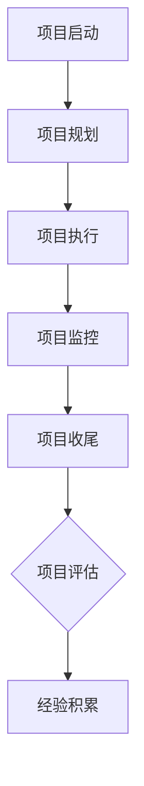

                 

# 项目管理：从启动到收尾的全流程指南

## 关键词

项目管理、项目启动、项目收尾、流程指南、项目管理方法论、风险管理、质量保证、团队协作、敏捷开发、持续集成、持续交付。

## 摘要

本文旨在为从事IT行业的项目管理专业人士提供一个从项目启动到收尾的全流程指南。文章将详细探讨项目管理中的核心概念和方法论，包括项目启动、规划、执行、监控和收尾等阶段的关键步骤和最佳实践。通过实例分析和工具推荐，本文将帮助读者深入理解项目管理过程，并提高项目成功交付的能力。

## 1. 背景介绍

项目管理是确保项目目标、范围、时间、成本和质量等各方面得到有效控制和管理的重要实践。随着全球化和信息化进程的加速，项目管理在各个行业中的重要性日益凸显。成功实施项目管理不仅能提高项目的交付效率，还能增强组织的竞争力。

项目生命周期包括项目启动、项目规划、项目执行、项目监控和项目收尾五个阶段。每个阶段都有其特定的任务和目标，需要项目管理团队进行精心规划和执行。然而，项目管理并不是一成不变的，不同类型的项目需要根据具体情况进行调整。

本文将围绕项目管理的核心流程，详细探讨每个阶段的实施步骤、关键要素和最佳实践。通过本文的阅读，读者将能够全面了解项目管理的全貌，并掌握实施项目管理的实用技巧。

## 2. 核心概念与联系

### 项目管理流程

项目管理流程是确保项目按计划、按范围、按时、按预算完成的关键。项目管理流程通常包括以下阶段：

1. **项目启动**：明确项目目标、范围、时间和资源需求，组建项目团队，启动项目。
2. **项目规划**：制定详细的项目计划，包括工作分解结构（WBS）、时间表、资源分配、成本估算和风险评估。
3. **项目执行**：按计划执行项目任务，确保项目进度、质量和成本得到有效控制。
4. **项目监控**：监控项目进度、质量和成本，及时识别和解决问题，确保项目按计划进行。
5. **项目收尾**：完成项目交付，进行项目评估和总结，为组织积累经验。

### 项目管理方法论

项目管理方法论是指导项目管理团队进行项目管理的理论体系。常见的方法论包括：

1. **瀑布模型**：一种传统的项目管理方法论，强调项目各阶段的顺序执行，适用于需求明确、变更较少的项目。
2. **敏捷开发**：一种以迭代和增量为核心的项目管理方法论，强调快速响应变更、持续交付价值。
3. **六西格玛**：一种注重质量改进和流程优化的项目管理方法论，适用于需要高质量交付的项目。

### 项目管理工具

项目管理工具是帮助项目管理团队高效执行项目管理任务的重要工具。常见的管理工具包括：

1. **项目管理软件**：如JIRA、Trello、Asana等，用于项目任务分配、进度跟踪和团队协作。
2. **时间管理工具**：如Microsoft Project、Google Calendar等，用于项目时间管理和调度。
3. **文档管理工具**：如Confluence、Notion等，用于项目文档的创建、共享和管理。

### Mermaid 流程图

为了更好地理解项目管理的流程和方法论，我们可以使用Mermaid流程图来展示。以下是项目管理的流程图示例：



通过这个流程图，我们可以清晰地看到项目管理各阶段之间的联系和依赖关系。

## 3. 核心算法原理 & 具体操作步骤

### 项目启动

项目启动是项目管理的第一步，其主要任务是明确项目目标、范围、时间和资源需求，并组建项目团队。具体操作步骤如下：

1. **明确项目目标**：明确项目的目标、范围和预期成果，确保项目目标与组织战略一致。
2. **制定项目计划**：制定项目的时间表、资源分配和成本估算，确保项目能够在规定的时间内完成。
3. **组建项目团队**：根据项目需求，组建项目团队，明确团队成员的职责和角色。
4. **召开项目启动会议**：召开项目启动会议，向团队成员介绍项目目标、计划和预期成果，确保团队成员对项目有共同的理解。

### 项目规划

项目规划是项目管理的关键环节，其主要任务是制定详细的项目计划，确保项目能够按计划进行。具体操作步骤如下：

1. **创建工作分解结构（WBS）**：将项目任务分解为可管理的工作包，创建工作分解结构。
2. **制定项目时间表**：根据工作分解结构，制定项目的时间表，确保项目任务按计划进行。
3. **分配资源**：根据项目需求，合理分配资源，确保项目任务能够得到有效执行。
4. **成本估算**：根据项目任务和时间表，进行成本估算，确保项目的预算合理。
5. **风险评估**：识别项目中的潜在风险，制定风险应对策略。

### 项目执行

项目执行是项目管理中的核心环节，其主要任务是按计划执行项目任务，确保项目进度、质量和成本得到有效控制。具体操作步骤如下：

1. **任务分配**：根据项目计划，将任务分配给项目团队成员，明确任务目标和交付要求。
2. **监控项目进度**：定期检查项目进度，确保项目按计划进行，及时识别和解决问题。
3. **质量控制**：实施质量保证措施，确保项目交付的产品或服务符合质量标准。
4. **成本控制**：监控项目成本，确保项目在预算范围内完成。
5. **团队协作**：加强团队协作，确保项目任务高效完成。

### 项目监控

项目监控是项目管理中的重要环节，其主要任务是监控项目进度、质量和成本，及时识别和解决问题。具体操作步骤如下：

1. **制定监控计划**：根据项目计划，制定监控计划，明确监控频率和监控指标。
2. **收集数据**：定期收集项目数据，包括进度、质量和成本数据。
3. **分析数据**：对收集到的数据进行分析，识别项目中的问题和风险。
4. **采取行动**：根据分析结果，采取相应的行动，解决问题和风险。

### 项目收尾

项目收尾是项目管理的最后一步，其主要任务是完成项目交付，进行项目评估和总结。具体操作步骤如下：

1. **项目交付**：完成项目任务，交付产品或服务，确保项目目标实现。
2. **项目评估**：对项目过程和结果进行评估，识别项目的成功因素和改进点。
3. **项目总结**：总结项目经验，形成项目报告，为组织积累经验。
4. **项目收尾会议**：召开项目收尾会议，对项目过程和结果进行总结，表彰团队成员的成果。

## 4. 数学模型和公式 & 详细讲解 & 举例说明

### 成本效益分析

成本效益分析是一种评估项目投资回报的方法，其基本公式为：

\[ ROI = \frac{净收益}{投资成本} \]

其中，净收益为项目的总收益减去总成本。

例如，一个项目的总投资为100万元，项目实施后带来的总收益为150万元，则项目的ROI为：

\[ ROI = \frac{150万元 - 100万元}{100万元} = 0.5 \]

这意味着项目的投资回报率为50%。

### 项目关键路径分析

项目关键路径是指项目中耗时最长的任务序列，决定了项目的最短完成时间。关键路径分析的基本公式为：

\[ 项目完成时间 = 关键路径上的任务耗时之和 \]

例如，一个项目的关键路径由三个任务组成，分别为：任务A（5天）、任务B（3天）、任务C（4天），则项目的完成时间为：

\[ 项目完成时间 = 5天 + 3天 + 4天 = 12天 \]

### 项目风险评估

项目风险评估是一种评估项目风险的可能性和影响程度的方法。其基本公式为：

\[ 风险值 = 风险可能性 \times 风险影响程度 \]

例如，一个项目面临的风险可能性为0.3，风险影响程度为0.8，则该风险的风险值为：

\[ 风险值 = 0.3 \times 0.8 = 0.24 \]

风险值越大，表示风险越严重。

## 5. 项目实战：代码实际案例和详细解释说明

### 开发环境搭建

在开始项目开发之前，我们需要搭建一个合适的环境。以下是一个基于Python的项目环境搭建步骤：

```bash
# 安装Python
sudo apt-get update
sudo apt-get install python3

# 安装虚拟环境工具
pip3 install virtualenv

# 创建虚拟环境
virtualenv my_project_env

# 激活虚拟环境
source my_project_env/bin/activate

# 安装项目依赖
pip3 install -r requirements.txt
```

### 源代码详细实现和代码解读

以下是一个简单的Python项目示例，用于计算项目的ROI：

```python
# roi_calculator.py

def calculate_roi(investment, revenue):
    """
    计算投资回报率（ROI）

    :param investment: 投资成本
    :param revenue: 项目收益
    :return: 投资回报率
    """
    roi = (revenue - investment) / investment
    return roi

if __name__ == "__main__":
    # 示例数据
    investment = 100000  # 投资成本为100万元
    revenue = 150000    # 项目收益为150万元

    # 计算ROI
    roi = calculate_roi(investment, revenue)

    # 打印结果
    print(f"项目的投资回报率为：{roi:.2f}")
```

代码解读：

1. **定义函数`calculate_roi`**：该函数接受两个参数，投资成本`investment`和项目收益`revenue`，返回投资回报率`roi`。
2. **计算ROI**：使用公式`ROI = (收益 - 成本) / 成本`计算投资回报率。
3. **主程序**：在主程序中，定义示例数据，调用`calculate_roi`函数计算ROI，并打印结果。

### 代码解读与分析

1. **代码结构**：该代码结构清晰，包括函数定义和主程序两部分。函数定义部分实现了ROI的计算逻辑，主程序部分用于示例数据和结果打印。
2. **函数设计**：`calculate_roi`函数设计合理，接受投资成本和项目收益作为参数，返回投资回报率。这种设计便于代码的复用和扩展。
3. **注释说明**：代码中包含详细的注释说明，有助于理解代码的功能和实现逻辑。

## 6. 实际应用场景

项目管理在IT行业、建筑行业、制造业、金融服务等多个领域都有广泛的应用。以下是一些实际应用场景：

1. **IT行业**：软件开发、网站建设、移动应用开发等，通过项目管理确保项目按计划、按范围、按时、按预算完成。
2. **建筑行业**：建筑项目、基础设施建设等，通过项目管理确保项目进度、质量和成本得到有效控制。
3. **制造业**：生产计划、供应链管理、质量控制等，通过项目管理提高生产效率和产品质量。
4. **金融服务**：银行、保险、证券等，通过项目管理确保金融产品的开发、推广和交付顺利进行。

## 7. 工具和资源推荐

### 学习资源推荐

1. **书籍**：
   - 《项目管理知识体系指南（PMBOK指南）》
   - 《敏捷项目管理》
   - 《项目管理实战》
2. **论文**：
   - 《项目管理方法论研究》
   - 《基于风险的项目管理》
   - 《敏捷开发实践指南》
3. **博客**：
   - 《项目管理实践》
   - 《敏捷开发博客》
   - 《技术项目管理博客》
4. **网站**：
   - PMI（项目管理协会）官网
   - 敏捷联盟官网
   - 谷歌项目管理工具

### 开发工具框架推荐

1. **项目管理工具**：
   - JIRA
   - Trello
   - Asana
2. **时间管理工具**：
   - Microsoft Project
   - Google Calendar
3. **文档管理工具**：
   - Confluence
   - Notion

### 相关论文著作推荐

1. **《项目管理方法论研究》**：探讨项目管理方法论的发展和应用。
2. **《基于风险的项目管理》**：介绍风险管理在项目管理中的应用和实践。
3. **《敏捷开发实践指南》**：介绍敏捷开发方法论的核心原则和实践。

## 8. 总结：未来发展趋势与挑战

随着信息技术和全球化的发展，项目管理在各个行业中的重要性日益凸显。未来，项目管理将呈现以下发展趋势：

1. **数字化转型**：越来越多的组织将采用数字化工具和方法进行项目管理，提高项目交付效率。
2. **敏捷开发**：敏捷开发方法将得到更广泛的应用，以应对快速变化的市场需求。
3. **数据驱动**：项目管理者将更加依赖数据分析，优化项目决策和流程。

然而，项目管理也面临着一系列挑战：

1. **复杂性增加**：项目规模的扩大和技术的进步使得项目管理更加复杂。
2. **资源限制**：有限的资源要求项目管理者在项目规划、执行和监控中做出更明智的决策。
3. **团队合作**：跨部门、跨地域的团队协作需要更高的沟通和协调能力。

项目管理者需要不断学习新知识、新技能，以应对这些挑战，提高项目管理水平。

## 9. 附录：常见问题与解答

### 问题1：如何确保项目按计划进行？

**解答**：确保项目按计划进行的关键在于充分的规划和监控。首先，制定详细的项目计划，明确项目目标、范围、时间表和资源需求。然后，定期监控项目进度，及时发现和解决问题。此外，建立有效的沟通机制，确保项目团队和利益相关者对项目进展有共同的理解。

### 问题2：什么是敏捷开发，如何应用敏捷开发？

**解答**：敏捷开发是一种以迭代和增量为核心的项目管理方法论，强调快速响应变更、持续交付价值。应用敏捷开发的方法包括：将项目任务分解为小的迭代周期（如Sprint），在每个迭代周期内完成一部分功能；定期进行回顾和调整，以持续优化项目过程；采用持续集成和持续交付，确保项目能够快速迭代和交付。

### 问题3：如何进行风险管理？

**解答**：风险管理是项目管理中的重要环节。首先，识别项目中的潜在风险，包括技术风险、市场风险、资源风险等。然后，评估风险的可能性和影响程度，制定风险应对策略。常见的风险应对策略包括风险规避、风险减轻、风险接受和风险转移。最后，定期监控风险，及时更新风险应对策略。

## 10. 扩展阅读 & 参考资料

1. **《项目管理知识体系指南（PMBOK指南）》**：详细介绍了项目管理的核心概念、过程和最佳实践。
2. **《敏捷项目管理》**：介绍了敏捷开发方法的核心原则和实践，适用于快速变化的市场环境。
3. **《项目管理实战》**：通过实例分析和实战经验，分享了项目管理的实用技巧和策略。
4. **PMI（项目管理协会）官网**：提供项目管理知识、资源和培训。
5. **敏捷联盟官网**：提供敏捷开发的相关资源和实践指导。
6. **谷歌项目管理工具**：介绍和演示了多种项目管理工具的使用方法和最佳实践。

## 作者信息

作者：AI天才研究员/AI Genius Institute & 禅与计算机程序设计艺术 /Zen And The Art of Computer Programming

本文旨在为从事IT行业的项目管理专业人士提供一个从项目启动到收尾的全流程指南，帮助读者深入理解项目管理的核心概念和方法论，提高项目成功交付的能力。通过本文的阅读，读者将能够全面掌握项目管理的全貌，并掌握实施项目管理的实用技巧。希望本文能为读者的项目管理实践提供有益的参考。

