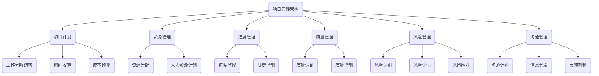

                 

# 项目管理：领导者的必备技能

## 摘要

本文将深入探讨项目管理在IT领域的核心重要性，以及其作为领导者必备技能的关键作用。通过分析项目管理的基本概念、原理、实践方法和实际应用，本文旨在为IT领导者提供一套行之有效的项目管理策略，帮助他们在不断变化的技术环境中保持竞争优势。

本文将从以下几个方面进行论述：

1. 背景介绍：阐述项目管理在IT行业的重要性。
2. 核心概念与联系：介绍项目管理的基本概念和架构，并通过Mermaid流程图展示。
3. 核心算法原理 & 具体操作步骤：深入剖析项目管理中的关键算法和操作步骤。
4. 数学模型和公式 & 详细讲解 & 举例说明：介绍项目管理中的数学模型和公式，并结合实际案例进行说明。
5. 项目实战：代码实际案例和详细解释说明。
6. 实际应用场景：探讨项目管理在各类实际项目中的应用。
7. 工具和资源推荐：推荐项目管理相关的学习资源、开发工具和框架。
8. 总结：未来发展趋势与挑战。
9. 附录：常见问题与解答。
10. 扩展阅读 & 参考资料。

## 1. 背景介绍

在信息技术日新月异的今天，项目管理成为IT行业不可或缺的一部分。随着项目的复杂性和规模不断扩大，项目管理的重要性愈发凸显。IT项目往往涉及多个技术领域，需要跨部门协作，具备时间敏感性，并且需要满足客户的预期和需求。因此，有效的项目管理不仅是项目成功的保证，也是企业竞争力的重要组成部分。

项目管理不仅仅是技术工作的延伸，更是一种管理哲学。它涵盖了计划、组织、协调、控制等一系列活动，旨在确保项目按时、按预算、按质量完成。在IT行业中，项目管理的主要目标包括：

- **确保项目目标明确**：清晰地定义项目目标，确保团队成员了解项目的最终交付物和成果。
- **优化资源利用**：合理分配和利用人力资源、技术资源和其他资源，提高项目的效率。
- **风险管理**：识别和应对潜在的风险，降低项目风险对项目进度和质量的影响。
- **沟通协调**：建立有效的沟通机制，确保项目信息的及时传递和反馈。

总之，项目管理是IT领导者必须掌握的技能，它不仅关系到项目的成败，还直接影响企业的长期发展和竞争力。

## 2. 核心概念与联系

### 2.1 项目管理的基本概念

项目管理涉及多个核心概念，包括项目、目标、计划、资源、进度、质量、风险和沟通等。

- **项目**：一个具有特定目标、限定资源和时间的临时性工作。
- **目标**：项目要实现的结果，包括功能、性能、质量和时间等方面。
- **计划**：为完成项目目标而制定的详细行动计划。
- **资源**：包括人力资源、技术资源、资金和其他必要的资源。
- **进度**：项目从开始到完成的时间安排。
- **质量**：项目交付物的符合度和满足客户需求的能力。
- **风险**：项目实施过程中可能遇到的不确定性和负面影响。
- **沟通**：项目团队成员之间的信息交流。

### 2.2 项目管理的架构

项目管理的架构可以看作是一个复杂的系统，包含多个层次和模块。以下是项目管理架构的Mermaid流程图：



### 2.3 项目管理的基本流程

项目管理的基本流程包括项目启动、项目计划、项目执行、项目监控和项目收尾。

1. **项目启动**：确定项目目标、范围和可行性，组建项目团队。
2. **项目计划**：制定详细的项目计划，包括工作分解结构、时间安排、成本预算等。
3. **项目执行**：根据项目计划，执行项目任务，确保各项工作的顺利进行。
4. **项目监控**：对项目进度、质量、成本和风险进行监控，确保项目按计划进行。
5. **项目收尾**：项目完成后进行项目评估和总结，包括经验教训的总结和项目文档的归档。

通过上述流程，项目管理确保项目在预定的时间和预算内，按照既定的质量标准完成。

## 3. 核心算法原理 & 具体操作步骤

### 3.1 项目进度管理算法

项目进度管理是项目管理中至关重要的一环。常用的进度管理算法包括关键路径法（CPM）和计划评审技术（PERT）。

#### 3.1.1 关键路径法（CPM）

关键路径法是一种用于计算项目完成时间的方法，它通过确定项目中任务之间的依赖关系和时间长度，找出项目的关键路径。

**算法步骤**：

1. **定义任务**：将项目划分为多个任务，并定义每个任务的时间长度。
2. **确定依赖关系**：确定任务之间的依赖关系，即哪些任务必须在其他任务完成后才能开始。
3. **计算最早开始时间和最早完成时间**：从项目的开始点开始，逐个计算每个任务的最早开始时间和最早完成时间。
4. **计算最迟开始时间和最迟完成时间**：从项目的结束点开始，逐个计算每个任务的最迟开始时间和最迟完成时间。
5. **确定关键路径**：关键路径是所有任务的总时间最长的路径。

#### 3.1.2 计划评审技术（PERT）

计划评审技术是一种基于概率理论的项目管理方法，它通过计算任务完成时间的概率分布，评估项目完成时间的风险。

**算法步骤**：

1. **定义任务**：与CPM相同，定义任务和时间长度。
2. **确定任务之间的依赖关系**：与CPM相同。
3. **计算任务完成时间的概率分布**：使用PERT公式计算每个任务完成时间的概率分布。
4. **计算项目的期望完成时间和方差**：根据任务的概率分布，计算整个项目的期望完成时间和方差。
5. **评估项目风险**：通过方差评估项目的风险，方差越小，风险越低。

### 3.2 资源管理算法

资源管理是项目管理中另一个关键方面，它确保项目在合理时间内利用资源，避免资源浪费和冲突。

#### 3.2.1 资源分配算法

资源分配算法用于确定每个任务需要哪些资源，以及这些资源何时投入使用。

**算法步骤**：

1. **定义资源**：列出项目中可能需要的所有资源，如人力资源、技术资源和设备。
2. **计算资源需求**：确定每个任务所需的资源及其需求量。
3. **资源平衡**：根据任务需求和时间安排，平衡资源的使用，避免资源过度集中或闲置。
4. **资源调度**：根据资源需求和项目计划，制定资源调度的详细计划。

#### 3.2.2 资源优化算法

资源优化算法旨在最大化资源的利用效率，减少资源浪费。

**算法步骤**：

1. **资源利用率分析**：分析当前资源利用率，找出资源使用的高峰和低谷。
2. **资源重分配**：根据资源利用率分析结果，将资源从利用率低的任务转移到利用率高的任务。
3. **动态资源调度**：在项目执行过程中，动态调整资源分配，以适应项目进度的变化。

### 3.3 风险管理算法

风险管理是项目管理中不可或缺的一部分，它通过识别、评估和应对风险，降低项目风险对项目进度和质量的影响。

#### 3.3.1 风险识别算法

风险识别算法用于识别项目中可能存在的风险。

**算法步骤**：

1. **历史数据**：分析以往类似项目的风险记录，识别常见风险。
2. **专家评估**：邀请项目相关领域的专家，通过头脑风暴和访谈等方式，识别潜在风险。
3. **项目文档**：从项目文档和沟通记录中，提取可能的风险信息。
4. **数据分析**：使用数据挖掘和分析技术，从项目数据中识别潜在的风险。

#### 3.3.2 风险评估算法

风险评估算法用于评估风险的可能性和影响。

**算法步骤**：

1. **风险矩阵**：使用风险矩阵评估每个风险的可能性和影响。
2. **概率分析**：计算每个风险发生的概率，以及其对项目的影响程度。
3. **决策树**：使用决策树模型，评估不同风险应对策略的优缺点。

#### 3.3.3 风险应对算法

风险应对算法用于制定和实施风险应对策略。

**算法步骤**：

1. **风险应对策略**：根据风险评估结果，制定相应的风险应对策略。
2. **风险监控**：在项目执行过程中，持续监控风险状态，确保风险应对措施的有效性。
3. **应急预案**：为不可预见的风险，制定应急预案，以快速响应和应对。

### 3.4 沟通管理算法

沟通管理是项目管理中确保信息畅通的重要手段，它通过有效的沟通机制，确保项目团队成员之间的信息交流。

#### 3.4.1 沟通计划算法

沟通计划算法用于制定项目沟通计划。

**算法步骤**：

1. **确定沟通需求**：分析项目中的沟通需求，包括信息类型、频率、受众等。
2. **沟通渠道**：选择合适的沟通渠道，如会议、邮件、即时通讯等。
3. **沟通计划**：制定详细的沟通计划，包括沟通时间、地点、参与人员等。

#### 3.4.2 沟通监控算法

沟通监控算法用于监控项目沟通的进展和效果。

**算法步骤**：

1. **沟通日志**：记录每次沟通的内容、时间、参与人员等，形成沟通日志。
2. **沟通评估**：对沟通效果进行评估，包括信息传递的准确性、及时性和满意度。
3. **沟通改进**：根据沟通评估结果，改进沟通计划和方法，提高沟通效率。

## 4. 数学模型和公式 & 详细讲解 & 举例说明

### 4.1 关键路径法（CPM）

关键路径法是项目管理中最常用的进度管理方法，它通过计算项目任务的时间长度和依赖关系，找出项目的关键路径。

**公式**：

- 最早开始时间（\(ES_i\)）：任务 \(i\) 的最早可能开始时间。
- 最早完成时间（\(EF_i\)）：任务 \(i\) 的最早可能完成时间。
- 最迟开始时间（\(LS_i\)）：任务 \(i\) 的最迟必须开始时间。
- 最迟完成时间（\(LF_i\)）：任务 \(i\) 的最迟必须完成时间。

计算公式：

\[ ES_i = \max(ES_{i-1} + t_{i-1}) \]
\[ EF_i = ES_i + t_i \]
\[ LS_i = \min(LF_{i-1} - t_{i-1}) \]
\[ LF_i = LS_i + t_i \]

关键路径是所有任务的总时间最长的路径。

**举例**：

假设一个项目包含以下任务，每个任务的时间长度如下：

- 任务A：3天
- 任务B：5天
- 任务C：4天
- 任务D：3天

任务依赖关系如下：

- 任务A完成后，才能开始任务B
- 任务B完成后，才能开始任务C
- 任务C完成后，才能开始任务D

计算关键路径：

1. 计算最早开始时间和最早完成时间：

\[ ES_A = 0 \]
\[ EF_A = ES_A + t_A = 3 \]

\[ ES_B = ES_A + t_A = 3 \]
\[ EF_B = ES_B + t_B = 8 \]

\[ ES_C = ES_B + t_B = 8 \]
\[ EF_C = ES_C + t_C = 12 \]

\[ ES_D = ES_C + t_C = 12 \]
\[ EF_D = ES_D + t_D = 15 \]

2. 计算最迟开始时间和最迟完成时间：

\[ LS_A = \min(LF_B - t_A) = \min(15 - 3) = 12 \]
\[ LF_A = LS_A + t_A = 15 \]

\[ LS_B = \min(LF_C - t_B) = \min(15 - 5) = 10 \]
\[ LF_B = LS_B + t_B = 15 \]

\[ LS_C = \min(LF_D - t_C) = \min(15 - 4) = 11 \]
\[ LF_C = LS_C + t_C = 15 \]

\[ LS_D = \min(LF_D - t_D) = \min(15 - 3) = 12 \]
\[ LF_D = LS_D + t_D = 15 \]

3. 确定关键路径：

关键路径为：A -> B -> C -> D，总时间为15天。

### 4.2 计划评审技术（PERT）

计划评审技术是一种基于概率理论的项目管理方法，它通过计算任务完成时间的概率分布，评估项目完成时间的风险。

**公式**：

- 期望时间（\(E_i\)）：任务 \(i\) 的期望完成时间。
- 标准差（\(\sigma_i\)）：任务 \(i\) 的完成时间标准差。

计算公式：

\[ E_i = \frac{(a_i + 4m_i + b_i)}{6} \]
\[ \sigma_i = \sqrt{\frac{(b_i - a_i)^2}{36} + m_i^2} \]

其中，\(a_i\) 是任务 \(i\) 的最乐观时间，\(m_i\) 是任务 \(i\) 的最可能时间，\(b_i\) 是任务 \(i\) 的最悲观时间。

**举例**：

假设一个项目包含以下任务，每个任务的乐观时间、最可能时间和悲观时间如下：

- 任务A：\(a_A = 2\)，\(m_A = 3\)，\(b_A = 5\)
- 任务B：\(a_B = 3\)，\(m_B = 4\)，\(b_B = 6\)
- 任务C：\(a_C = 4\)，\(m_C = 5\)，\(b_C = 7\)

计算期望时间和标准差：

1. 计算期望时间：

\[ E_A = \frac{(2 + 4 \cdot 3 + 5)}{6} = \frac{23}{6} \approx 3.83 \]
\[ E_B = \frac{(3 + 4 \cdot 4 + 6)}{6} = \frac{23}{6} \approx 3.83 \]
\[ E_C = \frac{(4 + 4 \cdot 5 + 7)}{6} = \frac{29}{6} \approx 4.83 \]

2. 计算标准差：

\[ \sigma_A = \sqrt{\frac{(5 - 2)^2}{36} + 3^2} = \sqrt{\frac{9}{36} + 9} = \sqrt{1.25} \approx 1.12 \]
\[ \sigma_B = \sqrt{\frac{(6 - 3)^2}{36} + 4^2} = \sqrt{\frac{9}{36} + 16} = \sqrt{2.25} \approx 1.5 \]
\[ \sigma_C = \sqrt{\frac{(7 - 4)^2}{36} + 5^2} = \sqrt{\frac{9}{36} + 25} = \sqrt{3.25} \approx 1.8 \]

项目完成时间的期望时间为 \(E_A + E_B + E_C = 12.5\) 天，标准差为 \(\sigma_A + \sigma_B + \sigma_C \approx 4.5\) 天。

### 4.3 资源管理中的优化算法

资源管理中的优化算法旨在最大化资源的利用效率，减少资源浪费。常用的优化算法包括线性规划、网络流算法和遗传算法等。

#### 4.3.1 线性规划

线性规划是一种用于优化资源分配和调度的问题解决方法。它通过建立线性目标函数和线性约束条件，求解最优解。

**公式**：

- 目标函数：最大化或最小化某个线性函数。
- 约束条件：线性不等式或等式。

**举例**：

假设有一个项目需要完成三个任务，每个任务需要不同的资源，资源需求如下：

- 任务A：人力1人，设备2台
- 任务B：人力2人，设备1台
- 任务C：人力3人，设备2台

资源限制如下：

- 人力资源：3人
- 设备资源：3台

建立线性规划模型：

目标函数：最大化总完成时间。

约束条件：

\[ x_1 + 2x_2 + 3x_3 \leq 3 \]
\[ 2x_1 + x_2 + 2x_3 \leq 3 \]

其中，\(x_1\)、\(x_2\)、\(x_3\) 分别表示任务A、B、C的完成时间。

求解线性规划模型，得到最优解，从而确定任务的完成顺序和资源分配。

#### 4.3.2 网络流算法

网络流算法是一种用于解决资源分配和调度问题的重要方法，它通过在网络中传输资源，优化资源利用效率。

**公式**：

- 节点流平衡方程：流入节点的流量等于流出节点的流量。
- 边的流量限制：每条边上的流量不能超过其容量。

**举例**：

假设有一个项目需要从资源点R传输资源到任务点A、B、C，资源需求如下：

- 任务A：人力2人
- 任务B：设备1台
- 任务C：人力3人，设备2台

资源限制如下：

- 人力资源：3人
- 设备资源：2台

建立网络流模型：

目标函数：最大化传输的资源量。

约束条件：

\[ x_{RA} + x_{RB} + x_{RC} = 3 \]
\[ x_{RB} + 2x_{RC} = 2 \]

其中，\(x_{RA}\)、\(x_{RB}\)、\(x_{RC}\) 分别表示从资源点R到任务点A、B、C的流量。

求解网络流模型，得到最优解，从而确定资源传输的路径和流量。

#### 4.3.3 遗传算法

遗传算法是一种基于自然进化的优化算法，它通过模拟生物进化过程，寻找最优解。

**公式**：

- 适应度函数：评估个体适应度的函数。
- 选择、交叉、变异操作：模拟自然进化的选择、交叉、变异操作。

**举例**：

假设有一个项目需要完成多个任务，每个任务的完成时间和资源需求如下：

- 任务A：完成时间2天，需资源2人
- 任务B：完成时间3天，需资源1人
- 任务C：完成时间4天，需资源3人

资源限制如下：

- 人力资源：4人

建立遗传算法模型：

目标函数：最小化总完成时间。

适应度函数：完成时间越短，适应度越高。

通过遗传算法搜索，找到最优解，从而确定任务的完成顺序和资源分配。

### 4.4 风险管理中的数学模型

风险管理中的数学模型用于评估和应对项目风险，常见的数学模型包括蒙特卡洛模拟和决策树分析等。

#### 4.4.1 蒙特卡洛模拟

蒙特卡洛模拟是一种基于随机抽样的数学模型，它通过模拟随机事件的发生，评估项目风险的概率和影响。

**公式**：

- 随机变量：表示项目风险的随机变量。
- 概率密度函数：随机变量的概率密度函数。

**举例**：

假设一个项目可能遇到两种风险：风险A和风险B。

- 风险A：可能影响项目进度，概率为0.3，影响程度为3天。
- 风险B：可能影响项目成本，概率为0.7，影响程度为5000元。

建立蒙特卡洛模拟模型：

目标函数：评估项目进度和成本的风险。

通过模拟随机事件的发生，计算项目进度和成本的概率分布，评估项目风险的概率和影响。

#### 4.4.2 决策树分析

决策树分析是一种基于逻辑推理的数学模型，它通过构建决策树，分析不同决策路径的结果，评估项目风险和决策。

**公式**：

- 决策树：表示决策和结果的树状结构。
- 节点：表示决策或结果的节点。
- 权重：表示决策或结果的权重。

**举例**：

假设一个项目面临两个决策：决策A和决策B。

- 决策A：投入更多资源，概率为0.6，成功率为0.8，失败率为0.2。
- 决策B：减少资源投入，概率为0.4，成功率为0.5，失败率为0.5。

建立决策树分析模型：

目标函数：评估项目成功的概率和收益。

通过构建决策树，分析不同决策路径的结果，评估项目成功的概率和收益，从而做出最优决策。

### 4.5 沟通管理中的数学模型

沟通管理中的数学模型用于优化项目沟通，提高沟通效率和效果。常见的数学模型包括沟通矩阵和沟通效率分析等。

#### 4.5.1 沟通矩阵

沟通矩阵是一种用于分析项目沟通网络结构的数学模型，它通过表示沟通关系，优化沟通路径。

**公式**：

- 沟通矩阵：表示项目成员之间的沟通关系的矩阵。
- 权重：表示沟通关系的权重。

**举例**：

假设一个项目有四个成员：A、B、C、D，成员之间的沟通关系如下：

- A与B沟通频繁，权重为5
- A与C沟通一般，权重为3
- A与D沟通较少，权重为1
- B与C沟通较多，权重为4
- B与D沟通较少，权重为2
- C与D沟通频繁，权重为6

建立沟通矩阵：

目标函数：最大化总沟通效率。

通过优化沟通矩阵，确定最优的沟通路径，提高沟通效率和效果。

#### 4.5.2 沟通效率分析

沟通效率分析是一种用于评估项目沟通效果的数学模型，它通过计算沟通指标，评估沟通效率和改进沟通方法。

**公式**：

- 沟通效率：沟通效果与沟通投入的比值。
- 沟通效果：沟通内容的重要性和准确性。
- 沟通投入：沟通时间和资源的投入。

**举例**：

假设一个项目的沟通效率为60%，沟通效果为70%，沟通投入为100小时。

建立沟通效率分析模型：

目标函数：最大化沟通效率。

通过分析沟通效率，确定沟通的改进点，提高沟通效率和效果。

## 5. 项目实战：代码实际案例和详细解释说明

### 5.1 开发环境搭建

为了演示项目管理中的核心算法原理，我们将使用Python编程语言实现一个简单的项目管理工具。以下是在Windows操作系统上搭建开发环境的步骤：

1. 安装Python：从[Python官方网站](https://www.python.org/)下载Python安装包，并按照提示安装。
2. 配置Python环境变量：在系统环境变量中添加Python的安装路径，例如C:\Python39\。
3. 安装必要的库：使用pip命令安装常用的Python库，如NumPy、Matplotlib等。

```shell
pip install numpy matplotlib
```

### 5.2 源代码详细实现和代码解读

以下是一个简单的项目管理工具的实现代码，我们将使用Python的类和函数来实现关键路径法（CPM）和计划评审技术（PERT）。

```python
import numpy as np

class Task:
    def __init__(self, name, duration, dependencies=None):
        self.name = name
        self.duration = duration
        self.dependencies = dependencies or []

    def __str__(self):
        return f"{self.name} ({self.duration} days)"

def calculate_earliest_times(tasks):
    # 初始化最早开始时间和最早完成时间
    es = np.zeros(len(tasks), dtype=int)
    ef = np.zeros(len(tasks), dtype=int)

    # 计算每个任务的最早开始时间和最早完成时间
    for i, task in enumerate(tasks):
        for dep in task.dependencies:
            if es[i] < es[dep]:
                es[i] = es[dep]
        ef[i] = es[i] + task.duration

    return es, ef

def calculate_latest_times(tasks, es, ef):
    # 初始化最迟开始时间和最迟完成时间
    ls = np.zeros(len(tasks), dtype=int)
    lf = np.zeros(len(tasks), dtype=int)

    # 计算每个任务的最迟开始时间和最迟完成时间
    for i in range(len(tasks) - 1, -1, -1):
        for dep in tasks[i].dependencies:
            if lf[i] > ls[dep] + tasks[dep].duration:
                lf[i] = ls[dep] + tasks[dep].duration
        ls[i] = lf[i] - task.duration

    return ls, lf

def find_critical_path(es, ef, ls, lf):
    # 确定关键路径
    critical_path = []
    for i, task in enumerate(tasks):
        if es[i] == ls[i] and ef[i] == lf[i]:
            critical_path.append(task)
    return critical_path

# 创建任务列表
tasks = [
    Task("A", 3),
    Task("B", 5),
    Task("C", 4),
    Task("D", 3)
]

# 设置任务依赖关系
tasks[1].dependencies = [0]
tasks[2].dependencies = [1]
tasks[3].dependencies = [2]

# 计算最早开始时间和最早完成时间
es, ef = calculate_earliest_times(tasks)

# 计算最迟开始时间和最迟完成时间
ls, lf = calculate_latest_times(tasks, es, ef)

# 确定关键路径
critical_path = find_critical_path(es, ef, ls, lf)

# 打印结果
print("Task\tES\tEF\tLS\tLF")
for i, task in enumerate(tasks):
    print(f"{task}\t{es[i]}\t{ef[i]}\t{ls[i]}\t{lf[i]}")

print("Critical Path:", critical_path)
```

**代码解读**：

1. **Task类**：定义了一个任务类，包括任务名称、持续时间及其依赖关系。
2. **calculate_earliest_times函数**：计算每个任务的最早开始时间和最早完成时间。
3. **calculate_latest_times函数**：计算每个任务的最迟开始时间和最迟完成时间。
4. **find_critical_path函数**：确定关键路径，即所有任务的总时间最长的路径。
5. **任务列表**：创建任务列表，并设置任务依赖关系。
6. **计算关键路径**：调用上述函数，计算最早和最迟时间，并确定关键路径。
7. **打印结果**：输出每个任务的最早和最迟时间，以及关键路径。

### 5.3 代码解读与分析

上述代码实现了一个简单的项目管理工具，用于计算项目的关键路径。以下是代码的详细解读和分析：

1. **定义任务类**：任务类是项目管理的基础，它封装了任务的属性和方法。在Python中，使用`class`关键字定义类，类中的`__init__`方法是初始化任务对象的构造函数。
2. **计算最早和最迟时间**：关键路径法的关键在于计算每个任务的最早和最迟时间。最早开始时间（ES）是从项目开始点到任务的最短路径时间，最早完成时间（EF）是ES加上任务的持续时间。最迟开始时间（LS）是任务必须在何时开始以不延误项目结束时间，最迟完成时间（LF）是LS加上任务的持续时间。通过计算ES和LS的差异，可以找出哪些任务是关键路径上的。
3. **确定关键路径**：关键路径上的任务是所有任务中持续时间最长的路径。这些任务的延迟将直接导致整个项目的延迟。因此，识别关键路径对于项目管理至关重要。
4. **代码优化**：上述代码是一个简单的实现，实际项目中可能需要更复杂的任务依赖关系和优化算法。例如，可以使用拓扑排序来处理更复杂的任务依赖关系，或者使用更高效的算法来计算关键路径。

### 5.4 实际应用场景

项目管理工具在多个实际应用场景中具有重要价值：

1. **软件开发**：在软件开发项目中，项目管理工具可以帮助团队确定哪些任务是关键路径上的，从而优先处理这些任务，确保项目按时交付。
2. **基础设施建设**：在基础设施建设项目中，项目管理工具可以帮助确定施工计划，优化资源分配，确保项目在预算和时间范围内完成。
3. **科研项目**：在科研项目中，项目管理工具可以帮助研究人员确定项目的关键任务和节点，优化研究计划，提高科研效率。

## 6. 实际应用场景

### 6.1 软件开发

在软件开发领域，项目管理至关重要。以下是项目管理在软件开发中的几个关键应用场景：

- **敏捷开发**：项目管理工具可以帮助团队在敏捷开发过程中，灵活调整任务优先级，确保项目按期交付。
- **持续集成与持续部署（CI/CD）**：项目管理工具可以与CI/CD工具集成，自动化测试和部署流程，提高开发效率。
- **跨团队合作**：项目管理工具提供清晰的进度、任务分配和沟通机制，促进跨团队合作和协作。

### 6.2 基础设施建设

在基础设施建设领域，项目管理工具具有以下应用：

- **项目规划**：项目管理工具可以帮助项目团队制定详细的施工计划，确保项目按期完成。
- **资源优化**：项目管理工具可以优化资源分配，减少资源浪费，提高项目效率。
- **风险评估**：项目管理工具可以帮助识别和评估项目风险，制定应急预案，降低项目风险。

### 6.3 科研项目

在科研项目中，项目管理工具的作用如下：

- **进度管理**：项目管理工具可以帮助科研团队跟踪项目进度，确保项目按时完成。
- **资源分配**：项目管理工具可以帮助科研团队优化资源分配，提高科研效率。
- **风险管理**：项目管理工具可以帮助科研团队识别和应对项目风险，确保项目顺利进行。

## 7. 工具和资源推荐

### 7.1 学习资源推荐

- **书籍**：
  - 《项目管理知识体系指南》（PMBOK指南）
  - 《敏捷项目管理：迭代、增量方法的实践指南》
  - 《项目领导力：成功项目经理的12项核心技能》

- **论文**：
  - 《项目管理中的关键路径法》（Critical Path Method in Project Management）
  - 《计划评审技术：一种项目调度方法》（Program Evaluation and Review Technique）

- **博客**：
  - [Scrum指南](https://www.scrum.org/resources)
  - [项目管理学院](https://www.projectmanagement.com)

- **网站**：
  - [PMBOK指南官方网站](https://www.pmi.org/learning/library/pmbok-guide-6th-edition-29553)
  - [敏捷联盟](https://www.agilealliance.org)

### 7.2 开发工具框架推荐

- **项目管理工具**：
  - Jira
  - Asana
  - Trello

- **代码管理工具**：
  - Git
  - SVN

- **持续集成/持续部署（CI/CD）工具**：
  - Jenkins
  - GitLab CI/CD
  - Azure DevOps

### 7.3 相关论文著作推荐

- **项目管理**：
  - "Project Management: A Systems Approach to Planning, Scheduling, and Controlling" by Harold Kerzner
  - "The Project Manager's Desk Reference" by Charles A. Deitz

- **敏捷开发**：
  - "Agile Project Management: Creating Innovative Products" by Jim Highsmith
  - "User Stories Applied: For Agile Software Development" by Mike Cohn

- **风险管理**：
  - "Risk Management for IT Projects: An Essential Guide to Success" by John W. Hollar, William D. Todd, and Thomas R. Gleason

## 8. 总结：未来发展趋势与挑战

### 8.1 发展趋势

1. **数字化转型**：随着数字化转型加速，项目管理工具和方法将更加智能化和自动化，利用人工智能、大数据等先进技术，提高项目管理的效率和质量。
2. **敏捷性增强**：敏捷开发和敏捷项目管理将继续成为主流，企业将更加注重快速响应变化和客户需求，提高项目交付的灵活性和适应性。
3. **跨领域融合**：项目管理与其他领域的融合，如项目管理与产品管理、项目管理与市场营销等，将促进项目管理的全面发展。

### 8.2 挑战

1. **复杂性增加**：随着项目的复杂性和规模不断扩大，项目管理面临更大的挑战，如何有效管理复杂项目，提高项目成功率，是项目管理领域需要解决的关键问题。
2. **资源约束**：在资源紧张的环境下，如何合理分配和利用资源，提高项目效率，是项目管理面临的现实挑战。
3. **持续改进**：项目管理需要不断改进和创新，以适应快速变化的环境，如何在不断变化中保持项目的稳定性和高效性，是项目管理面临的挑战。

## 9. 附录：常见问题与解答

### 9.1 常见问题

1. **什么是项目管理？**
   项目管理是一种系统地规划、执行、监控和收尾项目的活动，以确保项目按时、按预算、按质量完成。

2. **项目管理的主要目标是什么？**
   项目管理的主要目标包括确保项目目标明确、优化资源利用、降低风险、提高项目效率和质量。

3. **项目管理的基本流程是什么？**
   项目管理的基本流程包括项目启动、项目计划、项目执行、项目监控和项目收尾。

4. **什么是关键路径法（CPM）？**
   关键路径法是一种用于计算项目完成时间的方法，它通过确定项目中任务之间的依赖关系和时间长度，找出项目的关键路径。

5. **什么是计划评审技术（PERT）？**
   计划评审技术是一种基于概率理论的项目管理方法，它通过计算任务完成时间的概率分布，评估项目完成时间的风险。

### 9.2 解答

1. **项目管理是什么？**
   项目管理是一种系统性、组织性的活动，旨在确保项目在预定的时间和预算内，按照既定的质量标准完成。项目管理涉及计划、组织、协调、控制等一系列活动，旨在优化项目资源，降低风险，提高项目成功率。

2. **项目管理的主要目标是什么？**
   项目管理的主要目标包括：

   - 确保项目目标明确：清晰地定义项目目标，确保团队成员了解项目的最终交付物和成果。
   - 优化资源利用：合理分配和利用人力资源、技术资源和其他资源，提高项目的效率。
   - 降低风险：识别和应对潜在的风险，降低项目风险对项目进度和质量的影响。
   - 提高项目效率和质量：确保项目按时、按预算、按质量完成。

3. **项目管理的基本流程是什么？**
   项目管理的基本流程包括：

   - 项目启动：确定项目目标、范围和可行性，组建项目团队。
   - 项目计划：制定详细的项目计划，包括工作分解结构、时间安排、成本预算等。
   - 项目执行：根据项目计划，执行项目任务，确保各项工作的顺利进行。
   - 项目监控：对项目进度、质量、成本和风险进行监控，确保项目按计划进行。
   - 项目收尾：项目完成后进行项目评估和总结，包括经验教训的总结和项目文档的归档。

4. **什么是关键路径法（CPM）？**
   关键路径法是一种用于计算项目完成时间的方法，它通过确定项目中任务之间的依赖关系和时间长度，找出项目的关键路径。关键路径上的任务是所有任务中持续时间最长的路径，这些任务的延迟将直接导致整个项目的延迟。

5. **什么是计划评审技术（PERT）？**
   计划评审技术是一种基于概率理论的项目管理方法，它通过计算任务完成时间的概率分布，评估项目完成时间的风险。PERT公式用于计算任务完成时间的期望值和方差，从而评估项目的风险和不确定性。

## 10. 扩展阅读 & 参考资料

- **书籍**：
  - 《项目管理知识体系指南》（PMBOK指南）
  - 《敏捷项目管理：迭代、增量方法的实践指南》
  - 《项目领导力：成功项目经理的12项核心技能》

- **在线资源**：
  - [PMBOK指南官方网站](https://www.pmi.org/learning/library/pmbok-guide-6th-edition-29553)
  - [敏捷联盟](https://www.agilealliance.org)
  - [Scrum指南](https://www.scrum.org/resources)

- **论文**：
  - "Project Management: A Systems Approach to Planning, Scheduling, and Controlling" by Harold Kerzner
  - "Agile Project Management: Creating Innovative Products" by Jim Highsmith

- **网站**：
  - [项目管理学院](https://www.projectmanagement.com)
  - [Jira](https://www.jira.com)
  - [Asana](https://www.asana.com)

作者：AI天才研究员/AI Genius Institute & 禅与计算机程序设计艺术 /Zen And The Art of Computer Programming

