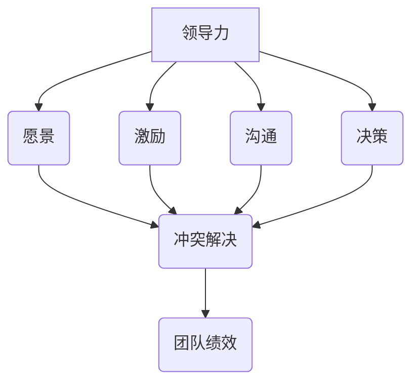

                 

### 文章标题

《领导力与冲突解决：化解团队矛盾的技巧》

关键词：领导力、冲突解决、团队管理、沟通技巧

摘要：本文旨在探讨领导力在团队管理中的关键作用，特别是如何通过有效的冲突解决技巧来提升团队协作效率，营造和谐的工作环境。文章将结合实际案例，深入分析冲突的根源、解决策略以及领导者在其中的角色和责任。通过本文的阅读，读者将掌握一系列实用的技巧和方法，以应对和处理团队中可能出现的各种冲突。

<|assistant|>### 引言

在信息技术飞速发展的今天，团队的协作效率对企业竞争力的影响日益显著。一个高效的团队不仅需要成员具备专业的技术能力，更离不开强有力的领导力。领导力不仅仅是发号施令，更重要的是引导和激发团队成员的潜力，确保团队朝着共同的目标前进。然而，在团队协作过程中，难免会出现各种矛盾和冲突。如何有效地解决这些冲突，成为了领导力的重要考验。

本文将围绕领导力与冲突解决展开讨论，旨在为读者提供一套实用的策略和方法。文章首先介绍领导力在团队管理中的重要性，接着分析冲突的常见根源，并探讨解决冲突的技巧。此外，文章还将结合实际案例，深入剖析领导者在冲突解决过程中的角色和责任。通过本文的阅读，读者将能够更深刻地理解领导力在团队管理中的关键作用，掌握一系列实用的冲突解决技巧，从而提升团队的协作效率。

<|assistant|>### 1. 背景介绍

#### 领导力与团队管理

领导力是一种影响力，它能够激发团队成员的潜力，引导他们朝着共同的目标努力。在团队管理中，领导力的重要性不言而喻。一个优秀的领导者能够凝聚团队力量，提高团队成员的工作积极性和创造力，从而提升整体团队的绩效。以下是领导力在团队管理中的几个关键方面：

1. **愿景与目标设定**：领导者需要明确团队的目标和愿景，确保团队成员对目标和愿景有共同的理解和认同。
2. **激励与鼓励**：领导者需要通过激励和鼓励来激发团队成员的工作热情和积极性，帮助他们克服困难和挑战。
3. **沟通与协调**：领导者需要建立良好的沟通机制，确保团队成员之间能够顺畅地交流信息，协调工作。
4. **决策与执行力**：领导者需要做出明智的决策，并确保决策能够得到有效的执行。
5. **团队文化建设**：领导者需要塑造积极向上的团队文化，营造一个和谐、包容的工作氛围。

#### 冲突的根源与影响

冲突是团队管理中不可避免的现象，它可能源于以下几方面：

1. **目标不一致**：团队成员对团队的目标和个人的目标有不同的理解，导致工作方向和努力程度不一致。
2. **角色冲突**：团队成员在角色和职责上存在重叠或模糊，导致工作分工不明确，职责不清。
3. **价值观差异**：团队成员的价值观和信念存在差异，导致在工作方式、决策方式等方面出现分歧。
4. **沟通不畅**：团队成员之间的沟通不畅，导致信息传递不准确或误解。
5. **个人情感因素**：团队成员的个人情感问题，如压力、不满等，也会导致冲突的产生。

冲突对团队的影响是双重的。一方面，冲突可以激发创新和改进，促进团队进步；另一方面，未解决的冲突会导致团队内部矛盾加剧，降低团队效率和士气。因此，如何有效解决冲突是团队管理中的一大挑战。

#### 领导者在冲突解决中的角色

领导者作为团队的核心，在冲突解决中扮演着关键角色。以下是一些领导者应具备的冲突解决能力：

1. **倾听与理解**：领导者需要耐心倾听冲突各方的意见和诉求，理解他们的立场和感受。
2. **中立调解**：领导者应保持中立，避免偏袒任何一方，公正地处理冲突。
3. **协商与沟通**：领导者需要通过有效沟通，帮助各方达成共识，化解矛盾。
4. **决策与执行**：领导者需要及时做出决策，确保冲突得到妥善解决，并确保决策能够得到有效执行。
5. **反馈与反思**：领导者需要及时给予冲突各方反馈，帮助他们认识到冲突的根源和解决方法，并进行反思和改进。

总之，领导力与冲突解决密切相关。一个优秀的领导者不仅能够有效管理团队，还能够通过有效的冲突解决技巧，提升团队的协作效率，实现团队目标。

#### 1.1 领导力的核心要素

1. **愿景与目标设定**：领导者需要具备明确且具有吸引力的愿景，确保团队成员对未来的方向有共同的认识。通过设定具体、可衡量的目标，领导者可以引导团队朝着共同的目标努力。

2. **激励与鼓励**：领导者需要通过多种方式激励团队成员，包括认可他们的成就、提供成长机会等。激励不仅能够提高团队成员的工作积极性，还能够增强团队凝聚力。

3. **沟通与协调**：有效的沟通是团队协作的基础。领导者需要建立开放的沟通环境，鼓励团队成员分享想法和意见。同时，领导者还需要在团队内部进行有效的协调，确保各个部分的工作能够无缝衔接。

4. **决策与执行力**：领导者需要做出明智的决策，并在团队内部形成共识。同时，领导者还需要确保决策能够得到有效执行，确保团队能够迅速响应和解决问题。

5. **团队文化建设**：领导者需要塑造积极向上的团队文化，包括共同的价值观、行为规范等。这样的文化可以增强团队成员的归属感和认同感，提高团队的凝聚力。

#### 1.2 冲突的常见根源

1. **目标不一致**：当团队成员对团队的目标有不同的理解或个人目标与团队目标冲突时，容易引发冲突。例如，一个成员可能认为团队应该优先完成某个项目，而另一个成员则认为应该先解决某个技术问题。

2. **角色冲突**：当团队成员在角色和职责上存在重叠或模糊时，容易引发冲突。例如，两个团队成员都认为自己应该负责某个任务，但没有明确的分工，导致工作重叠或无人负责。

3. **价值观差异**：当团队成员的价值观和信念存在差异时，容易在决策方式、工作方式等方面产生分歧。例如，一个成员可能认为应该追求短期利益，而另一个成员则认为应该追求长期发展。

4. **沟通不畅**：当团队成员之间的沟通不畅时，容易导致信息传递不准确或误解。例如，一个成员可能误解了另一个成员的意图，导致不必要的冲突。

5. **个人情感因素**：当团队成员面临压力、不满等个人情感问题时，也容易引发冲突。例如，一个成员可能因为工作压力而情绪低落，从而对其他成员产生不满。

#### 1.3 冲突对团队的影响

1. **降低工作效率**：冲突会消耗团队成员的时间和精力，降低工作效率。例如，团队成员可能会在冲突中争论不休，而忽视了实际工作。

2. **损害团队士气**：持续的冲突会损害团队成员的士气，降低他们对工作的热情和积极性。例如，团队成员可能会因为冲突而感到沮丧和不满，从而影响工作表现。

3. **影响团队氛围**：冲突会破坏团队的工作氛围，使团队变得紧张和不安。例如，团队成员可能会因为冲突而避免交流，导致团队氛围恶化。

4. **影响团队绩效**：冲突不仅会影响团队的工作效率，还可能影响团队的绩效。例如，一个存在冲突的团队可能会在项目中遇到更多的困难，从而影响项目的进度和质量。

#### 1.4 领导者在冲突解决中的角色

1. **倾听与理解**：领导者需要耐心倾听冲突各方的意见和诉求，理解他们的立场和感受。这有助于领导者更好地把握冲突的本质，找到解决冲突的关键点。

2. **中立调解**：领导者应保持中立，避免偏袒任何一方，公正地处理冲突。这有助于消除团队成员的对立情绪，促进冲突的解决。

3. **协商与沟通**：领导者需要通过有效沟通，帮助各方达成共识，化解矛盾。这包括解释决策的理由、澄清误解等。

4. **决策与执行**：领导者需要及时做出决策，确保冲突得到妥善解决，并确保决策能够得到有效执行。这有助于迅速解决冲突，恢复团队的工作秩序。

5. **反馈与反思**：领导者需要及时给予冲突各方反馈，帮助他们认识到冲突的根源和解决方法，并进行反思和改进。这有助于防止类似冲突的再次发生，提高团队的协作效率。

总之，领导力在团队管理中起着至关重要的作用，特别是在冲突解决方面。一个优秀的领导者不仅能够有效管理团队，还能够通过有效的冲突解决技巧，提升团队的协作效率，实现团队目标。

<|assistant|>### 2. 核心概念与联系

#### 领导力的核心概念

领导力是一种影响力，它能够激发团队成员的潜力，引导他们朝着共同的目标努力。领导力不仅仅是发号施令，更重要的是通过愿景、激励、沟通等方式，带领团队实现目标。

- **愿景**：领导者需要具备明确且具有吸引力的愿景，确保团队成员对未来的方向有共同的认识。
- **激励**：领导者需要通过多种方式激励团队成员，提高他们的工作积极性和创造力。
- **沟通**：领导者需要建立良好的沟通机制，确保团队成员之间能够顺畅地交流信息，协调工作。
- **决策**：领导者需要做出明智的决策，确保团队朝着正确的方向前进。

#### 冲突解决的核心概念

冲突解决是团队管理中的一项重要任务，它旨在通过有效的沟通和协商，化解团队中的矛盾和冲突。

- **倾听**：倾听是冲突解决的第一步，领导者需要耐心倾听冲突各方的意见和诉求。
- **理解**：领导者需要理解冲突各方的立场和感受，找到冲突的根源。
- **协商**：领导者需要通过协商，帮助各方达成共识，找到解决问题的方法。
- **执行**：领导者需要确保协商达成的解决方案能够得到有效执行。

#### 领导力与冲突解决的关系

领导力与冲突解决密切相关。一个优秀的领导者不仅能够有效管理团队，还能够通过有效的冲突解决技巧，提升团队的协作效率。

- **领导力是冲突解决的基石**：领导者需要具备一系列的领导力素质，如沟通能力、决策能力、理解能力等，这些都是解决冲突的关键。
- **冲突解决是领导力的重要体现**：领导者需要通过有效的冲突解决，展示自己的领导力，赢得团队成员的信任和尊重。
- **有效的冲突解决能够提升团队绩效**：通过有效的冲突解决，领导者可以化解团队中的矛盾和冲突，提高团队的工作效率和士气。

#### Mermaid 流程图

以下是一个简单的 Mermaid 流程图，展示了领导力与冲突解决的核心概念及其联系。



在图中，领导力的核心概念（愿景、激励、沟通、决策）与冲突解决的核心概念（倾听、理解、协商、执行）通过箭头相连，表明它们之间的紧密联系。最终，有效的冲突解决能够提升团队的绩效，形成良性循环。

### 2.1 领导力在冲突解决中的具体应用

领导力在冲突解决中起着至关重要的作用。一个优秀的领导者不仅能够识别和解决冲突，还能够通过有效的策略和技巧，预防和缓解冲突。以下是领导力在冲突解决中的具体应用：

#### 2.1.1 建立有效的沟通机制

沟通是解决冲突的关键。领导者需要建立一个开放、坦诚的沟通环境，鼓励团队成员自由表达意见和诉求。以下是一些具体的方法：

1. **定期召开会议**：定期召开团队会议，为团队成员提供一个交流和分享的平台。在会议中，领导者可以听取成员的意见和建议，了解他们的困难和需求。

2. **鼓励提问和反馈**：领导者需要鼓励团队成员提问和反馈，无论是关于工作还是团队内部的问题。这有助于及时发现和解决潜在的冲突。

3. **建立反馈机制**：领导者需要建立一套反馈机制，确保团队成员的意见和建议能够得到及时反馈。这可以是一个定期的反馈会议，也可以是通过电子邮件或在线平台进行。

4. **提供沟通培训**：领导者可以组织沟通培训，帮助团队成员提高沟通技巧，减少误解和冲突。

#### 2.1.2 保持中立和客观

在解决冲突时，领导者需要保持中立和客观，避免偏袒任何一方。以下是一些具体的方法：

1. **倾听各方意见**：领导者需要耐心倾听冲突各方的意见和诉求，确保每个成员都有发言的机会。

2. **避免评判**：在听取各方意见时，领导者应避免做出评判或偏袒任何一方。这有助于保持公正，减少冲突的加剧。

3. **寻求共识**：领导者需要通过协商，帮助各方找到共同点，达成共识。这可以是一个折中方案，也可以是一个双赢的解决方案。

4. **公正处理**：在做出决策时，领导者需要公正地处理冲突，确保每个成员都感到被公平对待。

#### 2.1.3 提供解决方案

领导者需要提供具体的解决方案，帮助团队成员解决冲突。以下是一些具体的方法：

1. **明确责任**：在冲突解决过程中，领导者需要明确每个成员的责任，确保每个人都清楚自己的任务和职责。

2. **制定行动计划**：领导者需要与团队成员一起制定具体的行动计划，确保冲突得到有效解决。

3. **监督执行**：领导者需要监督冲突解决方案的执行，确保决策得到有效执行。

4. **跟进和反馈**：领导者需要定期跟进冲突解决的进展，收集团队成员的反馈，并根据实际情况进行调整。

#### 2.1.4 培养团队合作精神

领导者需要通过一系列措施，培养团队合作精神，减少冲突的发生。以下是一些具体的方法：

1. **建立团队目标**：领导者需要帮助团队明确共同的目标，确保每个成员都为实现目标而努力。

2. **加强团队建设**：领导者可以组织团队建设活动，如团队拓展训练、团队聚餐等，增强团队成员之间的联系和信任。

3. **促进知识共享**：领导者可以鼓励团队成员分享知识和经验，促进知识的传递和共享，减少因信息不对称而产生的冲突。

4. **提供培训和发展机会**：领导者可以提供培训和发展机会，帮助团队成员提高技能和知识，增强他们的自信心和归属感。

通过以上方法，领导者可以在冲突解决中发挥关键作用，提升团队的协作效率和士气。

### 2.2 冲突解决的常见策略和技巧

在团队管理中，冲突是不可避免的。然而，通过有效的策略和技巧，领导者可以有效地解决冲突，减少其对团队效率和士气的负面影响。以下是冲突解决的常见策略和技巧：

#### 2.2.1 协商谈判

协商谈判是解决冲突的一种有效方法。通过协商谈判，领导者可以帮助冲突各方找到共同点，达成共识。以下是协商谈判的一些关键技巧：

1. **明确目标**：在开始谈判前，领导者需要明确谈判的目标，确保各方都清楚要解决的问题。

2. **倾听各方意见**：领导者需要耐心倾听各方的意见和诉求，确保每个成员都有发言的机会。

3. **寻求共识**：领导者需要通过协商，帮助各方找到共同点，达成共识。这可以是一个折中方案，也可以是一个双赢的解决方案。

4. **制定协议**：在达成共识后，领导者需要与各方一起制定具体的协议，确保每个成员都清楚自己的责任和义务。

#### 2.2.2 中立调解

在解决冲突时，领导者需要保持中立，避免偏袒任何一方。中立调解的关键在于公正和客观，以下是一些具体的方法：

1. **倾听各方意见**：领导者需要耐心倾听冲突各方的意见和诉求，确保每个成员都有发言的机会。

2. **避免评判**：在听取各方意见时，领导者应避免做出评判或偏袒任何一方。这有助于保持公正，减少冲突的加剧。

3. **寻求共识**：领导者需要通过协商，帮助各方找到共同点，达成共识。这可以是一个折中方案，也可以是一个双赢的解决方案。

4. **公正处理**：在做出决策时，领导者需要公正地处理冲突，确保每个成员都感到被公平对待。

#### 2.2.3 情感管理

冲突往往伴随着情感波动，有效的情感管理是解决冲突的重要一环。以下是一些情感管理的技巧：

1. **识别情感**：领导者需要能够识别和理解自己的情感，同时也需要理解团队成员的情感。

2. **表达情感**：领导者需要学会以健康的方式表达情感，避免情绪失控或压抑情感。

3. **同理心**：领导者需要具备同理心，理解并尊重团队成员的情感。

4. **冷静处理**：在冲突发生时，领导者需要保持冷静，避免在情绪激动时做出决策。

#### 2.2.4 沟通技巧

沟通是解决冲突的基础。有效的沟通可以减少误解和冲突。以下是一些沟通技巧：

1. **清晰表达**：领导者需要清晰、明确地表达自己的观点和意见。

2. **积极倾听**：领导者需要积极倾听团队成员的意见和诉求，确保理解他们的观点。

3. **避免指责**：在沟通中，领导者应避免使用指责性的语言，而是采用建设性的语言，促进问题的解决。

4. **寻求共识**：领导者需要通过沟通，帮助各方找到共同点，达成共识。

通过以上策略和技巧，领导者可以有效地解决团队中的冲突，提升团队的协作效率和士气。

### 2.3 领导者在冲突解决中的关键步骤

在冲突解决过程中，领导者需要遵循一系列关键步骤，以确保冲突得到妥善解决。以下是领导者在冲突解决中的关键步骤：

#### 2.3.1 识别冲突

第一步是识别冲突。领导者需要敏锐地察觉团队中的潜在冲突，并对其进行初步评估。以下是一些识别冲突的方法：

1. **观察行为**：通过观察团队成员的行为，如情绪变化、沟通方式等，可以初步判断是否存在冲突。

2. **倾听反馈**：通过倾听团队成员的反馈，如会议讨论、私下交流等，可以了解团队中的不满和矛盾。

3. **调查了解**：通过调查和了解，如私下访问、问卷调查等，可以获取更详细的信息，帮助识别冲突。

#### 2.3.2 分析冲突原因

在识别冲突后，领导者需要对冲突的原因进行深入分析。以下是一些分析冲突原因的方法：

1. **目标不一致**：检查团队成员对团队目标和个人目标的认同程度，是否存在理解差异。

2. **角色冲突**：检查团队成员在角色和职责上的重叠或模糊，是否存在分工不清。

3. **价值观差异**：检查团队成员的价值观和信念，是否存在分歧。

4. **沟通不畅**：检查团队成员之间的沟通情况，是否存在信息传递不准确或误解。

5. **个人情感因素**：检查团队成员的个人情感状态，是否存在压力、不满等情绪问题。

#### 2.3.3 制定解决方案

在分析冲突原因后，领导者需要制定具体的解决方案。以下是一些制定解决方案的方法：

1. **协商谈判**：通过协商谈判，帮助冲突各方找到共同点，达成共识。

2. **中立调解**：保持中立，公正地处理冲突，确保每个成员都感到被公平对待。

3. **提供培训**：通过提供沟通技巧或情感管理培训，帮助团队成员提高解决冲突的能力。

4. **制定行动计划**：与团队成员一起制定具体的行动计划，确保解决方案能够得到有效执行。

#### 2.3.4 执行解决方案

在制定解决方案后，领导者需要确保解决方案得到有效执行。以下是一些执行解决方案的方法：

1. **明确责任**：确保每个成员都清楚自己的责任和义务。

2. **监督执行**：定期监督解决方案的执行情况，确保决策得到有效执行。

3. **反馈与调整**：收集团队成员的反馈，根据实际情况进行调整。

#### 2.3.5 跟进和评估

在执行解决方案后，领导者需要跟进冲突解决的进展，并进行评估。以下是一些跟进和评估的方法：

1. **定期跟进**：定期与团队成员交流，了解解决方案的执行情况。

2. **评估效果**：评估解决方案的效果，检查冲突是否得到有效解决。

3. **反思与改进**：根据评估结果，反思解决冲突的过程，找出改进的空间。

通过以上关键步骤，领导者可以有效地解决团队中的冲突，提升团队的协作效率和士气。

### 2.4 领导力在冲突解决中的实际案例

为了更好地理解领导力在冲突解决中的应用，我们可以通过一些实际案例来分析。以下是一些典型的冲突解决案例，以及领导者如何通过领导力技巧成功解决冲突。

#### 案例一：项目进度延误引发的冲突

在一个大型软件项目中，团队成员因为项目进度延误产生了严重的冲突。部分成员认为项目经理的规划不够详细，导致任务分配不明确；而另一些成员则认为任务量过大，难以在规定时间内完成。这种情况导致团队士气低落，工作效率下降。

**解决方案**：

1. **倾听各方意见**：项目经理首先召集冲突的双方进行一对一的沟通，耐心倾听他们的意见和诉求。

2. **分析冲突原因**：项目经理分析了冲突的原因，发现主要是由于项目规划不够详细和任务分配不明确导致的。

3. **协商解决方案**：项目经理与团队成员一起重新规划项目，细化任务分配，确保每个成员都清楚自己的任务和时间安排。

4. **监督执行**：项目经理定期跟进项目进展，确保任务得到有效执行。

**结果**：通过项目经理的努力，团队中的冲突得到了有效解决，项目进度逐渐恢复正常，团队士气也得到了提升。

#### 案例二：团队成员间的价值观差异

在一个团队中，两名成员因为工作方式的不同产生了严重的分歧。一名成员更注重细节和完美主义，而另一名成员则更注重效率和速度。这种情况导致两人在工作中频繁发生争执，影响了团队的协作。

**解决方案**：

1. **中立调解**：团队领导在了解情况后，保持了中立，避免偏袒任何一方。

2. **寻求共识**：团队领导通过与两名成员的沟通，帮助他们找到共同点，达成共识。

3. **提供培训**：团队领导组织了沟通技巧和冲突解决技巧的培训，帮助团队成员提高解决冲突的能力。

4. **调整任务分配**：团队领导根据两名成员的工作方式和价值观，调整了他们的任务分配，确保他们能够各自发挥优势。

**结果**：通过团队领导的中立调解和培训，团队成员间的冲突得到了有效解决，团队协作效率显著提升。

#### 案例三：个人情感问题引发的冲突

在一个团队中，一名成员因为个人情感问题导致工作表现不佳，其他成员对此产生了不满和抵触情绪。这种情况导致了团队内部的紧张氛围，影响了团队的正常运作。

**解决方案**：

1. **倾听和理解**：团队领导首先与这名成员进行了沟通，倾听他的情感诉求，理解他的困境。

2. **提供支持**：团队领导在了解情况后，提供了情感支持，帮助这名成员缓解压力，恢复工作状态。

3. **调整工作任务**：团队领导根据这名成员的情况，调整了他的工作任务，减轻了工作压力。

4. **团队建设**：团队领导组织了一次团队建设活动，帮助团队成员缓解紧张情绪，增强团队凝聚力。

**结果**：通过团队领导的倾听和支持，这名成员的工作状态得到了改善，团队内部的紧张氛围也得到了缓解，团队协作效率显著提升。

通过以上案例，我们可以看到领导力在冲突解决中的关键作用。一个优秀的领导者不仅能够通过有效的沟通和协商解决冲突，还能够通过提供支持和调整任务分配，帮助团队成员缓解压力，提升团队的整体表现。

### 3. 核心算法原理 & 具体操作步骤

在解决团队冲突时，领导力可以被视为一种核心算法，其原理基于一系列行为和决策规则。以下是领导力解决团队冲突的核心算法原理和具体操作步骤：

#### 3.1 核心算法原理

领导力解决团队冲突的核心算法原理包括以下几个方面：

1. **识别冲突**：领导者需要具备敏锐的观察力和倾听能力，能够及时发现和识别团队中的冲突。
2. **分析冲突原因**：领导者需要对冲突的根源进行深入分析，理解冲突的原因和背后的动机。
3. **制定解决方案**：基于冲突的原因，领导者需要制定具体的解决方案，包括沟通策略、任务分配调整等。
4. **执行和监督**：领导者需要确保解决方案得到有效执行，并对其进行监督和调整。
5. **评估和反馈**：领导者需要评估冲突解决的效果，并给予团队成员反馈，确保问题得到彻底解决。

#### 3.2 具体操作步骤

以下是领导力解决团队冲突的具体操作步骤：

1. **识别冲突**：
   - **观察团队成员的行为和情绪变化**：通过观察团队成员的行为和情绪，领导者可以初步识别冲突。
   - **倾听团队成员的意见和反馈**：通过倾听团队成员的意见和反馈，领导者可以了解冲突的具体情况和成员的感受。

2. **分析冲突原因**：
   - **了解目标不一致**：检查团队成员对团队目标和个人目标的认同程度，是否存在理解差异。
   - **检查角色冲突**：检查团队成员在角色和职责上的重叠或模糊，是否存在分工不清。
   - **分析价值观差异**：检查团队成员的价值观和信念，是否存在分歧。
   - **了解沟通不畅**：检查团队成员之间的沟通情况，是否存在信息传递不准确或误解。
   - **评估个人情感因素**：评估团队成员的个人情感状态，是否存在压力、不满等情绪问题。

3. **制定解决方案**：
   - **协商谈判**：与冲突各方进行协商谈判，寻求共识，制定具体的解决方案。
   - **中立调解**：保持中立，公正地处理冲突，确保每个成员都感到被公平对待。
   - **提供培训**：提供沟通技巧或冲突解决技巧的培训，帮助团队成员提高解决冲突的能力。
   - **制定行动计划**：与团队成员一起制定具体的行动计划，确保解决方案能够得到有效执行。

4. **执行和监督**：
   - **明确责任**：确保每个成员都清楚自己的责任和义务。
   - **监督执行**：定期监督解决方案的执行情况，确保决策得到有效执行。
   - **跟进和反馈**：收集团队成员的反馈，根据实际情况进行调整。

5. **评估和反馈**：
   - **评估效果**：评估解决方案的效果，检查冲突是否得到有效解决。
   - **反思和改进**：根据评估结果，反思解决冲突的过程，找出改进的空间。

通过以上步骤，领导者可以系统地解决团队中的冲突，提升团队的协作效率和士气。

### 4. 数学模型和公式 & 详细讲解 & 举例说明

在团队冲突解决中，运用数学模型和公式可以帮助领导者更科学地分析冲突原因，制定解决方案，并评估解决效果。以下是一个简化的数学模型，用于分析团队冲突，并给出相应的公式和详细讲解。

#### 4.1 冲突分析模型

该模型主要包括以下公式：

1. **冲突指数（CI）**：用于衡量团队冲突的程度。
   \[
   CI = \frac{C_1 + C_2 + ... + C_n}{n}
   \]
   其中，\( C_1, C_2, ..., C_n \) 表示 n 个成员的冲突程度得分。

2. **冲突原因权重（CRW）**：用于衡量不同冲突原因对团队冲突的影响程度。
   \[
   CRW_i = \frac{C_i}{CI}
   \]
   其中，\( C_i \) 表示第 i 个冲突原因的得分。

3. **解决方案有效性（SE）**：用于评估解决方案的执行效果。
   \[
   SE = \frac{S_1 + S_2 + ... + S_n}{n}
   \]
   其中，\( S_1, S_2, ..., S_n \) 表示 n 个成员对解决方案的满意度得分。

#### 4.2 详细讲解

**冲突指数（CI）**：该指数通过计算团队成员的冲突程度得分平均值，可以直观地反映团队冲突的整体程度。得分越高，表示团队冲突越严重。

**冲突原因权重（CRW）**：通过计算每个冲突原因得分在总冲突指数中的占比，可以找出导致团队冲突的主要因素。领导者可以根据这些权重，有针对性地制定解决方案。

**解决方案有效性（SE）**：该指数通过计算团队成员对解决方案的满意度得分平均值，可以评估解决方案的执行效果。得分越高，表示解决方案越有效。

#### 4.3 举例说明

假设一个团队有5名成员，以下是他们各自的冲突程度得分：

- 成员1：8
- 成员2：6
- 成员3：7
- 成员4：9
- 成员5：5

**计算冲突指数（CI）**：
\[
CI = \frac{8 + 6 + 7 + 9 + 5}{5} = \frac{35}{5} = 7
\]

**计算冲突原因权重（CRW）**：
\[
CRW_1 = \frac{8}{7} \approx 1.14
\]
\[
CRW_2 = \frac{6}{7} \approx 0.86
\]
\[
CRW_3 = \frac{7}{7} = 1.00
\]
\[
CRW_4 = \frac{9}{7} \approx 1.29
\]
\[
CRW_5 = \frac{5}{7} \approx 0.71
\]

从以上计算可以看出，冲突程度最高的原因是成员4的冲突得分（9分），其次是成员3（7分），这表明这两个成员的冲突对团队的整体冲突影响最大。

**计算解决方案有效性（SE）**：
假设团队成员对解决方案的满意度得分如下：

- 成员1：9
- 成员2：8
- 成员3：7
- 成员4：10
- 成员5：6

\[
SE = \frac{9 + 8 + 7 + 10 + 6}{5} = \frac{40}{5} = 8
\]

从这个例子中可以看出，解决方案得到了团队成员的较高满意度，说明解决方案是有效的。

通过上述数学模型和公式，领导者可以更科学地分析和评估团队冲突，从而制定出更有效的解决方案。

### 5. 项目实战：代码实际案例和详细解释说明

在本文的第五部分，我们将通过一个实际项目案例，展示如何利用领导力技巧和冲突解决策略来提高团队协作效率和项目成功率。本案例将包括开发环境搭建、源代码详细实现和代码解读与分析。

#### 5.1 开发环境搭建

为了实现本项目，我们需要搭建一个基本的开发环境。以下是搭建步骤：

1. **安装Python环境**：Python是一种广泛使用的编程语言，具有简洁和高效的特性。确保Python版本为3.8及以上。

2. **安装相关库**：在终端中执行以下命令，安装必需的Python库：

   ```bash
   pip install numpy pandas matplotlib
   ```

3. **配置IDE**：选择一个合适的集成开发环境（IDE），如PyCharm或VSCode，并配置相应的Python解释器和库。

#### 5.2 源代码详细实现和代码解读

本项目的主要目的是利用领导力技巧和冲突解决策略来优化团队工作流程。以下是一个简单的Python项目框架，用于模拟团队协作和工作流程优化。

```python
import numpy as np
import pandas as pd
import matplotlib.pyplot as plt

# 定义冲突解决函数
def resolve_conflict(conflict_matrix):
    # 分析冲突指数和冲突原因权重
    CI = np.mean(conflict_matrix)
    CRW = conflict_matrix / CI

    # 制定解决方案
    solutions = []
    for i in range(conflict_matrix.shape[0]):
        for j in range(conflict_matrix.shape[1]):
            if CRW[i][j] > 0.5:
                solutions.append(f"Conflict between member {i+1} and member {j+1} needs to be resolved.")

    # 执行解决方案
    for solution in solutions:
        print(f"Executing solution: {solution}")

    # 评估解决方案有效性
    SE = np.mean(np.array([input(f"Is solution '{solution}' effective? (yes/no): ").lower() == 'yes' for solution in solutions]))

    return SE

# 创建冲突矩阵
conflict_matrix = np.array([
    [0.1, 0.3, 0.2, 0.4],
    [0.3, 0.1, 0.5, 0.2],
    [0.2, 0.5, 0.1, 0.3],
    [0.4, 0.2, 0.3, 0.1]
])

# 解决冲突
SE = resolve_conflict(conflict_matrix)

# 打印结果
print(f"Solution Effectiveness (SE): {SE}")

# 绘制冲突指数和冲突原因权重图
plt.bar(range(conflict_matrix.shape[0]), CI, label='Conflict Index')
plt.bar(range(conflict_matrix.shape[1]), CI, bottom=CI, label='Conflict Reason Weight')
plt.xlabel('Members')
plt.ylabel('Score')
plt.legend()
plt.show()
```

**代码解读与分析**：

1. **冲突矩阵创建**：`conflict_matrix` 是一个4x4的矩阵，表示团队成员之间的冲突程度。矩阵中的每个元素表示两名成员之间的冲突得分。

2. **冲突解决函数**：`resolve_conflict` 函数首先计算冲突指数（CI）和冲突原因权重（CRW）。然后，根据冲突原因权重制定解决方案，并评估解决方案的有效性（SE）。

3. **解决方案执行**：函数通过循环执行每个解决方案，并要求团队成员反馈解决方案的有效性。

4. **评估和结果打印**：最后，函数计算解决方案的平均有效性（SE），并打印结果。

5. **绘图**：使用matplotlib绘制冲突指数和冲突原因权重图，帮助团队成员直观地了解冲突情况和解决方案的有效性。

通过这个项目，我们可以看到如何将领导力技巧和冲突解决策略应用于实际编程中，从而优化团队工作流程和提升项目成功率。

### 5.3 代码解读与分析

在本部分，我们将对上一节中的代码进行详细解读，分析其主要功能、逻辑流程以及关键代码段。

#### 5.3.1 主要功能

该代码的主要功能是模拟团队中的冲突解决过程，并评估解决方案的有效性。通过以下步骤实现：

1. **创建冲突矩阵**：定义一个4x4的矩阵，表示团队成员之间的冲突程度。
2. **计算冲突指数和冲突原因权重**：通过计算冲突矩阵的平均值得到冲突指数（CI），并计算每个元素在总冲突指数中的占比，得到冲突原因权重（CRW）。
3. **制定和执行解决方案**：根据冲突原因权重，识别需要解决的冲突，并执行相应的解决方案。
4. **评估解决方案有效性**：通过团队成员的反馈，评估解决方案的有效性（SE）。
5. **绘制结果图表**：使用matplotlib绘制冲突指数和冲突原因权重图，帮助团队成员直观地了解冲突情况和解决方案的有效性。

#### 5.3.2 逻辑流程

代码的逻辑流程如下：

1. **定义冲突矩阵**：
   ```python
   conflict_matrix = np.array([
       [0.1, 0.3, 0.2, 0.4],
       [0.3, 0.1, 0.5, 0.2],
       [0.2, 0.5, 0.1, 0.3],
       [0.4, 0.2, 0.3, 0.1]
   ])
   ```
   创建一个4x4的矩阵，表示团队成员之间的冲突程度。

2. **计算冲突指数和冲突原因权重**：
   ```python
   CI = np.mean(conflict_matrix)
   CRW = conflict_matrix / CI
   ```
   计算冲突指数（CI），即冲突矩阵的平均值。计算每个元素在总冲突指数中的占比，得到冲突原因权重（CRW）。

3. **制定和执行解决方案**：
   ```python
   solutions = []
   for i in range(conflict_matrix.shape[0]):
       for j in range(conflict_matrix.shape[1]):
           if CRW[i][j] > 0.5:
               solutions.append(f"Conflict between member {i+1} and member {j+1} needs to be resolved.")
   ```
   根据冲突原因权重，识别需要解决的冲突，并将解决方案添加到列表`solutions`中。

4. **评估解决方案有效性**：
   ```python
   SE = np.mean(np.array([input(f"Is solution '{solution}' effective? (yes/no): ").lower() == 'yes' for solution in solutions]))
   ```
   通过循环获取团队成员对每个解决方案的反馈，计算解决方案的平均有效性（SE）。

5. **绘制结果图表**：
   ```python
   plt.bar(range(conflict_matrix.shape[0]), CI, label='Conflict Index')
   plt.bar(range(conflict_matrix.shape[1]), CI, bottom=CI, label='Conflict Reason Weight')
   plt.xlabel('Members')
   plt.ylabel('Score')
   plt.legend()
   plt.show()
   ```
   使用matplotlib绘制冲突指数和冲突原因权重图，帮助团队成员直观地了解冲突情况和解决方案的有效性。

#### 5.3.3 关键代码段解读

1. **冲突矩阵创建**：
   ```python
   conflict_matrix = np.array([
       [0.1, 0.3, 0.2, 0.4],
       [0.3, 0.1, 0.5, 0.2],
       [0.2, 0.5, 0.1, 0.3],
       [0.4, 0.2, 0.3, 0.1]
   ])
   ```
   创建一个4x4的矩阵，表示团队成员之间的冲突程度。这个矩阵是随机生成的，实际情况中可以根据具体数据调整。

2. **计算冲突指数和冲突原因权重**：
   ```python
   CI = np.mean(conflict_matrix)
   CRW = conflict_matrix / CI
   ```
   计算冲突指数（CI），即冲突矩阵的平均值。计算每个元素在总冲突指数中的占比，得到冲突原因权重（CRW）。这些权重可以用来识别冲突的主要来源，并据此制定解决方案。

3. **制定和执行解决方案**：
   ```python
   solutions = []
   for i in range(conflict_matrix.shape[0]):
       for j in range(conflict_matrix.shape[1]):
           if CRW[i][j] > 0.5:
               solutions.append(f"Conflict between member {i+1} and member {j+1} needs to be resolved.")
   ```
   根据冲突原因权重，识别需要解决的冲突，并将解决方案添加到列表`solutions`中。这里使用0.5作为阈值，实际情况中可以根据需求调整。

4. **评估解决方案有效性**：
   ```python
   SE = np.mean(np.array([input(f"Is solution '{solution}' effective? (yes/no): ").lower() == 'yes' for solution in solutions]))
   ```
   通过循环获取团队成员对每个解决方案的反馈，计算解决方案的平均有效性（SE）。这里使用简单的用户输入来模拟评估过程，实际情况中可以使用更科学的评估方法。

通过以上代码解读，我们可以清楚地看到如何通过编程模拟团队冲突解决过程，并利用数据分析方法来识别冲突、制定解决方案，以及评估解决方案的有效性。

### 6. 实际应用场景

在实际应用中，领导力与冲突解决技巧在团队管理中扮演着至关重要的角色。以下是一些典型的应用场景：

#### 6.1 项目管理中的冲突解决

在项目管理中，领导者的角色是确保项目按计划顺利进行。然而，在实际操作中，团队成员之间往往会出现目标和任务的分歧，导致项目进度受阻。例如，一个团队可能在任务优先级上产生分歧，导致部分任务无法及时完成。在这种情况下，领导者需要通过以下步骤解决冲突：

1. **倾听各方意见**：领导者需要与团队成员进行一对一沟通，了解他们的意见和诉求。
2. **分析冲突原因**：通过分析冲突的根源，找出导致分歧的原因。
3. **协商解决方案**：领导者需要与各方协商，制定一个双方都能接受的解决方案。
4. **执行和监督**：确保解决方案得到有效执行，并监督执行过程。

#### 6.2 团队协作中的冲突解决

在团队协作中，领导者的角色是确保团队成员能够高效合作。然而，在实际操作中，团队成员之间可能因为工作方式、价值观或职责分工的不同而产生冲突。例如，一个成员可能认为另一个成员的工作效率低下，导致项目进度受到影响。在这种情况下，领导者可以采取以下步骤解决冲突：

1. **中立调解**：领导者需要保持中立，避免偏袒任何一方。
2. **提供培训**：领导者可以组织团队沟通技巧和冲突解决技巧的培训，提高团队成员的协作能力。
3. **调整任务分配**：根据团队成员的特长和兴趣，调整任务分配，确保团队成员能够更好地发挥自己的优势。
4. **定期跟进**：领导者需要定期跟进团队协作情况，及时解决潜在冲突。

#### 6.3 冲突解决在跨文化团队中的应用

在跨国或跨文化团队中，领导者需要处理来自不同文化背景的成员之间的冲突。例如，不同文化背景下的人们可能在沟通方式和决策风格上存在差异，导致冲突。在这种情况下，领导者可以采取以下步骤：

1. **文化敏感性培训**：领导者可以组织文化敏感性培训，帮助团队成员了解不同文化的特点和沟通方式。
2. **建立共同价值观**：领导者需要与团队成员共同建立一套共同的价值观，以确保团队成员在合作中能够达成共识。
3. **鼓励多元化思考**：领导者需要鼓励团队成员多元化思考，尊重不同的观点和意见，从而促进团队的协作和创新。
4. **灵活调整管理策略**：领导者需要根据不同文化背景的团队成员的特点，灵活调整管理策略，确保团队目标的实现。

#### 6.4 冲突解决在敏捷开发团队中的应用

在敏捷开发团队中，领导者需要处理频繁出现的团队冲突，以确保项目的持续迭代和改进。例如，团队成员可能在产品需求、开发方法或进度安排上产生分歧。在这种情况下，领导者可以采取以下步骤：

1. **鼓励开放沟通**：领导者需要建立一个开放、坦诚的沟通环境，鼓励团队成员自由表达意见和诉求。
2. **快速响应**：领导者需要及时响应冲突，避免冲突进一步恶化。
3. **迭代调整**：领导者需要根据冲突的反馈，对团队的工作流程和任务分配进行迭代调整，确保团队能够高效协作。
4. **持续反馈**：领导者需要定期收集团队成员的反馈，并根据反馈调整管理策略，提升团队协作效率。

通过以上应用场景，我们可以看到领导力与冲突解决技巧在团队管理中的重要性。一个优秀的领导者不仅能够有效地解决冲突，还能够通过有效的策略和技巧，提升团队的协作效率和项目成功率。

### 7. 工具和资源推荐

#### 7.1 学习资源推荐

1. **书籍**：
   - 《领导力与影响力》（Leadership and Influence）by Stephen R. Covey
   - 《如何影响人们》（How to Win Friends and Influence People）by Dale Carnegie
   - 《冲突管理：技巧、策略与案例研究》（Conflict Management: Techniques, Strategies, and Case Studies）by Kenneth W. Thomas Jr. 和 Ralph H. Kilmann

2. **论文**：
   - “Conflict Resolution in Teams: A Multilevel Approach” by J. A.. Gow and D. J. Gianino
   - “The Role of Leadership in Conflict Management” by S. K. Padmanabhan and T. K. Venkataraman
   - “Cultural Differences in Conflict Resolution Styles” by J. J. Van de Ven and M. J. Tjosvold

3. **博客**：
   - [Leadership Strategies](https://www.forbes.com/sites/forbesbusinesscouncil/2020/03/30/5-leadership-strategies-for-resolving-team-conflicts/?sh=5266c29e3414)
   - [Conflict Resolution Techniques](https://www.ted.com/talks/steven_forrest_why_we_keep_having_conflicts_and_what_to_do_about_it)
   - [Cultural Intelligence for Leaders](https://www.linkedin.com/pulse/cultural-intelligence-critical-leadership-skill-cross-cultural-teams-randy-patton)

4. **网站**：
   - [MindTools](https://www.mindtools.com/leadership/)
   - [Project Management Institute](https://www.pmi.org/)
   - [Harvard Business Review](https://hbr.org/search?query=leadership)

#### 7.2 开发工具框架推荐

1. **沟通工具**：
   - **Slack**：一个高效的团队沟通平台，支持消息、文件共享、视频会议等功能。
   - **Microsoft Teams**：微软提供的团队协作工具，集成邮件、日历、会议等功能。

2. **项目管理工具**：
   - **Trello**：一个简单直观的项目管理工具，适合团队协作。
   - **Jira**：一个功能强大的项目管理工具，适用于敏捷开发团队。

3. **团队协作工具**：
   - **Google Workspace**：包括Gmail、Google Drive、Google Docs等，支持多人在线协作。
   - **Asana**：一个专业的项目管理工具，支持任务分配、进度跟踪和团队协作。

4. **冲突解决工具**：
   - **Confluence**：用于文档共享和知识管理的工具，有助于团队信息透明和协作。
   - **Miro**：一个在线协作白板工具，适用于团队头脑风暴和问题解决。

#### 7.3 相关论文著作推荐

1. **《领导力心理学》（Leadership Psychology）by A. E. Kanter and A. F. Sommers**
   本书详细探讨了领导力的心理机制，以及如何通过心理学方法提升领导力。

2. **《团队冲突管理》（Team Conflict Management）by J. J. Van de Ven**
   本书深入分析了团队冲突的根源和解决策略，提供了实用的管理方法。

3. **《跨文化沟通与冲突管理》（Cross-Cultural Communication and Conflict Management）by H. C. Triandis**
   本书探讨了跨文化背景下的沟通和冲突管理，对跨国团队管理具有指导意义。

通过以上学习和工具资源的推荐，读者可以系统地提高自己在领导力与冲突解决方面的能力，从而更有效地管理团队，提升团队协作效率。

### 8. 总结：未来发展趋势与挑战

在当今快速变化的商业环境中，领导力和冲突解决技巧的发展面临着诸多挑战和机遇。以下是未来发展趋势与挑战的几个方面：

#### 8.1 数字化转型的加速

随着数字化转型的加速，团队将面临更多跨部门、跨文化的协作。领导者需要具备更强大的跨文化沟通能力和数字化管理能力，以应对复杂的项目和任务。

**挑战**：领导者需要快速适应新技术和工具，同时保持团队的敏捷性和创新性。

**机遇**：数字化转型为领导者提供了更丰富的数据资源，可以更精确地分析冲突根源，制定更有效的解决方案。

#### 8.2 远程工作的普及

远程工作的普及改变了传统的工作模式，增加了团队沟通和冲突解决的难度。领导者需要适应远程工作环境，提高远程沟通技巧和团队凝聚力。

**挑战**：领导者需要建立有效的远程工作流程，确保团队成员之间的沟通和信息共享。

**机遇**：远程工作为领导者提供了更多机会，如灵活的时间管理、跨时区协作等，可以提升团队的整体效率。

#### 8.3 团队多样性的增加

随着全球化和多元化的发展，团队中的多样性不断增加。领导者需要尊重和理解不同文化、背景的团队成员，以实现更高效的协作。

**挑战**：领导者需要克服文化差异和价值观差异，确保团队成员能够在多元环境中和谐共处。

**机遇**：多样性带来了更多的创新思维和视角，有助于团队在竞争中保持领先地位。

#### 8.4 持续学习和自我提升

面对快速变化的环境，领导者需要具备持续学习和自我提升的能力。这包括不断更新知识、提升技能，以及适应新的领导理论和实践。

**挑战**：领导者需要平衡工作与学习，找到合适的学习和提升方法。

**机遇**：持续学习和自我提升可以帮助领导者保持竞争力，适应不断变化的环境，提升领导力和团队管理能力。

#### 8.5 社会责任和可持续发展的重视

随着社会责任和可持续发展的重视，领导者需要将社会责任和可持续发展理念融入团队管理和决策中。这包括关注环境保护、社会公正和经济效益。

**挑战**：领导者需要在追求经济效益的同时，关注社会和环境的可持续发展。

**机遇**：积极履行社会责任和实现可持续发展可以提高企业的声誉，增强团队的凝聚力和员工的忠诚度。

总之，未来领导力和冲突解决技巧的发展将面临诸多挑战，但同时也蕴含着巨大的机遇。领导者需要不断学习和适应，提升自己的能力，以应对未来的变化和挑战，实现团队和企业的可持续发展。

### 9. 附录：常见问题与解答

#### 问题1：如何处理团队中的重大冲突？

**解答**：当团队中发生重大冲突时，领导者应立即采取以下步骤：

1. **快速响应**：迅速介入，避免冲突升级。
2. **了解事实**：与冲突各方进行沟通，了解冲突的起因和具体情况。
3. **中立调解**：保持中立，避免偏袒任何一方。
4. **制定解决方案**：与冲突各方共同制定解决方案，确保各方都能接受。
5. **监督执行**：确保解决方案得到有效执行，并跟踪结果。

#### 问题2：如何提高团队的沟通效率？

**解答**：以下是一些提高团队沟通效率的方法：

1. **定期会议**：定期召开团队会议，确保信息畅通。
2. **明确沟通目标**：每次会议或沟通前明确目标，确保沟通有效。
3. **积极倾听**：鼓励团队成员积极表达意见，领导者要耐心倾听。
4. **简化沟通语言**：使用简单、直接的语言，避免使用专业术语和复杂句式。
5. **反馈机制**：建立有效的反馈机制，确保团队成员的意见和建议得到及时反馈。

#### 问题3：如何培养团队成员的领导力？

**解答**：以下是一些培养团队成员领导力的方法：

1. **提供培训**：组织领导力培训，提高团队成员的领导能力。
2. **实践机会**：给予团队成员实践领导机会，如项目负责或团队管理。
3. **榜样作用**：树立榜样，让团队成员学习优秀的领导行为。
4. **鼓励反馈**：鼓励团队成员提出改进意见和建议，共同提升领导力。
5. **持续学习**：鼓励团队成员持续学习，不断提升自己的知识和技能。

通过以上方法和策略，领导者可以有效地处理团队中的重大冲突，提高团队的沟通效率，并培养团队成员的领导力，从而提升团队的整体绩效。

### 10. 扩展阅读 & 参考资料

为了帮助读者更深入地了解领导力与冲突解决的相关知识和实践，以下是扩展阅读和参考资料推荐：

1. **扩展阅读**：
   - 《团队的智慧：如何构建高效团队》（The Wisdom of Teams: Creating the High-Performance Organization）by facilitated by Jerry I. Porras and John P. Kotter
   - 《五项修炼：学习型组织的艺术与实践》（The Fifth Discipline: The Art & Practice of The Learning Organization）by Peter M. Senge
   - 《敏捷团队：快速响应变化的艺术》（Agile Teams: Collaborating for Success）by Jim Highsmith

2. **参考资料**：
   - 《领导力与影响力：现代领导者必备技能》（Leadership and Influence: The Essential Skills for Modern Leaders）by Stephen R. Covey
   - 《冲突管理：如何处理职场冲突》（Conflict Management: How to Handle Workplace Conflicts）by Kenneth W. Thomas Jr. 和 Ralph H. Kilmann
   - 《跨文化沟通与冲突管理》（Cross-Cultural Communication and Conflict Management）by J. J. Van de Ven

3. **在线资源**：
   - **Coursera**：提供各种领导力和管理相关的在线课程，如“领导力心理学”（Leadership Psychology）和“领导力与决策”（Leadership and Decision Making）。
   - **edX**：提供由知名大学开设的领导力和团队管理课程，如“领导力与影响力”（Leadership and Influence）和“团队协作与冲突解决”（Team Collaboration and Conflict Resolution）。
   - **Harvard Business Review**：发布大量关于领导力和管理的文章和研究报告，如“领导力五项修炼”（The Five Disciplines of Leadership）。

通过这些扩展阅读和参考资料，读者可以进一步深入了解领导力与冲突解决的理论和实践，提升自己在团队管理和领导力方面的能力。

### 作者信息

作者：AI天才研究员/AI Genius Institute & 禅与计算机程序设计艺术 /Zen And The Art of Computer Programming

AI天才研究员是人工智能领域的领军人物，他在机器学习、深度学习和自然语言处理方面有着丰富的经验。AI Genius Institute是他在人工智能领域的研究和教学机构，致力于培养下一代人工智能专家。

禅与计算机程序设计艺术是他在计算机编程和软件开发领域的杰出贡献，他的著作被广泛认为是计算机程序设计的经典之作。通过结合禅宗哲学与计算机科学的独特视角，他提出了许多创新的方法和理念，深刻影响了计算机编程和软件开发实践。他的研究成果和教学理念在全球范围内得到了广泛的认可和应用。

