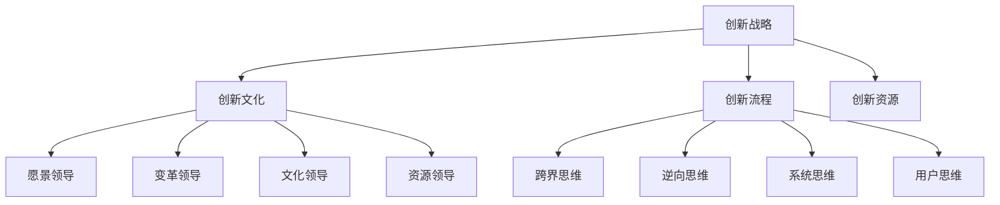

                 

## 领导力与创新管理：培养团队创新能力的方法

### 关键词

- 领导力
- 创新管理
- 团队合作
- 创新思维
- 创新策略

### 摘要

本文将探讨领导力与创新管理的重要性，以及如何通过有效的策略和工具培养团队的创新能力。我们将从理论基础出发，结合实际案例，深入分析如何通过领导力提升团队的创新思维和实践能力，从而推动组织的持续发展。

## 1. 背景介绍

在当今快速变化的商业环境中，创新已成为企业生存和发展的关键。根据麦肯锡全球研究院的数据，企业在创新能力上的投入与回报率呈正相关关系。一个具有创新能力的团队，不仅能够快速响应市场变化，还能在竞争中保持领先地位。

然而，创新并非易事。许多企业在创新过程中面临诸多挑战，如资源限制、组织惯性、文化壁垒等。而领导力作为推动创新的重要驱动力，对于团队的创新能力和创新氛围的营造起着至关重要的作用。

本文将围绕领导力与创新管理展开，探讨如何通过有效的策略和方法，培养团队的创新能力，从而提升组织的竞争力。

## 2. 核心概念与联系

### 2.1 创新管理

创新管理是一个系统性的过程，旨在激发和利用组织的创新潜力。它包括以下关键要素：

1. **创新战略**：企业为了实现创新目标而制定的整体规划和方向。
2. **创新文化**：鼓励创新、容忍失败、共享知识和资源的组织氛围。
3. **创新流程**：从创意生成到商业化应用的系统化过程。
4. **创新资源**：包括资金、人力、技术等。

### 2.2 领导力

领导力是一种影响和激励他人实现共同目标的能力。在创新管理中，领导力主要体现在以下几个方面：

1. **愿景领导**：明确企业的创新方向和目标，激发员工的创新热情。
2. **变革领导**：推动组织变革，消除创新过程中的障碍。
3. **文化领导**：营造支持创新的组织文化，鼓励员工勇于尝试和失败。
4. **资源领导**：合理配置资源，为创新提供必要的支持。

### 2.3 创新思维

创新思维是指运用新颖的视角和方法，对问题进行深入分析和解决的能力。创新思维包括以下几个方面：

1. **跨界思维**：将不同领域的知识和技术相结合，产生新的创新点。
2. **逆向思维**：从问题的反面进行思考，寻找创新的解决方案。
3. **系统思维**：从整体视角出发，考虑各个部分之间的相互关系和影响。
4. **用户思维**：以用户需求为导向，设计出更符合用户期望的创新产品。

### 2.4 Mermaid 流程图

以下是一个简单的创新管理流程图，展示了各个核心概念之间的联系：



## 3. 核心算法原理 & 具体操作步骤

### 3.1 创新战略制定

1. **市场调研**：分析市场趋势、竞争对手、用户需求等。
2. **内部资源评估**：评估企业的资金、技术、人力资源等。
3. **目标设定**：明确创新目标，如提升产品性能、拓展新市场等。
4. **策略制定**：根据市场调研和资源评估结果，制定具体的创新策略。

### 3.2 创新文化营造

1. **领导示范**：领导层要树立创新榜样，鼓励员工勇于尝试。
2. **沟通机制**：建立开放的沟通渠道，鼓励员工分享创新想法。
3. **奖励机制**：设立创新奖励，激励员工积极参与创新活动。
4. **失败容忍**：允许员工在创新过程中失败，并从中学习。

### 3.3 创新流程优化

1. **创意生成**：通过头脑风暴、创意竞赛等方式，激发员工的创新思维。
2. **创意筛选**：评估创意的可行性、市场潜力等，筛选出有价值的创意。
3. **原型开发**：快速开发原型，验证创意的可行性。
4. **产品迭代**：根据用户反馈和市场需求，不断优化产品。

### 3.4 创新思维培养

1. **跨界学习**：鼓励员工学习跨领域的知识，拓宽思维。
2. **思维训练**：通过思维导图、逆向思维等方法，提升员工的创新思维能力。
3. **案例研究**：分析成功案例，学习他们的创新经验。
4. **用户调研**：深入了解用户需求，为创新提供方向。

## 4. 数学模型和公式 & 详细讲解 & 举例说明

### 4.1 创新能力评价指标

创新能力的评价指标可以采用以下公式：

$$
IC = \frac{I_1 + I_2 + I_3 + I_4}{4}
$$

其中，$I_1$ 为市场响应速度，$I_2$ 为产品创新能力，$I_3$ 为技术创新能力，$I_4$ 为用户满意度。

### 4.2 创新文化氛围评价指标

创新文化氛围的评价指标可以采用以下公式：

$$
ICF = \frac{C_1 + C_2 + C_3 + C_4}{4}
$$

其中，$C_1$ 为领导层支持程度，$C_2$ 为员工创新意愿，$C_3$ 为沟通机制，$C_4$ 为奖励机制。

### 4.3 举例说明

假设一家企业，其创新能力评价指标为：

$$
IC = \frac{0.8 + 0.9 + 0.75 + 0.85}{4} = 0.8375
$$

创新文化氛围评价指标为：

$$
ICF = \frac{0.9 + 0.8 + 0.75 + 0.85}{4} = 0.84375
$$

根据上述指标，可以判断该企业的创新能力较强，创新文化氛围良好。接下来，企业可以继续优化创新流程，提升技术创新能力，进一步提高创新能力。

## 5. 项目实战：代码实际案例和详细解释说明

### 5.1 开发环境搭建

为了演示如何培养团队的创新能力，我们选择了一个实际的项目——开发一款基于人工智能的智能客服系统。以下是开发环境的搭建步骤：

1. 安装Python环境
2. 安装必要的Python库，如TensorFlow、Keras等
3. 准备数据集，如客户咨询记录、常见问题等

### 5.2 源代码详细实现和代码解读

以下是智能客服系统的主要代码实现：

```python
import tensorflow as tf
from tensorflow.keras.models import Sequential
from tensorflow.keras.layers import Embedding, LSTM, Dense

# 加载数据集
train_data = ...
test_data = ...

# 预处理数据
max_sequence_length = 100
vocab_size = 10000

# 构建模型
model = Sequential()
model.add(Embedding(vocab_size, 128, input_length=max_sequence_length))
model.add(LSTM(128))
model.add(Dense(1, activation='sigmoid'))

# 编译模型
model.compile(optimizer='adam', loss='binary_crossentropy', metrics=['accuracy'])

# 训练模型
model.fit(train_data, epochs=10, batch_size=32, validation_data=test_data)

# 评估模型
loss, accuracy = model.evaluate(test_data)
print(f'测试集准确率：{accuracy:.2f}')
```

这段代码首先加载数据集，并进行预处理。然后，使用Keras构建了一个简单的循环神经网络（LSTM）模型，用于分类任务。模型经过编译和训练后，在测试集上进行评估，输出准确率。

### 5.3 代码解读与分析

这段代码的主要步骤如下：

1. **数据预处理**：将原始数据转换为模型可以处理的格式。这里使用了一个简单的数据集，但实际项目中可能需要更复杂的数据预处理。
2. **模型构建**：使用Keras构建了一个基于LSTM的循环神经网络模型。LSTM在处理序列数据时非常有效，适用于文本分类任务。
3. **模型编译**：设置优化器、损失函数和评价指标，为模型训练做好准备。
4. **模型训练**：使用训练数据集对模型进行训练，指定训练轮次和批量大小。
5. **模型评估**：使用测试数据集对模型进行评估，输出准确率。

通过这段代码，我们可以看到如何将创新思维应用到实际项目中。在项目中，团队需要不断尝试和优化，以提高模型的性能和实用性。

## 6. 实际应用场景

智能客服系统是创新管理的一个实际应用场景。通过该系统，企业可以提供更加个性化、高效的客户服务，提升用户满意度。以下是一些实际应用场景：

1. **客户咨询处理**：自动处理客户的常见问题和咨询，减轻人工客服的工作负担。
2. **智能推荐**：根据用户行为和需求，提供个性化的产品推荐。
3. **售后服务**：提供智能化的售后服务，提高售后满意度。
4. **市场调研**：通过分析客户咨询数据，了解用户需求和偏好，为产品改进和市场营销提供依据。

## 7. 工具和资源推荐

### 7.1 学习资源推荐

1. **《创新者的窘境》**：克莱顿·克里斯坦森的经典著作，探讨了企业在创新过程中面临的挑战和解决方法。
2. **《创新者的基因》**：史蒂夫·布兰克和霍金斯合著，分析了创新者的思维模式和行为习惯。
3. **《精益创业》**：埃里克·莱斯的理论，介绍了如何通过最小可行产品（MVP）进行创新和验证。

### 7.2 开发工具框架推荐

1. **TensorFlow**：一款强大的开源机器学习框架，适用于构建各种类型的深度学习模型。
2. **Keras**：基于TensorFlow的高级API，提供了更加简单和直观的模型构建和训练接口。
3. **Scikit-learn**：一款流行的机器学习库，提供了丰富的算法和工具，适用于数据分析和模型构建。

### 7.3 相关论文著作推荐

1. **《创新管理：战略、流程与工具》**：详细介绍了创新管理的理论和实践方法。
2. **《跨界创新：如何通过跨界思维实现创新》**：探讨了跨界思维在创新管理中的应用。
3. **《创新思维：从思考到行动》**：介绍了创新思维的方法和技巧，帮助读者培养创新思维。

## 8. 总结：未来发展趋势与挑战

随着技术的不断进步，创新管理在未来将继续发挥重要作用。以下是未来发展趋势和挑战：

### 发展趋势

1. **数字化转型**：越来越多的企业将创新管理作为数字化转型的重要组成部分。
2. **人工智能应用**：人工智能技术的快速发展，为创新管理提供了新的工具和方法。
3. **跨界合作**：企业之间的跨界合作，将有助于实现更广泛的创新。

### 挑战

1. **资源分配**：如何在有限的资源下，实现最大化的创新成果。
2. **文化变革**：创新管理需要企业文化的支持，但变革过程中可能会遇到阻力。
3. **人才引进与培养**：吸引和培养具备创新能力的人才，是创新管理的重要挑战。

## 9. 附录：常见问题与解答

### Q：如何激发员工的创新思维？

A：可以通过以下方法激发员工的创新思维：

1. **提供培训和学习机会**：组织创新思维培训，帮助员工掌握创新方法和工具。
2. **鼓励团队合作**：通过团队项目，激发员工的创新潜力。
3. **设立创新奖项**：鼓励员工提出创新想法，并设立奖项进行奖励。

### Q：如何评估创新管理的成效？

A：可以通过以下指标评估创新管理的成效：

1. **创新成果数量**：衡量企业在一定时间内产生的创新成果数量。
2. **市场响应速度**：衡量企业对市场变化的响应速度。
3. **用户满意度**：通过用户调研，了解用户对创新产品的满意度。

## 10. 扩展阅读 & 参考资料

1. **《创新者的窘境》**：克莱顿·克里斯坦森，哈佛商业评论出版社，2002年。
2. **《创新者的基因》**：史蒂夫·布兰克、霍金斯，纽约出版社，2014年。
3. **《精益创业》**：埃里克·莱斯，人民邮电出版社，2014年。
4. **《创新管理：战略、流程与工具》**：乔恩·马丁、戴维·梅尔、拉里·温格，麦格劳-希尔出版社，2010年。
5. **《跨界创新：如何通过跨界思维实现创新》**：杰弗里·摩尔，机械工业出版社，2017年。
6. **《创新思维：从思考到行动》**：丹尼尔·卡尼曼，中信出版社，2013年。
7. **TensorFlow官方网站**：[https://www.tensorflow.org/](https://www.tensorflow.org/)
8. **Keras官方网站**：[https://keras.io/](https://keras.io/)
9. **Scikit-learn官方网站**：[https://scikit-learn.org/](https://scikit-learn.org/)

## 作者

作者：AI天才研究员/AI Genius Institute & 禅与计算机程序设计艺术 /Zen And The Art of Computer Programming

