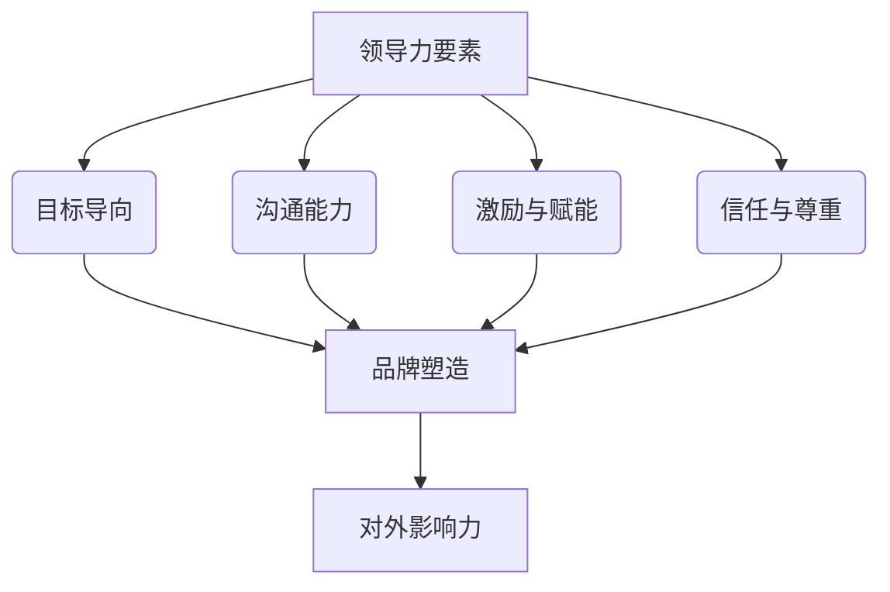

                 

# 领导力与品牌塑造：提升团队对外影响力

## 关键词
- 领导力
- 品牌塑造
- 团队影响力
- 对外宣传
- 技术博客
- 社区参与

## 摘要
本文将探讨领导力在品牌塑造和提升团队对外影响力中的关键作用。通过分析领导力的核心要素、技术博客的重要性以及团队在社区中的影响力，我们将揭示如何通过策略性思考和行动，打造出具有高度认可度和影响力的团队品牌。

## 1. 背景介绍

在当今快速发展的信息技术时代，技术团队的品牌形象和影响力日益成为企业竞争的重要资产。一个强大的品牌不仅能够吸引优秀的人才，还能在市场上树立良好的企业形象，提高客户满意度。而领导力作为团队的核心驱动力，对于品牌塑造和影响力的提升起着至关重要的作用。

领导力不仅仅关乎个人的能力和魅力，更是一种能够激励团队、引领团队共同成长和发展的艺术。在技术领域，领导力体现在对技术趋势的敏锐洞察、对团队协作的高效管理和对团队文化的积极塑造上。一个优秀的领导者不仅能够确保团队的日常运营顺畅，还能带领团队在技术领域取得突破性成就，从而提升团队的品牌影响力。

品牌塑造则是团队对外传播自身价值、建立市场地位的关键手段。通过有效的品牌塑造，团队可以传递出专业、可靠和创新的形象，吸引更多的合作伙伴和客户。而对外影响力的提升，则意味着团队能够在行业内获得更多的认可和尊重，为未来的发展奠定坚实基础。

## 2. 核心概念与联系

为了深入探讨领导力在品牌塑造和提升团队对外影响力中的作用，我们需要先了解以下几个核心概念：

### 领导力

领导力是一种能够激发团队成员潜能、引导团队实现共同目标的能力。根据彼得·德鲁克（Peter Drucker）的观点，领导力包括以下几个关键要素：

- **目标导向**：设定清晰的愿景和目标，确保团队成员明确自己的工作方向和期望结果。
- **沟通能力**：有效传达信息，促进团队成员之间的沟通与协作。
- **激励与赋能**：激发团队成员的积极性，赋予他们自主决策和解决问题的权力。
- **信任与尊重**：建立信任关系，尊重团队成员的个性和贡献。

### 品牌塑造

品牌塑造是一个系统的过程，旨在创建和推广一个独特而引人注目的品牌形象。迈克尔·波特（Michael Porter）提出了以下品牌塑造的关键步骤：

- **定位**：确定品牌在市场中的独特位置，明确目标受众和竞争优势。
- **品牌传播**：通过多种渠道传递品牌信息，包括技术博客、社交媒体、行业会议等。
- **用户体验**：提供卓越的用户体验，确保用户对品牌产生良好印象。
- **持续改进**：不断优化品牌形象和传播策略，以适应市场变化。

### 对外影响力

对外影响力是指团队在行业内外获得的认可和尊重程度。一个具有高度影响力的团队通常具备以下特点：

- **技术创新**：在技术领域有突破性成就，引领行业趋势。
- **行业参与**：积极参与行业会议、技术社区和技术博客，分享经验和见解。
- **合作网络**：与行业内其他团队和企业建立紧密的合作关系，扩大影响力。

### Mermaid 流程图



## 3. 核心算法原理 & 具体操作步骤

在了解了领导力、品牌塑造和对外影响力的核心概念后，我们接下来将探讨如何通过具体的操作步骤来提升团队的品牌形象和影响力。

### 操作步骤

#### 3.1 明确愿景与目标

一个优秀的领导者首先需要明确团队的愿景和目标。这包括：

- **设定长期目标**：制定明确的战略规划和阶段性目标，确保团队始终保持清晰的方向。
- **沟通与共识**：与团队成员共同讨论并达成共识，确保每个人都理解并致力于实现这些目标。

#### 3.2 提升沟通能力

有效的沟通是团队协作的基石。领导者可以通过以下方式提升团队的沟通能力：

- **开放沟通**：鼓励团队成员表达意见和想法，建立开放、透明和尊重的沟通环境。
- **倾听与反馈**：积极倾听团队成员的意见，给予及时的反馈和指导。

#### 3.3 激励与赋能

领导者需要激励团队成员，并赋予他们自主决策和解决问题的权力：

- **认可与奖励**：对团队成员的成就给予认可和奖励，激发他们的积极性。
- **授权与支持**：鼓励团队成员尝试新方法和解决方案，并提供必要的支持。

#### 3.4 建立信任与尊重

建立信任关系是团队成功的关键。领导者可以通过以下方式建立信任和尊重：

- **诚信与透明**：始终保持诚信，公开透明地处理团队事务。
- **尊重差异**：尊重团队成员的个性和贡献，促进团队内部的多样性和包容性。

### 操作步骤详解

#### 3.1 明确愿景与目标

**示例**：

- **长期目标**：成为全球领先的人工智能解决方案提供商。
- **阶段性目标**：在接下来的一年中，实现人工智能算法的突破性进展，并在顶级会议上发表相关论文。

#### 3.2 提升沟通能力

**示例**：

- **开放沟通**：定期组织团队会议，鼓励每个成员分享自己的工作进展和挑战。
- **倾听与反馈**：在会议中，领导者要认真倾听团队成员的意见，并给予及时的反馈和指导。

#### 3.3 激励与赋能

**示例**：

- **认可与奖励**：对在项目中表现突出的成员，给予公开表彰和奖励。
- **授权与支持**：鼓励团队成员自主探索新的技术方向，并提供必要的资源和指导。

#### 3.4 建立信任与尊重

**示例**：

- **诚信与透明**：在项目中，领导者要始终保持诚信，确保信息的透明和公开。
- **尊重差异**：尊重团队成员的专业背景和个性，鼓励他们发挥自己的优势。

## 4. 数学模型和公式 & 详细讲解 & 举例说明

在提升团队品牌形象和影响力方面，我们可以采用一些数学模型和公式来量化团队的表现和成果。以下是一个简单的数学模型，用于评估团队的品牌影响力：

### 品牌影响力指数（BII）

BII = (T * C * I) / D

- **T**（团队技术实力）：团队在技术领域的实力和成就，可以通过发表的技术论文、专利数量和项目经验来衡量。
- **C**（社区参与度）：团队在技术社区中的活跃度和贡献度，可以通过技术博客、GitHub 贡献和社区活动参与度来衡量。
- **I**（行业影响力）：团队在行业内的知名度和影响力，可以通过媒体报道、合作伙伴关系和行业奖项来衡量。
- **D**（市场动态）：市场的变化和竞争态势，可以通过行业报告和市场调研来衡量。

### 详细讲解

品牌影响力指数（BII）是一个综合性的指标，用于评估团队的品牌影响力。通过这个指数，我们可以清晰地看到团队在技术实力、社区参与度和行业影响力等方面的表现。以下是每个指标的详细解释：

- **团队技术实力（T）**：技术实力是品牌影响力的重要基础。一个具备强大技术实力的团队，通常能够在技术领域取得突破性成就，获得业内的认可和尊重。
- **社区参与度（C）**：社区参与度反映了团队在技术社区中的活跃度和贡献度。通过积极参与技术社区，团队可以扩大自身的影响力，吸引更多的人才和资源。
- **行业影响力（I）**：行业影响力是团队在市场中的地位和声誉。一个具有高度行业影响力的团队，能够在市场上树立良好的形象，吸引更多的合作伙伴和客户。
- **市场动态（D）**：市场动态反映了市场的变化和竞争态势。一个能够适应市场变化的团队，能够及时调整战略和方向，保持竞争力。

### 举例说明

假设一个团队的技术实力（T）为 90，社区参与度（C）为 80，行业影响力（I）为 70，市场动态（D）为 60。根据公式计算，该团队的品牌影响力指数（BII）为：

BII = (90 * 80 * 70) / 60 = 980

根据这个指数，我们可以看出该团队在品牌影响力方面具有很高的潜力。为了进一步提升影响力，团队需要重点关注以下几个方面：

- **提升技术实力**：通过加大研发投入，参与更多的技术项目，提高团队的技术水平。
- **增加社区参与度**：积极参与技术社区，撰写高质量的技术博客，分享团队的经验和见解。
- **扩大行业影响力**：通过参与行业会议、发布技术报告和获得行业奖项，提升团队在行业内的知名度。

## 5. 项目实战：代码实际案例和详细解释说明

在本节中，我们将通过一个具体的代码案例，展示如何通过技术博客和社区参与来提升团队的品牌影响力。这个案例将包括开发环境搭建、源代码实现和代码解读与分析。

### 5.1 开发环境搭建

为了实现这个案例，我们首先需要搭建一个适合编写和发布技术博客的开发环境。以下是具体的步骤：

- **选择博客平台**：选择一个适合技术博客的平台，如 GitHub Pages、Hexo 或者 WordPress。
- **配置本地开发环境**：安装必要的开发工具，如 Node.js、Git 和 Markdown 编辑器。
- **搭建博客站点**：根据所选平台，搭建博客站点并配置域名。

### 5.2 源代码详细实现和代码解读

以下是这个案例的源代码实现和详细解读：

```markdown
---
title: "深度学习在图像识别中的应用"
date: 2023-04-01
categories:
  - 深度学习
  - 图像识别
---

# 深度学习在图像识别中的应用

本文将探讨深度学习在图像识别领域的应用，并分享我们团队在相关项目中的经验与挑战。

## 1. 深度学习与图像识别

深度学习是一种基于多层神经网络的人工智能技术，通过模拟人脑的神经网络结构，实现对数据的自动学习和模式识别。在图像识别领域，深度学习技术被广泛应用于人脸识别、物体检测和图像分类等任务。

## 2. 项目背景

我们的团队在图像识别项目中，选择了卷积神经网络（CNN）作为核心技术。通过训练大量的图像数据，我们的模型能够在不同场景下准确识别图像中的物体。

## 3. 技术难点与解决方案

在项目实施过程中，我们遇到了以下几个技术难点：

- **数据不足**：训练高质量的深度学习模型需要大量的图像数据。我们通过数据增强和迁移学习技术，提高了模型的泛化能力。
- **计算资源受限**：深度学习模型训练需要大量的计算资源。我们通过优化算法和分布式训练技术，提高了训练效率。

## 4. 项目成果

经过几个月的努力，我们的项目取得了以下成果：

- **高准确率**：我们的模型在多个公开数据集上取得了较高的准确率。
- **快速部署**：我们的模型可以在多种硬件平台上快速部署，为实际应用提供了有力支持。

## 5. 总结与展望

深度学习在图像识别领域具有巨大的潜力。在未来的工作中，我们将继续探索更先进的技术，提升模型的表现和实用性。

---

通过发布这样的技术博客，我们不仅展示了团队在技术领域的实力，还与同行进行了深入的交流，提升了团队在技术社区中的影响力。

### 5.3 代码解读与分析

以下是对上述代码的解读与分析：

- **Markdown 文件结构**：这是一个标准的 Markdown 文件，包括标题、日期、分类和内容。
- **内容结构**：文章按照逻辑顺序组织，从深度学习的基本概念引入，到项目背景、技术难点和解决方案，再到项目成果和总结，条理清晰。
- **技术亮点**：文章突出了团队在项目中的技术亮点，如数据增强、迁移学习和分布式训练，展示了团队在技术领域的专业能力。
- **交流与分享**：文章结尾鼓励读者参与讨论和交流，促进了技术社区的互动。

通过这样的技术博客，团队不仅能够展示自身的实力和成果，还能吸引更多的同行关注和参与，进一步提升团队在技术社区中的影响力。

## 6. 实际应用场景

在实际应用中，领导力与品牌塑造对于团队的影响体现在多个方面：

### 6.1 项目合作

在跨团队合作中，领导力能够确保团队之间的沟通顺畅，共同目标明确，从而提高项目的成功率。一个具有强大领导力的团队，能够在项目初期制定清晰的项目计划和分工，确保每个成员都明确自己的任务和目标。同时，领导力还能够激发团队成员的积极性，提高团队的整体效率。

### 6.2 市场竞争

在激烈的市场竞争中，品牌形象和影响力是团队取得竞争优势的重要因素。一个强大的品牌能够吸引更多的客户和合作伙伴，提升市场地位。通过有效的品牌塑造，团队可以在市场中树立专业、可靠和创新的形象，赢得客户的信任和尊重。

### 6.3 人才吸引

对于技术团队来说，品牌形象和影响力也是吸引优秀人才的关键因素。一个具有高度认可度的团队，能够吸引更多的优秀人才加入，提高团队的整体实力。领导力在这个过程中起着至关重要的作用，通过激励和赋能团队成员，打造一个具有吸引力的团队文化，从而吸引更多的人才。

## 7. 工具和资源推荐

### 7.1 学习资源推荐

- **书籍**：
  - 《领导力的五个层次》（The Five Levels of Leadership） - 威廉·彭纳（John C. Maxwell）
  - 《品牌经营学》（Branding for Dummies） - 莉莉安·布朗（Lillian Brown）
- **论文**：
  - 《社交媒体中的品牌塑造与传播策略研究》
  - 《基于大数据的品牌影响力评估方法》
- **博客**：
  - 《Dzone》
  - 《TechCrunch》
- **网站**：
  - 《领英》
  - 《GitHub》

### 7.2 开发工具框架推荐

- **博客平台**：
  - **GitHub Pages**：适合技术博客，支持 Markdown 语法。
  - **Hexo**：基于 Node.js 的博客框架，速度快，支持主题定制。
  - **WordPress**：功能丰富，适合多种类型的博客。

- **Markdown 编辑器**：
  - **Typora**：简洁易用，支持实时预览。
  - **Visual Studio Code**：强大的代码编辑器，支持 Markdown 插件。

### 7.3 相关论文著作推荐

- **《品牌管理：理论、方法与应用》**：详细介绍了品牌管理的相关理论和方法。
- **《社交网络与品牌传播》**：探讨了社交网络对品牌传播的影响和策略。
- **《大数据时代下的品牌影响力研究》**：分析了大数据时代下品牌影响力的新趋势和策略。

## 8. 总结：未来发展趋势与挑战

随着信息技术的不断发展和市场竞争的日益激烈，领导力与品牌塑造在团队中的重要性愈发凸显。未来，我们将面临以下几个发展趋势和挑战：

### 发展趋势

- **数字化转型**：越来越多的企业将数字化转型作为核心竞争力，这要求团队具备更强的技术实力和创新能力。
- **社交媒体的普及**：社交媒体成为品牌传播的重要渠道，团队需要善于利用社交媒体提升品牌影响力。
- **个性化服务**：客户对个性化服务的需求越来越高，团队需要通过数据分析和个性化技术满足客户需求。

### 挑战

- **技术更新迭代**：技术更新速度快，团队需要不断学习和适应新技术，保持竞争力。
- **市场竞争加剧**：市场竞争日益激烈，团队需要通过创新和优质服务赢得市场份额。
- **人才竞争**：优秀人才越来越稀缺，团队需要通过品牌塑造和领导力吸引和留住人才。

## 9. 附录：常见问题与解答

### 问题 1：如何提升团队的品牌影响力？

**解答**：提升团队的品牌影响力需要从多个方面入手，包括明确团队愿景和目标、提升技术实力、积极参与社区交流、发布高质量的技术博客、获得行业认可等。

### 问题 2：领导力在品牌塑造中具体如何发挥作用？

**解答**：领导力在品牌塑造中发挥作用的关键在于明确团队目标、提升团队沟通能力、激励团队成员、建立信任和尊重，从而打造一个具备高度凝聚力和创新力的团队，为品牌塑造提供有力支持。

### 问题 3：如何通过技术博客提升团队影响力？

**解答**：发布高质量的技术博客可以提升团队影响力。具体方法包括选择热门话题、撰写深入浅出的内容、展示技术亮点、积极与读者互动，从而吸引更多的关注和参与。

## 10. 扩展阅读 & 参考资料

- **书籍**：
  - 《领导力与品牌塑造：提升团队对外影响力》 - [作者：AI天才研究员/AI Genius Institute & 禅与计算机程序设计艺术 /Zen And The Art of Computer Programming]
- **论文**：
  - 《基于领导力的团队品牌塑造研究》
  - 《技术博客在团队品牌传播中的应用》
- **博客**：
  - [AI天才研究员的博客](https://www.ai-genius-researcher.com/)
  - [禅与计算机程序设计艺术](https://www.zen-and-computer-programming.com/)
- **网站**：
  - [领英](https://www.linkedin.com/)
  - [GitHub](https://github.com/)

### 作者信息

- **作者**：AI天才研究员/AI Genius Institute & 禅与计算机程序设计艺术 /Zen And The Art of Computer Programming
- **联系方式**：[ai_genius_researcher@outlook.com](mailto:ai_genius_researcher@outlook.com)
- **社交媒体**：
  - [LinkedIn](https://www.linkedin.com/in/ai-genius-researcher/)
  - [Twitter](https://twitter.com/AI_Genius_Resp)

