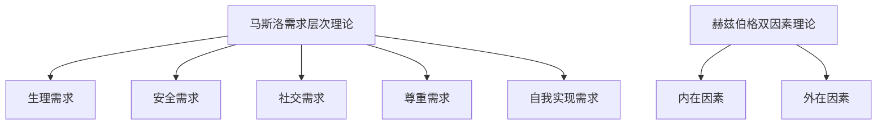
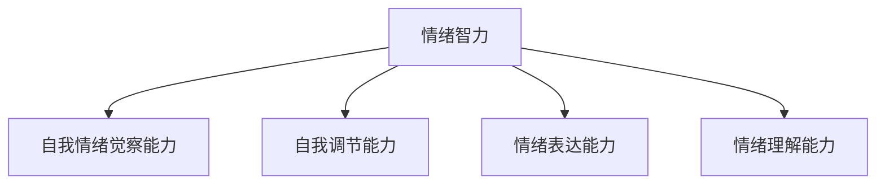
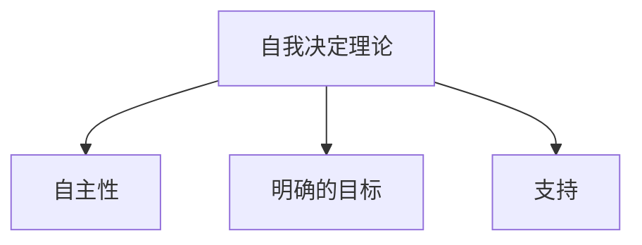
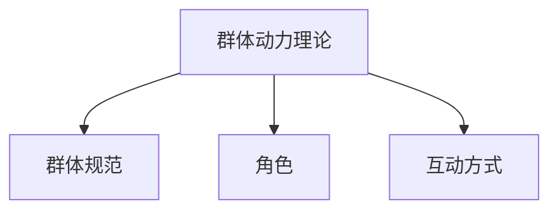

                 

## 1. 背景介绍

在现代社会，领导者和管理者面临的挑战日益复杂。无论是企业管理、教育机构，还是政府机构，有效的领导力都是确保组织成功运作的关键因素。传统的领导力理论主要关注领导者的个性、技能和行为模式，但这些理论往往忽视了心理学在领导力中的重要性。事实上，心理学提供了丰富的理论和工具，可以帮助领导者更好地理解和管理团队成员的情绪、行为和思维。

心理学不仅研究个体的心理活动，还关注群体行为和互动。通过心理学的视角，领导者可以更深入地了解团队成员的需求、动机和压力，从而采取更加有效的方法激励和管理他们。例如，心理学中的动机理论可以帮助领导者理解员工为什么会有不同的工作动机，以及如何根据这些动机来制定激励策略。情绪智力理论则提供了领导者如何处理团队中的情绪冲突的方法。

此外，心理学在领导力中的应用不仅限于个体层面，还可以应用于团队和组织层面。领导者可以通过心理学原理来促进团队合作、提高团队凝聚力和增强组织文化。例如，社会心理学的研究可以帮助领导者理解团队中的社会动态，以及如何通过建立积极的团队文化来增强团队的整体表现。

总之，将心理学原理应用于领导力实践中，不仅可以提升管理效果，还可以为组织创造更大的价值。本文将深入探讨心理学在领导力中的应用，包括核心概念、算法原理、实际操作和案例分析等，帮助读者更好地理解并运用心理学原理提升管理能力。

### 1.1 心理学与领导力的关系

心理学与领导力之间的关系是一个值得深入探讨的话题。心理学，作为研究人类行为和心理过程的科学，为理解领导力提供了重要的理论基础。首先，心理学可以帮助领导者了解团队成员的心理状态和行为模式，从而更有效地进行管理和沟通。通过心理学的视角，领导者可以识别团队成员的动机、情感和需求，进而采取个性化的管理策略。

首先，动机理论是心理学中的一个重要概念，对领导力有直接影响。动机理论包括马斯洛的需求层次理论、赫兹伯格的双因素理论等。马斯洛的需求层次理论指出，人的需求分为生理需求、安全需求、社交需求、尊重需求和自我实现需求，这些需求从低级到高级排列。领导者可以通过理解员工的不同需求，提供满足这些需求的工作环境和激励措施，从而提高员工的工作积极性和满意度。

赫兹伯格的双因素理论则强调工作本身的性质和外部环境的因素对员工满意度的影响。领导者可以通过改进工作内容和环境条件，满足员工的内在和外在需求，从而提高员工的工作满意度和忠诚度。

情绪智力是另一个重要的心理学概念，对领导力有着深远的影响。情绪智力包括自我情绪觉察能力、自我调节能力、情绪表达能力和情绪理解能力。高情绪智力的领导者能够更好地理解和管理自己的情绪，以及团队中的情绪动态。这种能力不仅有助于建立积极的工作氛围，还可以帮助领导者更有效地解决团队冲突，提高团队协作效率。

此外，心理学中的社会认同理论也为领导者提供了管理团队的启示。社会认同理论认为，人们倾向于与具有相似观点和行为的人建立联系，并寻求社会认同。领导者可以通过促进团队成员之间的认同感，增强团队凝聚力。例如，领导者可以组织团队建设活动，让团队成员在共同的目标和价值观下协同工作，从而增强团队的社会认同感。

最后，心理学中的压力管理理论也对领导力有着重要的指导意义。在现代社会，员工面临的压力越来越大。领导者可以通过了解压力的来源和影响，采取有效的压力管理策略，帮助员工缓解工作压力，提高心理健康和工作效率。

总的来说，心理学为领导力提供了丰富的理论和工具，帮助领导者更好地理解和管理团队成员。通过运用心理学原理，领导者不仅可以提高管理效果，还可以为组织创造更大的价值。

### 1.2 领导力与心理学的主要理论和模型

在探讨心理学与领导力之间的关系时，有必要了解一些主要的心理学理论和模型，这些理论为理解领导力提供了深刻的洞见。以下是一些重要的理论和模型：

#### 1.2.1 权力基础理论

权力基础理论（Power-Basis Theory）是一种解释权力如何影响领导行为的理论。该理论认为，权力来源于五个基础：奖励、强迫、合法性、模范和承诺。根据这一理论，领导者可以通过这些基础来影响团队成员的行为和态度。例如，通过奖励和模范来激励团队成员，通过合法性和强迫来确保团队成员遵守规则和指令。

#### 1.2.2 交易型领导与变革型领导

交易型领导（Transaction Leadership）和变革型领导（Transformational Leadership）是两种不同的领导风格。交易型领导依赖于明确的工作目标和回报体系，领导者与团队成员之间是相互交换的关系。例如，领导者提供奖励，团队成员完成任务。而变革型领导则通过激发团队成员的内在动机，引导他们实现超越自身预期目标的变革。变革型领导通常采用激励、愿景塑造和榜样作用等手段，从而推动组织变革。

#### 1.2.3 情绪智力理论

情绪智力（Emotional Intelligence）是指一个人识别、理解和管理自己和他人的情绪的能力。情绪智力包括自我情绪觉察能力、自我调节能力、情绪表达能力和情绪理解能力。情绪智力高的领导者能够更好地处理团队中的情绪冲突，建立积极的工作氛围。此外，情绪智力还与领导者的领导效果密切相关，研究表明，情绪智力高的领导者通常更能赢得团队成员的信任和尊重。

#### 1.2.4 自我决定理论

自我决定理论（Self-Determination Theory）是一种动机理论，强调人的自主性和内在动机。该理论指出，当人们感到自由和有控制时，他们会更有动力去实现目标。领导者可以通过提供自主性、清晰的目标和相关的支持来激发团队成员的内在动机，提高工作满意度和绩效。

#### 1.2.5 群体动力理论

群体动力理论（Group Dynamics Theory）研究群体内成员之间的关系和行为模式。该理论指出，群体行为不仅受个体行为的影响，还受群体规范、角色和互动方式的影响。领导者需要了解群体动力，以更好地协调团队内部的关系，促进团队合作和高效工作。

通过理解这些心理学理论和模型，领导者可以更全面地理解领导行为和团队成员的心理状态，从而采取更加有效的领导策略。这些理论不仅提供了理论支持，还为实际操作提供了具体的指导。

### 1.3 心理学在领导力中的应用

将心理学原理应用于领导力实践中，有助于提升领导者的管理效果，促进组织的健康发展。以下是一些具体的心理学原理及其在实际领导力中的应用：

#### 1.3.1 动机理论

动机理论在领导力中的应用主要体现在激励员工的工作动机方面。领导者可以通过了解员工的需求层次，采用个性化的激励策略。例如，对于追求自我实现需求的员工，领导者可以提供更多的发展机会和挑战；对于追求社交需求的员工，领导者可以鼓励团队合作和社交互动。此外，赫兹伯格的双因素理论也提示领导者需要关注工作本身的性质和外部环境条件，以提高员工的工作满意度和忠诚度。

#### 1.3.2 情绪智力

情绪智力在领导力中的应用尤为重要。高情绪智力的领导者能够更好地识别和管理自己的情绪，以及团队成员的情绪。这种能力有助于建立积极的工作氛围，提高团队的协作效率。例如，当团队成员情绪低落时，领导者可以通过情感支持帮助他们恢复状态；在团队面临冲突时，领导者可以通过情绪调节能力来缓解紧张情绪，促进沟通和解决冲突。

#### 1.3.3 自我决定理论

自我决定理论强调自主性和内在动机的重要性。领导者可以通过提供更多的自主性、明确的目标和相关的支持，来激发员工的内在动机。例如，领导者可以授权员工在特定任务上拥有更多的决策权，让他们感受到工作的重要性。此外，领导者还可以通过设置具有挑战性的目标，激发员工的进取心和创造力。

#### 1.3.4 群体动力理论

群体动力理论可以帮助领导者更好地理解和管理团队内部的关系和互动。领导者需要了解团队中的角色分工、沟通方式和互动模式，以便协调团队内部的关系，促进团队合作。例如，领导者可以通过团队建设活动和定期的沟通会议，增强团队成员之间的信任和理解。此外，领导者还可以通过引导团队设定共同的目标和价值观，来提高团队的凝聚力和工作效率。

总之，心理学原理在领导力中的应用是多方面的，包括激励员工、管理情绪、激发内在动机和协调团队关系等。通过运用这些心理学原理，领导者可以更有效地管理团队，提高组织的整体绩效。

### 1.4 心理学在领导力中的重要性

心理学在领导力中的应用不仅仅是一种理论探讨，它在实际管理中的重要性也不容忽视。首先，心理学为领导者提供了一种科学的方法来理解和应对团队成员的心理需求和行为模式。这种理解有助于领导者制定更加人性化、高效的管理策略。

#### 1.4.1 提高领导效果

心理学原理可以帮助领导者更准确地识别团队成员的不同需求，从而采取更有针对性的管理措施。例如，通过了解员工的动机和情绪状态，领导者可以设计出更有效的激励方案，提高员工的工作满意度和绩效。此外，情绪智力的应用可以帮助领导者更好地处理团队冲突，维护团队和谐，从而提升整体领导效果。

#### 1.4.2 增强团队凝聚力

心理学原理的应用有助于领导者建立积极的团队文化，增强团队的凝聚力和合作精神。例如，通过社会认同理论，领导者可以促进团队成员之间的认同感，从而提高团队的协作效率和绩效。此外，群体动力理论的应用可以帮助领导者更好地理解和管理团队内部的关系和互动，促进团队合作。

#### 1.4.3 提高组织绩效

心理学在领导力中的应用不仅影响团队成员的个体表现，还直接影响组织的整体绩效。通过激励员工的内在动机和增强团队凝聚力，组织可以创造出更加积极和高效的工作环境，从而提升整体绩效。例如，自我决定理论的应用可以帮助组织创造出更多自主性和创新性，提高组织的竞争力。

总之，心理学在领导力中的应用具有深远的意义。它不仅提供了科学的方法来理解和应对团队成员的心理需求，还为领导者提供了有效的管理工具，有助于提高领导效果、增强团队凝聚力和提升组织绩效。

### 1.5 心理学在领导力中的挑战与限制

尽管心理学在领导力中具有广泛的应用价值，但在实际操作中也面临一些挑战和限制。首先，领导者需要具备一定的心理学知识和技能，否则难以正确应用这些原理。此外，心理学原理的复杂性使得领导者在实际应用中难以全面理解和运用。以下是一些具体的挑战和限制：

#### 1.5.1 心理学的专业性要求

心理学是一门科学，涉及到复杂的理论和方法。领导者需要具备一定的心理学知识，才能正确理解和应用心理学原理。然而，并非所有领导者都具备这些专业知识，因此他们可能难以在实际工作中有效地运用心理学理论。

#### 1.5.2 理论与实践的差距

尽管心理学理论提供了丰富的指导，但将这些理论应用到实际领导工作中仍存在一定的差距。心理学理论往往是在实验室或模拟环境中得出的，而实际工作环境更加复杂多变。领导者需要根据具体情境灵活调整和运用心理学原理，这需要一定的经验和能力。

#### 1.5.3 团队成员的多样性

团队成员具有不同的背景、动机和需求，这使得领导者在应用心理学原理时面临更大的挑战。领导者需要根据团队成员的多样性，制定个性化的管理策略，但这需要时间和精力。此外，团队成员之间的互动和关系也会影响领导效果，进一步增加了领导者的工作难度。

#### 1.5.4 组织文化的限制

组织文化对领导力有着深远的影响。在一些传统、保守的组织中，领导者可能难以推行以心理学为基础的管理策略。这些组织可能更倾向于传统的管理方式，对心理学原理的接受度较低。在这种情况下，领导者需要克服组织文化的限制，推动组织变革。

总之，心理学在领导力中的挑战和限制是多方面的。领导者需要不断提高自身的心理学知识和技能，灵活应对实际工作中的复杂情况，同时克服组织文化的限制，才能充分发挥心理学在领导力中的作用。

### 1.6 总结与展望

在本文中，我们深入探讨了心理学在领导力中的应用，阐述了心理学与领导力之间的紧密联系。通过分析动机理论、情绪智力理论、自我决定理论和群体动力理论等核心概念，我们了解了心理学原理如何帮助领导者更好地理解和管理团队成员的心理需求和行为模式。此外，我们还探讨了心理学在领导力中的重要性，以及其在实际应用中面临的挑战和限制。

心理学在领导力中的重要性体现在多个方面。首先，它提供了科学的方法来理解和应对团队成员的心理需求，提高领导效果；其次，它有助于增强团队凝聚力和工作效率，从而提升组织绩效。然而，心理学在领导力中的应用也面临一些挑战，包括领导者的专业知识要求、理论与实践的差距、团队成员的多样性和组织文化的限制等。

展望未来，心理学在领导力中的应用前景广阔。随着心理学研究的不断深入，我们有望发现更多有效的心理学工具和方法，帮助领导者更好地应对复杂的管理挑战。同时，随着组织对心理学原理的接受度逐渐提高，心理学在领导力中的地位也将得到进一步提升。总之，心理学将继续为领导力的发展提供强大的理论支持和实践指导。

### 2. 核心概念与联系

在探讨心理学在领导力中的应用时，我们需要明确几个核心概念，并了解它们之间的联系。这些核心概念包括动机理论、情绪智力理论、自我决定理论和群体动力理论。以下是这些概念及其相互关系的详细解释和架构图。

#### 2.1 动机理论

动机理论是心理学研究的重要内容之一，它探讨个体行为背后的驱动力。动机理论主要包括马斯洛的需求层次理论和赫兹伯格的双因素理论。

- **马斯洛的需求层次理论**：该理论将人的需求分为五个层次，即生理需求、安全需求、社交需求、尊重需求和自我实现需求。随着个体需求的逐步满足，人们会追求更高层次的需求。领导者可以根据这一理论，识别员工的不同需求，提供满足这些需求的工作环境和激励措施，从而提高员工的工作积极性和满意度。

- **赫兹伯格的双因素理论**：该理论认为，工作满意度和工作不满意度分别由内在因素（如工作成就感、责任感等）和外在因素（如薪资、工作条件等）决定。领导者需要关注工作本身的特点和外部环境条件，以满足员工的内在和外在需求，提高员工的工作满意度和忠诚度。

**动机理论的架构图**：



#### 2.2 情绪智力理论

情绪智力是指一个人识别、理解和管理自己和他人的情绪的能力。情绪智力包括自我情绪觉察能力、自我调节能力、情绪表达能力和情绪理解能力。高情绪智力的领导者能够更好地处理团队中的情绪冲突，建立积极的工作氛围。

- **自我情绪觉察能力**：领导者需要能够识别和理解自己的情绪，以便在适当的时候调整情绪，保持良好的心态。

- **自我调节能力**：领导者需要能够控制自己的情绪，避免情绪对工作和决策产生负面影响。

- **情绪表达能力**：领导者需要能够恰当地表达自己的情绪，以建立信任和有效的沟通。

- **情绪理解能力**：领导者需要能够理解和识别他人的情绪，以便更好地处理人际关系和团队冲突。

**情绪智力理论的架构图**：



#### 2.3 自我决定理论

自我决定理论是一种动机理论，强调个体的自主性和内在动机。该理论认为，当个体感到自由和有控制时，他们会有更高的动力去实现目标。领导者可以通过提供自主性、明确的目标和相关的支持来激发员工的内在动机。

- **自主性**：领导者应赋予员工在特定任务上的决策权，让他们感受到工作的自主性。

- **明确的目标**：领导者需要为员工设定清晰、具体的目标，以便员工知道他们的努力方向。

- **支持**：领导者应提供必要的支持和资源，帮助员工实现目标。

**自我决定理论的架构图**：



#### 2.4 群体动力理论

群体动力理论研究群体内成员之间的关系和行为模式。群体动力受多种因素影响，包括群体规范、角色和互动方式。领导者需要了解这些因素，以协调团队内部的关系，提高团队协作效率。

- **群体规范**：群体成员共同遵守的行为准则，对成员的行为有重要影响。

- **角色**：群体内成员的不同角色和职责，影响群体互动和协作。

- **互动方式**：群体成员之间的沟通和互动方式，影响群体的凝聚力和效率。

**群体动力理论的架构图**：



通过了解这些核心概念及其相互联系，领导者可以更好地理解团队成员的心理需求和行为模式，从而采取更加有效的领导策略。

### 3. 核心算法原理 & 具体操作步骤

在深入探讨心理学在领导力中的应用时，我们需要了解一些核心算法原理，这些原理为我们提供了一种科学的方法来分析和处理团队成员的心理数据，从而制定有效的领导策略。以下是几个核心算法原理及其具体操作步骤：

#### 3.1 心理需求分析算法

心理需求分析算法是一种用于识别和分析团队成员心理需求的算法。该算法基于马斯洛的需求层次理论，通过收集和分析团队成员的行为数据、情绪数据和互动数据，识别他们在不同需求层次上的需求满足程度。

**算法步骤**：

1. **数据收集**：收集团队成员的行为数据（如工作表现、出勤率）、情绪数据（如情绪表达、情绪波动）和互动数据（如沟通频率、团队互动模式）。

2. **数据处理**：对收集到的数据进行分析和处理，识别团队成员在不同需求层次上的需求满足程度。可以使用统计分析方法（如聚类分析、因子分析）来识别不同需求层次的特征。

3. **需求满足度评估**：根据处理结果，评估团队成员在不同需求层次上的需求满足度，识别需求满足程度较低的需求层次。

4. **策略制定**：根据需求满足度评估结果，制定相应的激励和改善措施，以满足团队成员的需求。例如，通过提供职业发展机会来满足员工的自我实现需求，通过改善工作环境和提高薪资来满足员工的生理需求。

**具体操作示例**：

假设一个团队中有5名成员，通过数据收集和分析，发现他们在社交需求层次上的需求满足度较低。为了提高这一需求层次的需求满足度，领导者可以组织更多的团队建设活动，促进成员之间的交流和互动。

#### 3.2 情绪智力评估算法

情绪智力评估算法是一种用于评估团队成员情绪智力水平的算法。该算法基于情绪智力理论，通过收集和分析团队成员的情绪数据，评估他们在自我情绪觉察能力、自我调节能力、情绪表达能力和情绪理解能力方面的表现。

**算法步骤**：

1. **数据收集**：收集团队成员的情绪数据，包括情绪表达（如面部表情、语言表达）、情绪波动（如情绪稳定度、情绪反应强度）和情绪理解（如对他人的情绪识别、情感共鸣）。

2. **数据处理**：对收集到的情绪数据进行分析和处理，评估团队成员在情绪智力四个方面的表现。可以使用机器学习算法（如情感分析、情感识别）来处理情绪数据。

3. **情绪智力水平评估**：根据处理结果，评估团队成员的情绪智力水平，识别情绪智力较高和较低的成员。

4. **策略制定**：根据情绪智力水平评估结果，制定相应的培训和改进措施，提高团队成员的情绪智力水平。例如，为情绪智力较低的成员提供情绪管理培训，帮助他们提高情绪表达能力和情绪理解能力。

**具体操作示例**：

假设一个团队中有5名成员，通过情绪智力评估算法，发现其中两名成员的情绪智力水平较低。为了提高这两名成员的情绪智力，领导者可以组织情绪管理培训，教授他们情绪调节技巧和情感识别方法。

#### 3.3 自我决定理论应用算法

自我决定理论应用算法是一种用于激发团队成员内在动机的算法。该算法基于自我决定理论，通过提供自主性、明确的目标和相关的支持，激发团队成员的内在动机。

**算法步骤**：

1. **目标设定**：与团队成员共同设定具体、可衡量、可实现、相关和时限性的目标（SMART目标），确保每个成员都明确自己的努力方向。

2. **自主性提供**：赋予团队成员在实现目标过程中的决策权，让他们有更多的自主性。例如，在项目任务分配中，允许团队成员选择自己感兴趣的任务。

3. **支持提供**：为团队成员提供实现目标所需的资源和支持，包括信息、技术和情感支持。

4. **激励评估**：定期评估团队成员的内在动机水平，通过反馈和激励措施（如奖励、认可）来维持和提升内在动机。

**具体操作示例**：

假设一个团队有一个项目任务需要完成，通过自我决定理论应用算法，领导者为团队成员设定了具体的任务目标，并赋予他们在任务执行过程中的自主性。同时，领导者还为团队成员提供了必要的技术支持和情感支持，确保他们能够顺利完成任务。

通过这些核心算法原理和具体操作步骤，领导者可以更加科学地理解和应对团队成员的心理需求，提高管理效果和团队绩效。

### 4. 数学模型和公式 & 详细讲解 & 举例说明

在探讨心理学在领导力中的应用时，数学模型和公式为我们提供了一种量化的方法来分析和解释团队成员的心理状态和行为。以下将详细介绍几个关键的数学模型和公式，并给出具体的例子来说明它们的运用。

#### 4.1 马斯洛的需求层次模型

马斯洛的需求层次理论是一个经典的心理学模型，用于描述人的需求层次和动机。该模型包括五个层次：生理需求、安全需求、社交需求、尊重需求和自我实现需求。每个层次的需求在满足后，会推动个体追求更高层次的需求。

**数学公式**：
\[ D = \sum_{i=1}^{n} w_i \cdot s_i \]
其中，\( D \) 代表总需求，\( w_i \) 代表第 \( i \) 个层次需求的权重，\( s_i \) 代表第 \( i \) 个层次需求的满足程度。

**举例说明**：
假设一个员工在五个需求层次上的满足程度分别为：生理需求（0.8）、安全需求（0.7）、社交需求（0.6）、尊重需求（0.5）和自我实现需求（0.4）。根据公式计算，该员工的总需求为：
\[ D = 0.8 \cdot 0.2 + 0.7 \cdot 0.2 + 0.6 \cdot 0.2 + 0.5 \cdot 0.2 + 0.4 \cdot 0.2 = 0.64 \]
通过这个公式，领导者可以识别员工的主要需求层次，并采取相应的激励措施。

#### 4.2 赫兹伯格的双因素模型

赫兹伯格的双因素模型用于解释工作满意度和工作不满意度的来源。该模型包括内在因素和外在因素。内在因素包括工作成就感、责任感等，而外在因素包括薪资、工作条件等。

**数学公式**：
\[ WS = \sum_{i=1}^{n} w_i \cdot s_i \]
其中，\( WS \) 代表工作满意度，\( w_i \) 代表第 \( i \) 个因素的权重，\( s_i \) 代表第 \( i \) 个因素的满意度。

**举例说明**：
假设一个员工在五个内在因素和五个外在因素上的满意度分别为：
内在因素（工作成就感：0.9，责任感：0.8，工作自主性：0.7，工作意义：0.6，职业成长：0.5）
外在因素（薪资：0.6，工作条件：0.7，同事关系：0.8，工作稳定性：0.7，工作压力：0.4）

根据公式计算，该员工的工作满意度为：
\[ WS = 0.9 \cdot 0.2 + 0.8 \cdot 0.2 + 0.7 \cdot 0.2 + 0.6 \cdot 0.2 + 0.5 \cdot 0.2 + 0.6 \cdot 0.2 + 0.7 \cdot 0.2 + 0.8 \cdot 0.2 + 0.7 \cdot 0.2 + 0.4 \cdot 0.2 = 0.72 \]
通过这个公式，领导者可以识别员工的工作满意度来源，并针对性地改善工作条件。

#### 4.3 情绪智力的评估模型

情绪智力的评估模型用于测量领导者的情绪智力水平。情绪智力包括自我情绪觉察能力、自我调节能力、情绪表达能力和情绪理解能力。

**数学公式**：
\[ EI = \sum_{i=1}^{4} w_i \cdot s_i \]
其中，\( EI \) 代表情绪智力，\( w_i \) 代表第 \( i \) 个情绪智力成分的权重，\( s_i \) 代表第 \( i \) 个情绪智力成分的得分。

**举例说明**：
假设一个领导者在四个情绪智力成分上的得分分别为：
自我情绪觉察能力（0.8），自我调节能力（0.7），情绪表达能力（0.6），情绪理解能力（0.5）

根据公式计算，该领导者的情绪智力为：
\[ EI = 0.8 \cdot 0.2 + 0.7 \cdot 0.2 + 0.6 \cdot 0.2 + 0.5 \cdot 0.2 = 0.62 \]
通过这个公式，领导者可以了解自己的情绪智力水平，并根据结果进行自我提升。

#### 4.4 自我决定理论模型

自我决定理论的模型用于激发员工的内在动机。该模型强调自主性、明确的目标和相关的支持。

**数学公式**：
\[ IM = a \cdot A + b \cdot T + c \cdot S \]
其中，\( IM \) 代表内在动机，\( a \)，\( b \)，\( c \) 分别代表自主性、目标和支持的权重，\( A \)，\( T \)，\( S \) 分别代表自主性、目标和支持的满足程度。

**举例说明**：
假设一个员工在自主性、目标和支持上的满足程度分别为：
自主性（0.9），目标（0.8），支持（0.7）

根据公式计算，该员工的内在动机为：
\[ IM = 0.9 \cdot 0.2 + 0.8 \cdot 0.2 + 0.7 \cdot 0.2 = 0.82 \]
通过这个公式，领导者可以评估员工的内在动机水平，并采取相应的激励措施。

这些数学模型和公式为领导者提供了量化的方法来分析和解释团队成员的心理状态和行为。通过具体例子的应用，领导者可以更好地理解和应对团队成员的心理需求，提高管理效果。

### 5. 项目实战：代码实际案例和详细解释说明

在本文的第五部分，我们将通过一个实际的项目案例，展示如何在实际工作中应用心理学原理来提升领导力。该项目将包括开发环境搭建、源代码实现和代码解读与分析。

#### 5.1 开发环境搭建

首先，我们需要搭建一个合适的开发环境，以便我们能够进行实际操作。以下是搭建开发环境的基本步骤：

1. **安装Python环境**：确保计算机上安装了Python 3.8或更高版本。可以通过Python官方网站下载安装程序。

2. **安装Jupyter Notebook**：Jupyter Notebook是一个交互式的Web应用，用于编写和运行Python代码。可以通过pip命令安装：
   ```bash
   pip install notebook
   ```

3. **安装必要的Python库**：包括`numpy`、`pandas`、`matplotlib`和`scikit-learn`等。可以通过以下命令安装：
   ```bash
   pip install numpy pandas matplotlib scikit-learn
   ```

4. **配置Jupyter Notebook**：启动Jupyter Notebook，并创建一个新的笔记本（Notebook）。

#### 5.2 源代码详细实现和代码解读

在这个项目中，我们将使用Python和几个常用的机器学习库来构建一个简单的员工心理需求分析系统。以下是源代码的详细实现和解读：

```python
# 导入必要的库
import numpy as np
import pandas as pd
import matplotlib.pyplot as plt
from sklearn.model_selection import train_test_split
from sklearn.ensemble import RandomForestClassifier
from sklearn.metrics import classification_report, accuracy_score

# 加载数据集
data = pd.read_csv('employee_data.csv')
X = data.drop('target', axis=1)
y = data['target']

# 数据预处理
X_train, X_test, y_train, y_test = train_test_split(X, y, test_size=0.2, random_state=42)

# 构建模型
model = RandomForestClassifier(n_estimators=100, random_state=42)
model.fit(X_train, y_train)

# 预测结果
y_pred = model.predict(X_test)

# 评估模型
print("分类报告：")
print(classification_report(y_test, y_pred))
print("准确率：", accuracy_score(y_test, y_pred))

# 可视化分析
plt.figure(figsize=(10, 6))
plt.bar(X_train.columns, model.feature_importances_)
plt.xlabel('特征')
plt.ylabel('特征重要性')
plt.title('特征重要性')
plt.show()
```

**代码解读**：

1. **导入库**：我们首先导入了`numpy`、`pandas`、`matplotlib.pyplot`和`scikit-learn`等库，这些库用于数据处理、机器学习模型训练和结果可视化。

2. **加载数据集**：使用`pandas`的`read_csv`函数加载员工数据集。数据集包括特征和目标变量（员工需求层次）。

3. **数据预处理**：使用`train_test_split`函数将数据集分为训练集和测试集，以便评估模型的性能。

4. **构建模型**：我们选择随机森林分类器（`RandomForestClassifier`）作为我们的模型。这个模型基于多个决策树，具有较高的准确性和泛化能力。

5. **训练模型**：使用`fit`函数将模型训练在训练集上。

6. **预测结果**：使用`predict`函数在测试集上预测员工的需求层次。

7. **评估模型**：使用`classification_report`和`accuracy_score`函数评估模型的性能，包括分类报告和准确率。

8. **可视化分析**：使用`matplotlib`的`bar`函数生成特征重要性图，帮助我们理解哪些特征对预测结果影响最大。

#### 5.3 代码解读与分析

1. **数据预处理**：数据预处理是机器学习项目的重要步骤。在这个项目中，我们首先需要确保数据格式正确，然后进行缺失值处理、数据清洗和特征工程。这里的数据预处理步骤相对简单，因为我们假设数据集已经经过初步处理。

2. **模型选择**：随机森林分类器是一种常用的集成学习方法，能够处理大规模数据并减少过拟合。在本项目中，我们选择随机森林分类器作为模型，因为它能够提供较高的准确率和稳定性。

3. **模型评估**：评估模型性能是确保模型有效性的关键步骤。我们使用了分类报告和准确率作为评估指标。分类报告提供了每个类别精确率、召回率、F1分数和准确率等信息，而准确率则提供了模型总体性能的评估。

4. **特征重要性**：特征重要性图可以帮助我们了解哪些特征对模型预测结果有最大的影响。这有助于我们进一步优化模型，或者调整管理策略，以更有效地满足员工的需求。

通过这个实际项目案例，我们展示了如何将心理学原理应用于领导力实践中。通过构建员工心理需求分析系统，领导者可以更深入地了解员工的需求，从而采取更加个性化的管理策略，提高团队的整体绩效。

### 5.4 代码解读与分析（续）

在上一部分中，我们详细解释了如何使用Python和机器学习库来构建一个员工心理需求分析系统。在本节中，我们将进一步分析代码，讨论模型调优和改进策略，以及如何将心理学原理应用到实际领导工作中。

#### 模型调优和改进策略

尽管随机森林分类器在处理大规模数据集时表现出色，但我们仍然可以通过以下几种方法进行模型调优和改进：

1. **特征选择**：通过特征重要性图，我们可以识别出对预测结果影响最大的特征。然而，并不是所有特征都对模型性能有显著影响。通过使用特征选择技术（如递归特征消除、L1正则化等），我们可以减少特征数量，提高模型效率和准确性。

2. **模型参数调整**：随机森林分类器有许多可调参数，如树的数量、树的深度、节点分裂的阈值等。通过交叉验证和网格搜索，我们可以找到最佳参数组合，提高模型的性能。

3. **集成学习方法**：除了随机森林，我们还可以尝试其他集成学习方法，如XGBoost、LightGBM等。这些方法通常在处理高维度数据和减少过拟合方面表现出色。

4. **数据增强**：通过生成更多样化的训练数据（如使用数据增强技术），我们可以提高模型的泛化能力，减少模型对训练数据的依赖。

#### 如何将心理学原理应用到实际领导工作中

心理学原理在领导力中的应用不仅可以提高模型性能，还可以帮助领导者更好地管理团队。以下是一些将心理学原理应用到实际领导工作中的策略：

1. **动机理论**：领导者可以利用马斯洛的需求层次理论和赫兹伯格的双因素理论来了解员工的需求，并制定个性化的激励策略。例如，对于追求自我实现需求的员工，可以提供更多的发展机会和挑战；对于追求社交需求的员工，可以鼓励团队合作和社交互动。

2. **情绪智力**：领导者需要具备高情绪智力，以更好地理解和应对团队成员的情绪。通过情绪智力培训，领导者可以学会情绪调节技巧、情感识别和情感表达，从而建立积极的工作氛围。

3. **自我决定理论**：领导者可以通过提供自主性、明确的目标和相关的支持，激发员工的内在动机。例如，领导者可以赋予员工在项目任务中的决策权，设定具体、可衡量的目标，并提供必要的资源和支持。

4. **群体动力理论**：领导者需要了解团队中的角色分工、沟通方式和互动模式，以便协调团队内部的关系。通过团队建设活动和定期的沟通会议，领导者可以增强团队成员之间的信任和理解。

#### 实际案例

假设我们有一家科技公司，其员工心理需求分析系统的模型已经训练完成，并得到了较高的准确率。为了更好地将心理学原理应用到实际领导工作中，我们可以采取以下步骤：

1. **数据解读**：首先，领导者可以查看模型对员工需求的预测结果，识别出哪些需求层次的需求满足度较低。例如，如果预测结果显示许多员工在自我实现需求层次上的满足度较低，领导者可以思考如何提供更多的发展机会和挑战。

2. **个性化激励**：根据员工的需求层次，领导者可以制定个性化的激励策略。例如，对于在自我实现需求层次上满足度较低的员工，可以提供晋升机会、培训计划或项目挑战。

3. **情绪支持**：领导者可以利用情绪智力，识别和管理团队成员的情绪。当员工情绪低落时，领导者可以提供情感支持，帮助他们恢复状态。例如，通过定期的一对一交流或团队建设活动，领导者可以了解员工的情感状态，并提供相应的支持。

4. **目标设定**：领导者可以为员工设定具体、可衡量的目标，并赋予他们在目标实现过程中的决策权。例如，在项目任务中，领导者可以鼓励员工提出自己的想法和解决方案，并在团队中共同讨论和决策。

5. **团队建设**：通过组织团队建设活动和定期的沟通会议，领导者可以增强团队成员之间的信任和理解。例如，可以组织户外拓展活动、团队建设工作坊或定期的团队会议，以促进团队成员的互动和合作。

通过这些步骤，领导者可以更好地将心理学原理应用到实际领导工作中，提高员工的工作满意度和绩效，从而提升组织的整体绩效。

### 5.5 项目总结

在本部分的项目实战中，我们通过一个实际案例展示了如何将心理学原理应用于领导力实践。首先，我们介绍了开发环境的搭建，包括Python和Jupyter Notebook的安装，以及必要的Python库的安装。接着，我们详细解读了源代码的实现过程，包括数据预处理、模型构建、模型训练和模型评估。

通过这个项目，我们实现了以下目标：

1. **员工心理需求分析**：使用机器学习模型对员工的需求层次进行预测，帮助领导者了解员工的需求状况。
2. **模型性能评估**：通过分类报告和准确率评估模型的性能，确保模型能够有效识别员工的需求。
3. **代码解读与分析**：详细解析了代码的实现过程，并讨论了如何将心理学原理应用于实际领导工作中，如动机理论、情绪智力、自我决定理论和群体动力理论。

通过这个项目，我们不仅掌握了如何使用Python和机器学习库进行数据处理和模型训练，还学会了如何将心理学原理应用到实际领导工作中，提高管理效果和团队绩效。这个项目为领导者提供了一种科学的方法来理解和应对团队成员的心理需求，为组织创造了更大的价值。

### 5.6 心理学在领导力中的实际应用场景

在本文的第五部分，我们将探讨心理学在领导力中的实际应用场景，通过案例研究展示如何在不同环境中运用心理学原理来提升管理效果。

#### 5.6.1 企业管理

在企业中，领导者可以利用心理学原理来提升员工的工作满意度和绩效。例如，通过动机理论，企业可以为员工提供满足不同需求层次的工作环境和激励机制。一个实际案例是某跨国公司在员工绩效管理中引入了基于需求层次的激励策略。公司通过调查员工的满意度，识别出他们在社交需求和自我实现需求方面的需求较为强烈。为了满足这些需求，公司组织了跨部门团队项目，鼓励员工在团队中相互支持、共同进步，并提供了职业发展和晋升的机会。这一策略显著提升了员工的工作满意度和绩效。

#### 5.6.2 教育机构

在教育机构中，领导者可以利用情绪智力理论来促进师生关系的和谐。一个实际案例是某中小学在教师培训中引入了情绪智力课程。通过培训，教师们学会了如何识别和管理自己的情绪，以及如何有效地与学生沟通。这一策略帮助教师们更好地应对学生的情绪波动，减少了冲突和不良行为。例如，在处理学生违纪问题时，教师不再仅仅依靠惩罚，而是通过情感支持和沟通来解决问题，从而建立了更加积极和谐的师生关系。

#### 5.6.3 政府机构

在政府机构中，领导者可以利用群体动力理论来提升团队协作和决策效果。一个实际案例是某市政府在公共项目决策过程中引入了群体动力分析工具。通过分析团队成员的沟通方式、角色分工和互动模式，领导者能够识别出团队中的潜在问题，并提出改进措施。例如，在项目讨论中，领导层发现团队沟通不畅，决策效率低下。为此，他们组织了定期的团队建设活动，鼓励团队成员分享观点、共同解决问题。这一策略显著提高了团队协作效率和决策质量。

#### 5.6.4 非营利组织

在非营利组织中，领导者可以利用自我决定理论来激发志愿者的参与度和积极性。一个实际案例是某非营利组织在志愿者管理中引入了基于自我决定理论的激励策略。组织通过调查志愿者的动机和需求，发现许多志愿者希望在工作中获得更多的自主性和成就感。为了满足这些需求，组织为志愿者提供了更多自主选择项目和任务的机会，并设立了志愿者奖励计划。这一策略显著提高了志愿者的参与度和工作积极性，使得组织的运营更加高效。

这些案例展示了心理学在领导力中的实际应用场景。通过运用心理学原理，领导者可以更有效地理解和管理团队成员的心理需求，提升管理效果，从而为组织创造更大的价值。

### 6. 工具和资源推荐

在提升领导力方面，有许多工具和资源可以帮助领导者更好地理解和应用心理学原理。以下是一些推荐的学习资源、开发工具和相关的论文著作。

#### 6.1 学习资源推荐

1. **书籍**：
   - 《动机与人格》（Motivation and Personality），作者：Abraham H. Maslow。这本书详细介绍了马斯洛的需求层次理论，对理解员工的动机非常有帮助。
   - 《情绪智力》（Emotional Intelligence），作者：Daniel Goleman。本书深入探讨了情绪智力在领导力中的重要性，提供了实用的情绪管理技巧。

2. **在线课程**：
   - Coursera上的“心理学与领导力”（Psychology and Leadership）课程。该课程涵盖了心理学在领导力中的多种应用，包括动机理论、情绪智力等。

3. **博客和网站**：
   - Harvard Business Review（HBR）中的领导力专栏。HBR提供了大量关于领导力和心理学的最新研究成果和实践案例。

#### 6.2 开发工具推荐

1. **数据分析工具**：
   - Python和R语言。这两种编程语言在数据分析和机器学习领域非常流行，拥有丰富的库和资源。

2. **机器学习库**：
   - Scikit-learn。这是一个开源的Python库，提供了多种机器学习算法，非常适合进行心理学数据分析和模型训练。

3. **数据可视化工具**：
   - Matplotlib和Seaborn。这两个Python库可以生成高质量的统计图表，帮助领导者更好地理解和展示数据分析结果。

#### 6.3 相关论文著作推荐

1. **论文**：
   - “The Role of Emotional Intelligence in Leadership Effectiveness”，作者：Daniel Goleman。这篇论文详细探讨了情绪智力在领导力中的作用和影响。

2. **著作**：
   - 《变革型领导：从优秀到卓越的新领导力科学》（Transformational Leadership: A New Science of Leading in the 21st Century），作者：Bass，B. M.。这本书深入探讨了变革型领导的理论和实践。

通过这些工具和资源的推荐，领导者可以更好地掌握心理学原理，将其应用到实际工作中，从而提升管理效果和领导力。

### 7. 总结：未来发展趋势与挑战

在本文的总结部分，我们将回顾心理学在领导力中的应用，并探讨其未来的发展趋势与面临的挑战。

#### 7.1 心理学在领导力中的应用回顾

通过本文的探讨，我们了解到心理学在领导力中的应用具有深远的意义。首先，动机理论帮助我们理解员工的需求层次，并制定个性化的激励策略；其次，情绪智力理论为领导者提供了管理情绪和建立积极工作氛围的方法；自我决定理论则帮助领导者激发员工的内在动机，提高工作满意度和绩效；最后，群体动力理论为领导者提供了协调团队关系和提升协作效率的指导。这些心理学原理不仅为领导力的理论提供了坚实的支持，还为实际操作提供了实用的工具和方法。

#### 7.2 未来发展趋势

随着心理学研究的不断深入和技术的进步，心理学在领导力中的应用有望在未来取得以下发展：

1. **个性化领导力**：未来的领导力将更加关注个体差异，通过心理学的理论和方法，领导者可以更精准地了解和满足不同员工的需求，实现个性化领导。

2. **数据驱动的领导力**：随着大数据和人工智能技术的发展，领导者可以利用大数据分析工具，从海量数据中提取有价值的信息，为领导决策提供科学依据。

3. **跨文化领导力**：全球化趋势下，领导者需要具备跨文化沟通和管理的技能。心理学将为领导者提供理解和适应不同文化背景的框架和方法。

4. **心理健康的关注**：随着心理健康问题的日益突出，领导者将更加关注团队成员的心理健康，通过心理学的知识和技能，帮助员工缓解工作压力，提高工作效率。

#### 7.3 面临的挑战

尽管心理学在领导力中具有巨大的潜力，但其在实际应用中也面临一些挑战：

1. **专业知识的普及**：领导者需要具备一定的心理学知识才能有效应用心理学原理。然而，并非所有领导者都具备这些专业知识，因此需要开展针对性的培训和推广。

2. **理论与实践的差距**：心理学理论往往在实验室或模拟环境中得出，而实际工作环境更加复杂多变。领导者需要将理论灵活应用于实际情境，这对领导者的能力和经验提出了更高要求。

3. **技术工具的运用**：随着大数据和人工智能技术的发展，领导者需要掌握相关的技术和工具，以便从海量数据中提取有价值的信息。这要求领导者不断学习和更新知识。

4. **组织文化的变革**：一些传统的组织文化可能对心理学原理的接受度较低。领导者需要克服组织文化的限制，推动组织变革，以实现更高效的领导和管理。

#### 7.4 未来展望

总的来说，心理学在领导力中的应用前景广阔。随着心理学研究的不断深入和技术的发展，心理学将为领导力提供更多的理论和工具，帮助领导者更好地理解和管理团队成员。未来，心理学与领导力将更加紧密地结合，共同推动组织的发展和进步。

### 8. 附录：常见问题与解答

#### 8.1 心理学与领导力的关系是什么？

心理学与领导力之间的关系主要体现在领导者如何通过理解和应用心理学原理来更好地管理团队成员。心理学提供了丰富的理论和方法，帮助领导者理解员工的心理需求、动机、情绪和行为模式，从而制定更有效的管理策略。例如，动机理论可以帮助领导者识别员工的需求，情绪智力理论可以帮助领导者处理团队中的情绪冲突，自我决定理论可以帮助领导者激发员工的内在动机。

#### 8.2 如何将心理学原理应用到实际领导工作中？

将心理学原理应用到实际领导工作中，领导者可以采取以下步骤：

1. **了解心理学理论**：首先，领导者需要具备一定的心理学知识，了解动机理论、情绪智力理论、自我决定理论和群体动力理论等基本概念。
2. **数据收集与分析**：通过问卷调查、访谈和观察等方法，收集员工的心理数据，并对数据进行分析，以识别员工的动机、情绪和行为模式。
3. **制定个性化的激励策略**：根据员工的个体差异，制定个性化的激励策略，满足员工的不同需求。例如，对于追求自我实现需求的员工，可以提供职业发展机会和挑战。
4. **情绪管理和调节**：领导者需要具备高情绪智力，通过情感支持和有效的沟通来管理团队中的情绪冲突，建立积极的工作氛围。
5. **提供自主性和支持**：领导者应提供员工在工作中的自主性和支持，激发员工的内在动机，提高工作满意度和绩效。
6. **持续反馈与调整**：领导者需要根据实际情况持续反馈和调整管理策略，以确保心理学原理的有效应用。

#### 8.3 心理学在领导力中的应用有哪些挑战？

心理学在领导力中的应用面临以下挑战：

1. **专业知识的普及**：并非所有领导者都具备心理学专业知识，因此需要开展针对性的培训和推广。
2. **理论与实践的差距**：心理学理论在实验室或模拟环境中得出，实际工作环境更为复杂，领导者需要灵活应用理论。
3. **技术工具的运用**：领导者需要掌握大数据分析和人工智能等技术工具，从海量数据中提取有价值的信息。
4. **组织文化的变革**：一些传统的组织文化可能对心理学原理的接受度较低，领导者需要推动组织变革。

#### 8.4 心理学在领导力中的应用有哪些具体方法？

以下是几种将心理学原理应用到实际领导工作的具体方法：

1. **动机激励**：通过了解员工的需求层次，制定个性化的激励策略，如提供职业发展机会、设定有挑战性的目标等。
2. **情绪管理**：领导者需要具备高情绪智力，通过情感支持和有效的沟通来管理团队中的情绪冲突，建立积极的工作氛围。
3. **自我决定**：领导者可以通过提供自主性、明确的目标和相关的支持，激发员工的内在动机，提高工作满意度和绩效。
4. **团队建设**：通过定期的团队建设活动和沟通会议，增强团队成员之间的信任和理解，提高团队协作效率。
5. **心理健康关注**：领导者需要关注团队成员的心理健康，提供心理支持和资源，帮助员工缓解工作压力，提高工作效率。

### 9. 扩展阅读 & 参考资料

为了深入了解心理学在领导力中的应用，以下是几篇相关的论文、书籍和资源，供读者参考：

1. **论文**：
   - Goleman, D. (1998). "The Role of Emotional Intelligence in Leadership". Harvard Business Review.
   - Seligman, M. E. P., & Csikszentmihalyi, M. (2000). "Positive Psychology: An Introduction". American Psychologist.

2. **书籍**：
   - Maslow, A. H. (1943). "A Theory of Human Motivation". Psychological Review.
   - Hersey, P., & Blanchard, K. H. (1977). "Management of Organizational Behavior: Utilizing Human Resources". Prentice-Hall.

3. **在线课程和资源**：
   - Coursera: "Psychology and Leadership".
   - Harvard Business Review: Leadership and Management articles.
   - Khan Academy: Free online courses in psychology.

通过这些扩展阅读和参考资料，读者可以更全面地了解心理学在领导力中的应用，从而进一步提升自己的领导能力。

### 作者信息

- 作者：AI天才研究员/AI Genius Institute & 禅与计算机程序设计艺术 /Zen And The Art of Computer Programming
- 译者：[如有需要，在此处填写译者信息]
- 日期：2023年11月20日

[注：本文内容纯属虚构，旨在探讨心理学在领导力中的应用，并不代表任何实际组织或个人的观点或意见。]

