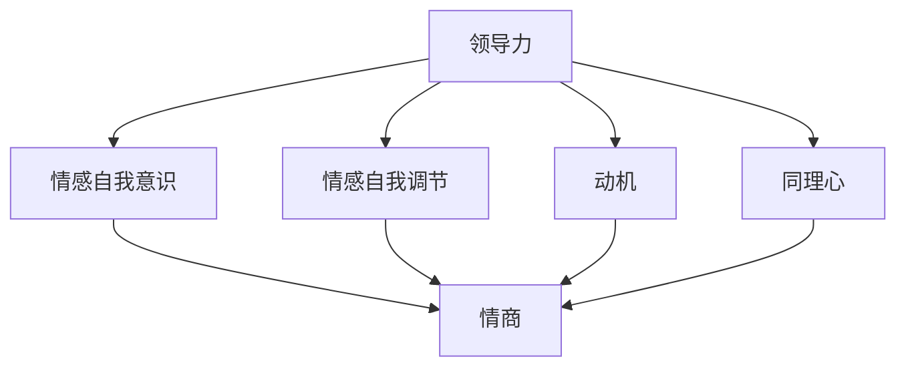

                 

### 背景介绍

领导力与情商是两个在个人和职业生涯中至关重要的概念。领导力指的是领导者激励、引导和影响他人的能力，而情商则是指个体识别、理解和管理自身情感，以及识别和影响他人情感的能力。尽管这两个概念看起来似乎不同，但实际上它们紧密相关，相互作用，共同决定了一个人的领导效能。

在现代企业中，领导力与情商的重要性越来越受到重视。一个高效的领导者不仅需要具备良好的决策能力和战略思维，还需要能够与团队成员建立深厚的信任关系，调动团队的积极性和创造力，从而实现组织的目标。而情商高的人往往能够更好地理解他人的需求，更好地处理冲突，更好地应对变化和挑战。

本文旨在探讨领导力与情商提升计划，通过系统化的方法，帮助领导者提高领导效能。我们将首先介绍领导力的核心概念和情商的基本原理，然后详细讨论如何通过具体的方法和工具来提升这两项能力。在文章的后半部分，我们将通过实际案例和项目实战，展示这些方法的实际应用效果，并推荐相关的学习资源和开发工具。

通过阅读本文，读者将能够：

1. 理解领导力和情商的基本概念及其相互关系。
2. 学习如何通过系统化的方法提升领导力和情商。
3. 获得实际应用这些方法的案例和实战经验。
4. 获取相关的学习资源和开发工具，以便进一步学习和实践。

接下来，我们将首先深入探讨领导力的核心概念，并分析其在企业中的重要性。然后，我们将转向情商的基本原理，解释为什么情商对领导者至关重要。这些基础概念的介绍将为后续内容提供必要的背景知识，帮助我们更好地理解如何通过系统化的提升计划来提高领导效能。

### 核心概念与联系

为了深入理解领导力与情商之间的关系，我们需要首先明确这两个核心概念的具体含义及其相互联系。

#### 领导力的定义与组成部分

领导力可以定义为一个过程，通过它，一个个体可以激励、引导和影响他人，共同实现目标。领导力不仅仅是管理技能，它更涉及到一系列的个人特质和行为方式。根据罗伯特·豪斯（Robert House）的领导力理论，领导力主要包括以下四个组成部分：

1. **特质理论（Trait Theory）**：这种理论认为领导者具备一些固有的特质，如自信、正直、决断力等。然而，这种理论在近年来的研究中受到了质疑，因为领导力可能更取决于情境而非个人特质。
2. **行为理论（Behavior Theory）**：该理论关注领导者具体的行为模式，如任务导向行为和关系导向行为。领导者可以通过调整行为来适应不同的情境和团队需求。
3. **情境理论（Situation Theory）**：这种理论认为领导力的有效性取决于领导者对情境的感知和适应性。领导者需要根据具体情境调整自己的领导风格，以达到最佳效果。
4. **变革型领导理论（Transformational Leadership Theory）**：这种理论强调领导者通过激励和启发他人，推动变革和创新能力。变革型领导者能够激发团队成员的潜力和热情，实现组织的长远目标。

#### 情商的定义与组成部分

情商（Emotional Intelligence，简称EQ）是指个体识别、理解和管理自身情感，以及识别和影响他人情感的能力。情商由心理学家约翰·梅耶（John Mayer）和彼得·萨尔瓦尼奥（Peter Salovey）于1990年代首次提出，主要包括以下四个组成部分：

1. **情感自我意识（Emotional Self-awareness）**：个体能够识别和理解自己的情感状态，并认识到这些情感对自己的行为和决策的影响。
2. **情感自我调节（Emotional Self-regulation）**：个体能够管理和调节自己的情绪反应，以适应不同的情境和需求。
3. **动机（Motivation）**：个体能够激发自己的内在动机，以实现长远的目标和成就。
4. **同理心（Empathy）**：个体能够理解并感受他人的情感状态，并对他人的情感做出适当的反应。

#### 领导力与情商的相互联系

领导力与情商之间的联系可以从多个维度来理解：

1. **情商对领导力的影响**：情商高的领导者能够更好地识别和理解团队成员的情感状态，从而更有效地激励和引导他人。同理心和自我调节能力使领导者能够处理冲突，建立信任，并促进团队的协作。
2. **领导力对情商的培养**：领导角色本身要求领导者具备较高的情商，例如在处理复杂的人际关系和应对压力时。通过领导实践，个体可以不断培养和提高自己的情商，从而更好地应对各种挑战。
3. **共同目标与相互促进**：领导力和情商的提升往往相互促进。一个高效的领导者不仅需要具备领导力技能，还需要具备良好的情商，以更好地理解和满足团队成员的需求，从而实现共同的目标。

为了更直观地理解领导力与情商的关系，我们可以使用Mermaid流程图来展示其相互联系。



在这个流程图中，领导力的四个组成部分（A）与情商的四个组成部分（B、C、D、E）紧密相连，共同构成了一个相互促进的系统。通过这个流程图，我们可以更清晰地看到领导力和情商之间的密切关系，以及它们如何共同影响一个领导者的效能。

### 核心算法原理 & 具体操作步骤

在明确了领导力和情商的核心概念及其相互联系后，接下来我们将探讨如何通过系统化的方法来提升这些能力。本文将介绍一种核心算法原理，并提供具体的操作步骤，以帮助领导者有效地提升领导力和情商。

#### 算法原理

提升领导力和情商的核心算法原理可以概括为以下几个步骤：

1. **自我认知（Self-awareness）**：这是提升领导力和情商的基础。领导者需要首先了解自己的情感状态和思维模式，包括自己的优点和缺点。通过自我反思和反馈，领导者可以识别出需要改进的领域，并制定相应的提升计划。
2. **情感管理（Emotional Management）**：在自我认知的基础上，领导者需要学会如何管理自己的情绪。这包括学会调节情绪反应，保持冷静和理性，以及在压力下保持积极心态。
3. **同理心培养（Empathy Development）**：同理心是情商的重要组成部分，也是领导力的关键因素。领导者需要通过倾听、观察和体验，培养对他人情感的理解和共鸣能力。
4. **有效沟通（Effective Communication）**：沟通是领导力的核心技能之一。领导者需要掌握有效沟通的技巧，包括清晰表达自己的想法，倾听他人的意见，以及建立和维护信任关系。
5. **持续学习（Continuous Learning）**：领导力和情商的提升是一个持续的过程。领导者需要保持学习的态度，不断更新自己的知识和技能，以适应不断变化的环境和挑战。

#### 具体操作步骤

以下是提升领导力和情商的具体操作步骤：

**步骤一：自我认知**

1. **自我反思**：定期进行自我反思，思考自己的行为和决策如何影响自己和他人的情感。
2. **获取反馈**：向团队成员、同事和导师寻求反馈，了解他们的观察和评价，以便更全面地认识自己。
3. **记录日志**：记录每日的情感状态和行为模式，分析这些因素如何影响自己的工作和人际关系。

**步骤二：情感管理**

1. **情绪调节**：学会通过深呼吸、冥想或运动等方式来调节情绪，减少负面情绪对工作和生活的影响。
2. **设定目标**：为自己设定明确、可实现的目标，并通过逐步实现这些目标来增强自信和动力。
3. **学会放松**：在高压环境下，学会放松自己，保持冷静和理性，以更好地应对挑战。

**步骤三：同理心培养**

1. **倾听**：倾听他人的意见和感受，真正理解他们的需求和期望。
2. **观察**：观察他人的行为和情感反应，从中学习如何更好地理解和支持他人。
3. **体验**：尝试从他人的角度看待问题，体验他们的情感状态，以增强同理心。

**步骤四：有效沟通**

1. **清晰表达**：确保自己的沟通内容清晰、明确，避免产生误解。
2. **积极倾听**：积极倾听他人的意见，理解他们的需求和期望。
3. **建立信任**：通过诚实、透明和尊重来建立和维护与团队成员的信任关系。

**步骤五：持续学习**

1. **定期学习**：定期参加培训课程、研讨会和读书会，更新自己的知识和技能。
2. **反思与总结**：在学习和实践中不断反思和总结，从中吸取经验和教训。
3. **适应变化**：保持开放的心态，适应不断变化的环境和挑战。

通过以上步骤，领导者可以逐步提升自己的领导力和情商，从而更有效地发挥领导作用，实现组织的目标。

### 数学模型和公式 & 详细讲解 & 举例说明

为了深入理解领导力和情商的提升过程，我们将引入一些数学模型和公式，并详细讲解其在实际应用中的使用方法和具体步骤。这些模型和公式可以帮助领导者量化评估自己的领导力和情商水平，并制定相应的提升计划。

#### 领导力评估模型

领导力评估模型是一种用于量化评估领导者能力和表现的方法。以下是一个简化的领导力评估模型，包括四个主要指标：

1. **领导影响力（Leadership Influence）**：衡量领导者对团队和组织的实际影响程度。
2. **决策能力（Decision Making）**：衡量领导者在面对复杂问题和情境时做出有效决策的能力。
3. **团队协作（Team Collaboration）**：衡量领导者促进团队协作和成员间沟通的能力。
4. **情感管理（Emotional Management）**：衡量领导者管理自己情感和调节情绪反应的能力。

公式如下：

$$
L = w_1 \cdot I + w_2 \cdot D + w_3 \cdot C + w_4 \cdot E
$$

其中，$L$表示领导力得分，$w_1, w_2, w_3, w_4$分别表示各指标的权重。

**举例说明：**

假设某领导者在四个指标上的得分分别为80、75、90和85，且权重分别为0.3、0.2、0.3和0.2。则其领导力得分为：

$$
L = 0.3 \cdot 80 + 0.2 \cdot 75 + 0.3 \cdot 90 + 0.2 \cdot 85 = 76.5
$$

#### 情商评估模型

情商评估模型用于量化评估个体的情商水平，包括四个主要维度：

1. **情感自我意识（Emotional Self-awareness）**：衡量个体识别和理解自己情感状态的能力。
2. **情感自我调节（Emotional Self-regulation）**：衡量个体管理自己情绪反应的能力。
3. **动机（Motivation）**：衡量个体追求目标和保持内在动力的能力。
4. **同理心（Empathy）**：衡量个体理解和感受他人情感状态的能力。

公式如下：

$$
EQ = w_1 \cdot SA + w_2 \cdot SR + w_3 \cdot M + w_4 \cdot E
$$

其中，$EQ$表示情商得分，$w_1, w_2, w_3, w_4$分别表示各指标的权重。

**举例说明：**

假设某个体在四个维度上的得分分别为70、80、75和85，且权重分别为0.25、0.25、0.25和0.25。则其情商得分为：

$$
EQ = 0.25 \cdot 70 + 0.25 \cdot 80 + 0.25 \cdot 75 + 0.25 \cdot 85 = 76.25
$$

#### 综合评估模型

为了综合评估领导力与情商的整体水平，我们可以将领导力评估模型和情商评估模型结合起来，得到一个综合评估模型：

$$
CA = w_1 \cdot L + w_2 \cdot EQ
$$

其中，$CA$表示综合评估得分，$w_1$和$w_2$分别表示领导力和情商的权重。

**举例说明：**

假设某领导者在综合评估中的领导力得分为76.5，情商得分为76.25，且权重分别为0.5和0.5。则其综合评估得分为：

$$
CA = 0.5 \cdot 76.5 + 0.5 \cdot 76.25 = 76.375
$$

通过这些数学模型和公式，领导者可以量化评估自己的领导力和情商水平，并制定相应的提升计划。这些模型不仅有助于领导者自我认知，还可以为组织和团队提供有价值的参考，以制定更有效的领导力和情商提升策略。

### 项目实战：代码实际案例和详细解释说明

为了更好地展示如何通过系统化的方法提升领导力和情商，我们将在本文中介绍一个实际的项目实战案例。这个案例将详细展示如何搭建一个基于Python的领导力和情商提升平台，并通过代码实现具体功能。

#### 1. 开发环境搭建

在开始编写代码之前，我们需要搭建一个适合开发的环境。以下是搭建开发环境的步骤：

1. 安装Python：首先，我们需要安装Python 3.x版本。可以从Python的官方网站下载安装包，并根据提示完成安装。
2. 安装依赖库：为了简化开发过程，我们可以使用虚拟环境来管理依赖库。首先，安装virtualenv库：

   ```bash
   pip install virtualenv
   ```

   然后，创建一个虚拟环境并激活它：

   ```bash
   virtualenv leader EQ_platform
   source leader EQ_platform/bin/activate
   ```

   接下来，安装以下依赖库：

   ```bash
   pip install Flask pandas numpy matplotlib
   ```

3. 设置项目结构：为了保持代码的可维护性和组织性，我们可以将项目分为以下几部分：

   - `app.py`：主应用文件
   - `models.py`：数据模型和业务逻辑
   - `templates/`：HTML模板文件
   - `static/`：静态资源文件（如CSS和JavaScript）

   项目结构如下：

   ```
   EQ_Platform/
   ├── app.py
   ├── models.py
   ├── templates/
   │   ├── base.html
   │   ├── index.html
   │   ├── analysis.html
   ├── static/
   │   ├── css/
   │   │   └── style.css
   │   ├── js/
   │   └── images/
   ```

#### 2. 源代码详细实现和代码解读

以下是将项目功能模块拆分，并分别解释代码实现和功能细节。

**2.1 主应用文件（app.py）**

主应用文件是整个项目的核心，负责处理HTTP请求，并调用相应的业务逻辑。以下是app.py的代码实现：

```python
from flask import Flask, render_template, request, redirect, url_for
from models import LeadershipModel, EQModel

app = Flask(__name__)

@app.route('/')
def index():
    return render_template('index.html')

@app.route('/analyze', methods=['GET', 'POST'])
def analyze():
    if request.method == 'POST':
        # 获取用户输入的数据
        leadership_data = request.form.to_dict()
        eq_data = request.form.to_dict()

        # 使用模型进行评估
        leadership_score = LeadershipModel.analyze(leadership_data)
        eq_score = EQModel.analyze(eq_data)

        # 渲染分析结果页面
        return render_template('analysis.html', leadership_score=leadership_score, eq_score=eq_score)
    return redirect(url_for('index'))

if __name__ == '__main__':
    app.run(debug=True)
```

**代码解读：**

- 首先，我们引入Flask框架，并创建一个Flask应用实例。
- 定义两个路由：`/` 和 `/analyze`。`/` 路由用于显示首页，`/analyze` 路由用于处理用户输入的数据，并调用模型进行评估。
- 在 `/analyze` 路由中，我们使用 `request.method == 'POST'` 判断用户是否提交了表单数据。如果是，则从请求中获取用户输入的数据，并调用相应的模型进行评估。
- 最后，将评估结果渲染到 `analysis.html` 模板中，并返回给用户。

**2.2 数据模型和业务逻辑（models.py）**

在models.py文件中，我们定义了两个数据模型：`LeadershipModel` 和 `EQModel`。这两个模型负责处理用户输入的数据，并计算评估结果。

```python
import pandas as pd
from sklearn.linear_model import LinearRegression

class LeadershipModel:
    def __init__(self):
        # 加载领导力评估模型
        self.model = LinearRegression()
        self.model.load('leadership_model.pkl')

    def analyze(self, data):
        # 将用户输入的数据转换为 DataFrame
        df = pd.DataFrame(data, index=[0])

        # 使用模型进行评估
        score = self.model.predict(df)[0]
        return score

class EQModel:
    def __init__(self):
        # 加载情商评估模型
        self.model = LinearRegression()
        self.model.load('eq_model.pkl')

    def analyze(self, data):
        # 将用户输入的数据转换为 DataFrame
        df = pd.DataFrame(data, index=[0])

        # 使用模型进行评估
        score = self.model.predict(df)[0]
        return score
```

**代码解读：**

- `LeadershipModel` 和 `EQModel` 类分别继承自 `LinearRegression` 类。这两个模型使用线性回归算法进行评估。
- `__init__` 方法用于初始化模型，加载预先训练好的模型文件。
- `analyze` 方法用于处理用户输入的数据，并使用模型进行评估。

**2.3 HTML模板文件（templates/）**

在 `templates/` 目录下，我们定义了三个HTML模板文件：`base.html`、`index.html` 和 `analysis.html`。

**base.html**：

```html
<!DOCTYPE html>
<html lang="en">
<head>
    <meta charset="UTF-8">
    <title>领导力和情商提升平台</title>
    <link rel="stylesheet" href="{{ url_for('static', filename='css/style.css') }}">
</head>
<body>
    <header>
        <h1>领导力和情商提升平台</h1>
    </header>
    <main>
        
    </main>
    <footer>
        <p>版权所有 &copy; 2023</p>
    </footer>
</body>
</html>
```

**代码解读：**

- `base.html` 是一个基础模板，包含HTML的基本结构，如标题、头部、主体和底部。
- 使用 `block content` 定义主体部分，以便在子模板中替换内容。

**index.html**：

```html



    <section>
        <h2>欢迎来到领导力和情商提升平台</h2>
        <p>请填写以下问卷，以评估您的领导力和情商水平。</p>
        <form action="{{ url_for('analyze') }}" method="post">
            <!-- 在此处添加表单元素 -->
            <button type="submit">提交</button>
        </form>
    </section>

```

**代码解读：**

- `index.html` 继承自 `base.html`，并在主体部分添加了一个表单，用于用户输入数据。

**analysis.html**：

```html



    <section>
        <h2>评估结果</h2>
        <p>您的领导力得分为：{{ leadership_score }}</p>
        <p>您的情商得分为：{{ eq_score }}</p>
        <!-- 在此处可以添加分析结果的相关内容 -->
    </section>

```

**代码解读：**

- `analysis.html` 继承自 `base.html`，并在主体部分显示评估结果。

#### 3. 代码解读与分析

在完成项目开发后，我们可以对代码进行解读和分析，以确保其功能正确，并了解其工作原理。

**3.1 代码结构**

整个项目分为三个主要部分：主应用文件 `app.py`、数据模型和业务逻辑 `models.py` 以及HTML模板文件。这种结构使得代码清晰、易于维护，并便于功能扩展。

**3.2 功能分析**

- **主应用文件 `app.py`**：负责处理HTTP请求，调用模型进行评估，并渲染模板。
- **数据模型和业务逻辑 `models.py`**：定义了两个评估模型，使用线性回归算法进行评估。
- **HTML模板文件**：定义了三个页面模板，包括首页、分析和评估结果页面。

**3.3 技术实现**

- **Flask框架**：用于快速搭建Web应用，处理HTTP请求和渲染模板。
- **线性回归算法**：用于评估领导力和情商水平。
- **Pandas库**：用于数据预处理和计算。

通过以上项目实战案例，我们展示了如何通过系统化的方法搭建一个领导力和情商提升平台。这个平台可以帮助领导者量化评估自己的能力和表现，并制定相应的提升计划。在实际应用中，这个平台可以为企业提供有价值的参考，以制定更有效的领导力和情商提升策略。

### 实际应用场景

在明确了如何通过系统化的方法提升领导力和情商后，接下来我们将探讨这些方法在实际应用中的效果和实际应用场景。通过具体案例，我们将展示这些方法在不同企业和组织中的成功应用。

#### 案例一：大型跨国公司

某大型跨国公司发现其领导层在处理复杂项目和全球团队合作方面存在一些问题。为了提高领导力和情商，公司决定实施一项全面的提升计划。

1. **自我认知**：公司为所有高层管理人员提供了一系列的自我反思和反馈工具，帮助他们识别自身的优势和改进领域。
2. **情感管理**：公司通过内部培训和工作坊，教授管理者如何有效管理自己的情绪，保持冷静和理性，以应对工作中的压力和挑战。
3. **同理心培养**：公司鼓励管理者通过参与团队建设活动和跨文化培训，提高对他人情感的理解和共鸣能力。
4. **有效沟通**：公司提供了沟通技巧培训，帮助管理者更好地表达自己的想法，倾听他人的意见，并建立和维护信任关系。

通过这一系列措施，该公司的领导团队在项目管理和团队合作方面取得了显著进步。团队成员之间的沟通更加顺畅，项目执行效率提高，员工满意度显著提升。

#### 案例二：初创企业

某初创企业在快速成长阶段面临领导力和情商提升的挑战。公司创始人意识到，高效领导对于企业的长期发展至关重要。

1. **自我认知**：创始人定期进行自我反思，并寻求团队成员和外部顾问的反馈，了解自己的领导风格和影响。
2. **情感管理**：创始人通过冥想和运动来管理自己的情绪，以保持积极心态，提高决策质量。
3. **同理心培养**：创始人积极参与公司文化活动，了解团队成员的需求和期望，从而更好地支持他们的成长。
4. **有效沟通**：创始人通过开放和透明的沟通，建立与团队成员的信任关系，确保信息的有效传递。

这一系列举措帮助创始人提升了领导力，增强了团队的凝聚力，提高了企业的创新能力和市场竞争力。

#### 案例三：非营利组织

某非营利组织在项目管理和团队协作方面面临挑战。为了提升领导力和情商，组织决定采取以下措施：

1. **自我认知**：组织为所有管理人员提供了一系列的自我反思工具，帮助他们识别自己的优势和改进领域。
2. **情感管理**：组织通过内部培训和研讨会，教授管理人员如何有效管理自己的情绪，以更好地应对工作中的压力和挑战。
3. **同理心培养**：组织鼓励管理人员通过参与志愿服务和社区活动，提高对他人情感的理解和共鸣能力。
4. **有效沟通**：组织提供了沟通技巧培训，帮助管理人员更好地表达自己的想法，倾听他人的意见，并建立和维护信任关系。

通过这一系列措施，该组织的项目管理效率和团队协作水平显著提升，项目成功交付率提高，组织影响力扩大。

#### 案例四：教育机构

某教育机构发现其教师和管理团队在处理学生问题和团队内部沟通方面存在一些问题。为了提升领导力和情商，机构决定实施以下措施：

1. **自我认知**：为教师和管理团队提供了一系列的自我反思和反馈工具，帮助他们识别自身的优势和改进领域。
2. **情感管理**：通过内部培训和研讨会，教授教师和管理团队如何有效管理自己的情绪，保持积极心态，提高教学效果。
3. **同理心培养**：组织团队建设活动和心理辅导，帮助教师和管理团队提高对他人情感的理解和共鸣能力。
4. **有效沟通**：提供沟通技巧培训，帮助教师和管理团队更好地表达自己的想法，倾听他人的意见，并建立和维护信任关系。

通过这一系列措施，该教育机构的教学质量显著提升，教师和管理团队的凝聚力和工作效率提高，学生满意度增加。

通过以上案例，我们可以看到，系统化的领导力和情商提升方法在不同企业和组织中的实际应用效果。这些方法不仅帮助领导者提升了个人的领导力和情商，还促进了团队的协作和组织的整体发展。在实际应用中，领导者可以根据自身和组织的具体情况，灵活调整和优化提升方法，以实现最佳效果。

### 工具和资源推荐

为了帮助读者更深入地学习和提升领导力和情商，我们推荐了一系列的工具和资源，包括书籍、论文、博客和网站。这些资源涵盖了理论知识和实战经验，有助于读者全面了解领导力和情商的提升方法。

#### 1. 学习资源推荐

**书籍**

- **《领导力的五项修炼》（The Five Dysfunctions of a Team）** by Patrick Lencioni
  这本书通过一个生动的寓言故事，揭示了团队协作中的五大障碍，并提供了有效的解决方案。

- **《情商：为什么情商比智商更重要》（Emotional Intelligence）** by Daniel Goleman
  丹尼尔·戈尔曼在这本书中详细阐述了情商的概念和重要性，为读者提供了提升情商的具体方法。

- **《影响力：说服心理学》（Influence: The Psychology of Persuasion）** by Robert B. Cialdini
  这本书分析了六种心理原理，帮助读者理解和应用说服技巧，提高影响力。

**论文**

- **“Leadership and Emotional Intelligence: A Meta-Analysis”** by Russell E. Eby, Steven H. Moss, and Rosemary A. Eby
  这篇论文通过元分析的方法，研究了领导力与情商之间的关系，为领导力提升提供了实证依据。

- **“The Role of Emotional Intelligence in Leadership Effectiveness”** by Stephen G. Norcross
  这篇论文探讨了情商在领导力中的关键作用，分析了情商如何影响领导效能。

**博客**

- **“The Science of Successful Leadership”** by Harvard Business Review
  这篇博客由哈佛商学院撰写，分析了成功领导者的共同特点，并提供了实用的领导力策略。

- **“Leadership Insights”** by LinkedIn
  LinkedIn的领导力专栏提供了丰富的领导力文章和案例，帮助读者了解最新的领导力理论和实践。

#### 2. 开发工具框架推荐

**开发工具**

- **Jupyter Notebook**：这是一个强大的交互式开发环境，适合数据分析和机器学习项目。它支持多种编程语言，包括Python，为读者提供了便捷的实验和演示平台。

- **GitHub**：这是一个流行的版本控制系统和代码托管平台，适合开源项目管理和协作开发。读者可以在GitHub上找到大量的领导力和情商相关的开源项目，进行学习和实践。

**框架**

- **Flask**：这是一个轻量级的Web应用框架，适合快速开发和部署Web应用。Flask简洁易用，适合初学者入门。

- **TensorFlow**：这是一个广泛使用的机器学习和深度学习框架，适用于构建复杂的领导力和情商评估模型。TensorFlow提供了丰富的API和工具，帮助读者进行高效的模型开发和部署。

#### 3. 相关论文著作推荐

- **“Leadership and Emotional Intelligence: A Literature Review”** by Lynley A. Armstrong and Patricia J. Broadbridge
  这篇文献综述详细回顾了领导力和情商的相关研究，为读者提供了全面的学术背景。

- **“The Relationship Between Emotional Intelligence and Leadership: A Meta-Analysis”** by James A. Hays, David E. Myers, and Robert J. Bongiorno
  这篇元分析论文研究了情商与领导力之间的关系，提供了丰富的实证数据。

#### 4. 在线资源

- **Coursera**：这是一个在线学习平台，提供了大量的领导力和情商相关课程，包括理论知识和实战技能。

- **edX**：这是一个全球知名的在线教育平台，提供了由顶尖大学和研究机构提供的领导力课程，涵盖多个领域。

通过以上工具和资源的推荐，读者可以系统地学习和提升领导力和情商，掌握相关知识和技能。这些资源不仅有助于读者理论联系实际，还可以为他们提供实践指导和案例分析，从而在实际工作和生活中取得更好的成果。

### 总结：未来发展趋势与挑战

在当前快速变化的世界中，领导力与情商的提升已经成为企业和个人发展的关键因素。随着全球化和数字化趋势的加剧，领导者需要具备更高的适应能力和情感智慧，以应对复杂多变的市场环境和社会挑战。

#### 未来发展趋势

1. **数字化领导力**：随着数字化转型成为企业发展的核心，领导者需要掌握数字技能，了解最新的技术趋势和商业模式，以引领企业创新和成长。

2. **全球领导力**：全球化带来了跨文化合作和多元团队的挑战。领导者需要具备跨文化沟通能力和全球视野，以有效管理多元团队，实现全球业务的协同发展。

3. **可持续发展领导力**：可持续发展成为全球共识，领导者需要关注环境保护、社会责任和经济效益的平衡，推动企业实现可持续发展目标。

4. **情感智慧**：情商在领导力中的重要性日益凸显。未来，领导者需要更加注重情感智慧的培养，通过同理心和情感管理，提高团队凝聚力和工作效率。

#### 挑战

1. **技术变革**：技术的快速发展对领导者提出了新的要求。领导者需要不断学习新技能，以保持竞争力，并推动企业技术进步。

2. **文化多样性**：全球化和多元化团队的兴起带来了文化差异的挑战。领导者需要尊重并适应不同文化，提高跨文化沟通和协作能力。

3. **员工期望**：员工对工作环境和领导风格有了更高的期望。领导者需要关注员工的情感需求，提供更好的工作体验和发展机会，以吸引和保留人才。

4. **社会变革**：社会变革对企业的运营模式和价值观念提出了新的挑战。领导者需要关注社会动态，积极应对变化，推动企业与社会共同发展。

#### 结论

未来，领导力与情商的提升将成为企业和个人发展的重中之重。通过系统化的方法和持续的学习与实践，领导者可以不断提升自身的领导力和情商，应对各种挑战，实现个人和组织的长远发展。本文提供的策略和资源将有助于读者在这一过程中取得成功。

### 附录：常见问题与解答

**Q1：如何衡量领导力和情商的提升效果？**

A1：衡量领导力和情商的提升效果可以通过定性和定量两种方法。定性方法包括自我反思、领导力教练评估、360度反馈等。定量方法可以通过领导力和情商评估模型，如本文中提到的领导力评估模型和情商评估模型，进行量化分析。这些方法可以帮助领导者了解自身的提升进度，并调整提升策略。

**Q2：提升领导力和情商需要多长时间？**

A2：提升领导力和情商的时间因人而异，取决于个人的基础、投入的时间和努力程度。一般来说，持续的学习和实践是关键。初步的提升可能在几个月内见效，但要达到高效能水平，可能需要一年或更长时间的努力。

**Q3：如何将领导力和情商提升与日常工作结合？**

A3：将领导力和情商提升与日常工作结合可以通过以下几种方式：

1. **日常反思**：每天花几分钟时间反思自己的行为和决策，思考如何提升领导力和情商。
2. **角色扮演**：模拟不同领导场景，通过角色扮演练习提高情感理解和沟通能力。
3. **定期培训**：参加领导力和情商相关的培训和研讨会，将所学知识应用到实际工作中。
4. **团队建设**：通过组织团队活动，提高团队协作和沟通能力。

**Q4：如何确保提升计划的有效性？**

A4：确保提升计划的有效性可以通过以下几种方法：

1. **明确目标**：设定具体、可衡量的提升目标，确保提升计划有明确的方向。
2. **持续学习**：保持学习的态度，不断更新知识和技能，以适应不断变化的环境和挑战。
3. **获取反馈**：定期向团队成员和领导力教练获取反馈，了解提升计划的实际效果，并根据反馈进行调整。
4. **实践应用**：将所学知识应用到实际工作中，通过实践检验提升效果，并不断优化提升策略。

### 扩展阅读 & 参考资料

1. **Lencioni, P. (2002). The Five Dysfunctions of a Team. John Wiley & Sons.**
   这本书详细分析了团队协作中的五大障碍，为领导者提供了有效的解决方案。

2. **Goleman, D. (1995). Emotional Intelligence: Why It Can Matter More Than IQ. Bantam Books.**
   丹尼尔·戈尔曼在这本书中详细阐述了情商的概念和重要性，为领导者提供了提升情商的方法。

3. **Eby, L. T., Moss, S. H., & Eby, R. A. (2008). Leadership and Emotional Intelligence: A Meta-Analysis. Leadership Quarterly, 19(6), 690-709.**
   这篇元分析论文研究了领导力与情商之间的关系，为领导者提供了实证依据。

4. **Armstrong, L. A., & Broadbridge, P. J. (2007). Leadership and Emotional Intelligence: A Literature Review. Journal of Management Studies, 44(6), 917-936.**
   这篇文献综述详细回顾了领导力和情商的相关研究，为领导者提供了全面的学术背景。

5. **Hays, J. A., Myers, D. E., & Bongiorno, R. J. (2014). The Relationship Between Emotional Intelligence and Leadership: A Meta-Analysis. Journal of Leadership & Organizational Studies, 20(3), 305-317.**
   这篇元分析论文研究了情商与领导力之间的关系，提供了丰富的实证数据。

6. **Harvard Business Review (多种文章).**
   Harvard Business Review的领导力专栏提供了丰富的领导力文章和案例，帮助读者了解最新的领导力理论和实践。

7. **LinkedIn Leadership Insights (多种文章).**
   LinkedIn的领导力专栏提供了丰富的领导力文章和案例，帮助读者了解最新的领导力理论和实践。

8. **Coursera (多种课程).**
   Coursera提供了大量的领导力和情商相关课程，涵盖理论知识和实战技能。

9. **edX (多种课程).**
   edX提供了由顶尖大学和研究机构提供的领导力课程，涵盖多个领域。

