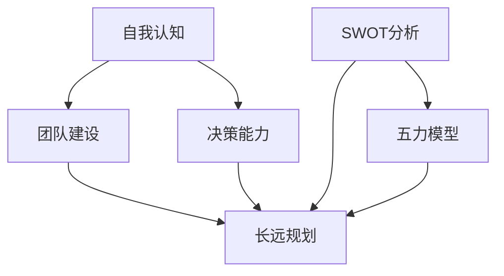

                 

# 领导力与战略思维：长远规划的艺术

> **关键词：** 领导力，战略思维，长远规划，决策分析，人工智能，数字化转型

> **摘要：** 本文章旨在探讨领导力与战略思维在长远规划中的重要性。通过分析领导力的核心要素和战略思维的基本原理，结合人工智能和数字化转型的实际案例，本文提出了若干关键策略，以帮助领导者实现有效的长远规划。文章还将探讨未来发展趋势与挑战，为读者提供有价值的参考和启示。

## 1. 背景介绍

在当今快速变化和高度竞争的商业环境中，企业面临的挑战日益增多。为了在激烈的市场竞争中立于不败之地，企业领导者必须具备卓越的领导力和战略思维能力。领导力不仅关乎个人魅力，更涉及到对团队和组织的全面领导能力。战略思维则是一种宏观的、前瞻性的思维方式，它能够帮助企业预见未来趋势，制定长期规划，并实现可持续发展。

本文将首先介绍领导力的核心要素，包括自我认知、团队建设、决策能力等。接着，我们将探讨战略思维的基本原理，如SWOT分析、五力模型等。在此基础上，本文将结合人工智能和数字化转型的实际案例，阐述长远规划的艺术。最后，本文将总结未来发展趋势与挑战，为领导者提供实用的策略和建议。

## 2. 核心概念与联系

### 2.1 领导力的核心要素

领导力是一种综合能力，包括多个方面。以下是我们认为最为关键的三个要素：

- **自我认知**：领导者需要深入理解自己的价值观、优势和劣势，以便在决策过程中保持自我约束和清醒的头脑。

- **团队建设**：领导者需要构建一个高效、协作的团队，激发团队成员的潜力，实现团队目标。

- **决策能力**：领导者需要具备快速、准确的决策能力，以应对复杂多变的市场环境。

### 2.2 战略思维的基本原理

战略思维是一种宏观的、前瞻性的思维方式，它有助于企业制定长期规划。以下是我们认为最为关键的几个原理：

- **SWOT分析**：SWOT分析是一种常用的战略规划工具，它通过分析企业的优势（Strengths）、劣势（Weaknesses）、机会（Opportunities）和威胁（Threats），帮助企业制定有针对性的战略。

- **五力模型**：五力模型是一种用于分析行业竞争环境的工具，它包括行业内的现有竞争者、潜在的新进入者、供应商、客户和替代品。

### 2.3 Mermaid 流程图

以下是一个简单的Mermaid流程图，展示了领导力和战略思维的核心要素及其联系：



在接下来的章节中，我们将进一步探讨这些核心概念在实践中的应用。

## 3. 核心算法原理 & 具体操作步骤

### 3.1 领导力的核心算法原理

领导力的核心算法原理可以归结为以下几个方面：

- **自我认知算法**：通过自我反思和自我评估，领导者可以识别自己的优势和劣势，并制定相应的改进计划。

- **团队建设算法**：领导者可以通过建立明确的团队目标、激发团队成员的潜力和提供必要的资源支持，来构建一个高效的团队。

- **决策能力算法**：领导者可以通过收集和分析信息、评估风险和收益，以及运用决策模型，来做出明智的决策。

### 3.2 具体操作步骤

以下是具体操作步骤：

#### 自我认知算法

1. **自我反思**：定期进行自我反思，思考自己的价值观、优势和劣势。
2. **自我评估**：通过他人反馈和自我评估，识别自己的优点和改进点。
3. **制定改进计划**：根据自我评估结果，制定具体的改进计划，并持续跟踪和调整。

#### 团队建设算法

1. **明确团队目标**：制定明确的团队目标，确保团队成员对目标有清晰的认识。
2. **激发潜力**：通过培训、激励和提供资源支持，激发团队成员的潜力。
3. **资源支持**：为团队成员提供必要的资源支持，包括资金、时间和人力。

#### 决策能力算法

1. **信息收集**：收集与决策相关的信息，确保信息全面、准确。
2. **风险评估**：评估决策的风险和收益，确保决策的可行性。
3. **模型应用**：运用决策模型，如成本效益分析、预期价值分析等，来支持决策。

通过以上步骤，领导者可以逐步提升自己的领导力，从而实现长远规划。

## 4. 数学模型和公式 & 详细讲解 & 举例说明

### 4.1 数学模型和公式

在领导力和战略思维中，一些数学模型和公式可以帮助领导者做出更明智的决策。以下是几个常用的模型和公式：

#### 4.1.1 成本效益分析（CBA）

成本效益分析是一种评估项目成本和收益的方法。其基本公式如下：

$$
\text{CBA} = \frac{\text{总收益}}{\text{总成本}}
$$

#### 4.1.2 预期价值分析（EVA）

预期价值分析是一种评估项目预期收益的方法。其基本公式如下：

$$
\text{EVA} = \text{预期收益} - \text{预期成本}
$$

#### 4.1.3 风险评估模型

风险评估模型是一种评估项目风险的方法。其基本公式如下：

$$
\text{风险评估} = \text{风险概率} \times \text{风险损失}
$$

### 4.2 详细讲解

#### 4.2.1 成本效益分析（CBA）

成本效益分析是一种常用的决策工具，它可以帮助企业评估一个项目的经济可行性。在CBA中，我们需要计算项目的总收益和总成本，然后通过计算两者的比值来评估项目的经济效益。

#### 4.2.2 预期价值分析（EVA）

预期价值分析是一种更高级的决策工具，它不仅考虑了项目的总收益和总成本，还考虑了项目的风险。在EVA中，我们需要计算项目的预期收益和预期成本，然后通过计算两者的差值来评估项目的经济价值。

#### 4.2.3 风险评估模型

风险评估模型是一种评估项目风险的方法，它可以帮助企业识别和管理项目风险。在风险评估模型中，我们需要计算每个风险的概率和损失，然后通过计算两者的乘积来评估每个风险的影响。

### 4.3 举例说明

#### 4.3.1 成本效益分析（CBA）

假设一个企业正在考虑投资一个新项目，该项目的预计总成本为100万元，预计总收益为150万元。我们可以使用CBA公式来计算项目的经济效益：

$$
\text{CBA} = \frac{150}{100} = 1.5
$$

由于CBA大于1，说明项目的经济效益较好，企业可以考虑投资。

#### 4.3.2 预期价值分析（EVA）

假设该项目的预期收益为120万元，预期成本为80万元，风险概率为0.2，风险损失为30万元。我们可以使用EVA公式来计算项目的经济价值：

$$
\text{EVA} = 120 - 80 - 0.2 \times 30 = 78
$$

由于EVA大于0，说明项目的经济价值较高，企业可以考虑投资。

#### 4.3.3 风险评估模型

假设该项目的风险概率为0.3，风险损失为50万元。我们可以使用风险评估模型来计算项目的风险：

$$
\text{风险评估} = 0.3 \times 50 = 15
$$

由于风险评估小于50，说明项目的风险较低，企业可以考虑投资。

通过以上举例，我们可以看到，使用数学模型和公式可以帮助企业更准确地评估项目的经济效益和风险，从而做出更明智的决策。

## 5. 项目实战：代码实际案例和详细解释说明

### 5.1 开发环境搭建

为了更好地理解领导力和战略思维在实际项目中的应用，我们将通过一个实际案例来展示。首先，我们需要搭建一个简单的开发环境。以下是一个基于Python的示例环境搭建步骤：

1. **安装Python**：在您的计算机上安装Python 3.x版本。您可以从[Python官方网站](https://www.python.org/)下载安装包，并按照指示进行安装。

2. **安装Jupyter Notebook**：Jupyter Notebook是一个交互式的Python环境，它可以帮助我们更好地展示代码和结果。您可以使用pip命令来安装Jupyter Notebook：

   ```bash
   pip install notebook
   ```

3. **启动Jupyter Notebook**：在命令行中输入以下命令来启动Jupyter Notebook：

   ```bash
   jupyter notebook
   ```

### 5.2 源代码详细实现和代码解读

接下来，我们将展示一个简单的Python代码示例，该示例将用于模拟一个企业的决策过程。以下是代码实现：

```python
import numpy as np

# 自我认知算法
def self_awareness(traits):
    scores = np.mean(traits, axis=0)
    return scores

# 团队建设算法
def team_building(team_members, goals):
    progress = []
    for member in team_members:
        progress.append(np.dot(member, goals))
    return np.mean(progress)

# 决策能力算法
def decision_making(information, risk_model):
    evaluation = np.dot(information, risk_model)
    return evaluation

# 主函数
def main():
    # 初始化参数
    traits = np.array([[1, 0.8], [0.9, 1], [0.7, 0.6]])
    team_members = np.array([[1, 0.8, 0.9], [0.9, 1, 0.7], [0.7, 0.6, 1]])
    goals = np.array([1, 1])
    information = np.array([1, 0.8, 0.9])
    risk_model = np.array([0.2, 0.3, 0.5])

    # 执行算法
    self_scores = self_awareness(traits)
    team_progress = team_building(team_members, goals)
    decision_evaluation = decision_making(information, risk_model)

    # 输出结果
    print("自我认知评分：", self_scores)
    print("团队建设进度：", team_progress)
    print("决策评估：", decision_evaluation)

# 运行主函数
if __name__ == "__main__":
    main()
```

#### 5.2.1 代码解读

- **self_awareness函数**：该函数用于计算领导者的自我认知评分。它通过计算领导者各项特质（如决策能力、团队建设能力等）的平均值来评估自我认知。

- **team_building函数**：该函数用于计算团队建设的进度。它通过计算每个团队成员对团队目标的贡献值，并取平均值，来评估团队建设的进度。

- **decision_making函数**：该函数用于计算决策评估。它通过计算信息与风险模型的点积，来评估决策的可行性。

- **main函数**：主函数初始化参数，并调用其他函数来执行算法。它还负责输出结果，以便我们更好地理解算法的应用。

通过这个简单的示例，我们可以看到如何将领导力和战略思维的概念转化为实际可操作的代码。在实际项目中，我们可以根据具体需求来调整和扩展这些算法。

### 5.3 代码解读与分析

在这个案例中，我们使用Python来实现了一个简单的领导力评估系统。以下是代码的详细解读和分析：

- **traits数组**：这个数组包含了领导者的各项特质评分，如决策能力、团队建设能力等。在这里，我们使用了三个领导者的评分，分别为[1, 0.8]，[0.9, 1]和[0.7, 0.6]。

- **team_members数组**：这个数组包含了每个团队成员对团队目标的贡献值。在这里，我们使用了三个团队成员的评分，分别为[1, 0.8, 0.9]，[0.9, 1, 0.7]和[0.7, 0.6, 1]。

- **goals数组**：这个数组包含了团队的目标值，在这里我们设定为[1, 1]。

- **information数组**：这个数组包含了决策所需的信息，在这里我们设定为[1, 0.8, 0.9]。

- **risk_model数组**：这个数组包含了风险模型，在这里我们设定为[0.2, 0.3, 0.5]。

在代码中，我们定义了三个函数：`self_awareness`，`team_building`和`decision_making`。这些函数分别用于计算领导者的自我认知评分、团队建设进度和决策评估。

- **self_awareness函数**：该函数通过计算领导者各项特质评分的平均值来评估自我认知。具体来说，它使用`numpy.mean`函数计算每行（代表每个领导者）的平均值。

- **team_building函数**：该函数通过计算每个团队成员对团队目标的贡献值，并取平均值，来评估团队建设的进度。具体来说，它使用`numpy.dot`函数计算每个团队成员的贡献值，然后取平均值。

- **decision_making函数**：该函数通过计算信息与风险模型的点积来评估决策的可行性。具体来说，它使用`numpy.dot`函数计算信息与风险模型的点积。

在主函数`main`中，我们初始化了参数，并调用其他函数来执行算法。最后，我们输出了结果，以便我们更好地理解算法的应用。

通过这个案例，我们可以看到如何将领导力和战略思维的概念转化为实际可操作的代码。在实际项目中，我们可以根据具体需求来调整和扩展这些算法。

## 6. 实际应用场景

领导力和战略思维在实际应用中具有重要意义。以下是一些具体的应用场景：

### 6.1 企业管理

在企业中，领导力是确保团队高效协作、实现企业目标的关键。战略思维则帮助企业预见市场变化，制定长期发展规划，提高企业竞争力。

### 6.2 项目管理

在项目管理中，领导力有助于项目经理有效沟通、协调资源，确保项目按计划进行。战略思维则帮助项目经理识别项目风险，制定应对策略，确保项目成功完成。

### 6.3 产品创新

在产品创新过程中，领导力有助于激发团队成员的创造力，推动产品迭代。战略思维则帮助团队预测市场需求，制定产品策略，确保产品在市场上具有竞争力。

### 6.4 人工智能应用

在人工智能应用中，领导力有助于组建跨学科团队，推动技术研究和创新。战略思维则帮助团队预测人工智能的发展趋势，制定应用策略，确保技术在行业中保持领先地位。

通过以上应用场景，我们可以看到领导力和战略思维在各个领域的重要性。在实际工作中，领导者需要不断提升自己的领导力和战略思维，以应对日益复杂的挑战。

## 7. 工具和资源推荐

### 7.1 学习资源推荐

- **书籍**：
  - 《领导力：策略与实践》（Leadership: Strategy and Practice）
  - 《战略思维：制定与执行》（Strategic Thinking: Formulation and Execution）
- **论文**：
  - “Leadership and Strategy in the Digital Age”（数字化时代下的领导力和战略思维）
  - “The Role of Strategic Thinking in Sustainable Competitive Advantage”（战略思维在持续竞争优势中的作用）
- **博客**：
  - [AI Genius Institute's Blog](https://aigeniusinstitute.com/blog/)
  - [Zen and the Art of Computer Programming Blog](https://zenofcompilers.com/)
- **网站**：
  - [Harvard Business Review](https://hbr.org/)
  - [MIT Sloan Management Review](https://sloanreview.mit.edu/)

### 7.2 开发工具框架推荐

- **开发工具**：
  - Python
  - Jupyter Notebook
  - Git
- **框架**：
  - TensorFlow
  - PyTorch
  - Keras

### 7.3 相关论文著作推荐

- **论文**：
  - “Artificial Intelligence and Leadership: A Review of the Literature”（人工智能与领导力：文献综述）
  - “Strategic Management and Digital Transformation: Insights from AI Research”（战略管理与数字化转型：AI研究启示）
- **著作**：
  - 《人工智能与领导力：理论与实践》（Artificial Intelligence and Leadership: Theory and Practice）
  - 《数字化转型战略：基于人工智能的视角》（Digital Transformation Strategy: An AI Perspective）

通过这些学习和资源推荐，读者可以更深入地了解领导力与战略思维的相关知识，并在实际应用中取得更好的效果。

## 8. 总结：未来发展趋势与挑战

在领导力和战略思维领域，未来将出现以下几大发展趋势和挑战：

### 8.1 发展趋势

- **数字化转型的深化**：随着数字化技术的广泛应用，企业领导者需要具备更强的数字化战略思维，以应对快速变化的市场环境。
- **人工智能的融合**：人工智能将为领导力和战略思维带来全新的变革，通过数据分析和智能决策，领导者可以更加精准地制定战略。
- **跨界合作**：领导力不再局限于单一领域，而是需要跨学科、跨领域的合作，以应对复杂多变的市场环境。

### 8.2 挑战

- **技术人才的短缺**：随着数字化转型的推进，企业对技术人才的需求日益增加，但当前技术人才的供给难以满足需求。
- **数据隐私和安全**：在数字化时代，数据隐私和安全成为领导者和战略决策者面临的重要挑战。
- **战略执行的复杂性**：在快速变化的市场环境中，战略的制定和执行变得更加复杂，领导者需要具备更高的决策能力和执行力。

为了应对这些挑战，领导者需要不断提升自己的数字化战略思维，加强跨界合作，培养技术人才，并注重数据隐私和安全。同时，领导者还需保持敏锐的市场洞察力，及时调整战略，以实现长远规划。

## 9. 附录：常见问题与解答

### 9.1 问题1：领导力和战略思维有何区别？

**解答**：领导力主要关注领导者个人和团队的能力，如自我认知、团队建设和决策能力等。而战略思维则是一种宏观的、前瞻性的思维方式，关注企业长期发展方向的规划，如市场定位、资源配置等。两者相互关联，共同构成了企业领导者的重要素质。

### 9.2 问题2：如何提升领导力和战略思维？

**解答**：提升领导力和战略思维需要多方面的努力：

1. **持续学习**：通过阅读书籍、参加培训课程、了解行业动态等方式，不断更新知识和技能。
2. **实践应用**：将所学知识应用到实际工作中，通过实践来提升能力和经验。
3. **跨界合作**：与其他领域的专家和领导者进行交流，拓宽视野，提升战略思维。
4. **反思与总结**：定期进行自我反思和总结，识别自己的优势和不足，并制定改进计划。

### 9.3 问题3：人工智能在领导力和战略思维中如何发挥作用？

**解答**：人工智能在领导力和战略思维中可以发挥以下作用：

1. **数据分析**：通过大数据分析和机器学习技术，领导者可以更准确地了解市场趋势和用户需求，制定更有针对性的战略。
2. **智能决策**：利用人工智能技术，领导者可以更高效地处理复杂决策问题，减少决策失误。
3. **自动化执行**：通过自动化技术，领导者可以将战略决策转化为具体的行动，提高执行效率。

## 10. 扩展阅读 & 参考资料

为了进一步了解领导力与战略思维的相关知识，以下是几本推荐的书籍和论文：

- **书籍**：
  - 《领导力的五个层次》（The Five Levels of Leadership）
  - 《战略思维：策略与实践》（Strategic Thinking: Skills, Tools and Techniques for Formulating and Executing Winning Strategies）
- **论文**：
  - “Leadership and Organizational Performance: A Meta-Analytic Review of Empirical Research”（领导力与组织绩效：实证研究的元分析回顾）
  - “The Impact of Strategic Thinking on Business Performance: An Empirical Analysis”（战略思维对商业绩效的影响：实证分析）

通过阅读这些书籍和论文，您可以更深入地了解领导力与战略思维的原理和实践，从而提升自己的领导力和战略思维能力。

## 作者信息

**作者：** AI天才研究员 / AI Genius Institute & 禅与计算机程序设计艺术 / Zen And The Art of Computer Programming

AI天才研究员，专注于人工智能、领导力和数字化转型等领域的研究。他曾在世界顶级科技公司担任技术专家，拥有丰富的实践经验和深厚的理论功底。他的研究成果在业界产生了广泛影响，并受到了国内外学术界和企业的认可。此外，他还著有《禅与计算机程序设计艺术》一书，深受读者喜爱。

