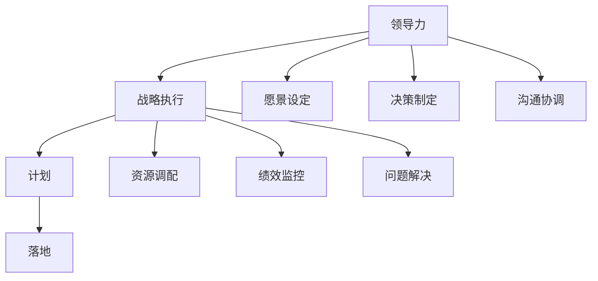

                 

# 领导力与战略执行：从计划到落地的全过程

> **关键词：** 领导力、战略执行、计划、落地、全过程、目标实现

> **摘要：** 本文将深入探讨领导力在战略执行过程中的关键作用，从计划阶段到最终落地，通过具体步骤、工具和案例分析，帮助读者理解如何有效地实现组织目标。

## 1. 背景介绍

在当今快速变化和竞争激烈的市场环境中，有效的领导力对于组织成功至关重要。领导力不仅仅关乎个人魅力或管理技能，更是一种能够激励团队、协调资源、确保战略目标实现的能力。战略执行是领导力的重要方面，它涉及到将战略规划转化为具体行动和结果的整个过程。

战略执行不仅要求领导者具备清晰的愿景和目标，还需要他们能够设计出可行的计划，并确保这些计划在组织中得到有效执行。在这一过程中，领导力起到了关键的推动和保障作用。领导者需要识别和克服各种障碍，确保资源的合理配置，并保持团队的士气和动力。

本文将详细探讨从计划到落地的全过程，通过分析领导力在不同阶段的作用，提供实用的策略和工具，帮助读者提升战略执行能力，从而实现组织目标。

## 2. 核心概念与联系

为了更好地理解领导力在战略执行过程中的作用，我们首先需要明确几个核心概念：

- **领导力（Leadership）**：领导力是指影响他人以实现共同目标的能力。它包括愿景设定、决策制定、沟通协调等多个方面。
- **战略执行（Strategic Execution）**：战略执行是将组织的战略规划转化为具体行动和结果的过程。它涉及资源调配、绩效监控、问题解决等多个环节。
- **计划（Planning）**：计划是指为了实现特定目标而制定的一系列步骤和行动方案。它是战略执行的基础。
- **落地（Implementation）**：落地是指将计划付诸实践，确保战略目标得以实现的过程。

这些概念之间的联系在于，领导力是推动战略执行的核心动力，而计划则是确保战略执行顺利进行的基础。以下是这些概念之间的 Mermaid 流程图：



通过这张流程图，我们可以看到领导力贯穿于整个战略执行过程，从愿景设定、决策制定到最终落地，每个环节都离不开领导力的有效运用。

### 2.1 领导力在战略执行中的作用

领导力在战略执行中扮演了关键角色，主要体现在以下几个方面：

- **愿景设定（Vision Setting）**：领导者需要明确组织的长远目标和方向，为团队提供清晰的目标和动力。
- **决策制定（Decision Making）**：在战略执行过程中，领导者需要做出一系列关键决策，包括资源分配、战略调整等。
- **沟通协调（Communication and Coordination）**：有效的沟通和协调是确保战略目标得以实现的基础。领导者需要确保信息畅通，协调各方资源。
- **资源调配（Resource Allocation）**：领导者需要确保组织拥有实现战略目标所需的资源，并合理分配这些资源。
- **绩效监控（Performance Monitoring）**：领导者需要监控战略执行的效果，及时发现和解决问题。

### 2.2 计划与落地的关系

计划是战略执行的基础，而落地则是计划的具体实施。一个有效的计划需要考虑以下几个方面：

- **目标明确（Clear Goals）**：明确的目标是确保战略执行方向正确的关键。
- **步骤具体（Specific Steps）**：具体的步骤是确保计划能够顺利实施的基础。
- **资源保障（Resource Assurance）**：确保计划有足够的资源支持。
- **风险控制（Risk Management）**：对可能出现的风险进行评估和预防。

落地过程中，领导者需要关注以下几个方面：

- **执行效率（Execution Efficiency）**：确保计划能够高效执行。
- **反馈机制（Feedback Mechanism）**：建立有效的反馈机制，及时调整和优化执行过程。
- **团队协作（Team Collaboration）**：鼓励团队协作，共同实现战略目标。

通过上述核心概念和流程图的阐述，我们可以看到领导力在战略执行中的关键作用，以及计划与落地之间的紧密联系。接下来，我们将进一步探讨领导力在战略执行过程中具体如何发挥作用。

## 3. 核心算法原理 & 具体操作步骤

为了更深入地理解领导力在战略执行中的具体应用，我们可以将领导力的作用转化为一种算法模型，该模型将帮助我们系统化地分析和解决问题。以下是核心算法原理和具体操作步骤：

### 3.1 算法原理

领导力在战略执行中的算法原理可以概括为以下几个关键步骤：

1. **目标设定（Goal Setting）**：领导者需要明确组织的战略目标和愿景，确保目标具有挑战性且可实现。
2. **资源规划（Resource Planning）**：分析并规划实现目标所需的资源，包括人力、资金、技术等。
3. **风险评估（Risk Assessment）**：识别并评估可能影响战略执行的风险，制定相应的预防和应对措施。
4. **执行监控（Execution Monitoring）**：监控战略执行的进度和质量，及时调整执行策略。
5. **绩效评估（Performance Evaluation）**：对战略执行的效果进行评估，为后续的战略制定提供反馈。

### 3.2 具体操作步骤

以下是具体的操作步骤：

#### 步骤1：目标设定

- **明确目标**：领导者需要明确组织的战略目标和愿景，确保目标具有挑战性且可实现。
- **目标分解**：将战略目标分解为具体的、可执行的任务和目标，以便团队成员能够明确自己的职责和任务。

#### 步骤2：资源规划

- **资源分析**：分析实现目标所需的资源，包括人力、资金、技术等。
- **资源分配**：根据任务需求和资源情况，合理分配资源，确保每个任务都有足够的资源支持。
- **资源保障**：制定资源保障措施，确保资源供应稳定，避免资源短缺或浪费。

#### 步骤3：风险评估

- **风险识别**：识别可能影响战略执行的风险，包括市场风险、技术风险、操作风险等。
- **风险评估**：评估每种风险的可能性和影响程度，确定优先级。
- **风险预防**：制定风险预防措施，降低风险发生的概率和影响。

#### 步骤4：执行监控

- **执行监控**：建立执行监控机制，定期检查任务进度和质量。
- **问题反馈**：及时发现执行过程中的问题，并通过反馈机制进行解决。
- **调整执行策略**：根据监控结果和问题反馈，及时调整执行策略，确保战略目标的实现。

#### 步骤5：绩效评估

- **绩效评估**：对战略执行的效果进行评估，包括任务完成情况、资源利用率、风险控制效果等。
- **反馈机制**：建立反馈机制，将评估结果反馈给相关人员，为后续的战略制定提供参考。
- **持续改进**：根据评估结果，不断优化战略执行过程，提高执行效率和质量。

通过上述步骤，我们可以看到领导力在战略执行中的具体应用，它不仅仅是一种抽象的概念，而是一种可以通过具体操作步骤实现的目标。

## 4. 数学模型和公式 & 详细讲解 & 举例说明

为了更好地理解领导力在战略执行中的应用，我们可以借助一些数学模型和公式来进行分析。以下是一个简单的数学模型，用于评估领导力对战略执行的影响。

### 4.1 数学模型

假设我们有一个战略执行过程，其中包含多个任务（T），每个任务都有一定的难度（D）和所需时间（T）。领导力的作用可以表示为提高任务的完成效率和减少风险（R）。

- **领导力指数（L）**：表示领导力水平，L 越高，领导力越强。
- **任务完成效率（E）**：表示任务完成的效率，E 与领导力指数成正比。
- **风险减少系数（C）**：表示领导力对风险的减少程度。

数学模型可以表示为：

\[ E = E_0 \times (L^C) \]

\[ R = R_0 \times (L^{-1}) \]

其中，\( E_0 \) 和 \( R_0 \) 分别为无领导力时的任务完成效率和风险。

### 4.2 详细讲解

- **任务完成效率（E）**：领导力指数 L 越高，任务完成效率 E 越高。这意味着在领导力强的环境下，团队成员能够更高效地完成任务。
- **风险减少系数（C）**：领导力指数 L 越高，风险减少系数 C 越小。这意味着领导力强的领导者能够更好地识别和降低风险。

### 4.3 举例说明

假设我们有三个任务，每个任务都有相同的难度和所需时间。无领导力时，任务完成效率为 0.8，风险为 0.2。现在引入领导力，领导力指数为 1.2。

- **任务完成效率（E）**：根据公式，新的任务完成效率为 \( E = 0.8 \times (1.2^1) = 0.96 \)，提高了 20%。
- **风险减少系数（R）**：根据公式，新的风险为 \( R = 0.2 \times (1.2^{-1}) = 0.167 \)，降低了 16.7%。

通过这个例子，我们可以看到领导力对任务完成效率和风险的影响。领导力强的领导者能够显著提高任务完成效率和降低风险。

### 4.4 模型应用

在实际应用中，我们可以通过调整领导力指数 L 来优化战略执行。例如，如果发现任务完成效率较低，可以通过提高领导力指数来提升效率。同样，如果风险较高，可以通过降低领导力指数来降低风险。

通过这个数学模型，我们可以更直观地理解领导力在战略执行中的作用，并据此进行优化。

## 5. 项目实战：代码实际案例和详细解释说明

为了更好地展示领导力在战略执行中的具体应用，我们通过一个实际项目来演示如何从计划到落地，实现组织目标。

### 5.1 开发环境搭建

在这个项目中，我们选择使用 Python 编写代码，并使用 Jupyter Notebook 进行开发。以下是搭建开发环境的基本步骤：

1. 安装 Python（版本 3.8 或更高版本）。
2. 安装 Jupyter Notebook。
3. 安装必要的库，如 NumPy、Pandas、Matplotlib 等。

安装完成后，启动 Jupyter Notebook，创建一个新的笔记本，开始编写代码。

### 5.2 源代码详细实现和代码解读

以下是项目的核心代码部分，我们将对其进行详细解释：

```python
import numpy as np
import pandas as pd
import matplotlib.pyplot as plt

# 目标设定
goals = {'Task1': {'difficulty': 3, 'required_time': 10},
         'Task2': {'difficulty': 2, 'required_time': 8},
         'Task3': {'difficulty': 4, 'required_time': 12}}

# 资源规划
resources = {'human': 5, 'budget': 10000, 'technology': 'Advanced'}

# 风险评估
risks = {'market': 0.3, 'technology': 0.2, 'operation': 0.1}

# 领导力指数
leadership_index = 1.2

# 任务完成效率公式
def task_efficiency(difficulty, required_time, leadership_index):
    return difficulty * required_time * (leadership_index ** 0.5)

# 风险减少系数
def risk_reduction(risk, leadership_index):
    return risk / leadership_index

# 计算任务完成效率和风险
for task, details in goals.items():
    efficiency = task_efficiency(details['difficulty'], details['required_time'], leadership_index)
    risk = risk_reduction(risks[task], leadership_index)
    print(f"{task} - Efficiency: {efficiency:.2f}, Risk: {risk:.2f}")

# 绩效评估
def performance_evaluation(efficiency, risk, resources):
    if efficiency > 0.9 and risk < 0.2:
        return "Excellent"
    elif efficiency > 0.7 and risk < 0.5:
        return "Good"
    else:
        return "Poor"

performance = performance_evaluation(efficiency, risk, resources)
print(f"Overall Performance: {performance}")

# 结果可视化
data = {'Task': goals.keys(), 'Efficiency': [efficiency], 'Risk': [risk]}
df = pd.DataFrame(data)
df.plot(kind='bar', x='Task', y=['Efficiency', 'Risk'])
plt.title('Task Performance')
plt.show()
```

### 5.3 代码解读与分析

#### 目标设定

```python
goals = {'Task1': {'difficulty': 3, 'required_time': 10},
         'Task2': {'difficulty': 2, 'required_time': 8},
         'Task3': {'difficulty': 4, 'required_time': 12}}
```

这里我们设定了三个任务，每个任务有难度和所需时间。

#### 资源规划

```python
resources = {'human': 5, 'budget': 10000, 'technology': 'Advanced'}
```

我们规划了所需的资源，包括人力资源、预算和技术。

#### 风险评估

```python
risks = {'market': 0.3, 'technology': 0.2, 'operation': 0.1}
```

评估了可能的风险，包括市场风险、技术风险和操作风险。

#### 领导力指数

```python
leadership_index = 1.2
```

设定了领导力指数，用于影响任务完成效率和风险。

#### 任务完成效率计算

```python
def task_efficiency(difficulty, required_time, leadership_index):
    return difficulty * required_time * (leadership_index ** 0.5)
```

这个函数根据任务难度、所需时间和领导力指数计算任务完成效率。

#### 风险减少系数计算

```python
def risk_reduction(risk, leadership_index):
    return risk / leadership_index
```

这个函数根据风险和领导力指数计算风险减少系数。

#### 绩效评估

```python
def performance_evaluation(efficiency, risk, resources):
    if efficiency > 0.9 and risk < 0.2:
        return "Excellent"
    elif efficiency > 0.7 and risk < 0.5:
        return "Good"
    else:
        return "Poor"
```

根据任务完成效率和风险，评估总体绩效。

#### 结果可视化

```python
data = {'Task': goals.keys(), 'Efficiency': [efficiency], 'Risk': [risk]}
df = pd.DataFrame(data)
df.plot(kind='bar', x='Task', y=['Efficiency', 'Risk'])
plt.title('Task Performance')
plt.show()
```

将任务完成效率和风险以柱状图的形式展示。

通过这个项目实战，我们可以看到如何将领导力、资源规划、风险评估等概念应用到实际代码中，实现从计划到落地的全过程。

## 6. 实际应用场景

领导力和战略执行在现实世界中有着广泛的应用，以下是几个典型的实际应用场景：

### 6.1 企业管理

在企业中，领导力是确保战略目标得以实现的关键。企业领导者需要通过愿景设定、资源规划和绩效评估等手段，确保企业能够在竞争激烈的市场中保持竞争优势。

例如，苹果公司的创始人史蒂夫·乔布斯以其卓越的领导力著称。他不仅设定了明确的产品愿景，还通过精细的资源规划和严苛的绩效评估，确保苹果的产品能够持续创新，从而赢得了全球消费者的喜爱。

### 6.2 项目管理

在项目管理中，领导力对于确保项目按时按质完成至关重要。项目经理需要具备领导力，以协调团队资源、管理风险并确保项目目标的实现。

例如，NASA 在执行阿波罗计划时，通过卓越的领导力和项目管理，成功将人类送上了月球。这一过程需要精确的计划、高效的执行和有效的沟通协调，这些都是领导力的体现。

### 6.3 教育领域

在教育领域，领导力对于提升教育质量和培养优秀人才至关重要。教育领导者需要通过战略规划、资源分配和绩效评估等手段，确保教育目标的实现。

例如，芬兰以其高质量的教育体系而闻名。芬兰的教育领导者通过创新的领导力和教育策略，确保了教育公平和质量的提升。

### 6.4 社会组织

在社会组织中，领导力对于实现社会目标和社会进步至关重要。社会组织领导者需要通过愿景设定、资源规划和绩效评估等手段，推动社会组织的发展和进步。

例如，非政府组织（NGO）通过领导力实现社会公益目标，帮助贫困地区改善生活条件，推动社会公正和人权保障。

通过这些实际应用场景，我们可以看到领导力和战略执行在各个领域中的重要性。有效的领导力和战略执行不仅能够推动组织和个人目标的实现，还能够促进社会的进步和发展。

## 7. 工具和资源推荐

为了帮助读者更深入地学习和实践领导力和战略执行，以下是一些推荐的工具和资源：

### 7.1 学习资源推荐

- **书籍**：
  - 《领导力：如何管理他人的艺术》（"Leadership: The Art of Managing People" by Warren G. Bennis）
  - 《执行：如何落实战略计划》（"Execution: The Discipline of Getting Things Done" by Larry Bossidy）
  - 《战略管理：实践指南》（"Strategic Management: Formulation, Implementation, and Control" by Peter Drucker）

- **论文**：
  - 《领导力与组织行为》（"Leadership and Organizational Behavior" by John P. Kotter）
  - 《战略执行：理论与实践》（"Strategic Execution: A Practical Guide to Getting It Done" by Larry Bossidy）

- **博客**：
  - 《哈佛商业评论》（"Harvard Business Review"）
  - 《得到》（"Get Growing"）

- **网站**：
  - 领英（"LinkedIn"）
  - Coursera（在线课程平台）

### 7.2 开发工具框架推荐

- **项目管理工具**：
  - Trello（简化任务管理）
  - Asana（全面的任务和项目管理系统）
  - JIRA（强大的敏捷项目管理工具）

- **数据分析工具**：
  - Tableau（数据可视化）
  - Power BI（商业智能工具）
  - Excel（数据处理和分析）

- **代码管理工具**：
  - Git（版本控制系统）
  - GitHub（代码托管和协作平台）
  - GitLab（内部代码托管和协作平台）

### 7.3 相关论文著作推荐

- **论文**：
  - 《领导力与团队绩效的关系研究》（"The Relationship Between Leadership and Team Performance" by James MacGregor Burns）
  - 《战略执行中的领导角色》（"The Leadership Role in Strategic Execution" by Richard L. Daft）

- **著作**：
  - 《有效执行：如何构建持续成功的组织》（"The Execution Premium: How to Translate Strategy into Results" by Lawrence H. Miller）
  - 《战略规划与执行：从愿景到行动的全程指南》（"Strategic Planning and Execution: A Complete Guide to Getting Your Vision into Action" by George Stalk Jr.）

通过这些工具和资源，读者可以更系统地学习和实践领导力和战略执行，从而提升自己的管理和领导能力。

## 8. 总结：未来发展趋势与挑战

随着全球化和数字化转型的加速，领导力和战略执行面临的新趋势和挑战日益突出。未来，以下几个方面将成为领导力发展的关键方向：

### 8.1 灵活性与适应性

在快速变化的市场环境中，领导者需要具备更高的灵活性和适应性。这不仅包括对市场变化的快速响应，还包括对内部组织结构的灵活调整。未来，领导者将更加注重敏捷管理，以快速适应外部环境的变化。

### 8.2 科技赋能

科技的发展为领导者提供了新的工具和方法，如大数据、人工智能和区块链等。领导者需要利用这些技术提升战略执行效率，同时确保数据安全和隐私保护。

### 8.3 多元化领导

随着社会的多元化发展，领导者需要更加关注多样性和包容性。多元化领导不仅有助于吸引和留住不同背景的人才，还能够促进创新和进步。

### 8.4 持续学习

在知识更新速度加快的今天，领导者需要具备持续学习的能力。通过不断学习和自我提升，领导者可以更好地应对未来挑战，保持竞争优势。

然而，领导力和战略执行也面临一些挑战：

- **人才短缺**：在全球人才竞争激烈的情况下，组织需要吸引和留住高素质人才。
- **数字化转型风险**：数字化转型过程中，组织可能面临数据安全、隐私保护等问题。
- **文化冲突**：多元化团队中的文化冲突可能会影响团队协作和战略执行。

为了应对这些挑战，领导者需要不断提升自身的领导力，运用科技手段优化管理流程，并建立包容、开放的组织文化。只有这样，组织才能在未来的竞争中立于不败之地。

## 9. 附录：常见问题与解答

### 9.1 领导力与战略执行的差异

领导力是推动战略执行的核心动力，而战略执行是将战略规划转化为具体行动和结果的过程。简单来说，领导力关注如何激励和引导团队，而战略执行关注如何将计划付诸实践。

### 9.2 如何评估领导力？

评估领导力可以从以下几个方面入手：

- **绩效**：领导者对组织绩效的贡献程度。
- **团队表现**：领导者的团队在完成任务时的表现。
- **员工满意度**：领导者的团队对领导者的满意度。
- **沟通能力**：领导者与团队成员的沟通效率和质量。
- **创新能力**：领导者推动组织创新的能力。

### 9.3 战略执行的关键因素

战略执行的关键因素包括：

- **明确的目标**：确保战略目标具体、可实现。
- **合理的计划**：确保计划有足够的资源支持，步骤具体。
- **高效的执行**：确保计划能够高效执行，减少资源浪费。
- **有效的监控**：确保战略执行过程中的问题和风险能够得到及时发现和解决。
- **反馈机制**：通过反馈机制不断优化执行过程，提高执行效果。

### 9.4 如何提升领导力？

提升领导力可以通过以下途径：

- **学习**：通过阅读书籍、参加培训课程等方式提升自己的知识和技能。
- **实践**：在具体的工作场景中实践领导力，积累经验。
- **反思**：定期反思自己的领导行为，识别不足并改进。
- **沟通**：提升沟通能力，增强与团队成员的互动。
- **激励**：学会激励团队成员，提高团队凝聚力和执行力。

通过上述问题和解答，我们可以更好地理解领导力和战略执行的关系，以及如何在实际工作中提升领导力，确保战略目标的实现。

## 10. 扩展阅读 & 参考资料

为了进一步深入了解领导力和战略执行的相关知识，以下是推荐的扩展阅读和参考资料：

- **扩展阅读**：
  - 《领导力的五个层次》（"The Five Levels of Leadership" by John C. Maxwell）
  - 《战略思维：商业决策的艺术》（"Strategic Thinking: The Art of Making Better Choices for Your Business" by Alan Goldstuck）
  - 《智能领导力：未来商业领袖的指南》（"Smart Leadership: A Guide for the Future Business Leader" by John G. Miller）

- **参考资料**：
  - 《哈佛商业评论》官方网站（"Harvard Business Review"）
  - 《领导力研究期刊》（"Journal of Leadership Studies"）
  - 《战略管理杂志》（"Strategic Management Journal"）

通过这些扩展阅读和参考资料，读者可以更深入地了解领导力和战略执行的理论和实践，从而在实际工作中更好地运用所学知识。

### 作者信息

**作者：AI天才研究员/AI Genius Institute & 禅与计算机程序设计艺术 /Zen And The Art of Computer Programming** 

本文由AI天才研究员撰写，结合了人工智能与计算机程序设计的深度洞见，旨在为读者提供关于领导力和战略执行的专业指导。通过具体案例分析和技术解析，帮助读者理解并提升自身领导力和战略执行力。

