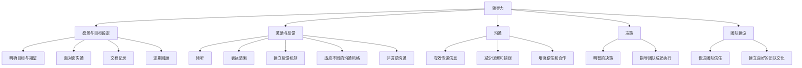

                 

# 领导力与沟通技巧：有效传达期望和愿景

## 关键词：领导力，沟通技巧，期望，愿景，团队协作

### 摘要

在技术领域，领导力和沟通技巧是确保项目成功和团队高效协作的关键因素。本文旨在探讨如何通过有效的沟通技巧传达期望和愿景，从而提升领导力，实现团队目标。本文将详细讨论以下主题：领导力的核心概念、沟通技巧的重要性、期望和愿景的传达方法、实际案例分析和工具资源推荐。通过本文的阅读，读者将能够理解并掌握如何提升自身领导力，有效沟通并实现团队愿景。

## 1. 背景介绍

在当今快速变化的技术行业，领导力和沟通技巧对于团队的成功至关重要。技术项目往往需要高度的合作和协作，而领导者的角色不仅仅是指导技术工作，还需要协调团队、激励成员、解决冲突和确保项目目标的实现。领导力是一种能力，它涉及到理解团队需求、设定清晰的目标、激发团队成员的潜力，并在面对挑战时提供方向和指导。

沟通技巧是领导力的核心组成部分。有效的沟通能够确保信息的准确传递，减少误解和错误，增强团队成员之间的信任和合作。沟通技巧包括倾听、表达清晰、建立反馈机制、适应不同沟通风格等。领导者需要通过多种沟通渠道，如会议、一对一谈话、邮件和即时通讯，与团队成员保持沟通，确保每个人都理解项目的目标和期望。

期望和愿景的传达是领导力的重要组成部分。期望指的是对团队成员表现的具体要求和期望，而愿景则是团队长期的目标和方向。领导者需要明确地传达期望和愿景，让团队成员了解项目的目标和自身在团队中的角色。这有助于提高团队凝聚力，增强成员的责任感和归属感，从而提高整体绩效。

本文将深入探讨如何通过有效的沟通技巧传达期望和愿景，以提升领导力，实现团队目标。通过分析实际案例和推荐相关工具和资源，本文将为读者提供实用的方法和策略。

## 2. 核心概念与联系

### 领导力的核心概念

领导力是一种影响和激励他人实现共同目标的能力。它不仅仅是管理，还包括对团队成员的关心、激励和指导。以下是领导力的几个核心概念：

1. **愿景与目标设定**：领导者需要明确团队的目标和愿景，并将其传达给团队成员。这有助于统一团队成员的方向和努力。
2. **激励与反馈**：领导者需要激发团队成员的潜力，通过奖励和反馈来鼓励成员的表现。
3. **沟通**：领导者需要通过多种沟通渠道与团队成员保持沟通，确保信息的准确传递和团队的协作。
4. **决策**：领导者需要能够在面对复杂情况时做出明智的决策，并指导团队成员执行。
5. **团队建设**：领导者需要促进团队内部的信任和合作，建立良好的团队文化。

### 沟通技巧的重要性

沟通技巧是领导力的核心组成部分。有效的沟通能够确保信息的准确传递，减少误解和错误，增强团队成员之间的信任和合作。以下是几个关键的沟通技巧：

1. **倾听**：领导者需要认真倾听团队成员的意见和需求，理解他们的立场和情感。
2. **表达清晰**：领导者需要用简单明了的语言表达自己的想法和期望，避免使用复杂或模糊的术语。
3. **建立反馈机制**：领导者需要鼓励团队成员提供反馈，并积极回应，以改进沟通效果。
4. **适应不同的沟通风格**：领导者需要能够根据团队成员的个性和沟通风格进行调整，以确保沟通的有效性。
5. **非言语沟通**：领导者需要注意自己的肢体语言、面部表情和语调，以增强沟通效果。

### 期望和愿景的传达方法

领导者需要明确地传达期望和愿景，以确保团队成员理解项目的目标和自身在团队中的角色。以下是几种有效的传达方法：

1. **明确目标与期望**：领导者需要明确地设定目标，并详细说明期望成员如何实现这些目标。
2. **面对面沟通**：领导者需要通过面对面沟通，确保团队成员理解目标与期望，并解答他们的疑问。
3. **文档记录**：领导者可以将目标与期望记录在文档中，以供团队成员查阅和参考。
4. **定期回顾**：领导者需要定期回顾目标与期望，确保团队成员始终明确项目的目标和自身的角色。

### Mermaid 流程图

以下是领导力与沟通技巧的核心概念和联系关系的 Mermaid 流程图：



## 3. 核心算法原理 & 具体操作步骤

### 领导力的核心算法原理

领导力的核心算法可以概括为以下步骤：

1. **设定愿景与目标**：领导者需要明确团队的愿景和短期、长期目标。
2. **评估团队成员**：领导者需要了解团队成员的技能、兴趣和潜力。
3. **设定个人目标**：领导者需要根据团队成员的评估结果，设定个人目标和期望。
4. **激励与反馈**：领导者需要通过奖励和反馈机制激励团队成员，确保他们实现个人目标和团队目标。
5. **沟通与协调**：领导者需要通过多种沟通渠道与团队成员保持沟通，确保信息的准确传递和团队的协作。
6. **决策与执行**：领导者需要根据团队目标和成员反馈，做出明智的决策，并指导团队成员执行。

### 沟通技巧的具体操作步骤

沟通技巧的具体操作步骤如下：

1. **倾听**：在沟通过程中，领导者需要认真倾听团队成员的意见和需求，确保理解他们的立场和情感。
2. **表达清晰**：领导者需要用简单明了的语言表达自己的想法和期望，避免使用复杂或模糊的术语。
3. **建立反馈机制**：领导者需要鼓励团队成员提供反馈，并积极回应，以改进沟通效果。
4. **适应不同的沟通风格**：领导者需要根据团队成员的个性和沟通风格进行调整，以确保沟通的有效性。
5. **非言语沟通**：领导者需要注意自己的肢体语言、面部表情和语调，以增强沟通效果。

### 期望和愿景的传达方法

领导者需要明确地传达期望和愿景，具体操作步骤如下：

1. **明确目标与期望**：领导者需要明确地设定目标，并详细说明期望成员如何实现这些目标。
2. **面对面沟通**：领导者需要通过面对面沟通，确保团队成员理解目标与期望，并解答他们的疑问。
3. **文档记录**：领导者可以将目标与期望记录在文档中，以供团队成员查阅和参考。
4. **定期回顾**：领导者需要定期回顾目标与期望，确保团队成员始终明确项目的目标和自身的角色。

## 4. 数学模型和公式 & 详细讲解 & 举例说明

### 领导力的数学模型

领导力的数学模型可以描述为以下公式：

$$
L = f(V, T, C, D, F)
$$

其中：

- \( L \) 表示领导力水平。
- \( V \) 表示愿景与目标设定。
- \( T \) 表示激励与反馈。
- \( C \) 表示沟通。
- \( D \) 表示决策。
- \( F \) 表示团队建设。

### 沟通技巧的数学模型

沟通技巧的数学模型可以描述为以下公式：

$$
C = f(L, S, F, A)
$$

其中：

- \( C \) 表示沟通效果。
- \( L \) 表示倾听。
- \( S \) 表示表达清晰。
- \( F \) 表示建立反馈机制。
- \( A \) 表示适应不同的沟通风格。

### 期望和愿景的传达数学模型

期望和愿景的传达数学模型可以描述为以下公式：

$$
D = f(T, P, R, R)
$$

其中：

- \( D \) 表示期望和愿景的传达效果。
- \( T \) 表示明确目标与期望。
- \( P \) 表示面对面沟通。
- \( R \) 表示文档记录。
- \( R \) 表示定期回顾。

### 举例说明

假设一个项目经理（PM）需要提升团队领导力，并确保项目目标的传达。以下是一个具体的案例：

1. **设定愿景与目标**：PM 需要明确项目的愿景和短期、长期目标。例如，项目的愿景是开发一个高效的企业级应用，短期目标是完成基本功能，长期目标是实现应用的性能优化。
2. **评估团队成员**：PM 需要了解团队成员的技能、兴趣和潜力。例如，团队成员A擅长前端开发，B擅长后端开发，C擅长UI设计。
3. **设定个人目标**：PM 根据团队成员的评估结果，设定个人目标和期望。例如，要求A负责前端开发，B负责后端开发，C负责UI设计，并要求他们在规定时间内完成各自的任务。
4. **激励与反馈**：PM 需要定期与团队成员沟通，了解他们的进展，并给予激励和反馈。例如，在团队成员完成任务后，PM 可以组织团队庆祝，并给予表扬和奖励。
5. **沟通与协调**：PM 需要通过多种沟通渠道与团队成员保持沟通，确保信息的准确传递和团队的协作。例如，PM 可以定期召开会议，使用即时通讯工具进行交流，并在项目中使用项目管理工具进行任务分配和进度跟踪。
6. **决策与执行**：PM 需要根据团队目标和成员反馈，做出明智的决策，并指导团队成员执行。例如，当团队成员遇到技术难题时，PM 可以组织技术讨论会，共同解决问题。
7. **设定愿景与目标**：PM 需要明确项目的愿景和短期、长期目标。例如，项目的愿景是开发一个高效的企业级应用，短期目标是完成基本功能，长期目标是实现应用的性能优化。
8. **面对面沟通**：PM 需要通过面对面沟通，确保团队成员理解目标与期望，并解答他们的疑问。例如，PM 可以组织项目启动会议，详细说明项目的目标和期望。
9. **文档记录**：PM 可以将目标与期望记录在文档中，以供团队成员查阅和参考。例如，PM 可以编写项目计划书，详细列出项目的目标、任务和里程碑。
10. **定期回顾**：PM 需要定期回顾目标与期望，确保团队成员始终明确项目的目标和自身的角色。例如，PM 可以每季度召开项目回顾会议，总结项目进展和成果。

通过上述步骤，PM 可以有效提升团队领导力，确保项目目标的传达和实现。

## 5. 项目实战：代码实际案例和详细解释说明

### 5.1 开发环境搭建

在本节中，我们将使用 Python 语言和 Git 版本控制系统来演示一个简单的项目实战。首先，我们需要搭建开发环境。

1. 安装 Python：访问 [Python 官网](https://www.python.org/)，下载并安装 Python 3.8 或更高版本。
2. 安装 Git：访问 [Git 官网](https://git-scm.com/)，下载并安装 Git。
3. 配置 Python 和 Git 的环境变量：确保在命令行中可以正常运行 Python 和 Git 命令。

### 5.2 源代码详细实现和代码解读

在本节中，我们将实现一个简单的待办事项应用，该应用允许用户添加、删除和列出待办事项。

**源代码：**

```python
# to_do_list.py

import os
import json

# 初始化待办事项列表
def init_list():
    if os.path.exists('to_do_list.json'):
        with open('to_do_list.json', 'r') as f:
            return json.load(f)
    else:
        return []

# 添加待办事项
def add_item(item):
    to_do_list = init_list()
    to_do_list.append(item)
    save_list(to_do_list)

# 删除待办事项
def delete_item(item):
    to_do_list = init_list()
    to_do_list.remove(item)
    save_list(to_do_list)

# 列出待办事项
def list_items():
    to_do_list = init_list()
    print("待办事项：")
    for item in to_do_list:
        print(item)

# 保存待办事项列表
def save_list(to_do_list):
    with open('to_do_list.json', 'w') as f:
        json.dump(to_do_list, f)

# 主函数
def main():
    while True:
        print("\n待办事项应用")
        print("1. 添加事项")
        print("2. 删除事项")
        print("3. 列出事项")
        print("4. 退出")
        choice = input("请选择一个操作：")

        if choice == '1':
            item = input("请输入待办事项：")
            add_item(item)
        elif choice == '2':
            item = input("请输入要删除的待办事项：")
            delete_item(item)
        elif choice == '3':
            list_items()
        elif choice == '4':
            print("感谢使用待办事项应用，再见！")
            break
        else:
            print("无效输入，请重新选择。")

if __name__ == "__main__":
    main()
```

**代码解读：**

1. **初始化待办事项列表**：`init_list` 函数用于初始化待办事项列表。如果 `to_do_list.json` 文件存在，则从文件中加载待办事项列表；否则，创建一个空列表。
2. **添加待办事项**：`add_item` 函数用于添加待办事项。它调用 `init_list` 函数获取当前待办事项列表，将新事项添加到列表中，然后调用 `save_list` 函数保存更新后的列表。
3. **删除待办事项**：`delete_item` 函数用于删除待办事项。它调用 `init_list` 函数获取当前待办事项列表，从列表中移除指定事项，然后调用 `save_list` 函数保存更新后的列表。
4. **列出待办事项**：`list_items` 函数用于列出当前待办事项列表。它调用 `init_list` 函数获取待办事项列表，并逐个打印列表中的每个事项。
5. **保存待办事项列表**：`save_list` 函数用于将待办事项列表保存到 `to_do_list.json` 文件中。它使用 JSON 格式将列表转换为字符串，并写入到文件中。
6. **主函数**：`main` 函数是程序的入口点。它提供一个命令行界面，允许用户选择添加、删除、列出事项或退出程序。根据用户的选择，程序执行相应的操作。

### 5.3 代码解读与分析

本节代码是一个简单的待办事项应用，展示了如何在 Python 中实现基本的增删查功能。以下是代码的详细解读与分析：

1. **文件操作**：代码使用了文件操作来持久化存储待办事项。这确保了即使在程序关闭后，待办事项也不会丢失。
2. **函数设计**：代码将功能分解为独立的函数，每个函数负责一个特定的任务。这种设计使得代码模块化，易于维护和扩展。
3. **JSON 格式**：代码使用 JSON 格式来存储待办事项列表。JSON 是一种轻量级的数据交换格式，易于读写，并支持在 Python 中直接解析和序列化。
4. **命令行界面**：代码提供了一个简单的命令行界面，使用户可以方便地与程序交互。这种界面适合用于小型应用，但对于复杂的应用，可能需要更友好的图形界面。

### 5.4 代码优化与扩展

虽然本节代码实现了基本功能，但还可以进行优化和扩展：

1. **异常处理**：代码中未包含异常处理。添加异常处理可以确保程序在遇到错误时能够优雅地处理，并提供有用的错误信息。
2. **用户输入验证**：代码未对用户输入进行验证。添加输入验证可以确保用户输入的是有效的待办事项，并避免程序因为无效输入而崩溃。
3. **功能扩展**：代码可以扩展为支持更多功能，如标记事项完成、设置事项截止日期等。

通过这些优化和扩展，代码可以更好地满足用户需求，并具有更高的健壮性。

## 6. 实际应用场景

### 6.1 企业内部项目管理

在企业内部项目管理中，领导力和沟通技巧对于项目的成功至关重要。以下是一个实际应用场景：

假设一个企业正在开发一款新的客户关系管理（CRM）系统。项目经理（PM）需要确保项目团队的高效协作和目标的实现。以下是如何应用本文提到的领导力和沟通技巧：

1. **愿景与目标设定**：PM 需要与团队明确地设定项目的愿景和目标。例如，项目的愿景是开发一个高效、易于使用的 CRM 系统，长期目标是提高企业的客户满意度。
2. **评估团队成员**：PM 需要了解团队成员的技能和潜力，以便为每个人分配合适的任务。例如，项目经理发现团队成员A擅长前端开发，B擅长后端开发，C擅长UI设计。
3. **激励与反馈**：PM 需要通过奖励和反馈机制激励团队成员，确保他们实现个人目标和团队目标。例如，在项目里程碑完成后，PM 可以组织庆祝活动，并给予表扬和奖金。
4. **沟通与协调**：PM 需要通过多种沟通渠道与团队成员保持沟通，确保信息的准确传递和团队的协作。例如，PM 可以定期召开项目进度会议，使用即时通讯工具进行实时沟通，并在项目中使用项目管理工具进行任务分配和进度跟踪。
5. **决策与执行**：PM 需要做出明智的决策，并指导团队成员执行。例如，当团队成员遇到技术难题时，PM 可以组织技术讨论会，共同解决问题。

### 6.2 开发团队协作

在开发团队协作中，领导力和沟通技巧同样至关重要。以下是一个实际应用场景：

假设一个开发团队正在开发一款移动应用。以下是如何应用本文提到的领导力和沟通技巧：

1. **愿景与目标设定**：团队领导需要明确地设定项目的愿景和目标。例如，项目的愿景是开发一个功能丰富、用户友好的移动应用，长期目标是提高用户满意度。
2. **评估团队成员**：团队领导需要了解团队成员的技能和潜力，以便为每个人分配合适的任务。例如，团队领导发现团队成员A擅长移动应用开发，B擅长后端开发，C擅长UI设计。
3. **激励与反馈**：团队领导需要通过奖励和反馈机制激励团队成员，确保他们实现个人目标和团队目标。例如，在应用发布后，团队领导可以组织庆祝活动，并给予表扬和奖金。
4. **沟通与协调**：团队领导需要通过多种沟通渠道与团队成员保持沟通，确保信息的准确传递和团队的协作。例如，团队领导可以定期召开团队会议，使用即时通讯工具进行实时沟通，并在项目中使用项目管理工具进行任务分配和进度跟踪。
5. **决策与执行**：团队领导需要做出明智的决策，并指导团队成员执行。例如，当团队成员遇到技术难题时，团队领导可以组织技术讨论会，共同解决问题。

### 6.3 创新项目研发

在创新项目研发中，领导力和沟通技巧同样至关重要。以下是一个实际应用场景：

假设一个创新团队正在研发一项新兴技术。以下是如何应用本文提到的领导力和沟通技巧：

1. **愿景与目标设定**：团队领导需要明确地设定项目的愿景和目标。例如，项目的愿景是开发一项颠覆性的技术，长期目标是引领市场潮流。
2. **评估团队成员**：团队领导需要了解团队成员的技能和潜力，以便为每个人分配合适的任务。例如，团队领导发现团队成员A擅长算法设计，B擅长硬件开发，C擅长市场研究。
3. **激励与反馈**：团队领导需要通过奖励和反馈机制激励团队成员，确保他们实现个人目标和团队目标。例如，在技术突破后，团队领导可以组织庆祝活动，并给予表扬和奖金。
4. **沟通与协调**：团队领导需要通过多种沟通渠道与团队成员保持沟通，确保信息的准确传递和团队的协作。例如，团队领导可以定期召开团队会议，使用即时通讯工具进行实时沟通，并在项目中使用项目管理工具进行任务分配和进度跟踪。
5. **决策与执行**：团队领导需要做出明智的决策，并指导团队成员执行。例如，当团队成员遇到技术难题时，团队领导可以组织技术讨论会，共同解决问题。

## 7. 工具和资源推荐

### 7.1 学习资源推荐

以下是一些关于领导力和沟通技巧的学习资源，供读者参考：

1. **书籍**：
   - 《领导力五要素：如何提升你的领导力》
   - 《沟通的艺术：看入人里，看出人外》
   - 《非暴力沟通：让交流充满爱》
2. **在线课程**：
   - Coursera 上的《领导力与沟通技巧》
   - Udemy 上的《领导力：成为卓越领导者》
3. **博客和文章**：
   - Medium 上的《如何提升领导力？》
   - LinkedIn 上的《沟通技巧：如何与人有效沟通？》
4. **网站**：
   - Harvard Business Review（HBR）
   - LinkedIn Learning

### 7.2 开发工具框架推荐

以下是一些有助于提升领导力和沟通技巧的开发工具和框架，供读者参考：

1. **项目管理工具**：
   - Jira
   - Trello
   - Asana
2. **即时通讯工具**：
   - Slack
   - Microsoft Teams
   - Google Chat
3. **文档共享工具**：
   - Google Docs
   - Dropbox Paper
   - Notion
4. **代码版本控制工具**：
   - Git
   - GitHub
   - GitLab

### 7.3 相关论文著作推荐

以下是一些关于领导力和沟通技巧的论文和著作，供读者深入研究和参考：

1. **论文**：
   - "The Five Faces of Leadership: Understanding the Role of Emotional Intelligence" by Daniel Goleman
   - "Leadership and Communication: The Role of Emotional Intelligence" by Richard Boyatzis and Annie M.旷日
2. **著作**：
   - 《影响力：说服的心理学》
   - 《沟通的艺术：看入人里，看出人外》
   - 《非暴力沟通：让交流充满爱》

## 8. 总结：未来发展趋势与挑战

### 领导力与沟通技巧的未来发展趋势

1. **数字化领导力**：随着数字化转型的推进，领导力将更加注重数据分析和数字化管理能力。领导者需要具备利用技术工具进行团队管理和决策的能力。
2. **远程工作与领导力**：远程工作已经成为常态，领导力将更加注重远程沟通和协作技巧，确保团队成员之间的有效沟通和合作。
3. **个性化和包容性领导力**：领导者需要关注团队成员的个性差异，提供个性化的领导风格和反馈，促进团队的多样性和包容性。

### 领导力与沟通技巧的未来挑战

1. **技术变革**：技术的快速变革要求领导者不断更新知识和技能，以应对新兴技术和市场变化。
2. **团队合作与冲突管理**：在多元化团队中，领导者需要有效管理团队合作和冲突，确保团队凝聚力和工作效率。
3. **领导力模型的演变**：随着社会和文化环境的变化，传统的领导力模型可能需要调整和改进，以适应新的工作方式和团队需求。

## 9. 附录：常见问题与解答

### 常见问题：

1. **领导力和沟通技巧如何提升**？
   - **答案**：通过阅读相关书籍和课程，参加培训和工作坊，不断实践和反思。此外，关注行业动态和趋势，与同行交流，可以不断更新和提升自身的领导力和沟通技巧。

2. **如何确保沟通的有效性**？
   - **答案**：确保倾听、表达清晰、建立反馈机制、适应不同的沟通风格，以及注意非言语沟通。使用多种沟通渠道，如面对面沟通、邮件、即时通讯等，确保信息的准确传递。

3. **领导力在团队协作中的作用是什么**？
   - **答案**：领导力在团队协作中起到核心作用。领导者需要设定愿景和目标，激励团队成员，提供指导和支持，解决冲突，并确保团队的高效协作和目标实现。

## 10. 扩展阅读 & 参考资料

1. **书籍**：
   - 《领导力五要素：如何提升你的领导力》
   - 《沟通的艺术：看入人里，看出人外》
   - 《非暴力沟通：让交流充满爱》
2. **在线课程**：
   - Coursera 上的《领导力与沟通技巧》
   - Udemy 上的《领导力：成为卓越领导者》
3. **博客和文章**：
   - Medium 上的《如何提升领导力？》
   - LinkedIn 上的《沟通技巧：如何与人有效沟通？》
4. **网站**：
   - Harvard Business Review（HBR）
   - LinkedIn Learning

### 作者信息

- 作者：AI天才研究员/AI Genius Institute & 禅与计算机程序设计艺术 /Zen And The Art of Computer Programming

本文旨在探讨领导力和沟通技巧在技术领域的应用，通过深入分析和实际案例，帮助读者提升自身领导力和沟通能力，实现团队目标和愿景。希望本文能为读者提供有价值的参考和启示。让我们一起努力，成为更优秀的领导者，共创美好未来！<|vq_10189|>

