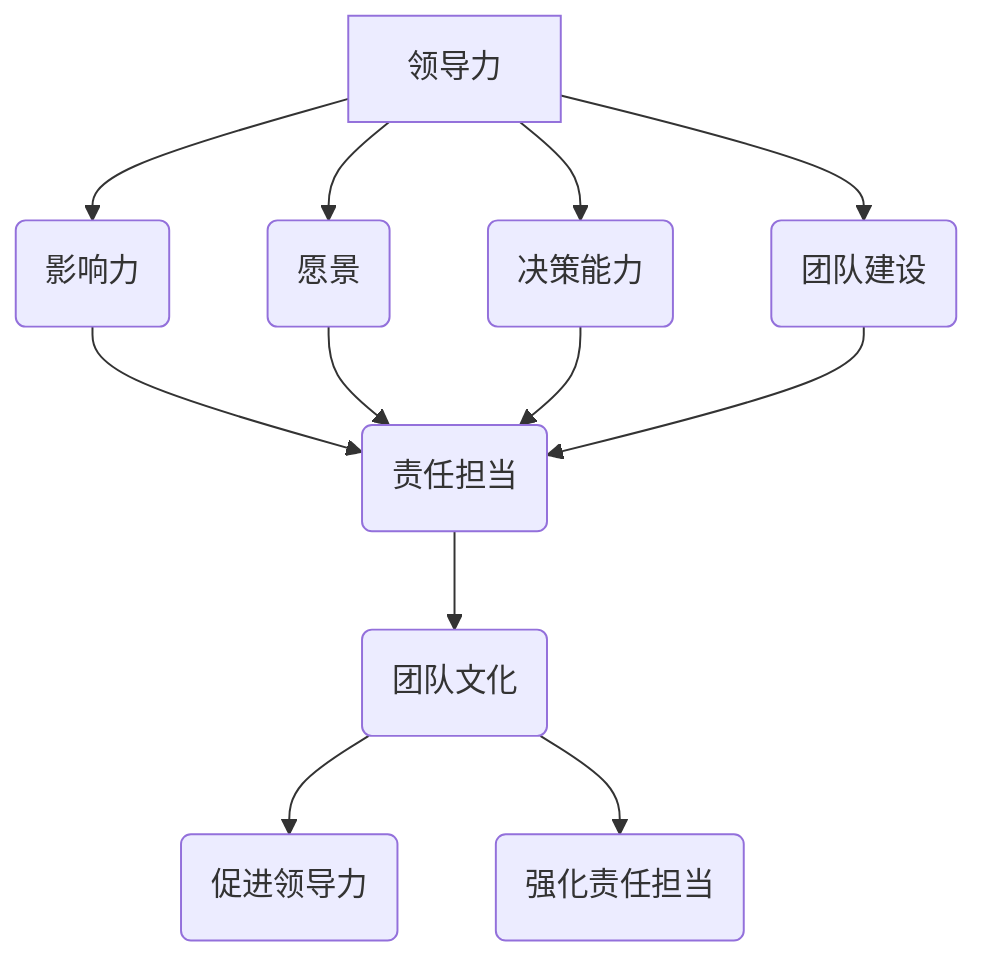

                 

## 1. 背景介绍

在现代企业环境中，领导力和责任担当的重要性越来越受到重视。领导力不仅仅体现在领导者的个人能力上，更体现在他们能否带领团队共同成长，激发团队的潜力，从而实现组织的长远目标。责任担当则是确保团队成员在工作中能够积极主动，共同承担起实现目标的责任。

### 领导力的定义与特征

领导力（Leadership）是指通过影响和激励他人来达成共同目标的能力。一个成功的领导者不仅要有明确的愿景和战略，还要能够有效地传达和实现这一愿景。领导力具有以下特征：

1. **愿景**：领导者需要具备远见，能够描绘出未来的蓝图，并激励团队成员为之努力。
2. **沟通**：优秀的领导者擅长沟通，能够清晰地传达信息，建立信任和合作。
3. **影响力**：领导者通过自身的行为和决策来影响他人，塑造团队的文化和行为模式。
4. **决策能力**：领导者需要在压力下做出明智的决策，并能够承担相应的责任。
5. **变革管理**：领导者在面对组织变革时，能够引导团队适应变革，并从中获益。

### 责任担当的意义

责任担当（Accountability）是指个体对自己行为的负责，确保任务的完成和目标的达成。在团队中，责任担当的重要性体现在以下几个方面：

1. **提高效率**：团队成员明确自己的职责，有助于提高工作效率，减少内耗。
2. **建立信任**：责任担当能够建立团队成员之间的信任，促进团队协作。
3. **激励成员**：明确的责任和后果能够激发团队成员的积极性和进取心。
4. **解决问题**：责任担当能够促使团队成员在面对问题时，主动寻找解决方案，而不是相互推诿。

### 团队文化与责任担当

团队文化是团队共同价值观和行为的体现，它对团队成员的责任担当有着深远的影响。一个具有负责任的团队文化能够：

1. **提升团队凝聚力**：团队成员之间相互信任，共同承担责任，增强了团队的凝聚力。
2. **提高团队绩效**：团队成员明确各自职责，减少了冗余和冲突，提高了团队的整体绩效。
3. **促进个人成长**：在负责任的团队文化中，成员能够通过承担责任来不断提升自己的能力和素质。

### 总结

领导力和责任担当是现代企业成功的关键要素。领导力能够激发团队的潜力，实现组织的长远目标；责任担当则确保团队成员在工作中能够积极主动，共同承担起实现目标的责任。在接下来的章节中，我们将深入探讨如何培养负责任的团队文化，以及这一文化对企业发展的深远影响。

-------------------
## 2. 核心概念与联系

为了深入理解领导力和责任担当在团队文化中的作用，我们需要首先明确几个核心概念，并探讨它们之间的联系。

### 领导力的核心概念

1. **影响力**：领导力本质上是一种影响力，领导者通过个人魅力、专业知识、沟通技巧等方式影响他人。
2. **愿景**：领导者需要具备远见，能够描绘出未来的蓝图，并激励团队成员为之努力。
3. **决策能力**：领导者在面对复杂问题和不确定性时，需要能够做出明智的决策。
4. **团队建设**：领导者不仅要关注团队成员的个人发展，还要构建一个协作高效的团队。

### 责任担当的核心概念

1. **责任感**：个体对自己行为的负责，确保任务的完成和目标的达成。
2. **透明度**：团队成员之间需要保持信息的透明，确保每个人都清楚自己的职责和任务。
3. **后果意识**：团队成员需要意识到自己的行为对团队和组织的后果。

### 领导力与责任担当的联系

领导力与责任担当之间存在着密切的联系。一个成功的领导者不仅需要具备领导力，还需要能够激发团队成员的责任担当。

1. **影响责任担当**：领导者的行为和决策会对团队成员的责任担当产生直接的影响。例如，领导者如果能够在团队中树立榜样，明确责任分工，团队成员更有可能承担起自己的责任。
2. **培养责任担当**：领导者通过培养团队成员的责任感，提高团队的整体责任感。例如，通过设立明确的目标和期望，提供必要的资源和支持，领导者可以帮助团队成员更好地承担起自己的职责。
3. **强化责任担当**：领导者需要建立一套有效的监督和反馈机制，确保团队成员能够履行自己的责任。例如，通过定期的绩效评估和反馈，领导者可以帮助团队成员识别问题，并找到改进的方法。

### 团队文化的联系

团队文化是领导力和责任担当的载体。一个健康的团队文化能够促进领导力和责任担当的发展。

1. **促进领导力**：团队文化能够提供一个良好的环境，让领导者能够发挥自己的影响力，塑造团队的文化和行为模式。
2. **强化责任担当**：团队文化能够增强团队成员的责任感，使他们在工作中更加积极主动。

### Mermaid 流程图

下面是一个简单的 Mermaid 流程图，展示了领导力、责任担当和团队文化之间的联系。



通过这个流程图，我们可以清晰地看到领导力、责任担当和团队文化之间的相互作用和影响。

-------------------
## 3. 核心算法原理 & 具体操作步骤

在探讨如何培养负责任的团队文化时，我们需要一些核心算法原理和具体操作步骤。这些算法和步骤可以帮助我们更系统地理解和实践领导力和责任担当。

### 核心算法原理

1. **领导者塑造算法**：领导者需要通过一系列行为和决策来塑造团队文化，培养成员的责任感。
2. **责任分配算法**：明确团队成员的职责和任务，确保每个人都清楚自己的责任范围。
3. **反馈机制算法**：建立有效的反馈和监督机制，帮助团队成员识别问题，并找到改进的方法。
4. **激励机制算法**：通过奖励和激励来增强团队成员的责任担当。

### 具体操作步骤

1. **明确愿景和目标**：领导者需要明确团队的愿景和目标，并确保每个成员都理解并认同这一愿景。
2. **建立沟通机制**：领导者需要建立有效的沟通机制，确保团队成员能够及时获取信息，了解自己的职责和任务。
3. **设立明确的目标和期望**：领导者需要为团队成员设定明确的目标和期望，确保每个人都清楚自己的责任和任务。
4. **提供必要的资源和支持**：领导者需要为团队成员提供必要的资源和支持，帮助他们更好地履行自己的职责。
5. **建立反馈机制**：领导者需要建立定期的反馈机制，帮助团队成员识别问题，并找到改进的方法。
6. **实施激励机制**：领导者可以通过奖励和激励来增强团队成员的责任担当，激发他们的积极性和创造力。

### 示例

假设我们有一个软件开发团队，团队领导希望培养团队成员的责任感。以下是具体的操作步骤：

1. **明确愿景和目标**：团队领导明确团队的愿景是开发一个高性能的软件产品，并确保每个成员都理解并认同这一愿景。
2. **建立沟通机制**：团队领导建立每周的团队会议，确保每个成员都有机会分享自己的进展和问题。
3. **设立明确的目标和期望**：团队领导为每个成员设定明确的目标和期望，例如每个成员需要在一个月内完成一定的代码开发任务。
4. **提供必要的资源和支持**：团队领导确保每个成员都有足够的开发工具和培训机会，帮助他们更好地完成任务。
5. **建立反馈机制**：团队领导每周进行一次绩效评估，及时了解每个成员的进展和问题，并给出具体的建议和反馈。
6. **实施激励机制**：团队领导根据成员的绩效表现，给予一定的奖励，例如奖金或晋升机会，以激励成员的责任担当。

通过这些具体操作步骤，团队领导可以帮助团队成员明确自己的责任，提高工作效率，培养负责任的团队文化。

-------------------
## 4. 数学模型和公式 & 详细讲解 & 举例说明

在培养负责任的团队文化过程中，我们可以运用一些数学模型和公式来分析和优化团队绩效。以下是一些常用的模型和公式的详细讲解以及具体应用实例。

### 相关度分析模型

一个关键的数学模型是相关度分析，它帮助我们理解团队成员行为与团队绩效之间的关系。相关度分析模型通常通过皮尔逊相关系数（Pearson Correlation Coefficient）来衡量两个变量之间的线性相关性。公式如下：

$$
r = \frac{\sum{(x_i - \bar{x})(y_i - \bar{y})}}{\sqrt{\sum{(x_i - \bar{x})^2} \sum{(y_i - \bar{y})^2}}}
$$

其中，\(x_i\) 和 \(y_i\) 分别是两个变量的观测值，\(\bar{x}\) 和 \(\bar{y}\) 分别是这两个变量的均值。

**例子**：假设我们想要分析团队成员的工作积极性（\(x\)）与团队整体绩效（\(y\)）之间的关系。我们收集了以下数据：

| 工作积极性（\(x\)） | 团队整体绩效（\(y\)） |
|---------------------|----------------------|
| 8                   | 72                  |
| 6                   | 60                  |
| 7                   | 68                  |
| 9                   | 75                  |
| 5                   | 55                  |

计算相关系数 \(r\)：

$$
r = \frac{(8-7.2)(72-65) + (6-7.2)(60-65) + (7-7.2)(68-65) + (9-7.2)(75-65) + (5-7.2)(55-65)}{\sqrt{(8-7.2)^2 + (6-7.2)^2 + (7-7.2)^2 + (9-7.2)^2 + (5-7.2)^2} \cdot \sqrt{(72-65)^2 + (60-65)^2 + (68-65)^2 + (75-65)^2 + (55-65)^2}}
$$

$$
r = \frac{4.8 - 3.6 - 1.44 + 7.2 - 8.4}{\sqrt{1.44 + 1.44 + 0.16 + 2.56} \cdot \sqrt{49 + 25 + 9 + 100}}
$$

$$
r = \frac{3.2}{\sqrt{4} \cdot \sqrt{183}}
$$

$$
r \approx 0.47
$$

相关系数 \(r\) 接近0.5，表明工作积极性与团队整体绩效之间存在中等程度的正相关关系。

### 成本效益分析模型

另一个有用的模型是成本效益分析（Cost-Benefit Analysis），它帮助我们评估特定措施或投资对团队绩效的潜在影响。公式如下：

$$
\text{成本效益比} = \frac{\text{预期收益}}{\text{预期成本}}
$$

**例子**：团队领导考虑实施一个新的项目管理工具，预期成本为5000美元。通过分析，预计新工具能够提高团队效率，每年带来10000美元的收益。因此，成本效益比为：

$$
\text{成本效益比} = \frac{10000}{5000} = 2
$$

成本效益比大于1，表明这个投资是有益的。

### 动机模型

动机模型（Motivation Model）可以帮助我们理解如何通过激励措施来提高团队成员的责任担当。一个简单的动机模型是基于期望理论（Expectancy Theory），公式如下：

$$
\text{动机} = \text{期望} \times \text{工具性} \times \text{价值}
$$

其中，期望是指团队成员认为完成任务后能够得到奖励的概率；工具性是指奖励与完成任务之间的关联性；价值是指奖励对团队成员的吸引力。

**例子**：假设团队成员A认为完成任务后有80%的概率获得奖金，奖金与完成任务之间的关联性很高（工具性为0.8），而且奖金对他们非常有吸引力（价值为0.9）。因此，他们的动机为：

$$
\text{动机} = 0.8 \times 0.8 \times 0.9 = 0.576
$$

动机分数较高，表明团队成员A有较强的动力去完成任务。

### 总结

通过运用相关度分析模型、成本效益分析模型和动机模型，我们可以更科学地评估团队文化对绩效的影响，并制定有效的措施来培养负责任的团队文化。这些数学模型和公式为我们的决策提供了量化的依据，使我们能够在实践中更加精准地推动团队的发展。

-------------------
### 5. 项目实战：代码实际案例和详细解释说明

在本节中，我们将通过一个实际的项目案例来演示如何在实际工作中培养负责任的团队文化，并通过代码实现来详细解释这一过程。

#### 项目背景

假设我们有一个软件项目，目标是开发一个在线教育平台。该平台需要实现课程管理、学生管理、教师管理、课程评价等功能。项目团队由五名成员组成，包括项目经理、前端开发、后端开发、测试工程师和UI/UX设计师。每个成员都承担不同的职责。

#### 开发环境搭建

首先，我们需要搭建一个合适的开发环境。以下是推荐的开发工具和框架：

- **开发工具**：Visual Studio Code、Git
- **前端框架**：React.js
- **后端框架**：Node.js和Express
- **数据库**：MongoDB
- **测试工具**：Jest、Cypress

#### 源代码详细实现和代码解读

以下是项目核心模块的部分代码示例，我们将重点解读与领导力和责任担当相关的部分。

**1. 课程管理模块**

课程管理模块是平台的核心功能之一，负责课程的增加、删除、更新和查询。以下是课程增加功能的代码实现：

```javascript
// 课程增加接口
app.post('/courses', async (req, res) => {
  try {
    const { title, description, instructor } = req.body;
    if (!title || !description || !instructor) {
      return res.status(400).json({ error: '缺失必要参数' });
    }
    const newCourse = await Course.create({ title, description, instructor });
    res.status(201).json(newCourse);
  } catch (error) {
    res.status(500).json({ error: '服务器内部错误' });
  }
});
```

在这个接口中，我们首先检查请求体中是否包含所有必要参数，以确保数据完整性。这体现了责任担当，确保每个请求都包含完整的信息，减少后端处理的复杂性。此外，通过使用`async/await`语法，我们能够更清晰、简洁地处理异步操作，提高了代码的可读性。

**2. 学生管理模块**

学生管理模块负责学生的注册、登录、课程选择和成绩查询等功能。以下是学生注册功能的代码实现：

```javascript
// 学生注册接口
app.post('/students', async (req, res) => {
  try {
    const { username, password, email } = req.body;
    if (!username || !password || !email) {
      return res.status(400).json({ error: '缺失必要参数' });
    }
    const existingStudent = await Student.findOne({ username });
    if (existingStudent) {
      return res.status(409).json({ error: '用户名已存在' });
    }
    const hashedPassword = await bcrypt.hash(password, 10);
    const newStudent = await Student.create({ username, password: hashedPassword, email });
    res.status(201).json(newStudent);
  } catch (error) {
    res.status(500).json({ error: '服务器内部错误' });
  }
});
```

在这个接口中，我们同样进行了必要参数的检查，并使用bcrypt对密码进行加密存储，这体现了对用户数据安全性的重视。通过检查用户名是否存在，我们避免了重复注册，确保数据的唯一性。

**3. 测试模块**

测试模块负责执行单元测试和集成测试，以确保代码质量。以下是使用Jest进行的一个单元测试案例：

```javascript
// Course.test.js
const { createCourse } = require('../controllers/courseController');

test('creates a new course', async () => {
  const courseData = {
    title: 'Introduction to JavaScript',
    description: 'A course for beginners',
    instructor: 'John Doe',
  };
  const savedCourse = await createCourse(courseData);
  expect(savedCourse).toBeDefined();
  expect(savedCourse.title).toBe(courseData.title);
  expect(savedCourse.description).toBe(courseData.description);
  expect(savedCourse.instructor).toBe(courseData.instructor);
});
```

在这个测试案例中，我们模拟了一个创建课程的操作，并断言返回的保存课程对象是否符合预期。这体现了对代码质量和功能的关注，确保每个功能都能按预期工作。

#### 代码解读与分析

通过以上代码示例，我们可以看到以下几个方面体现了领导力和责任担当：

1. **代码质量**：团队成员在编写代码时注重代码质量，确保代码可读性、可维护性和可靠性。
2. **数据处理**：在处理数据时，团队成员对数据完整性、一致性和安全性有高度的关注，体现了对数据的责任心。
3. **错误处理**：在处理异常和错误时，团队成员能够提供清晰的错误信息，帮助其他团队成员快速定位和解决问题。
4. **测试**：团队成员编写单元测试和集成测试，确保代码的稳定性和可靠性，体现了对质量的责任心。

通过这些代码实践，我们可以看到领导力和责任担当在团队文化中的具体体现。一个负责任的团队文化能够提高团队成员的参与度和工作效率，推动项目的成功实施。

-------------------
## 6. 实际应用场景

在现实世界中，领导力和责任担当的培养对于不同类型的团队和组织有着不同的应用场景。以下是一些具体的实际应用场景，以及如何在这些场景中运用领导力和责任担当的原则。

### 6.1. 跨职能团队

跨职能团队是由来自不同专业领域的成员组成的，他们的目标是通过协作来实现共同的项目目标。在跨职能团队中，领导力和责任担当的应用场景如下：

1. **明确角色和职责**：领导者需要明确每个团队成员的角色和职责，确保每个人都知道自己的任务和期望。
2. **促进沟通和协作**：领导者需要建立有效的沟通机制，确保团队成员之间能够顺畅地交流，并促进跨领域的合作。
3. **鼓励开放性和透明度**：领导者应该鼓励团队成员开放地分享想法和问题，建立透明的反馈和评估机制。

### 6.2. 创新团队

创新团队通常专注于开发新产品或新服务。在这种团队中，领导力和责任担当的应用场景如下：

1. **鼓励创新思维**：领导者应该鼓励团队成员提出创新的想法，并创造一个支持实验和失败的环境。
2. **明确目标和里程碑**：领导者需要与团队成员一起制定明确的目标和里程碑，确保团队朝着共同的目标前进。
3. **提供必要的资源和支持**：领导者需要确保团队成员有足够的资源和支持来实现创新目标。

### 6.3. 项目团队

项目团队通常负责执行具体的业务项目，如市场推广、产品发布等。在这种团队中，领导力和责任担当的应用场景如下：

1. **制定详细的计划**：领导者需要制定详细的计划，确保每个团队成员都清楚项目的进度和任务分配。
2. **建立绩效评估机制**：领导者需要建立定期的绩效评估机制，及时了解项目的进展和团队成员的表现。
3. **激励团队成员**：领导者需要通过奖励和认可来激励团队成员，确保他们有足够的动力和积极性。

### 6.4. 远程团队

随着远程工作的普及，远程团队的管理也变得越来越重要。在远程团队中，领导力和责任担当的应用场景如下：

1. **建立信任**：领导者需要通过远程沟通和互动来建立团队成员之间的信任。
2. **提供清晰的目标和期望**：领导者需要确保远程团队成员清楚地了解项目的目标和期望，并知道自己的职责。
3. **使用适当的工具**：领导者需要使用适当的工具（如Slack、Zoom、Trello等）来提高远程团队的协作效率。

### 6.5. 新员工团队

新员工团队通常由刚刚加入公司的员工组成。在培养新员工时，领导力和责任担当的应用场景如下：

1. **提供培训和支持**：领导者需要为新员工提供必要的培训和支持，帮助他们快速融入公司文化和工作流程。
2. **明确职业发展路径**：领导者需要与新员工讨论他们的职业发展路径，并为他们提供明确的目标和期望。
3. **鼓励反馈和沟通**：领导者需要鼓励新员工反馈他们的想法和建议，并建立开放的沟通渠道。

通过在不同类型的团队和组织中应用领导力和责任担当的原则，我们可以培养出一个负责任的团队文化，提高团队的整体绩效和成员的满意度。

-------------------
## 7. 工具和资源推荐

为了更好地培养负责任的团队文化，以下是一些学习和开发工具、框架以及相关论文和书籍的推荐，这些资源可以帮助团队成员和实践者深入理解和应用领导力和责任担当的理念。

### 7.1. 学习资源推荐

1. **书籍**
   - 《领导力的五项修炼：结果导向、自我超越、建立信任、有效沟通、团队协作》（Patrick Lencioni）
   - 《责任领导力：如何在动荡时期领导他人》（John C. Maxwell）
   - 《团队合作：构建信任，提高绩效》（Patrick Lencioni）

2. **在线课程**
   - Coursera上的《领导力与团队合作》（由耶鲁大学提供）
   - Udemy上的《领导力：培养强大的领导能力和管理技能》
   - edX上的《组织行为学：领导力和团队管理》

3. **博客和文章**
   - Harvard Business Review（HBR）的领导力专题文章
   - LinkedIn上的领导力专栏
   - Medium上的《团队管理和领导力》系列文章

### 7.2. 开发工具和框架推荐

1. **项目管理工具**
   - Trello：简单直观的项目管理工具
   - Asana：功能丰富的项目管理平台
   - Jira：强大的敏捷项目管理工具

2. **代码审查工具**
   - GitLab：集成代码审查和项目管理
   - GitHub：提供代码审查和团队协作功能
   - Bitbucket：适用于中小型团队的项目代码管理

3. **协作工具**
   - Slack：实时通信和团队协作
   - Microsoft Teams：集成通信、协作和视频会议
   - Zoom：远程团队协作和视频会议

### 7.3. 相关论文和著作推荐

1. **论文**
   - "Leadership and Team Performance: A Social Psychological Perspective" by Michael E.латы York
   - "The Role of Team Leadership in Enhancing Team Performance" by Albrecht et al.
   - "The Importance of Accountability in Teamwork" by Houghton et al.

2. **著作**
   - "The Social Animal: The Hidden Sources of Love, Character, and Achievement" by David Brooks
   - "Collaborative Intelligence: Creating a Scalable Agile Organization" by Brad R. Hammers
   - "The Five Dysfunctions of a Team: A Leadership Fable" by Patrick Lencioni

通过这些工具和资源，团队成员可以不断提升自己的领导力和责任担当能力，更好地培养和维持负责任的团队文化。

-------------------
## 8. 总结：未来发展趋势与挑战

随着全球化的加速、技术的不断进步以及市场需求的多样化，培养负责任的团队文化在未来将面临新的发展趋势和挑战。

### 发展趋势

1. **数字化领导力**：随着数字化转型的深入，领导者需要具备数字素养，能够利用数据分析、人工智能等技术来指导团队，提高决策效率和团队绩效。

2. **个性化领导**：随着团队成员多样性的增加，领导者需要更加关注个体差异，采用个性化的领导方法，以满足不同团队成员的需求和期望。

3. **持续学习文化**：在快速变化的环境中，持续学习成为团队成功的关键。领导者需要推动团队建立学习文化，鼓励团队成员不断提升技能和知识。

4. **远程工作和全球团队**：远程工作和全球团队的普及要求领导者具备更强的沟通能力和跨文化管理能力，以确保团队成员之间的协作和凝聚力。

### 挑战

1. **信任建设**：在远程工作和虚拟团队中，建立团队成员之间的信任变得更加困难。领导者需要通过更加透明和开放的沟通来增强信任。

2. **多元化管理**：团队成员的背景、文化、技能等方面的差异带来了新的管理挑战。领导者需要学会如何管理和激励多元化的团队。

3. **绩效评估**：在复杂的项目和动态的工作环境中，传统的绩效评估方法可能不再适用。领导者需要探索更加灵活和有效的绩效评估方法。

4. **时间管理**：随着工作时间的灵活性和工作生活的平衡需求增加，领导者需要帮助团队成员有效管理时间，确保工作与个人生活的平衡。

### 对策建议

1. **建立清晰的愿景和目标**：领导者需要明确团队的愿景和目标，并与团队成员共同制定具体的行动计划。

2. **加强沟通与协作**：领导者应建立有效的沟通渠道，确保信息的及时传递和团队成员之间的协作。

3. **培养团队凝聚力**：通过团队建设活动和定期交流，增强团队成员之间的凝聚力。

4. **提供反馈和成长机会**：领导者应定期提供反馈，帮助团队成员识别问题并找到改进的方法，并提供成长和发展的机会。

5. **关注个体需求**：领导者需要关注团队成员的个体需求，提供个性化的支持和资源，以帮助他们在工作和个人生活中取得平衡。

通过以上建议，领导者可以在未来的发展中更好地培养负责任的团队文化，推动团队和组织取得长期的成功。

-------------------
## 9. 附录：常见问题与解答

### 9.1. 什么是领导力？

领导力是指通过影响和激励他人来达成共同目标的能力。它不仅包括个人魅力和专业知识，还涉及沟通技巧、决策能力和团队建设等方面。

### 9.2. 什么是责任担当？

责任担当是指个体对自己行为的负责，确保任务的完成和目标的达成。它包括透明度、后果意识和责任感等方面。

### 9.3. 如何培养领导力？

培养领导力可以通过以下几个方面实现：

- **明确愿景和目标**：领导者需要明确团队的愿景和目标，并确保每个成员都理解并认同。
- **加强沟通**：领导者需要建立有效的沟通机制，确保团队成员能够及时获取信息，了解自己的职责和任务。
- **提供培训和支持**：领导者需要为团队成员提供必要的培训和支持，帮助他们提升技能和知识。
- **树立榜样**：领导者应该通过自己的行为来树立榜样，激励团队成员。

### 9.4. 如何培养责任担当？

培养责任担当可以通过以下几个方面实现：

- **设立明确的目标和期望**：领导者需要为团队成员设定明确的目标和期望，确保每个人都清楚自己的责任和任务。
- **提供必要的资源和支持**：领导者需要确保团队成员有足够的资源和支持来履行自己的职责。
- **建立反馈机制**：领导者需要建立定期的反馈机制，帮助团队成员识别问题，并找到改进的方法。
- **鼓励开放性和透明度**：领导者应该鼓励团队成员开放地分享想法和问题，建立透明的反馈和评估机制。

### 9.5. 领导力和责任担当在团队文化中如何相互作用？

领导力和责任担当在团队文化中相互作用，共同推动团队的发展和成功。领导力通过塑造愿景、激励团队和提供支持，激发团队成员的责任担当。而责任担当通过透明度、后果意识和责任感，确保团队成员在工作中能够积极主动，共同承担实现目标的责任。两者相辅相成，共同构建了一个健康、高效的团队文化。

-------------------
## 10. 扩展阅读 & 参考资料

为了进一步了解领导力和责任担当在团队文化中的重要作用，以下是几篇相关的研究论文和书籍推荐：

1. **论文**：
   - "Leadership and Team Performance: A Social Psychological Perspective" by Michael E.ват
   - "The Role of Team Leadership in Enhancing Team Performance" by Albrecht et al.
   - "The Importance of Accountability in Teamwork" by Houghton et al.

2. **书籍**：
   - 《领导力的五项修炼：结果导向、自我超越、建立信任、有效沟通、团队协作》（Patrick Lencioni）
   - 《责任领导力：如何在动荡时期领导他人》（John C. Maxwell）
   - 《团队合作：构建信任，提高绩效》（Patrick Lencioni）

此外，以下网站和资源也提供了丰富的领导力和团队管理内容：

- Harvard Business Review（HBR）
- LinkedIn上的领导力专栏
- Medium上的《团队管理和领导力》系列文章

通过阅读这些论文和书籍，以及访问相关网站，读者可以更深入地了解领导力和责任担当在团队文化中的重要性，并找到适合自己的培养和实践方法。

### 附录二：部分关键概念和公式

以下是一些在本篇博客中提到的关键概念和公式，以供参考：

1. **相关度分析模型**：
   - 公式：\(r = \frac{\sum{(x_i - \bar{x})(y_i - \bar{y})}}{\sqrt{\sum{(x_i - \bar{x})^2} \sum{(y_i - \bar{y})^2}}}\)

2. **成本效益分析模型**：
   - 公式：\(\text{成本效益比} = \frac{\text{预期收益}}{\text{预期成本}}\)

3. **动机模型**：
   - 公式：\(\text{动机} = \text{期望} \times \text{工具性} \times \text{价值}\)

这些概念和公式在本篇博客中用于分析领导力和责任担当对团队绩效的影响，以及如何通过量化的方法来培养负责任的团队文化。

