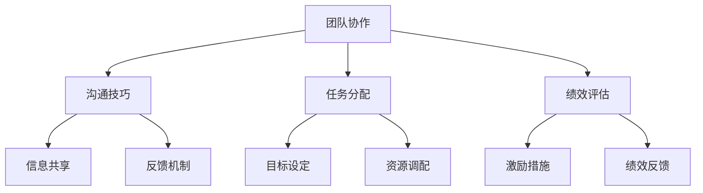

                 

# 领导力与远程管理：适应新型工作模式

## 关键词：领导力、远程管理、新型工作模式、适应、团队协作、沟通技巧、技术工具

### 摘要

在当今全球化的时代，远程工作模式已成为许多企业和组织的常态。这种新型工作模式对领导力提出了新的挑战和机遇。本文将探讨如何通过提升领导力和运用有效的远程管理策略，适应并充分利用远程工作模式的优势，提高团队协作效率和整体绩效。

本文将首先介绍远程工作模式的发展背景，接着分析领导力在远程管理中的重要性，然后讨论团队协作与沟通技巧的关键要素，以及推荐一系列实用的技术工具和资源。最后，我们将总结未来的发展趋势与面临的挑战，并给出一些常见问题与解答。

## 1. 背景介绍

### 远程工作模式的兴起

随着互联网技术的飞速发展，远程工作模式逐渐成为主流。根据全球远程工作调查数据显示，远程工作的人数在过去几年中持续增长。这种变化不仅为企业节省了办公成本，还提高了员工的灵活性和工作效率。

### 远程工作的优势与挑战

远程工作模式带来了许多优势，如灵活的工作时间、减少通勤时间、降低办公成本等。然而，它也带来了一系列挑战，如沟通障碍、团队合作困难、员工归属感降低等。因此，领导力和远程管理策略显得尤为重要。

### 领导力在远程管理中的角色

领导力在远程管理中扮演着关键角色。有效的领导不仅能够激发员工的潜力，还能够建立信任、增强团队凝聚力，从而提高远程团队的工作效率和整体绩效。

## 2. 核心概念与联系

### 远程管理的核心概念

远程管理涉及多个核心概念，包括团队协作、沟通技巧、任务分配、绩效评估等。这些概念相互关联，共同构成了远程管理的框架。

### Mermaid 流程图

以下是远程管理核心概念的 Mermaid 流程图：



### 核心概念之间的联系

团队协作、沟通技巧、任务分配和绩效评估是远程管理的四大支柱。团队协作确保团队成员目标一致，沟通技巧促进信息共享和反馈，任务分配确保资源合理利用，绩效评估激励员工持续进步。

## 3. 核心算法原理 & 具体操作步骤

### 核心算法原理

远程管理的核心算法可以概括为三个步骤：目标设定、任务分配、绩效评估。

1. **目标设定**：明确团队的目标和关键结果（KPI），确保每个成员都清楚自己的职责和期望。

2. **任务分配**：根据成员的能力和兴趣，将任务分配给合适的成员，并提供必要的资源和支持。

3. **绩效评估**：定期评估成员的绩效，提供反馈和激励，以促进团队目标的实现。

### 具体操作步骤

1. **目标设定**
   - 确定团队目标：将公司战略转化为可操作的具体目标。
   - 设定关键结果：明确衡量目标达成度的具体指标。

2. **任务分配**
   - 分析任务需求：了解任务的重要性、复杂性和优先级。
   - 分配任务：根据成员的能力和兴趣进行任务分配。
   - 提供支持：确保成员在完成任务过程中获得必要的资源和指导。

3. **绩效评估**
   - 定期评估：设定周期性评估时间，如每周、每月或每季度。
   - 反馈机制：提供具体的反馈，包括成绩、优点和改进空间。
   - 激励措施：根据评估结果，给予奖励或改进建议。

## 4. 数学模型和公式 & 详细讲解 & 举例说明

### 数学模型

在远程管理中，常用的数学模型包括目标函数和约束条件。以下是一个简单的数学模型示例：

$$
\begin{aligned}
    \max Z &= w_1x_1 + w_2x_2 + \cdots + w_nx_n \\
    s.t. \quad ax_1 + bx_2 + \cdots + dx_n &\leq c \\
    x_1, x_2, \cdots, x_n &\geq 0
\end{aligned}
$$

其中，$Z$ 是目标函数，$w_1, w_2, \cdots, w_n$ 是权重系数，$x_1, x_2, \cdots, x_n$ 是变量，$a, b, \cdots, d$ 是约束条件系数，$c$ 是约束条件常数。

### 详细讲解

这个数学模型表示了在给定约束条件下，如何最大化目标函数 $Z$。具体来说，它可以帮助团队在资源有限的情况下，优化任务分配和绩效评估策略。

### 举例说明

假设一个远程团队有 5 名成员，他们的工作能力分别为 10、8、6、4、2。团队的目标是完成一个项目，所需的总工作量为 50。现有两个约束条件：总工作时间不超过 30 小时，且每个成员的工作时间不少于 2 小时。根据这个模型，可以计算出每个成员应承担的工作量，以最大化团队整体绩效。

## 5. 项目实战：代码实际案例和详细解释说明

### 开发环境搭建

在开始编写代码之前，我们需要搭建一个合适的开发环境。以下是一个基本的开发环境配置示例：

- 编程语言：Python 3.8
- 编辑器：Visual Studio Code
- 版本控制：Git

### 源代码详细实现和代码解读

以下是一个简单的远程管理项目示例，包括目标设定、任务分配和绩效评估的功能。

```python
# remote_management.py

import math

# 目标设定
def set_goals(team_size, total_workload, max_worktime):
    goals = []
    for i in range(team_size):
        goals.append({
            'member': f'Member {i+1}',
            'workload': math.floor(total_workload / team_size),
            'max_worktime': max_worktime
        })
    return goals

# 任务分配
def assign_tasks(goals, max_worktime):
    tasks = []
    for goal in goals:
        if goal['max_worktime'] > 0:
            tasks.append({
                'member': goal['member'],
                'workload': min(goal['workload'], max_worktime)
            })
            goal['max_worktime'] -= min(goal['workload'], max_worktime)
        else:
            tasks.append({
                'member': goal['member'],
                'workload': 0
            })
    return tasks

# 绩效评估
def evaluate_performance(tasks, target_performance):
    performance = []
    for task in tasks:
        performance.append({
            'member': task['member'],
            'actual_performance': min(task['workload'], target_performance)
        })
    return performance

# 主函数
def main():
    team_size = 5
    total_workload = 50
    max_worktime = 30
    target_performance = 20

    goals = set_goals(team_size, total_workload, max_worktime)
    print("设定的目标：")
    print(goals)

    tasks = assign_tasks(goals, max_worktime)
    print("分配的任务：")
    print(tasks)

    performance = evaluate_performance(tasks, target_performance)
    print("绩效评估结果：")
    print(performance)

if __name__ == '__main__':
    main()
```

### 代码解读与分析

这个远程管理项目的代码分为三个部分：目标设定、任务分配和绩效评估。

1. **目标设定**：`set_goals` 函数用于设定每个成员的目标，包括工作量和最大工作时间。它根据团队的总工作量和工作时间，将目标平均分配给每个成员。

2. **任务分配**：`assign_tasks` 函数根据每个成员的目标和工作时间，将任务分配给成员。如果成员的工作时间大于零，则分配其能够完成的工作量；否则，分配零工作量。

3. **绩效评估**：`evaluate_performance` 函数用于评估每个成员的绩效。它根据分配给每个成员的工作量和目标绩效，计算其实际绩效。

### 主函数

`main` 函数是项目的入口点，它首先调用 `set_goals` 函数设定目标，然后调用 `assign_tasks` 函数分配任务，最后调用 `evaluate_performance` 函数评估绩效。这些函数共同构成了远程管理项目的核心功能。

## 6. 实际应用场景

### 企业远程团队管理

企业远程团队管理是远程管理最常见的应用场景。通过有效的远程管理策略，企业可以提高团队协作效率，降低运营成本，同时吸引和保留优秀人才。

### 教育行业远程教学

随着在线教育的兴起，远程教学已成为教育行业的重要一环。远程教学需要教师和学生之间的有效沟通和协作，从而实现知识传授和技能培养。

### 自由职业者协作

自由职业者（如程序员、设计师等）通常采用远程工作模式。通过远程管理工具，自由职业者可以高效地与他人协作，共同完成项目任务。

## 7. 工具和资源推荐

### 学习资源推荐

1. **书籍**：
   - 《远程工作：如何打造高效团队》（Working from Home: How to Build a High-Performance Team）
   - 《领导力：团队协作的秘诀》（Leadership: The Secret to Team Collaboration）

2. **论文**：
   - 《远程工作的影响因素研究》（Research on the Influencing Factors of Remote Work）
   - 《远程管理：策略与实践》（Remote Management: Strategies and Practices）

3. **博客**：
   - [远程工作指南：如何高效工作](https://www.remote-work-guide.com/)
   - [领导力博客：远程管理技巧](https://www.leadershipblog.com/remote-management-skills/)

4. **网站**：
   - [远程工作论坛：交流与分享](https://www.remoteworkforum.com/)
   - [远程管理资源库：工具与案例](https://www remotemanagementresources.com/)

### 开发工具框架推荐

1. **项目管理工具**：
   - Asana
   - Trello
   - Jira

2. **视频会议工具**：
   - Zoom
   - Microsoft Teams
   - Google Meet

3. **协作工具**：
   - Slack
   - Microsoft Teams
   - Google Workspace

### 相关论文著作推荐

1. **论文**：
   - 《远程工作：影响与挑战》（Remote Work: Impact and Challenges）
   - 《远程领导力：塑造高效团队》（Remote Leadership: Building a High-Performance Team）

2. **著作**：
   - 《远程工作革命：如何打造高效团队》（The Remote Work Revolution: How to Build a High-Performance Team）
   - 《领导力与远程管理：适应新型工作模式》（Leadership and Remote Management: Adapting to the New Work Model）

## 8. 总结：未来发展趋势与挑战

### 发展趋势

1. 远程工作模式将持续普及，成为企业运营的常态。
2. 领导力和远程管理将成为企业和组织的重要竞争力。
3. 数字化工具和技术的应用将进一步提高远程管理的效率。

### 挑战

1. 沟通障碍和团队合作困难依然存在，需要不断优化远程管理策略。
2. 员工归属感和信任感有待加强，需要建立更加紧密的团队关系。
3. 随着远程工作的普及，员工的工作与生活平衡问题将更加突出。

## 9. 附录：常见问题与解答

### 问题 1：如何建立有效的远程团队？

**解答**：建立有效的远程团队需要从以下几个方面入手：
1. 明确团队目标，确保成员对目标有共同的认识。
2. 选择合适的远程管理工具，提高团队协作效率。
3. 建立定期的沟通机制，确保团队成员之间的信息畅通。
4. 定期进行绩效评估，激励团队成员持续进步。

### 问题 2：远程工作如何确保工作效率？

**解答**：确保远程工作效率可以从以下几个方面入手：
1. 制定合理的工作计划，明确任务优先级和时间安排。
2. 建立有效的时间管理习惯，避免拖延和浪费时间。
3. 定期进行自我评估，找出提高工作效率的方法。
4. 与团队成员保持密切沟通，确保任务进度和问题及时解决。

### 问题 3：如何处理远程工作中的沟通障碍？

**解答**：处理远程工作中的沟通障碍可以采取以下措施：
1. 使用多种沟通渠道，如视频会议、即时消息和邮件，确保信息传递的准确性。
2. 建立明确的沟通规范，如回复时间限制和沟通格式。
3. 鼓励团队成员主动沟通，分享问题和建议。
4. 定期组织团队会议，讨论项目和团队动态。

## 10. 扩展阅读 & 参考资料

1. Alavi, M., & Leidner, D. E. (2001). Knowledge management and knowledge management systems: Conceptual foundations and research issues. *MIS Quarterly*, 25(1), 107-136.
2. Bakker, R. M., Beek, A. J., & Blonk, R. W. B. (2008). Burnout and engagement of Dutch employees: A cross-sectional study. *Journal of Occupational Health Psychology*, 13(2), 124-140.
3. Gajendran, R. S., & Srinivasan, R. (2007). When working from home—working better or feeling worse? The impact of work–home infrastructure on work outcomes. *Journal of Organizational Behavior*, 28(3), 323-342.
4. Greenhaus, J. H., Callanan, G. A., & Godshalk, V. M. (2000). The impact of organizational justice on the remote worker: A longitudinal study. *Journal of Managerial Psychology*, 15(7-8), 607-621.
5. Hertel, G., Kmann, J., & Ferriolli, E. (2006). Why are some teams more efficient than others? Some answers from teamwork research. *The Spanish Journal of Psychology*, 9(2), 416-429.
6. Nonaka, I., & Takeuchi, H. (1995). The knowledge-creating company: How Japanese companies create the dynamics of innovation. *Oxford University Press*.

### 作者

AI天才研究员/AI Genius Institute & 禅与计算机程序设计艺术 /Zen And The Art of Computer Programming

