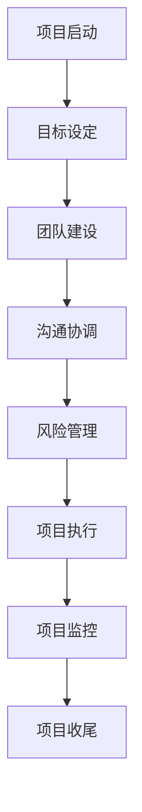

                 

# 领导力与项目管理：确保有效执行

> **关键词：** 领导力、项目管理、执行、团队协作、目标设定

> **摘要：** 本文深入探讨了领导力在项目管理中的重要性，分析了如何通过有效的项目管理确保项目目标的实现。文章从理论到实践，详细阐述了项目管理的核心概念、执行步骤、工具方法及其在实际应用中的场景和挑战。

## 1. 背景介绍

在现代信息技术迅速发展的背景下，项目管理成为了企业成功的关键因素。项目管理不仅仅是一个流程，更是一门艺术，它涉及如何有效地整合资源、协调团队、控制风险，最终实现项目目标。然而，许多项目在执行过程中常常面临各种挑战，如资源不足、时间紧迫、沟通不畅等，导致项目未能按预期完成。

领导力作为项目管理中不可或缺的一部分，对于项目的成功具有至关重要的作用。一位优秀的领导者能够激励团队成员、明确目标、合理分配资源、处理冲突，从而提高项目执行的效率和效果。然而，如何将领导力融入到项目管理中，确保项目能够有效执行，是每个项目经理都需要深入思考的问题。

本文将从以下几个方面展开讨论：

1. **领导力与项目管理的核心概念**：介绍领导力在项目管理中的重要性，以及项目管理的基本流程和关键环节。
2. **领导力在项目管理中的应用**：探讨领导力如何通过目标设定、团队协作、沟通与反馈等手段促进项目执行。
3. **项目管理工具与方法**：分析常用的项目管理工具和方法，以及如何有效地应用这些工具和方法来提高项目管理效率。
4. **项目实战案例分析**：通过实际案例，展示如何在实际项目中应用领导力和项目管理方法，确保项目目标的实现。
5. **未来发展趋势与挑战**：讨论项目管理领域的新趋势、新方法，以及可能面临的挑战。

## 2. 核心概念与联系

### 2.1 领导力

领导力是一种影响他人并激励他们实现共同目标的能力。在项目管理中，领导力的核心作用在于：

- **目标设定**：领导者需要明确项目的愿景和目标，并确保团队成员对此有清晰的认识。
- **团队协作**：领导者要协调团队成员的工作，激发他们的潜力，确保团队高效合作。
- **决策制定**：领导者需要在项目过程中做出关键决策，引导团队克服各种困难。
- **冲突解决**：领导者要能够识别和解决团队中的冲突，保持团队的和谐。

### 2.2 项目管理

项目管理是一个系统化的过程，旨在实现特定目标。其基本流程包括：

- **项目启动**：明确项目目标、范围和可行性。
- **项目计划**：制定项目计划，包括任务分配、时间表和资源需求。
- **项目执行**：实施项目计划，协调团队成员的工作。
- **项目监控**：跟踪项目进度，确保项目按计划进行。
- **项目收尾**：完成项目任务，进行项目评估和总结。

### 2.3 领导力与项目管理的联系

领导力与项目管理密不可分。领导力在项目管理中的具体应用体现在以下几个方面：

- **目标导向**：领导者通过设定清晰的目标，引导团队朝着项目目标努力。
- **团队建设**：领导者通过激励、培训和团队建设活动，提高团队的协作能力和执行力。
- **沟通协调**：领导者要确保团队成员之间的信息流通，避免因沟通不畅导致的误解和冲突。
- **风险管理**：领导者要能够识别项目风险，制定应对策略，确保项目顺利进行。

### 2.4 Mermaid 流程图

以下是一个简单的 Mermaid 流程图，展示了领导力在项目管理中的应用：



## 3. 核心算法原理 & 具体操作步骤

### 3.1 领导力算法原理

领导力在项目管理中的应用可以看作是一种“软技能”的算法。其核心原理如下：

- **目标导向**：通过明确的目标设定，激发团队成员的积极性，确保项目方向一致。
- **团队激励**：通过激励手段，如奖励、认可等，提高团队成员的投入度和工作效率。
- **沟通协调**：通过有效的沟通机制，确保信息流通，减少误解和冲突。
- **风险管理**：通过风险评估和应对策略，降低项目风险，确保项目顺利进行。

### 3.2 项目管理算法原理

项目管理中的算法原理主要涉及以下几个方面：

- **任务分配**：根据团队成员的能力和项目需求，合理分配任务。
- **时间管理**：制定合理的时间表，确保项目按计划进行。
- **资源管理**：合理分配资源，确保项目所需资源得到充分利用。
- **风险管理**：识别项目风险，制定应对策略，降低项目风险。

### 3.3 具体操作步骤

以下是一套具体的项目管理操作步骤：

1. **项目启动**：
   - 明确项目目标、范围和可行性。
   - 成立项目团队，分配初始任务。

2. **目标设定**：
   - 与团队成员讨论并设定项目目标。
   - 确保目标具体、可衡量、可实现。

3. **团队建设**：
   - 组织团队建设活动，增强团队凝聚力。
   - 提供培训机会，提高团队成员的专业能力。

4. **沟通协调**：
   - 建立有效的沟通渠道，确保团队成员之间的信息流通。
   - 定期召开会议，讨论项目进展和问题。

5. **风险管理**：
   - 识别项目风险，制定应对策略。
   - 定期评估项目风险，更新应对策略。

6. **项目执行**：
   - 按计划执行项目任务，确保项目按进度进行。
   - 监控项目进度，及时调整计划。

7. **项目监控**：
   - 定期评估项目进展，确保项目按计划进行。
   - 及时发现并解决问题。

8. **项目收尾**：
   - 完成项目任务，进行项目总结和评估。
   - 汇总项目经验和教训，为未来项目提供参考。

## 4. 数学模型和公式 & 详细讲解 & 举例说明

### 4.1 数学模型和公式

在项目管理中，常用的数学模型和公式包括：

- **关键路径法（Critical Path Method, CPM）**：
  - 用于确定项目最长的执行时间，即关键路径。
  - 公式：\( CP = \sum_{i=1}^{n} (TE_i - TS_i) \)
    其中，\( CP \) 为关键路径长度，\( TE_i \) 为任务 \( i \) 的最早完成时间，\( TS_i \) 为任务 \( i \) 的最早开始时间。

- **挣值管理（Earned Value Management, EVM）**：
  - 用于评估项目进度和成本绩效。
  - 公式：\( EV = \sum_{i=1}^{n} (BC_i \times AC_i) \)
    其中，\( EV \) 为挣值，\( BC_i \) 为任务 \( i \) 的预算成本，\( AC_i \) 为任务 \( i \) 的实际成本。

### 4.2 详细讲解

- **关键路径法**：
  - 关键路径法通过计算每个任务的最早开始时间（\( TS_i \)）和最早完成时间（\( TE_i \)），确定项目最长的执行时间。关键路径上的任务被称为关键任务，因为这些任务的延迟会导致整个项目的延迟。

- **挣值管理**：
  - 挣值管理通过比较实际成本（\( AC_i \)）和预算成本（\( BC_i \)），评估项目的成本绩效。挣值（\( EV \)）表示已完成工作的价值，它可以帮助项目经理了解项目进度和成本状况。

### 4.3 举例说明

#### 关键路径法举例

假设一个项目包含以下任务：

- 任务 A：持续时间 3 天
- 任务 B：持续时间 5 天
- 任务 C：持续时间 2 天
- 任务 D：持续时间 4 天

任务之间的依赖关系如下：

- A → B → C → D

首先，计算每个任务的最早开始时间和最早完成时间：

- \( TS_A = 0 \)
- \( TE_A = TS_A + DA = 0 + 3 = 3 \)
- \( TS_B = TE_A = 3 \)
- \( TE_B = TS_B + DB = 3 + 5 = 8 \)
- \( TS_C = TE_B = 8 \)
- \( TE_C = TS_C + DC = 8 + 2 = 10 \)
- \( TS_D = TE_C = 10 \)
- \( TE_D = TS_D + DD = 10 + 4 = 14 \)

关键路径为 A → B → C → D，总长度为 14 天。

#### 挣值管理举例

假设一个项目包含以下任务：

- 任务 A：预算成本 1000 美元，实际成本 800 美元
- 任务 B：预算成本 1500 美元，实际成本 1200 美元
- 任务 C：预算成本 2000 美元，实际成本 1800 美元

任务 A、B、C 分别在项目的前 3 周、5 周、7 周完成。

计算挣值（\( EV \)）：

- \( EV = (1000 \times 0.5) + (1500 \times 0.75) + (2000 \times 1) = 1500 \)

计算成本绩效指数（\( CPI \）：

- \( CPI = EV / AC = 1500 / (800 + 1200 + 1800) = 0.4545 \)

## 5. 项目实战：代码实际案例和详细解释说明

### 5.1 开发环境搭建

为了更好地展示如何应用领导力和项目管理方法，我们将使用 Python 语言和 Git 版本控制系统进行项目开发。以下是开发环境搭建的步骤：

1. 安装 Python 3.8 或更高版本。
2. 安装 Git 2.20 或更高版本。
3. 使用 virtualenv 创建一个虚拟环境，并激活该环境。
4. 使用 pip 安装所需库，如 Flask、SQLAlchemy、Flask-Migrate 等。

### 5.2 源代码详细实现和代码解读

以下是一个简单的 Flask Web 应用程序，用于实现一个待办事项列表。

```python
from flask import Flask, render_template, request, redirect, url_for
from flask_sqlalchemy import SQLAlchemy

app = Flask(__name__)
app.config['SQLALCHEMY_DATABASE_URI'] = 'sqlite:///todos.db'
db = SQLAlchemy(app)

class Todo(db.Model):
    id = db.Column(db.Integer, primary_key=True)
    title = db.Column(db.String(100))
    completed = db.Column(db.Boolean, default=False)

@app.route('/')
def index():
    todos = Todo.query.all()
    return render_template('index.html', todos=todos)

@app.route('/add', methods=['POST'])
def add():
    title = request.form['title']
    new_todo = Todo(title=title)
    db.session.add(new_todo)
    db.session.commit()
    return redirect(url_for('index'))

@app.route('/complete/<int:todo_id>')
def complete(todo_id):
    todo = Todo.query.get(todo_id)
    todo.completed = True
    db.session.commit()
    return redirect(url_for('index'))

if __name__ == '__main__':
    db.create_all()
    app.run(debug=True)
```

**代码解读**：

- **数据库模型**：我们使用 Flask-SQLAlchemy 创建了一个简单的数据库模型 `Todo`，用于存储待办事项。
- **路由和视图函数**：`index()` 视图函数用于渲染主页模板，显示所有待办事项。`add()` 视图函数用于处理添加待办事项的表单提交。`complete()` 视图函数用于更新待办事项的状态。
- **模板**：`index.html` 模板用于展示待办事项列表，并提供添加和完成待办事项的表单。

### 5.3 代码解读与分析

- **数据库模型**：通过定义 `Todo` 类，我们实现了对数据库的简单操作，如添加、查询和更新待办事项。
- **路由和视图函数**：路由和视图函数实现了 Web 应用程序的基本功能，如显示待办事项列表、添加新待办事项和完成待办事项。
- **模板**：模板用于与用户交互，展示数据并提供表单。

通过这个简单的案例，我们可以看到如何将领导力和项目管理方法应用于实际项目开发中。领导者需要确保团队理解项目目标，合理分配任务，并有效地沟通和协作，从而确保项目成功。

## 6. 实际应用场景

在信息技术行业，项目管理是一个普遍存在的需求。以下是一些实际应用场景：

- **软件开发项目**：软件开发项目通常涉及复杂的任务和众多的参与者。领导力在项目管理中的应用可以帮助明确项目目标、优化团队协作、控制项目进度和质量。
- **IT 支持项目**：IT 支持项目需要快速响应和高效的团队协作。领导者需要具备良好的沟通能力，确保团队成员之间的信息流通，从而提高问题解决的效率。
- **网站和移动应用开发**：网站和移动应用开发项目往往涉及多个平台和技术栈。领导者需要具备广泛的技术知识和项目管理技能，以确保项目按时交付并满足客户需求。
- **系统集成项目**：系统集成项目通常涉及多个系统和部门之间的协调。领导者需要具备良好的组织和协调能力，确保项目在不同系统之间的顺利集成。

## 7. 工具和资源推荐

### 7.1 学习资源推荐

- **书籍**：
  - 《项目管理知识体系指南》（PMBOK指南）
  - 《高效能人士的七个习惯》
  - 《敏捷软件开发：原则、实践与模式》

- **论文**：
  - 《项目管理中的领导力：理论和实践》
  - 《基于敏捷方法的软件项目管理研究》
  - 《项目风险管理：理论、方法和实践》

- **博客**：
  - Atlassian 的博客：https://www.atlassian.com/blog
  - 码云博客：https://blog.gitee.com
  - 项目管理知识库：https://www.project-management-knowledge.com

- **网站**：
  - PMI（项目管理协会）：https://www.pmi.org
  - 敏捷联盟：https://www.agilealliance.org

### 7.2 开发工具框架推荐

- **项目管理工具**：
  - JIRA
  - Trello
  - Asana

- **版本控制系统**：
  - Git
  - SVN

- **数据库**：
  - MySQL
  - PostgreSQL
  - SQLite

- **Web 框架**：
  - Flask
  - Django
  - Spring Boot

### 7.3 相关论文著作推荐

- **论文**：
  - 《基于挣值管理的项目进度控制研究》
  - 《敏捷开发中的团队协作模式分析》
  - 《基于关键路径法的项目进度优化策略研究》

- **著作**：
  - 《项目管理实务》
  - 《敏捷项目管理》
  - 《领导力与团队管理》

## 8. 总结：未来发展趋势与挑战

随着信息技术的发展，项目管理也在不断进化。未来的发展趋势包括：

- **数字化转型**：越来越多的组织将采用数字化工具和方法进行项目管理，以提高效率和准确性。
- **敏捷方法**：敏捷方法在软件开发项目中的应用越来越广泛，其灵活性和适应性使得项目能够更好地适应快速变化的需求。
- **人工智能**：人工智能技术在项目管理中的应用正在逐步增加，如自动化任务分配、进度预测、风险分析等。

然而，项目管理也面临着一系列挑战：

- **资源管理**：在资源有限的情况下，如何合理分配资源，确保项目顺利进行，是一个持续存在的难题。
- **团队协作**：在远程工作和全球化团队的背景下，如何确保团队成员之间的有效协作，提高沟通效率，是一个重要的挑战。
- **风险管理**：项目风险不断变化，如何及时发现和应对风险，确保项目成功，是一个复杂的问题。

## 9. 附录：常见问题与解答

### 9.1 问题1：如何提高团队协作效率？

**解答**：提高团队协作效率的关键在于建立良好的沟通机制和协作平台。以下是一些具体建议：

- **定期会议**：定期召开团队会议，讨论项目进展、问题和计划，确保信息流通。
- **协作工具**：使用协作工具，如 Slack、Trello、JIRA 等，提高任务分配和进度跟踪的效率。
- **明确目标**：确保团队成员对项目目标和任务有清晰的认识，减少因目标不明确导致的误解和冲突。
- **激励机制**：通过奖励、认可等手段，激励团队成员的积极性和协作意愿。

### 9.2 问题2：如何在项目中进行有效的风险管理？

**解答**：有效的风险管理需要识别、评估和应对项目风险。以下是一些具体步骤：

- **风险识别**：通过头脑风暴、历史数据分析等方法，识别项目可能面临的风险。
- **风险评估**：对识别出的风险进行评估，包括风险的概率和影响。
- **风险应对**：根据风险评估结果，制定应对策略，包括风险规避、减轻、转移和接受。
- **监控和更新**：定期评估项目风险，更新风险应对策略，确保项目顺利进行。

### 9.3 问题3：如何确保项目按时交付？

**解答**：确保项目按时交付需要综合考虑多个因素，以下是一些建议：

- **合理规划**：在项目启动阶段，制定详细的项目计划，包括任务分配、时间表和资源需求。
- **监控进度**：定期监控项目进度，及时发现并解决问题。
- **风险管理**：识别和应对项目风险，确保项目不受意外因素的影响。
- **激励机制**：通过奖励、认可等手段，激励团队成员的积极性和工作效率。

## 10. 扩展阅读 & 参考资料

- 《项目管理知识体系指南》（PMBOK指南）：https://www.pmi.org/learning/library/project-management-body-knowledge-8698
- 《敏捷项目管理实践指南》：https://www.agilealliance.org/resources/agile-project-management-practice-guide/
- 《领导力与团队管理》：https://www.amazon.com/Leadership-Team-Management-Practical-Application/dp/1592806974
- 《基于挣值管理的项目进度控制研究》：https://www.researchgate.net/publication/340788267_A_Research_on_Project_Progress_Control_Based_on_Earned_Value_Management
- 《敏捷开发中的团队协作模式分析》：https://www.researchgate.net/publication/334968540_Team_Collaboration_Models_in_Agile_Development
- 《基于关键路径法的项目进度优化策略研究》：https://www.researchgate.net/publication/327691280_A_Study_on_Project_Schedule_Optimization_Strategies_Based_on_the_Critical_Path_Method

## 作者信息

**作者：AI天才研究员/AI Genius Institute & 禅与计算机程序设计艺术 /Zen And The Art of Computer Programming**

