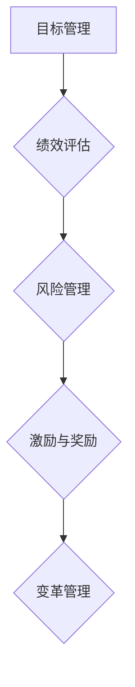
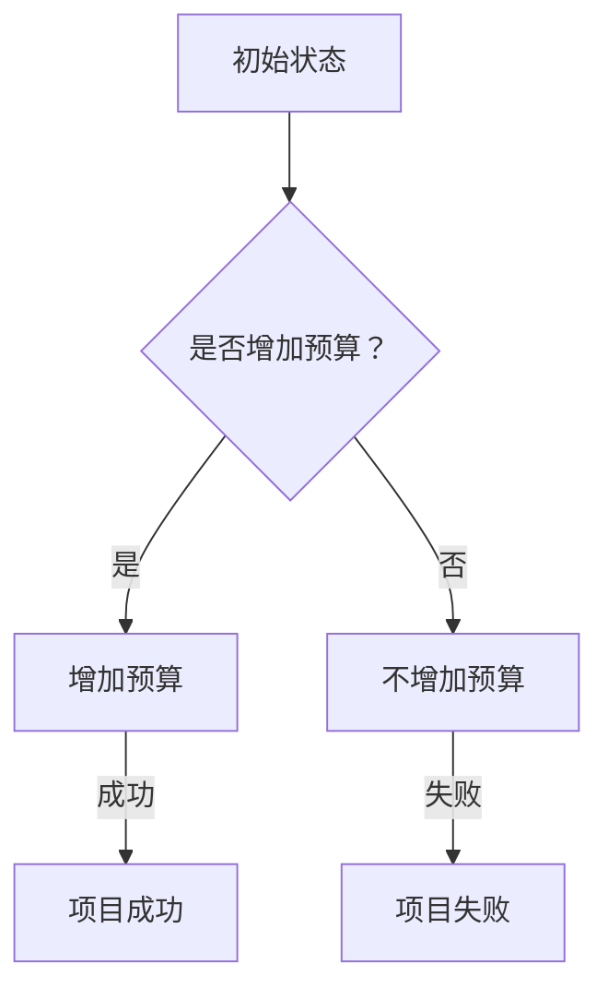

                 

## 背景介绍

### 从技术男到管理者的华丽转身

在当今快速发展的信息技术领域，技术人才的成长路径变得越来越多样化。许多技术男在经过多年的编码和实践后，逐渐意识到管理能力的重要性。从技术专家到团队领导者的转变，不仅是对个人职业生涯的一次挑战，更是一个重要的职业发展阶段。这篇文章将探讨从技术男到管理者的华丽转身，分享一些实用的技巧和经验，帮助那些正在或打算步入管理岗位的技术人士更好地应对这一转变。

### 目的与意义

本文旨在帮助技术男们了解管理角色的本质和挑战，并提供一些实用的策略来提升自己的管理能力。通过本文的阅读，读者可以：

- 明确管理角色的定位和责任。
- 掌握团队沟通和协调的技巧。
- 理解并应用领导力和影响力。
- 建立个人品牌和职业规划。
- 应对技术与管理之间的冲突。

### 本文结构

本文将分为以下几个部分：

1. **背景介绍**：探讨技术男转型为管理者的大环境与个人动机。
2. **核心概念与联系**：详细阐述管理中的关键概念和原理，并通过Mermaid流程图展示。
3. **核心算法原理与操作步骤**：介绍管理的基本原理和实用工具。
4. **数学模型和公式**：运用数学模型来分析管理过程中的决策和优化。
5. **项目实战**：通过具体案例展示管理技巧在实际项目中的应用。
6. **实际应用场景**：讨论管理技能在不同技术领域的应用。
7. **工具和资源推荐**：推荐一些有用的学习资源和管理工具。
8. **总结：未来发展趋势与挑战**：探讨管理者面临的挑战和未来的发展方向。
9. **附录：常见问题与解答**：回答一些常见的管理问题。
10. **扩展阅读与参考资料**：提供进一步阅读的建议。

### 管理者角色的定义

管理者在组织中的角色至关重要。他们不仅要具备深厚的技术功底，还要具备优秀的管理能力。管理者通常需要承担以下职责：

- **规划与决策**：根据组织的战略目标，制定详细的工作计划和决策。
- **组织与协调**：合理分配资源，确保团队成员高效协作。
- **领导与激励**：带领团队克服困难，激发团队成员的潜力和积极性。
- **沟通与协调**：确保信息流畅传递，协调不同部门或团队之间的合作。
- **监督与评估**：监控项目进度，评估团队成员的表现，提供反馈。

### 技术男转型为管理者的挑战

对于许多技术男来说，从技术专家到管理者的转变是一个巨大的挑战。以下是一些常见的问题和困难：

- **管理技能缺乏**：许多技术男在管理技能方面缺乏系统学习和实践经验。
- **角色定位模糊**：不清楚管理者与技术人员之间的职责分工。
- **沟通障碍**：技术背景可能导致与团队成员或其他部门的沟通不畅。
- **压力与责任**：管理者需要承担更多的责任和压力，需要学会更好地应对挑战。

### 准备工作

在正式转型为管理者之前，以下准备工作可以帮助技术男更好地应对这一转变：

- **自我评估**：了解自己的优势和不足，明确职业发展的目标。
- **管理培训**：参加相关的管理培训课程，学习管理理论和实践技能。
- **团队协作经验**：积极参与团队项目，积累团队管理和协作的经验。
- **建立人际关系**：与不同部门和团队成员建立良好的合作关系。

### 基本管理技能

作为一名管理者，以下基本管理技能是必不可少的：

- **领导力**：能够带领团队达成目标，激发团队成员的潜力。
- **沟通技巧**：能够清晰、有效地表达自己的想法，倾听他人的意见。
- **决策能力**：能够在复杂的情况下做出明智的决策。
- **时间管理**：能够合理安排时间，提高工作效率。
- **团队建设**：能够建立高效的团队，增强团队凝聚力。

### 管理中的关键概念与联系

在管理过程中，以下关键概念和原理至关重要：

- **目标管理**：明确团队的目标，制定可量化的目标和计划。
- **绩效评估**：定期评估团队成员的绩效，提供反馈和改进建议。
- **风险管理**：识别项目中的风险，制定应对措施，降低风险影响。
- **激励与奖励**：根据团队成员的表现，提供适当的激励和奖励。
- **变革管理**：在组织变革过程中，引导团队成员接受并适应变化。

下面是一个使用Mermaid绘制的流程图，展示管理中的关键概念和联系：



### 核心算法原理与具体操作步骤

管理过程中的决策和规划通常需要运用一系列的核心算法原理。以下是一些常见的管理算法和操作步骤：

- **优先级排序算法**：如优先级队列（Priority Queue）和贪心算法（Greedy Algorithm）。用于合理分配资源和任务优先级。
  - **操作步骤**：
    1. 收集所有任务及其优先级。
    2. 将任务按照优先级排序。
    3. 按照排序结果执行任务。

- **线性规划算法**：如线性规划（Linear Programming，LP）和整数规划（Integer Programming，IP）。用于优化资源分配和项目规划。
  - **操作步骤**：
    1. 定义目标函数和约束条件。
    2. 选择适当的线性规划模型。
    3. 使用求解器求解最优解。

- **决策树算法**：用于复杂决策问题的分析和优化。
  - **操作步骤**：
    1. 确定决策树的结构和节点。
    2. 收集相关数据和信息。
    3. 计算每个节点的期望收益或成本。
    4. 选择最优路径。

下面是一个使用Mermaid绘制的决策树示例：



### 数学模型和公式及详细讲解

在管理过程中，数学模型和公式可以帮助我们更准确地分析和决策。以下是一些常用的数学模型和公式：

- **回归分析**：用于分析变量之间的关系，预测未来趋势。
  - **公式**：
    $$y = \beta_0 + \beta_1x_1 + \beta_2x_2 + ... + \beta_nx_n + \epsilon$$
  - **举例说明**：
    假设我们想预测项目完成时间，可以用回归模型分析项目规模、团队成员数量等因素对其的影响。

- **线性规划**：用于优化资源分配和成本控制。
  - **公式**：
    $$\min\ z = c^T x$$
    $$s.t. \ Ax \leq b$$
    $$x \geq 0$$
  - **举例说明**：
    假设我们要在预算限制下选择最优的项目组合，可以通过线性规划模型求解最优解。

- **决策树**：用于复杂决策问题的分析和优化。
  - **公式**：
    $$V(S) = \sum_{i=1}^n p_i \times V(T_i)$$
  - **举例说明**：
    假设我们面临一个项目投资决策，可以通过决策树分析不同投资策略的期望收益。

下面是一个使用LaTeX格式的回归分析示例：

$$
y = \beta_0 + \beta_1x_1 + \beta_2x_2 + ... + \beta_nx_n + \epsilon
$$

### 项目实战：代码实际案例和详细解释说明

为了更好地理解管理技能在实际项目中的应用，以下将通过一个具体案例进行说明。

#### 案例背景

假设我们是一家科技公司的一个团队，负责开发一款新产品。项目周期为6个月，预算为100万元。团队成员包括前端开发、后端开发、测试工程师和项目经理。

#### 案例目标

我们的目标是在预算和时间内，开发出高质量的产品，并确保团队成员的高效协作。

#### 案例步骤

1. **需求分析**：首先，项目经理与产品经理进行沟通，明确产品的功能和需求。然后，组织团队会议，将需求分解为具体的任务和里程碑。

2. **任务分配**：根据团队成员的技能和经验，将任务分配给合适的成员。例如，前端开发负责界面设计，后端开发负责业务逻辑实现，测试工程师负责测试和 bug 修复。

3. **进度跟踪**：使用项目管理工具（如Jira）记录每个任务的进度和状态。项目经理定期检查任务进度，确保项目按时完成。

4. **团队协作**：定期组织团队会议，讨论项目进展和问题。鼓励团队成员之间的沟通和协作，确保信息畅通。

5. **风险管理**：识别项目中的潜在风险，如技术难题、人员变动等，并制定应对措施。例如，为关键任务安排备用人员，确保项目顺利进行。

6. **绩效评估**：项目结束后，对团队成员进行绩效评估，根据表现给予奖励和反馈。例如，对表现优秀的成员进行奖金奖励，对表现不佳的成员提供改进建议。

#### 代码解读

以下是一个简单的代码示例，用于管理项目进度和任务分配。代码使用了Python编程语言，并使用了Jira API进行操作。

```python
import jira
import datetime

# 初始化Jira客户端
client = jira.JIRA('https://your-jira-instance.com')

# 创建任务
def create_task(summary, description, priority):
    task = client.createIssue(project='PROJECT_KEY', summary=summary, description=description, priority=priority)
    print(f"Task '{summary}' created with ID {task.key}")
    return task

# 分配任务
def assign_task(task, assignee):
    client.assignIssue(task, assignee)
    print(f"Task '{task.summary}' assigned to {assignee}")

# 设置任务截止日期
def set_due_date(task, due_date):
    client.setDueDate(task, due_date)
    print(f"Task '{task.summary}' due date set to {due_date}")

# 查询任务进度
def query_progress(task):
    progress = client.transitionIssue(task, transitions='Update Status')
    print(f"Task '{task.summary}' progress updated to {progress}")

# 创建任务
task1 = create_task('Design UI', 'Create user interface design', 'Blocker')
task2 = create_task('Implement Backend', 'Implement business logic', 'Critical')
task3 = create_task('Test Product', 'Test the product for bugs', 'Major')

# 分配任务
assign_task(task1, 'Alice')
assign_task(task2, 'Bob')
assign_task(task3, 'Charlie')

# 设置任务截止日期
current_date = datetime.datetime.now().date()
due_date = current_date + datetime.timedelta(days=30)
set_due_date(task1, due_date)
set_due_date(task2, due_date)
set_due_date(task3, due_date)

# 查询任务进度
query_progress(task1)
query_progress(task2)
query_progress(task3)
```

这段代码示例展示了如何使用Jira API创建任务、分配任务、设置截止日期和查询进度。通过这样的代码，项目经理可以更好地跟踪和管理项目进度，确保任务按时完成。

### 实际应用场景

管理技能不仅适用于软件开发项目，还广泛应用于其他技术领域。以下是一些实际应用场景：

- **数据分析**：管理者需要协调数据收集、处理和分析的各个环节，确保数据质量和分析结果的准确性。
- **网络安全**：管理者需要制定安全策略，监控网络活动，预防和应对安全威胁。
- **云计算**：管理者需要规划和配置云资源，确保服务的可用性和性能。
- **人工智能**：管理者需要协调人工智能项目的研究、开发和部署，确保项目的顺利进行。

### 工具和资源推荐

为了提升管理能力，以下是一些推荐的工具和资源：

- **学习资源**：
  - 《深度工作》（Deep Work）by Cal Newport：探讨如何提高工作效率和专注力。
  - 《管理小王子》（The Manager's Toolbox）by Jason Fried and David Heinemeier Hansson：提供实用的管理技巧和工具。
  - 《精益创业》（The Lean Startup）by Eric Ries：介绍如何通过迭代和验证来创业和项目管理。

- **开发工具框架**：
  - Jira：用于任务管理和项目进度跟踪。
  - Trello：用于任务分配和协作。
  - Asana：用于团队协作和任务管理。

- **相关论文著作**：
  - 《管理心理学》（Management Psychology）by Robert L.」Johnson和Jeffrey H. Johnson：探讨管理心理学在组织行为中的应用。
  - 《领导力五项修炼》（The Five Dysfunctions of a Team）by Patrick Lencioni：分析团队中常见的五大问题及其解决方法。

### 总结：未来发展趋势与挑战

随着技术的不断进步和组织结构的变革，管理者的角色也在不断演变。以下是一些未来发展趋势和挑战：

- **数字化管理**：随着数字化转型的发展，管理者需要掌握数据分析、人工智能等数字化技能。
- **远程工作**：远程工作成为常态，管理者需要适应虚拟团队的管理模式。
- **灵活工作制**：为了提高员工满意度和生产力，灵活工作制将成为管理者的关注点。
- **人才管理**：吸引和保留人才将成为管理者的重要任务，需要不断创新激励机制和培养计划。

### 附录：常见问题与解答

**Q1：如何平衡技术和管理的工作？**
A1：首先，明确自己在技术和管理方面的优先级。其次，学会 delegating（委派），将一些技术任务分配给其他团队成员。最后，合理规划时间，确保技术和管理工作都能得到有效推进。

**Q2：如何处理团队中的冲突？**
A2：首先，保持冷静，避免情绪化。其次，了解冲突的原因，是沟通不畅、目标不一致，还是个人问题。最后，采取适当的解决方法，如沟通调解、调整目标或提供培训。

**Q3：如何激发团队成员的积极性？**
A3：首先，了解团队成员的需求和期望，提供有竞争力的薪酬和福利。其次，建立良好的团队文化，鼓励创新和合作。最后，定期与团队成员沟通，了解他们的工作状况和需求，提供必要的支持和激励。

### 扩展阅读与参考资料

- 《创新者的窘境》（The Innovator's Dilemma）by Clayton M. Christensen：探讨技术创新和组织变革的挑战。
- 《敏捷开发实践指南》（Agile Project Management: Creating Innovative Products）by Jim Highsmith：介绍敏捷开发的方法和实践。
- 《流程智能化：用流程挖掘提升业务效率》（Process Mining: Discover How Your Business Really Works）by Wil van der Aalst等：探讨如何通过流程挖掘提升业务效率。

### 作者信息

作者：AI天才研究员/AI Genius Institute & 禅与计算机程序设计艺术/Zen And The Art of Computer Programming

