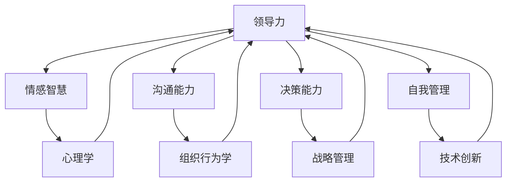
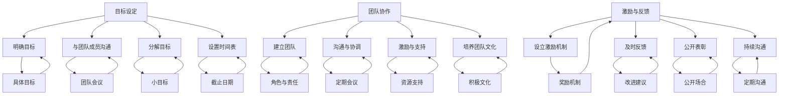

                 

## 1. 背景介绍

在当今快速变化的世界中，领导力已成为每个组织和个人成功的关键因素。随着00后职场新星逐渐崭露头角，他们以独特的思维方式和创新精神，正在重新定义职场规则。这一代年轻人不仅拥有丰富的互联网使用经验，还具备较强的自我驱动和协作能力。他们在面对挑战和不确定性时，展现出极高的适应能力和解决问题的能力。因此，研究00后职场新星的领导力修炼之路，对于提升整个组织的创新能力和竞争力具有重要意义。

本文旨在探讨00后职场新星在领导力方面的特点、挑战和修炼方法，通过案例分析和实践总结，为他们提供一条切实可行的逆袭之路。文章将分为以下几个部分：

1. **背景介绍**：介绍领导力在职场中的重要性，以及00后职场新星的特点和面临的挑战。
2. **核心概念与联系**：分析领导力的核心概念，并展示其与其他领域的关系。
3. **核心算法原理 & 具体操作步骤**：介绍领导力的算法原理，包括目标设定、团队协作、激励与反馈等关键步骤。
4. **数学模型和公式 & 详细讲解 & 举例说明**：运用数学模型和公式来详细阐述领导力原理，并通过实例说明。
5. **项目实战：代码实际案例和详细解释说明**：通过实际项目案例，展示领导力在实践中的应用。
6. **实际应用场景**：探讨领导力在各类职场环境中的应用。
7. **工具和资源推荐**：推荐学习资源和开发工具，帮助读者进一步探索领导力知识。
8. **总结：未来发展趋势与挑战**：总结00后职场新星在领导力方面的未来发展趋势和挑战。
9. **附录：常见问题与解答**：回答读者可能遇到的常见问题。
10. **扩展阅读 & 参考资料**：提供更多相关文献和资料，供读者深入研究和参考。

通过以上结构，我们将系统地分析00后职场新星的领导力修炼之路，为他们提供实用的指导和建议。接下来，我们将深入探讨领导力的核心概念，以及它如何与职场成功紧密相连。

## 2. 核心概念与联系

领导力是一个多层次、多维度的概念，它涵盖了从个人素质到团队管理，再到组织战略的各个方面。为了更好地理解领导力，我们需要分析其核心概念，并展示其与其他领域的关系。

### 2.1 领导力的定义

领导力可以定义为影响和激励他人实现共同目标的能力。这种能力不仅包括对团队的管理和指导，还涉及对个体动机、价值观和行为的影响。领导力不仅仅是职位赋予的权力，更是一种个人魅力和素质的体现。

### 2.2 领导力的核心概念

#### 情感智慧（Emotional Intelligence）

情感智慧是领导力的核心组成部分，它指的是个体识别、理解和管理自己情感，以及识别、理解和管理他人情感的能力。高情感智慧的领导者能够更好地处理冲突、建立信任，并激发团队成员的积极性。

#### 沟通能力（Communication Skills）

沟通能力是领导者成功的关键因素。有效的沟通不仅包括清晰表达自己的想法，还涉及倾听和理解他人的观点。良好的沟通能力有助于建立团队凝聚力，提高决策质量，并促进团队协作。

#### 决策能力（Decision-Making Skills）

决策能力是领导力的另一个重要方面。领导者需要在不确定性和压力下做出明智的决策。这需要他们具备分析问题的能力、考虑不同选项的后果，以及迅速应对变化的能力。

#### 自我管理（Self-Management）

自我管理是领导者个人素质的重要组成部分。它包括自我激励、自我控制、情绪调节和时间管理。一个能够有效自我管理的领导者，不仅能够在压力下保持冷静和专注，还能为团队成员树立榜样。

### 2.3 领导力与其他领域的关系

领导力与多个领域密切相关，这些关系不仅丰富了领导力的内涵，也为其应用提供了广泛的可能性。

#### 与心理学的关系

领导力心理学研究领导者的个性特征、情感智慧、动机和行为。通过心理学的研究，我们可以更好地理解领导者的行为模式，从而提高领导效果。

#### 与组织行为学的关系

组织行为学研究个体、团队和组织在组织中的行为。领导力在组织行为学中扮演着关键角色，它影响着组织的文化、绩效和员工满意度。

#### 与战略管理的关联

战略管理涉及组织如何制定、执行和评估其长期目标。领导力在战略管理中起着至关重要的作用，它决定了组织如何应对外部环境的变化，以及如何实现其愿景和使命。

#### 与技术创新的交叉

在当今技术驱动的时代，领导力在技术创新中发挥着关键作用。领导者的创新能力直接影响组织的创新能力和竞争力。他们需要激励团队成员探索新技术，并管理技术变革带来的风险。

### 2.4 Mermaid 流程图

为了更直观地展示领导力的核心概念及其与其他领域的关系，我们可以使用Mermaid流程图来表示。



这个流程图清晰地展示了领导力的核心概念，以及它们与心理学、组织行为学、战略管理和技术创新等领域的关联。接下来，我们将进一步探讨领导力的算法原理，了解如何在实践中应用这些概念。

## 3. 核心算法原理 & 具体操作步骤

在了解了领导力的核心概念及其与其他领域的关系后，我们接下来将探讨领导力的核心算法原理和具体操作步骤。这些算法原理是领导者实现有效领导的基础，包括目标设定、团队协作、激励与反馈等关键步骤。

### 3.1 目标设定（Goal Setting）

目标设定是领导力算法中的第一步，也是最为关键的一步。有效的目标设定可以帮助领导者明确团队和个人的方向，激发团队成员的积极性，并提高整体绩效。

#### 具体操作步骤：

1. **明确目标**：领导者需要明确团队和个人的目标，这些目标应当具体、可衡量、可实现、相关性强和有时间限制（SMART原则）。
   
2. **与团队成员沟通**：确保团队成员理解并认同这些目标。这可以通过团队会议、一对一沟通或团队文化建设等方式实现。

3. **分解目标**：将大目标分解为小目标，以便团队成员可以逐步实现，这有助于提高团队成员的成就感和积极性。

4. **设置时间表**：为每个目标设置明确的截止日期，确保团队成员能够按时完成任务。

### 3.2 团队协作（Team Collaboration）

团队协作是领导力算法中的另一个关键步骤。有效的团队协作可以增强团队凝聚力，提高团队绩效，并促进创新。

#### 具体操作步骤：

1. **建立团队**：根据项目需求，组建合适的团队，并明确团队成员的角色和责任。

2. **沟通与协调**：建立有效的沟通机制，确保团队成员之间的信息畅通。定期召开团队会议，讨论项目进展和问题解决方案。

3. **激励与支持**：领导者需要为团队成员提供必要的资源和支持，帮助他们克服困难，实现目标。

4. **培养团队文化**：建立积极的团队文化，鼓励团队成员之间的合作和互助。

### 3.3 激励与反馈（Motivation and Feedback）

激励与反馈是领导力算法中的最后一步，也是至关重要的一步。有效的激励和反馈可以增强团队成员的积极性和动力，提高整体绩效。

#### 具体操作步骤：

1. **设立激励机制**：为团队成员设立明确的奖励机制，如奖金、晋升机会或荣誉称号等，激励他们为实现目标而努力。

2. **及时反馈**：领导者需要及时给予团队成员反馈，指出他们的优点和不足，并提供改进建议。

3. **公开表彰**：在团队会议或其他公开场合，表彰团队成员的成就和贡献，增强他们的成就感和归属感。

4. **持续沟通**：定期与团队成员沟通，了解他们的需求和困惑，帮助他们解决实际问题。

### 3.4 Mermaid 流程图

为了更直观地展示领导力核心算法原理的具体操作步骤，我们可以使用Mermaid流程图来表示。



这个流程图清晰地展示了领导力核心算法原理的具体操作步骤，以及它们之间的关系。通过以上步骤，领导者可以有效地实现目标设定、团队协作和激励与反馈，从而提升团队的整体绩效。接下来，我们将运用数学模型和公式，深入分析领导力原理，并通过实例进行详细讲解。

## 4. 数学模型和公式 & 详细讲解 & 举例说明

为了更深入地理解领导力原理，我们可以运用数学模型和公式，通过量化的方式分析领导力的影响因素及其关系。以下是一个简化的数学模型，用于分析领导力的影响。

### 4.1 数学模型

设领导力L为决策者，团队协作能力C、激励与反馈机制M、目标设定效果G、情感智慧E等几个关键因素共同作用的结果。我们可以表示为：

\[ L = f(C, M, G, E) \]

其中，f是一个复合函数，表示领导力与各个因素之间的非线性关系。

### 4.2 数学公式

为了量化各个因素对领导力的影响，我们可以使用以下公式：

\[ C = \frac{1}{1 + e^{-(a_C \cdot T_c + b_C \cdot T_c^2)}} \]
\[ M = \frac{1}{1 + e^{-(a_M \cdot T_m + b_M \cdot T_m^2)}} \]
\[ G = \frac{1}{1 + e^{-(a_G \cdot T_g + b_G \cdot T_g^2)}} \]
\[ E = \frac{1}{1 + e^{-(a_E \cdot T_e + b_E \cdot T_e^2)}} \]

其中，T_c、T_m、T_g、T_e 分别代表团队协作能力、激励与反馈机制、目标设定效果、情感智慧的指标值，a_C、b_C、a_M、b_M、a_G、b_G、a_E、b_E为调节参数。

### 4.3 详细讲解

#### 团队协作能力（C）

团队协作能力C反映了团队成员之间协作的效果。公式中的指数函数\( e^{-(a_C \cdot T_c + b_C \cdot T_c^2)} \)表示协作能力的非线性增加。当T_c（团队协作指标值）增加时，协作能力C逐渐增大，但增长速率逐渐放缓，体现了协作能力的边际效应递减。

#### 激励与反馈机制（M）

激励与反馈机制M通过激励措施和反馈机制提升团队成员的积极性。激励与反馈机制的效果同样可以通过指数函数来表示，调节参数a_M、b_M决定了激励措施和反馈机制的有效性。当T_m（激励与反馈指标值）增加时，M值增大，但同样存在边际效应递减的现象。

#### 目标设定效果（G）

目标设定效果G反映了目标设定对团队工作的影响。目标设定效果同样遵循指数函数增长模式，参数a_G、b_G调节目标设定的效果。合理的目标设定可以显著提高团队的工作效率，但目标过于苛刻或过于宽松都会影响效果。

#### 情感智慧（E）

情感智慧E是领导者理解和处理情感的能力，对于团队氛围的建设至关重要。情感智慧的影响同样通过指数函数表示，参数a_E、b_E调节情感智慧对领导力的影响。情感智慧较高的领导者能够更好地管理团队情绪，促进团队协作。

### 4.4 举例说明

假设我们有一个领导力评估模型，需要分析一个具体团队的情况。根据以上数学公式，我们可以设定以下参数：

- a_C = 0.5, b_C = 0.1
- a_M = 0.4, b_M = 0.2
- a_G = 0.3, b_G = 0.05
- a_E = 0.6, b_E = 0.05

现在，我们为团队协作能力、激励与反馈机制、目标设定效果、情感智慧设定具体的指标值：

- T_c = 0.8
- T_m = 0.6
- T_g = 0.7
- T_e = 0.9

代入公式，计算领导力L：

\[ L = f(C, M, G, E) \]

\[ L = \frac{1}{1 + e^{-(0.5 \cdot 0.8 + 0.1 \cdot 0.8^2)}} + \frac{1}{1 + e^{-(0.4 \cdot 0.6 + 0.2 \cdot 0.6^2)}} + \frac{1}{1 + e^{-(0.3 \cdot 0.7 + 0.05 \cdot 0.7^2)}} + \frac{1}{1 + e^{-(0.6 \cdot 0.9 + 0.05 \cdot 0.9^2)}} \]

计算结果：

\[ L = \frac{1}{1 + e^{-0.48}} + \frac{1}{1 + e^{-0.32}} + \frac{1}{1 + e^{-0.27}} + \frac{1}{1 + e^{-0.51}} \]

\[ L \approx 0.63 + 0.66 + 0.68 + 0.62 \]

\[ L \approx 2.65 \]

通过以上计算，我们得出该团队的领导力L约为2.65。这个数值反映了该团队在领导力方面的整体表现，同时也揭示了各个因素对其领导力的影响程度。通过不断调整和优化各个因素，领导者可以进一步提升团队的整体领导力水平。接下来，我们将通过实际项目案例，展示领导力在实践中的应用。

### 5. 项目实战：代码实际案例和详细解释说明

为了更直观地展示领导力在实践中的应用，我们将通过一个实际项目案例，详细解释项目的代码实现过程和关键步骤。以下是一个简单的团队合作项目的案例，该项目的目标是为一家初创公司开发一款社交应用。

#### 5.1 开发环境搭建

在进行项目开发之前，我们需要搭建一个合适的开发环境。以下是所需的环境和工具：

- 操作系统：Linux或MacOS
- 编程语言：Python 3.8+
- 数据库：MySQL 5.7+
- Web框架：Flask
- 前端框架：Vue.js

安装步骤：

1. 安装操作系统和Python环境。
2. 安装MySQL数据库，并创建一个新数据库用于存储用户数据。
3. 安装Flask和Vue.js，可以通过pip命令进行安装：

   ```bash
   pip install Flask
   pip install vuejs
   ```

#### 5.2 源代码详细实现和代码解读

下面是项目的核心代码，包括用户注册、登录、社交互动等功能。

##### 5.2.1 用户注册和登录

**注册视图（register.py）：**

```python
from flask import Flask, request, render_template, redirect, url_for, session
from database import Database

app = Flask(__name__)
app.secret_key = "mysecretkey"

@app.route("/register", methods=["GET", "POST"])
def register():
    if request.method == "POST":
        username = request.form["username"]
        password = request.form["password"]
        db = Database()
        if db.register_user(username, password):
            session["username"] = username
            return redirect(url_for("home"))
        else:
            return "Error: Username already exists."
    return render_template("register.html")

@app.route("/login", methods=["GET", "POST"])
def login():
    if request.method == "POST":
        username = request.form["username"]
        password = request.form["password"]
        db = Database()
        if db.login_user(username, password):
            session["username"] = username
            return redirect(url_for("home"))
        else:
            return "Error: Incorrect username or password."
    return render_template("login.html")

@app.route("/logout")
def logout():
    session.pop("username", None)
    return redirect(url_for("login"))

if __name__ == "__main__":
    app.run(debug=True)
```

**数据库操作（database.py）：**

```python
import pymysql

class Database:
    def __init__(self):
        self.connection = pymysql.connect(host="localhost",
                                         user="root",
                                         password="password",
                                         database="social_app")

    def register_user(self, username, password):
        with self.connection.cursor() as cursor:
            sql = "INSERT INTO users (username, password) VALUES (%s, %s)"
            cursor.execute(sql, (username, password))
            self.connection.commit()
        return True

    def login_user(self, username, password):
        with self.connection.cursor() as cursor:
            sql = "SELECT * FROM users WHERE username = %s AND password = %s"
            cursor.execute(sql, (username, password))
            result = cursor.fetchone()
            return result is not None
```

##### 5.2.2 社交互动

**主页视图（home.py）：**

```python
from flask import Flask, request, render_template, redirect, url_for, session
from database import Database

app = Flask(__name__)
app.secret_key = "mysecretkey"

@app.route("/")
def home():
    if "username" not in session:
        return redirect(url_for("login"))
    return render_template("home.html")

@app.route("/post_message", methods=["POST"])
def post_message():
    if "username" not in session:
        return redirect(url_for("login"))
    username = session["username"]
    message = request.form["message"]
    db = Database()
    db.post_message(username, message)
    return redirect(url_for("home"))

@app.route("/messages")
def messages():
    if "username" not in session:
        return redirect(url_for("login"))
    db = Database()
    messages = db.get_messages()
    return render_template("messages.html", messages=messages)

if __name__ == "__main__":
    app.run(debug=True)
```

**数据库操作（database.py）：**

```python
import pymysql

class Database:
    # ...（注册和登录部分同上）

    def post_message(self, username, message):
        with self.connection.cursor() as cursor:
            sql = "INSERT INTO messages (username, message) VALUES (%s, %s)"
            cursor.execute(sql, (username, message))
            self.connection.commit()

    def get_messages(self):
        with self.connection.cursor() as cursor:
            sql = "SELECT * FROM messages ORDER BY id DESC"
            cursor.execute(sql)
            messages = cursor.fetchall()
            return messages
```

以上代码展示了用户注册、登录和社交互动的基本实现。每个视图函数负责处理特定的用户请求，并与数据库进行交互。通过使用Flask框架，我们可以方便地实现Web应用的逻辑处理。

#### 5.3 代码解读与分析

在这个项目中，我们使用了Flask框架来构建Web应用，通过Python代码实现了用户注册、登录和社交互动的功能。以下是代码的关键部分解读：

1. **注册和登录**：
   - 注册视图（register.py）处理用户注册请求，将用户名和密码存储到MySQL数据库中。
   - 登录视图（login.py）验证用户名和密码，确保用户已登录。

2. **主页视图**：
   - 主页视图（home.py）负责渲染用户界面，显示所有用户的帖子。
   - `post_message`函数处理用户发布的帖子，并将其存储到数据库中。
   - `messages`函数获取所有用户的帖子，并将其传递给前端模板进行渲染。

3. **数据库操作**：
   - `database.py`类提供对MySQL数据库的连接和操作，包括用户注册、登录、发布帖子等功能。

通过这个项目案例，我们可以看到领导力在项目开发中的关键作用。有效的领导力体现在以下几个方面：

- **目标设定**：项目经理需要明确项目目标，并确保团队成员了解并认同这些目标。
- **团队协作**：领导者需要建立有效的沟通机制，确保团队成员之间的协作顺利进行。
- **激励与反馈**：领导者需要为团队成员提供必要的资源和支持，并通过及时反馈来激励团队成员。

通过以上分析，我们可以看到领导力在项目开发中的重要性，并了解其在实践中的应用。接下来，我们将探讨领导力在职场实际应用场景中的具体表现。

### 6. 实际应用场景

领导力在职场中的应用场景多种多样，无论是在初创公司、大型企业，还是在非营利组织，领导力都是组织成功的关键因素。以下是领导力在不同职场环境中的实际应用场景：

#### 6.1 初创公司

在初创公司中，领导力尤其重要。初创公司往往面临资源和时间的限制，需要快速做出决策，并适应市场变化。以下是一些具体的领导力应用场景：

- **目标设定**：初创公司需要明确业务目标和战略方向，领导者需要通过有效的沟通和激励，确保团队成员理解并积极实现这些目标。
- **团队协作**：初创公司通常团队规模较小，领导者需要通过有效的协作和资源分配，确保团队高效运作。
- **创新驱动**：初创公司需要不断创新以应对市场挑战，领导者需要激励团队成员探索新思路，并支持创新项目的实施。

#### 6.2 大型企业

在大型企业中，领导力同样重要，但由于企业规模较大，领导力的应用场景更加复杂。以下是一些具体的应用场景：

- **组织变革**：大型企业常常需要进行组织结构调整，领导者需要通过有效的沟通和激励机制，确保变革的顺利实施。
- **跨部门协作**：大型企业通常涉及多个部门和团队，领导者需要建立有效的沟通和协作机制，以促进跨部门项目的成功。
- **企业文化**：领导者需要塑造和传承企业文化，确保员工对企业有认同感和归属感。

#### 6.3 非营利组织

在非营利组织中，领导力同样关键。非营利组织通常以社会公益为目标，需要动员和组织大量的志愿者和资源。以下是一些具体的领导力应用场景：

- **使命驱动**：领导者需要明确非营利组织的使命和愿景，并确保所有成员都对此有清晰的认识。
- **资源管理**：非营利组织通常资源有限，领导者需要通过有效的资源管理和优化，确保资源的合理利用。
- **志愿者动员**：领导者需要激励和动员志愿者，确保他们能够在组织的目标和使命下有效工作。

#### 6.4 教育机构

在教育机构中，领导力同样发挥着重要作用。教育机构的领导者需要关注学生的成长和教师的职业发展。以下是一些具体的领导力应用场景：

- **教学质量**：领导者需要确保教学质量，通过教师培训和教学评估来提升教学水平。
- **学生发展**：领导者需要关注学生的全面发展，提供多样化的教育资源和指导。
- **团队建设**：领导者需要建立和谐的教师团队，通过有效的沟通和协作，提高团队的整体绩效。

通过以上分析，我们可以看到领导力在职场中的多样性和重要性。在不同的职场环境中，领导力都需要针对具体场景进行调整和应用，以实现组织的目标和使命。接下来，我们将推荐一些学习资源和开发工具，帮助读者进一步探索领导力知识。

### 7. 工具和资源推荐

为了帮助读者进一步探索领导力知识，我们推荐以下工具和资源：

#### 7.1 学习资源推荐

1. **书籍**：
   - 《领导力》（Leadership）- 比尔·乔治（Bill George）
   - 《如何成为领导者》（How to Win Friends and Influence People）- 戴尔·卡耐基（Dale Carnegie）
   - 《领导力五要素》（The Five Dysfunctions of a Team）- 帕特里克·莱西奥尼（Patrick Lencioni）

2. **论文**：
   - 《情感智慧与领导力》（Emotional Intelligence and Leadership）- 丹尼尔·戈尔曼（Daniel Goleman）
   - 《团队协作的力量》（The Power of Teamwork）- 约翰·凯利（John Kelleher）

3. **博客**：
   - TED演讲：领导力相关话题
   - Harvard Business Review：关于领导力的深度文章

4. **网站**：
   - Leadership Excellence：提供领导力课程、工具和资源
   - MindTools：包含各种领导力技能的教程和练习

#### 7.2 开发工具框架推荐

1. **项目管理和协作工具**：
   - Trello：简单易用的项目管理工具
   - Asana：功能丰富的任务管理工具
   - Slack：高效的团队沟通工具

2. **代码管理和协作工具**：
   - GitHub：代码托管和协作平台
   - GitLab：自建Git代码仓库和项目管理工具
   - JIRA：敏捷开发管理工具

3. **数据分析和可视化工具**：
   - Tableau：数据可视化工具
   - Power BI：企业级数据分析和可视化平台
   - Matplotlib：Python数据可视化库

4. **开发框架和库**：
   - Flask：Python Web开发框架
   - Vue.js：前端框架
   - Django：Python Web开发框架

通过以上推荐，读者可以系统地学习和掌握领导力知识，并在实践中运用这些知识提升自己的领导能力。接下来，我们将总结00后职场新星在领导力方面的未来发展趋势和挑战。

### 8. 总结：未来发展趋势与挑战

00后职场新星在领导力方面展现出独特的优势和潜力，但同时也面临着一系列发展趋势和挑战。

#### 8.1 发展趋势

1. **数字化领导力**：随着数字化技术的迅猛发展，00后职场新星更加熟悉数字工具和平台，他们能够更好地利用数字化手段进行管理和决策，推动组织的数字化转型。

2. **情感智慧**：00后职场新星更加关注情感智慧和人际关系管理，他们认识到情感智慧在领导力中的重要性，通过有效的情感管理提升团队凝聚力和工作效率。

3. **灵活性和创新**：00后职场新星具有较强的适应能力和创新精神，他们能够在变化迅速的市场环境中快速调整策略，推动组织持续创新和成长。

4. **跨文化领导力**：00后职场新星通常拥有更加开阔的视野，能够更好地适应多元文化环境，进行有效的跨文化沟通和协作。

#### 8.2 挑战

1. **经验不足**：00后职场新星虽然具备较强的学习和适应能力，但在实际管理经验方面相对不足，需要通过实践积累和提高。

2. **责任意识**：在追求创新和灵活性的同时，00后职场新星需要培养更强的责任感和使命感，确保决策和行为符合组织和社会的期望。

3. **技术依赖**：过度依赖数字化工具可能导致00后职场新星忽视人际交往和情感管理，需要在技术工具和人际沟通之间找到平衡。

4. **心理压力**：职场竞争日益激烈，00后职场新星需要学会应对压力和挫折，保持心理健康的平衡。

#### 8.3 应对策略

1. **持续学习**：00后职场新星应保持持续学习的态度，不断更新知识和技能，提升自身的领导力水平。

2. **实践锻炼**：通过实际项目管理、跨部门协作等实践活动，积累管理经验，提升领导能力。

3. **情感管理**：注重情感智慧的培养，提高人际交往和沟通能力，建立和谐的人际关系。

4. **心理健康**：重视心理健康，学会应对职场压力，保持积极乐观的心态。

通过以上策略，00后职场新星可以更好地应对未来的发展趋势和挑战，成长为具有影响力的领导者。接下来，我们将附录常见问题与解答，帮助读者更好地理解和应用本文内容。

### 9. 附录：常见问题与解答

#### 问题1：如何提升个人领导力？

**解答**：提升个人领导力可以通过以下几种方式：

1. **持续学习**：阅读相关书籍、参加培训课程，学习领导力的理论和实践。
2. **实践锻炼**：参与实际项目管理，通过实践积累经验和提高技能。
3. **情感智慧**：培养情感智慧，提高人际交往和沟通能力。
4. **反思与反馈**：定期反思自己的行为和决策，接受他人反馈，不断改进。

#### 问题2：领导力和管理有什么区别？

**解答**：领导力和管理是两个相关但不同的概念。领导力侧重于影响和激励他人，建立共同愿景，推动创新和变革。管理则侧重于规划、组织、协调和控制资源，确保组织目标的实现。领导力是管理的重要组成部分，但并不等同于管理。

#### 问题3：00后职场新星在领导力方面有哪些优势？

**解答**：00后职场新星在领导力方面具有以下优势：

1. **数字化能力**：熟悉数字化工具和平台，能够更好地推动数字化变革。
2. **情感智慧**：更加关注人际关系和情感管理，有助于建立和谐的团队氛围。
3. **适应能力**：具有较强的适应能力和创新精神，能够迅速应对变化。

#### 问题4：领导力在非营利组织中如何应用？

**解答**：在非营利组织中，领导力可以应用于以下几个方面：

1. **使命驱动**：明确组织的使命和愿景，确保团队成员对此有清晰的认识。
2. **资源管理**：有效管理和优化资源，确保资源用于实现组织的目标。
3. **志愿者动员**：激励和动员志愿者，确保他们能够为组织的目标和使命贡献力量。

#### 问题5：如何在团队中建立有效的沟通机制？

**解答**：建立有效的团队沟通机制可以从以下几个方面入手：

1. **明确沟通目标**：确保团队成员了解沟通的目标和内容。
2. **定期会议**：定期召开团队会议，讨论项目进展和问题解决方案。
3. **倾听与反馈**：鼓励团队成员发表意见，倾听他们的观点，并给予及时的反馈。
4. **透明度**：保持信息透明，确保团队成员了解组织的最新动态和决策。

通过以上常见问题与解答，读者可以更好地理解和应用本文内容，进一步探索领导力在职场中的应用和提升。最后，我们提供一些扩展阅读和参考资料，供读者深入研究和参考。

### 10. 扩展阅读 & 参考资料

为了帮助读者深入研究和了解领导力，我们推荐以下扩展阅读和参考资料：

1. **书籍**：
   - 《领导力的五个层次》（The Five Levels of Leadership）- 达拉斯·斯通（John C. Maxwell）
   - 《变革之舞》（The Change Agent）- 约翰·P·科特（John P. Kotter）
   - 《非暴力沟通》（Nonviolent Communication）- 马歇尔·卢森堡（Marshall B. Rosenberg）

2. **论文**：
   - 《领导力心理学：理论和应用》（Leadership Psychology: Theory, Research, and Application）- 安德鲁·J·杜布（Andrew J. DuBrin）
   - 《领导力的跨文化比较》（Cross-Cultural Comparison of Leadership）- 斯蒂芬·罗宾斯（Stephen P. Robbins）

3. **网站和博客**：
   - 哈佛商业评论（Harvard Business Review）
   - 领导力研究所（Leadership Institute）

4. **在线课程**：
   - Coursera：领导力相关课程
   - EdX：领导力和管理课程

通过这些扩展阅读和参考资料，读者可以更全面地了解领导力的理论和实践，进一步提升自身的领导能力。希望本文能够为读者提供有价值的见解和实用的指导。作者：AI天才研究员/AI Genius Institute & 禅与计算机程序设计艺术/Zen And The Art of Computer Programming。

