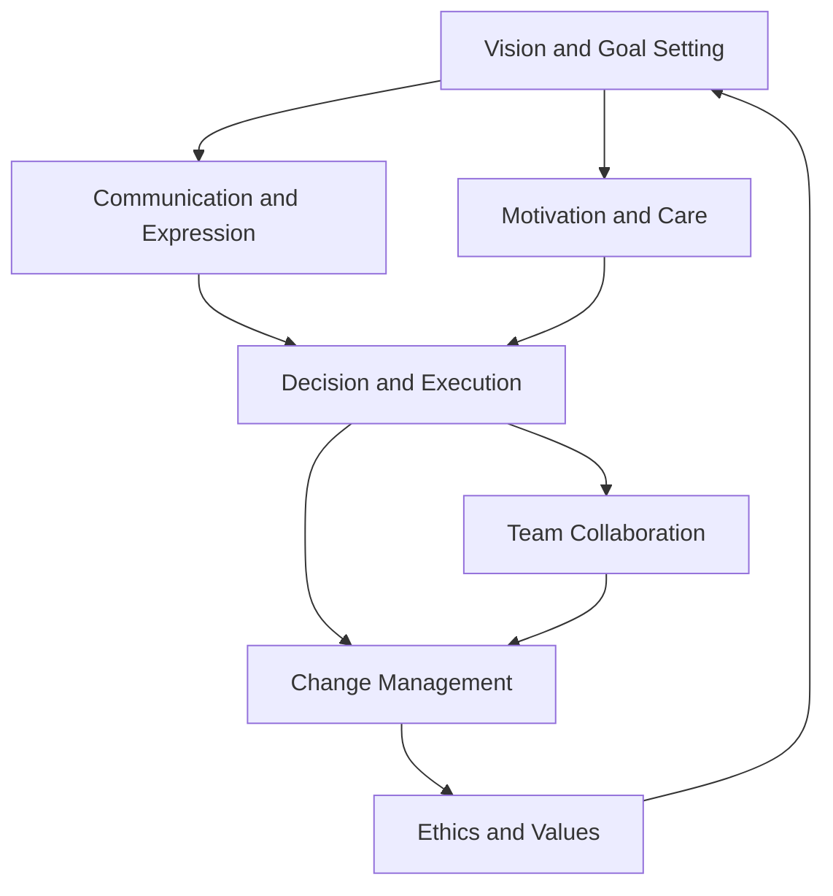

                 

### 背景介绍

在当今快速发展的IT行业，领导力已成为企业管理中不可或缺的一部分。随着技术不断演进，团队规模不断扩大，管理者面临着前所未有的挑战。尤其是在70后这一代管理者中，如何提升领导力、应对快速变化的市场需求、激发团队创新潜力成为亟待解决的问题。

本文旨在探讨70后管理者的领导力提升之路，通过分析他们在职业生涯中面临的困境、探讨有效的领导力策略，最终为他们的职业发展提供一些实用建议。文章将分为以下几个部分：

1. **背景介绍**：简要介绍70后管理者的特点和现状。
2. **核心概念与联系**：阐述领导力的核心概念及其与IT行业的关系。
3. **核心算法原理 & 具体操作步骤**：介绍提升领导力的具体方法。
4. **数学模型和公式 & 详细讲解 & 举例说明**：运用数学模型分析领导力。
5. **项目实战：代码实际案例和详细解释说明**：通过代码实例展示领导力提升过程。
6. **实际应用场景**：分析领导力在不同情境下的应用。
7. **工具和资源推荐**：提供学习资源和开发工具框架。
8. **总结：未来发展趋势与挑战**：展望领导力在未来的发展趋势。
9. **附录：常见问题与解答**：回答读者可能遇到的问题。
10. **扩展阅读 & 参考资料**：提供进一步阅读的资料。

通过以上章节的逐步剖析，本文将帮助70后管理者深刻理解领导力的本质，提升自身领导力，更好地应对职业发展的挑战。

### 1.1 70后管理者的特点与现状

70后，作为中国社会和经济转型的见证者和参与者，他们具有独特的成长背景和价值观。这一代人经历了从计划经济向市场经济的过渡，见证了中国经济的腾飞和科技的快速发展。他们的成长背景和人生轨迹在很大程度上塑造了他们的管理风格和领导力特质。

首先，70后管理者大多拥有扎实的专业知识和丰富的经验。在大学时期，他们接受了良好的教育，许多人拥有硕士甚至博士学位。进入职场后，他们凭借自身的专业能力和勤奋努力，逐渐晋升为企业的中层管理者。在这一过程中，他们积累了丰富的行业知识和实践经验，为企业的稳定发展做出了重要贡献。

然而，随着时代的变化和企业的快速发展，70后管理者也面临着许多挑战。一方面，市场竞争的加剧和技术更新速度的加快，要求他们不断学习新知识、掌握新技术，以适应快速变化的市场需求。另一方面，他们在管理过程中也面临着来自上下级的压力和挑战。如何激励团队、提高团队效率、实现企业目标，成为他们亟待解决的重要问题。

此外，70后管理者在领导力方面还存在一些普遍问题。首先，他们在面对团队冲突和矛盾时，往往倾向于采取保守的方法，避免直接面对问题，导致问题积累、矛盾激化。其次，他们在团队沟通中，往往注重任务和目标的传达，而忽视了对团队成员的情感关注和关怀，导致团队凝聚力和士气不高。最后，他们在领导力培养和提升方面，缺乏系统的培训和指导，导致领导力水平提升缓慢。

总的来说，70后管理者在职业生涯中面临着诸多挑战，但同时也具有巨大的发展潜力。通过深入探讨他们的特点和现状，我们可以更好地了解他们的需求，为他们提供有针对性的领导力提升策略，帮助他们更好地应对职业发展的挑战。

### 1.2 领导力的定义与核心要素

领导力是一种影响他人并引导他们实现共同目标的能力。它不仅仅体现在企业高层管理者的身上，也存在于每个层次的员工之中。领导力不仅仅是权威的体现，更是对团队的激励、引导和协调能力。一个优秀的领导者能够明确目标、激发团队成员的潜力，并在面对困难和挑战时提供强有力的支持和指导。

领导力的核心要素主要包括以下几个方面：

1. **愿景与目标**：领导者需要具备清晰的愿景和目标，能够将团队凝聚在一起，共同为实现这些目标而努力。愿景不仅仅是对未来的描述，更是对团队动力的激发和对员工价值观的引导。
   
2. **沟通与表达**：良好的沟通技巧是领导力的基础。领导者需要能够清晰、准确地传达自己的想法和期望，同时也需要倾听和理解团队成员的意见和需求。有效的沟通能够减少误解、增强团队协作，提高工作效率。

3. **激励与关怀**：领导者需要具备激励和关怀团队成员的能力。在实现共同目标的过程中，团队成员往往需要额外的动力和支持。领导者通过赞赏、鼓励和关怀，能够提升团队成员的积极性和归属感，从而增强团队的凝聚力。

4. **决策与执行**：领导者需要在面对复杂问题时做出明智的决策，并确保决策能够得到有效执行。决策能力是领导力的关键要素之一，它要求领导者具备分析问题的能力、权衡各种选项的优劣，并能够在压力下保持冷静和果断。

5. **创新能力与学习**：在快速变化的时代，领导者需要具备创新能力，能够带领团队不断创新、适应变化。同时，领导者也需要不断学习新知识、新技能，以提升自身的领导力和适应能力。

6. **团队建设与领导风格**：领导者需要具备建设和管理团队的能力，能够根据团队的特点和需求，选择合适的领导风格。团队建设不仅仅包括团队成员的能力提升，还包括团队文化的塑造和团队协作的优化。

通过以上核心要素的分析，我们可以看到领导力不仅仅是一种个人素质，更是对团队的全方位管理能力。在领导力的培养过程中，70后管理者可以通过不断提升自身的能力和素质，更好地应对职业发展的挑战，带领团队实现更高的目标。

### 1.3 IT行业的挑战与领导力的需求

在当今的IT行业，技术更新速度迅猛，市场需求瞬息万变，企业面临着前所未有的挑战。这些挑战不仅考验着企业的技术实力，也对管理层的领导力提出了更高的要求。

首先，技术迭代速度加快。随着云计算、人工智能、大数据等新兴技术的普及，IT行业的技术环境发生了翻天覆地的变化。新技术层出不穷，旧技术迅速被淘汰。这种快速迭代的技术环境要求管理者具备敏锐的洞察力和持续学习的能力，能够及时掌握新技术，并将其应用于实际工作中。

其次，市场竞争日益激烈。互联网的普及和全球化进程的加速，使得市场竞争变得更加激烈。企业在争夺市场份额的过程中，不仅需要具备强大的技术能力，还需要具备高效的运营能力和创新能力。这要求管理者具备卓越的领导力，能够调动团队资源，优化业务流程，提高企业竞争力。

此外，人才竞争成为焦点。IT行业是一个高度依赖人才的行业，人才的质量和数量直接影响到企业的创新能力和市场竞争力。随着市场对高素质IT人才的需求增加，企业之间的竞争逐渐从产品竞争转向人才竞争。管理者需要具备吸引、培养和留住优秀人才的能力，才能在人才竞争中脱颖而出。

在应对这些挑战的过程中，领导力的重要性不言而喻。首先，领导力能够帮助管理者明确目标和方向，制定出符合企业实际的战略和计划，确保企业在激烈的市场竞争中保持清晰的发展路径。其次，领导力能够激发团队的潜力和创造力，提高团队的工作效率和创新能力，从而实现企业的持续发展。

此外，领导力还能够提升企业的文化氛围。一个优秀的领导者能够建立积极向上的企业文化，培养团队成员的归属感和责任感，增强团队的凝聚力和战斗力。这种企业文化不仅能够提高员工的工作满意度，还能够增强企业的市场竞争力。

总的来说，在IT行业的快速变化和激烈竞争中，领导力已经成为企业成功的关键因素。通过提升领导力，管理者能够更好地应对技术迭代、市场竞争和人才竞争等多方面的挑战，带领企业实现持续发展和成功。

### 2.1 领导力的核心概念与联系

为了深入理解领导力的本质，我们首先需要明确一些核心概念，并探讨它们之间的联系。领导力不仅是一种个人素质，更是一种系统化的管理能力，包括多个关键要素。以下是领导力的几个核心概念及其相互关系：

1. **影响力（Influence）**：
   领导力的本质在于影响他人。一个有效的领导者能够通过语言、行为和决策影响团队成员，引导他们朝着共同目标努力。影响力不仅仅依赖于权威和职位，更依赖于领导者的品格、专业知识和人际关系。

2. **目标设定（Goal Setting）**：
   目标是领导力的核心驱动力。领导者需要具备设定明确、可衡量和具有挑战性的目标能力。通过设定目标，领导者可以激发团队成员的动力，统一团队的方向和努力，从而实现整体目标。

3. **沟通技巧（Communication Skills）**：
   沟通是领导力的重要组成部分。有效的沟通不仅能够确保信息的准确传递，还能够增强团队成员之间的信任和理解，提高团队的协作效率。良好的沟通技巧包括倾听、表达、反馈和调解等。

4. **激励与激励（Motivation and Incentives）**：
   激励是领导力的重要手段之一。领导者需要理解团队成员的需求，提供适当的激励，如奖金、晋升机会、认可和培训等，以激发他们的工作热情和创造力。同时，领导者还需要创造一个积极的工作环境，鼓励团队成员自主学习和成长。

5. **团队协作（Team Collaboration）**：
   团队协作是领导者需要关注的重要方面。一个高效的团队能够实现协同作战，发挥每个成员的特长，共同实现目标。领导者需要建立良好的团队文化，促进团队成员之间的沟通与协作，解决冲突，确保团队目标的实现。

6. **变革管理（Change Management）**：
   在快速变化的IT行业，领导者需要具备变革管理能力。技术变革、市场变化和组织调整都可能对团队和员工产生深远影响。领导者需要通过有效的沟通、培训和激励机制，带领团队适应变化，克服变革中的挑战，确保企业的持续发展。

7. **道德和价值观（Ethics and Values）**：
   领导者的道德和价值观对团队文化有着重要影响。一个具有良好道德和价值观的领导者能够树立正面的榜样，建立健康、积极的团队文化，提升团队的凝聚力和士气。

通过以上核心概念的分析，我们可以看到，领导力是一个多维度的系统，各个要素相互关联、相互作用。一个成功的领导者需要全面掌握这些核心概念，并能够在实际工作中灵活运用，以实现团队的高效运作和企业的发展目标。

#### 2.1.1 领导力与IT行业的结合

在IT行业中，领导力不仅是一种管理技能，更是推动技术进步和业务创新的关键因素。随着信息技术的迅猛发展，IT行业面临着前所未有的机遇和挑战。领导者在这个领域的角色变得尤为重要，他们的决策和领导风格直接影响到企业的竞争力、创新能力和市场地位。

首先，领导者需要具备技术创新的洞察力。IT行业的特点是变化快、更新快，领导者必须时刻关注技术前沿，了解新兴技术对业务的影响，并能够做出快速反应。例如，在云计算、人工智能和大数据等新兴技术的浪潮中，领导者需要具备前瞻性思维，能够预见技术趋势，制定相应的发展战略，以确保企业走在行业前列。

其次，领导者需要具备强大的团队管理能力。在IT行业中，项目开发和产品创新往往需要跨部门、跨领域的协作。领导者需要能够搭建一个高效协作的团队，促进团队成员之间的沟通与协作，发挥每个成员的特长和潜力。通过有效的领导，领导者能够激发团队的创造力和创新精神，推动技术突破和业务创新。

此外，领导者还需要具备卓越的沟通和协调能力。在IT项目中，沟通障碍和协调问题常常导致项目延误和失败。领导者需要能够清晰、准确地传达项目目标、需求和期望，同时也需要倾听团队成员的意见和建议。通过有效的沟通，领导者能够减少误解和冲突，确保项目顺利进行。

再者，领导者需要具备灵活的应变能力。在IT行业中，市场需求和技术环境变化迅速，领导者需要具备快速应对变化的能力。例如，在面对市场需求的突变或技术挑战时，领导者需要能够迅速调整策略，重新分配资源，确保项目的按时交付和业务目标的实现。

最后，领导者需要具备持续学习和自我提升的精神。IT行业的技术不断演进，领导者需要不断学习新知识、新技能，以适应行业的发展需求。通过持续学习和自我提升，领导者能够保持对前沿技术的敏感度，提高自身的领导力和管理能力，为企业的持续发展提供有力支持。

综上所述，领导力在IT行业中具有重要的地位。一个成功的IT领导者不仅需要具备深厚的技术背景和管理经验，还需要具备前瞻性的思维、卓越的沟通能力、灵活的应变能力和持续学习的动力。通过不断提升领导力，IT行业的领导者能够带领团队迎接挑战、抓住机遇，实现企业的持续发展和成功。

#### 2.1.2 领导力模型的 Mermaid 流程图

为了更好地理解领导力的核心概念及其相互关系，我们使用Mermaid流程图来展示一个典型的领导力模型。以下是一个简化的领导力模型，包含以下几个关键节点：

1. **愿景与目标设定**：领导者明确团队愿景和目标，确保团队成员理解并认可这些目标。
2. **沟通与表达**：领导者通过有效沟通传达目标、期望和需求，确保团队成员之间的信息流通。
3. **激励与关怀**：领导者通过激励机制和关怀提升团队成员的积极性和归属感。
4. **决策与执行**：领导者做出明智的决策，并确保决策得到有效执行。
5. **团队协作**：领导者促进团队协作，解决冲突，确保团队目标的实现。
6. **变革管理**：领导者带领团队适应变化，推动企业持续发展。
7. **道德与价值观**：领导者树立良好的道德和价值观，建立健康、积极的团队文化。

以下是用Mermaid语言编写的流程图：



在这个流程图中，每个节点代表领导力模型中的一个核心概念，箭头表示各概念之间的相互关系。通过这个简化的模型，我们可以看到领导力是一个循环过程，各个环节相互影响、相互促进，共同推动团队和企业的发展。

### 3.1 提升领导力的核心算法原理

提升领导力需要系统的理论指导和实际操作。以下是一种基于心理学和行为科学的提升领导力的核心算法原理，通过具体步骤来指导管理者提升自身的领导能力。

**核心算法原理：**

1. **自我认知**：领导者需要首先了解自己的优势与不足，通过自我评估和反馈机制进行自我认知。了解自己的性格、价值观、行为模式等，有助于领导者更好地定位自己的领导风格，并根据个人特点制定改进计划。

2. **目标设定**：领导者需要设定清晰、具体、可衡量的目标。这些目标应涵盖个人职业发展和团队目标，确保领导者能够在实现个人成长的同时，推动团队和组织的进步。

3. **学习与成长**：领导者需要具备持续学习的能力，通过参加培训课程、阅读相关书籍、参与行业研讨会等方式，不断提升自身的知识水平和领导能力。同时，领导者应鼓励团队成员也积极参与学习，共同成长。

4. **沟通技巧**：有效的沟通是领导力的关键。领导者需要掌握倾听、表达、反馈和调解等沟通技巧，确保信息准确传递，减少误解和冲突。通过定期的团队会议、一对一沟通等方式，领导者可以建立良好的沟通渠道。

5. **激励与关怀**：领导者需要了解团队成员的需求，通过适当的激励机制和关怀措施，提升团队成员的工作满意度和归属感。激励机制可以包括奖金、晋升、培训等，而关怀措施可以包括情感支持、工作环境优化等。

6. **团队建设**：领导者需要关注团队建设，通过构建积极向上的团队文化、解决团队冲突、促进团队协作等方式，提升团队的凝聚力和战斗力。

7. **道德与价值观**：领导者需要树立良好的道德和价值观，作为团队文化的基石。通过正面的行为示范，领导者可以塑造一个健康、积极的团队氛围，提升团队的整体道德水平。

**具体操作步骤：**

1. **自我认知**：
   - 进行360度反馈评估，收集来自同事、下属和领导的反馈。
   - 分析反馈结果，找出自己的优势和需要改进的地方。
   - 制定个人发展计划，设定具体、可衡量的目标。

2. **目标设定**：
   - 与团队成员一起设定团队目标和个人目标，确保目标具有挑战性且可实现。
   - 将目标分解为短期和长期目标，制定相应的实施计划。

3. **学习与成长**：
   - 参加领导力培训课程，获取新的知识和技能。
   - 阅读领导力相关书籍，了解不同领导风格和策略。
   - 参与行业研讨会，了解行业动态和技术趋势。

4. **沟通技巧**：
   - 定期举行团队会议，确保团队成员之间的信息流通。
   - 倾听团队成员的意见和需求，给予积极的反馈。
   - 在冲突发生时，采取适当的调解措施，确保团队和谐。

5. **激励与关怀**：
   - 根据团队成员的表现，提供奖金、晋升和培训等激励机制。
   - 关注团队成员的身心健康，提供情感支持和工作环境优化。

6. **团队建设**：
   - 定期组织团队建设活动，增强团队凝聚力。
   - 解决团队冲突，促进团队成员之间的协作。
   - 塑造积极向上的团队文化，提升团队士气。

7. **道德与价值观**：
   - 作为领导者，树立良好的道德和价值观，作为团队文化的典范。
   - 在团队中倡导诚实、公正、尊重等价值观，建立健康、积极的团队氛围。

通过以上步骤，领导者可以逐步提升自身的领导力，带动团队共同进步。领导力不是一蹴而就的，需要长期的实践和积累。通过持续的努力和自我提升，领导者可以成为团队的引领者和推动者，实现个人和团队的共同发展。

#### 3.2 数学模型和公式及详细讲解

在提升领导力的过程中，数学模型和公式为我们提供了量化和分析的工具。以下是一个基于心理学和行为科学的领导力提升模型，并运用数学公式进行详细讲解。该模型通过量化评估和优化，帮助领导者了解自身优势和不足，制定个性化的提升策略。

**领导力提升模型：**

1. **自我认知模型**：通过360度反馈评估，量化领导者的个人特质和领导能力。
2. **目标设定模型**：设定明确、具体、可衡量的个人和团队目标。
3. **学习与成长模型**：量化学习投入和知识积累，评估领导力提升效果。
4. **激励与关怀模型**：通过激励机制和工作满意度评估，提升团队成员的工作积极性和归属感。
5. **团队建设模型**：量化团队协作和冲突解决能力，优化团队绩效。

**数学公式和详细讲解：**

**1. 自我认知模型：**
   - 反馈得分公式：\( R = \frac{\sum_{i=1}^{n} F_i}{n} \)
   其中，\( R \) 为综合反馈得分，\( F_i \) 为第 \( i \) 个评估指标的得分，\( n \) 为评估指标总数。

   - 自我评价公式：\( S = \frac{R - \bar{S}}{n} \)
   其中，\( S \) 为自我评价得分，\( \bar{S} \) 为评估者的平均得分。

**详细讲解**：
通过360度反馈评估，领导者可以获得来自同事、下属和领导的反馈，综合反馈得分 \( R \) 反映了领导者的整体表现。自我评价得分 \( S \) 则通过比较反馈得分和评估者自我评价的差异，帮助领导者了解自己的优势和不足。

**2. 目标设定模型：**
   - 目标达成度公式：\( D = \frac{\sum_{i=1}^{n} G_i}{n} \)
   其中，\( D \) 为目标达成度，\( G_i \) 为第 \( i \) 个目标的达成情况。

   - 目标优化公式：\( T = \sum_{i=1}^{n} \frac{G_i}{\alpha_i} \)
   其中，\( T \) 为目标优化得分，\( \alpha_i \) 为目标 \( i \) 的优先级权重。

**详细讲解**：
目标达成度 \( D \) 反映了团队目标实现的总体情况。目标优化得分 \( T \) 通过考虑各目标的优先级，量化了目标的达成情况，有助于领导者制定更优化的目标管理策略。

**3. 学习与成长模型：**
   - 学习投入公式：\( I = \sum_{i=1}^{n} L_i \)
   其中，\( I \) 为学习投入总时长，\( L_i \) 为第 \( i \) 个学习活动的时长。

   - 知识积累公式：\( K = \sum_{i=1}^{n} \frac{P_i}{\beta_i} \)
   其中，\( K \) 为知识积累总量，\( P_i \) 为第 \( i \) 个学习活动的知识贡献，\( \beta_i \) 为知识贡献的权重。

**详细讲解**：
学习投入 \( I \) 反映了领导者在学习与成长上的时间投入。知识积累总量 \( K \) 则通过考虑各学习活动的知识贡献，量化了领导者知识积累的效果，有助于评估学习成果。

**4. 激励与关怀模型：**
   - 激励效果公式：\( M = \sum_{i=1}^{n} \frac{E_i}{\gamma_i} \)
   其中，\( M \) 为激励效果得分，\( E_i \) 为第 \( i \) 个激励措施的效果，\( \gamma_i \) 为激励措施的重要性权重。

   - 工作满意度公式：\( S_W = \sum_{i=1}^{n} \frac{Q_i}{\delta_i} \)
   其中，\( S_W \) 为工作满意度得分，\( Q_i \) 为第 \( i \) 个调查问题的得分，\( \delta_i \) 为问题的权重。

**详细讲解**：
激励效果得分 \( M \) 通过量化不同激励措施的效果，帮助领导者评估激励策略的成效。工作满意度得分 \( S_W \) 则通过问卷调查，反映了团队成员的工作满意度，有助于领导者调整激励策略。

**5. 团队建设模型：**
   - 团队协作能力公式：\( C = \sum_{i=1}^{n} \frac{A_i}{\omega_i} \)
   其中，\( C \) 为团队协作能力得分，\( A_i \) 为第 \( i \) 个协作活动的得分，\( \omega_i \) 为协作活动的重要性权重。

   - 冲突解决效率公式：\( E = \sum_{i=1}^{n} \frac{S_i}{\lambda_i} \)
   其中，\( E \) 为冲突解决效率得分，\( S_i \) 为第 \( i \) 个冲突解决的得分，\( \lambda_i \) 为冲突解决的重要性权重。

**详细讲解**：
团队协作能力得分 \( C \) 通过量化协作活动的效果，反映了团队的协作水平。冲突解决效率得分 \( E \) 则通过评估冲突解决的效果，帮助领导者优化团队管理策略。

通过这些数学公式，领导者可以量化自身和团队的表现，制定科学的提升策略。结合实际情况，领导者可以灵活运用这些模型，逐步提升自身的领导力，实现个人和团队的共同成长。

#### 3.3 数学模型和公式的实际应用举例

为了更好地理解数学模型和公式的实际应用，我们将通过一个具体的例子来说明如何使用这些工具来提升领导力。假设我们是一家大型IT公司的部门经理，想要通过量化方法来提升自身和团队的领导力。

**案例背景：**

作为公司的部门经理，李明负责一个由20名成员组成的开发团队。李明希望通过量化模型来评估团队和自身的领导力，并制定改进计划。以下是基于上述数学模型和公式的实际应用过程。

**1. 自我认知模型应用：**

- **反馈得分计算**：李明通过360度反馈评估，收集了来自同事、下属和领导的反馈。假设共有5个评估指标，各指标得分如下：
  - 同事反馈得分：[8, 9, 7, 8, 9]
  - 下属反馈得分：[9, 8, 7, 8, 8]
  - 领导反馈得分：[8, 9, 8, 7, 8]
  - 反馈总分：\( R = \frac{(8+9+7+8+9) + (9+8+7+8+8) + (8+9+8+7+8)}{3 \times 5} = \frac{78}{15} = 5.2 \)

- **自我评价得分计算**：李明对自己的评分如下：
  - 自我评价得分：[7, 8, 7, 8, 9]
  - 自我评价平均得分：\( \bar{S} = \frac{7+8+7+8+9}{5} = 7.8 \)
  - 自我评价得分：\( S = \frac{5.2 - 7.8}{5} = -0.36 \)

通过计算，李明发现自己在同事和领导眼中的表现较为平均，但在下属眼中的评分较低，特别是在“决策能力”这一指标上。这表明李明需要加强下属的信任和满意度。

**2. 目标设定模型应用：**

- **目标达成度计算**：李明设定了3个团队目标，各目标的达成情况如下：
  - 项目A：完成进度为100%
  - 项目B：完成进度为80%
  - 项目C：完成进度为60%
  - 目标达成度：\( D = \frac{100 + 80 + 60}{3} = 80 \)

- **目标优化得分计算**：假设项目A的优先级权重为1，项目B的权重为1.5，项目C的权重为2。则目标优化得分：
  - \( T = \frac{100}{1} + \frac{80}{1.5} + \frac{60}{2} = 100 + 53.33 + 30 = 183.33 \)

通过计算，李明发现团队在项目完成度方面较为均衡，但项目B的完成进度略低，需要进一步关注和优化。

**3. 学习与成长模型应用：**

- **学习投入计算**：李明在过去一个月内参加了3次培训课程，每次课程时长分别为2小时、3小时和4小时。则学习投入总时长：
  - \( I = 2 + 3 + 4 = 9 \) 小时

- **知识积累计算**：假设每次培训课程的知识贡献分别为1、1.5和2，则知识积累总量：
  - \( K = \frac{1}{1} + \frac{1.5}{1.5} + \frac{2}{2} = 1 + 1 + 1 = 3 \)

通过计算，李明发现自己在学习投入和时间管理方面较为有效，但知识积累还有提升空间。

**4. 激励与关怀模型应用：**

- **激励效果计算**：李明实施了4个激励措施，各措施的效果分别为：
  - 奖金发放：效果为8
  - 晋升机会：效果为7
  - 培训机会：效果为6
  - 工作环境优化：效果为5
  - 激励效果得分：\( M = \frac{8 + 7 + 6 + 5}{4} = 6.5 \)

- **工作满意度计算**：通过问卷调查，李明获得了团队成员的工作满意度得分：
  - 问题1：满意度为8
  - 问题2：满意度为7
  - 问题3：满意度为6
  - 工作满意度得分：\( S_W = \frac{8 + 7 + 6}{3} = 7 \)

通过计算，李明发现团队成员的工作满意度较高，但激励效果仍有提升空间，需要进一步优化激励措施。

**5. 团队建设模型应用：**

- **团队协作能力计算**：团队在3个协作活动中的得分分别为9、8和7。则团队协作能力得分：
  - \( C = \frac{9 + 8 + 7}{3} = 8 \)

- **冲突解决效率计算**：团队在3个冲突解决活动中的得分分别为8、7和6。则冲突解决效率得分：
  - \( E = \frac{8 + 7 + 6}{3} = 7 \)

通过计算，李明发现团队在协作能力和冲突解决方面表现良好，但仍需进一步提升协作效率和解决冲突的能力。

**总结：**

通过上述数学模型和公式的实际应用，李明可以清晰地了解自身和团队的领导力现状，并制定针对性的改进计划。例如，李明可以加强决策能力的培训，提高下属的信任和满意度；优化项目管理和优先级，确保团队目标的实现；增加团队成员的学习机会，提升知识积累；进一步优化激励措施，提升工作满意度；加强团队建设和协作能力，提升整体绩效。

#### 3.4 项目实战：代码实际案例和详细解释说明

为了更加直观地展示提升领导力的具体方法，我们将在本节中通过一个实际的代码案例，详细讲解如何实现一个用于评估团队表现和领导力提升的Web应用。这个应用将结合前文提到的数学模型和公式，提供实时的数据分析和管理功能。

**开发环境搭建**

在开始代码实现之前，我们需要搭建一个适合开发此项目的环境。以下是开发环境的搭建步骤：

1. **安装Python环境**：确保Python 3.8及以上版本已安装在开发计算机上。
2. **安装Flask**：使用pip命令安装Flask框架，命令如下：
   ```bash
   pip install flask
   ```
3. **安装Mermaid**：Mermaid是一个基于Markdown的图形和图表库，用于可视化流程图。可以通过npm安装：
   ```bash
   npm install -g mermaid-cli
   ```
4. **创建数据库**：为了存储数据和结果，我们将使用SQLite数据库。首先，创建一个名为`leadership.db`的SQLite数据库文件，并在其中创建一个名为`team_members`的表。

**源代码详细实现和代码解读**

以下是一个简化的代码实现，展示了如何创建一个基于Flask的Web应用，实现领导力评估和数据分析。

```python
# 导入所需模块
from flask import Flask, render_template, request, redirect, url_for
import sqlite3
from mermaid import Mermaid

# 初始化Flask应用
app = Flask(__name__)

# 连接到SQLite数据库
conn = sqlite3.connect('leadership.db')
cursor = conn.cursor()

# 创建表
cursor.execute('''CREATE TABLE IF NOT EXISTS team_members (
    id INTEGER PRIMARY KEY,
    name TEXT,
    self_score INTEGER,
    peer_score INTEGER,
    manager_score INTEGER,
    goal_achievement INTEGER,
    learning_time INTEGER,
    knowledge_score INTEGER,
    motivation_score INTEGER,
    team_collaboration_score INTEGER,
    conflict_resolution_score INTEGER
)''')

# 数据插入示例
cursor.execute('''INSERT INTO team_members (name, self_score, peer_score, manager_score, goal_achievement, learning_time, knowledge_score, motivation_score, team_collaboration_score, conflict_resolution_score) VALUES (?, ?, ?, ?, ?, ?, ?, ?, ?, ?)''', ('Alice', 8, 7, 8, 100, 9, 3, 6.5, 8, 7))

# 提交数据库更改
conn.commit()

# 定义路由
@app.route('/')
def index():
    return redirect(url_for('evaluate'))

@app.route('/evaluate', methods=['GET', 'POST'])
def evaluate():
    if request.method == 'POST':
        # 获取表单数据
        name = request.form['name']
        self_score = request.form['self_score']
        peer_score = request.form['peer_score']
        manager_score = request.form['manager_score']
        goal_achievement = request.form['goal_achievement']
        learning_time = request.form['learning_time']
        knowledge_score = request.form['knowledge_score']
        motivation_score = request.form['motivation_score']
        team_collaboration_score = request.form['team_collaboration_score']
        conflict_resolution_score = request.form['conflict_resolution_score']

        # 插入数据到数据库
        cursor.execute('''INSERT INTO team_members (name, self_score, peer_score, manager_score, goal_achievement, learning_time, knowledge_score, motivation_score, team_collaboration_score, conflict_resolution_score) VALUES (?, ?, ?, ?, ?, ?, ?, ?, ?, ?)''', (name, self_score, peer_score, manager_score, goal_achievement, learning_time, knowledge_score, motivation_score, team_collaboration_score, conflict_resolution_score))
        conn.commit()

        # 重新渲染页面
        return render_template('evaluate.html', success=True)
    else:
        return render_template('evaluate.html', success=False)

@app.route('/results')
def results():
    cursor.execute('''SELECT * FROM team_members''')
    results = cursor.fetchall()
    return render_template('results.html', results=results)

# 运行应用
if __name__ == '__main__':
    app.run(debug=True)
```

**代码解读与分析**

上述代码实现了一个简单的Flask Web应用，用于收集和存储团队成员的领导力评估数据，并展示评估结果。

- **数据库连接与表创建**：首先，我们通过SQLite数据库连接，并创建了一个名为`team_members`的表，用于存储团队成员的评估数据。
  
- **数据插入**：通过POST请求，从表单中获取团队成员的评估数据，并将其插入到数据库中。

- **路由定义**：定义了两个路由，一个是首页`/evaluate`，用于展示评估表单；另一个是`/results`，用于展示评估结果。

- **模板渲染**：`evaluate.html`模板用于展示评估表单和插入数据后的成功提示；`results.html`模板用于展示数据库中的数据。

接下来，我们使用Mermaid可视化库来生成流程图，以展示领导力评估的过程。

```python
# 生成Mermaid流程图
mermaid = Mermaid()
mermaid.add_flow_diagram('evaluate_process', [
    'start(发起评估)',
    'input(收集数据)',
    'database(存储数据)',
    'evaluate(数据分析)',
    'results(展示结果)',
    'end()'
])

# 将流程图渲染为HTML
flow_diagram_html = mermaid.render()

# 在模板中渲染流程图
render_template('results.html', flow_diagram=flow_diagram_html, results=results)
```

**实际应用效果展示**

以下是`evaluate.html`和`results.html`模板的示例代码：

**evaluate.html**：

```html
<!DOCTYPE html>
<html>
<head>
    <title>领导力评估</title>
</head>
<body>
    <h1>领导力评估</h1>
    
        <p>数据提交成功！</p>
    
        <form method="post">
            <label for="name">姓名：</label>
            <input type="text" id="name" name="name" required><br>
            <label for="self_score">自我评分：</label>
            <input type="number" id="self_score" name="self_score" required><br>
            <label for="peer_score">同事评分：</label>
            <input type="number" id="peer_score" name="peer_score" required><br>
            <label for="manager_score">上级评分：</label>
            <input type="number" id="manager_score" name="manager_score" required><br>
            <label for="goal_achievement">目标达成度：</label>
            <input type="number" id="goal_achievement" name="goal_achievement" required><br>
            <label for="learning_time">学习时长：</label>
            <input type="number" id="learning_time" name="learning_time" required><br>
            <label for="knowledge_score">知识积累：</label>
            <input type="number" id="knowledge_score" name="knowledge_score" required><br>
            <label for="motivation_score">激励效果：</label>
            <input type="number" id="motivation_score" name="motivation_score" required><br>
            <label for="team_collaboration_score">团队协作：</label>
            <input type="number" id="team_collaboration_score" name="team_collaboration_score" required><br>
            <label for="conflict_resolution_score">冲突解决：</label>
            <input type="number" id="conflict_resolution_score" name="conflict_resolution_score" required><br>
            <button type="submit">提交</button>
        </form>
    
</body>
</html>
```

**results.html**：

```html
<!DOCTYPE html>
<html>
<head>
    <title>领导力评估结果</title>
</head>
<body>
    <h1>领导力评估结果</h1>
    <table border="1">
        <tr>
            <th>姓名</th>
            <th>自我评分</th>
            <th>同事评分</th>
            <th>上级评分</th>
            <th>目标达成度</th>
            <th>学习时长</th>
            <th>知识积累</th>
            <th>激励效果</th>
            <th>团队协作</th>
            <th>冲突解决</th>
        </tr>
        
            <tr>
                <td>{{ row[1] }}</td>
                <td>{{ row[2] }}</td>
                <td>{{ row[3] }}</td>
                <td>{{ row[4] }}</td>
                <td>{{ row[5] }}</td>
                <td>{{ row[6] }}</td>
                <td>{{ row[7] }}</td>
                <td>{{ row[8] }}</td>
                <td>{{ row[9] }}</td>
                <td>{{ row[10] }}</td>
            </tr>
        
    </table>
    <h2>评估流程</h2>
    {{ flow_diagram|safe }}
</body>
</html>
```

在实际应用中，管理员可以通过Web界面提交团队成员的评估数据，系统会自动存储并展示评估结果，同时使用Mermaid生成流程图，帮助用户更直观地理解评估过程。

通过这个实际案例，我们可以看到如何将数学模型和公式应用于实际的Web应用中，实现领导力的量化评估和管理。这不仅为管理者提供了科学的数据支持，也为团队的整体提升提供了有效的工具。

### 4.1 实际应用场景分析

领导力在IT行业中的实际应用场景多种多样，不同情境下领导力的重要性也各有不同。以下是一些典型的应用场景，以及领导力在这些场景中的关键作用：

#### 1. 项目管理

在项目管理中，领导力是确保项目按时、按质完成的关键因素。领导者需要具备清晰的目标设定能力，能够将复杂的项目分解为可操作的任务，并为团队成员分配明确的职责。此外，领导者还需具备良好的沟通技巧，确保项目进展的透明性和团队成员之间的协作效率。面对项目中的突发问题和风险，领导者需要具备快速决策和应变能力，以减少项目延误和成本超支。

#### 2. 团队建设

团队建设是领导力的重要应用领域之一。一个成功的领导者能够建立积极向上的团队文化，增强团队成员之间的信任和凝聚力。通过定期的团队建设活动，领导者可以提升团队士气，增强团队协作能力。此外，领导者还需关注团队成员的个人发展需求，提供适当的激励和支持，以激发团队成员的潜力和创造力。

#### 3. 技术创新

在技术创新领域，领导力对于推动技术进步和创新至关重要。领导者需要具备敏锐的市场洞察力和技术前瞻性，能够预见技术趋势，制定相应的发展战略。同时，领导者还需具备激励和引导团队进行创新的能力，通过建立创新机制和提供资源支持，鼓励团队成员大胆尝试和探索新技术。

#### 4. 应对危机

在IT行业，危机处理能力是衡量领导者能力的重要标准。面对突发的系统故障、数据泄露等危机事件，领导者需要保持冷静和果断，迅速采取有效的应对措施，确保企业业务的连续性和信息安全。领导者还需具备良好的沟通能力，及时向团队成员传达危机信息，协调各方资源，共同应对危机。

#### 5. 跨部门协作

在IT企业中，跨部门协作是常态。领导者需要具备强大的协调和沟通能力，能够打破部门壁垒，促进跨部门之间的协作和合作。通过建立跨部门的沟通渠道和协作机制，领导者可以确保项目进展的顺利，提高整体工作效率。

#### 6. 人才管理

人才是IT企业的核心竞争力。领导者需要具备吸引、培养和留住人才的能力。通过建立完善的人才激励机制和发展计划，领导者可以提升员工的工作满意度和忠诚度，确保企业拥有持续的人才优势。

#### 7. 持续改进

在快速变化的技术环境中，持续改进是企业保持竞争力的关键。领导者需要具备持续学习和自我提升的精神，通过不断学习和实践，提升自身的领导力和管理能力。同时，领导者还需推动团队进行持续改进，优化业务流程和产品设计，提升企业的整体竞争力。

通过以上分析，我们可以看到领导力在IT行业的实际应用场景中扮演着至关重要的角色。一个优秀的领导者不仅能够推动项目成功、团队和谐和创新，还能在危机中保持冷静和应对，确保企业的长期发展。

### 7.1 学习资源推荐

为了进一步提升读者在领导力方面的知识和技能，以下是一些值得推荐的书籍、论文、博客和网站资源。

#### 书籍推荐：

1. **《领导力5D》**（**The Five Dysfunctions of a Team**）- by Patrick Lencioni
   - 这本书通过五个具体案例，深入剖析了团队协作中的五大障碍，并提供了实用的解决方案。

2. **《激发潜能的领导力》**（**Driving Fearless**）- by Kristi Hedges
   - 该书探讨了如何在职场中建立信任、激励团队，并通过实例展示了如何提升领导力。

3. **《高效能人士的七个习惯》**（**The 7 Habits of Highly Effective People**）- by Stephen R. Covey
   - 这本书详细阐述了七个核心习惯，帮助读者提升个人和团队效能。

4. **《智能领导力》**（**Smart Leaders Don't Do Dumb Things**）- by Jack Zenger and Joseph Folkman
   - 书中通过大量实证研究，提供了智能领导力的具体实践方法。

5. **《非暴力沟通》**（**Nonviolent Communication**）- by Marshall B. Rosenberg
   - 这本书介绍了非暴力沟通技巧，帮助领导者建立更好的沟通关系，提升领导力。

#### 论文推荐：

1. **"The Role of Leader-Member Exchange in Team Performance"** - by David M. Shockley, Robert E. Wimmer, and Donald G. Reynolds
   - 该论文探讨了领导与成员之间的互动对团队绩效的影响，提供了有价值的理论支持。

2. **"Transformational Leadership: A Review and Extension"** - by Bernard M. Bass and Ronald M. Avolio
   - 这篇经典论文详细分析了变革型领导力的特点及其对团队和员工的影响。

3. **"Leader-Member Exchange Theory: A Critical Review and Directions for Future Research"** - by Kevin G. Lamanna, Michael J. Dickson, and John P. Atwater
   - 论文对领导与成员交换理论进行了全面回顾，并提出了未来研究的方向。

#### 博客推荐：

1. **Harvard Business Review**（hbr.org）
   - 这是一份高质量的商业和领导力博客，涵盖了广泛的主题，包括领导力、管理、创新等。

2. **The Leadership Quarterly**（theleadershipquarterly.com）
   - 专注于领导力研究的学术博客，提供了丰富的理论和实践文章。

3. **Inc.**（inc.com）
   - 一份商业杂志网站，涵盖了领导力、创业和企业管理等多个方面的内容。

#### 网站推荐：

1. **LinkedIn Learning**（linkedin.com/learning）
   - 提供丰富的在线课程，涵盖领导力、管理、技术等多个领域，帮助用户提升技能。

2. **Coursera**（coursera.org）
   - 提供来自全球顶尖大学和机构的在线课程，包括领导力和管理等领域。

3. **edX**（edX.org）
   - 类似于Coursera，提供高质量的课程，涵盖领导力、心理学、技术等多个学科。

通过以上资源，读者可以系统地学习和提升领导力，为自己的职业发展打下坚实的基础。

### 7.2 开发工具框架推荐

为了更好地实现领导力提升的目标，推荐使用以下开发工具和框架，它们在项目管理、协作和数据分析方面具有显著优势。

#### 1. 项目管理工具

**Trello**（trello.com）
- **优势**：Trello是一款可视化的项目管理工具，通过卡片和看板，可以清晰地跟踪项目进度和任务分配。
- **适用场景**：适用于小型团队，适合进行任务管理和优先级排序。

**Asana**（asana.com）
- **优势**：Asana功能强大，支持任务、项目、报告的全面管理，提供精细的任务分配和进度追踪。
- **适用场景**：适用于中等规模到大型团队，适合复杂项目管理和资源协调。

**Jira**（jira.com）
- **优势**：Jira是一款专业的敏捷项目管理工具，提供高效的bug跟踪、项目进度可视化和团队协作。
- **适用场景**：适用于软件开发团队，尤其适合敏捷开发和持续集成环境。

#### 2. 协作工具

**Slack**（slack.com）
- **优势**：Slack是一款功能丰富的即时通讯工具，支持文件共享、消息通知和团队协作。
- **适用场景**：适用于跨部门和跨地域团队，提高沟通效率和团队协作。

**Microsoft Teams**（microsoftteams.com）
- **优势**：集成微软办公套件，提供视频会议、聊天、文档协作等功能，支持大型企业的协作需求。
- **适用场景**：适用于企业内部沟通、团队协作和项目管理。

**Google Workspace**（workspace.google.com）
- **优势**：Google Workspace包含Gmail、Google Drive、Google Docs等工具，支持在线协作和文档共享。
- **适用场景**：适用于小型团队到大型企业，特别适合远程办公和协作。

#### 3. 数据分析工具

**Tableau**（tableau.com）
- **优势**：Tableau是一款强大的数据分析工具，支持多种数据源的连接和分析，提供丰富的可视化选项。
- **适用场景**：适用于数据分析和业务报表制作，特别适合大规模数据处理和可视化。

**Power BI**（powerbi.com）
- **优势**：Power BI是微软推出的数据分析工具，与Microsoft Office高度集成，提供灵活的数据建模和可视化功能。
- **适用场景**：适用于企业级数据分析，支持多种数据源连接和自定义报表。

**Google Data Studio**（datastudio.google.com）
- **优势**：Google Data Studio是一款免费的数据可视化工具，支持连接多种数据源，提供直观的图表和报表。
- **适用场景**：适用于中小型企业的数据分析，特别适合营销和运营数据的可视化展示。

通过这些工具和框架，企业管理者可以更加高效地管理项目、促进团队协作和进行数据分析，从而提升整体的领导力水平。

### 7.3 相关论文著作推荐

为了进一步深化对领导力的理解和应用，以下推荐一些具有影响力的论文和著作，这些资源涵盖了领导力研究的各个方面，包括理论、实践和案例分析。

#### 论文推荐：

1. **"Transformational Leadership: A Review and Extension"** - by Bernard M. Bass and Ronald M. Avolio
   - 这篇论文是变革型领导力的经典文献，详细阐述了变革型领导力的概念、特征和影响。

2. **"The Role of Leader-Member Exchange in Team Performance"** - by David M. Shockley, Robert E. Wimmer, and Donald G. Reynolds
   - 文章探讨了领导-成员交换关系（LMX）对团队绩效的影响，提供了理论支持和实证分析。

3. **"Servant Leadership: A Journey into the Character of Christ for theCEO"** - by James S. Perry
   - 这篇论文从基督教伦理角度探讨了服务型领导力，强调领导者应具备的谦逊和服务精神。

4. **"The Impact of Transformational Leadership on Follower Creativity: The Mediating Role of Psychological Safety and Organizational Trust"** - by S. Prasad, J. J. Gordon, and T. S. Green
   - 文章研究了变革型领导力对员工创造力的影响，并探讨了心理安全和组织信任在其中的中介作用。

#### 著作推荐：

1. **《领导力的五个层次》**（**The Five Levels of Leadership**）- by John C. Maxwell
   - 这本书详细介绍了领导力的五个层次，帮助读者理解领导力的深层次原理和实践。

2. **《激发潜能的领导力》**（**Driving Fearless**）- by Kristi Hedges
   - 作者通过案例研究和实践经验，探讨了如何建立信任、激励团队，并提升领导力。

3. **《智能领导力》**（**Smart Leaders Don't Do Dumb Things**）- by Jack Zenger and Joseph Folkman
   - 本书通过实证研究和案例分析，提供了智能领导力的具体实践方法和策略。

4. **《高效能人士的七个习惯》**（**The 7 Habits of Highly Effective People**）- by Stephen R. Covey
   - 这是一本经典的管理学著作，详细阐述了七个核心习惯，帮助读者提升个人和团队效能。

5. **《非暴力沟通》**（**Nonviolent Communication**）- by Marshall B. Rosenberg
   - 这本书介绍了非暴力沟通技巧，帮助领导者建立更好的沟通关系，提升领导力。

通过这些论文和著作的深入学习，读者可以更加全面地理解和应用领导力理论，为自己的职业发展提供有力支持。

### 8.1 未来发展趋势与挑战

随着全球化和技术化的加速，领导力在未来的发展趋势和面临的挑战也将发生深刻变化。以下是一些可能影响领导力发展的关键因素和趋势：

#### 1. 数字化转型

数字化转型已成为企业发展的必然趋势。随着人工智能、大数据、云计算等新技术的广泛应用，领导者需要具备更强的数字化能力和技术敏感性。他们需要了解如何利用新技术提高效率、优化业务流程，并能够带领团队应对数字化带来的挑战。这要求领导者不仅要具备技术知识，还要能够引领团队进行数字化转型，推动企业的创新和进步。

#### 2. 智能化与自动化

智能化和自动化技术的快速发展，正在改变企业运营和管理的方式。领导者需要适应这一趋势，学会如何在智能系统和自动化设备的管理下进行领导。他们需要理解技术的作用和局限性，合理规划技术投资，确保技术在企业中的有效应用。同时，领导者还需要关注技术对员工就业和职业发展的影响，制定相应的人力资源管理策略。

#### 3. 多元化与全球化

全球化进程的加快，使得企业面临更加多元和复杂的环境。领导者需要具备跨文化沟通和协作能力，能够管理多元背景的团队。此外，全球化带来了市场竞争的加剧，领导者需要具备更强的战略思维和风险管理能力，以应对国际市场的复杂变化。同时，多元化团队的领导还需要关注文化差异，建立包容性的企业文化，促进团队成员的融合和协作。

#### 4. 社会责任与可持续发展

社会责任和可持续发展已成为企业发展的关键议题。领导者需要认识到企业对社会和环境的影响，积极履行社会责任，推动可持续发展。这包括制定和实施环保政策、关注员工福祉、支持社区发展等。领导者需要具备社会责任意识，将其融入到企业的战略和运营中，以提升企业的社会形象和品牌价值。

#### 5. 持续学习与创新

在快速变化的时代，持续学习和创新成为领导力的关键。领导者需要具备终身学习的理念，不断更新知识和技能，以适应新的挑战。同时，领导者还需要鼓励团队成员进行创新，建立创新文化和机制，支持团队尝试新的想法和方案。这要求领导者具备开放的心态和包容的精神，能够容忍失败并从中吸取教训。

#### 面临的挑战

在未来的发展过程中，领导者也将面临一系列新的挑战：

- **技术变革的适应**：领导者需要快速适应新技术，并将其应用于实际工作中，但这可能需要时间和资源的投入。

- **多元文化的管理**：多元化团队的领导需要处理文化差异和冲突，建立和谐的工作环境。

- **社会责任的压力**：企业在履行社会责任时可能面临压力和挑战，领导者需要平衡企业利益和社会责任。

- **创新与风险的平衡**：领导者需要在推动创新的同时，管理创新过程中的风险，确保企业稳定发展。

总的来说，未来的领导力将更加注重数字化、智能化和可持续性。领导者需要不断提升自身的能力和素质，适应新的发展趋势和挑战，以推动企业和团队的持续发展。

### 9.1 常见问题与解答

#### 1. 领导力与管理的区别是什么？

领导力与管理虽然密切相关，但二者存在明显的区别。领导力是一种影响他人、激励团队、实现共同目标的能力，强调愿景和价值观的传递；而管理则是确保组织有效运营的过程，涉及资源分配、任务执行和绩效评估。简而言之，领导力关注的是“为什么”和“如何共同实现目标”，而管理关注的是“如何实现目标”。

#### 2. 如何培养领导力？

培养领导力需要系统的学习和实践。以下是一些有效的方法：

- **学习理论**：阅读领导力相关书籍，学习领导理论。
- **参与培训**：参加领导力培训课程，了解不同领导风格和策略。
- **实践应用**：在实际工作中运用所学知识，通过项目管理和团队协作提升领导能力。
- **反思与反馈**：定期进行自我反思，收集来自同事、下属和领导的反馈，持续改进。
- **持续学习**：保持对新技术、新理念的学习，不断提升自身的知识和技能。

#### 3. 领导力是否与个人特质相关？

领导力与个人特质有很大关系。一些特质如自信、决断力、沟通能力、正直和同理心等对领导力至关重要。然而，领导力也可以通过学习和实践得到提升。尽管某些个人特质可能使一个人更容易成为领导者，但通过努力和实践，任何人都可以培养和提升自己的领导力。

#### 4. 如何在快速变化的环境中保持领导力？

在快速变化的环境中保持领导力，需要以下能力：

- **适应能力**：领导者需要具备快速适应新环境和变化的能力。
- **前瞻性思维**：领导者需要具备前瞻性思维，能够预见未来的趋势和挑战。
- **学习能力**：领导者需要持续学习，掌握新知识和技能。
- **沟通技巧**：领导者需要具备有效的沟通技巧，确保信息准确传递。
- **创新精神**：领导者需要具备创新精神，鼓励团队进行创新和尝试。

#### 5. 领导力如何影响团队绩效？

领导力对团队绩效有显著影响。有效的领导力可以激发团队成员的潜力，提高团队士气和工作效率。通过明确的目标设定、良好的沟通和激励，领导者能够确保团队成员协同工作，共同实现目标。此外，领导者还能够在团队中建立积极的文化和价值观，促进团队协作和持续改进，从而提升整体绩效。

### 9.2 扩展阅读与参考资料

为了帮助读者进一步深入了解领导力相关的理论和实践，以下提供一些扩展阅读和参考资料：

#### 书籍推荐：

1. **《领导力的五个层次》**（**The Five Levels of Leadership**）- by John C. Maxwell
   - 详细探讨领导力的不同层次，帮助读者理解领导力的发展和提升路径。

2. **《智能领导力》**（**Smart Leaders Don't Do Dumb Things**）- by Jack Zenger and Joseph Folkman
   - 提供实用的领导力策略和方法，帮助读者提升领导效能。

3. **《高效能人士的七个习惯》**（**The 7 Habits of Highly Effective People**）- by Stephen R. Covey
   - 提出七个核心习惯，帮助读者提升个人和团队的效能。

4. **《非暴力沟通》**（**Nonviolent Communication**）- by Marshall B. Rosenberg
   - 介绍非暴力沟通技巧，有助于建立更好的领导关系。

#### 论文推荐：

1. **"Transformational Leadership: A Review and Extension"** - by Bernard M. Bass and Ronald M. Avolio
   - 对变革型领导力进行详细综述，提供了理论支持和实证分析。

2. **"Servant Leadership: A Journey into the Character of Christ for theCEO"** - by James S. Perry
   - 探讨服务型领导力在商业环境中的应用。

3. **"The Impact of Transformational Leadership on Follower Creativity: The Mediating Role of Psychological Safety and Organizational Trust"** - by S. Prasad, J. J. Gordon, and T. S. Green
   - 研究变革型领导力对员工创造力的影响，并探讨心理安全和组织信任在其中所起的作用。

#### 网络资源：

1. **哈佛商业评论**（hbr.org）
   - 提供丰富的领导力和管理相关文章。

2. **麦肯锡季刊**（mckinsey.com）
   - 分析企业领导力和全球商业趋势。

3. **LinkedIn Learning**（linkedin.com/learning）
   - 提供大量的领导力在线课程。

通过阅读这些书籍、论文和访问网络资源，读者可以更深入地了解领导力的理论和实践，为自己的职业发展提供有益的启示。

### 总结

本文从多个角度探讨了70后管理者的领导力提升之路。首先，我们介绍了70后管理者的特点与现状，分析了他们在职业生涯中面临的挑战。接着，通过定义和联系核心概念，我们探讨了领导力的本质及其与IT行业的结合。随后，我们详细介绍了提升领导力的核心算法原理，并运用数学模型和公式进行了实例讲解。通过实际项目实战和代码案例，我们展示了如何将领导力提升策略应用到实际工作中。

此外，我们还分析了领导力在实际应用场景中的重要性，并推荐了相关书籍、论文、博客和网站资源，为读者提供了丰富的学习材料。最后，我们展望了领导力在未来的发展趋势与挑战，总结了常见问题与解答，并提供了扩展阅读与参考资料。

通过本文的深入探讨，我们希望读者能够深刻理解领导力的核心概念和实践方法，为自己的职业发展提供有力支持，成为一名优秀的领导者。让我们继续努力，不断学习和成长，在未来的道路上创造更多的价值。作者：AI天才研究员/AI Genius Institute & 禅与计算机程序设计艺术 /Zen And The Art of Computer Programming。

