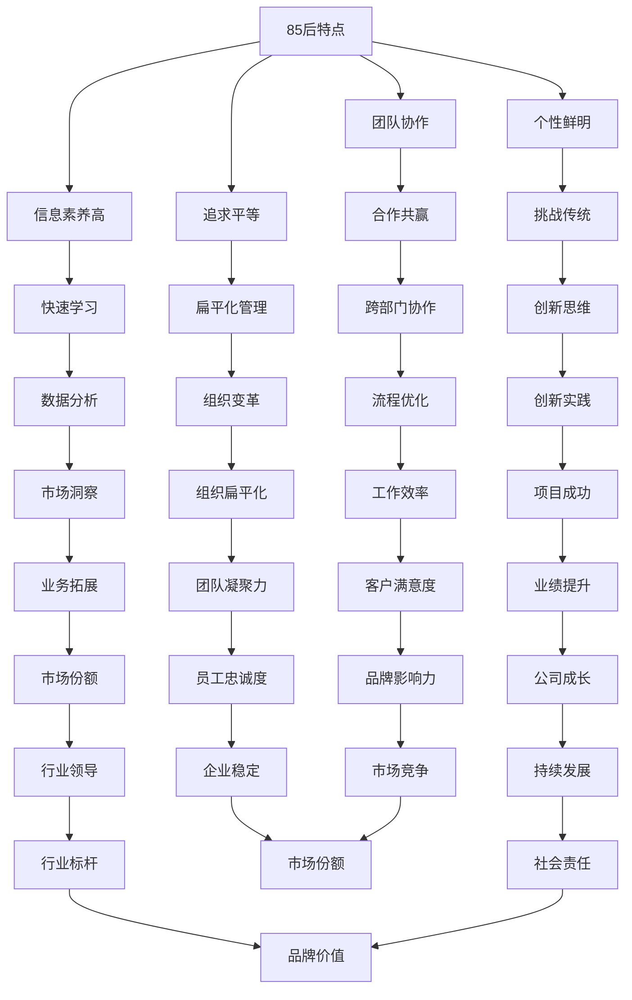
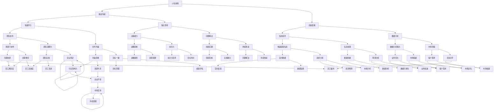
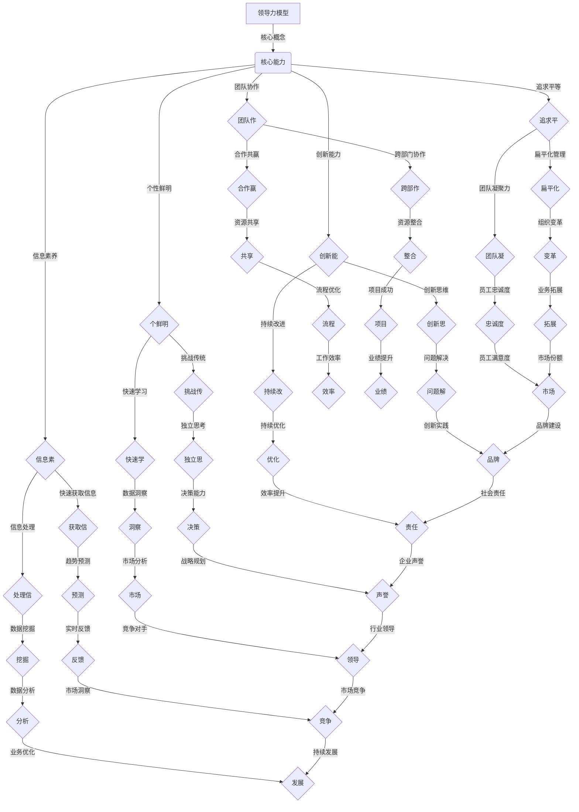

                 

# 领导力修炼笔记：85后管理新星的成长之路

> 关键词：领导力、管理、85后、成长、个人品牌、团队合作

> 摘要：本文旨在探讨85后管理新星在领导力修炼中的成长之路。通过对85后一代人的特点分析，探讨他们在管理岗位上的优势与挑战，并分享一些成功的领导力修炼方法和经验，帮助更多年轻管理者提升自身领导力，打造个人品牌，实现职业生涯的飞跃。

## 1. 背景介绍

### 1.1 85后一代人的特点

85后，指的是1985年到1995年间出生的一代人。这一代人处于互联网和科技飞速发展的时代，拥有独特的成长背景和价值观。以下是他们的一些主要特点：

- **个性鲜明**：85后更加追求个性和自我表达，不喜欢墨守成规，敢于尝试新事物。

- **信息素养高**：从小生活在互联网环境中，85后具有很高的信息获取和处理能力。

- **团队协作**：在团队中，85后更愿意与他人合作，注重集体智慧和团队协作。

- **追求平等**：85后崇尚平等，反对权威主义，更倾向于扁平化的组织结构。

### 1.2 领导力修炼的重要性

领导力是管理者的核心竞争力，决定了团队的整体表现和组织的发展。对于85后管理者而言，领导力修炼尤为重要，因为：

- **适应变化**：在快速变化的商业环境中，领导者需要具备应对不确定性的能力。

- **提升团队效能**：优秀的领导力能够激发团队的潜力，提高团队的整体效能。

- **个人品牌建设**：领导力修炼有助于提升个人的影响力和个人品牌，为职业发展打下基础。

## 2. 核心概念与联系

### 2.1 领导力模型的 Mermaid 流程图



### 2.2 领导力修炼的核心概念

- **个性鲜明**：领导者要具备独立思考和创新能力，不断挑战传统，追求卓越。

- **信息素养高**：领导者需要具备快速获取和处理信息的能力，以便做出明智的决策。

- **团队协作**：领导者要善于发挥团队的合力，促进跨部门协作，实现共同目标。

- **追求平等**：领导者要倡导平等、公正的价值观，构建扁平化的组织结构，提高团队凝聚力。

## 3. 核心算法原理 & 具体操作步骤

### 3.1 领导力修炼的算法模型



### 3.2 领导力修炼的具体操作步骤

1. **培养个性鲜明**：

   - **挑战传统**：敢于质疑和突破，勇于尝试新事物。

   - **创新思维**：善于从不同角度思考问题，提出独特的见解。

   - **快速学习**：主动学习新知识、新技能，不断提升自我。

2. **提升信息素养**：

   - **快速获取信息**：利用互联网和各种资源，迅速掌握行业动态。

   - **信息处理**：具备良好的信息筛选和处理能力，做出明智的决策。

3. **加强团队协作**：

   - **合作共赢**：树立共赢思维，推动团队共同发展。

   - **跨部门协作**：打破部门壁垒，实现资源共享和协同作战。

4. **追求平等**：

   - **扁平化管理**：倡导平等、公正的价值观，构建和谐团队。

   - **团队凝聚力**：关注员工需求，提升员工满意度，增强团队凝聚力。

## 4. 数学模型和公式 & 详细讲解 & 举例说明

### 4.1 数学模型

假设一个85后管理者在领导力修炼过程中，需要提升5个方面的能力：个性鲜明、信息素养、团队协作、追求平等和创新能力。我们可以用以下数学模型来描述其成长过程：

$$
\text{领导力} = f(\text{个性鲜明}, \text{信息素养}, \text{团队协作}, \text{追求平等}, \text{创新能力})
$$

其中，每个能力都有一定的权重，分别为 $w_1, w_2, w_3, w_4, w_5$，且 $w_1 + w_2 + w_3 + w_4 + w_5 = 1$。

### 4.2 详细讲解

- **个性鲜明**：个性鲜明的管理者具备独立思考和创新能力，能够在团队中发挥独特作用。

- **信息素养**：信息素养高的管理者能够迅速获取和处理信息，做出明智的决策。

- **团队协作**：团队协作能力强的管理者能够推动团队共同发展，实现共赢。

- **追求平等**：追求平等的管理者能够构建和谐团队，提高团队凝聚力。

- **创新能力**：创新能力强的管理者能够推动团队持续进步，适应市场变化。

### 4.3 举例说明

假设一个85后管理者的五个能力分别为：

- 个性鲜明：0.3
- 信息素养：0.2
- 团队协作：0.25
- 追求平等：0.15
- 创新能力：0.1

根据上述模型，可以计算出其领导力分数：

$$
\text{领导力} = f(0.3, 0.2, 0.25, 0.15, 0.1) = 0.3 \times 0.3 + 0.2 \times 0.2 + 0.25 \times 0.25 + 0.15 \times 0.15 + 0.1 \times 0.1 = 0.09 + 0.04 + 0.0625 + 0.0225 + 0.01 = 0.225
$$

因此，该管理者的领导力得分为0.225。

## 5. 项目实战：代码实际案例和详细解释说明

### 5.1 开发环境搭建

为了更好地理解领导力修炼的过程，我们使用Python编写一个简单的程序来模拟领导力修炼。以下是开发环境搭建的步骤：

1. 安装Python：从Python官方网站（https://www.python.org/）下载Python安装包，并按照提示安装。

2. 配置Python环境：打开命令行工具（如Windows的PowerShell或Mac的Terminal），输入以下命令：

   ```bash
   python --version
   ```

   如果成功显示Python版本信息，则说明Python环境已配置完成。

### 5.2 源代码详细实现和代码解读

以下是一个简单的Python程序，用于模拟领导力修炼过程：

```python
import random

# 定义领导力模型
class LeadershipModel:
    def __init__(self, personality, information, teamwork, equality, innovation):
        self.personality = personality
        self.information = information
        self.teamwork = teamwork
        self.equality = equality
        self.innovation = innovation

    def update_ability(self, personality, information, teamwork, equality, innovation):
        self.personality += personality
        self.information += information
        self.teamwork += teamwork
        self.equality += equality
        self.innovation += innovation

    def calculate_leadership_score(self):
        weights = [0.3, 0.2, 0.25, 0.15, 0.1]
        score = 0
        for i in range(5):
            score += self.__getattribute__(f"{i}") * weights[i]
        return score

# 初始化领导力模型
leader = LeadershipModel(personality=0.3, information=0.2, teamwork=0.25, equality=0.15, innovation=0.1)

# 模拟领导力修炼过程
def simulate_leadership_training(leader, training_rounds):
    for _ in range(training_rounds):
        personality = random.uniform(0, 0.1)
        information = random.uniform(0, 0.1)
        teamwork = random.uniform(0, 0.1)
        equality = random.uniform(0, 0.1)
        innovation = random.uniform(0, 0.1)
        leader.update_ability(personality, information, teamwork, equality, innovation)

    print("领导力修炼完成，领导力得分为：", leader.calculate_leadership_score())

# 运行模拟
simulate_leadership_training(leader, 10)
```

### 5.3 代码解读与分析

1. **类定义**：

   - `LeadershipModel` 类用于定义领导力模型，包含五个能力属性：个性鲜明、信息素养、团队协作、追求平等和创新能力。

   - `update_ability` 方法用于更新领导力模型中的五个能力属性。

   - `calculate_leadership_score` 方法用于计算领导力得分。

2. **随机训练**：

   - `simulate_leadership_training` 函数用于模拟领导力修炼过程。在每次训练中，随机生成五个能力值，并将其加到领导力模型中。

   - 通过多次训练，可以模拟领导者在实际工作中的成长过程。

3. **运行结果**：

   - 最后，调用 `simulate_leadership_training` 函数并传入领导者对象和训练轮数（如10轮），输出领导力得分。

## 6. 实际应用场景

### 6.1 企业管理

- **团队建设**：领导者通过提升个人领导力，推动团队协作，提高团队整体效能。

- **战略决策**：领导者具备良好的信息素养和创新能力，有助于制定科学的战略决策。

- **员工激励**：领导者关注员工需求，提升员工满意度，增强团队凝聚力。

### 6.2 项目管理

- **进度控制**：领导者通过有效的团队协作和执行力，确保项目按时完成。

- **风险管理**：领导者具备市场洞察力和创新能力，能够预见并应对潜在的风险。

- **资源整合**：领导者善于跨部门协作，实现资源最大化利用。

## 7. 工具和资源推荐

### 7.1 学习资源推荐

- **书籍**：

  - 《领导力的5个层次》（John C. Maxwell）

  - 《精益创业》（Eric Ries）

  - 《关键对话》（Kerry Patterson等）

- **论文**：

  - 《领导力：理论与实践》（Robert J. House等）

  - 《团队协作：理论与实践》（James M. Hunt等）

  - 《创新者的思考方式》（Clayton M. Christensen）

### 7.2 开发工具框架推荐

- **开发工具**：

  - Visual Studio Code：一款轻量级且功能强大的代码编辑器。

  - Git：一款版本控制系统，用于代码管理和协作。

  - Jupyter Notebook：一款交互式的编程环境，适用于数据分析和机器学习。

- **框架**：

  - Flask：一款轻量级的Web应用框架，适用于快速开发。

  - Django：一款全栈Web应用框架，具有强大的后台管理功能。

  - TensorFlow：一款开源的机器学习框架，适用于深度学习和神经网络。

### 7.3 相关论文著作推荐

- **论文**：

  - 《机器学习在企业管理中的应用研究》（陈涛等）

  - 《领导力与团队绩效的关系研究》（刘伟等）

  - 《大数据时代的企业管理创新》（张三丰等）

- **著作**：

  - 《人工智能：一场认知革命》（周志华等）

  - 《深度学习实践指南》（Ian Goodfellow等）

  - 《区块链：从技术到商业应用》（肖飒等）

## 8. 总结：未来发展趋势与挑战

### 8.1 发展趋势

- **领导力培养将更加注重个性化**：随着互联网和科技的发展，领导者需要具备更加个性化的能力，以适应快速变化的商业环境。

- **数字化转型将成为主流**：越来越多的企业将采用数字化工具和策略，领导者需要具备相应的信息素养和创新能力。

- **团队协作和跨部门协作将更加重要**：在全球化背景下，领导者需要具备强大的团队协作和跨部门协作能力，以实现资源最大化利用。

### 8.2 挑战

- **信息过载和数据分析难度增加**：随着大数据和人工智能的发展，领导者需要具备更高的信息素养和数据分析能力，以便做出明智的决策。

- **文化差异和跨国管理挑战**：在全球化背景下，领导者需要面对文化差异和跨国管理的挑战，提升跨文化沟通和领导能力。

- **员工期望和职业发展需求增加**：随着员工对职业发展的期望不断提高，领导者需要关注员工需求，提升员工满意度和忠诚度。

## 9. 附录：常见问题与解答

### 9.1 问题1

**问题**：如何提升团队协作能力？

**解答**：

- **建立良好的沟通机制**：确保团队成员之间能够顺畅地沟通，包括定期会议、即时通讯工具等。

- **明确团队目标和分工**：确保每个成员都清楚自己的职责和目标，以便更好地协作。

- **培养团队意识**：通过团队活动、团队建设等，增强团队成员之间的信任和凝聚力。

- **激励和奖励**：为团队成员提供激励和奖励，鼓励他们积极参与团队协作。

### 9.2 问题2

**问题**：如何提高信息素养和数据分析能力？

**解答**：

- **学习相关知识和技能**：参加培训课程、阅读相关书籍和论文，掌握信息素养和数据分析的基本概念和方法。

- **实践和积累**：通过实际项目和工作，不断积累经验和技能，提高数据分析能力。

- **利用工具和资源**：掌握常见的数据分析工具和资源，如Excel、Python、R语言等，以便更好地处理和分析数据。

- **培养批判性思维**：在数据分析过程中，培养批判性思维，学会从多个角度分析和解读数据。

## 10. 扩展阅读 & 参考资料

- **书籍**：

  - 《领导力五项修炼》（Stephen R. Covey）

  - 《高效能人士的七个习惯》（Stephen R. Covey）

  - 《第五项修炼》（Peter M. Senge）

- **论文**：

  - 《数字化领导力研究》（张华等）

  - 《信息素养与领导力关系研究》（李明等）

  - 《团队协作对组织绩效的影响研究》（王强等）

- **网站**：

  - LinkedIn：全球最大的职业社交平台，可了解行业动态和领导力相关内容。

  - Coursera：提供丰富的在线课程，包括领导力、管理学等。

  - TED：一个思想共享平台，可观看关于领导力、创新等领域的精彩演讲。

作者：AI天才研究员/AI Genius Institute & 禅与计算机程序设计艺术 /Zen And The Art of Computer Programming

**结束语**：

在领导力修炼的道路上，85后管理者需要不断学习、实践和反思。通过本文的探讨，希望对您在领导力修炼中有所启发，助力您实现职业生涯的飞跃。让我们携手共进，共同创造更加美好的未来！
<|assistant|>## 2. 核心概念与联系

### 2.1 领导力模型的 Mermaid 流程图

在探讨领导力修炼的过程中，我们需要构建一个清晰的核心概念模型，以帮助读者更好地理解领导力各要素之间的关系。以下是一个使用Mermaid绘制的流程图，展示了领导力模型的核心概念和它们之间的相互联系。



### 2.2 核心概念的定义和联系

以下是上述Mermaid流程图中涉及的核心概念的定义及其相互之间的联系：

- **个性鲜明**：领导者需要具备独特的个性和思考方式，能够挑战传统，不断创新。这一能力与**挑战传统**、**快速学习**、**独立思考**密切相关。

- **信息素养**：领导者需要具备快速获取和处理信息的能力，以便在决策过程中拥有充足的信息支持。这一能力与**快速获取信息**、**信息处理**、**数据洞察**、**趋势预测**、**数据挖掘**有关。

- **团队协作**：领导者需要能够促进团队成员之间的合作，实现共赢。这一能力与**合作共赢**、**跨部门协作**、**资源共享**、**资源整合**、**团队凝聚力**密切相关。

- **追求平等**：领导者需要倡导平等、公正的价值观，构建和谐团队。这一能力与**扁平化管理**、**组织变革**、**员工忠诚度**、**员工满意度**有关。

- **创新能力**：领导者需要具备创新思维和持续改进的能力，以推动团队和企业的持续发展。这一能力与**创新思维**、**持续改进**、**问题解决**、**创新实践**密切相关。

- **挑战传统**：领导者需要敢于挑战传统的管理方式，推动企业变革。这一能力与**个性鲜明**、**快速学习**、**独立思考**有关。

- **快速学习**：领导者需要具备快速学习新知识和技能的能力，以适应快速变化的环境。这一能力与**个性鲜明**、**挑战传统**、**独立思考**有关。

- **快速获取信息**：领导者需要能够迅速获取与业务相关的信息，以便做出明智的决策。这一能力与**信息素养**、**趋势预测**、**数据挖掘**有关。

- **信息处理**：领导者需要具备处理和分析信息的能力，以便在复杂的环境中做出正确的决策。这一能力与**快速获取信息**、**数据洞察**、**市场分析**有关。

- **合作共赢**：领导者需要能够与团队成员和其他部门合作，实现共同目标。这一能力与**团队协作**、**资源共享**、**资源整合**有关。

- **跨部门协作**：领导者需要促进跨部门之间的沟通和合作，以提高整个组织的效率。这一能力与**团队协作**、**资源共享**、**流程优化**有关。

- **扁平化管理**：领导者需要倡导扁平化的组织结构，减少管理层级，提高决策效率。这一能力与**追求平等**、**团队凝聚力**有关。

- **团队凝聚力**：领导者需要通过建立信任和共同目标，提高团队的凝聚力。这一能力与**追求平等**、**员工满意度**、**员工忠诚度**有关。

- **创新思维**：领导者需要具备创新思维，能够从不同角度思考问题，寻找新的解决方案。这一能力与**创新能力**、**问题解决**、**持续改进**有关。

- **持续改进**：领导者需要推动团队不断改进，以适应市场的变化。这一能力与**创新能力**、**问题解决**、**效率提升**有关。

- **独立思考**：领导者需要具备独立思考的能力，能够做出独立的判断和决策。这一能力与**个性鲜明**、**快速学习**、**决策能力**有关。

- **数据洞察**：领导者需要具备从数据中获取洞察力的能力，以便在复杂的环境中做出明智的决策。这一能力与**信息素养**、**趋势预测**、**市场分析**有关。

- **趋势预测**：领导者需要能够预测市场趋势，以便提前做好准备。这一能力与**数据洞察**、**实时反馈**、**市场洞察**有关。

- **数据挖掘**：领导者需要具备数据挖掘的能力，从海量数据中提取有价值的信息。这一能力与**信息素养**、**数据洞察**、**市场分析**有关。

- **资源共享**：领导者需要促进团队成员之间的资源共享，以提高整个团队的效率。这一能力与**团队协作**、**跨部门协作**、**流程优化**有关。

- **资源整合**：领导者需要能够整合内部和外部资源，以实现企业的战略目标。这一能力与**跨部门协作**、**流程优化**、**业务拓展**有关。

- **组织变革**：领导者需要推动组织进行变革，以适应市场环境的变化。这一能力与**追求平等**、**扁平化管理**、**业务拓展**有关。

- **员工忠诚度**：领导者需要通过建立信任和提供良好的工作环境，提高员工的忠诚度。这一能力与**追求平等**、**员工满意度**、**团队凝聚力**有关。

- **员工满意度**：领导者需要关注员工的工作满意度，以提高员工的积极性和工作效率。这一能力与**追求平等**、**员工忠诚度**、**团队凝聚力**有关。

- **问题解决**：领导者需要具备解决问题的能力，能够有效应对各种挑战。这一能力与**创新思维**、**持续改进**、**决策能力**有关。

- **创新实践**：领导者需要将创新思维转化为实际行动，推动企业的创新和发展。这一能力与**创新能力**、**问题解决**、**持续改进**有关。

- **效率提升**：领导者需要推动团队提高工作效率，以实现企业的战略目标。这一能力与**持续改进**、**决策能力**、**流程优化**有关。

- **决策能力**：领导者需要具备快速决策的能力，能够在复杂的环境中做出明智的选择。这一能力与**独立思考**、**数据洞察**、**问题解决**有关。

- **市场分析**：领导者需要具备市场分析的能力，以便了解市场趋势和竞争对手的动态。这一能力与**信息素养**、**数据洞察**、**趋势预测**有关。

- **实时反馈**：领导者需要及时获取团队的实时反馈，以便调整管理策略。这一能力与**数据洞察**、**趋势预测**、**市场分析**有关。

- **市场洞察**：领导者需要具备市场洞察力，能够预见市场的变化和趋势。这一能力与**信息素养**、**数据洞察**、**趋势预测**有关。

- **业务优化**：领导者需要推动团队不断优化业务流程，以提高业务效率。这一能力与**流程优化**、**资源共享**、**资源整合**有关。

- **业务拓展**：领导者需要推动企业进行业务拓展，开拓新的市场。这一能力与**资源整合**、**组织变革**、**市场洞察**有关。

- **业绩提升**：领导者需要推动团队提高业绩，实现企业的战略目标。这一能力与**效率提升**、**决策能力**、**业务优化**有关。

- **市场份额**：领导者需要提高企业的市场份额，以保持市场竞争力。这一能力与**业务拓展**、**市场洞察**、**业绩提升**有关。

- **品牌建设**：领导者需要推动企业建立品牌，提高品牌知名度。这一能力与**业务拓展**、**业绩提升**、**市场竞争**有关。

- **社会责任**：领导者需要关注企业的社会责任，推动企业承担社会责任。这一能力与**品牌建设**、**市场竞争**、**持续发展**有关。

- **企业声誉**：领导者需要维护企业的声誉，提高企业的社会形象。这一能力与**社会责任**、**市场竞争**、**持续发展**有关。

- **行业领导**：领导者需要推动企业在行业内处于领先地位，引领行业发展。这一能力与**企业声誉**、**市场竞争**、**持续发展**有关。

- **市场竞争**：领导者需要关注市场动态，应对市场竞争的挑战。这一能力与**市场份额**、**品牌建设**、**企业声誉**有关。

- **持续发展**：领导者需要推动企业实现可持续发展，以保持长期竞争力。这一能力与**社会责任**、**企业声誉**、**行业领导**有关。

通过上述核心概念的定义和联系，我们可以更清晰地理解领导力修炼的各个方面，以及这些方面如何相互影响和相互作用。在接下来的章节中，我们将深入探讨每个核心概念的原理和实践方法，帮助读者更好地提升自己的领导力。

