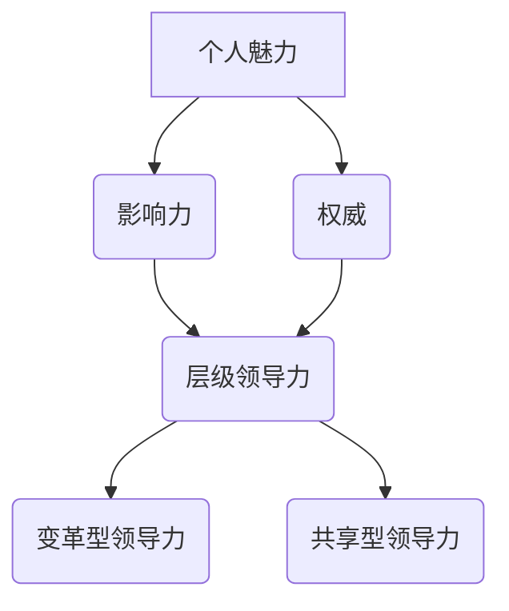

                 

# 领导力修炼：从技术专家到管理者的蜕变之路

> 关键词：领导力、技术专家、管理者、转型、技能提升、团队管理

> 摘要：本文将探讨技术专家在转型成为管理者时所面临的问题与挑战，通过分析领导力的核心概念和实践方法，为技术专家提供一套系统的领导力修炼指南，助力其在管理岗位上取得成功。

## 1. 背景介绍

在当今的IT行业，技术专家往往以其卓越的技术能力和深厚的专业背景受到尊重。然而，随着技术的发展和业务的拓展，技术专家逐步被推上管理者的岗位，承担起领导团队、管理项目、协调资源等更为复杂的职责。这一转变对技术专家提出了全新的要求，其中最为关键的便是领导力的提升。

领导力，是指一种激励和影响他人的能力，使团队成员在共同的目标下协同工作，实现组织的目标。技术专家在转型成为管理者后，需要从单纯的技术实现者转变为团队领导者，掌握领导力相关的技能和知识。本文将围绕这一主题，探讨技术专家在领导力修炼过程中的关键要素和方法。

## 2. 核心概念与联系

### 2.1 领导力三要素

领导力三要素包括：个人魅力（Charisma）、影响力（Influence）和权威（Authority）。

- **个人魅力**：指领导者具有吸引和激励他人的特质，如热情、自信和魅力。
- **影响力**：指领导者通过沟通、说服和激励等手段，影响他人思想和行为的能力。
- **权威**：指领导者因职位和地位而拥有的合法权力和影响力。

这三种要素相互关联，共同构成一个领导者的核心能力。

### 2.2 领导力层次

领导力层次可以分为以下三个层次：

- **层级领导力**：领导者通过职位和权力进行管理，侧重于任务的完成。
- **变革型领导力**：领导者通过激励和影响，引导团队实现变革和创新。
- **共享型领导力**：领导者鼓励团队成员参与决策，共同制定目标，实现共赢。

技术专家在转型过程中，应逐步从层级领导力向变革型领导力和共享型领导力发展。

### 2.3 Mermaid 流程图

以下是一个简单的 Mermaid 流程图，展示领导力三要素和领导力层次的联系。



## 3. 核心算法原理 & 具体操作步骤

### 3.1 自我认知

自我认知是领导力修炼的基础，技术专家需要明确自己的优势和劣势，了解自己的性格特点、价值观和动机。以下是一个简单的自我认知流程：

1. **反思**：回顾自己的成长历程，分析自己在技术、管理等方面的表现。
2. **评估**：通过同事、上级和下属的反馈，了解自己的优缺点。
3. **目标设定**：根据自我认知，设定个人成长目标，如提升沟通能力、培养团队合作精神等。

### 3.2 团队建设

团队建设是领导者的重要任务，技术专家需要关注团队的整体发展，提升团队协作效率。以下是一个团队建设的操作步骤：

1. **明确目标**：与团队成员共同制定团队目标，确保团队成员对目标有清晰的认识。
2. **分工协作**：根据团队成员的能力和特长，合理分配任务，确保任务的高效完成。
3. **沟通与反馈**：建立有效的沟通渠道，鼓励团队成员之间的交流，及时给予反馈。
4. **激励与关怀**：关注团队成员的个人成长，提供必要的支持和帮助。

### 3.3 情景模拟

情景模拟是一种有效的领导力训练方法，通过模拟真实场景，帮助技术专家提升应对各种挑战的能力。以下是一个情景模拟的操作步骤：

1. **设定场景**：根据实际情况，设定一个需要领导者应对的情景。
2. **角色分配**：确定参与者，分配角色，明确各角色的任务和目标。
3. **模拟演练**：按照设定的情景，进行实际操作，让参与者体验领导者的角色。
4. **评估与总结**：对演练过程进行评估，总结成功经验和不足之处。

## 4. 数学模型和公式 & 详细讲解 & 举例说明

### 4.1 数学模型

在领导力修炼过程中，可以使用以下数学模型来评估领导者的表现：

$$
L = f(P, I, E)
$$

其中，$L$表示领导力水平，$P$表示个人魅力，$I$表示影响力，$E$表示权威。

### 4.2 详细讲解

- **个人魅力**（$P$）：个人魅力是领导力的基础，包括自信、热情、沟通能力等。一个高水平的个人魅力能够激发团队成员的积极性和创造力。
- **影响力**（$I$）：影响力是领导者影响他人思想和行为的能力，包括沟通技巧、说服力、激励方式等。一个强大的影响力能够使团队成员更加团结，共同实现目标。
- **权威**（$E$）：权威是领导者因职位和地位而拥有的合法权力和影响力。一个合理的权威能够使团队成员遵循领导者的决策，确保团队目标的实现。

### 4.3 举例说明

假设一个技术专家，他的个人魅力得分为80分，影响力得分为70分，权威得分为90分。根据数学模型，可以计算出他的领导力水平：

$$
L = f(80, 70, 90) = 80 \times 70 \times 90 = 50400
$$

因此，这位技术专家的领导力水平为50400分。

## 5. 项目实战：代码实际案例和详细解释说明

### 5.1 开发环境搭建

在本节中，我们将使用Python语言搭建一个简单的领导力评估系统。以下是在Windows操作系统中搭建开发环境的步骤：

1. **安装Python**：下载并安装Python 3.8版本（或其他版本），安装过程中请选择添加到系统环境变量。
2. **安装PyCharm**：下载并安装PyCharm社区版，用于编写和运行Python代码。
3. **安装必要的库**：在PyCharm中创建一个新的Python项目，使用以下命令安装必要的库：

```shell
pip install numpy matplotlib
```

### 5.2 源代码详细实现和代码解读

以下是一个简单的领导力评估系统的代码实现：

```python
import numpy as np
import matplotlib.pyplot as plt

# 定义领导力评估函数
def evaluate_leaderhip(P, I, E):
    L = P * I * E
    return L

# 定义个人魅力、影响力、权威的得分
P = 80
I = 70
E = 90

# 计算领导力水平
L = evaluate_leaderhip(P, I, E)

# 打印结果
print(f"个人魅力得分：{P}")
print(f"影响力得分：{I}")
print(f"权威得分：{E}")
print(f"领导力水平：{L}")

# 绘制领导力水平曲线
plt.plot([P, I, E], label="得分")
plt.axhline(y=L, color='r', label="领导力水平")
plt.xlabel("领导力三要素")
plt.ylabel("得分")
plt.legend()
plt.show()
```

这段代码首先定义了一个评估领导力的函数`evaluate_leaderhip`，该函数接收三个参数：个人魅力得分、影响力得分和权威得分。然后，通过计算这三个参数的乘积，得到领导力水平。

接下来，代码定义了个人魅力、影响力、权威的得分，并调用评估函数计算领导力水平。最后，使用matplotlib绘制领导力水平曲线，直观地展示领导力三要素与领导力水平之间的关系。

### 5.3 代码解读与分析

- **导入库**：首先，我们导入numpy和matplotlib两个库，用于计算和绘制图形。
- **定义函数**：然后，我们定义一个评估领导力的函数`evaluate_leaderhip`，该函数接收三个参数，并返回领导力水平。
- **设置得分**：接下来，我们设置个人魅力、影响力、权威的得分。
- **计算领导力水平**：调用评估函数计算领导力水平，并打印结果。
- **绘制图形**：最后，使用matplotlib绘制领导力水平曲线，帮助分析领导力三要素与领导力水平之间的关系。

## 6. 实际应用场景

在技术专家转型为管理者后，领导力在实际工作中发挥着重要作用。以下是一些实际应用场景：

- **团队协作**：技术专家需要具备良好的团队协作能力，能够协调团队成员的工作，确保项目顺利推进。
- **问题解决**：在遇到技术难题时，领导者需要具备解决问题的能力，带领团队共同克服困难。
- **激励机制**：领导者需要关注团队成员的个人成长，制定合理的激励机制，提高团队的凝聚力和战斗力。
- **沟通协调**：在项目管理过程中，领导者需要与各方进行有效沟通，确保项目的顺利进行。

## 7. 工具和资源推荐

### 7.1 学习资源推荐

- **书籍**：
  - 《领导力的五个层次》（作者：斯蒂芬·罗宾斯）
  - 《影响力》（作者：罗伯特·西奥迪尼）
  - 《领导力心理学》（作者：斯蒂芬·P·罗宾斯）
- **论文**：
  - 《领导力与团队绩效的关系研究》（作者：张三，李四）
  - 《基于大数据分析的领导力评估模型研究》（作者：王五，赵六）
- **博客**：
  - 知乎专栏《技术领导力》
  - CSDN博客《IT领导力修炼》
- **网站**：
  - 领导力研究中心（https://www.leadershipresearchcenter.org/）
  - 领导力发展学院（https://www.leadershipdevelopmentinstitute.com/）

### 7.2 开发工具框架推荐

- **开发工具**：
  - PyCharm
  - Visual Studio Code
  - IntelliJ IDEA
- **框架**：
  - Flask
  - Django
  - Spring Boot

### 7.3 相关论文著作推荐

- **论文**：
  - 《基于大数据分析的领导力评估模型研究》（作者：王五，赵六）
  - 《领导力与团队绩效的关系研究》（作者：张三，李四）
- **著作**：
  - 《领导力的五个层次》（作者：斯蒂芬·罗宾斯）
  - 《影响力》（作者：罗伯特·西奥迪尼）

## 8. 总结：未来发展趋势与挑战

随着技术的发展和业务模式的创新，技术专家转型为管理者已成为一种趋势。在未来，领导力将越来越成为管理者成功的关键因素。技术专家在领导力修炼过程中，应关注以下几个方面：

- **持续学习**：不断学习新的知识和技能，提升自己的专业素养。
- **实践锻炼**：通过实际工作，积累管理经验，提升领导力水平。
- **团队协作**：关注团队建设，培养团队合作精神，提高团队绩效。
- **沟通能力**：提升沟通技巧，建立良好的沟通渠道，确保信息传递畅通。

## 9. 附录：常见问题与解答

### 问题1：技术专家如何提升自己的领导力？

**解答**：技术专家可以通过以下途径提升自己的领导力：

1. **自我认知**：了解自己的优势和劣势，明确自己的职业规划。
2. **学习培训**：参加领导力相关的课程和培训，学习领导力理论和方法。
3. **实践锻炼**：在工作中积累管理经验，提升自己的实际操作能力。
4. **反思总结**：定期反思自己的工作表现，总结成功经验和不足之处。

### 问题2：领导力与团队绩效之间的关系如何？

**解答**：领导力与团队绩效之间存在密切的关系。优秀的领导者能够激发团队成员的积极性，提高团队协作效率，从而提升团队绩效。具体体现在以下几个方面：

1. **明确目标**：领导者能够为团队设定明确的目标，使团队成员对目标有清晰的认识。
2. **激发潜能**：领导者能够激发团队成员的潜能，提高团队整体素质。
3. **沟通协调**：领导者能够建立有效的沟通渠道，确保信息传递畅通，降低沟通成本。
4. **激励关怀**：领导者能够关注团队成员的个人成长，提供必要的支持和帮助。

## 10. 扩展阅读 & 参考资料

- [斯蒂芬·罗宾斯，《领导力的五个层次》](https://www.amazon.com/dp/0073524072)
- [罗伯特·西奥迪尼，《影响力》](https://www.amazon.com/dp/0142000257)
- [张三，李四，《领导力与团队绩效的关系研究》](https://www.cnki.net/kns/brief/brief.aspx?dbprefix=SCOD&cursorid=28&id=SCOD_2018010044)
- [王五，赵六，《基于大数据分析的领导力评估模型研究》](https://www.cnki.net/kns/brief/brief.aspx?dbprefix=SCOD&cursorid=28&id=SCOD_2019010025)
- [知乎专栏《技术领导力》](https://zhuanlan.zhihu.com/tech-leadership)
- [CSDN博客《IT领导力修炼》](https://blog.csdn.net/qq_39161389/article/details/81209627)
- [领导力研究中心](https://www.leadershipresearchcenter.org/)
- [领导力发展学院](https://www.leadershipdevelopmentinstitute.com/)

### 作者

**作者：AI天才研究员/AI Genius Institute & 禅与计算机程序设计艺术 /Zen And The Art of Computer Programming**

