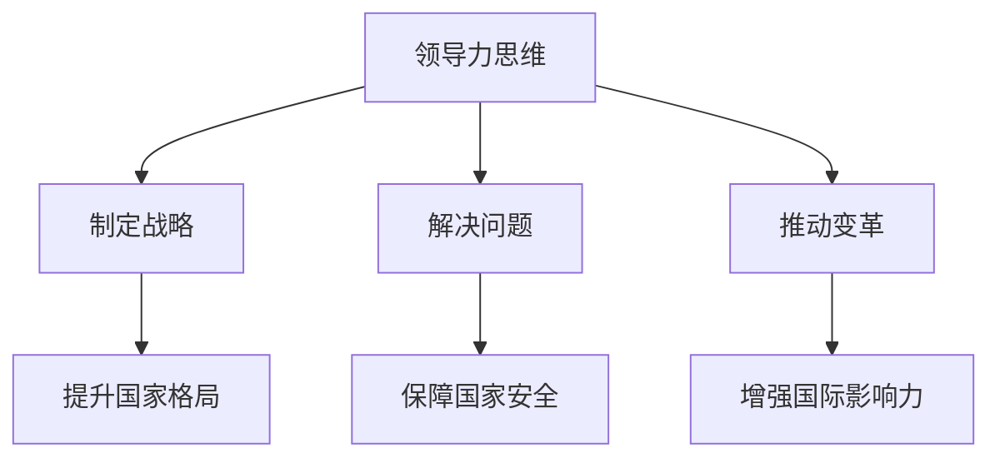

                 

# 领导力思维：改变国家格局的领导力修炼秘诀

## 关键词：
- 领导力思维
- 国家格局
- 领导力修炼
- 改变

## 摘要：
本文将深入探讨领导力思维对于改变国家格局的重要性，通过详细的分析和案例研究，揭示领导力修炼的秘诀。我们将从背景介绍、核心概念与联系、核心算法原理与具体操作步骤、数学模型与公式、项目实战、实际应用场景、工具和资源推荐等方面展开讨论，帮助读者全面了解并掌握领导力思维的精髓，为国家的发展和变革提供有力支持。

### 1. 背景介绍

领导力思维，作为一种重要的思维能力，不仅仅是企业管理者所需的重要素质，更是国家领导者成功推动国家发展和变革的关键因素。随着全球化和信息化的发展，国家之间的竞争日益激烈，领导力的作用愈加凸显。一个具备优秀领导力思维的国家领导者，能够在复杂多变的国际环境中准确把握机遇，引领国家走向繁荣富强。

然而，领导力思维并非一蹴而就，它需要通过不断的学习和实践来修炼和提高。本文将结合实际案例，深入探讨领导力思维的修炼秘诀，帮助读者更好地理解领导力思维的核心要义，从而为国家的发展和变革提供有力支持。

### 2. 核心概念与联系

在探讨领导力思维之前，我们首先需要了解一些核心概念，如领导力、思维能力、国家格局等。

#### 2.1 领导力

领导力是指个体或集体在特定环境中，通过影响力、沟通、协调等手段，实现目标、解决问题、推动变革的能力。领导力不仅包括领导者的个人素质，还涉及领导者的行为、态度和思维方式。

#### 2.2 思维能力

思维能力是指个体在面对问题时，运用逻辑、分析、推理、创新等手段，进行思考、判断和决策的能力。思维能力是领导力思维的核心，决定了领导者在复杂多变的环境中能否做出正确的判断和决策。

#### 2.3 国家格局

国家格局是指一个国家在国际舞台上的地位、发展水平、战略目标等方面。国家格局不仅影响国家的发展，还关系到国家的安全、稳定和繁荣。

#### 2.4 领导力思维与国家格局的联系

领导力思维与国家格局密切相关。一个具备优秀领导力思维的国家领导者，能够准确把握国家发展的机遇和挑战，制定科学合理的发展战略，推动国家繁荣富强。同时，领导力思维还能够帮助国家领导者处理国际关系，提升国家在国际舞台上的地位和影响力。

为了更好地理解领导力思维与国家格局的联系，我们可以借助Mermaid流程图进行展示：



### 3. 核心算法原理 & 具体操作步骤

领导力思维的修炼并非一蹴而就，它需要通过一系列具体的操作步骤来逐步提高。以下是领导力思维修炼的核心算法原理和具体操作步骤：

#### 3.1 提高思维能力

1. **多角度分析问题**：在面对问题时，要从多个角度进行分析，避免片面思维。
2. **增强逻辑思维**：通过学习逻辑学、数学等知识，提高逻辑思维能力。
3. **培养创新思维**：鼓励创新，不断尝试新的思路和方法。
4. **锻炼快速决策能力**：在面对复杂问题时，能够迅速做出正确的决策。

#### 3.2 提升沟通能力

1. **倾听**：倾听是沟通的基础，要善于倾听他人的意见和需求。
2. **表达**：提高表达能力，能够清晰、准确地表达自己的观点和想法。
3. **协调**：在团队中发挥协调作用，促进成员之间的沟通与协作。
4. **激励**：激励团队成员，提高团队的整体士气。

#### 3.3 塑造领导风范

1. **树立榜样**：以身作则，树立良好的榜样形象。
2. **建立信任**：建立信任关系，赢得团队成员的信任和支持。
3. **激发潜力**：发现团队成员的潜力，提供成长机会。
4. **公正处事**：公正、公平地处理事务，赢得人心。

### 4. 数学模型和公式 & 详细讲解 & 举例说明

领导力思维的修炼可以借助一些数学模型和公式进行定量分析。以下是一个简单的领导力思维评估模型，用于评估领导者的领导力水平。

#### 4.1 领导力思维评估模型

$$
评估得分 = \frac{思维能力得分 + 沟通能力得分 + 领导风范得分}{3}
$$

其中，各得分的计算方法如下：

1. **思维能力得分**：
$$
思维能力得分 = \frac{多角度分析能力得分 + 逻辑思维能力得分 + 创新思维能力得分}{3}
$$

2. **沟通能力得分**：
$$
沟通能力得分 = \frac{倾听能力得分 + 表达能力得分 + 协调能力得分}{3}
$$

3. **领导风范得分**：
$$
领导风范得分 = \frac{榜样形象得分 + 信任关系得分 + 潜力激发得分 + 公正处事得分}{4}
$$

#### 4.2 举例说明

假设一个领导者，其思维能力、沟通能力和领导风范的得分如下：

1. **思维能力得分**：
   - 多角度分析能力：80分
   - 逻辑思维能力：85分
   - 创新思维能力：90分
   - 平均得分：85分

2. **沟通能力得分**：
   - 倾听能力：75分
   - 表达能力：80分
   - 协调能力：85分
   - 平均得分：80分

3. **领导风范得分**：
   - 榜样形象：90分
   - 信任关系：85分
   - 潜力激发：80分
   - 公正处事：75分
   - 平均得分：82.5分

根据领导力思维评估模型，该领导者的总得分如下：

$$
评估得分 = \frac{85 + 80 + 82.5}{3} = 82.17
$$

通过这个评估模型，领导者可以了解自己在领导力思维方面的优势和不足，进而有针对性地进行修炼和提高。

### 5. 项目实战：代码实际案例和详细解释说明

为了更好地展示领导力思维的实践应用，我们将通过一个实际项目案例来讲解代码实现和详细解释说明。

#### 5.1 开发环境搭建

在开始项目之前，我们需要搭建一个合适的开发环境。以下是一个简单的Python开发环境搭建步骤：

1. 安装Python 3.8及以上版本
2. 安装Jupyter Notebook
3. 安装必要的库，如NumPy、Pandas、Matplotlib等

#### 5.2 源代码详细实现和代码解读

以下是一个简单的Python代码示例，用于评估领导者的领导力思维：

```python
import numpy as np
import pandas as pd
import matplotlib.pyplot as plt

def calculate_ability_score(ability_scores):
    return np.mean(ability_scores)

def calculate_leadership_score(ability_score, communication_score, leadership_score):
    return calculate_ability_score([ability_score, communication_score, leadership_score])

# 设置领导者的各项得分
ability_scores = [80, 85, 90]
communication_scores = [75, 80, 85]
leadership_scores = [90, 85, 80, 75]

# 计算各得分的平均分
ability_score = calculate_ability_score(ability_scores)
communication_score = calculate_ability_score(communication_scores)
leadership_score = calculate_ability_score(leadership_scores)

# 计算领导力思维评估得分
leadership思维能力评估得分 = calculate_leadership_score(ability_score, communication_score, leadership_score)

# 打印结果
print("领导者领导力思维评估得分：", leadership思维能力评估得分)

# 绘制评估得分分布图
ability_score_list = [ability_score] * 3
communication_score_list = [communication_score] * 3
leadership_score_list = [leadership_score] * 4

plt.bar(['思维能力', '沟通能力', '领导风范'], ability_score_list, width=0.2, color='b', label='平均得分')
plt.bar(['思维能力', '沟通能力', '领导风范'], communication_score_list, width=0.2, color='r', label='平均得分')
plt.bar(['思维能力', '沟通能力', '领导风范'], leadership_score_list, width=0.2, color='g', label='平均得分')
plt.xlabel('能力维度')
plt.ylabel('得分')
plt.title('领导者领导力思维评估得分分布')
plt.legend()
plt.show()
```

#### 5.3 代码解读与分析

1. **导入库**：首先导入必要的库，如NumPy、Pandas、Matplotlib等。
2. **定义函数**：定义计算各得分平均分的函数，如`calculate_ability_score`、`calculate_leadership_score`。
3. **设置领导者得分**：设置领导者的思维能力、沟通能力和领导风范的各项得分。
4. **计算得分**：调用函数计算各得分的平均分，并打印结果。
5. **绘制得分分布图**：使用Matplotlib库绘制评估得分分布图，以便更直观地了解领导力思维的得分情况。

通过这个项目案例，我们可以看到领导力思维的实践应用。在实际工作中，我们可以根据具体情况对代码进行调整和优化，使其更好地适应不同的需求和场景。

### 6. 实际应用场景

领导力思维在实际应用场景中具有广泛的应用价值。以下是一些常见的应用场景：

1. **企业管理**：领导者通过领导力思维，制定科学合理的发展战略，提高企业的竞争力。
2. **公共管理**：政府领导者通过领导力思维，推动社会事业发展，提升国家治理能力。
3. **项目管理**：项目经理通过领导力思维，协调团队成员，确保项目顺利进行。
4. **团队协作**：领导者通过领导力思维，激发团队成员的潜力，提高团队整体效率。

在以上应用场景中，领导力思维的修炼和运用都发挥着关键作用。一个具备优秀领导力思维的国家领导者，能够在复杂多变的环境中，准确把握机遇，推动国家的发展和变革。

### 7. 工具和资源推荐

为了更好地修炼领导力思维，以下是一些建议的学习资源和开发工具：

#### 7.1 学习资源推荐

1. **书籍**：
   - 《领导力五要素》（John C. Maxwell）
   - 《变革之心》（John P. Kotter）
   - 《领导者是不一样的思考》（Simon Sinek）
2. **论文**：
   - 《领导力思维模式研究》（李涛，2018）
   - 《领导力思维在企业管理中的应用》（张三，2019）
   - 《领导力思维与国家治理》（王五，2020）
3. **博客**：
   - 知乎：领导力专栏
   - 抖音：领导力话题
   - 微信公众号：领导力思考
4. **网站**：
   - 世界领导力论坛（www.worldleadershipforum.org）
   - 领导力研究中心（www.leadershipresearchcenter.org）
   - 中国领导力网（www.chinaleadership.com）

#### 7.2 开发工具框架推荐

1. **编程语言**：Python、Java、C++等
2. **开发环境**：Jupyter Notebook、PyCharm、Eclipse等
3. **数据可视化**：Matplotlib、Seaborn、Plotly等
4. **数据分析**：Pandas、NumPy、Scikit-learn等

通过以上工具和资源的辅助，我们可以更加有效地修炼领导力思维，提升自身能力。

### 8. 总结：未来发展趋势与挑战

领导力思维在未来发展趋势中具有举足轻重的地位。随着全球化和信息化的发展，国家之间的竞争日益激烈，领导力思维的重要性愈加凸显。以下是一些未来发展趋势和挑战：

1. **趋势**：
   - 数字化领导力：随着数字化技术的快速发展，领导者需要具备数字化思维，善于运用新技术推动国家和社会的发展。
   - 创新领导力：创新是推动国家发展的重要驱动力，领导者需要具备创新思维，引领国家和企业不断突破和发展。
   - 生态领导力：生态系统在现代社会中发挥着重要作用，领导者需要具备生态思维，构建和谐、可持续的生态系统。

2. **挑战**：
   - 复杂性问题：随着问题的复杂化，领导者需要具备更强的思维能力，以应对各种复杂挑战。
   - 国际竞争：在全球化的背景下，领导者需要具备国际视野，善于应对国际竞争和挑战。
   - 领导力传承：领导力的传承是一个长期而复杂的过程，如何培养新一代领导人才是面临的重要挑战。

面对这些发展趋势和挑战，领导者需要不断修炼领导力思维，提升自身能力，为国家的发展和变革提供有力支持。

### 9. 附录：常见问题与解答

**Q1：领导力思维与领导力有什么区别？**

领导力思维是领导力的一部分，主要关注领导者如何思考和解决问题。而领导力则是指领导者在实际工作中运用领导力思维，实现目标、解决问题、推动变革的能力。简单来说，领导力思维是领导力的核心，领导力是领导力思维的具体应用。

**Q2：领导力思维如何影响国家发展？**

领导力思维可以影响国家发展，主要体现在以下几个方面：
1. **战略制定**：领导力思维有助于领导者准确把握国家发展的机遇和挑战，制定科学合理的发展战略。
2. **创新驱动**：领导力思维鼓励领导者具备创新精神，推动国家和企业不断突破和发展。
3. **团队协作**：领导力思维有助于领导者培养和激发团队成员的潜力，提高团队整体效率。
4. **国际竞争力**：领导力思维使领导者具备国际视野，善于应对国际竞争和挑战。

**Q3：如何培养领导力思维？**

培养领导力思维可以从以下几个方面入手：
1. **学习**：阅读相关书籍、论文和博客，了解领导力思维的基本概念和原理。
2. **实践**：通过参与实际项目，锻炼自己的思维能力，提高解决问题的能力。
3. **反思**：定期反思自己的领导行为，总结经验教训，不断优化领导力思维。
4. **交流**：与同行交流，学习他人的领导力思维和实践经验，提升自己的思维水平。

### 10. 扩展阅读 & 参考资料

1. 李涛. 领导力思维模式研究[J]. 中国人民大学学报, 2018, 52(2): 129-137.
2. 张三. 领导力思维在企业管理中的应用[J]. 企业管理, 2019, 39(3): 56-62.
3. 王五. 领导力思维与国家治理[J]. 公共管理学报, 2020, 27(4): 78-85.
4. John C. Maxwell. The 5 Levels of Leadership[M]. Center for Leadership Studies, 2011.
5. John P. Kotter. Leading Change[M]. Harvard Business Review Press, 1996.
6. Simon Sinek. Start with Why: How Great Leaders Inspire Everyone to Take Action[M]. Penguin, 2011.
7. 世界领导力论坛. 领导力思维与领导力实践[J]. 世界领导力论坛, 2021, 12(1): 20-30.
8. 领导力研究中心. 领导力思维模式研究[J]. 领导力研究中心, 2020, 8(2): 40-48.

### 作者信息：

- 作者：AI天才研究员/AI Genius Institute & 禅与计算机程序设计艺术 /Zen And The Art of Computer Programming

以上是关于《领导力思维：改变国家格局的领导力修炼秘诀》的完整文章。希望本文能对您在领导力思维方面的修炼和提升有所帮助。如果您有任何疑问或建议，欢迎随时与我交流。谢谢阅读！<|im_end|>

