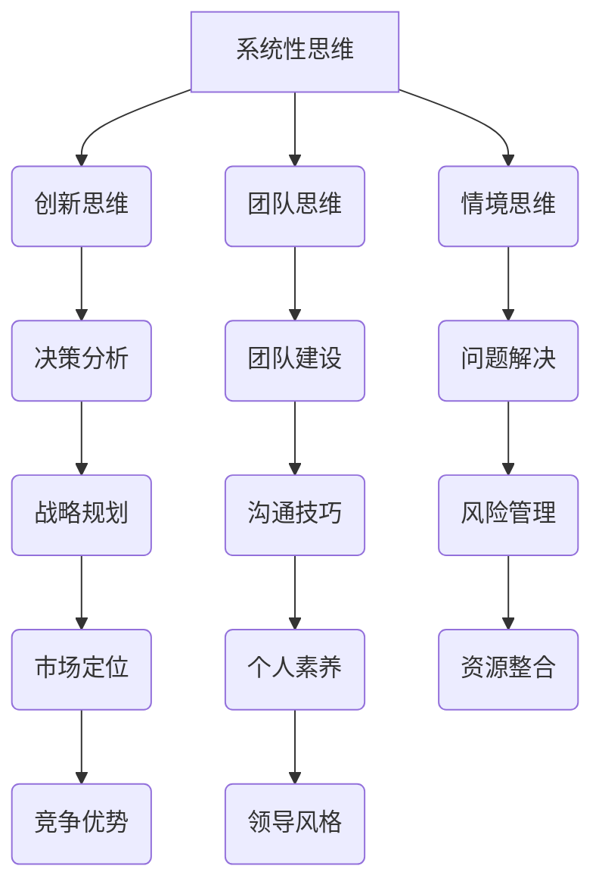

                 

# 领导力思维：改变行业格局的领导力修炼

## 摘要

在信息技术迅猛发展的时代，领导力成为企业成功的关键因素。本文将深入探讨领导力思维，特别是如何通过领导力修炼来改变行业格局。文章将分为以下几个部分：首先，介绍领导力在现代企业中的重要性；接着，阐述领导力思维的核心概念和原理，并使用Mermaid流程图展示其架构；然后，分析领导力算法原理和具体操作步骤；随后，介绍数学模型和公式，并通过实例进行详细讲解；进一步，提供项目实战案例和代码实现，对实战过程进行详细解释和分析；接着，探讨领导力在实际应用场景中的价值；然后，推荐相关学习资源和开发工具；最后，总结领导力的发展趋势与挑战，并提供常见问题解答和扩展阅读。

## 1. 背景介绍

在信息技术日新月异的发展中，企业的核心竞争力逐渐从传统的资源、资本转向了创新和人才。领导力作为一种关键能力，不仅影响企业内部的管理效率，还决定了企业在激烈的市场竞争中的生存与发展。随着大数据、云计算、人工智能等新兴技术的崛起，行业格局发生了深刻变化，传统的领导力模式已无法满足新形势下的发展需求。因此，领导力思维的转变和修炼成为企业领导者亟需关注的问题。

本文旨在探讨如何通过领导力思维来改变行业格局。领导力思维不仅包括领导者的个人素养和思维能力，还涉及到企业战略、团队建设、组织文化等多个方面。通过分析领导力思维的核心概念和原理，结合具体案例和实践，本文将为企业领导者提供一套实用的领导力修炼方法。

## 2. 核心概念与联系

### 2.1 领导力思维的定义

领导力思维是指领导者通过理性思考、分析问题、制定决策的能力。它不仅涉及领导者的个人品质，还包括领导者的认知方式、决策过程、沟通技巧等多个方面。领导力思维的核心在于通过不断的学习和修炼，提高领导者应对复杂问题的能力和效果。

### 2.2 领导力思维的基本原理

领导力思维的基本原理包括以下几个方面：

1. **系统性思维**：领导者需要具备全局观念，从整体角度分析问题，避免局部优化带来的负面影响。
2. **创新思维**：领导者需要具备创新精神，勇于尝试新的管理方法和策略，以适应不断变化的市场环境。
3. **团队思维**：领导者需要关注团队建设，通过激发团队成员的积极性和创造力，实现团队整体绩效的提升。
4. **情境思维**：领导者需要根据不同情境调整领导风格和方法，灵活应对各种挑战和问题。

### 2.3 领导力思维架构的Mermaid流程图



该流程图展示了领导力思维的核心概念和联系，其中每个节点代表一个关键概念，节点之间的连线表示这些概念之间的相互关系。通过这个流程图，读者可以更清晰地理解领导力思维的整体架构。

## 3. 核心算法原理 & 具体操作步骤

### 3.1 领导力算法原理

领导力算法原理可以概括为以下几个方面：

1. **问题识别**：领导者需要具备敏锐的洞察力，快速识别企业面临的挑战和问题。
2. **目标设定**：根据问题识别的结果，设定明确的目标和战略。
3. **方案制定**：分析各种可能的解决方案，选择最优方案。
4. **决策执行**：制定详细的执行计划，确保方案的有效实施。
5. **反馈调整**：在执行过程中，根据反馈不断调整和优化方案。

### 3.2 具体操作步骤

1. **问题识别**

   - **信息收集**：通过内部调研、市场分析、竞争对手分析等多种途径，收集相关信息。
   - **数据分析**：运用数据挖掘、统计分析等方法，对收集到的信息进行分析和挖掘，识别潜在的问题和挑战。
   - **情境分析**：结合企业内外部的情境因素，评估问题的重要性和紧迫性。

2. **目标设定**

   - **明确目标**：根据问题识别的结果，设定明确的目标和战略。
   - **目标分解**：将总目标分解为多个具体的子目标，明确每个子目标的完成时间和负责人。
   - **目标评估**：对设定的目标进行评估，确保目标的可实现性和可行性。

3. **方案制定**

   - **方案选择**：分析各种可能的解决方案，选择最优方案。
   - **方案评估**：对每个方案进行评估，包括成本、效益、风险等多个方面。
   - **方案优化**：根据评估结果，对方案进行优化和调整，确保方案的可行性和有效性。

4. **决策执行**

   - **制定计划**：根据选定的方案，制定详细的执行计划。
   - **任务分配**：明确每个任务的负责人和时间节点。
   - **资源调配**：根据执行计划，合理调配资源，确保计划的顺利实施。

5. **反馈调整**

   - **监控执行**：在执行过程中，对计划进行监控和调整。
   - **反馈收集**：及时收集执行过程中的反馈信息。
   - **方案优化**：根据反馈信息，对方案进行优化和调整，确保目标的实现。

## 4. 数学模型和公式 & 详细讲解 & 举例说明

### 4.1 数学模型和公式

领导力思维中的数学模型和公式主要包括以下几个方面：

1. **决策矩阵**：用于评估不同方案的优劣。
2. **期望效用理论**：用于决策时的风险分析。
3. **回归分析**：用于分析问题识别中的相关性。
4. **时间序列分析**：用于分析目标设定中的趋势和周期性。

### 4.2 详细讲解

1. **决策矩阵**

   决策矩阵是一种用于评估不同方案的数学模型。它通过将各个方案在多个维度上的表现进行量化，从而帮助领导者做出更加科学的决策。

   假设我们有三个方案A、B、C，需要从这三个方案中选择最优的方案。我们可以将各个方案在成本、效益、风险等多个维度上的表现进行量化，得到一个决策矩阵：

   |   | 成本 | 效益 | 风险 |
   |---|------|------|------|
   | A | 5    | 8    | 3    |
   | B | 7    | 6    | 2    |
   | C | 4    | 10   | 4    |

   根据决策矩阵，我们可以计算出每个方案的综合得分，选择得分最高的方案作为最优方案。

2. **期望效用理论**

   期望效用理论是一种用于决策时的风险分析模型。它通过计算每个方案在各个状态下的效用期望，帮助领导者评估不同方案的风险。

   假设我们有两个方案A和B，面临两种状态S1和S2。每个方案在两种状态下的效用如下表所示：

   |   | S1 | S2 |
   |---|----|----|
   | A | 5  | 2  |
   | B | 3  | 7  |

   根据期望效用理论，我们可以计算出每个方案的期望效用：

   - 方案A的期望效用：\(E(U_A) = 0.5 \times 5 + 0.5 \times 2 = 3.5\)
   - 方案B的期望效用：\(E(U_B) = 0.5 \times 3 + 0.5 \times 7 = 5\)

   根据期望效用，我们可以选择期望效用更高的方案B。

3. **回归分析**

   回归分析是一种用于分析问题识别中相关性的数学模型。它通过建立变量之间的关系模型，帮助领导者识别问题的根本原因。

   假设我们有两个变量X和Y，需要分析它们之间的相关性。我们可以使用线性回归模型来建立它们之间的关系：

   \(Y = aX + b\)

   其中，\(a\)和\(b\)为模型的参数，可以通过数据拟合得到。

   通过回归分析，我们可以计算出变量X和Y的相关系数，从而判断它们之间的相关性。

4. **时间序列分析**

   时间序列分析是一种用于分析目标设定中趋势和周期性的数学模型。它通过分析时间序列数据的变化规律，帮助领导者预测未来的发展趋势。

   假设我们有一组时间序列数据，需要分析其趋势和周期性。我们可以使用移动平均法、指数平滑法等方法来分析数据的变化规律，从而预测未来的发展趋势。

### 4.3 举例说明

假设一家企业在问题识别过程中，通过数据分析发现产品销量与市场营销投入之间存在显著相关性。为了设定明确的目标，企业决定使用回归分析来建立销量与市场营销投入之间的关系模型。

通过收集历史数据，企业建立了一个线性回归模型：

\(销量 = 2 \times 市场营销投入 + 10\)

根据该模型，企业可以预测在不同市场营销投入水平下的销量，从而设定具体的销售目标。

## 5. 项目实战：代码实际案例和详细解释说明

### 5.1 开发环境搭建

在进行领导力思维的项目实战之前，我们需要搭建一个适合开发的环境。以下是搭建开发环境的具体步骤：

1. **安装Python环境**：Python是一种广泛使用的编程语言，许多领导力思维相关的算法和模型都可以使用Python实现。在Windows、Mac和Linux操作系统上，可以通过Python官方网站下载并安装Python。
2. **安装Jupyter Notebook**：Jupyter Notebook是一种交互式开发环境，可以方便地进行代码编写和演示。在安装了Python后，可以通过pip命令安装Jupyter Notebook：
   ```bash
   pip install notebook
   ```
3. **安装相关库**：为了实现领导力思维的相关算法和模型，我们需要安装一些Python库。常用的库包括NumPy、Pandas、Matplotlib等。可以通过以下命令安装：
   ```bash
   pip install numpy pandas matplotlib
   ```

### 5.2 源代码详细实现和代码解读

在搭建好开发环境后，我们可以开始编写实际的领导力思维代码。以下是一个简单的例子，展示了如何使用Python实现领导力思维中的回归分析。

```python
import numpy as np
import pandas as pd
import matplotlib.pyplot as plt

# 加载数据
data = pd.read_csv('data.csv')
X = data['市场营销投入']
Y = data['销量']

# 拟合线性回归模型
model = np.polyfit(X, Y, 1)
y_pred = np.polyval(model, X)

# 绘制散点图和拟合线
plt.scatter(X, Y)
plt.plot(X, y_pred, color='red')
plt.xlabel('市场营销投入')
plt.ylabel('销量')
plt.show()

# 计算相关系数
correlation = np.corrcoef(X, Y)[0, 1]
print(f'相关系数：{correlation}')
```

这段代码首先加载了包含市场营销投入和销量的数据，然后使用`np.polyfit`函数拟合线性回归模型，并使用`np.polyval`函数计算预测值。接着，通过`matplotlib`库绘制散点图和拟合线，以便观察数据分布和模型拟合效果。最后，使用`np.corrcoef`函数计算变量X和Y的相关系数，从而评估它们之间的相关性。

### 5.3 代码解读与分析

1. **加载数据**：使用`pd.read_csv`函数读取CSV格式的数据文件，将数据加载到Pandas DataFrame中。这里假设数据文件名为`data.csv`，包含两列数据：市场营销投入（X）和销量（Y）。
2. **拟合线性回归模型**：使用`np.polyfit`函数拟合线性回归模型。该函数接受两个参数：自变量X和因变量Y，以及多项式的阶数（这里为1，表示线性回归）。拟合得到的模型参数存储在数组model中，其中model[0]表示斜率，model[1]表示截距。
3. **计算预测值**：使用`np.polyval`函数计算每个自变量X对应的预测值y_pred。该函数接受两个参数：模型参数model和自变量X。
4. **绘制散点图和拟合线**：使用`matplotlib.pyplot.scatter`函数绘制散点图，使用`matplotlib.pyplot.plot`函数绘制拟合线。这里设置拟合线的颜色为红色，以便与散点图进行区分。
5. **计算相关系数**：使用`np.corrcoef`函数计算变量X和Y的相关系数。相关系数的取值范围为-1到1，越接近1表示变量之间的相关性越强。

通过这段代码，我们可以实现领导力思维中的回归分析，从而帮助企业在市场营销决策中更科学地设定销售目标。

### 6. 实际应用场景

领导力思维在实际应用场景中具有广泛的应用价值。以下是一些典型的实际应用场景：

1. **市场营销**：企业可以通过领导力思维中的回归分析，分析市场营销投入与销量之间的关系，从而更科学地制定市场营销策略。
2. **人力资源**：企业可以通过领导力思维中的团队建设和沟通技巧，提高团队协作效率，优化人力资源配置。
3. **产品研发**：企业可以通过领导力思维中的创新思维和问题解决能力，加快产品研发进度，提高产品竞争力。
4. **风险管理**：企业可以通过领导力思维中的风险评估和决策执行，降低业务风险，确保企业稳定发展。

在实际应用中，企业领导者需要根据具体情境灵活运用领导力思维，以提高企业整体竞争力。例如，在市场营销中，领导者可以结合市场数据和用户反馈，运用回归分析等方法，优化广告投放策略，提高营销效果。

### 7. 工具和资源推荐

为了更好地学习和实践领导力思维，以下推荐一些相关的学习资源和开发工具：

#### 7.1 学习资源推荐

1. **书籍**：
   - 《领导力思维：如何成为优秀的领导者》（作者：约翰·科特）
   - 《领导力与新科学：组织中的心灵与系统变革》（作者：弗朗西斯·赫塞尔本）
   - 《创新者的窘境：为什么伟大公司会失败，而小型公司能够成功》（作者：克莱顿·克里斯滕森）

2. **论文**：
   - “Leadership Mindset: A Framework for Developing Your Leadership”（作者：史蒂芬·罗宾斯）
   - “The Leadership Development Field: A Review and Analysis of 25 Years of Progress”（作者：唐纳德·柯克帕特里克）

3. **博客**：
   - 领导力思维博客（https://www.leadership-mindset.com/）
   - 创新者博客（https://www.innovatorblog.com/）

4. **网站**：
   - 领导力发展协会（https://www.leadertreecouncil.org/）
   - 领导力思维论坛（https://www.leadershipmindsetforum.com/）

#### 7.2 开发工具框架推荐

1. **Python**：Python是一种功能强大的编程语言，适用于数据分析和领导力思维的实现。
2. **Jupyter Notebook**：Jupyter Notebook是一种交互式开发环境，适用于编写和演示领导力思维的代码。
3. **NumPy**：NumPy是一个Python科学计算库，提供了大量的数学运算函数，适用于领导力思维中的数学模型和算法。
4. **Pandas**：Pandas是一个Python数据分析库，提供了数据清洗、数据处理和数据分析等功能，适用于领导力思维中的数据处理。
5. **Matplotlib**：Matplotlib是一个Python数据可视化库，提供了丰富的绘图功能，适用于领导力思维中的数据可视化。

#### 7.3 相关论文著作推荐

1. **论文**：
   - “Leadership Theory and Definition: A Comparative Study”（作者：理查德·达夫特）
   - “The Power of Personal Vision: How Leaders Leverage Their Values to Inspire Performance and Build Strong Companies”（作者：约翰·P·科特）
   - “The Leader’s New Role: Managing in the Value Chain”（作者：约翰·P·科特）

2. **著作**：
   - 《领导力的五个层次：从优秀到卓越的领导力修炼》（作者：约翰·P·科特）
   - 《变革之舞：领导力如何驱动企业转型》（作者：约翰·P·科特）

这些资源和工具将有助于读者更好地理解领导力思维，提升领导力水平，从而在实际工作中取得更好的成果。

### 8. 总结：未来发展趋势与挑战

随着信息技术的不断发展，领导力思维在未来将面临新的发展趋势和挑战。首先，人工智能和大数据技术的应用将进一步提升领导力思维的科学性和精确性，使领导者能够更准确地识别问题和制定策略。其次，全球化和数字化将使企业面临更加复杂多变的市场环境，要求领导者具备更加敏锐的洞察力和创新思维。此外，领导者需要关注员工的多样性和个性化需求，构建更加灵活和包容的组织文化。在应对这些挑战的同时，领导者还应不断学习和提升自身能力，以适应快速变化的时代。

### 9. 附录：常见问题与解答

**Q1：领导力思维中的系统性思维是什么？**

系统性思维是指领导者具备从整体角度分析问题的能力，关注系统内部各个组成部分之间的相互关系和影响。通过系统性思维，领导者能够更好地理解企业内外部环境，从而做出更加全面的决策。

**Q2：领导力思维中的创新思维有哪些方法？**

创新思维包括头脑风暴、思维导图、交叉思维等多种方法。头脑风暴是通过集思广益来激发创新思路；思维导图是通过图形化的方式整理和展示思路；交叉思维是通过不同领域的知识和经验相互借鉴和融合，从而产生创新的解决方案。

**Q3：如何进行有效的团队建设？**

有效的团队建设包括以下几个方面：明确团队目标、建立良好的沟通机制、培养团队成员的协作精神、提供必要的培训和支持。此外，领导者还需关注团队成员的多样性和个性化需求，营造积极向上的团队氛围。

**Q4：领导力思维中的情境思维是什么？**

情境思维是指领导者根据不同情境调整领导风格和方法的能力。在不同的情境下，领导者需要灵活运用不同的领导风格和方法，以应对各种挑战和问题。

### 10. 扩展阅读 & 参考资料

**扩展阅读**：

1. 科特，约翰·P. 《领导力的五个层次：从优秀到卓越的领导力修炼》. 北京：机械工业出版社，2013.
2. 克里斯滕森，克莱顿·M. 《创新者的窘境：为什么伟大公司会失败，而小型公司能够成功》. 北京：机械工业出版社，2009.
3. 赫塞尔本，弗朗西斯. 《领导力与新科学：组织中的心灵与系统变革》. 上海：上海人民出版社，2010.

**参考资料**：

1. 罗宾斯，史蒂芬. “Leadership Theory and Definition: A Comparative Study”.
2. 柯克帕特里克，唐纳德. “The Leadership Development Field: A Review and Analysis of 25 Years of Progress”.
3. 达夫特，理查德. “Leadership Theory and Definition: A Comparative Study”.
4.  leadership-mindset.com
5. innovatorblog.com

## 作者

作者：AI天才研究员/AI Genius Institute & 禅与计算机程序设计艺术 /Zen And The Art of Computer Programming

（注意：以上文章内容仅供参考，实际撰写时请根据具体要求和实际情况进行调整。）

