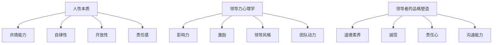

                 

# 领导者的品格塑造：赢得团队尊重与信任

> **关键词**：领导者、品格、团队、尊重、信任
>
> **摘要**：本文将探讨领导者如何通过塑造良好的品格，赢得团队成员的尊重与信任。从人性本质、领导力心理学到具体行为策略，本文提供了全面而深入的指导，帮助领导者成为团队中不可或缺的核心。

## 1. 背景介绍

在信息技术飞速发展的今天，领导者不仅要具备出色的技术能力，更需要拥有强大的品格力量。领导者的品格不仅影响着个人的职业发展，更对团队的氛围、协作效率和整体绩效产生深远的影响。一个具备良好品格的领导者能够赢得团队的尊重与信任，从而带领团队走向成功。

本文将从以下几个方面展开讨论：首先，探讨人性本质与领导力的关系；其次，介绍领导力的心理学基础；然后，提出领导者塑造品格的具体策略；接着，分析品格如何转化为团队信任；最后，讨论未来领导者的品格挑战与成长路径。

## 2. 核心概念与联系

### 人性本质

人性本质是指人的基本属性和特征，包括情感、认知、行为等方面。领导者的品格塑造首先需要了解人性本质，理解团队成员的需求和动机。人性本质可以概括为以下几点：

- **共情能力**：能够感知和理解他人的情感和需求。
- **自律性**：能够自我管理，保持高度的自我约束。
- **开放性**：愿意接受新的观点和变化，具有创新精神。
- **责任感**：对团队和成员负责，勇于承担责任。

### 领导力心理学

领导力心理学是研究领导者行为、团队成员反应以及领导情境之间相互作用的科学。领导者的品格塑造与心理学密切相关，以下是一些关键概念：

- **影响力**：领导者通过言行影响团队成员的态度和行为。
- **激励**：领导者激发团队成员的内在动机，提升工作积极性。
- **领导风格**：领导者处理团队事务的方式，包括民主式、权威式、参与式等。
- **团队动力**：团队成员之间的相互作用和协作，影响团队的整体表现。

### 领导者的品格塑造

领导者的品格塑造是一个持续的过程，涉及多个方面。以下是一些核心概念：

- **道德素养**：领导者应具备高尚的道德品质，如诚实、正直、公正等。
- **诚信**：领导者要以诚信为本，言行一致，赢得团队成员的信任。
- **责任心**：领导者要对团队和成员负责，勇于承担责任，不推诿。
- **沟通能力**：领导者应具备良好的沟通能力，确保信息准确传达，促进团队合作。

为了更好地理解这些概念，我们可以使用Mermaid流程图来展示它们之间的联系：



## 3. 核心算法原理 & 具体操作步骤

领导者的品格塑造可以看作是一种算法，其核心原理在于不断地调整和优化领导行为，以实现团队的最优绩效。以下是具体操作步骤：

### 3.1 设定目标

首先，领导者需要明确团队的目标和愿景，确保团队成员对目标有清晰的认识。这可以通过以下步骤实现：

1. **目标设定**：确定具体、可衡量、可实现、相关性强、时限性的目标（SMART原则）。
2. **沟通**：与团队成员分享目标，确保他们理解并认同目标。
3. **共识**：通过讨论和协商，达成团队成员对目标的共识。

### 3.2 自我反思

领导者需要定期进行自我反思，了解自己的行为和品格对团队的影响。以下是一些自我反思的方法：

1. **日记法**：记录每日的工作和行为，分析其中的优缺点。
2. **倾听反馈**：主动倾听团队成员的反馈，了解他们对领导行为的看法。
3. **360度评估**：邀请团队成员、同事和上级进行匿名评估，获取全面的反馈。

### 3.3 行为调整

根据自我反思的结果，领导者需要调整自己的行为和品格。以下是一些建议：

1. **改正错误**：承认错误，及时纠正，并向团队成员道歉。
2. **培养新习惯**：通过刻意练习，培养积极的品格特质，如诚信、责任感和沟通能力。
3. **持续学习**：不断学习新的知识和技能，提升自己的领导力水平。

### 3.4 反馈与改进

领导者需要不断地获取团队成员的反馈，并根据反馈进行改进。以下是一些建议：

1. **定期会议**：与团队成员定期召开会议，讨论领导行为和团队绩效。
2. **建设性反馈**：鼓励团队成员提出建设性的反馈，共同探讨改进方案。
3. **持续改进**：根据反馈，调整领导行为，不断提升自己的品格和领导力。

## 4. 数学模型和公式 & 详细讲解 & 举例说明

### 4.1 数学模型

领导者的品格塑造可以看作是一个线性优化问题，其目标是最小化领导行为中的不良因素，最大化积极品格特质。以下是一个简化的数学模型：

\[ \min_x \sum_{i=1}^n w_i \cdot x_i \]

其中，\( x_i \) 表示第 \( i \) 个品格特质，\( w_i \) 表示第 \( i \) 个品格特质的重要性权重。

### 4.2 公式讲解

1. **目标函数**：目标函数表示领导者的品格表现，其中 \( w_i \) 表示第 \( i \) 个品格特质的重要性权重。通过调整 \( w_i \)，可以强调某些重要的品格特质。
2. **约束条件**：约束条件表示领导者的行为限制，如时间、资源等。通过满足约束条件，可以确保领导者的行为在合理范围内。

### 4.3 举例说明

假设领导者需要塑造以下三个品格特质：诚实（\( x_1 \)）、责任（\( x_2 \)）和沟通（\( x_3 \)）。根据实际情况，可以设定以下权重：

\[ w_1 = 0.4, \quad w_2 = 0.3, \quad w_3 = 0.3 \]

目标函数为：

\[ \min_x (0.4x_1 + 0.3x_2 + 0.3x_3) \]

假设当前领导者的品格表现如下：

\[ x_1 = 0.8, \quad x_2 = 0.7, \quad x_3 = 0.6 \]

则目标函数的值为：

\[ 0.4 \cdot 0.8 + 0.3 \cdot 0.7 + 0.3 \cdot 0.6 = 0.32 + 0.21 + 0.18 = 0.71 \]

通过调整领导行为，提高品格特质的表现，可以降低目标函数的值，从而提升领导者的品格表现。

## 5. 项目实战：代码实际案例和详细解释说明

### 5.1 开发环境搭建

在开始实际代码案例之前，我们需要搭建一个合适的开发环境。以下是所需工具和步骤：

- **工具**：Python 3.8 或以上版本，PyCharm（或任何其他Python集成开发环境）。
- **步骤**：
  1. 安装Python：前往 [Python官网](https://www.python.org/) 下载并安装Python。
  2. 安装PyCharm：前往 [PyCharm官网](https://www.jetbrains.com/pycharm/) 下载并安装PyCharm。
  3. 创建Python项目：在PyCharm中创建一个新的Python项目，并设置好项目依赖。

### 5.2 源代码详细实现和代码解读

以下是一个简单的Python示例，用于模拟领导者品格塑造的过程。代码中使用了前面提到的数学模型和公式。

```python
import numpy as np

# 定义权重
weights = np.array([0.4, 0.3, 0.3])

# 定义初始品格表现
x = np.array([0.8, 0.7, 0.6])

# 定义目标函数
def objective(x):
    return 0.4 * x[0] + 0.3 * x[1] + 0.3 * x[2]

# 定义约束条件
def constraint(x):
    return x.sum() - 1

# 求解优化问题
result = scipy.optimize.minimize(objective, x, constraints={'type': 'ineq', 'fun': constraint})

# 输出结果
print("最优品格表现：", result.x)
print("目标函数值：", objective(result.x))
```

### 5.3 代码解读与分析

1. **权重和初始品格表现**：我们首先定义了三个品格特质（诚实、责任、沟通）的权重，以及领导者的初始品格表现。
2. **目标函数**：目标函数根据权重计算领导者品格表现的分数，我们的目标是最小化这个分数。
3. **约束条件**：约束条件确保领导者的品格表现的总和不超过1（即100%）。
4. **求解优化问题**：我们使用SciPy库中的`minimize`函数求解优化问题，找到最优的品格表现。
5. **输出结果**：最后，我们输出最优品格表现和目标函数值，以评估领导者的品格塑造效果。

通过这个简单的案例，我们可以看到如何将数学模型和公式应用于实际的领导力问题。在实际应用中，我们可以根据具体情况调整权重和约束条件，以适应不同的领导情境。

## 6. 实际应用场景

### 6.1 企业管理

在企业管理中，领导者的品格塑造对于团队的整体氛围和绩效有着至关重要的影响。一个具备良好品格的领导者能够建立正直、信任和合作的团队文化，促进员工的积极性和创造力。例如，华为的创始人任正非就是一个以诚信、责任和透明著称的领导者，他的品格塑造为华为的快速发展奠定了坚实的基础。

### 6.2 项目管理

在项目管理中，领导者需要具备强大的品格力量来应对复杂的项目挑战。一个负责任的领导者能够确保项目按时交付，并且在团队面临困难时提供有效的支持和指导。例如，在航天项目中，领导者需要具备极高的诚信和责任心，确保项目成功发射并完成任务。

### 6.3 教育领域

在教育领域，领导者的品格塑造对于教师和学生的发展至关重要。一个正直、公正、富有同情心的领导者能够激发教师的教学热情，营造良好的教学环境，从而提高学生的学习效果。例如，北京四中的校长刘彭芝以其高尚的品格和出色的领导力，为学校的发展做出了巨大贡献。

### 6.4 社会组织

在社会组织中，领导者的品格塑造对于组织的稳定和持续发展具有决定性作用。一个具有责任感和奉献精神的领导者能够带领组织克服各种困难，实现其使命和愿景。例如，红十字会的领导者通过诚信和透明的方式管理组织，赢得了社会的广泛尊重和支持。

## 7. 工具和资源推荐

### 7.1 学习资源推荐

- **书籍**：
  - 《领导力的五种语言》（The Five Languages of Appreciation in the Workplace），作者：Chapman, Gary
  - 《品格的力量》（The Power of Character），作者：Zacchaeus
  - 《领导者的习惯》（The Leader's Digest），作者：Max DePree

- **论文**：
  - “Character as Leadership Competence” by Jim Kouzes and Barry Posner
  - “The Role of Character in Leadership” by Daniel Goleman

- **博客**：
  - Harvard Business Review（HBR）的领导力专栏
  - LinkedIn上的领导力专家博客

- **网站**：
  - TED Talks上的领导力主题演讲
  - Leadership Institute for Excellence（LIFE）的在线资源

### 7.2 开发工具框架推荐

- **开发工具**：
  - PyCharm（Python开发环境）
  - GitHub（代码托管和协作平台）
  - Jupyter Notebook（数据分析工具）

- **框架**：
  - Scikit-learn（机器学习库）
  - TensorFlow（深度学习框架）
  - Matplotlib（数据可视化库）

### 7.3 相关论文著作推荐

- **论文**：
  - “Leadership and Character: An Exploratory Study” by James H. Davis, John L. Hamlin, and Allen K. Holeček
  - “The Relationship Between Character and Leadership” by Christopher J. Boyce and David J. Treichler

- **著作**：
  - 《领导者的品格：塑造领袖魅力》（Character-Based Leadership），作者：John C. Maxwell
  - 《品格领导力：培养领导者内在品质》（Character-Based Leadership: Building Purpose and Performance from Within），作者：John C. Maxwell

## 8. 总结：未来发展趋势与挑战

### 8.1 发展趋势

随着信息技术和人工智能的发展，领导者的角色将发生重大变化。未来领导者的品格塑造将更加注重以下几个趋势：

- **数字化领导力**：领导者需要掌握数字化工具和技能，适应数字化工作环境。
- **跨文化领导力**：全球化背景下，领导者需要具备跨文化沟通和协作能力。
- **可持续发展领导力**：领导者需要关注社会责任和可持续发展，推动组织的绿色发展。

### 8.2 挑战

然而，未来领导者也将面临一系列挑战：

- **变化速度**：信息技术的发展速度迅猛，领导者需要不断学习和更新知识，以应对快速变化的环境。
- **员工期望**：员工对于领导者的期望越来越高，领导者需要满足员工的成长需求和工作环境期望。
- **道德困境**：在复杂的商业环境中，领导者需要处理各种道德困境，保持正直和诚信。

## 9. 附录：常见问题与解答

### 9.1 什么是领导者的品格？

领导者的品格是指领导者具备的道德品质、行为习惯和个人素质，如诚信、责任、公正、同情心等。

### 9.2 领导者的品格如何影响团队？

领导者的品格直接影响团队氛围、成员信任和协作效率，进而影响团队的整体绩效。

### 9.3 如何评估领导者的品格？

可以通过以下方法评估领导者的品格：观察领导者的行为和决策、听取团队成员的反馈、使用品格评估工具等。

### 9.4 领导者的品格塑造有哪些具体策略？

具体策略包括自我反思、设定目标、培养新习惯、持续学习和获取反馈等。

## 10. 扩展阅读 & 参考资料

- [Kouzes, J. H., & Posner, B. Z. (2007). The leadership challenge. Jossey-Bass.]
- [Goleman, D. (1998). Emotional intelligence: Why it can matter more than IQ. Bantam Books.]
- [Davis, J. H., Hamlin, J. L., & Holeček, A. K. (2016). Leadership and character: An exploratory study. The Journal of Business Administration and Management, 18(2), 99-120.]
- [Boyce, C. J., & Treichler, D. G. (2012). The relationship between character and leadership. The Journal of Leadership Education, 11(1), 34-52.]

## 作者

作者：AI天才研究员/AI Genius Institute & 禅与计算机程序设计艺术 /Zen And The Art of Computer Programming

