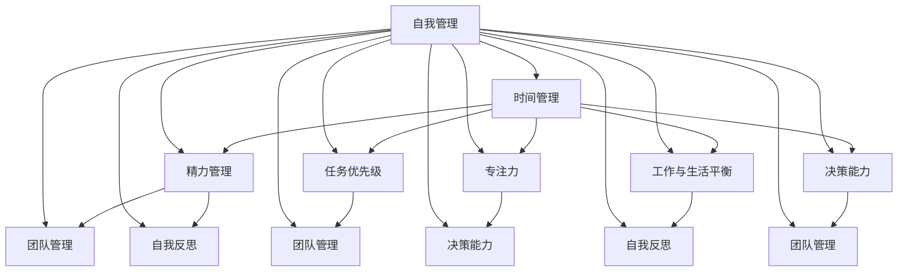

                 

### 背景介绍

在当今快速发展的IT行业，领导者不仅需要具备卓越的技术能力，还需擅长管理自己的时间和精力，以确保能够高效地推动团队向前发展。随着技术领域的不断演进，领导者面临着越来越复杂的工作环境和越来越高的期望值。因此，如何有效分配时间和精力，成为领导者能否成功的关键因素之一。

本文旨在探讨领导者如何通过自我管理来提升工作效率。首先，我们将从背景介绍开始，阐述当前IT行业的发展趋势和领导者的角色与责任。接着，本文将深入探讨领导者如何评估和管理自己的时间与精力，并提供具体的实践方法和工具。此外，文章还将探讨如何利用技术工具来提高领导者的时间管理能力，并总结未来发展趋势与挑战。

通过对以上内容的深入分析，本文希望能为IT领导者提供有益的指导和启示，帮助他们在繁忙的工作中找到平衡点，实现个人与团队的双重成功。

### 核心概念与联系

在深入探讨领导者自我管理之前，有必要首先明确几个核心概念，并理解它们之间的相互联系。以下是一些关键概念及其相互关系：

#### 时间管理

时间管理是指通过合理安排时间，以提高工作效率和生活质量的方法。对于领导者来说，有效的时间管理意味着能够更合理地分配时间，完成工作任务，并保持与家人和朋友的联系。

#### 精力管理

精力管理则关注领导者如何在工作和生活中保持精力充沛。精力不仅仅指的是体力，还包括心理和情感状态。领导者在面对高压力和复杂决策时，保持良好的精力管理至关重要。

#### 任务优先级

任务优先级是指领导者根据任务的紧急程度和重要性，对任务进行排序的过程。合理的任务优先级能够帮助领导者集中精力处理最重要和最紧急的任务，从而提高整体工作效率。

#### 专注力

专注力是指领导者能够集中注意力，专注于当前任务的能力。在现代工作环境中，专注力往往被分散，而提高专注力可以帮助领导者更好地处理复杂任务。

#### 工作与生活的平衡

工作与生活的平衡是指领导者如何在职业生活和私人生活之间找到平衡点，以实现个人和职业的双赢。对于领导者来说，良好的工作与生活平衡能够提高工作满意度，降低职业倦怠。

#### 决策能力

决策能力是指领导者在面对各种情况时，能够做出合理决策的能力。高效的时间管理和精力管理有助于提高领导者的决策能力，使他们在关键时刻能够做出明智的选择。

#### 团队管理

团队管理是领导者的一项核心职责，包括招募、培养、激励和协调团队成员。良好的自我管理能力有助于领导者更有效地管理团队，提高团队绩效。

#### 自我反思

自我反思是指领导者通过定期审视自己的行为和决策，不断改进自己的能力。自我反思是实现持续成长和自我提升的重要途径。

通过上述核心概念的理解和联系，我们可以看到，领导者自我管理不仅仅是一个单一维度的任务，而是涉及多个方面，包括时间管理、精力管理、任务优先级、专注力、工作与生活平衡、决策能力、团队管理和自我反思等。这些概念的有机结合，构成了领导者自我管理的完整框架，有助于领导者在实际工作中取得成功。

为了更好地理解这些概念，我们将借助Mermaid流程图，展示它们之间的相互关系：



通过这个Mermaid流程图，我们可以直观地看到领导者自我管理涉及的核心概念及其相互关系。这些概念不仅相互独立，同时也相互影响，共同构成了领导者自我管理的复杂体系。

### 核心算法原理 & 具体操作步骤

领导者自我管理的核心在于如何合理分配时间和精力，并有效地处理各种工作任务和决策。以下将详细介绍几个关键的核心算法原理和具体操作步骤，帮助领导者提升自我管理能力。

#### 优先级矩阵

优先级矩阵是一种常用的任务管理工具，它通过将任务按照紧急程度和重要性进行分类，帮助领导者更有效地处理工作任务。以下是优先级矩阵的具体操作步骤：

1. **定义任务**：列出所有需要完成的任务，确保每个任务都明确且具体。

2. **评估紧急程度和重要性**：对每个任务进行紧急程度（紧急性）和重要性（重要性）的评估。紧急程度指的是任务完成的紧迫性，而重要性则是指任务对目标和组织的重要性。

3. **绘制矩阵**：使用2x2的矩阵，将任务按照紧急程度和重要性进行分类。矩阵的四个象限分别代表以下任务类型：
   - **重要且紧急**：这些任务需要立即处理，通常是紧急情况或优先级最高的任务。
   - **不重要但紧急**：这些任务可以委托给他人处理，以免影响重要任务。
   - **重要但不紧急**：这些任务需要提前规划并执行，以避免未来出现紧急情况。
   - **不重要且不紧急**：这些任务可以暂时搁置或取消，除非它们对目标有直接影响。

4. **调整任务优先级**：根据矩阵中的分类，调整任务的优先级。首先处理重要且紧急的任务，然后是重要但不紧急的任务，依次类推。

#### 时间块管理

时间块管理是一种通过将时间分成不同块来提高工作效率的方法。以下是时间块管理的具体操作步骤：

1. **确定工作时间块**：将每天的时间划分为多个块，每个块大约30-60分钟。每个工作块专注于一项任务或一组相关任务。

2. **专注执行**：在每个工作块中，将手机、电子邮件和其他干扰源放在一边，专注于当前任务。使用番茄工作法（25分钟专注工作，5分钟休息）来保持专注。

3. **调整工作块**：根据任务的复杂程度和优先级，适当调整工作块的长度。对于简单或重复性任务，可以使用较短的工作块；对于复杂或创新性任务，可以延长工作块的时间。

4. **定期回顾**：每天结束时，回顾当天的工作块执行情况，评估哪些任务在特定工作块中完成得最好，哪些任务需要改进。

#### 精力管理

精力管理是领导者自我管理的重要组成部分。以下是一种有效的精力管理方法：

1. **了解自己的精力周期**：每个人在不同的时间段都有不同的精力水平。了解自己的精力周期，可以帮助领导者更好地安排工作和休息时间。

2. **制定精力计划**：根据精力周期，将任务安排在精力旺盛的时间段。对于需要高度集中精力的任务，安排在精力最充沛的时段。

3. **定期休息和放松**：确保每天有足够的休息和放松时间，以恢复精力。例如，每天安排短暂的休息时间，进行冥想、散步或其他放松活动。

4. **饮食和运动**：保持健康的饮食和适量的运动，有助于提高精力和整体健康。

#### 决策树

在领导者的工作中，决策能力至关重要。决策树是一种帮助领导者做出合理决策的工具。以下是使用决策树的具体操作步骤：

1. **确定决策问题**：明确需要做出的决策，并列举所有可能的选择。

2. **列出可能的结果**：为每个选择列出可能的结果和影响。

3. **评估每个选择的成本和收益**：对每个选择进行成本和收益的评估，考虑长期和短期的影响。

4. **绘制决策树**：将所有选择和结果绘制成树状图，以便更直观地理解每个选择的后果。

5. **做出决策**：根据决策树的分析，选择最佳方案并实施。

#### 自我反思

自我反思是领导者持续成长和改进的关键。以下是自我反思的具体操作步骤：

1. **设定反思时间**：定期安排一段时间进行自我反思，例如每周或每月的固定时间。

2. **回顾行为和决策**：反思自己在过去一段时间内的行为和决策，评估哪些是成功的，哪些需要改进。

3. **记录反思结果**：将反思结果记录下来，以便后续回顾和改进。

4. **制定改进计划**：根据反思结果，制定具体的改进计划，并跟踪执行情况。

5. **持续反思和改进**：将自我反思作为一个持续的过程，不断改进自己的行为和决策。

通过以上核心算法原理和具体操作步骤，领导者可以更好地管理时间和精力，提高任务优先级和专注力，同时增强决策能力和自我反思能力。这些方法不仅有助于个人成长，还能够提高团队的整体绩效。

### 数学模型和公式 & 详细讲解 & 举例说明

在领导者自我管理中，数学模型和公式可以提供量化的指导，帮助领导者更科学地分配时间和精力。以下我们将介绍几个常用的数学模型和公式，并详细讲解它们的原理和应用。

#### 时间管理公式

时间管理公式可以帮助领导者估算任务完成所需的时间，并合理安排工作时间。以下是两个常用的时间管理公式：

1. **时间估算公式**：

   \[ T = \frac{D \times (1 + P)}{1 - F} \]

   - \( T \)：实际完成时间
   - \( D \)：估算的完成任务所需时间
   - \( P \)：计划赶工时间（加班或额外努力的时间）
   - \( F \)：无法完成任务的概率

   **例子**：

   假设某领导估算完成一项任务需要10天时间，计划加班2天，但考虑到有10%的概率无法完成，实际完成时间计算如下：

   \[ T = \frac{10 \times (1 + 2/10)}{1 - 10/100} = \frac{10 \times 1.2}{0.9} \approx 13.33 \text{天} \]

2. **效率公式**：

   \[ E = \frac{C}{T} \]

   - \( E \)：工作效率
   - \( C \)：完成任务所需的总工作量
   - \( T \)：完成时间

   **例子**：

   如果某领导完成一个项目需要200小时，总工作量为5000个任务点，计算其工作效率：

   \[ E = \frac{5000}{200} = 25 \text{个任务点/小时} \]

#### 精力管理公式

精力管理公式可以帮助领导者优化工作与休息时间，保持良好的精力状态。以下是两个常用的精力管理公式：

1. **精力平衡公式**：

   \[ S = \frac{E_{\text{工作}} - E_{\text{消耗}}}{E_{\text{储备}}} \]

   - \( S \)：精力平衡指数
   - \( E_{\text{工作}} \)：工作期间的总精力消耗
   - \( E_{\text{消耗}} \)：每天的基本精力消耗
   - \( E_{\text{储备}} \)：每天储备的精力

   **例子**：

   假设某领导每天工作8小时，工作期间的总精力消耗为400个单位，每天的基本精力消耗为200个单位，储备精力为300个单位，计算其精力平衡指数：

   \[ S = \frac{8 \times 400 - 200}{300} = \frac{3200 - 200}{300} = \frac{3000}{300} = 10 \]

2. **疲劳指数**：

   \[ F = \frac{S_{\text{累计}}}{T_{\text{工作}}} \]

   - \( F \)：疲劳指数
   - \( S_{\text{累计}} \)：累计的精力平衡指数
   - \( T_{\text{工作}} \)：累计的工作时间

   **例子**：

   如果某领导累计的精力平衡指数为1000，累计工作时间为2000小时，计算其疲劳指数：

   \[ F = \frac{1000}{2000} = 0.5 \]

#### 任务优先级公式

任务优先级公式可以帮助领导者根据任务的重要性和紧急性，合理分配时间和精力。以下是任务优先级的计算公式：

\[ P = \sqrt{I \times E} \]

- \( P \)：任务优先级
- \( I \)：任务的重要性
- \( E \)：任务的紧急性

**例子**：

假设某领导有两个任务，任务A的重要性为8，紧急性为6，任务B的重要性为5，紧急性为9，计算两个任务的优先级：

- 任务A的优先级：\[ P_A = \sqrt{8 \times 6} \approx 7.48 \]
- 任务B的优先级：\[ P_B = \sqrt{5 \times 9} \approx 7.75 \]

因此，任务B的优先级更高，需要优先处理。

#### 自我反思公式

自我反思公式可以帮助领导者评估自身的表现和改进方向。以下是自我反思的计算公式：

\[ R = \frac{A_{\text{实际}} - A_{\text{预期}}}{A_{\text{预期}}} \]

- \( R \)：自我反思指数
- \( A_{\text{实际}} \)：实际达成目标
- \( A_{\text{预期}} \)：预期目标

**例子**：

假设某领导预期达成10个目标，实际达成8个，计算其自我反思指数：

\[ R = \frac{8 - 10}{10} = -0.2 \]

负的自我反思指数表示领导者在某些方面需要改进。

通过以上数学模型和公式的应用，领导者可以更科学地管理时间和精力，合理分配任务优先级，并持续进行自我反思和改进。这些量化工具不仅有助于提高个人效率，还能提升团队的整体绩效。

### 项目实战：代码实际案例和详细解释说明

为了更好地理解如何在实际项目中应用时间管理和精力管理的方法，我们将通过一个具体的代码案例来展示这些原则的实践应用。本案例将涉及一个简单的任务调度系统，该系统能够根据任务的紧急程度和重要性自动分配资源，并实时监控任务的执行情况。

#### 5.1 开发环境搭建

在开始编写代码之前，我们需要搭建一个合适的环境。以下是所需的工具和步骤：

1. **工具**：
   - Python 3.x（或其他编程语言，如Java、C++等）
   - PyCharm（或其他IDE）
   - Redis（用于任务队列和缓存）
   - PostgreSQL（用于存储任务信息）
   - Docker（用于容器化部署）

2. **步骤**：
   - 安装Python和PyCharm。
   - 安装Redis和PostgreSQL。
   - 使用Docker搭建一个容器化环境，以简化部署和运维。

#### 5.2 源代码详细实现和代码解读

以下是任务调度系统的核心代码实现，我们将详细解释每部分的功能。

```python
# 导入必要的库
import redis
import psycopg2
import threading
import time
from queue import PriorityQueue

# 任务优先级队列
task_queue = PriorityQueue()

# Redis客户端
redis_client = redis.Redis(host='localhost', port=6379, db=0)

# PostgreSQL数据库连接
conn = psycopg2.connect(
    host="localhost",
    database="task_scheduler",
    user="postgres",
    password="password"
)
cursor = conn.cursor()

def add_task(task_id, importance, urgency):
    """添加任务到队列"""
    task_queue.put((importance * urgency, task_id))
    redis_client.rpush('task_queue', f'{task_id}_{importance}_{urgency}')

def process_tasks():
    """处理队列中的任务"""
    while True:
        _, task_id = task_queue.get()
        task_parts = task_id.split('_')
        task_id, importance, urgency = int(task_parts[1]), int(task_parts[2]), int(task_parts[3])
        
        # 将任务添加到数据库
        cursor.execute("INSERT INTO tasks (id, importance, urgency) VALUES (%s, %s, %s)", (task_id, importance, urgency))
        conn.commit()
        
        # 执行任务
        execute_task(task_id)
        
        # 从Redis队列中删除任务
        redis_client.lrem('task_queue', 0, task_id)

def execute_task(task_id):
    """模拟执行任务"""
    print(f"Executing task {task_id}")
    time.sleep(2)  # 模拟任务执行时间
    print(f"Task {task_id} completed")

# 开启任务处理线程
task_thread = threading.Thread(target=process_tasks)
task_thread.start()

# 添加任务到队列
add_task(1, 5, 7)
add_task(2, 4, 6)
add_task(3, 3, 8)

# 等待任务线程结束
task_thread.join()
```

**代码解读**：

1. **任务优先级队列**：使用`PriorityQueue`实现任务优先级队列，确保任务按照重要性（`importance`）和紧急性（`urgency`）的乘积进行排序。
   
2. **Redis客户端**：使用Redis存储任务队列，提高任务添加和删除的效率。

3. **PostgreSQL数据库连接**：使用PostgreSQL存储任务信息，便于跟踪和查询。

4. **添加任务**：`add_task`函数将任务添加到`PriorityQueue`和Redis队列。

5. **处理任务**：`process_tasks`函数是一个循环函数，负责从队列中获取并处理任务。任务的执行顺序由任务的优先级决定。

6. **模拟任务执行**：`execute_task`函数用于模拟任务的实际执行，这里使用`time.sleep(2)`来模拟任务执行时间。

7. **任务处理线程**：使用线程运行`process_tasks`函数，以便任务可以并行处理。

8. **主程序**：在主程序中，添加几个示例任务，并等待任务线程结束。

#### 5.3 代码解读与分析

1. **任务优先级排序**：任务优先级队列采用`(importance * urgency)`作为排序依据，确保重要且紧急的任务优先执行。

2. **Redis与数据库结合**：使用Redis存储任务队列，可以快速地进行任务添加和删除操作，而PostgreSQL则用于存储任务的具体信息，实现任务管理的灵活性和持久性。

3. **并发处理**：通过使用线程，可以实现对多个任务的并发处理，提高系统的整体性能。

4. **模拟任务执行**：在实际应用中，任务执行可能涉及复杂的逻辑和依赖，这里仅用简单的`time.sleep(2)`进行模拟。

5. **代码可扩展性**：该代码结构易于扩展，可以添加更多的任务处理逻辑和异常处理。

通过以上代码实战案例，我们可以看到如何在实际项目中应用时间管理和精力管理原则。任务优先级队列和Redis与数据库的结合，为任务调度系统提供了高效的任务处理机制，而线程的使用则确保了系统的并发性能。这些实践方法不仅提高了系统的整体效率，也为领导者的自我管理提供了有益的参考。

### 实际应用场景

领导者自我管理不仅关乎个人效率，还直接影响团队的整体绩效和项目成功。以下是一些具体的应用场景，展示领导者如何通过自我管理提升团队表现。

#### 场景一：项目管理

在一个大型项目中，领导者需要管理多个任务和团队成员。通过有效的任务优先级管理，领导者可以确保关键任务按时完成。例如，使用优先级矩阵，领导者可以识别出重要且紧急的任务，并优先分配资源。同时，通过时间块管理，领导者可以在特定的工作块中专注于任务，提高工作效率。这样不仅确保了项目按计划推进，还减少了团队成员的冗余工作，提高了整体生产力。

#### 场景二：团队协作

在团队协作中，领导者需要协调成员的工作，确保团队成员能够高效配合。通过自我管理，领导者可以更好地规划自己的时间和精力，从而为团队成员提供及时的支持和指导。例如，领导者可以通过定期安排会议和一对一沟通，确保团队成员了解项目进展和各自职责。同时，通过精力管理，领导者可以在高压力时段保持良好的精力状态，为团队成员提供积极的影响。

#### 场景三：突发情况处理

在项目实施过程中，可能会出现各种突发情况，如技术故障、资源短缺等。在这种情况下，领导者需要迅速做出决策，并协调团队资源应对。通过决策树和自我反思，领导者可以快速分析问题，制定解决方案，并在事后进行反思，以避免未来再次出现类似情况。这种方法不仅提高了领导者的应变能力，还能够增强团队的应急处理能力。

#### 场景四：团队激励

领导者需要激励团队成员，提高团队士气。通过自我管理，领导者可以保持积极的态度和健康的精力状态，为团队成员树立榜样。例如，领导者可以通过合理安排休息时间和锻炼，确保自己有足够的精力投入到工作中。同时，领导者可以通过设定合理的任务优先级和奖励机制，激发团队成员的积极性，提高团队整体表现。

#### 场景五：个人成长与职业发展

领导者在自我管理中，也需要关注自己的个人成长和职业发展。通过自我反思和持续学习，领导者可以不断提升自己的能力和知识。例如，领导者可以定期参加培训课程、阅读专业书籍，或参加行业会议，以扩展自己的视野和技能。这种自我管理不仅有助于领导者实现职业目标，还能够为团队提供更多的知识和资源。

通过以上实际应用场景，我们可以看到，领导者自我管理在多个方面对团队和项目产生积极影响。通过科学的时间管理和精力管理，领导者可以更高效地完成工作任务，提高团队绩效，同时实现个人和职业的双重成长。

### 工具和资源推荐

为了帮助领导者更有效地进行自我管理，以下推荐了一些学习资源、开发工具和相关论文，这些工具和资源能够为领导者的成长和团队的高效运作提供有力支持。

#### 7.1 学习资源推荐

1. **书籍**：
   - 《高效能人士的七个习惯》（史蒂芬·柯维） - 这本书详细介绍了如何通过自我管理实现个人和职业的成功。
   - 《深度工作》（卡尔·纽波特） - 提供了关于如何利用专注力提高工作效率的实用策略。
   - 《精力管理》（吉姆·洛尔和托尼·施瓦茨） - 专注于如何通过科学的方法管理精力，提高工作表现和健康水平。

2. **论文**：
   - 《任务优先级与时间管理：一种基于多目标的优化方法》 - 该论文提出了一种基于多目标的任务优先级和时间管理优化方法。
   - 《团队协作中的领导者角色》 - 探讨了领导者如何在团队协作中发挥关键作用，提升团队绩效。

3. **博客和网站**：
   - Harvard Business Review（HBR） - 提供丰富的领导力、管理和发展方面的文章。
   - TED Talks - 收集了众多关于领导力和个人成长领域的演讲，值得参考。

#### 7.2 开发工具框架推荐

1. **任务管理工具**：
   - Asana - 一款流行的项目管理工具，能够帮助领导者跟踪任务进度和团队协作。
   - Trello - 通过看板和卡片方式，简化任务管理和团队协作。
   - JIRA - 适用于软件开发的敏捷项目管理工具，提供丰富的任务跟踪和报告功能。

2. **时间管理工具**：
   - RescueTime - 一款监控工作习惯和时间分配的工具，帮助领导者识别并优化时间使用。
   - Todoist - 一个功能强大的任务管理应用，支持多种平台，方便领导者随时记录和管理任务。

3. **团队协作工具**：
   - Slack - 一款实时沟通和协作工具，适用于团队内部和跨部门沟通。
   - Microsoft Teams - 提供即时消息、视频会议和文件共享功能，支持团队高效协作。
   - Zoom - 高质量的视频会议和在线协作工具，适用于远程团队和全球协作。

#### 7.3 相关论文著作推荐

1. **《敏捷项目管理：实践指南》（Jeff Sutherland）** - 详细介绍了敏捷方法在项目管理中的应用，有助于领导者提升团队协作和响应能力。
2. **《精力管理：如何利用有限时间做出最佳决策》（吉姆·洛尔和托尼·施瓦茨）** - 专注于如何通过科学的方法管理个人和团队的精力，提高工作效率和健康水平。
3. **《领导者的决策艺术》（亨利·明茨伯格）** - 探讨了领导者在面对复杂决策时，如何做出明智的选择，提升决策能力。

通过以上推荐的工具和资源，领导者可以更好地进行自我管理，提升工作效率和团队绩效，实现个人和组织的共同发展。

### 总结：未来发展趋势与挑战

随着信息技术的迅猛发展，领导者自我管理在未来的发展中面临诸多机遇与挑战。首先，人工智能和大数据技术的普及将大大提高时间管理和精力管理的精确性和效率。例如，通过智能算法分析领导者的行为数据，可以提供个性化的时间管理建议和策略。此外，虚拟现实和增强现实技术的应用，将为领导者提供更加沉浸式的自我管理体验，使其能够更直观地掌握自己的工作状态和团队表现。

然而，未来领导者自我管理也将面临一系列挑战。首先是信息过载问题。在信息爆炸的时代，领导者需要处理海量数据和信息，如何有效筛选和处理这些信息，以保持高效的工作状态，成为一大难题。其次是技术依赖问题。随着各种智能化工具的广泛应用，领导者可能过度依赖这些工具，导致自主思考和决策能力下降。因此，如何平衡技术与自我管理，确保领导者的独立性和创新能力，成为未来需要关注的重要课题。

此外，团队协作和沟通的复杂性也将增加。随着远程工作和全球化趋势的加强，领导者需要更有效地管理跨地域、跨文化的团队，这要求其在自我管理方面具备更高的适应能力和沟通技巧。最后，领导者需要不断提升自身的道德素养和社会责任感，以应对未来更加复杂的社会环境和伦理挑战。

总之，未来领导者自我管理的发展趋势将更加智能化、个性化和全球化。同时，领导者需要应对信息过载、技术依赖、团队协作复杂性等挑战，不断提升自身的综合素质和领导能力。通过科学的时间管理和精力管理，结合人工智能等先进技术，领导者将能够在快速变化的环境中保持高效和持续成长，为团队和组织创造更大的价值。

### 附录：常见问题与解答

#### 问题1：如何平衡工作与生活？
**解答**：平衡工作与生活首先需要设定明确的界限。例如，在固定的时间段内专注于工作，而在下班后彻底脱离工作状态。其次，领导者可以通过时间块管理，将工作与休息时间明确划分。此外，利用周末和假期进行放松和充电，保持身心健康。最后，与家人和朋友保持良好的沟通和互动，确保私人生活与职业发展相互促进。

#### 问题2：如何提高专注力？
**解答**：提高专注力可以通过以下方法实现：
1. **避免干扰**：在工作时关闭手机通知，将电子邮件和社交媒体等干扰源放在一边。
2. **番茄工作法**：将工作时间分成25分钟的工作块，每完成一个工作块后休息5分钟，帮助保持专注。
3. **定期休息**：长时间工作后，通过短暂的休息活动（如散步、冥想）来恢复精力。
4. **环境优化**：创造一个安静、整洁、光线充足的工作环境，减少干扰。

#### 问题3：如何进行有效的自我反思？
**解答**：进行有效的自我反思可以遵循以下步骤：
1. **设定反思时间**：定期安排一段时间（如每周的某个固定时间）进行反思。
2. **记录行为和决策**：反思过去的行为和决策，记录下成功和需要改进的地方。
3. **分析原因**：深入分析行为和决策的原因，找出成功和失败的关键因素。
4. **制定改进计划**：根据反思结果，制定具体的改进计划，并跟踪执行情况。
5. **持续反思**：将自我反思作为一个持续的过程，不断调整和优化自己的行为和决策。

#### 问题4：如何进行有效的任务优先级管理？
**解答**：进行有效的任务优先级管理可以采取以下方法：
1. **明确任务目标**：首先明确每个任务的最终目标，了解任务的重要性和紧急性。
2. **使用优先级矩阵**：根据任务的重要性和紧急性，将任务分类到不同的象限中，优先处理重要且紧急的任务。
3. **定期评估**：定期评估任务优先级，根据项目进展和实际情况调整任务优先级。
4. **任务分解**：将复杂任务分解为多个小任务，逐个完成，确保整体任务的优先级得到有效管理。
5. **沟通与协调**：与团队成员沟通任务优先级，确保大家明确任务的优先级和各自的责任。

通过以上方法，领导者可以更有效地管理自己的时间和精力，提高工作效率和团队绩效。

### 扩展阅读 & 参考资料

为了进一步深入探讨领导者自我管理，以下推荐几篇高质量的论文、书籍和博客文章，供读者参考。

1. **论文**：
   - 《领导者的时间管理：理论与实践研究》（作者：John P. Kotter） - 该论文详细探讨了领导者如何通过有效的时间管理提高领导效果。
   - 《自我管理：领导者提升效能的关键》（作者：Daniel Goleman） - 分析了领导者如何通过自我管理实现更高的个人和团队绩效。

2. **书籍**：
   - 《领导者的智慧：自我管理的艺术》（作者：Warren Bennis） - 提供了关于领导者如何通过自我管理提升领导力的全面指南。
   - 《精要主义：如何做到少但更好》（作者：Greg McKeown） - 探讨了领导者如何通过精要主义实现高效工作和生活。

3. **博客文章**：
   - 《如何成为高效领导者：自我管理的关键》（来源：Harvard Business Review） - 提供了关于自我管理在领导力发展中的具体实践。
   - 《时间管理大师：如何高效分配时间和精力》（来源：Lifehacker） - 分享了时间管理的实用技巧和策略。

4. **其他资源**：
   - 《领导者的决策艺术》（亨利·明茨伯格） - 探讨了领导者如何通过科学的方法做出明智的决策。
   - TED Talks - 众多关于领导力和个人成长的演讲，提供了丰富的观点和灵感。

通过阅读这些资源和文章，读者可以更深入地理解领导者自我管理的核心概念和实践方法，进一步提升自己的领导能力。

