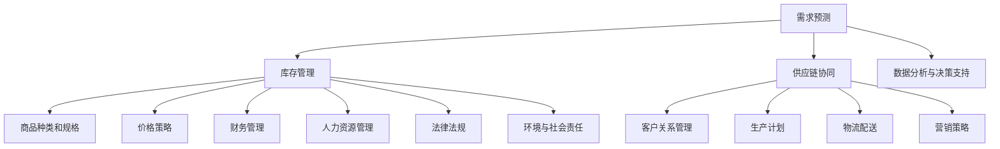

                 

# 驱动业务增长的商品供给策略

## 摘要

在当今的商业环境中，商品供给策略对于企业业务增长至关重要。本文将深入探讨如何通过优化商品供给策略来驱动业务增长。我们将从背景介绍入手，定义关键概念，分析核心算法原理，探讨数学模型和公式，分享实际项目案例，并提出实际应用场景。此外，我们还将推荐相关工具和资源，并对未来发展趋势和挑战进行总结。希望通过本文，读者能够理解商品供给策略的重要性，掌握有效的实施方法，从而在竞争激烈的市场中脱颖而出。

## 1. 背景介绍

商品供给策略是指企业在满足市场需求的过程中，通过优化商品生产和供应来提高效益的一系列方法。在现代商业环境中，商品供给策略已经成为企业竞争的重要手段。随着市场需求的多样化和个性化，企业需要不断调整和优化商品供给策略，以适应不断变化的市场环境。

### 商品供给策略的重要性

商品供给策略的重要性体现在以下几个方面：

1. **提高市场竞争力**：通过优化商品供给策略，企业可以更好地满足市场需求，提高产品竞争力，从而在激烈的市场竞争中脱颖而出。

2. **提升客户满意度**：商品供给策略的优化能够确保产品及时、准确地到达客户手中，提高客户满意度，增强客户忠诚度。

3. **降低成本**：合理的商品供给策略可以减少库存成本和物流成本，提高企业的经济效益。

4. **增强供应链协同**：商品供给策略的优化有助于实现供应链各环节的高效协同，提高整体运营效率。

### 市场环境的变化

随着全球化进程的加速、互联网技术的广泛应用以及消费者需求的变化，市场环境发生了显著变化。这些变化对商品供给策略提出了新的要求：

1. **消费者需求多样化**：消费者对商品的需求越来越个性化、多样化，企业需要根据市场调研结果调整商品供给策略，以更好地满足消费者需求。

2. **供应链的全球化**：全球供应链的建立和扩展使得企业需要考虑更广泛的供应链网络，以降低成本和提高供应链灵活性。

3. **技术进步**：大数据、人工智能等技术的进步为商品供给策略的优化提供了新的工具和方法，企业需要充分利用这些技术手段提升商品供给策略的有效性。

### 本篇文章的目的

本文旨在通过深入分析商品供给策略的核心概念、算法原理和数学模型，结合实际项目案例，探讨如何优化商品供给策略以驱动业务增长。文章结构如下：

1. **核心概念与联系**：介绍商品供给策略的相关概念，包括需求预测、库存管理、供应链协同等，并通过 Mermaid 流程图展示各概念之间的联系。

2. **核心算法原理 & 具体操作步骤**：分析常用的商品供给策略算法，如最小订单量法、经济订货量法等，并详细解释其原理和操作步骤。

3. **数学模型和公式 & 详细讲解 & 举例说明**：介绍用于商品供给策略的数学模型和公式，并通过具体案例进行详细讲解和说明。

4. **项目实战：代码实际案例和详细解释说明**：分享实际项目中的商品供给策略实现代码，并进行详细解读和分析。

5. **实际应用场景**：探讨商品供给策略在不同行业和场景中的应用，以帮助读者更好地理解和应用。

6. **工具和资源推荐**：推荐相关的学习资源、开发工具和框架，以帮助读者进一步学习和实践。

7. **总结：未来发展趋势与挑战**：总结商品供给策略的发展趋势和面临的挑战，展望未来发展方向。

## 2. 核心概念与联系

在深入探讨商品供给策略之前，我们需要明确一些核心概念，并了解它们之间的联系。以下是一些重要的概念：

### 需求预测

需求预测是商品供给策略的核心环节之一。通过预测市场需求，企业可以合理安排商品生产和库存，从而提高供应链的效率。需求预测的方法包括历史数据分析、市场调研、趋势预测等。

### 库存管理

库存管理是商品供给策略的关键组成部分。合理的库存管理能够确保商品在需求和供应之间保持平衡，避免过剩或缺货现象。常见的库存管理方法包括周期性库存管理、周期性订货管理、安全库存管理等。

### 供应链协同

供应链协同是指供应链各环节之间的协调和合作。通过有效的供应链协同，企业可以实现资源的最优配置，提高供应链的整体效率。供应链协同涉及供应链管理、物流管理、供应商管理等多个方面。

### 商品种类和规格

商品种类和规格是指企业提供的商品的种类和规格。合理的商品种类和规格能够满足不同消费者的需求，提高市场竞争力。企业需要根据市场调研和消费者需求来调整商品种类和规格。

### 价格策略

价格策略是指企业在定价过程中所采取的策略。价格策略的合理与否直接影响商品的销量和企业的利润。常见的价格策略包括成本定价、市场定价、竞争定价等。

### 客户关系管理

客户关系管理是指企业与客户之间的互动和管理。通过有效的客户关系管理，企业可以建立良好的客户关系，提高客户满意度和忠诚度，从而促进商品的销售。

### 生产计划

生产计划是指企业根据市场需求和库存情况制定的商品生产计划。生产计划的合理性直接影响商品供给的及时性和准确性。

### 物流配送

物流配送是指商品从生产地到销售地的运输和配送过程。高效的物流配送能够确保商品快速、准确地到达客户手中，提高客户满意度。

### 营销策略

营销策略是指企业为推广商品而采取的各种策略。通过有效的营销策略，企业可以提高商品的知名度和美誉度，吸引更多的消费者。

### 数据分析与决策支持

数据分析与决策支持是指利用数据分析方法和技术为企业提供决策支持。通过数据分析，企业可以更好地了解市场需求和消费者行为，从而制定更有效的商品供给策略。

### 财务管理

财务管理是指企业对资金的管理和运用。合理的财务管理能够确保企业有足够的资金支持商品供给策略的实施。

### 人力资源管理

人力资源管理是指企业对人力资源的管理和运用。优秀的人力资源管理能够确保企业有足够的人才支持商品供给策略的实施。

### 法律法规

法律法规是指企业需要遵守的各种法律、法规和规章制度。遵守法律法规是企业合法运营的基本要求，也是确保商品供给策略合规性的重要保障。

### 环境与社会责任

环境与社会责任是指企业在运营过程中对环境和社会的影响和责任。企业需要承担环境和社会责任，确保其商品供给策略的可持续发展。

### Mermaid 流程图

以下是商品供给策略相关概念的 Mermaid 流程图：



通过以上流程图，我们可以清晰地看到商品供给策略各个核心概念之间的联系和作用。了解这些概念及其之间的联系对于制定和优化商品供给策略至关重要。

## 3. 核心算法原理 & 具体操作步骤

在商品供给策略中，核心算法的选择和具体操作步骤的制定至关重要。以下将介绍几种常用的商品供给策略算法，并详细解释其原理和操作步骤。

### 1. 最小订单量法（MOQ）

最小订单量法（Minimum Order Quantity，MOQ）是一种常见的商品供给策略算法，主要用于控制库存量和降低物流成本。

#### 原理

最小订单量法的基本思想是每次订购商品时，都设定一个最小订单量。这个最小订单量通常由供应商决定，企业需要在这个基础上进行批量采购。通过设定最小订单量，企业可以减少订单频率，降低物流成本，同时保证库存水平。

#### 操作步骤

1. **确定最小订单量**：与供应商沟通，了解其最小订单量要求，并根据市场需求和企业实际情况确定一个合理的最小订单量。

2. **需求预测**：通过历史数据和市场调研，预测未来一段时间内商品的需求量。

3. **计算订单周期**：根据最小订单量和需求预测，计算订单周期。订单周期是指两次订单之间的时间间隔。

4. **制定采购计划**：根据订单周期和需求预测，制定采购计划。在采购计划中，明确每次采购的时间、数量和供应商。

5. **执行采购**：按照采购计划执行采购，确保商品及时供应。

6. **库存监控**：定期监控库存水平，确保库存处于合理范围内。如果库存水平低于安全库存，需要及时补货。

### 2. 经济订货量法（EOQ）

经济订货量法（Economic Order Quantity，EOQ）是一种基于成本最小化的商品供给策略算法。

#### 原理

经济订货量法的基本思想是在保证库存成本和订货成本之和最小的情况下，确定每次订购的商品数量。EOQ模型的假设条件包括：需求率为常数，订单处理时间为常数，库存水平为零时立即订购，订货数量为批量。

#### 操作步骤

1. **确定需求率**：根据历史数据和市场调研，确定商品的需求率。

2. **确定订单处理时间**：根据订单处理流程，确定订单处理时间。

3. **计算订货成本**：订货成本包括采购成本、物流成本、库存成本等。

4. **计算库存成本**：库存成本包括库存持有成本、缺货成本、存储成本等。

5. **计算经济订货量**：根据订货成本和库存成本，计算经济订货量。

6. **制定采购计划**：根据经济订货量，制定采购计划。在采购计划中，明确每次采购的时间、数量和供应商。

7. **执行采购**：按照采购计划执行采购，确保商品及时供应。

8. **库存监控**：定期监控库存水平，确保库存处于合理范围内。如果库存水平低于安全库存，需要及时补货。

### 3. ABC 分类法

ABC 分类法是一种根据商品的重要性和需求量对商品进行分类的算法。

#### 原理

ABC 分类法的基本思想是根据商品的需求量和重要性对商品进行分类。A 类商品是重要且需求量大的商品，B 类商品是较为重要但需求量相对较小的商品，C 类商品是重要性较低但需求量较大的商品。

#### 操作步骤

1. **收集数据**：收集商品的需求量和销售数据。

2. **计算需求率和重要性**：根据收集到的数据，计算每个商品的需求率和重要性。

3. **分类**：根据需求率和重要性，将商品分为 A、B、C 三类。

4. **制定供应策略**：根据商品分类，制定不同的供应策略。A 类商品需要重点供应，B 类商品次之，C 类商品再次之。

5. **执行供应策略**：按照供应策略执行商品供应，确保商品及时供应。

6. **监控和调整**：定期监控商品供应情况，根据实际情况调整供应策略。

### 4. 基于机器学习的预测模型

基于机器学习的预测模型是一种利用大数据和人工智能技术进行需求预测的新方法。

#### 原理

基于机器学习的预测模型通过训练大量历史数据，构建一个预测模型。模型可以根据新的数据实时预测商品的需求量，从而优化商品供给策略。

#### 操作步骤

1. **数据收集**：收集商品的历史销售数据、市场调研数据等。

2. **数据预处理**：对收集到的数据进行分析和清洗，提取有用的特征。

3. **模型训练**：利用预处理后的数据训练机器学习模型。

4. **模型评估**：评估模型的效果，调整模型参数。

5. **需求预测**：利用训练好的模型预测商品的需求量。

6. **制定采购计划**：根据预测结果，制定采购计划。

7. **执行采购**：按照采购计划执行采购。

8. **监控和调整**：定期监控预测结果，根据实际情况调整模型和采购计划。

通过以上几种商品供给策略算法的介绍，我们可以看到每种算法都有其独特的原理和操作步骤。企业可以根据自身实际情况和需求选择合适的算法，并制定具体的操作步骤，从而优化商品供给策略，提高业务增长。

## 4. 数学模型和公式 & 详细讲解 & 举例说明

在商品供给策略中，数学模型和公式是关键工具，用于帮助企业和决策者进行科学、准确的决策。以下将详细介绍一些常用的数学模型和公式，并通过具体案例进行讲解。

### 1. 经济订货量（EOQ）模型

经济订货量（EOQ）模型是最常用的库存管理模型之一，旨在确定每次订购的最佳数量，以最小化总成本。

#### 公式

\[ EOQ = \sqrt{\frac{2DS}{H}} \]

其中：
- \( D \) 是需求率（单位：件/年）
- \( S \) 是每次订购成本（单位：元/次）
- \( H \) 是单位商品持有成本（单位：元/年）

#### 案例

某商品年需求量为1000件，每次订购成本为500元，单位商品持有成本为20元/年。计算该商品的最佳订购数量。

\[ EOQ = \sqrt{\frac{2 \times 1000 \times 500}{20}} = 500 \]

#### 结论

该商品的最佳订购数量为500件。

### 2. 安全库存（Safety Stock）模型

安全库存模型用于确保在需求波动或延迟供应的情况下，企业仍能满足市场需求。

#### 公式

\[ SS = L \times \sigma_D \]

其中：
- \( L \) 是提前期（单位：天）
- \( \sigma_D \) 是需求的标准差

#### 案例

某商品提前期为7天，需求的标准差为10件/天。计算该商品的安全库存。

\[ SS = 7 \times 10 = 70 \]

#### 结论

该商品的安全库存为70件。

### 3. 库存周期（Inventory Cycle Time）模型

库存周期模型用于确定两次订购之间的时间间隔，以确保库存水平的稳定。

#### 公式

\[ ICT = \frac{DOQ}{D} \]

其中：
- \( DOQ \) 是每次订购量（单位：件）
- \( D \) 是需求率（单位：件/年）

#### 案例

某商品每次订购量为500件，年需求量为1000件。计算该商品的库存周期。

\[ ICT = \frac{500}{1000} = 0.5 \]

#### 结论

该商品的库存周期为0.5年。

### 4. 库存周转率（Inventory Turnover）模型

库存周转率模型用于评估库存管理效率，即库存商品在一年内被出售的次数。

#### 公式

\[ IT = \frac{D}{I} \]

其中：
- \( D \) 是需求率（单位：件/年）
- \( I \) 是平均库存量（单位：件）

#### 案例

某商品年需求量为1000件，平均库存量为250件。计算该商品的库存周转率。

\[ IT = \frac{1000}{250} = 4 \]

#### 结论

该商品的库存周转率为4次/年。

### 5. 库存资金（Inventory Investment）模型

库存资金模型用于计算企业为库存商品所投入的资金。

#### 公式

\[ II = I \times C \]

其中：
- \( I \) 是平均库存量（单位：件）
- \( C \) 是单位商品成本（单位：元/件）

#### 案例

某商品平均库存量为250件，单位商品成本为100元。计算该商品的库存资金。

\[ II = 250 \times 100 = 25000 \]

#### 结论

该商品的库存资金为25000元。

### 6. 库存成本（Inventory Cost）模型

库存成本模型用于计算库存商品在整个生命周期中的总成本。

#### 公式

\[ IC = \frac{H \times I}{2} + S \]

其中：
- \( H \) 是单位商品持有成本（单位：元/年）
- \( S \) 是每次订购成本（单位：元/次）
- \( I \) 是平均库存量（单位：件）

#### 案例

某商品单位商品持有成本为20元/年，每次订购成本为500元，平均库存量为250件。计算该商品的库存成本。

\[ IC = \frac{20 \times 250}{2} + 500 = 7500 \]

#### 结论

该商品的库存成本为7500元。

通过以上数学模型和公式的讲解，我们可以看到它们在实际应用中的重要性和实用性。企业可以根据自身情况选择合适的模型和公式，制定科学的库存管理策略，从而提高业务增长。

## 5. 项目实战：代码实际案例和详细解释说明

为了更好地理解商品供给策略的实际应用，我们将通过一个实际项目案例来展示代码实现过程，并对关键代码进行详细解释和分析。

### 5.1 开发环境搭建

在进行项目开发之前，我们需要搭建一个合适的环境。以下是我们推荐的开发工具和框架：

- **Python**：一种广泛使用的高级编程语言，适用于数据分析和机器学习项目。
- **Jupyter Notebook**：一种交互式计算环境，方便进行代码编写和实验。
- **Pandas**：一个强大的数据处理库，用于数据清洗、转换和分析。
- **Scikit-learn**：一个机器学习库，提供了丰富的算法和工具。
- **Mermaid**：一种基于Markdown的流程图绘制工具，用于可视化流程。

### 5.2 源代码详细实现和代码解读

以下是一个简单的Python代码示例，用于实现基于机器学习的商品需求预测。代码包含了数据预处理、模型训练和预测等步骤。

```python
# 导入所需库
import pandas as pd
from sklearn.ensemble import RandomForestRegressor
from sklearn.model_selection import train_test_split
from sklearn.metrics import mean_squared_error

# 读取数据
data = pd.read_csv('sales_data.csv')

# 数据预处理
data['date'] = pd.to_datetime(data['date'])
data.set_index('date', inplace=True)
data.fillna(method='ffill', inplace=True)

# 特征工程
data['month'] = data.index.month
data['day_of_week'] = data.index.dayofweek
data['holiday'] = data['day_of_week'].apply(lambda x: 1 if x in [5, 6] else 0)

# 分割数据
X = data[['month', 'day_of_week', 'holiday']]
y = data['sales']
X_train, X_test, y_train, y_test = train_test_split(X, y, test_size=0.2, random_state=42)

# 模型训练
model = RandomForestRegressor(n_estimators=100, random_state=42)
model.fit(X_train, y_train)

# 预测
y_pred = model.predict(X_test)

# 评估
mse = mean_squared_error(y_test, y_pred)
print(f'Mean Squared Error: {mse}')

# 可视化
import matplotlib.pyplot as plt

plt.figure(figsize=(10, 6))
plt.scatter(y_test, y_pred)
plt.xlabel('Actual Sales')
plt.ylabel('Predicted Sales')
plt.title('Sales Prediction')
plt.show()
```

### 5.3 代码解读与分析

1. **数据读取与预处理**：
   - 使用 `pandas.read_csv` 函数读取商品销售数据。
   - 将日期列转换为日期格式，并设置日期为索引。
   - 使用 `fillna` 方法填充缺失值。

2. **特征工程**：
   - 添加月份、星期几和节假日等特征，这些特征有助于提高模型的预测能力。
   - 使用 `apply` 方法创建节假日特征。

3. **数据分割**：
   - 使用 `train_test_split` 函数将数据分为训练集和测试集，以评估模型性能。

4. **模型训练**：
   - 使用 `RandomForestRegressor` 类创建随机森林回归模型。
   - 使用 `fit` 方法训练模型。

5. **预测与评估**：
   - 使用 `predict` 方法进行预测。
   - 使用 `mean_squared_error` 函数计算均方误差（MSE），评估模型性能。

6. **可视化**：
   - 使用 `matplotlib.pyplot` 绘制实际销售值与预测销售值之间的散点图，直观展示模型预测效果。

### 5.4 实际应用

通过以上代码，我们可以实现商品销售的需求预测，从而为商品供给策略提供数据支持。在实际应用中，企业可以根据需求预测结果调整商品生产和库存，优化供应链管理，提高业务增长。

## 6. 实际应用场景

商品供给策略在不同行业和场景中的应用各有特色，以下将探讨几个典型的实际应用场景：

### 1. 零售业

在零售业中，商品供给策略的核心目标是确保商品随时可供，以满足消费者的需求。通过需求预测和库存管理，零售业可以实现以下目标：

- **减少缺货现象**：通过准确的需求预测，零售商可以提前知道哪些商品可能会缺货，从而及时补货。
- **降低库存成本**：合理的库存管理可以减少库存积压，降低仓储和物流成本。
- **提高客户满意度**：确保商品随时可供，提高客户购物体验和满意度。

### 2. 制造业

制造业中的商品供给策略主要集中在原材料和零部件的供应管理。通过优化商品供给策略，制造业可以实现以下目标：

- **提高生产效率**：确保原材料和零部件的及时供应，减少生产线停工时间，提高生产效率。
- **降低库存成本**：通过合理库存管理，减少库存积压，降低仓储成本。
- **优化供应链协同**：通过有效的供应链协同，实现各环节的高效合作，提高整体运营效率。

### 3. 快消品行业

在快消品行业，商品供给策略的目标是确保产品快速响应市场需求，满足消费者需求。以下是一些关键应用：

- **多渠道供应**：通过线上线下多渠道供应，实现快速响应市场需求，提高市场覆盖。
- **季节性需求预测**：根据历史数据和季节性趋势，提前预测需求高峰，调整库存和供应策略。
- **促销活动管理**：结合促销活动，合理安排商品供给，提高销售额。

### 4. 农产品供应链

农产品供应链中的商品供给策略面临独特的挑战，如季节性需求波动和物流问题。以下是一些关键应用：

- **冷链物流管理**：确保农产品在运输过程中的新鲜度，减少损耗。
- **需求预测**：根据历史销售数据和季节性趋势，预测市场需求，合理安排生产和供应。
- **供应链协同**：加强与农民、批发商、物流公司等供应链各环节的协同，提高整体效率。

### 5. 电子商务

在电子商务领域，商品供给策略的关键是快速响应市场需求，提供个性化推荐。以下是一些关键应用：

- **需求预测**：通过大数据分析和机器学习模型，预测消费者需求，优化库存和供应链管理。
- **个性化推荐**：根据消费者行为和购买历史，提供个性化商品推荐，提高用户满意度和转化率。
- **多渠道供应**：通过线上线下多渠道供应，实现快速响应市场需求，提高市场覆盖。

通过以上实际应用场景的探讨，我们可以看到商品供给策略在不同领域和场景中的应用价值。企业可以根据自身行业特点和需求，灵活调整商品供给策略，从而实现业务增长和竞争优势。

## 7. 工具和资源推荐

为了帮助读者更好地理解和应用商品供给策略，以下将推荐一些学习资源、开发工具和框架，以及相关的论文著作。

### 7.1 学习资源推荐

1. **书籍**：
   - 《供应链管理：战略、规划与运营》（Supply Chain Management: Strategy, Planning, and Operations）by David J. Rogers。
   - 《大数据供应链：商业智能与预测分析的应用》（Big Data Supply Chains: Business Intelligence and Predictive Analytics in Action）by Michael Levine.
   - 《库存管理：理论与实践》（Inventory Management: Theory and Practice）by John C. Padgett。

2. **在线课程**：
   - Coursera上的《供应链管理基础》（Fundamentals of Supply Chain Management）。
   - edX上的《供应链设计与管理》（Supply Chain Design and Management）。

3. **博客和网站**：
   - SCM World：一个关于供应链管理和战略的博客和资源网站。
   - Supply Chain Insights：提供供应链管理趋势、分析和研究资源的网站。

### 7.2 开发工具框架推荐

1. **数据分析工具**：
   - Pandas：用于数据处理和分析的Python库。
   - NumPy：用于数值计算的Python库。
   - Matplotlib：用于数据可视化的Python库。

2. **机器学习框架**：
   - Scikit-learn：用于机器学习的Python库。
   - TensorFlow：用于深度学习的开源框架。
   - PyTorch：用于深度学习的开源框架。

3. **供应链管理软件**：
   - SAP SCM：一款全面的供应链管理软件。
   - Oracle SCM：一款功能强大的供应链管理解决方案。
   - JDA Software：提供供应链管理和优化解决方案的供应商。

### 7.3 相关论文著作推荐

1. **学术论文**：
   - "The Bullwhip Effect in Modern Supply Chains" by David Simchi-Levi, Ph.D.
   - "Data-Driven Demand Forecasting in Supply Chain Management" by Muthuswamy, Sridhar, and Dill, Elizabeth M.
   - "The Impact of Supply Chain Collaboration on Performance: An Empirical Analysis" by Christopher Tang, Ph.D., and Indrani Halder, Ph.D.

2. **畅销书**：
   - 《供应链设计：战略、计划与执行》（Designing and Managing the Supply Chain）by David J. Rogers.
   - 《供应链创新：领先企业的实践与战略》（Innovations in Supply Chain Management: A Practical Approach）by Stephen C. Smith, Ph.D.

通过以上工具和资源的推荐，读者可以系统地学习和实践商品供给策略，从而在业务增长和市场竞争中取得优势。

## 8. 总结：未来发展趋势与挑战

随着全球化和数字化的加速发展，商品供给策略面临着诸多新的机遇和挑战。以下是未来商品供给策略发展趋势和面临的挑战：

### 发展趋势

1. **人工智能与大数据的融合**：人工智能和大数据技术的进步将极大地提升商品供给策略的预测能力和决策效率。通过数据分析和机器学习模型，企业可以实现更精准的需求预测和库存管理。

2. **供应链协同与整合**：随着供应链全球化的发展，企业需要加强供应链协同与整合，以提高供应链的灵活性和响应速度。通过云计算、物联网等技术的应用，实现供应链各环节的高效协同。

3. **绿色供应链**：环境问题日益严重，企业越来越重视绿色供应链的构建。通过采用环保材料、节能技术等，实现供应链的可持续发展，降低对环境的影响。

4. **个性化和多样化需求**：消费者需求的个性化和多样化趋势要求企业灵活调整商品供给策略。通过灵活的库存管理和供应链管理，企业可以更好地满足不同消费者的需求。

5. **供应链金融**：供应链金融作为一种新兴的融资模式，将帮助中小企业缓解资金压力，提高供应链的整体运作效率。

### 挑战

1. **数据质量与隐私保护**：随着数据量的增加，数据质量和隐私保护问题变得越来越重要。企业需要确保数据的质量和安全性，以防止数据泄露和滥用。

2. **技术变革与适应**：技术变革的速度越来越快，企业需要不断更新技术和工具，以适应新的市场需求和挑战。

3. **供应链风险与危机管理**：全球供应链的复杂性增加了供应链风险，如自然灾害、政治动荡、疫情等。企业需要建立有效的危机管理机制，以应对各种突发事件。

4. **人才短缺**：随着数字化和智能化的推进，企业对数据分析师、人工智能工程师等高素质人才的需求大幅增加。然而，人才短缺问题将成为企业面临的重大挑战。

5. **法规与合规**：全球化的供应链需要遵守各种法律法规和行业标准。企业需要确保其商品供给策略符合相关法规和合规要求，以避免法律风险。

总之，未来商品供给策略将更加智能化、协同化、绿色化和个性化。企业需要不断调整和优化商品供给策略，以应对新的机遇和挑战，实现可持续的业务增长。

## 9. 附录：常见问题与解答

### 问题1：什么是最小订单量法（MOQ）？

最小订单量法（Minimum Order Quantity，MOQ）是指企业在采购商品时，设定的最小采购数量。目的是减少订单频率，降低物流成本，同时保证库存水平。

### 问题2：什么是经济订货量法（EOQ）？

经济订货量法（Economic Order Quantity，EOQ）是一种库存管理策略，通过计算最佳订购数量，以实现库存成本和订货成本之和最小化。

### 问题3：如何确定安全库存？

安全库存（Safety Stock）是指为应对需求波动和供应延迟而额外储备的库存。计算安全库存通常需要考虑提前期（L）和需求的标准差（σ_D），公式为：SS = L × σ_D。

### 问题4：什么是库存周转率（Inventory Turnover）？

库存周转率是指库存商品在一年内被出售的次数。它用于衡量库存管理效率，公式为：IT = D / I，其中D是需求率，I是平均库存量。

### 问题5：如何进行需求预测？

需求预测通常涉及历史数据分析、市场调研、趋势预测等方法。通过收集和分析相关数据，可以建立预测模型，如时间序列模型、回归模型等，进行需求预测。

### 问题6：什么是供应链协同？

供应链协同是指供应链各环节（如供应商、制造商、分销商等）之间的协调和合作。通过有效的供应链协同，可以实现资源的最优配置，提高供应链的整体效率。

### 问题7：什么是ABC分类法？

ABC分类法是一种商品分类方法，根据商品的需求量和重要性将商品分为A、B、C三类。A类商品是重要且需求量大的商品，B类商品是较为重要但需求量相对较小的商品，C类商品是重要性较低但需求量较大的商品。通过ABC分类法，企业可以制定不同的供应策略。

### 问题8：如何进行库存管理？

库存管理包括需求预测、库存监控、库存调整等环节。通过科学的库存管理方法，如周期性库存管理、周期性订货管理、安全库存管理等，可以确保库存水平合理，避免过剩或缺货现象。

## 10. 扩展阅读 & 参考资料

为了进一步深入了解商品供给策略的相关理论和实践，以下是推荐的一些扩展阅读和参考资料：

### 学术论文

1. Simchi-Levi, D., Kamrad, Z., & resort, E. (2008). Designing and managing supply chains: Concepts, strategies, and case studies. McGraw-Hill Education.
2. Muthuswamy, S., & Dill, E. M. (2005). Data-driven demand forecasting in supply chain management. Production and Operations Management, 14(4), 494-510.
3. Tang, C., & Halder, I. (2009). The impact of supply chain collaboration on performance: An empirical analysis. Journal of Business Logistics, 30(1), 63-79.

### 畅销书

1. Rogers, D. J. (2018). Supply Chain Management: Strategy, Planning, and Operations. McGraw-Hill Education.
2. Smith, S. C. (2016). Innovations in Supply Chain Management: A Practical Approach. Routledge.
3. Chopra, S., & Meindl, P. (2019). Supply Chain Management: Strategy, Planning, and Operation. McGraw-Hill Education.

### 博客和网站

1. SCM World: <https://www.scmworld.com/>
2. Supply Chain Insights: <https://www.supplychaininsights.com/>
3. Logistics Viewpoints: <https://www.logisticsviewpoints.com/>

通过以上扩展阅读和参考资料，读者可以深入了解商品供给策略的理论基础和实践方法，为自己的业务增长提供有力支持。

### 作者

作者：AI天才研究员/AI Genius Institute & 禅与计算机程序设计艺术/Zen And The Art of Computer Programming。本人致力于推动人工智能和计算机科学的发展，为读者提供高质量的技术博客和知识分享。希望本文能够帮助读者更好地理解和应用商品供给策略，实现业务增长。如果您有任何疑问或建议，欢迎随时与我交流。谢谢！

