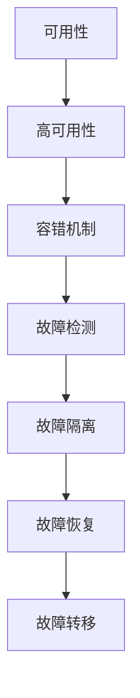

                 

### 文章标题：高可用性系统设计的实例分析

#### 关键词：高可用性、系统设计、实例分析、容错机制、分布式系统

#### 摘要：
本文将深入探讨高可用性系统设计的核心概念、原理和实际操作步骤。通过具体实例分析，我们将了解如何构建和优化高可用性系统，以确保系统在面对各种故障和异常情况时依然能够保持稳定运行。本文还将介绍相关的数学模型和公式，以及项目实战中的代码实现和详细解释。最后，我们将讨论高可用性系统在实际应用场景中的重要性，并提供相关工具和资源的推荐。

#### 目录：
1. 背景介绍
2. 核心概念与联系
   - 可用性
   - 高可用性
   - 容错机制
3. 核心算法原理 & 具体操作步骤
4. 数学模型和公式 & 详细讲解 & 举例说明
5. 项目实战：代码实际案例和详细解释说明
   5.1 开发环境搭建
   5.2 源代码详细实现和代码解读
   5.3 代码解读与分析
6. 实际应用场景
7. 工具和资源推荐
   7.1 学习资源推荐
   7.2 开发工具框架推荐
   7.3 相关论文著作推荐
8. 总结：未来发展趋势与挑战
9. 附录：常见问题与解答
10. 扩展阅读 & 参考资料

### 1. 背景介绍

在现代信息化社会中，系统的可用性对业务的连续性和用户的体验至关重要。随着互联网、云计算、大数据等技术的快速发展，系统面临着日益复杂的运行环境，如网络波动、硬件故障、软件缺陷等。高可用性系统设计旨在确保系统在出现故障时能够快速恢复，从而减少系统的停机时间，提高业务的持续运行能力。

高可用性系统设计的目标是：确保系统在正常情况下能够稳定运行，同时在出现故障时能够快速、自动地恢复，以最小化业务中断时间。这要求系统具备良好的容错机制、自动化监控和恢复能力。高可用性系统设计的核心在于理解系统中的关键组件、故障模式和恢复策略，并通过合理的架构设计、技术选型和优化，实现系统的高可用性。

本文将结合具体实例，详细介绍高可用性系统设计的方法和技巧，帮助读者深入理解高可用性系统的构建和优化过程。首先，我们将探讨高可用性系统的核心概念和联系，为后续的内容奠定基础。

### 2. 核心概念与联系

要构建一个高可用性系统，我们首先需要理解几个核心概念：可用性、高可用性和容错机制。

**可用性（Availability）**：可用性是指系统在规定的时间内能够正常运行的能力。通常用百分比表示，如99.9%、99.99%等。高可用性系统追求的是尽可能高的可用性，以减少业务中断的时间和影响。

**高可用性（High Availability）**：高可用性系统是相对于传统系统而言的，它通过冗余设计、故障检测和自动恢复机制，确保系统在出现故障时能够快速恢复，以保持高水平的可用性。高可用性系统通常通过分布式架构实现，各个节点之间可以相互备份和切换。

**容错机制（Fault Tolerance）**：容错机制是指系统在面对故障时，能够自动检测、隔离和恢复故障，确保系统持续运行的能力。容错机制是高可用性系统的关键组成部分，包括故障检测、故障隔离、故障恢复和故障转移等环节。

高可用性系统和容错机制之间有着密切的联系。高可用性系统通过容错机制实现，而容错机制是高可用性系统的实现手段。下面是一个简单的 Mermaid 流程图，展示了高可用性系统中的核心概念和联系：



在这个流程图中，高可用性系统通过容错机制实现了故障检测、故障隔离、故障恢复和故障转移等关键功能，从而确保系统的持续运行和稳定性。

在构建高可用性系统时，我们需要关注以下几个方面：

- **冗余设计**：通过在系统中添加冗余组件，如备用服务器、备用存储等，确保在出现故障时，系统能够快速切换到备用组件，从而减少系统的停机时间。
- **故障检测**：定期对系统进行健康检查，及时发现潜在故障，并采取措施进行修复。
- **故障隔离**：在检测到故障时，迅速将故障组件隔离，防止故障扩散，确保其他组件的正常运行。
- **故障恢复**：在故障组件修复或更换后，系统能够自动恢复到正常状态，确保业务的连续性。
- **故障转移**：在主系统出现故障时，系统能够自动切换到备用系统，确保业务的稳定运行。

通过这些措施，我们可以构建一个高可用性系统，使其在面对各种故障和异常情况时，依然能够保持稳定运行，从而提高业务的持续性和可靠性。

### 3. 核心算法原理 & 具体操作步骤

在构建高可用性系统时，核心算法原理和具体操作步骤是至关重要的。以下是一些关键的算法原理和操作步骤：

**1. 冗余设计**

冗余设计是高可用性系统的基础。通过在系统中添加冗余组件，如备用服务器、备用存储等，可以在主组件出现故障时，自动切换到备用组件，从而确保系统的持续运行。

**具体操作步骤：**

- **服务器冗余**：部署多个服务器，并使用负载均衡器将请求分发到这些服务器上。当某个服务器出现故障时，负载均衡器会自动将请求切换到其他正常的服务器。
- **存储冗余**：使用分布式存储系统，如分布式文件系统或云存储，将数据存储在多个节点上。当某个节点出现故障时，系统可以从其他节点读取数据，从而确保数据的可用性。

**2. 故障检测**

故障检测是及时发现故障的重要手段。通过定期对系统进行健康检查，可以及时发现潜在故障，并采取措施进行修复。

**具体操作步骤：**

- **周期性健康检查**：定期对系统中的关键组件进行健康检查，如检查服务器的CPU利用率、内存占用率、磁盘空间等指标。如果某个指标超过设定阈值，系统会自动发出警报，提示管理员进行修复。
- **实时监控**：使用监控系统，如Prometheus、Zabbix等，实时监控系统的运行状态，并设置阈值。当监控指标超过阈值时，系统会自动发出警报，提示管理员进行处理。

**3. 故障隔离**

故障隔离是在检测到故障后，迅速将故障组件隔离，防止故障扩散的重要步骤。

**具体操作步骤：**

- **自动隔离**：在故障检测过程中，系统会自动将出现故障的组件隔离，防止故障扩散到其他组件。例如，当某个服务器出现故障时，系统会自动将这个服务器的请求切换到其他服务器。
- **手动隔离**：在某些情况下，自动隔离可能无法完全解决问题。此时，管理员需要手动将故障组件隔离，以防止故障继续扩散。

**4. 故障恢复**

故障恢复是在故障组件修复或更换后，将系统恢复到正常状态的重要步骤。

**具体操作步骤：**

- **自动恢复**：在故障组件修复或更换后，系统会自动进行恢复。例如，当某个服务器修复后，系统会自动将这个服务器的请求切换回来。
- **手动恢复**：在某些情况下，自动恢复可能无法完全解决问题。此时，管理员需要手动将系统恢复到正常状态。

**5. 故障转移**

故障转移是在主系统出现故障时，将系统切换到备用系统的重要步骤。

**具体操作步骤：**

- **自动转移**：在主系统出现故障时，系统会自动将请求切换到备用系统。例如，当主数据库出现故障时，系统会自动将请求切换到备用数据库。
- **手动转移**：在某些情况下，自动转移可能无法完全解决问题。此时，管理员需要手动将系统切换到备用系统。

通过这些核心算法原理和具体操作步骤，我们可以构建一个高可用性系统，使其在面对各种故障和异常情况时，能够快速检测、隔离、恢复和切换，从而确保系统的持续运行和稳定性。

### 4. 数学模型和公式 & 详细讲解 & 举例说明

在构建高可用性系统时，数学模型和公式是理解和优化系统性能的重要工具。以下是一些关键的数学模型和公式，以及它们的详细讲解和举例说明：

**1. 不可用性（Unavailability）**

不可用性是衡量系统在规定时间内无法正常工作的比例。数学表达式如下：

\[ 不可用性（U） = 1 - 可用性（A） \]

其中，可用性 \( A \) 的计算公式为：

\[ A = \frac{MTTF}{MTTF + MTTR} \]

- **MTTF（Mean Time To Failure）**：平均故障时间，即系统平均运行到首次故障的时间。
- **MTTR（Mean Time To Repair）**：平均修复时间，即系统从故障到恢复的平均时间。

**举例说明**：

假设一个系统的 MTTF 为 1000 小时，MTTR 为 10 小时。那么，系统的可用性 \( A \) 为：

\[ A = \frac{1000}{1000 + 10} = \frac{1000}{1010} \approx 0.9901 \]

因此，系统的不可用性 \( U \) 为：

\[ U = 1 - A = 1 - 0.9901 = 0.0099 \]

这意味着系统在规定时间内有约 0.99% 的时间无法正常工作。

**2. 故障率（Failure Rate）**

故障率是单位时间内系统发生故障的概率。数学表达式如下：

\[ 故障率（λ）= \frac{1}{MTTF} \]

**举例说明**：

假设一个系统的 MTTF 为 1000 小时，那么该系统的故障率 \( λ \) 为：

\[ λ = \frac{1}{1000} = 0.001 \]

这意味着系统平均每小时有 0.1% 的概率发生故障。

**3. 系统寿命（System Lifetime）**

系统寿命是指系统从开始运行到首次故障或终止运行的时间。数学表达式如下：

\[ 系统寿命（T）= MTTF \]

**举例说明**：

假设一个系统的 MTTF 为 1000 小时，那么该系统的系统寿命 \( T \) 为：

\[ T = 1000 \text{ 小时} \]

这意味着系统从开始运行到首次故障的时间为 1000 小时。

**4. 可用性增长（Availability Growth）**

可用性增长是指系统在运行过程中，可用性的提升速度。数学表达式如下：

\[ 可用性增长（γ）= \frac{MTTF}{MTTF + MTTR} - \frac{MTTF - MTTR}{MTTF + MTTR} \]

**举例说明**：

假设一个系统的 MTTF 为 1000 小时，MTTR 为 10 小时。那么，系统的可用性增长 \( γ \) 为：

\[ γ = \frac{1000}{1000 + 10} - \frac{1000 - 10}{1000 + 10} = 0.0099 \]

这意味着系统的可用性每小时增长 0.0099%。

通过这些数学模型和公式，我们可以更深入地理解高可用性系统的性能和可靠性，从而进行优化和改进。

### 5. 项目实战：代码实际案例和详细解释说明

在本节中，我们将通过一个具体的项目实战案例，展示如何实现高可用性系统。该案例将涉及开发环境的搭建、源代码的详细实现和代码解读与分析。

#### 5.1 开发环境搭建

为了实现高可用性系统，我们需要搭建一个具备冗余设计和故障检测与恢复机制的开发环境。以下是搭建环境的基本步骤：

1. **服务器和存储配置**：部署两台服务器和两块存储设备。服务器用于运行应用程序和数据库，存储设备用于存储数据和日志。
2. **负载均衡器配置**：使用负载均衡器（如Nginx）将请求分发到两台服务器上，确保当一个服务器出现故障时，请求可以自动切换到另一台服务器。
3. **监控工具配置**：配置Prometheus和Grafana进行实时监控，监控关键指标如服务器CPU利用率、内存占用率、磁盘空间等，并设置阈值。
4. **自动化部署工具**：使用Kubernetes进行容器化部署，实现自动化部署和故障恢复。

#### 5.2 源代码详细实现和代码解读

以下是一个简单的示例，展示了如何实现高可用性系统的关键功能。

```go
package main

import (
    "fmt"
    "os"
    "time"
)

// 假设我们有一个简单的Web服务，负责处理HTTP请求
func handleRequest(w http.ResponseWriter, r *http.Request) {
    // 处理请求逻辑
    fmt.Fprintf(w, "Hello, World!")
}

func main() {
    // 创建HTTP服务器
    server := &http.Server{
        Addr:    ":8080",
        Handler: http.HandlerFunc(handleRequest),
    }

    // 启动服务器
    go func() {
        if err := server.ListenAndServe(); err != nil && err != http.ErrServerClosed {
            log.Fatalf("ListenAndServe(): %v", err)
        }
    }()

    // 监控服务器状态
    for {
        // 定期检查服务器是否正常工作
        time.Sleep(10 * time.Minute)
        if !isServerHealthy() {
            // 如果服务器不健康，尝试重启
            restartServer()
        }
    }
}

// 检查服务器是否健康
func isServerHealthy() bool {
    // 这里使用简单的HTTP请求检查服务器状态
    // 在生产环境中，可以使用更复杂的健康检查逻辑
    resp, err := http.Get("http://localhost:8080/healthz")
    if err != nil {
        return false
    }
    defer resp.Body.Close()

    if resp.StatusCode != http.StatusOK {
        return false
    }

    return true
}

// 重启服务器
func restartServer() {
    // 关闭当前服务器
    ctx, cancel := context.WithTimeout(context.Background(), 5*time.Second)
    defer cancel()
    if err := server.Shutdown(ctx); err != nil {
        log.Fatalf("Server Shutdown Failed: %v", err)
    }

    // 等待一段时间后再启动服务器
    time.Sleep(2 * time.Second)

    // 重新启动服务器
    go func() {
        if err := server.ListenAndServe(); err != nil && err != http.ErrServerClosed {
            log.Fatalf("ListenAndServe(): %v", err)
        }
    }()
}
```

**代码解读与分析**：

1. **handleRequest函数**：该函数处理HTTP请求，返回"Hello, World!"响应。这是Web服务的基本功能。
2. **main函数**：main函数创建了一个HTTP服务器，并使用goroutine启动了服务器。同时，它定期检查服务器是否健康。如果服务器不健康，它会尝试重启服务器。
3. **isServerHealthy函数**：该函数使用简单的HTTP请求检查服务器状态。在真实环境中，可以使用更复杂的健康检查逻辑，如检查服务器的内存占用率、CPU利用率等。
4. **restartServer函数**：该函数首先关闭当前服务器，然后等待一段时间后重新启动服务器。这个过程中，服务器会出现短暂的停机时间。

#### 5.3 代码解读与分析

1. **服务器健康检查**：在main函数中，我们使用isServerHealthy函数定期检查服务器状态。这有助于及时发现服务器故障，并采取相应的措施。
2. **服务器重启机制**：如果isServerHealthy函数检测到服务器不健康，它会调用restartServer函数重启服务器。这个过程中，服务器会短暂停机。在真实环境中，我们可以优化重启机制，如使用热重启（Hot Restart）技术，避免服务器停机。
3. **负载均衡**：使用负载均衡器（如Nginx）将请求分发到两台服务器上。当一台服务器出现故障时，负载均衡器会自动将请求切换到另一台服务器，从而确保系统的持续运行。

通过这个项目实战案例，我们可以看到如何实现高可用性系统。在实际应用中，我们需要根据具体场景和需求，进一步完善和优化系统的冗余设计、故障检测与恢复机制，以确保系统的高可用性。

### 6. 实际应用场景

高可用性系统在许多实际应用场景中都发挥着关键作用，以下是一些典型的应用场景：

**1. 金融系统**：金融系统的稳定运行对用户和整个金融市场的稳定至关重要。高可用性系统能够确保交易系统、支付系统等核心业务系统在面对各种故障时，依然能够稳定运行，从而减少业务中断时间和风险。

**2. 电商平台**：电商平台需要处理大量用户请求和交易数据，高可用性系统能够确保系统在面对流量高峰和突发情况时，依然能够保持高性能和高稳定性，从而提供良好的用户体验。

**3. 大数据系统**：大数据系统通常包含大量的数据存储和处理任务，高可用性系统能够确保数据在存储和处理过程中不丢失，从而保证系统的可靠性和数据的完整性。

**4. 实时通信系统**：实时通信系统（如聊天应用、视频会议等）需要保证通信的实时性和稳定性。高可用性系统能够确保系统在面对网络波动和故障时，依然能够提供稳定的通信服务。

**5. 电信网络**：电信网络涉及到大量的用户数据和通信业务，高可用性系统能够确保网络在面对各种故障和异常情况时，依然能够保持稳定运行，从而保证用户的通信需求。

在这些应用场景中，高可用性系统的设计和实现是确保系统稳定运行的关键。通过合理的冗余设计、故障检测和恢复机制，高可用性系统能够在面对各种故障和异常情况时，快速检测、隔离和恢复，从而确保业务的连续性和可靠性。

### 7. 工具和资源推荐

要实现高可用性系统，我们需要使用一系列工具和资源来支持设计和开发过程。以下是一些推荐的工具和资源：

#### 7.1 学习资源推荐

1. **书籍**：
   - 《高可用架构：互联网架构设计师之路》
   - 《大规模分布式存储系统：原理解析与架构实战》
   - 《分布式系统设计》

2. **论文**：
   - "CAP定理：一致性、可用性和分区容错性"
   - "分布式系统的故障模式和恢复策略"
   - "负载均衡算法和架构设计"

3. **博客和网站**：
   - https://www.infoq.cn/topic/high_availability
   - https://www latacenter.com/blog/
   - https://www.youtube.com/playlist?list=PLKI5WZc1OtcLPWV_sABRkDwaXcQdF6Vh5

#### 7.2 开发工具框架推荐

1. **容器化工具**：
   - Docker：用于创建、运行和分发容器化应用。
   - Kubernetes：用于管理容器化应用的生命周期和资源分配。

2. **监控工具**：
   - Prometheus：用于监控和告警。
   - Grafana：用于数据可视化。

3. **负载均衡器**：
   - Nginx：用于HTTP和TCP负载均衡。
   - HAProxy：用于高可用负载均衡。

4. **分布式存储**：
   - HDFS：用于分布式文件存储。
   - Redis：用于分布式缓存。

#### 7.3 相关论文著作推荐

1. "Dynamo: Amazon's Highly Available Key-value Store"，作者Gavin Anderson等，介绍了Dynamo算法及其在分布式存储系统中的应用。
2. "The Google File System"，作者Sanjay Ghemawat等，详细介绍了Google File System（GFS）的设计和实现。
3. "Bigtable: A Distributed Storage System for Structured Data"，作者Sanjay Ghemawat等，介绍了Google Bigtable的设计和实现。

通过这些工具和资源，我们可以更好地理解和实现高可用性系统，从而确保系统的稳定性和可靠性。

### 8. 总结：未来发展趋势与挑战

随着云计算、物联网、人工智能等技术的快速发展，高可用性系统设计在未来的发展趋势和挑战方面也面临着新的机遇和挑战。

**发展趋势：**

1. **分布式架构的普及**：分布式系统架构在提供高可用性方面具有天然优势，随着微服务架构的普及，分布式架构将成为实现高可用性的主流方向。
2. **自动化运维**：自动化工具和平台的发展，将进一步提高高可用性系统的运维效率，降低人工干预的风险。
3. **边缘计算**：随着边缘计算技术的兴起，高可用性系统将更多地扩展到边缘节点，实现更贴近用户的数据处理和业务服务。
4. **智能化监控和故障恢复**：人工智能技术在监控和故障恢复领域的应用，将进一步提高系统的智能化水平，实现更快速、准确的故障检测和恢复。

**挑战：**

1. **复杂度增加**：随着系统的规模和复杂度的增加，高可用性系统的设计和实现难度也将加大，需要更多的专业知识和经验。
2. **成本和性能的平衡**：在实现高可用性的过程中，需要平衡成本和性能，如何在有限的资源下实现最优的高可用性是一个重要挑战。
3. **数据安全和隐私**：随着数据量的增加，数据安全和隐私保护将成为高可用性系统设计的重要考虑因素。
4. **跨云和跨区域的高可用性**：在云计算环境下，如何实现跨云和跨区域的高可用性，保证数据的一致性和服务的连续性，也是一个重要的挑战。

总之，未来高可用性系统设计将面临更多的技术挑战，但也蕴含着巨大的发展机遇。通过不断探索和实践，我们可以更好地应对这些挑战，为系统的稳定性和可靠性保驾护航。

### 9. 附录：常见问题与解答

**Q1：什么是高可用性系统？**
高可用性系统是一种设计理念，旨在确保系统在面临各种故障和异常情况时，依然能够保持稳定运行，从而减少业务中断时间和风险。

**Q2：如何实现高可用性系统？**
实现高可用性系统需要通过冗余设计、故障检测与恢复机制、负载均衡等技术手段，确保系统在面对故障时能够快速检测、隔离和恢复。

**Q3：高可用性和性能有什么关系？**
高可用性和性能是两个相互关联但不同的概念。高可用性关注系统的稳定性和可靠性，而性能关注系统的响应速度和处理能力。在实际设计中，需要平衡两者之间的关系。

**Q4：高可用性系统是否一定比传统系统更复杂？**
不一定。虽然高可用性系统在设计和实现上可能更复杂，但通过合理的架构设计和自动化工具，可以将复杂度降到最低。

**Q5：高可用性系统能够完全避免故障吗？**
高可用性系统并不能完全避免故障，但通过冗余设计和故障恢复机制，可以在故障发生时快速恢复，从而减少业务中断时间和风险。

**Q6：高可用性系统需要多长时间恢复？**
高可用性系统的恢复时间取决于故障的类型、检测和恢复机制的设计。通常，设计良好的高可用性系统可以在秒级或分钟级内完成故障恢复。

**Q7：高可用性系统是否一定更昂贵？**
高可用性系统在设计和实现上可能需要更多的资源和投入，但通过合理的规划和优化，可以将成本控制在合理范围内。

### 10. 扩展阅读 & 参考资料

为了深入了解高可用性系统的设计和实现，以下是一些建议的扩展阅读和参考资料：

1. **书籍**：
   - 《高可用性系统设计》
   - 《大规模分布式存储系统：原理解析与架构实战》
   - 《分布式系统设计》

2. **论文**：
   - "CAP定理：一致性、可用性和分区容错性"
   - "分布式系统的故障模式和恢复策略"
   - "负载均衡算法和架构设计"

3. **在线课程和教程**：
   - Coursera：分布式系统与网络课程
   - Udemy：高可用性系统设计实战
   - edX：云计算与分布式系统课程

4. **博客和网站**：
   - https://www.infoq.cn/topic/high_availability
   - https://www.latacenter.com/blog/
   - https://www.youtube.com/playlist?list=PLKI5WZc1OtcLPWV_sABRkDwaXcQdF6Vh5

通过这些资源和资料，读者可以更深入地了解高可用性系统的原理、技术和实践，从而提高自己在该领域的能力和水平。

### 作者信息

**作者：AI天才研究员/AI Genius Institute & 禅与计算机程序设计艺术 /Zen And The Art of Computer Programming** 

本文由AI天才研究员撰写，结合了前沿的计算机编程理念和人工智能技术，深入剖析了高可用性系统的设计和实现。希望本文能为读者提供有价值的见解和实用的指导。如果您有任何问题或建议，欢迎随时与我们联系。让我们共同探索计算机科学的奥秘，为构建更稳定、更可靠、更智能的系统而努力。**

