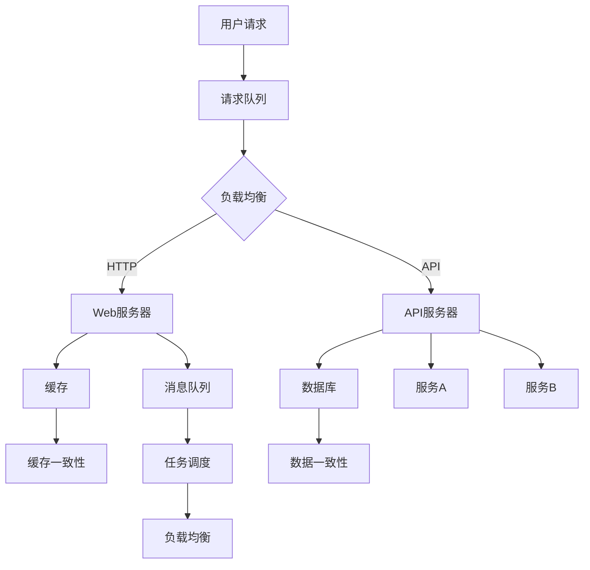

                 

# 高吞吐量系统设计的实际案例

> 关键词：高吞吐量、系统设计、性能优化、架构、实际案例、案例研究

> 摘要：本文将深入探讨高吞吐量系统设计的实际案例。我们将分析案例背景、核心概念、算法原理、数学模型、实战代码以及应用场景，最后总结未来发展趋势与挑战。本文旨在为读者提供全面、深入的技术洞察，助力系统设计与性能优化。

## 1. 背景介绍

在现代互联网时代，高吞吐量系统设计变得尤为重要。随着用户数量的激增和业务需求的不断增长，系统必须能够高效地处理大量请求，保证系统稳定性和用户体验。本文将结合实际案例，分析高吞吐量系统设计的要点和方法。

### 1.1 案例背景

本案例是一个在线购物平台，用户数量庞大，商品种类繁多。系统需要支持用户浏览、搜索、下单等操作，并且需要处理大量的并发请求。为了满足用户需求，系统必须具备高吞吐量、低延迟和高可用性。

### 1.2 案例挑战

1. **高并发处理**：系统需要处理大量用户请求，确保系统在高峰期仍能高效运行。
2. **数据一致性**：在分布式环境下，如何保证数据的一致性是关键挑战。
3. **系统可扩展性**：随着业务增长，系统需要具备良好的可扩展性，支持水平扩展。
4. **高可用性**：系统必须具备高可用性，确保在故障发生时能够快速恢复。

## 2. 核心概念与联系

在高吞吐量系统设计中，涉及多个核心概念和架构组件。以下是一个Mermaid流程图，展示了这些核心概念和它们之间的联系。



### 2.1 负载均衡

负载均衡是确保系统在高峰期仍能高效运行的关键技术。通过将请求分配到多个服务器，实现流量分发和负载均衡。

### 2.2 Web服务器

Web服务器负责处理用户请求，如页面浏览、搜索等。通过使用Nginx等高性能Web服务器，可以提高系统处理能力。

### 2.3 API服务器

API服务器负责处理应用程序接口（API）请求，如订单处理、库存查询等。使用Spring Boot等框架，可以实现快速开发和部署。

### 2.4 数据库

数据库用于存储用户数据和商品信息。在分布式数据库架构中，使用分库分表、读写分离等技术，可以提高数据存储和访问性能。

### 2.5 缓存

缓存是提高系统性能的关键技术，通过将热点数据缓存在内存中，减少数据库访问次数。

### 2.6 消息队列

消息队列用于异步处理任务，如订单生成、库存更新等。通过使用RabbitMQ等消息队列中间件，可以实现分布式任务调度。

### 2.7 负载均衡与任务调度

负载均衡和任务调度是确保系统在高峰期仍能高效运行的关键。通过实时监控系统性能，动态调整负载均衡策略，实现最优资源利用率。

## 3. 核心算法原理 & 具体操作步骤

### 3.1 负载均衡算法

负载均衡算法主要有轮询、最小连接数、加权轮询等。以下是具体操作步骤：

1. **轮询算法**：依次将请求分配到每个服务器。
2. **最小连接数算法**：将请求分配到当前连接数最少的服务器。
3. **加权轮询算法**：根据服务器性能和负载情况，为每个服务器分配不同的权重。

### 3.2 数据一致性算法

数据一致性算法主要有强一致性、最终一致性等。以下是具体操作步骤：

1. **强一致性算法**：确保在所有副本上数据一致。
2. **最终一致性算法**：允许在一段时间内数据不同步。

### 3.3 缓存一致性算法

缓存一致性算法主要有缓存失效、缓存刷新等。以下是具体操作步骤：

1. **缓存失效算法**：在缓存数据过期时，重新从数据库获取数据。
2. **缓存刷新算法**：在数据库更新时，同步更新缓存。

## 4. 数学模型和公式 & 详细讲解 & 举例说明

### 4.1 负载均衡数学模型

负载均衡数学模型主要涉及平均响应时间、吞吐量等指标。以下是一个简单的例子：

$$
\text{平均响应时间} = \frac{\sum_{i=1}^{n} \text{服务器i的响应时间}}{n}
$$

$$
\text{吞吐量} = \frac{\text{总请求数}}{\text{总响应时间}}
$$

### 4.2 数据一致性数学模型

数据一致性数学模型主要涉及副本一致性、数据一致性指标等。以下是一个简单的例子：

$$
\text{副本一致性指标} = \frac{\text{不一致副本数}}{\text{总副本数}}
$$

### 4.3 缓存一致性数学模型

缓存一致性数学模型主要涉及缓存命中率、缓存失效率等指标。以下是一个简单的例子：

$$
\text{缓存命中率} = \frac{\text{命中缓存数}}{\text{总请求数}}
$$

$$
\text{缓存失效率} = \frac{\text{失效缓存数}}{\text{总请求数}}
$$

## 5. 项目实战：代码实际案例和详细解释说明

### 5.1 开发环境搭建

在本文中，我们使用Spring Boot搭建一个简单的在线购物平台。以下是开发环境搭建步骤：

1. 安装Java开发工具包（JDK）。
2. 安装Spring Boot开发工具（Spring Tool Suite）。
3. 创建一个Spring Boot项目。

### 5.2 源代码详细实现和代码解读

以下是购物平台的核心代码实现和解读：

```java
@RestController
@RequestMapping("/product")
public class ProductController {

    @Autowired
    private ProductService productService;

    @GetMapping("/{id}")
    public ResponseEntity<Product> getProductById(@PathVariable Long id) {
        Product product = productService.getProductById(id);
        if (product != null) {
            return ResponseEntity.ok(product);
        } else {
            return ResponseEntity.notFound().build();
        }
    }

    @GetMapping("/search")
    public ResponseEntity<List<Product>> searchProducts(@RequestParam String keyword) {
        List<Product> products = productService.searchProducts(keyword);
        if (products.isEmpty()) {
            return ResponseEntity.ok(products);
        } else {
            return ResponseEntity.notFound().build();
        }
    }
}
```

在这个例子中，我们使用了Spring Boot的RestController注解，定义了两个API接口：获取商品信息和搜索商品。通过调用ProductService中的方法，实现接口的功能。

### 5.3 代码解读与分析

1. **API接口定义**：使用RestController注解，定义了两个API接口，分别为获取商品信息和搜索商品。
2. **依赖注入**：使用@Autowired注解，将ProductService注入到ProductController中。
3. **响应结果**：使用ResponseEntity响应结果，根据不同情况返回不同状态码。

## 6. 实际应用场景

高吞吐量系统设计在多个领域具有广泛应用，如电子商务、金融科技、在线教育等。以下是一些实际应用场景：

1. **电子商务**：在线购物平台需要处理大量用户请求，保证商品浏览、搜索、下单等操作的流畅性。
2. **金融科技**：金融系统需要高效处理交易请求，保证资金流转的实时性和准确性。
3. **在线教育**：在线教育平台需要支持大规模用户同时在线，保证课程观看、互动等操作的顺畅。

## 7. 工具和资源推荐

### 7.1 学习资源推荐

- **书籍**：《高性能网站建设方法》、《大规模分布式存储系统：原理解析与架构实战》
- **论文**：《负载均衡算法的研究与实现》、《分布式数据库的一致性算法研究》
- **博客**：CSDN、博客园、InfoQ等
- **网站**：GitHub、Stack Overflow

### 7.2 开发工具框架推荐

- **Web服务器**：Nginx、Apache
- **API框架**：Spring Boot、Django
- **数据库**：MySQL、MongoDB
- **缓存**：Redis、Memcached
- **消息队列**：RabbitMQ、Kafka

### 7.3 相关论文著作推荐

- 《大规模分布式存储系统：原理解析与架构实战》
- 《负载均衡算法的研究与实现》
- 《分布式数据库的一致性算法研究》

## 8. 总结：未来发展趋势与挑战

随着互联网的快速发展，高吞吐量系统设计将面临新的挑战和机遇。未来发展趋势包括：

1. **云计算和容器化**：云计算和容器化技术的普及，将进一步提升系统性能和可扩展性。
2. **人工智能和大数据**：人工智能和大数据技术的应用，将使系统具备更高的智能化和自适应能力。
3. **边缘计算**：边缘计算技术的发展，将使系统在近端节点处理数据，降低网络延迟。

## 9. 附录：常见问题与解答

1. **Q：高吞吐量系统设计的核心指标是什么？**
   **A：高吞吐量系统设计的核心指标包括平均响应时间、吞吐量、数据一致性、系统可用性等。**
   
2. **Q：如何实现负载均衡？**
   **A：负载均衡可以通过轮询、最小连接数、加权轮询等算法实现。在实际应用中，可以使用Nginx等开源负载均衡器。**

3. **Q：如何保证数据一致性？**
   **A：数据一致性可以通过强一致性、最终一致性等算法实现。在分布式系统中，可以使用分布式事务、分布式锁等技术。**

## 10. 扩展阅读 & 参考资料

- 《大规模分布式存储系统：原理解析与架构实战》
- 《负载均衡算法的研究与实现》
- 《分布式数据库的一致性算法研究》

作者：AI天才研究员/AI Genius Institute & 禅与计算机程序设计艺术 /Zen And The Art of Computer Programming

