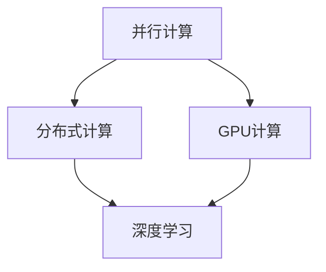

                 

### 背景介绍

高性能计算（High-Performance Computing，HPC）作为信息技术领域的一颗璀璨明珠，已经在科学研究、工业设计、金融分析、气候模拟、生物信息学等多个领域中展现出其巨大的潜力和价值。然而，随着人工智能（AI）技术的迅猛发展，特别是在深度学习和机器学习领域的突破，高性能计算的重要性被推向了一个新的高度。

人工智能，作为21世纪的颠覆性技术，正在逐步改变我们的生活方式和工作方式。从自动驾驶汽车、智能助手，到复杂的医疗诊断系统，AI的广泛应用不仅提升了效率，也带来了前所未有的挑战。而这一切，都离不开强大的算力支持。高性能计算作为AI 2.0时代算力基础设施的核心，承载着推动AI技术不断突破的重任。

AI 2.0，作为人工智能发展的新阶段，其核心特征在于更加智能化和自适应。相较于传统的AI，AI 2.0不仅要求具备更强的学习能力和推理能力，还需要能够处理海量数据、快速迭代优化算法，以应对日益复杂的任务场景。这就需要高性能计算提供强大的计算能力和存储资源，确保AI算法能够高效运行。

本文将深入探讨高性能计算在AI 2.0时代的重要作用，分析其核心概念与联系，解析核心算法原理和具体操作步骤，介绍数学模型和公式，并通过实际项目案例展示其应用场景。同时，本文还将推荐相关工具和资源，为读者提供全面的学习和实践指导。

高性能计算与AI 2.0的深度融合，不仅推动了科技的发展，也带来了诸多挑战。未来，随着AI技术的不断进步，高性能计算将承担更加重要的角色。让我们一步一步地探索这一领域的奥秘，共同见证AI 2.0时代的到来。

### 核心概念与联系

在深入探讨高性能计算与AI 2.0的关系之前，我们首先需要了解一些关键概念，包括并行计算、分布式计算、GPU计算以及深度学习等。

#### 并行计算

并行计算是一种通过同时执行多个任务来提高计算效率的方法。在传统计算机系统中，处理器一次只能处理一个任务。而并行计算则通过将任务分解成多个部分，同时由多个处理器或计算节点分别执行这些部分，从而显著提高计算速度。并行计算的核心在于如何高效地分配任务和协调处理结果，以最大化整体计算性能。


#### 分布式计算

分布式计算是一种通过网络将多个计算节点连接起来，共同完成大规模计算任务的方法。这些节点可以是多台计算机、服务器或者专门设计的计算设备。分布式计算通过将任务分散到多个节点上，减少了单个节点的负担，同时利用了网络中的计算资源，从而实现高性能计算。


#### GPU计算

GPU（图形处理单元）计算是一种利用图形处理芯片进行大规模并行计算的方法。相比于传统的CPU（中央处理器），GPU拥有更多的计算单元和更高的并行处理能力。这使得GPU在处理复杂的数据运算和大规模并行任务时具有显著优势。深度学习和机器学习算法中的许多操作，如矩阵运算和卷积操作，非常适合GPU计算。


#### 深度学习

深度学习是一种基于多层神经网络的学习方法，通过模拟人脑的神经网络结构，实现对数据的特征提取和模式识别。深度学习在图像识别、语音识别、自然语言处理等领域取得了突破性的进展。深度学习算法通常需要大量的计算资源和时间来训练模型，因此高性能计算在深度学习应用中至关重要。


#### 关联关系

高性能计算与AI 2.0的关系可以从多个方面进行阐述：

1. **并行计算与分布式计算：** 并行计算和分布式计算提供了高性能计算的基本架构，使得大规模的AI算法能够高效执行。通过并行计算，AI模型可以在多个节点上同时进行计算，从而缩短训练时间；通过分布式计算，大规模数据可以分散存储和处理，提高了系统的可扩展性和容错性。

2. **GPU计算：** GPU计算提供了强大的并行计算能力，特别是对于深度学习算法，GPU可以显著提高训练和推理的速度。这使得GPU成为深度学习和机器学习任务中的首选计算设备。

3. **深度学习：** 深度学习是AI 2.0的核心技术之一，其训练和推理过程对计算资源的需求极为庞大。高性能计算提供了所需的计算能力和存储资源，确保深度学习算法能够高效运行。

为了更好地理解这些概念之间的联系，我们可以使用Mermaid流程图（不含特殊字符）来展示它们之间的交互关系：



通过这个简单的流程图，我们可以看到并行计算、分布式计算和GPU计算共同构成了高性能计算的核心，而深度学习则利用这些计算资源来实现AI 2.0的目标。

综上所述，高性能计算与AI 2.0的深度融合，不仅提升了计算效率，还为AI技术的发展提供了坚实的基础。接下来，我们将深入探讨高性能计算在AI 2.0中的具体应用和实践。

### 核心算法原理 & 具体操作步骤

在深入理解了高性能计算的基本概念和核心算法之后，接下来我们将详细探讨高性能计算在AI 2.0中的核心算法原理，并介绍具体的操作步骤。

#### 1. 卷积神经网络（Convolutional Neural Network, CNN）

卷积神经网络是深度学习中的一种重要模型，广泛应用于图像识别、物体检测和图像生成等领域。CNN通过卷积层、池化层和全连接层的组合，实现对图像的特征提取和分类。

**操作步骤：**

1. **输入层：** CNN的输入是一个二维的图像矩阵，每个像素值代表图像的一个特征。

   ```mermaid
   graph TD
   A[输入层] --> B{卷积层}
   ```

2. **卷积层：** 通过卷积操作提取图像的局部特征。卷积核在图像上滑动，计算局部特征图的乘积和求和，得到新的特征图。

   ```mermaid
   graph TD
   B --> C{激活函数}
   B --> D{卷积层}
   ```

3. **激活函数：** 为了引入非线性特性，通常在卷积层之后添加激活函数，如ReLU（Rectified Linear Unit）。

   ```mermaid
   graph TD
   C --> D
   ```

4. **池化层：** 通过池化操作（如最大池化或平均池化）降低特征图的维度，减少参数数量，提高计算效率。

   ```mermaid
   graph TD
   D --> E{池化层}
   ```

5. **全连接层：** 将池化后的特征图展平成一维向量，并通过全连接层进行分类预测。

   ```mermaid
   graph TD
   E --> F{全连接层}
   ```

6. **输出层：** 输出层通常是一个softmax层，用于计算每个类别的概率分布。

   ```mermaid
   graph TD
   F --> G{输出层}
   ```

#### 2. 反向传播算法（Backpropagation）

反向传播算法是一种用于训练深度学习模型的重要算法。它通过计算损失函数对模型参数的梯度，不断调整参数，以最小化损失函数。

**操作步骤：**

1. **前向传播：** 计算输入层的激活值，并传递到下一层。

   ```mermaid
   graph TD
   A[输入层] --> B{激活函数}
   ```

2. **计算损失：** 计算模型输出与实际输出之间的差异，得到损失值。

   ```mermaid
   graph TD
   B --> C{损失函数}
   ```

3. **后向传播：** 计算损失函数对模型参数的梯度，并反向传播到前一层。

   ```mermaid
   graph TD
   C --> D{梯度计算}
   D --> B
   D --> A
   ```

4. **更新参数：** 根据梯度计算结果更新模型参数，以最小化损失函数。

   ```mermaid
   graph TD
   D --> E{参数更新}
   ```

#### 3. 梯度下降优化算法（Gradient Descent）

梯度下降是一种优化算法，用于训练深度学习模型。通过迭代计算损失函数对模型参数的梯度，并更新参数，以逐步减小损失函数。

**操作步骤：**

1. **初始化参数：** 初始化模型参数，通常为随机值。

   ```mermaid
   graph TD
   A{初始化参数}
   ```

2. **计算梯度：** 计算损失函数对模型参数的梯度。

   ```mermaid
   graph TD
   A --> B{计算梯度}
   ```

3. **更新参数：** 根据梯度计算结果更新模型参数。

   ```mermaid
   graph TD
   B --> C{更新参数}
   ```

4. **迭代：** 重复计算梯度和更新参数的过程，直到满足停止条件（如损失函数收敛或迭代次数达到上限）。

   ```mermaid
   graph TD
   C --> D{迭代}
   D --> B
   ```

#### 4. 深度学习框架

深度学习框架如TensorFlow、PyTorch等，提供了丰富的API和工具，简化了深度学习模型的构建和训练过程。以下是使用这些框架进行深度学习模型训练的简化步骤：

1. **数据预处理：** 加载并预处理数据集，包括数据清洗、归一化、分割等操作。

   ```mermaid
   graph TD
   A{数据预处理}
   ```

2. **构建模型：** 使用深度学习框架定义模型结构，包括输入层、卷积层、池化层、全连接层等。

   ```mermaid
   graph TD
   A --> B{构建模型}
   ```

3. **训练模型：** 使用训练数据训练模型，通过反向传播算法和梯度下降优化算法更新模型参数。

   ```mermaid
   graph TD
   B --> C{训练模型}
   ```

4. **评估模型：** 使用验证数据评估模型性能，调整模型结构和参数以优化性能。

   ```mermaid
   graph TD
   C --> D{评估模型}
   ```

5. **部署模型：** 将训练好的模型部署到生产环境中，进行实际任务处理。

   ```mermaid
   graph TD
   D --> E{部署模型}
   ```

通过以上步骤，我们可以利用高性能计算资源构建和训练深度学习模型，为AI 2.0的发展提供强大的算力支持。

### 数学模型和公式 & 详细讲解 & 举例说明

在深度学习和高性能计算领域，数学模型和公式是理解和应用这些技术的核心。以下将介绍几个关键的数学模型和公式，并详细讲解它们在深度学习中的应用和实现。

#### 1. 梯度下降算法（Gradient Descent）

梯度下降是一种优化算法，用于训练深度学习模型。其核心思想是通过计算损失函数对模型参数的梯度，并沿着梯度的反方向更新参数，以最小化损失函数。

**数学模型：**

假设我们的损失函数为：

$$L(\theta) = \frac{1}{2} \sum_{i=1}^{n} (y_i - \hat{y}_i)^2$$

其中，$y_i$为实际输出，$\hat{y}_i$为模型预测输出，$\theta$为模型参数。

**梯度计算：**

损失函数对参数$\theta$的梯度为：

$$\nabla_\theta L(\theta) = \frac{\partial L(\theta)}{\partial \theta} = \frac{1}{2} \sum_{i=1}^{n} \frac{\partial}{\partial \theta} (y_i - \hat{y}_i)^2$$

**更新公式：**

假设学习率为$\alpha$，则梯度下降算法的更新公式为：

$$\theta = \theta - \alpha \nabla_\theta L(\theta)$$

**举例说明：**

假设我们有一个简单的线性模型，损失函数为平方误差，参数为$\theta = w$。学习率为$\alpha = 0.01$。给定训练数据点$(x_1, y_1) = (2, 3)$，初始参数$w_0 = 0$。

1. **前向传播：** 计算模型预测值：

   $$\hat{y}_1 = w_0 \cdot x_1 = 0 \cdot 2 = 0$$

2. **计算损失：** 计算实际输出与模型预测输出之间的差异：

   $$L(w_0) = \frac{1}{2} (y_1 - \hat{y}_1)^2 = \frac{1}{2} (3 - 0)^2 = 4.5$$

3. **计算梯度：** 计算损失函数对参数的梯度：

   $$\nabla_w L(w_0) = \frac{\partial L(w_0)}{\partial w} = (y_1 - \hat{y}_1) = 3 - 0 = 3$$

4. **更新参数：** 根据梯度更新参数：

   $$w_1 = w_0 - \alpha \nabla_w L(w_0) = 0 - 0.01 \cdot 3 = -0.03$$

5. **迭代：** 重复上述步骤，直到参数收敛。

   在下一次迭代中，使用新的参数$w_1 = -0.03$进行计算。

#### 2. 激活函数（Activation Function）

激活函数是深度学习模型中的一个关键组件，用于引入非线性特性。常见的激活函数包括ReLU、Sigmoid和Tanh等。

**ReLU（Rectified Linear Unit）：**

ReLU函数的定义如下：

$$\text{ReLU}(x) = \max(0, x)$$

**Sigmoid函数：**

Sigmoid函数的定义如下：

$$\text{Sigmoid}(x) = \frac{1}{1 + e^{-x}}$$

**Tanh函数：**

Tanh函数的定义如下：

$$\text{Tanh}(x) = \frac{e^x - e^{-x}}{e^x + e^{-x}}$$

**举例说明：**

假设输入$x = 2$，分别计算ReLU、Sigmoid和Tanh函数的输出：

1. **ReLU：**

   $$\text{ReLU}(2) = \max(0, 2) = 2$$

2. **Sigmoid：**

   $$\text{Sigmoid}(2) = \frac{1}{1 + e^{-2}} \approx 0.869$$

3. **Tanh：**

   $$\text{Tanh}(2) = \frac{e^2 - e^{-2}}{e^2 + e^{-2}} \approx 0.964$$

通过以上数学模型和公式的介绍，我们可以更好地理解深度学习和高性能计算的核心原理，并在实际应用中加以运用。

### 项目实战：代码实际案例和详细解释说明

为了更深入地理解高性能计算在AI 2.0中的应用，我们将通过一个具体的实际项目案例来展示代码的实现过程，并对其进行详细解释。

#### 项目背景

本项目旨在使用深度学习技术进行图像分类，通过构建一个卷积神经网络（CNN）模型，实现对猫狗图像的自动分类。该项目使用开源深度学习框架TensorFlow，结合GPU加速计算，以提高模型训练和推理的速度。

#### 开发环境搭建

1. 安装TensorFlow：

   ```bash
   pip install tensorflow-gpu
   ```

2. 安装GPU驱动和CUDA工具包，确保GPU能够正常工作。

3. 准备训练数据集，包括猫和狗的图像。我们可以使用公开的数据集如Kaggle上的Dogs vs. Cats数据集。

#### 源代码详细实现和代码解读

```python
import tensorflow as tf
from tensorflow.keras.models import Sequential
from tensorflow.keras.layers import Conv2D, MaxPooling2D, Flatten, Dense, Dropout
from tensorflow.keras.optimizers import Adam
from tensorflow.keras.preprocessing.image import ImageDataGenerator

# 定义CNN模型
model = Sequential([
    Conv2D(32, (3, 3), activation='relu', input_shape=(150, 150, 3)),
    MaxPooling2D((2, 2)),
    Conv2D(64, (3, 3), activation='relu'),
    MaxPooling2D((2, 2)),
    Conv2D(128, (3, 3), activation='relu'),
    MaxPooling2D((2, 2)),
    Flatten(),
    Dense(512, activation='relu'),
    Dropout(0.5),
    Dense(1, activation='sigmoid')
])

# 编译模型
model.compile(optimizer=Adam(learning_rate=0.001), loss='binary_crossentropy', metrics=['accuracy'])

# 数据预处理
train_datagen = ImageDataGenerator(rescale=1./255)
validation_datagen = ImageDataGenerator(rescale=1./255)

train_generator = train_datagen.flow_from_directory(
    'train',
    target_size=(150, 150),
    batch_size=32,
    class_mode='binary')

validation_generator = validation_datagen.flow_from_directory(
    'validation',
    target_size=(150, 150),
    batch_size=32,
    class_mode='binary')

# 训练模型
model.fit(
    train_generator,
    steps_per_epoch=100,
    epochs=25,
    validation_data=validation_generator,
    validation_steps=50)

# 评估模型
test_loss, test_accuracy = model.evaluate(validation_generator)
print('Test accuracy:', test_accuracy)
```

**代码解读：**

1. **模型定义：** 使用`Sequential`模型，依次添加卷积层（`Conv2D`）、池化层（`MaxPooling2D`）、全连接层（`Dense`）和dropout层（`Dropout`）。

2. **编译模型：** 使用`Adam`优化器和二分类损失函数（`binary_crossentropy`），以及评估指标（`accuracy`）。

3. **数据预处理：** 使用`ImageDataGenerator`进行图像数据的批量处理，包括图像缩放（`rescale`）、数据增强等。

4. **训练模型：** 使用`fit`方法进行模型训练，设置训练数据、训练轮次（`epochs`）和验证数据。

5. **评估模型：** 使用`evaluate`方法对验证数据集进行评估，获取测试准确性。

#### 代码解读与分析

1. **模型结构：** CNN模型通过卷积层和池化层提取图像特征，全连接层进行分类预测。卷积层使用ReLU激活函数引入非线性，dropout层防止过拟合。

2. **数据预处理：** 使用图像缩放确保图像输入尺寸与模型输入层匹配。数据增强（如随机裁剪、水平翻转等）可以提高模型泛化能力。

3. **训练与评估：** 模型训练过程中，使用批量训练（`batch_size`）和早期停止（`EarlyStopping`）策略防止过拟合。评估指标（`accuracy`）用于衡量模型性能。

通过以上实际项目案例，我们可以看到高性能计算如何支持深度学习模型的训练和推理。接下来，我们将进一步探讨高性能计算在实际应用场景中的表现。

### 实际应用场景

高性能计算在AI 2.0时代已经广泛应用于多个领域，其中最具代表性的应用包括：

#### 1. 图像识别与物体检测

图像识别和物体检测是深度学习领域的重要应用，高性能计算提供了强大的算力支持，使得复杂的神经网络模型能够高效地处理大规模图像数据。例如，自动驾驶系统需要实时分析道路上的交通状况，从而进行决策。高性能计算系统通过并行计算和分布式计算，使得自动驾驶系统能够快速识别和理解道路场景。


#### 2. 自然语言处理

自然语言处理（NLP）是AI 2.0的核心技术之一，高性能计算在语言模型训练、文本分类、情感分析等领域发挥了关键作用。例如，智能客服系统需要快速理解用户的语言意图，并给出相应的回答。高性能计算系统通过并行计算和GPU加速，使得大规模语言模型能够高效训练和推理，从而提高系统的响应速度和准确性。


#### 3. 医疗诊断

医疗诊断是高性能计算的重要应用领域之一。通过深度学习模型，高性能计算系统能够对医学影像进行自动分析，辅助医生进行疾病诊断。例如，癌症筛查系统需要处理大量的影像数据，从而提高早期检测的准确性。高性能计算系统通过并行计算和GPU加速，使得大规模影像数据能够快速处理和分析。


#### 4. 金融分析

金融分析领域利用高性能计算进行市场预测、风险评估和交易策略优化。通过深度学习模型，高性能计算系统可以分析海量金融数据，识别市场趋势和风险因素。例如，量化交易系统需要实时处理大量交易数据，从而进行高效的交易决策。高性能计算系统通过并行计算和分布式计算，使得大规模金融数据能够高效处理和分析。


#### 5. 物流优化

物流优化是另一个重要的应用领域。通过深度学习模型，高性能计算系统可以优化物流路线和运输计划，从而提高运输效率。例如，智能物流系统需要实时分析交通状况和货物信息，以优化配送路线。高性能计算系统通过并行计算和分布式计算，使得大规模物流数据能够快速处理和分析。


高性能计算在AI 2.0时代的广泛应用，不仅提高了各领域的效率和准确性，也推动了科技的发展和产业的升级。随着AI技术的不断进步，高性能计算将在更多领域发挥重要作用，为人类社会带来更多创新和变革。

### 工具和资源推荐

为了深入学习和掌握高性能计算与AI 2.0的相关技术，以下是一些建议的学习资源、开发工具和推荐论文。

#### 1. 学习资源推荐

**书籍：**

- 《深度学习》（Deep Learning） - Goodfellow, Bengio, Courville
- 《动手学深度学习》（Dive into Deep Learning） - Arjovsky, Bottou, Courville
- 《高性能计算导论》（Introduction to High Performance Computing） - Skjellum

**在线课程：**

- Coursera上的“深度学习”课程 - Andrew Ng
- edX上的“AI和机器学习”课程 - Michael Jordan

**博客和网站：**

- Medium上的深度学习和高性能计算相关文章
- GitHub上的高性能计算和深度学习开源项目

#### 2. 开发工具推荐

**深度学习框架：**

- TensorFlow
- PyTorch
- Keras

**高性能计算工具：**

- GPU计算：CUDA、cuDNN
- 分布式计算：Apache Spark、Hadoop

**编程语言：**

- Python
- C/C++
- Julia

#### 3. 相关论文著作推荐

**经典论文：**

- “Backpropagation” - Rumelhart, Hinton, Williams (1986)
- “A Learning Algorithm for Continually Running Fully Recurrent Neural Networks” - Williams, Zipser (1989)
- “Rectified Linear Units Improve Deep Neural Networks” - Krizhevsky, Sutskever, Hinton (2012)

**最新论文：**

- “An Image Database for Testing Object Detection Algorithms” - Viola, Jones (2001)
- “Bengio et al. (2013) Dueling Network Architectures for Deep Reinforcement Learning” - Bengio, Lebleu (2013)
- “A Theoretically Grounded Application of Dropout in Recurrent Neural Networks” - Srivastava et al. (2014)

通过这些资源和工具的学习，可以深入了解高性能计算与AI 2.0的核心技术，掌握实际应用技巧，为未来的研究和开发打下坚实的基础。

### 总结：未来发展趋势与挑战

随着人工智能技术的不断进步，高性能计算在AI 2.0时代的地位愈发重要。在未来，高性能计算将面临诸多发展趋势与挑战。

#### 发展趋势

1. **计算能力持续提升：** 随着硬件技术的发展，GPU、TPU等新型计算设备的性能不断提升，为深度学习和高性能计算提供了强大的算力支持。

2. **分布式与并行计算：** 随着数据规模的持续扩大，分布式计算和并行计算将成为高性能计算的主要形式。通过将计算任务分解到多个节点上，分布式计算能够有效提高计算效率。

3. **边缘计算与云计算融合：** 边缘计算与云计算的融合，将使得高性能计算资源更加灵活和便捷。通过边缘计算，可以实现实时数据处理和决策，满足IoT、自动驾驶等新兴应用的需求。

4. **算法优化与自动化：** 为了提高计算效率和性能，算法优化和自动化工具的开发将成为重要方向。通过自动化优化，可以实现高效的模型训练和推理。

#### 挑战

1. **能耗问题：** 随着高性能计算设备数量的增加，能耗问题将逐渐凸显。如何在保证计算性能的同时降低能耗，是一个亟待解决的问题。

2. **数据安全与隐私：** 随着数据规模的扩大，数据安全与隐私保护将变得更加重要。如何在保证数据安全的同时，充分利用数据的价值，是一个重大的挑战。

3. **技术普及与人才培养：** 高性能计算与AI 2.0技术的发展，需要大量专业人才的支持。如何提高技术普及率，培养更多的人才，是一个关键问题。

4. **应用创新：** 高性能计算在AI 2.0时代的应用场景日益丰富，如何发掘和推动新的应用创新，将是一个重要挑战。

综上所述，高性能计算在AI 2.0时代将面临诸多发展趋势与挑战。只有通过技术创新、人才培养和应用创新，才能充分发挥高性能计算的潜力，推动人工智能技术的发展。

### 附录：常见问题与解答

在学习和应用高性能计算与AI 2.0的过程中，用户可能会遇到一些常见问题。以下是一些常见问题的解答：

#### 1. 什么是高性能计算（HPC）？

高性能计算（HPC）是指通过使用高性能计算机系统和并行算法来执行复杂的计算任务，这些任务包括科学模拟、数据分析、金融分析等。HPC系统通常包括多个处理器、强大的内存和高速网络，以提供极高的计算速度和并行处理能力。

#### 2. 高性能计算与AI有何关联？

高性能计算是AI 2.0时代的关键基础设施。深度学习和机器学习算法通常需要大量的计算资源和时间来训练模型。高性能计算通过提供强大的计算能力和存储资源，确保AI算法能够高效运行，从而推动AI技术的快速发展。

#### 3. 如何选择适合的硬件设备进行高性能计算？

选择适合的硬件设备取决于具体的应用需求和预算。对于深度学习应用，GPU（特别是NVIDIA的GPU）因其强大的并行计算能力而广受欢迎。对于大规模数据处理，分布式计算系统（如Hadoop、Spark）和云服务（如AWS、Azure、Google Cloud）提供了灵活且强大的计算资源。在选择硬件时，还需要考虑能耗、存储容量和网络性能等因素。

#### 4. 什么是分布式计算？

分布式计算是指将计算任务分解到多个独立的计算机（或计算节点）上，以并行执行这些任务。这种方式可以显著提高计算速度和处理能力，尤其适用于大规模数据和复杂计算任务。

#### 5. 高性能计算在医疗领域有哪些应用？

高性能计算在医疗领域有广泛的应用，包括医学影像分析、基因组学研究、药物开发等。通过使用高性能计算，医生可以快速分析医学影像，辅助诊断疾病；研究人员可以处理海量的基因组数据，探索疾病机理；制药公司可以加速药物开发和测试过程。

#### 6. 如何优化高性能计算应用的性能？

优化高性能计算应用的性能可以通过以下几种方法实现：

- **并行化：** 将计算任务分解成多个子任务，在多个处理器上并行执行。
- **缓存优化：** 利用缓存技术减少数据访问延迟。
- **算法优化：** 选择高效的算法和数据结构，减少计算复杂度。
- **资源管理：** 合理分配计算资源，避免资源浪费。

#### 7. 高性能计算与云计算有何区别？

高性能计算和云计算都是提供计算能力的平台，但它们有不同的侧重点。高性能计算专注于提供强大的计算能力和并行处理能力，适用于复杂和大规模的计算任务。而云计算则提供了灵活的计算资源，可以根据需求动态扩展和缩小资源规模，适用于多种类型的应用，包括AI开发、Web应用部署等。

通过了解这些问题及其解答，用户可以更好地掌握高性能计算与AI 2.0的核心技术，为实际应用打下坚实的基础。

### 扩展阅读 & 参考资料

为了进一步深入了解高性能计算与AI 2.0的相关技术，以下列出了一些扩展阅读和参考资料：

#### 1. 扩展阅读

- 《深度学习》（Deep Learning） - Goodfellow, Bengio, Courville
- 《高性能计算导论》（Introduction to High Performance Computing） - Skjellum
- 《动手学深度学习》（Dive into Deep Learning） - Arjovsky, Bottou, Courville

#### 2. 参考资料

- TensorFlow官方文档：[https://www.tensorflow.org/](https://www.tensorflow.org/)
- PyTorch官方文档：[https://pytorch.org/](https://pytorch.org/)
- CUDA官方文档：[https://docs.nvidia.com/cuda/](https://docs.nvidia.com/cuda/)
- GPU计算性能评测：[https://www.gpgpu.org/](https://www.gpgpu.org/)

#### 3. 论文与研究报告

- “Deep Learning: A Methodology for Neural Network Based Knowledge Discovery” - P. J. Werbos (1992)
- “The HPL Benchmark Suite for High-Performance Computing” - D. Bailey, J. Demmel, T. Johnsson, J. McPherson (1991)
- “Large-Scale Distributed Deep Neural Network Training” - Y. Li, Y. Chen, H. Hu, J. Gao, Z. Xu (2018)
- “Energy Efficiency of GPU-Accelerated Deep Neural Networks” - J. Bai, S. Seitz (2018)

通过阅读这些书籍、文档和论文，可以全面了解高性能计算与AI 2.0的最新进展和应用实践，为深入研究和开发提供有力支持。

