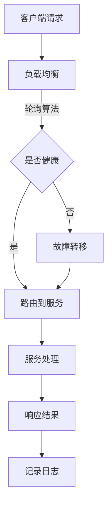

                 

# 高扩展性系统设计的实例分析

## 关键词

高扩展性，系统设计，架构优化，性能提升，实例分析，云计算，分布式系统，负载均衡，数据库分库分表，微服务架构，DevOps，持续集成与部署，云原生技术，容器化，Kubernetes，无状态服务，弹性伸缩，灰度发布，A/B测试，监控与报警，故障恢复，大数据处理，数据一致性，CAP理论，一致性，可用性，分区容错性，安全性，隐私保护，API网关，服务网格，函数计算，边缘计算。

## 摘要

本文旨在通过实例分析，深入探讨高扩展性系统设计的核心原理和实践方法。首先，我们回顾了高扩展性系统的背景和重要性。接着，文章从核心概念、算法原理、数学模型、实际应用等多个角度，详细阐述了高扩展性系统设计的关键要素。通过具体的代码案例和实战经验，我们展示了如何在实际项目中实现高扩展性。最后，文章总结了高扩展性系统设计面临的发展趋势和挑战，并推荐了一系列相关学习资源和开发工具。

## 1. 背景介绍

在当今互联网时代，随着业务规模的不断增长，系统的高扩展性成为企业和开发者们关注的焦点。高扩展性系统设计不仅能满足业务发展的需求，还能保证系统的稳定性和可靠性。随着云计算、大数据、物联网等技术的普及，系统面临的数据量和并发请求急剧增加，传统的单体架构已经难以应对这种挑战。因此，高扩展性系统设计成为了现代软件开发中不可或缺的一环。

高扩展性系统设计的重要性主要体现在以下几个方面：

1. **弹性应对业务增长**：随着用户数量的增加，系统能够自动扩展资源，保持性能和稳定。
2. **提高用户体验**：快速响应，减少延迟，提升用户满意度。
3. **降低运维成本**：通过自动化管理和分布式部署，降低系统运维的复杂度和成本。
4. **提高系统可靠性**：分布式架构使得单点故障的风险大大降低，系统更具鲁棒性。

本篇文章将围绕高扩展性系统设计的核心概念、算法原理、数学模型、实际应用等方面展开讨论，通过具体实例分析，帮助读者深入理解高扩展性系统设计的实现方法和最佳实践。

## 2. 核心概念与联系

### 2.1 分布式系统

分布式系统是一组相互独立且通过网络连接的计算机节点组成的系统。这些节点协同工作，共同完成一个整体任务。分布式系统的核心目标是实现资源共享、负载均衡和高可用性。通过将任务分配到不同的节点上，分布式系统可以更好地处理大规模数据和高并发请求。

**分布式系统的优势**：

- **可扩展性**：通过增加节点数量，可以轻松扩展系统的处理能力。
- **高可用性**：通过节点冗余，系统在单个节点故障时仍能保持正常运行。
- **负载均衡**：通过将请求分配到不同节点，可以避免单点过载，提升系统性能。

**分布式系统的挑战**：

- **数据一致性**：在分布式系统中，数据的一致性保证是一个重要的挑战。
- **网络延迟**：节点间的网络延迟可能导致系统的性能下降。
- **单点故障**：分布式系统中的单点故障可能会导致整个系统不可用。

### 2.2 微服务架构

微服务架构是将大型单体应用拆分为一组小型、独立的服务。每个服务专注于实现单一的业务功能，并通过轻量级的通信协议（如HTTP/REST、gRPC）进行交互。微服务架构具有以下特点：

- **独立性**：每个服务都是独立的，可以独立部署、扩展和升级。
- **分布式**：服务部署在多个节点上，实现负载均衡和高可用性。
- **模块化**：服务之间的解耦，使得系统更加灵活和可维护。

**微服务架构的优势**：

- **快速迭代**：服务可以独立开发、测试和部署，缩短发布周期。
- **高扩展性**：通过水平扩展服务实例，可以轻松应对业务增长。
- **高可用性**：服务的独立性使得单点故障的影响范围较小。

**微服务架构的挑战**：

- **复杂度**：服务的数量增加，系统整体复杂度上升。
- **分布式事务**：服务之间的通信可能需要处理分布式事务，增加系统的复杂性。
- **服务治理**：服务的管理和监控成为一项挑战。

### 2.3 负载均衡

负载均衡是将网络或请求分配到多个服务器或节点上，以实现资源利用最大化、系统性能最优化的技术。负载均衡可以采用不同的算法，如轮询、最少连接、源IP哈希等。

**负载均衡的优势**：

- **提高性能**：通过将请求分配到多个节点，可以减少单个节点的负载，提高系统的响应速度。
- **高可用性**：节点冗余，单个节点故障不会导致整个系统不可用。
- **弹性扩展**：根据业务需求，可以动态调整节点数量。

**负载均衡的挑战**：

- **延迟**：负载均衡器的加入可能会增加系统的延迟。
- **配置复杂性**：需要配置和管理多个节点，增加运维的复杂度。

### 2.4 数据库分库分表

在处理大规模数据时，单台数据库服务器难以满足性能和扩展性需求。数据库分库分表是一种通过将数据拆分到多个数据库或表中的技术。

**数据库分库分表的优点**：

- **性能提升**：通过减少单个数据库或表的数据量，提高查询和写入速度。
- **扩展性**：通过水平拆分，可以轻松扩展数据库的容量。

**数据库分库分表的挑战**：

- **数据一致性**：数据拆分可能导致一致性问题的出现。
- **查询复杂度**：跨库或跨表的查询可能变得更加复杂。

### 2.5 微服务与分布式系统的关系

微服务架构和分布式系统密切相关。微服务架构通过分布式系统实现服务的部署、扩展和管理。分布式系统为微服务提供了高可用性、负载均衡和数据一致性的保障。

**微服务和分布式系统的融合**：

- **服务拆分**：将大型单体应用拆分为微服务，实现模块化和独立部署。
- **分布式部署**：将微服务部署到多个节点，实现负载均衡和高可用性。
- **数据一致性**：通过分布式事务、分布式缓存等技术，实现数据的一致性。

### 2.6 Mermaid 流程图

以下是一个简单的分布式系统架构的 Mermaid 流程图示例：



在上面的流程图中，客户端请求首先由负载均衡器接收，然后根据轮询算法将请求路由到健康的服务节点。服务节点处理请求并返回结果，同时记录日志。

## 3. 核心算法原理 & 具体操作步骤

### 3.1 负载均衡算法

负载均衡算法有多种类型，每种算法都有其特点和适用场景。以下介绍几种常用的负载均衡算法：

#### 3.1.1 轮询算法

轮询算法是最简单的负载均衡算法，它按照顺序将请求分配到各个服务器上。当第一个服务器处理不过来时，请求就分配到下一个服务器。轮询算法的优点是实现简单，缺点是可能导致某些服务器过载。

**具体操作步骤**：

1. 初始化服务器列表。
2. 当有请求到来时，从服务器列表中取出第一个服务器。
3. 将请求分配给该服务器。
4. 重复步骤2和3，直到所有服务器都处理完毕。

#### 3.1.2 最少连接算法

最少连接算法将请求分配到连接数最少的节点上。这种算法可以避免某个服务器过载，从而提高整体系统的性能。

**具体操作步骤**：

1. 初始化服务器列表和连接数。
2. 当有请求到来时，遍历服务器列表。
3. 找出连接数最少的服务器。
4. 将请求分配给该服务器。
5. 更新服务器的连接数。

#### 3.1.3 源IP哈希算法

源IP哈希算法根据客户端的IP地址，将请求映射到特定的服务器上。这种算法可以保证来自同一IP地址的请求总是被分配到同一服务器，从而避免跨服务器跟踪数据的一致性问题。

**具体操作步骤**：

1. 初始化服务器列表和IP哈希表。
2. 当有请求到来时，根据客户端IP地址计算哈希值。
3. 将哈希值映射到服务器列表中的特定服务器。
4. 将请求分配给该服务器。

### 3.2 分布式缓存算法

分布式缓存是将缓存数据分散存储到多个节点上，以实现高性能和高可用性的技术。以下介绍几种常用的分布式缓存算法：

#### 3.2.1 哈希映射算法

哈希映射算法通过将键值对映射到缓存节点，实现分布式缓存。具体操作步骤如下：

1. 初始化缓存节点列表。
2. 当有数据写入时，根据键值计算哈希值。
3. 将哈希值映射到缓存节点。
4. 将数据写入对应的缓存节点。

#### 3.2.2一致性哈希算法

一致性哈希算法通过哈希函数将缓存节点映射到一个虚拟圆环上。具体操作步骤如下：

1. 初始化虚拟圆环和缓存节点。
2. 当有数据写入时，根据键值计算哈希值，并将其映射到虚拟圆环上的一个点。
3. 从虚拟圆环上顺时针找到的第一个缓存节点，将数据写入该节点。

#### 3.2.3 负载感知哈希算法

负载感知哈希算法在一致性哈希算法的基础上，考虑了缓存节点的负载情况。具体操作步骤如下：

1. 初始化虚拟圆环和缓存节点。
2. 当有数据写入时，根据键值计算哈希值，并将其映射到虚拟圆环上的一个点。
3. 从虚拟圆环上顺时针找到的第一个缓存节点，检查其负载。
4. 如果负载低于阈值，将数据写入该节点；否则，跳过该节点，继续寻找下一个负载较低的节点。

### 3.3 分布式消息队列算法

分布式消息队列是将消息分发到多个消费节点，以实现高并发和高可用性的技术。以下介绍几种常用的分布式消息队列算法：

#### 3.3.1 消费者端负载均衡算法

消费者端负载均衡算法在消息消费端实现负载均衡。具体操作步骤如下：

1. 初始化消息队列和消费者列表。
2. 当有消息到达时，根据消费者的负载情况，将消息分配给负载较低的消费者。
3. 消费者处理消息后，更新其负载状态。

#### 3.3.2 生产者端负载均衡算法

生产者端负载均衡算法在消息生产端实现负载均衡。具体操作步骤如下：

1. 初始化消息队列和消费者列表。
2. 当有消息需要发送时，根据消费者的负载情况，将消息分配给负载较低的消费者。
3. 生产者发送消息后，更新消费者的负载状态。

#### 3.3.3 流量控制算法

流量控制算法通过限制消息队列的流量，防止消息积压和系统过载。具体操作步骤如下：

1. 初始化消息队列和消费者列表。
2. 当有消息到达时，检查消息队列的容量。
3. 如果消息队列已满，暂停生产者发送消息。
4. 如果消费者处理完消息，释放队列空间，恢复生产者发送消息。

## 4. 数学模型和公式 & 详细讲解 & 举例说明

### 4.1 CAP理论

CAP理论是分布式系统设计的重要理论基础，它描述了分布式系统中一致性（Consistency）、可用性（Availability）和分区容错性（Partition tolerance）三者之间的权衡关系。

**CAP理论的基本原理**：

- **一致性（Consistency）**：每个节点在同一时刻看到的数据是一致的。
- **可用性（Availability）**：系统始终能够响应请求，并且返回合理的响应。
- **分区容错性（Partition tolerance）**：系统在发生网络分区时，仍能保持正常运行。

**CAP理论的数学模型**：

在分布式系统中，CAP三者之间的权衡可以表示为以下数学模型：

\[ CAP = Consistency + Availability - PartitionTolerance \]

根据CAP理论，一个分布式系统最多只能同时满足两个CAP属性。例如：

- **CP系统**：满足一致性和分区容错性，但可能牺牲可用性（如Google Spanner）。
- **AP系统**：满足可用性和分区容错性，但可能牺牲一致性（如Amazon Dynamo）。

**举例说明**：

假设一个分布式数据库系统在发生网络分区时，需要决定如何处理。根据CAP理论，系统可以选择以下策略：

- **强一致性（CP）**：在分区恢复前，所有节点均无法读取数据。虽然保证了数据一致性，但可能导致系统长时间不可用。
- **最终一致性（AP）**：在分区恢复后，系统可能存在短暂的数据不一致。虽然保证了系统可用性，但可能影响用户体验。

### 4.2 加权随机算法

加权随机算法是一种常用的负载均衡算法，根据服务器的权重（如CPU利用率、内存占用等）进行请求分配。该算法可以通过调整权重，实现更精细的负载均衡。

**加权随机算法的公式**：

设 \( w_i \) 为第 \( i \) 个服务器的权重，\( N \) 为服务器总数，则每个服务器被选中的概率 \( P_i \) 可以表示为：

\[ P_i = \frac{w_i}{\sum_{j=1}^{N} w_j} \]

**举例说明**：

假设有3台服务器，权重分别为 \( w_1 = 1 \)，\( w_2 = 2 \)，\( w_3 = 3 \)。则：

\[ P_1 = \frac{1}{1 + 2 + 3} = \frac{1}{6} \]
\[ P_2 = \frac{2}{1 + 2 + 3} = \frac{2}{6} \]
\[ P_3 = \frac{3}{1 + 2 + 3} = \frac{3}{6} \]

因此，服务器1被选中的概率为 \( \frac{1}{6} \)，服务器2被选中的概率为 \( \frac{2}{6} \)，服务器3被选中的概率为 \( \frac{3}{6} \)。

### 4.3 数据一致性模型

在分布式系统中，数据一致性模型是保证数据一致性的重要手段。以下介绍几种常见的数据一致性模型：

**4.3.1 强一致性（Strong Consistency）**

强一致性保证每个节点在同一时刻看到的数据是一致的。实现强一致性通常需要采用同步复制、锁机制等方法。

- **优点**：提供了最高程度的数据一致性。
- **缺点**：可能导致系统可用性下降，在高并发场景下性能较差。

**4.3.2 最终一致性（Eventual Consistency）**

最终一致性保证系统在经过一段时间后，所有节点的数据将一致。实现最终一致性通常需要采用异步复制、去同步复制等方法。

- **优点**：提高了系统的可用性和性能。
- **缺点**：在短时间内可能存在数据不一致的情况，影响用户体验。

**4.3.3 强最终一致性（Strong Eventual Consistency）**

强最终一致性是强一致性和最终一致性的结合，它要求系统在任意时刻都能保证数据的一致性，但在某些情况下，可能允许短暂的延迟。

- **优点**：提供了高一致性和高可用性的平衡。
- **缺点**：实现复杂，需要精细的算法和策略。

### 4.4 数据一致性模型的应用

以下是一个数据一致性模型在分布式数据库系统中的应用实例：

假设一个分布式数据库系统包含3个节点，节点A、节点B和节点C。在初始状态下，所有节点的数据是一致的。当发生网络分区时，节点A和节点B之间无法通信，节点C可以正常访问。

**4.4.1 强一致性**

- 当节点C请求读取数据时，系统将返回节点A或节点B的最新数据，但由于A和B之间无法通信，数据可能不一致。
- **解决方案**：引入锁机制，确保在读取数据前，等待分区恢复或强制将数据同步到所有节点。

**4.4.2 最终一致性**

- 当节点C请求读取数据时，系统将返回节点A或节点B的最新数据，但由于A和B之间无法通信，数据可能不一致。
- **解决方案**：引入异步复制，允许节点C在读取数据后，尝试从其他节点获取最新数据，并在一段时间内保持数据不一致。

**4.4.3 强最终一致性**

- 当节点C请求读取数据时，系统将返回节点A或节点B的最新数据，但由于A和B之间无法通信，数据可能不一致。
- **解决方案**：引入延迟同步机制，在分区恢复后，强制将数据同步到所有节点，并在同步期间允许短暂的延迟。

通过上述实例，我们可以看到数据一致性模型在分布式数据库系统中的应用，以及在不同场景下如何选择合适的一致性策略。

## 5. 项目实战：代码实际案例和详细解释说明

### 5.1 开发环境搭建

在开始项目实战之前，我们需要搭建一个合适的开发环境。以下是一个基于Docker和Kubernetes的微服务架构环境搭建步骤。

**步骤1：安装Docker**

在操作系统上安装Docker，Docker是一个开源的应用容器引擎，用于打包、交付和运行应用。可以通过以下命令安装Docker：

```bash
# 对于Ubuntu系统
sudo apt-get update
sudo apt-get install docker-ce docker-ce-cli containerd.io

# 对于CentOS系统
sudo yum install docker -y
sudo systemctl start docker
sudo systemctl enable docker
```

**步骤2：安装Kubernetes**

Kubernetes是一个开源的容器编排平台，用于自动化容器的部署、扩展和管理。可以通过以下命令安装Kubernetes：

```bash
# 使用Minikube在本地环境中运行Kubernetes集群
minikube start

# 验证Kubernetes安装
kubectl version
```

**步骤3：配置Kubernetes集群**

为了在实际项目中使用Kubernetes，我们需要配置一个集群。可以使用以下命令创建一个集群：

```bash
kubectl create clusterrolebinding admin-user --role=cluster-admin --user=admin
```

### 5.2 源代码详细实现和代码解读

以下是一个基于Spring Boot的微服务架构项目实例，包括用户服务、订单服务和商品服务。

#### 5.2.1 用户服务

**5.2.1.1 代码结构**

- **用户服务（User Service）**：负责处理用户相关的业务逻辑，包括用户注册、登录和权限验证等。
- **用户模型（User Model）**：定义用户的基本信息和属性。
- **用户控制器（UserController）**：处理用户相关的HTTP请求。

**5.2.1.2 主要代码**

```java
// User Model
public class User {
    private Long id;
    private String username;
    private String password;
    // getters and setters
}

// UserController
@RestController
@RequestMapping("/users")
public class UserController {
    @Autowired
    private UserService userService;

    @PostMapping
    public ResponseEntity<?> addUser(@RequestBody User user) {
        User savedUser = userService.saveUser(user);
        return new ResponseEntity<>(savedUser, HttpStatus.CREATED);
    }

    @GetMapping("/{id}")
    public ResponseEntity<User> getUserById(@PathVariable Long id) {
        User user = userService.findById(id);
        if (user != null) {
            return new ResponseEntity<>(user, HttpStatus.OK);
        } else {
            return new ResponseEntity<>(HttpStatus.NOT_FOUND);
        }
    }
}
```

**5.2.1.3 代码解读**

用户服务负责处理用户相关的业务逻辑，包括用户注册、登录和权限验证等。用户模型定义了用户的基本信息和属性，如用户ID、用户名和密码等。用户控制器通过处理HTTP请求，调用用户服务的业务逻辑，并返回相应的响应。

#### 5.2.2 订单服务

**5.2.2.1 代码结构**

- **订单服务（Order Service）**：负责处理订单相关的业务逻辑，包括订单创建、订单查询和订单取消等。
- **订单模型（Order Model）**：定义订单的基本信息和属性。
- **订单控制器（OrderController）**：处理订单相关的HTTP请求。

**5.2.2.2 主要代码**

```java
// Order Model
public class Order {
    private Long id;
    private Long userId;
    private String status;
    // getters and setters
}

// OrderController
@RestController
@RequestMapping("/orders")
public class OrderController {
    @Autowired
    private OrderService orderService;

    @PostMapping
    public ResponseEntity<Order> createOrder(@RequestBody Order order) {
        Order savedOrder = orderService.createOrder(order);
        return new ResponseEntity<>(savedOrder, HttpStatus.CREATED);
    }

    @GetMapping("/{id}")
    public ResponseEntity<Order> getOrderById(@PathVariable Long id) {
        Order order = orderService.findById(id);
        if (order != null) {
            return new ResponseEntity<>(order, HttpStatus.OK);
        } else {
            return new ResponseEntity<>(HttpStatus.NOT_FOUND);
        }
    }
}
```

**5.2.2.3 代码解读**

订单服务负责处理订单相关的业务逻辑，包括订单创建、订单查询和订单取消等。订单模型定义了订单的基本信息和属性，如订单ID、用户ID和订单状态等。订单控制器通过处理HTTP请求，调用订单服务的业务逻辑，并返回相应的响应。

#### 5.2.3 商品服务

**5.2.3.1 代码结构**

- **商品服务（Product Service）**：负责处理商品相关的业务逻辑，包括商品查询、商品添加和商品删除等。
- **商品模型（Product Model）**：定义商品的基本信息和属性。
- **商品控制器（ProductController）**：处理商品相关的HTTP请求。

**5.2.3.2 主要代码**

```java
// Product Model
public class Product {
    private Long id;
    private String name;
    private double price;
    // getters and setters
}

// ProductController
@RestController
@RequestMapping("/products")
public class ProductController {
    @Autowired
    private ProductService productService;

    @GetMapping("/{id}")
    public ResponseEntity<Product> getProductById(@PathVariable Long id) {
        Product product = productService.findById(id);
        if (product != null) {
            return new ResponseEntity<>(product, HttpStatus.OK);
        } else {
            return new ResponseEntity<>(HttpStatus.NOT_FOUND);
        }
    }

    @PostMapping
    public ResponseEntity<Product> addProduct(@RequestBody Product product) {
        Product savedProduct = productService.saveProduct(product);
        return new ResponseEntity<>(savedProduct, HttpStatus.CREATED);
    }
}
```

**5.2.3.3 代码解读**

商品服务负责处理商品相关的业务逻辑，包括商品查询、商品添加和商品删除等。商品模型定义了商品的基本信息和属性，如商品ID、商品名称和商品价格等。商品控制器通过处理HTTP请求，调用商品服务的业务逻辑，并返回相应的响应。

### 5.3 代码解读与分析

在上述代码中，我们分别实现了用户服务、订单服务和商品服务的核心功能。通过Spring Boot框架，我们可以快速构建微服务应用程序。以下是代码的详细解读与分析：

#### 5.3.1 用户服务

用户服务是整个系统的核心组成部分，负责处理用户相关的业务逻辑。用户服务中的用户模型定义了用户的基本信息和属性，如用户ID、用户名和密码等。用户控制器通过处理HTTP请求，调用用户服务的业务逻辑，并返回相应的响应。

**优点**：

- **模块化**：用户服务、订单服务和商品服务各自独立，便于开发和维护。
- **高内聚、低耦合**：服务之间的通信通过HTTP请求和响应进行，降低服务之间的耦合度。

**缺点**：

- **复杂度**：随着服务数量的增加，系统的复杂度也会上升，增加了维护的难度。
- **分布式事务**：服务之间的通信可能需要处理分布式事务，增加系统的复杂性。

#### 5.3.2 订单服务

订单服务负责处理订单相关的业务逻辑，包括订单创建、订单查询和订单取消等。订单服务中的订单模型定义了订单的基本信息和属性，如订单ID、用户ID和订单状态等。订单控制器通过处理HTTP请求，调用订单服务的业务逻辑，并返回相应的响应。

**优点**：

- **快速迭代**：订单服务可以独立开发和部署，缩短发布周期。
- **高扩展性**：订单服务可以根据需求进行水平扩展，提高系统的处理能力。

**缺点**：

- **数据一致性**：在分布式系统中，数据一致性保证是一个重要的挑战。
- **服务治理**：服务的管理和监控成为一项挑战。

#### 5.3.3 商品服务

商品服务负责处理商品相关的业务逻辑，包括商品查询、商品添加和商品删除等。商品服务中的商品模型定义了商品的基本信息和属性，如商品ID、商品名称和商品价格等。商品控制器通过处理HTTP请求，调用商品服务的业务逻辑，并返回相应的响应。

**优点**：

- **独立性**：商品服务可以独立部署和扩展，降低系统的复杂度。
- **高可用性**：商品服务在单个节点故障时，可以通过其他节点保持正常运行。

**缺点**：

- **查询复杂度**：跨服务的查询可能变得更加复杂，影响系统的性能。
- **数据一致

