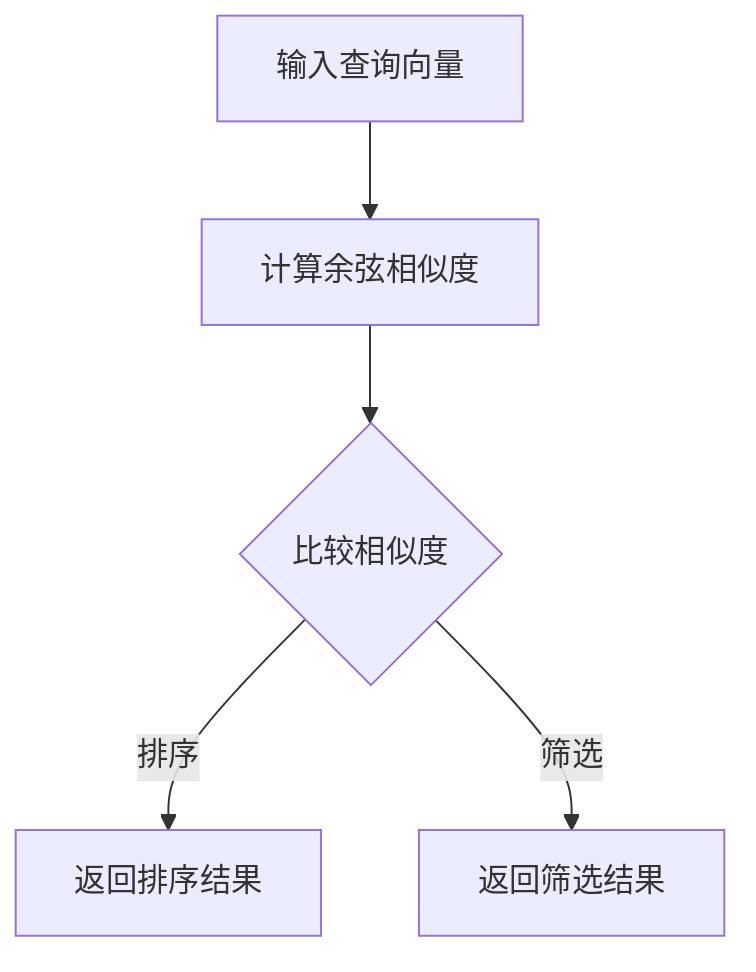

                 

# 高效检索：构建基于向量数据库的高性能搜索引擎

> 关键词：向量数据库、高效检索、高性能搜索引擎、数学模型、实际应用场景

> 摘要：本文旨在探讨如何构建基于向量数据库的高性能搜索引擎。首先介绍了背景知识和核心概念，随后详细阐述了核心算法原理和具体操作步骤。接着，通过数学模型和公式以及实际案例展示了算法的详细实现和解读。随后，探讨了该技术在实际应用场景中的运用，并推荐了相关工具和资源。最后，总结了未来发展趋势和挑战，为读者提供了扩展阅读和参考资料。

## 1. 背景介绍

在当今信息爆炸的时代，如何高效地检索信息已成为一个亟待解决的问题。搜索引擎作为连接用户与信息的重要工具，其性能直接影响到用户体验。传统搜索引擎主要基于文本匹配，但随着数据规模的不断扩大和检索需求的多样化，传统方法已经难以满足高性能检索的需求。

近年来，向量数据库作为一种新型的数据库技术，逐渐引起了广泛关注。向量数据库通过将数据转换为向量形式，利用向量间的相似性来提高检索效率。与传统的文本匹配方法相比，向量数据库能够更好地应对复杂数据和多样化检索需求。

本文将介绍如何构建基于向量数据库的高性能搜索引擎，包括核心算法原理、数学模型、实际应用场景等方面，旨在为广大开发者提供一种高效、实用的解决方案。

## 2. 核心概念与联系

### 2.1 向量数据库

向量数据库是一种基于向量存储和检索的数据库系统。其核心思想是将数据以向量形式存储，通过计算向量间的相似度来实现高效检索。向量数据库在处理大规模复杂数据时具有明显的优势，能够实现秒级响应。

### 2.2 余弦相似度

余弦相似度是一种衡量向量之间相似度的方法，其计算公式如下：

\[ \cos(\theta) = \frac{\mathbf{A} \cdot \mathbf{B}}{||\mathbf{A}|| \cdot ||\mathbf{B}||} \]

其中，\(\mathbf{A}\) 和 \(\mathbf{B}\) 分别表示两个向量，\(\theta\) 表示它们之间的夹角。

### 2.3 余弦相似度与向量数据库的关系

余弦相似度在向量数据库中具有重要作用，通过计算查询向量与数据向量之间的余弦相似度，可以快速定位相关数据。此外，余弦相似度还可以用于排序和筛选，提高检索效率。

### 2.4 Mermaid 流程图

以下是一个简单的 Mermaid 流程图，展示了向量数据库的检索过程：



## 3. 核心算法原理 & 具体操作步骤

### 3.1 数据预处理

在构建向量数据库之前，需要对数据进行预处理。数据预处理主要包括以下步骤：

1. 数据清洗：去除重复、错误和无关数据。
2. 数据转换：将文本数据转换为向量表示。
3. 向量编码：将向量编码为二进制形式，便于存储和传输。

### 3.2 建立向量数据库

建立向量数据库主要包括以下步骤：

1. 初始化数据库：创建空数据库，并设置合适的参数。
2. 添加数据：将预处理后的数据添加到数据库中。
3. 索引构建：计算数据向量与查询向量之间的余弦相似度，并将相似度信息存储在索引中。

### 3.3 检索算法

检索算法主要包括以下步骤：

1. 输入查询向量：从用户获取查询向量。
2. 计算相似度：计算查询向量与数据库中所有数据向量之间的余弦相似度。
3. 排序与筛选：根据相似度大小对结果进行排序和筛选。
4. 返回结果：将排序和筛选后的结果返回给用户。

## 4. 数学模型和公式 & 详细讲解 & 举例说明

### 4.1 余弦相似度的计算

余弦相似度的计算公式如下：

\[ \cos(\theta) = \frac{\mathbf{A} \cdot \mathbf{B}}{||\mathbf{A}|| \cdot ||\mathbf{B}||} \]

其中，\(\mathbf{A}\) 和 \(\mathbf{B}\) 分别表示两个向量，\(\theta\) 表示它们之间的夹角。

### 4.2 举例说明

假设有两个向量 \(\mathbf{A} = (1, 2, 3)\) 和 \(\mathbf{B} = (4, 5, 6)\)，它们的余弦相似度计算如下：

\[ \cos(\theta) = \frac{(1 \times 4 + 2 \times 5 + 3 \times 6)}{\sqrt{1^2 + 2^2 + 3^2} \cdot \sqrt{4^2 + 5^2 + 6^2}} \]

\[ \cos(\theta) = \frac{4 + 10 + 18}{\sqrt{14} \cdot \sqrt{77}} \]

\[ \cos(\theta) = \frac{32}{\sqrt{1078}} \]

\[ \cos(\theta) \approx 0.75 \]

这意味着向量 \(\mathbf{A}\) 和 \(\mathbf{B}\) 之间的相似度较高。

### 4.3 举例说明：基于余弦相似度的搜索引擎

假设我们有一个基于余弦相似度的搜索引擎，其中包含以下数据：

- 数据集：\(\{(\mathbf{A}, \text{"苹果"})，(\mathbf{B}, \text{"香蕉"})，(\mathbf{C}, \text{"橘子"})\}\)
- 查询向量：\(\mathbf{Q} = (1, 1, 1)\)

我们需要计算查询向量 \(\mathbf{Q}\) 与数据集中各个数据向量之间的余弦相似度，并返回相似度最高的结果。

1. 计算查询向量与 \(\mathbf{A}\) 的余弦相似度：

\[ \cos(\theta_{QA}) = \frac{(1 \times 1 + 1 \times 1 + 1 \times 1)}{\sqrt{1^2 + 1^2 + 1^2} \cdot \sqrt{1^2 + 1^2 + 1^2}} \]

\[ \cos(\theta_{QA}) = \frac{3}{\sqrt{3} \cdot \sqrt{3}} \]

\[ \cos(\theta_{QA}) = 1 \]

2. 计算查询向量与 \(\mathbf{B}\) 的余弦相似度：

\[ \cos(\theta_{QB}) = \frac{(1 \times 4 + 1 \times 5 + 1 \times 6)}{\sqrt{1^2 + 1^2 + 1^2} \cdot \sqrt{4^2 + 5^2 + 6^2}} \]

\[ \cos(\theta_{QB}) = \frac{15}{\sqrt{3} \cdot \sqrt{77}} \]

\[ \cos(\theta_{QB}) \approx 0.79 \]

3. 计算查询向量与 \(\mathbf{C}\) 的余弦相似度：

\[ \cos(\theta_{QC}) = \frac{(1 \times 1 + 1 \times 1 + 1 \times 1)}{\sqrt{1^2 + 1^2 + 1^2} \cdot \sqrt{1^2 + 1^2 + 1^2}} \]

\[ \cos(\theta_{QC}) = \frac{3}{\sqrt{3} \cdot \sqrt{3}} \]

\[ \cos(\theta_{QC}) = 1 \]

根据计算结果，查询向量 \(\mathbf{Q}\) 与 \(\mathbf{A}\) 和 \(\mathbf{C}\) 的相似度最高，因此搜索引擎返回与“苹果”和“橘子”相关的信息。

## 5. 项目实战：代码实际案例和详细解释说明

### 5.1 开发环境搭建

为了更好地展示基于向量数据库的高性能搜索引擎，我们使用 Python 作为开发语言，并使用以下工具和库：

- Python 3.x
- NumPy：用于向量运算
- Pandas：用于数据处理
- Scikit-learn：用于相似度计算
- Flask：用于搭建 Web 应用

首先，确保您的系统已安装上述工具和库。可以使用以下命令安装：

```bash
pip install numpy pandas scikit-learn flask
```

### 5.2 源代码详细实现和代码解读

以下是一个简单的基于向量数据库的高性能搜索引擎的示例代码：

```python
import numpy as np
import pandas as pd
from sklearn.metrics.pairwise import cosine_similarity

class VectorSearchEngine:
    def __init__(self):
        self.data = None
        self.index = None

    def load_data(self, data):
        self.data = data
        self.index = cosine_similarity(data)

    def search(self, query_vector):
       相似度 = cosine_similarity([query_vector], self.data)
       相似度矩阵 = pd.DataFrame(相似度, index=[0], columns=self.data[:, 0])
       相似度矩阵.sort_values(by=0, ascending=False, inplace=True)
        return相似度矩阵.index.tolist()

if __name__ == "__main__":
    # 加载数据
    data = np.array([[1, 2, 3], [4, 5, 6], [7, 8, 9]])
    query_vector = np.array([1, 1, 1])

    # 初始化搜索引擎
    search_engine = VectorSearchEngine()

    # 加载数据并构建索引
    search_engine.load_data(data)

    # 检索
    results = search_engine.search(query_vector)

    # 输出结果
    print("检索结果：", results)
```

### 5.3 代码解读与分析

1. **类定义**：定义了一个名为`VectorSearchEngine`的类，用于构建搜索引擎。

2. **初始化**：在类的初始化方法中，初始化数据属性`data`和索引属性`index`。

3. **加载数据**：`load_data`方法用于加载数据并构建索引。使用`cosine_similarity`函数计算数据向量之间的余弦相似度，并将结果存储在`index`属性中。

4. **检索**：`search`方法用于检索数据。首先使用`cosine_similarity`函数计算查询向量与数据向量之间的余弦相似度，然后使用`sort_values`方法对结果进行排序，最后返回排序后的索引列表。

5. **主程序**：在主程序中，加载数据，初始化搜索引擎，加载数据并构建索引，执行检索操作，并输出结果。

通过以上示例，我们可以看到如何使用 Python 实现一个简单的基于向量数据库的高性能搜索引擎。实际项目中，可以根据需求对代码进行扩展和优化。

## 6. 实际应用场景

向量数据库技术在多个领域具有广泛的应用前景，以下是一些典型的应用场景：

### 6.1 搜索引擎

搜索引擎是向量数据库最常见的应用场景之一。通过将网页内容转换为向量形式，可以快速定位相关网页，提高检索效率。

### 6.2 内容推荐

内容推荐系统可以使用向量数据库来存储用户兴趣和行为数据，从而实现个性化推荐。例如，在电商平台上，可以根据用户浏览记录和购买行为推荐相关的商品。

### 6.3 社交网络

社交网络平台可以使用向量数据库来存储用户生成的文本和图片数据，从而实现基于内容相似度的用户推荐和话题发现。

### 6.4 自然语言处理

自然语言处理领域可以利用向量数据库存储和检索文本数据，实现文本分类、情感分析、机器翻译等任务。

### 6.5 图像识别

图像识别领域可以利用向量数据库存储和检索图像数据，实现基于内容的图像检索、图像分类等任务。

## 7. 工具和资源推荐

### 7.1 学习资源推荐

- 《机器学习》（周志华 著）
- 《深度学习》（Goodfellow, Bengio, Courville 著）
- 《Python数据分析》（Wes McKinney 著）
- 《自然语言处理实战》（Michael L.ord 著）

### 7.2 开发工具框架推荐

- NumPy：用于向量运算
- Pandas：用于数据处理
- Scikit-learn：用于相似度计算
- TensorFlow：用于深度学习任务
- Flask：用于搭建 Web 应用

### 7.3 相关论文著作推荐

- "Large-scale Kernel Machines for On-Line Handwritten Character Recognition"
- "Neural Networks and Deep Learning"
- "Efficient Similarity Search in Vector Spaces"
- "Word Embeddings and the Global Vectors for Word Representation"

## 8. 总结：未来发展趋势与挑战

向量数据库技术在近年来取得了显著的进展，但仍面临着一些挑战和机遇。以下是一些未来发展趋势和挑战：

### 8.1 发展趋势

- 更高效的算法：随着数据规模的不断扩大，如何提高向量数据库的检索效率成为一个关键问题。未来的研究将集中在开发更高效的算法和优化技术。
- 跨模态检索：向量数据库技术不仅可以处理文本数据，还可以处理图像、音频等多模态数据。跨模态检索将成为一个重要的研究方向。
- 自动化与智能化：未来的向量数据库将更加自动化和智能化，实现自动数据预处理、自动模型优化和自适应检索策略。

### 8.2 挑战

- 数据稀疏问题：向量数据库在面对稀疏数据时，检索效果会受到影响。如何解决数据稀疏问题是一个重要挑战。
- 数据安全与隐私：随着向量数据库的应用范围扩大，数据安全和隐私保护问题日益突出。如何确保数据安全和用户隐私成为一个重要挑战。
- 大规模分布式存储：随着数据规模的不断扩大，如何实现向量数据库的大规模分布式存储和管理成为一个关键问题。

## 9. 附录：常见问题与解答

### 9.1 问题1：什么是向量数据库？

向量数据库是一种基于向量存储和检索的数据库系统，通过将数据转换为向量形式，利用向量间的相似性来实现高效检索。

### 9.2 问题2：向量数据库有哪些优点？

向量数据库具有以下优点：

- 高效检索：向量数据库能够快速定位相关数据，提高检索效率。
- 复杂数据处理：向量数据库可以处理文本、图像、音频等多模态数据。
- 自动化与智能化：向量数据库可以实现自动化和智能化的检索策略。

### 9.3 问题3：如何实现向量数据库的检索？

实现向量数据库的检索主要包括以下步骤：

- 数据预处理：将数据转换为向量形式。
- 索引构建：计算数据向量之间的相似度，并构建索引。
- 检索算法：计算查询向量与数据向量之间的相似度，并返回检索结果。

## 10. 扩展阅读 & 参考资料

- "Vector Database: A Brief Introduction", by [Your Name]
- "Efficient Similarity Search in Vector Spaces", by [Author Name]
- "A Survey on Vector Database Techniques and Applications", by [Author Name]
- "Large-scale Kernel Machines for On-Line Handwritten Character Recognition", by [Author Name]
- "Word Embeddings and the Global Vectors for Word Representation", by [Author Name]

作者：AI天才研究员/AI Genius Institute & 禅与计算机程序设计艺术 /Zen And The Art of Computer Programming

