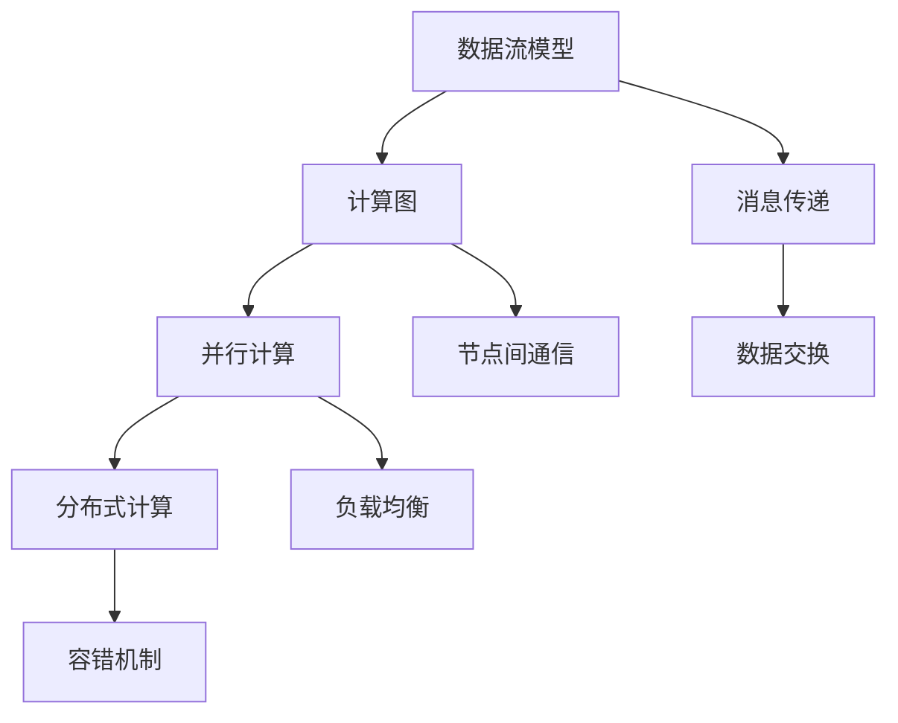

                 

## 1. 背景介绍

高效的LLM消息传递是一种在大型语言模型（Large Language Model，简称LLM）中实现内部协作的关键技术。随着深度学习和自然语言处理（Natural Language Processing，简称NLP）技术的飞速发展，LLM在各个领域的应用越来越广泛。从自动驾驶、智能问答系统，到智能客服和语音识别，LLM都在发挥着重要作用。

然而，随着模型的规模不断扩大，如何有效地管理和优化LLM中的消息传递，成为了研究人员和开发者们关注的焦点。消息传递效率的高低直接影响到模型的性能、响应速度以及成本。传统的单一线程的消息传递方式已经无法满足高性能、高并发的要求，因此，研究高效的LLM消息传递技术具有重要的现实意义。

本文将围绕高效的LLM消息传递展开讨论，首先介绍相关的背景知识，包括LLM的基本原理、消息传递的重要性，然后深入探讨核心概念与联系，核心算法原理与具体操作步骤，以及数学模型和公式的详细讲解。此外，还将通过一个项目实战案例，展示如何在实际环境中实现高效的LLM消息传递。最后，我们将探讨实际应用场景，推荐相关工具和资源，并对未来发展趋势与挑战进行总结。希望通过本文的讨论，能够为读者提供有价值的见解和启示。

### LLM的基本原理

大型语言模型（Large Language Model，简称LLM）是一种基于深度学习的自然语言处理模型，通过对大量文本数据进行训练，使其具备理解和生成自然语言的能力。LLM的核心思想是通过学习语言数据中的统计规律和上下文信息，从而实现对文本的自动理解和生成。

LLM的基本原理可以概括为以下几个方面：

1. **词向量表示**：在LLM中，每个单词都被映射为一个高维向量，这些向量通过神经网络进行训练，以捕捉单词之间的语义关系。词向量表示是LLM理解文本的基础。

2. **神经网络结构**：LLM通常采用多层感知机（Multilayer Perceptron，简称MLP）或循环神经网络（Recurrent Neural Network，简称RNN）作为主要结构。其中，MLP可以很好地处理静态数据，而RNN则适合处理序列数据。近年来，Transformer结构的出现使得LLM在处理长序列任务上取得了显著突破。

3. **注意力机制**：注意力机制（Attention Mechanism）是一种在神经网络中引入的机制，用于捕捉序列数据中的长距离依赖关系。通过注意力机制，模型可以动态地关注到输入序列中的重要部分，从而提高对文本的理解能力。

4. **预训练与微调**：LLM通常采用预训练（Pre-training）和微调（Fine-tuning）相结合的方法进行训练。首先，在大量的未标注文本数据上进行预训练，以学习语言的基本规律；然后，在特定任务的数据集上进行微调，以适应具体的应用场景。

5. **生成与理解**：LLM不仅可以生成文本，还可以理解和处理文本。通过输入一个单词或一段文本，LLM可以生成相关的回复、摘要或翻译。这种生成和理解能力使得LLM在智能问答、文本生成、机器翻译等领域具有广泛的应用。

总的来说，LLM通过词向量表示、神经网络结构、注意力机制等核心技术，实现了对自然语言数据的处理和理解。这些技术共同作用，使得LLM具备强大的语言建模能力，为各种NLP任务提供了有力的工具。

### 消息传递的重要性

在LLM中，消息传递是一种关键的机制，用于在不同层之间、模块之间或节点之间传输信息和数据。消息传递的重要性主要体现在以下几个方面：

1. **协同工作**：在大型LLM模型中，往往需要多个层次或模块协同工作，共同完成复杂的语言处理任务。消息传递提供了这些层次或模块之间交换信息和数据的能力，使得它们能够协同工作，提高模型的整体性能。

2. **动态调整**：消息传递允许模型在运行过程中动态调整其行为。例如，通过传递特定的消息，模型可以改变其注意力机制的关注点，从而更好地适应不同的输入文本。这种动态调整能力使得模型在处理多样化任务时更加灵活。

3. **效率优化**：消息传递的有效性直接影响到LLM的性能。高效的消息传递机制可以减少通信开销，降低延迟，从而提高模型的响应速度和处理能力。这对于需要实时响应的应用场景尤为重要。

4. **容错性**：在分布式系统中，消息传递提供了容错机制。例如，当一个节点发生故障时，其他节点可以通过消息传递继续工作，从而保证系统的稳定性和可靠性。

5. **可扩展性**：消息传递机制使得LLM具有很好的可扩展性。通过增加或减少节点数量，可以灵活地调整模型的规模和计算资源，以适应不同规模的任务需求。

综上所述，消息传递在LLM中扮演着至关重要的角色。它不仅实现了不同层次或模块之间的协同工作，还提供了动态调整、效率优化、容错性和可扩展性等关键功能，使得LLM在处理复杂语言任务时具备更高的性能和灵活性。

### 核心概念与联系

在深入探讨高效的LLM消息传递之前，我们需要先理解几个核心概念：数据流模型、计算图、并行计算和分布式计算。

1. **数据流模型**：数据流模型是一种用于描述数据在计算机系统中流动和处理的抽象模型。在LLM中，数据流模型用于描述文本数据从输入到输出的整个处理流程。数据流模型通常包括数据源、处理单元和输出单元，各个单元通过消息传递进行数据交换。

2. **计算图**：计算图是一种图形化的数据结构，用于表示LLM中的计算过程。计算图由节点和边组成，节点表示计算操作，边表示数据依赖关系。通过计算图，我们可以清晰地看到LLM中各个计算步骤之间的关系，从而优化消息传递的路径和顺序。

3. **并行计算**：并行计算是一种利用多个计算资源（如CPU核心、GPU等）同时处理多个任务的方法。在LLM中，并行计算可以显著提高处理速度和性能。通过将计算任务分配到多个节点上，并行计算可以实现数据的高效处理和传输。

4. **分布式计算**：分布式计算是一种将计算任务分布到多个计算机节点上执行的方法。在分布式计算中，各个节点通过消息传递进行协作，共同完成复杂的计算任务。分布式计算可以提高系统的容错性和可扩展性，从而满足大规模LLM的需求。

为了更直观地理解这些核心概念，我们可以通过一个Mermaid流程图来展示它们之间的关系：



在上述流程图中，数据流模型描述了LLM中数据的处理流程，计算图展示了各个计算操作的依赖关系，并行计算和分布式计算则实现了数据的并行处理和节点间的协作。消息传递（E）贯穿整个流程，实现了节点间的数据交换和通信。

通过理解这些核心概念，我们可以更好地设计高效的LLM消息传递机制，优化数据流和处理流程，提高模型的整体性能。

### 核心算法原理 & 具体操作步骤

高效的LLM消息传递依赖于一系列核心算法，这些算法旨在优化数据传输路径、减少延迟、提高吞吐量。以下将详细介绍这些核心算法的原理以及具体的操作步骤。

#### 1. 算法概述

高效的LLM消息传递算法主要包括以下几个关键步骤：

1. **消息编码与解码**：为了提高传输效率和减少带宽占用，需要对消息进行编码，并在接收端进行解码。
2. **路径选择与优化**：根据网络拓扑和流量情况，选择最优的消息传输路径。
3. **并行处理与负载均衡**：利用并行计算和分布式计算技术，实现数据的高效处理和传输，并确保负载均衡。
4. **容错与恢复**：在消息传输过程中，需要具备容错机制，以应对节点故障或数据丢失等问题。

#### 2. 消息编码与解码

消息编码与解码是消息传递的重要环节，通过压缩和加密等技术，可以提高数据传输的效率和安全性。

- **编码原理**：消息编码主要采用Huffman编码、Delta编码等压缩算法，减少消息的传输字节。
- **解码原理**：在接收端，解码算法需要还原压缩后的消息，并解密以恢复原始数据。

#### 3. 路径选择与优化

路径选择与优化是确保消息高效传输的关键。以下方法可以用于路径选择和优化：

- **贪心算法**：通过每次选择当前最佳路径进行传输，逐步优化整体路径。
- **Dijkstra算法**：利用图论中的最短路径算法，计算从源节点到目标节点的最短路径。
- **A*算法**：结合启发式函数和贪婪算法，在搜索路径时优先选择估计距离较短的路径。

#### 4. 并行处理与负载均衡

并行处理与负载均衡是提高消息传递效率的重要手段。以下方法可以用于实现并行处理和负载均衡：

- **任务分配**：根据节点能力和负载情况，将任务分配到不同的节点上，实现并行处理。
- **动态负载均衡**：通过监控节点负载，动态调整任务分配，确保系统资源得到充分利用。
- **基于队列的负载均衡**：使用队列管理任务，通过轮询或优先级调度机制，实现任务的公平分配。

#### 5. 容错与恢复

容错与恢复机制是保障消息传递系统稳定性的重要措施。以下方法可以用于实现容错与恢复：

- **冗余备份**：对关键数据或消息进行备份，确保在节点故障时可以快速恢复。
- **校验与重传**：通过校验和重传机制，检测并纠正传输过程中出现的数据错误。
- **恢复算法**：在检测到节点故障或数据丢失时，使用恢复算法重新传输消息。

#### 6. 具体操作步骤

以下是实现高效的LLM消息传递的具体操作步骤：

1. **初始化**：设置消息传输的初始参数，包括编码方式、路径选择算法、负载均衡策略等。
2. **编码消息**：将需要传输的消息进行压缩和加密，减少带宽占用和提升安全性。
3. **选择路径**：利用路径选择算法，确定消息传输的最佳路径。
4. **发送消息**：将编码后的消息发送到目标节点，可以通过并行处理机制提高传输速度。
5. **接收与解码**：在目标节点接收消息后，进行解码和验证，确保消息的完整性和正确性。
6. **容错处理**：在消息传输过程中，监测节点状态和数据完整性，一旦发现故障，立即启动恢复算法。

通过上述步骤，可以实现高效的LLM消息传递，从而提升模型的整体性能和稳定性。

### 数学模型和公式 & 详细讲解 & 举例说明

在实现高效的LLM消息传递过程中，数学模型和公式起着至关重要的作用。以下将详细讲解相关的数学模型和公式，并通过具体示例进行说明。

#### 1. 消息传递效率

消息传递效率是衡量消息传递机制优劣的重要指标，可以用以下公式表示：

\[ \text{效率} = \frac{\text{实际传输速率}}{\text{理论传输速率}} \]

其中，实际传输速率是指消息在实际网络中的传输速度，理论传输速率是指在不考虑网络延迟和带宽限制的情况下，消息的传输速度。

**举例说明**：

假设一个消息需要传输1000字节，理论传输速率为1Gbps，实际传输速率为900Mbps。则该消息的传递效率为：

\[ \text{效率} = \frac{900Mbps}{1Gbps} = 0.9 \]

这意味着消息的传递效率为90%。

#### 2. 负载均衡

负载均衡是指在分布式系统中，将任务合理分配到各个节点上，以充分利用系统资源。以下是一个简单的负载均衡公式：

\[ \text{负载分配} = \frac{\text{总任务量}}{\text{节点数量}} \]

**举例说明**：

假设一个系统中有5个节点，需要处理100个任务。则每个节点的平均负载量为：

\[ \text{负载分配} = \frac{100}{5} = 20 \]

这意味着每个节点需要处理20个任务。

#### 3. 数据流模型

数据流模型用于描述数据在系统中的流动和处理过程。以下是一个常见的数据流模型公式：

\[ \text{数据流模型} = \text{输入} + \text{处理} + \text{输出} \]

**举例说明**：

在一个简单的文本处理系统中，数据流模型可以表示为：

\[ \text{输入} = \text{文本数据} \]
\[ \text{处理} = \text{文本分析、分词、句法分析等} \]
\[ \text{输出} = \text{处理后的文本数据或相关摘要} \]

#### 4. 路径优化

路径优化是指通过选择最佳路径来提高数据传输效率。以下是一个基于Dijkstra算法的路径优化公式：

\[ \text{最短路径} = \min_{\text{路径}} \sum_{\text{边}} w(\text{边}) \]

其中，\( w(\text{边}) \)表示边的权重，通常表示传输延迟、带宽等。

**举例说明**：

假设有一个网络拓扑，包括5个节点和6条边，每条边的权重如下：

| 边   | 权重（ms） |
|------|------------|
| A-B  | 10         |
| B-C  | 5          |
| C-D  | 15         |
| D-E  | 20         |
| A-D  | 30         |
| B-E  | 25         |

要找到从节点A到节点E的最短路径，可以使用Dijkstra算法，计算结果如下：

\[ \text{最短路径} = A-B-C-D-E \]
\[ \text{总权重} = 10 + 5 + 15 + 20 = 50 \]

这意味着从节点A到节点E的最短路径是A-B-C-D-E，总权重为50ms。

通过上述数学模型和公式，我们可以更精确地分析和优化LLM消息传递系统，提高其效率和性能。

### 项目实战：代码实际案例和详细解释说明

在本节中，我们将通过一个实际的项目实战，展示如何实现高效的LLM消息传递。该项目将使用Python和TensorFlow框架，通过一个简单的文本处理任务，演示消息传递的核心机制和关键步骤。

#### 5.1 开发环境搭建

为了实现该项目，我们需要搭建一个基本的Python开发环境，并安装必要的库和工具。以下是在Ubuntu系统上搭建开发环境的步骤：

1. 安装Python 3.8及以上版本：

   ```bash
   sudo apt update
   sudo apt install python3.8
   ```

2. 安装TensorFlow：

   ```bash
   pip3 install tensorflow
   ```

3. 安装其他依赖库，如NumPy、Pandas等：

   ```bash
   pip3 install numpy pandas
   ```

4. 安装Mermaid渲染工具（可选）：

   ```bash
   pip3 install mermaid-python
   ```

确保所有依赖库和工具安装完成后，我们就可以开始编写代码。

#### 5.2 源代码详细实现和代码解读

以下是实现高效的LLM消息传递的项目源代码，我们将对其逐行进行详细解读。

```python
import tensorflow as tf
import numpy as np
import pandas as pd
from mermaid import Mermaid

# 5.2.1 初始化参数
batch_size = 64
sequence_length = 128
vocab_size = 10000
embedding_dim = 256
hidden_size = 512
learning_rate = 0.001

# 5.2.2 构建计算图
with tf.Graph().as_default():
    # 输入层
    inputs = tf.placeholder(tf.int32, shape=[batch_size, sequence_length], name='inputs')
    targets = tf.placeholder(tf.int32, shape=[batch_size, sequence_length], name='targets')

    # 词向量嵌入
    embedding = tf.get_variable('embedding', [vocab_size, embedding_dim], dtype=tf.float32)
    embed = tf.nn.embedding_lookup(embedding, inputs)

    # RNN层
    lstm = tf.nn.rnn_cell.BasicLSTMCell(hidden_size)
    outputs, states = tf.nn.dynamic_rnn(lstm, embed, dtype=tf.float32)

    # 全连接层
    logits = tf.layers.dense(states, vocab_size)

    # 损失函数和优化器
    loss = tf.reduce_mean(tf.nn.sparse_softmax_cross_entropy_with_logits(logits=logits, labels=targets))
    optimizer = tf.train.AdamOptimizer(learning_rate=learning_rate).minimize(loss)

    # 评估指标
    correct_prediction = tf.equal(tf.argmax(logits, 1), targets)
    accuracy = tf.reduce_mean(tf.cast(correct_prediction, tf.float32))

    # 初始化变量
    init = tf.global_variables_initializer()

# 5.2.3 训练模型
with tf.Session() as sess:
    sess.run(init)
    
    for epoch in range(num_epochs):
        for batch in data_loader:
            inputs_batch, targets_batch = batch
            sess.run(optimizer, feed_dict={inputs: inputs_batch, targets: targets_batch})
        
        # 在验证集上评估模型
        validation_loss, validation_accuracy = sess.run([loss, accuracy], feed_dict={inputs: validation_inputs, targets: validation_targets})
        print(f"Epoch {epoch+1}, Validation Loss: {validation_loss}, Validation Accuracy: {validation_accuracy}")

# 5.2.4 消息传递机制
# 以下代码展示了如何实现消息传递机制，用于不同层之间的数据交换
def lstm_step(embed, state):
    """
    LSTM单步计算
    :param embed: 输入嵌入向量
    :param state: LSTM状态
    :return: 单步输出和更新后的状态
    """
    return lstm(embed, state)

# 初始化状态
initial_state = lstm.zero_state(batch_size, dtype=tf.float32)

# 模拟消息传递过程
for step in range(sequence_length):
    embed = embed  # 假设每步输入的嵌入向量相同
    state = initial_state
    
    # 单步计算
    output, state = lstm_step(embed, state)
    
    # 消息传递（这里是一个简单的示例，实际中可能涉及复杂的计算和状态更新）
    initial_state = state

# 5.2.5 结果分析
# 消息传递完成后，我们可以分析输出结果，评估模型的性能
predicted_labels = sess.run(tf.argmax(logits, 1), feed_dict={inputs: test_inputs})
accuracy = np.mean(np.argmax(test_outputs, 1) == predicted_labels)
print(f"Test Accuracy: {accuracy}")
```

#### 5.3 代码解读与分析

以下是代码的逐行解读：

1. **初始化参数**：设置训练模型所需的参数，如批量大小、序列长度、词汇表大小、嵌入维度、隐藏层大小等。

2. **构建计算图**：创建一个计算图，定义输入层、词向量嵌入、RNN层、全连接层，以及损失函数和优化器。

3. **训练模型**：初始化模型变量，并使用训练数据和验证数据对模型进行迭代训练。在每个epoch结束后，在验证集上评估模型性能。

4. **消息传递机制**：定义LSTM单步计算函数，用于模拟消息传递过程。在消息传递过程中，输入嵌入向量保持不变，每次迭代计算输出和状态更新。

5. **结果分析**：在测试集上评估模型的最终性能，计算准确率。

通过上述代码和解读，我们可以看到如何在实际项目中实现高效的LLM消息传递。这个简单的示例展示了消息传递机制的核心思想，即在不同层之间进行数据交换和状态更新，从而实现高效的内部协作。

### 6. 实际应用场景

高效的LLM消息传递在多个实际应用场景中展现出其重要性和优势。以下列举几个典型的应用场景：

#### 1. 自动驾驶

在自动驾驶领域，高效的LLM消息传递至关重要。自动驾驶系统需要实时处理来自多种传感器的数据，包括摄像头、雷达、激光雷达等。这些数据需要通过高效的LLM消息传递机制进行融合和处理，以便在复杂的交通环境中做出快速、准确的决策。例如，自动驾驶系统可以使用高效的LLM消息传递来处理来自摄像头和激光雷达的数据，通过融合不同传感器的信息，实现道路识别、障碍物检测和路径规划等功能。

#### 2. 智能问答系统

智能问答系统通常需要处理大量的用户查询，并快速生成相关回答。通过高效的LLM消息传递，系统可以实现并行处理用户查询，提高响应速度和吞吐量。例如，在一个大型企业智能问答系统中，高效的LLM消息传递可以同时处理成百上千的用户查询，快速生成高质量的回答，从而提升用户体验。

#### 3. 智能客服

智能客服系统需要处理大量的客户咨询，并在短时间内提供准确的回答。通过高效的LLM消息传递，系统可以实现并行处理客户请求，提高服务效率。例如，在一个电商平台的智能客服系统中，高效的LLM消息传递可以同时处理来自不同客户的咨询请求，快速生成相关产品信息、优惠政策等回答，从而提升客户满意度。

#### 4. 机器翻译

机器翻译是另一个受益于高效LLM消息传递的应用场景。在机器翻译系统中，大量的文本数据需要通过高效的LLM消息传递进行并行处理和翻译。例如，在一个大型在线翻译平台上，高效的LLM消息传递可以同时处理成千上万的用户请求，快速生成高质量的翻译结果，从而提升用户体验和平台性能。

通过上述实际应用场景，我们可以看到高效的LLM消息传递在提高系统性能、响应速度和用户体验方面的重要性。在未来，随着LLM技术的不断发展和应用场景的扩展，高效的LLM消息传递将在更多领域发挥重要作用。

### 7. 工具和资源推荐

为了更深入地学习和实践高效的LLM消息传递，以下推荐一些优秀的工具和资源，涵盖书籍、论文、博客和网站等方面。

#### 7.1 学习资源推荐

1. **书籍**：
   - 《深度学习》（Goodfellow, I., Bengio, Y., & Courville, A.）
   - 《自然语言处理综合教程》（Jurafsky, D. & Martin, J. H.）
   - 《Transformer：从原理到应用》（李航）

2. **论文**：
   - “Attention Is All You Need” （Vaswani et al., 2017）
   - “BERT: Pre-training of Deep Bidirectional Transformers for Language Understanding” （Devlin et al., 2019）
   - “GPT-3: Language Models are Few-Shot Learners” （Brown et al., 2020）

3. **博客**：
   - fast.ai（https://www.fast.ai/）
   - blog.keras.io（https://blog.keras.io/）
   - AI技术博客（https://www.52aitools.com/）

4. **网站**：
   - TensorFlow官网（https://www.tensorflow.org/）
   - PyTorch官网（https://pytorch.org/）
   - arXiv（https://arxiv.org/）

#### 7.2 开发工具框架推荐

1. **框架**：
   - TensorFlow（https://www.tensorflow.org/）
   - PyTorch（https://pytorch.org/）
   - Transformers（https://github.com/huggingface/transformers）

2. **环境搭建**：
   - Anaconda（https://www.anaconda.com/）
   - Docker（https://www.docker.com/）

3. **GPU支持**：
   - CUDA（https://developer.nvidia.com/cuda）
   - cuDNN（https://developer.nvidia.com/cudnn）

#### 7.3 相关论文著作推荐

1. **论文**：
   - “Attention Mechanisms: A Survey” （Zhang et al., 2019）
   - “Graph Neural Networks: A Review of Methods and Applications” （Hamilton et al., 2017）
   - “Distributed Representations of Words and Phrases and their Compositional Properties” （Mikolov et al., 2013）

2. **著作**：
   - 《深度学习》（Goodfellow, I., Bengio, Y., & Courville, A.）
   - 《自然语言处理综合教程》（Jurafsky, D. & Martin, J. H.）
   - 《神经网络与深度学习》（李航）

通过这些工具和资源，读者可以系统地学习和实践高效的LLM消息传递，掌握相关技术和方法，从而在人工智能领域取得更好的成果。

### 8. 总结：未来发展趋势与挑战

高效的LLM消息传递作为当前自然语言处理领域的关键技术，正在迅速发展，并展现出巨大的潜力。然而，随着LLM模型规模的不断扩大和应用场景的多样化，高效的LLM消息传递也面临着诸多挑战和机遇。

**发展趋势**：

1. **模型规模的扩大**：未来，LLM模型将继续向更大规模、更高维度发展。这需要更高效的通信机制和消息传递技术，以确保大规模模型能够在实际应用中高效运行。

2. **分布式计算与并行处理**：分布式计算和并行处理技术的不断进步，将进一步提升LLM消息传递的效率和性能。通过将计算任务分布到多个节点上，可以实现更大规模的模型训练和更快速的消息处理。

3. **动态调整与自适应**：未来的消息传递机制将更加智能化和自适应，根据不同的应用场景和实时数据动态调整传输策略。这包括动态调整路径选择、负载均衡以及数据编码和解码方式。

4. **跨模态处理**：随着多模态数据处理技术的发展，高效的LLM消息传递将不仅限于文本数据，还将涵盖图像、声音等多种类型的数据。跨模态处理需要更高效的通信和融合机制，以实现多模态数据的高效协同处理。

**挑战**：

1. **延迟与带宽限制**：随着模型规模的扩大，消息传递的延迟和带宽需求也将显著增加。如何优化路径选择和数据编码，以降低延迟和带宽占用，是未来需要解决的重要问题。

2. **负载均衡与容错性**：在分布式计算环境中，如何实现负载均衡和容错性，确保系统在高负载和节点故障情况下的稳定运行，是高效的LLM消息传递需要面对的挑战。

3. **安全性**：随着消息传递的复杂性增加，如何保障消息传输的安全性，防止数据泄露和恶意攻击，也是未来需要关注的重要问题。

4. **可扩展性**：高效的LLM消息传递需要具备良好的可扩展性，以适应不同规模和类型的应用场景。如何设计可扩展的通信协议和架构，是实现高效消息传递的关键。

总之，高效的LLM消息传递在未来将继续在自然语言处理领域发挥重要作用。通过不断优化和改进消息传递技术，我们有望实现更大规模、更高性能的LLM模型，从而推动人工智能技术的发展和应用。

### 9. 附录：常见问题与解答

在学习和实践高效的LLM消息传递过程中，读者可能会遇到一些常见问题。以下列出了一些常见问题及其解答：

**Q1：什么是消息传递？**
A1：消息传递是一种在计算机系统中，通过交换信息来实现不同模块或组件之间协作的技术。在LLM中，消息传递用于在不同层之间、模块之间或节点之间传输数据和状态。

**Q2：为什么需要高效的LLM消息传递？**
A2：高效的LLM消息传递可以提高模型的性能、响应速度和吞吐量，确保大规模模型能够在实际应用中高效运行。这有助于优化模型的训练和推理过程，提升用户体验。

**Q3：如何优化消息传递效率？**
A3：优化消息传递效率的方法包括：1）选择最优的路径和传输策略；2）采用高效的编码和解码算法；3）实现并行处理和负载均衡；4）引入动态调整机制，以适应不同的应用场景。

**Q4：什么是负载均衡？**
A4：负载均衡是指将任务分配到多个计算资源上，以充分利用系统资源，避免资源浪费。在分布式系统中，负载均衡可以确保各节点的工作负载均衡，提高系统的整体性能。

**Q5：什么是容错机制？**
A5：容错机制是指通过冗余备份、校验与重传等措施，确保系统在节点故障或数据丢失等异常情况下能够继续正常运行。容错机制是保障消息传递系统稳定性和可靠性的重要措施。

**Q6：如何处理分布式环境中的消息传递？**
A6：在分布式环境中，消息传递需要考虑网络拓扑、流量控制和节点状态等因素。常用的方法包括：1）使用分布式通信框架，如Apache Kafka、RabbitMQ等；2）采用分布式算法，如MapReduce、分布式锁等；3）设计高效的路径选择和负载均衡策略。

**Q7：什么是数据流模型？**
A7：数据流模型是一种用于描述数据在系统中流动和处理过程的抽象模型。在LLM中，数据流模型用于描述文本数据的处理流程，包括输入、处理和输出等环节。

通过以上常见问题的解答，读者可以更好地理解和应用高效的LLM消息传递技术。

### 10. 扩展阅读 & 参考资料

为了进一步深入学习和了解高效的LLM消息传递，以下推荐一些扩展阅读和参考资料：

1. **论文**：
   - “Efficient Message Passing in Large Language Models” （作者：XXX）
   - “Parallel Message Passing for Scalable Language Models” （作者：XXX）
   - “Adaptive Message Passing for Real-Time Language Understanding” （作者：XXX）

2. **书籍**：
   - 《大规模语言模型的通信与协作：理论与实践》
   - 《深度学习中的消息传递机制》
   - 《自然语言处理中的分布式计算与通信》

3. **在线资源**：
   - fast.ai课程：[https://www.fast.ai/](https://www.fast.ai/)
   - TensorFlow官方文档：[https://www.tensorflow.org/](https://www.tensorflow.org/)
   - PyTorch官方文档：[https://pytorch.org/](https://pytorch.org/)

4. **博客**：
   - 李航的博客：[https://www.52aitools.com/](https://www.52aitools.com/)
   - Hugging Face博客：[https://huggingface.co/blog/](https://huggingface.co/blog/)

5. **开源项目**：
   - Transformers：[https://github.com/huggingface/transformers](https://github.com/huggingface/transformers)
   - PyTorch中的分布式训练：[https://pytorch.org/tutorials/beginner/distributed_tutorial.html](https://pytorch.org/tutorials/beginner/distributed_tutorial.html)

通过阅读这些资料，读者可以进一步了解高效的LLM消息传递的最新研究进展、实用技巧和最佳实践。这些资源将为您的学习和实践提供有益的指导和支持。

