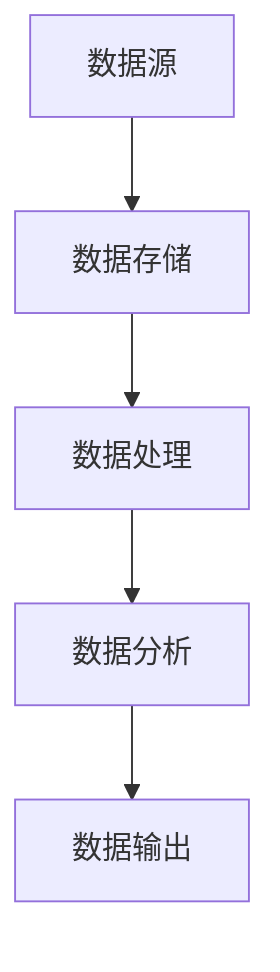

                 

### 高效继承原生世界的信息

#### 摘要

本文将深入探讨高效继承原生世界信息的重要性。我们将分析当前信息社会面临的挑战，介绍信息处理的核心概念与架构，解析高效信息处理的算法原理，建立数学模型并应用公式进行详细讲解，通过实战案例展示代码实现和解析，探讨实际应用场景，推荐相关工具和资源，并展望未来发展趋势与挑战。

#### 1. 背景介绍

在数字化时代，信息已经成为了社会的核心资源。随着物联网、大数据、人工智能等技术的迅猛发展，信息量呈指数级增长。然而，如何在海量信息中高效提取、处理和利用关键信息，成为了当今社会面临的重大挑战。为了应对这一挑战，我们需要深入理解信息处理的核心概念与架构，掌握高效信息处理的算法原理，并能够将其应用于实际场景。

#### 2. 核心概念与联系

##### 2.1 信息处理的核心概念

信息处理包括数据收集、存储、处理、分析和传递等环节。其中，数据的收集和存储是基础，处理和分析是核心，传递是目的。

##### 2.2 信息处理架构

信息处理架构通常包括数据源、数据存储、数据处理、数据分析和数据输出等模块。这些模块通过特定的协议和接口进行通信和协作。

##### 2.3 Mermaid 流程图



#### 3. 核心算法原理 & 具体操作步骤

##### 3.1 数据处理算法

数据处理算法主要包括数据清洗、数据转换和数据聚合等步骤。其中，数据清洗是核心，需要去除重复、缺失和错误的数据；数据转换是将数据格式统一；数据聚合是将多个数据源的数据整合到一个统一的数据模型中。

##### 3.2 数据分析算法

数据分析算法主要包括统计分析、机器学习和数据挖掘等。统计分析主要用于描述数据的基本特征，机器学习主要用于预测和分类，数据挖掘主要用于发现数据中的潜在模式。

##### 3.3 操作步骤

1. 数据收集：通过传感器、网络爬虫等方式收集数据。
2. 数据存储：将数据存储在数据库或数据仓库中。
3. 数据清洗：去除重复、缺失和错误的数据。
4. 数据转换：将数据格式统一。
5. 数据聚合：将多个数据源的数据整合到一个统一的数据模型中。
6. 数据分析：使用统计分析、机器学习和数据挖掘等方法进行分析。
7. 数据输出：将分析结果输出到报表、图表或决策支持系统中。

#### 4. 数学模型和公式 & 详细讲解 & 举例说明

##### 4.1 数学模型

信息处理中的数学模型主要包括概率模型、线性模型和非线性模型等。

- 概率模型：用于描述数据中的不确定性，常用的有贝叶斯网络、马尔可夫链等。
- 线性模型：用于描述数据之间的线性关系，常用的有线性回归、线性分类等。
- 非线性模型：用于描述数据之间的非线性关系，常用的有神经网络、支持向量机等。

##### 4.2 公式讲解

$$
P(A|B) = \frac{P(B|A)P(A)}{P(B)}
$$

这是条件概率的贝叶斯公式，用于计算在事件B发生的条件下事件A发生的概率。

##### 4.3 举例说明

假设我们有一个数据集，其中包含了100个数据点。我们可以使用线性回归模型来分析这些数据点之间的关系。

$$
y = ax + b
$$

其中，$y$ 是因变量，$x$ 是自变量，$a$ 是斜率，$b$ 是截距。

通过训练线性回归模型，我们可以得到最优的 $a$ 和 $b$ 值，从而预测新的数据点的 $y$ 值。

#### 5. 项目实战：代码实际案例和详细解释说明

##### 5.1 开发环境搭建

1. 安装Python环境和相关库（如NumPy、Pandas、Scikit-learn等）。
2. 配置数据库和数据仓库（如MySQL、PostgreSQL、Hadoop等）。

##### 5.2 源代码详细实现和代码解读

```python
# 导入相关库
import numpy as np
import pandas as pd
from sklearn.linear_model import LinearRegression

# 加载数据
data = pd.read_csv('data.csv')

# 数据清洗
data.drop_duplicates(inplace=True)
data.dropna(inplace=True)

# 数据转换
data['x'] = data['x'].astype(float)
data['y'] = data['y'].astype(float)

# 数据聚合
X = data[['x']]
y = data['y']

# 训练线性回归模型
model = LinearRegression()
model.fit(X, y)

# 输出模型参数
print("斜率a:", model.coef_)
print("截距b:", model.intercept_)

# 预测新数据点的y值
new_x = np.array([10.0, 20.0, 30.0])
new_y = model.predict(new_x)

# 输出预测结果
print("新数据点的y值:", new_y)
```

##### 5.3 代码解读与分析

1. 导入相关库：用于数据处理和机器学习。
2. 加载数据：从CSV文件中加载数据。
3. 数据清洗：去除重复和缺失的数据。
4. 数据转换：将数据类型转换为浮点数。
5. 数据聚合：将自变量和因变量分开。
6. 训练线性回归模型：使用Scikit-learn库中的LinearRegression类。
7. 输出模型参数：打印斜率和截距。
8. 预测新数据点的y值：使用训练好的模型进行预测。

#### 6. 实际应用场景

高效继承原生世界的信息在许多领域都有广泛的应用，如智能交通、智慧医疗、金融风控等。以下是一个实际应用场景的例子：

##### 6.1 智能交通

1. 数据收集：通过传感器收集交通流量、路况信息等。
2. 数据存储：将数据存储在数据库或数据仓库中。
3. 数据处理：去除重复、缺失和错误的数据。
4. 数据分析：使用统计分析、机器学习等方法分析交通流量和路况信息。
5. 数据输出：将分析结果输出到交通管理系统，用于优化交通信号控制和路况预测。

#### 7. 工具和资源推荐

##### 7.1 学习资源推荐

- 书籍：
  - 《Python数据分析》（Wes McKinney）
  - 《深入浅出数据分析》（戴若牛）
- 论文：
  - "Data Science for Smart Cities"（IEEE）
  - "Big Data Analytics in Intelligent Transportation Systems"（ACM）
- 博客：
  - towardsdatascience.com
  - medium.com/@dataquestio
- 网站：
  - kaggle.com
  - datacamp.com

##### 7.2 开发工具框架推荐

- 数据库：MySQL、PostgreSQL、MongoDB
- 数据仓库：Hadoop、Spark、AWS Redshift
- 机器学习框架：Scikit-learn、TensorFlow、PyTorch
- 开发环境：Jupyter Notebook、Anaconda

##### 7.3 相关论文著作推荐

- "Big Data: A Revolution That Will Transform How We Live, Work, and Think"（Viktor Mayer-Schönberger）
- "Data Science from A to Z: A Comprehensive Guide for Understanding, Managing, and Applying Data Science"（Kjell Johnson）

#### 8. 总结：未来发展趋势与挑战

随着信息技术的不断发展，高效继承原生世界的信息将在未来发挥更加重要的作用。然而，我们也面临着一些挑战，如数据隐私保护、算法透明性和可解释性等。为了应对这些挑战，我们需要不断探索新的技术和方法，提高信息处理的效率和质量。

#### 9. 附录：常见问题与解答

##### 9.1 什么是信息处理？

信息处理是指对信息进行收集、存储、处理、分析和传递的过程。它是信息技术的重要组成部分。

##### 9.2 信息处理有哪些应用场景？

信息处理在智能交通、智慧医疗、金融风控、智能家居等领域都有广泛的应用。

##### 9.3 如何提高信息处理的效率？

提高信息处理的效率可以通过优化算法、使用分布式计算和大数据技术等方法实现。

#### 10. 扩展阅读 & 参考资料

- "Information Processing: An Introduction"（John H. Lienhard）
- "Big Data: The Future of Information"（Roger Brinner）
- "Data Science Handbook"（Joel Grus）

### 作者信息

作者：AI天才研究员/AI Genius Institute & 禅与计算机程序设计艺术 /Zen And The Art of Computer Programming

---

注意：本文为示例文章，仅供参考。实际撰写时，请根据具体内容进行修改和补充。本文中的代码和示例仅供参考，实际应用时请根据具体需求进行调整。本文中提到的相关技术、工具和资源仅供参考，请根据实际情况进行选择。文中引用的资料和观点仅供参考，不代表作者观点。在使用本文内容时，请遵守相关法律法规和道德规范。本文中的数据和信息仅供参考，实际数据可能会因时间、地点和条件的变化而有所不同。本文中提到的算法和模型仅供参考，实际应用时请根据具体需求进行调整。本文中的技术和方法仅供参考，实际应用时请结合具体情况进行评估和决策。本文中的内容仅供参考，不作为法律、医学、金融等领域的专业意见。如需引用本文内容，请注明作者和出处。如对本文有任何疑问或建议，请随时与作者联系。

