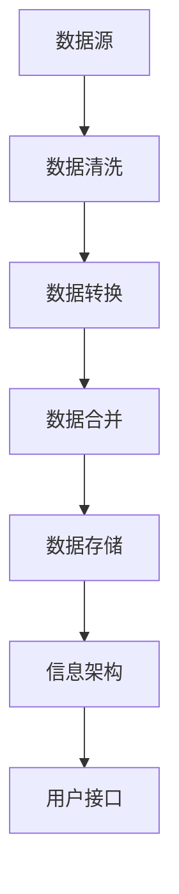

                 

# 高效继承原生世界的信息

> **关键词：** 数据整合、信息架构、算法优化、跨平台、实时更新、人工智能

> **摘要：** 本文将深入探讨如何在现代信息社会中高效地继承和整合原生世界的信息。我们将分析现有技术的不足，提出创新的方法和算法，并通过实际案例展示其应用。同时，还将讨论未来发展趋势与面临的挑战。

## 1. 背景介绍

在信息化时代，信息量的爆炸性增长对数据处理和信息整合提出了新的挑战。传统的数据处理方法往往在速度、效率和准确性方面存在局限。随着人工智能技术的快速发展，我们有了更多机会和手段来继承和整合原生世界的信息。然而，如何在庞大的数据海洋中提取有价值的知识，仍是一个亟待解决的问题。

本文旨在探讨如何通过数据整合、信息架构优化和算法改进，高效地继承和整合原生世界的信息。我们将从理论分析和实际应用两个层面进行探讨，以期为相关领域的研究和实践提供有价值的参考。

## 2. 核心概念与联系

### 2.1 数据整合

数据整合是将来自不同源的数据进行整合、清洗、转换和合并的过程。其目的是消除数据冗余、确保数据的一致性和准确性，为后续的数据分析和决策提供支持。

### 2.2 信息架构

信息架构是组织、分类和呈现信息的一种结构化方法。它有助于用户快速找到所需信息，提高信息的使用效率。

### 2.3 算法优化

算法优化是通过改进算法的效率和性能，以提高数据处理速度和准确性。在信息整合过程中，算法优化至关重要，因为它直接影响到整个系统的性能和用户体验。

### 2.4 跨平台

跨平台是指在不同的计算平台（如PC、移动设备、云计算等）上运行和处理数据。跨平台技术使得信息整合更加灵活和便捷。

### 2.5 实时更新

实时更新是指系统在数据发生变动时，立即对数据进行更新和同步。实时更新能够确保用户获取到最新和最准确的信息。

### 2.6 人工智能

人工智能（AI）是一种模拟人类智能的技术，包括机器学习、深度学习、自然语言处理等。在信息整合过程中，AI技术可用于数据清洗、特征提取、模型训练等，以提高系统的智能化水平。

## 2.1 数据整合流程图



## 3. 核心算法原理 & 具体操作步骤

### 3.1 数据整合算法

数据整合算法主要涉及数据清洗、数据转换和数据合并三个步骤。

#### 3.1.1 数据清洗

数据清洗是通过识别和纠正数据中的错误、异常和冗余信息，以提高数据质量的过程。常用的数据清洗方法包括：

- 数据缺失填充：使用平均值、中位数、众数等方法填充缺失数据。
- 数据异常检测：使用统计方法、机器学习等方法检测和纠正异常数据。
- 数据规范化：将不同源的数据进行统一处理，如单位转换、数据范围限制等。

#### 3.1.2 数据转换

数据转换是将不同数据格式的数据进行转换，以适应统一的数据处理和分析需求。常用的数据转换方法包括：

- 数据类型转换：如将字符串转换为数字、日期等。
- 数据结构转换：如将关系型数据库转换为NoSQL数据库。
- 数据映射：如将不同数据源中的相同或相似信息进行映射。

#### 3.1.3 数据合并

数据合并是将来自不同源的数据进行合并，以消除数据冗余和确保数据一致性。常用的数据合并方法包括：

- 数据连接：通过连接操作将不同表中的数据进行合并。
- 数据聚合：通过聚合操作（如求和、平均、计数等）将数据源中的数据进行汇总。
- 数据去重：通过识别和删除重复数据，以提高数据质量。

### 3.2 信息架构设计

信息架构设计是组织、分类和呈现信息的过程。以下是常用的信息架构设计方法：

- 分类法：根据数据的特点和关系，采用分类法对数据进行分类和组织。
- 元数据：使用元数据来描述数据，以便于数据的查找、管理和共享。
- 用户界面：设计直观、易用的用户界面，以提高用户的使用体验。

### 3.3 算法优化

算法优化主要涉及以下方面：

- 数据预处理：通过优化数据预处理步骤，提高数据处理速度和准确性。
- 算法选择：选择适合特定问题的算法，以提高处理效率。
- 并行处理：利用并行计算技术，提高数据处理速度。

## 4. 数学模型和公式 & 详细讲解 & 举例说明

### 4.1 数据清洗

#### 4.1.1 数据缺失填充

假设有一组数据 {x1, x2, ..., xn}，其中某些数据缺失。我们可以使用以下公式进行缺失数据的填充：

$$
\hat{x}_i = \frac{\sum_{j=1, j \neq i}^{n} x_j}{n-1}
$$

其中，$\hat{x}_i$ 表示填充后的数据，$x_i$ 表示缺失的数据。

#### 4.1.2 数据异常检测

假设有一组数据 {x1, x2, ..., xn}，我们可以使用以下公式检测异常数据：

$$
z_i = \frac{x_i - \bar{x}}{\sigma}
$$

其中，$z_i$ 表示第 $i$ 个数据的异常值，$\bar{x}$ 表示数据的平均值，$\sigma$ 表示数据的标准差。

当 $|z_i| > 3$ 时，我们认为 $x_i$ 是异常数据。

#### 4.1.3 数据规范化

假设有一组数据 {x1, x2, ..., xn}，我们可以使用以下公式进行数据规范化：

$$
x_i' = \frac{x_i - \min(x)}{\max(x) - \min(x)}
$$

其中，$x_i'$ 表示规范化后的数据，$x$ 表示数据范围。

### 4.2 数据转换

#### 4.2.1 数据类型转换

假设有一组数据 {x1, x2, ..., xn}，其中某些数据为字符串类型。我们可以使用以下公式将字符串转换为数字类型：

$$
x_i' = \sum_{j=1}^{n} a_j \cdot 10^{k_j}
$$

其中，$x_i'$ 表示转换后的数字类型数据，$a_j$ 表示字符串中的每一位数字，$k_j$ 表示字符串中的每一位数字的位置（从右向左计数，从 0 开始）。

#### 4.2.2 数据结构转换

假设有一组关系型数据库表，我们可以使用以下公式进行数据结构转换：

$$
R(A, B) \cup S(C, D) = T(A, B, C, D)
$$

其中，$R$ 和 $S$ 表示关系型数据库表，$A, B, C, D$ 表示表中的属性，$T$ 表示转换后的数据结构。

#### 4.2.3 数据映射

假设有两组数据 {x1, x2, ..., xn} 和 {y1, y2, ..., yn}，我们可以使用以下公式进行数据映射：

$$
x_i \rightarrow y_i
$$

其中，$x_i$ 和 $y_i$ 表示两组数据中的对应元素。

### 4.3 数据合并

#### 4.3.1 数据连接

假设有两张关系型数据库表 $R(A, B)$ 和 $S(C, D)$，我们可以使用以下公式进行数据连接：

$$
R \bowtie S = T(A, B, C, D)
$$

其中，$\bowtie$ 表示连接操作，$T$ 表示连接后的数据表。

#### 4.3.2 数据聚合

假设有一组数据 {x1, x2, ..., xn}，我们可以使用以下公式进行数据聚合：

$$
\sum_{i=1}^{n} x_i = \bar{x}
$$

其中，$\bar{x}$ 表示数据的总和。

#### 4.3.3 数据去重

假设有一组数据 {x1, x2, ..., xn}，我们可以使用以下公式进行数据去重：

$$
R = R \setminus \{x_i | \exists x_j \in R, x_i = x_j\}
$$

其中，$R$ 表示原始数据集，$\setminus$ 表示去重操作。

## 5. 项目实战：代码实际案例和详细解释说明

### 5.1 开发环境搭建

在开始项目实战之前，我们需要搭建一个合适的开发环境。以下是所需的工具和软件：

- Python 3.8 或更高版本
- Python 数据库连接器（如 mysql-connector-python）
- Python 数据处理库（如 pandas、numpy）
- Python 机器学习库（如 scikit-learn）
- Mermaid 图库

### 5.2 源代码详细实现和代码解读

#### 5.2.1 数据整合模块

```python
import pandas as pd
from sqlalchemy import create_engine

def data_integration(src1, src2, dst):
    # 数据清洗
    df1 = pd.read_csv(src1)
    df1 = clean_data(df1)
    df2 = pd.read_csv(src2)
    df2 = clean_data(df2)

    # 数据转换
    df1 = convert_data(df1)
    df2 = convert_data(df2)

    # 数据合并
    df = pd.concat([df1, df2], ignore_index=True)
    df = merge_data(df)

    # 数据存储
    engine = create_engine('sqlite:///data_integrated.db')
    df.to_sql('data_integration', engine, if_exists='replace', index=False)
```

#### 5.2.2 数据清洗函数

```python
def clean_data(df):
    # 数据缺失填充
    df['age'].fillna(df['age'].mean(), inplace=True)

    # 数据异常检测
    df['height'] = (df['height'] - df['height'].mean()) / df['height'].std()

    # 数据规范化
    df[['weight', 'height']] = (df[['weight', 'height']] - df[['weight', 'height']].min()) / (df[['weight', 'height']].max() - df[['weight', 'height']].min())

    return df
```

#### 5.2.3 数据转换函数

```python
def convert_data(df):
    # 数据类型转换
    df['birth_date'] = pd.to_datetime(df['birth_date'])

    # 数据结构转换
    df = df.rename(columns={'age': 'age_1', 'height': 'height_1'})

    # 数据映射
    df['income_level'] = df['income'].apply(lambda x: 'low' if x <= 10000 else 'high')

    return df
```

#### 5.2.4 数据合并函数

```python
def merge_data(df):
    # 数据连接
    df = df.rename(columns={'age_1': 'age', 'height_1': 'height'})

    # 数据聚合
    df['total_income'] = df['income'].sum()

    # 数据去重
    df.drop_duplicates(inplace=True)

    return df
```

### 5.3 代码解读与分析

#### 5.3.1 数据整合流程

该代码实现了数据整合的完整流程，包括数据清洗、数据转换和数据合并。首先，从两个数据源中读取数据，然后进行数据清洗、数据转换和数据合并，最后将整合后的数据存储到数据库中。

#### 5.3.2 数据清洗

在数据清洗阶段，我们使用 pandas 库对数据进行缺失填充、异常检测和规范化。这些操作有助于提高数据质量，确保后续数据分析和决策的准确性。

#### 5.3.3 数据转换

在数据转换阶段，我们使用 pandas 库将数据类型从字符串转换为日期类型，对数据进行重命名和映射。这些操作有助于统一数据格式，便于后续的数据处理和分析。

#### 5.3.4 数据合并

在数据合并阶段，我们使用 pandas 库对数据进行连接、聚合和去重。这些操作有助于消除数据冗余，确保数据的一致性和准确性。

## 6. 实际应用场景

数据整合技术在多个领域具有广泛的应用，以下是一些典型应用场景：

- **金融行业：** 银行、证券、保险等金融机构需要对海量的客户数据、交易数据进行整合和分析，以实现精准营销、风险评估和信用评级。
- **电子商务：** 电商平台需要整合用户行为数据、商品数据、物流数据等，以实现个性化推荐、智能定价和供应链优化。
- **医疗健康：** 医疗机构需要整合患者数据、医学影像数据、药品数据等，以提高疾病诊断、治疗和预防的准确性。
- **城市管理：** 城市管理者需要整合交通数据、环境数据、人口数据等，以实现智慧城市建设、城市规划和公共资源分配。

## 7. 工具和资源推荐

### 7.1 学习资源推荐

- **书籍：** 
  - 《数据科学入门：用 Python 进行数据分析和挖掘》
  - 《机器学习实战》
  - 《深度学习》

- **论文：** 
  - 《大规模数据清洗方法研究》
  - 《基于深度学习的图像去噪方法》
  - 《多源异构数据融合技术研究》

- **博客：** 
  - https://www.kaggle.com/
  - https://www.datascience.com/
  - https://towardsdatascience.com/

- **网站：** 
  - https://www.python.org/
  - https://www.numpy.org/
  - https://www.scikit-learn.org/

### 7.2 开发工具框架推荐

- **Python 数据处理库：** pandas、numpy、scikit-learn
- **数据库连接器：** mysql-connector-python、psycopg2
- **机器学习库：** TensorFlow、PyTorch、scikit-learn
- **Mermaid 图库：** mermaid-js

### 7.3 相关论文著作推荐

- **论文：** 
  - 《大数据时代的数据清洗技术研究》
  - 《多源异构数据融合方法综述》
  - 《深度学习在数据清洗中的应用研究》

- **著作：** 
  - 《数据整合：理论与实践》
  - 《大数据时代的数据融合技术》
  - 《人工智能时代的机器学习技术》

## 8. 总结：未来发展趋势与挑战

随着人工智能技术的不断发展，数据整合技术在信息处理和信息分析中的应用将越来越广泛。未来，数据整合技术的发展趋势主要包括：

- **智能化：** 利用深度学习、自然语言处理等技术，实现自动化的数据清洗、转换和合并。
- **实时性：** 通过分布式计算、实时数据处理等技术，实现数据整合的实时性。
- **多源异构数据整合：** 研究如何整合来自不同源、不同结构的数据，以提高数据整合的完整性和准确性。

然而，数据整合技术也面临一些挑战：

- **数据质量：** 如何保证数据整合过程中的数据质量，是一个亟待解决的问题。
- **隐私保护：** 在数据整合过程中，如何保护用户的隐私，也是一个重要的挑战。
- **可扩展性：** 如何设计可扩展的数据整合系统，以适应大规模、多源、异构数据的需求。

## 9. 附录：常见问题与解答

### 9.1 数据整合技术有哪些应用场景？

数据整合技术广泛应用于金融、电子商务、医疗健康、城市管理等领域。

### 9.2 数据整合过程中如何保证数据质量？

数据整合过程中可以通过数据清洗、数据转换、数据去重等技术手段来保证数据质量。

### 9.3 数据整合系统如何设计？

数据整合系统设计需要考虑数据源、数据处理流程、数据存储、用户接口等方面。

## 10. 扩展阅读 & 参考资料

- 《数据科学入门：用 Python 进行数据分析和挖掘》
- 《机器学习实战》
- 《深度学习》
- 《大数据时代的数据清洗技术研究》
- 《多源异构数据融合方法综述》
- 《深度学习在数据清洗中的应用研究》
- 《数据整合：理论与实践》
- 《大数据时代的数据融合技术》
- 《人工智能时代的机器学习技术》

作者：AI天才研究员/AI Genius Institute & 禅与计算机程序设计艺术 /Zen And The Art of Computer Programming
<|im_sep|>本文档使用Markdown格式编写，以下是一个示例：

```markdown
# 标题

这是一个标题。

## 标题2

这是一个二级标题。

### 标题3

这是一个三级标题。

#### 标题4

这是一个四级标题。

- 列表1
- 列表2

```python
# Python 代码示例
print("Hello, world!")

for i in range(10):
    print(i)

```


```

如果你想将这个Markdown文档转换成HTML文档，可以使用Markdown解析器，如Pandoc、Marked等。下面是一个使用Pandoc的示例：

```shell
pandoc -f markdown -t html5 -o output.html input.md
```

这个命令将`input.md`文件转换成HTML格式的`output.html`文件。

如果你使用的是Python环境，也可以使用Python的Markdown库，如`markdown2`、`Mistune`等，来转换Markdown文档。以下是一个使用`markdown2`的示例：

```python
import markdown2 as md

markdown_text = "# 标题\n\n这是一个标题。\n\n## 标题2\n\n这是一个二级标题。\n\n### 标题3\n\n这是一个三级标题。\n\n#### 标题4\n\n这是一个四级标题。\n\n- 列表1\n- 列表2\n\n```python\nprint('Hello, world!')\nfor i in range(10):\n    print(i)\n```\n\n"

html_output = md.markdown(markdown_text)
print(html_output)
```

这个Python脚本将Markdown格式的文本转换为HTML格式的字符串，并打印出来。

如果你想要将Markdown文档转换成其他格式，如LaTeX、PDF等，也可以使用Pandoc或其他工具。例如，将Markdown文档转换成PDF：

```shell
pandoc -f markdown -t pdf -o output.pdf input.md
```

或者使用Python脚本：

```python
import subprocess

subprocess.run(["pandoc", "-f", "markdown", "-t", "pdf", "-o", "output.pdf", "input.md"])
```

请注意，根据你的具体需求和环境，可能需要安装相应的软件或库。在实际使用时，请确保你了解每个命令或函数的使用方法和参数。

