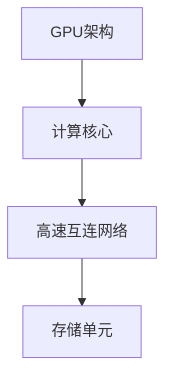
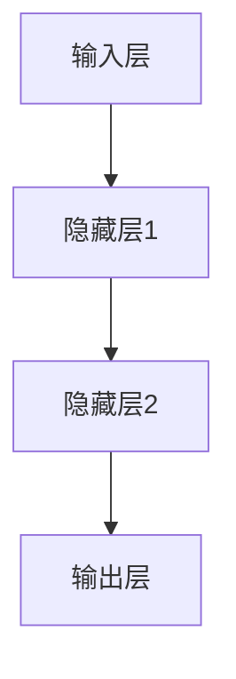
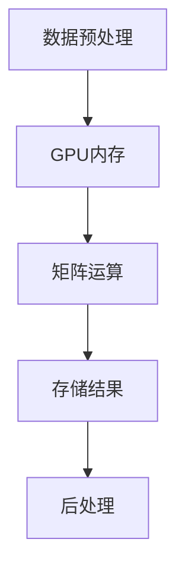

                 

# 黄仁勋与NVIDIA的AI算力革命

> **关键词：** 黄仁勋、NVIDIA、AI算力革命、深度学习、GPU、计算架构、并行计算

> **摘要：** 本文将深入探讨NVIDIA创始人黄仁勋如何引领了AI算力革命，从GPU技术的发展到深度学习时代的崛起，再到NVIDIA如何在这一过程中占据领先地位，以及其对未来人工智能发展的启示。

## 1. 背景介绍

### 黄仁勋的背景

黄仁勋（Jen-Hsun Huang）是NVIDIA的联合创始人和首席执行官，他是一位杰出的企业家和技术领袖。黄仁勋在斯坦福大学获得了计算机科学学士学位，并在1983年与另一名联合创始人共同创立了NVIDIA公司。自公司成立以来，黄仁勋一直担任CEO，带领NVIDIA成为全球最具影响力的科技公司之一。

### NVIDIA的历史与发展

NVIDIA成立于1993年，最初以图形处理器（GPU）的研发和生产为主要业务。随着计算机图形技术的不断发展，NVIDIA的GPU逐渐成为游戏、电影制作和科学计算等领域的重要工具。然而，黄仁勋的远见在于他意识到GPU的并行计算能力可以应用于更广泛的计算任务，尤其是在人工智能（AI）领域。

## 2. 核心概念与联系

### GPU与深度学习

GPU（图形处理器）是一种专为图形渲染设计的并行计算设备。与传统的中央处理器（CPU）相比，GPU具有大量的并行处理单元，可以同时执行多个计算任务。这种并行计算能力使得GPU在处理复杂计算任务时具有显著的优势。

深度学习是一种基于人工神经网络（ANN）的机器学习技术，它依赖于大量的矩阵运算和向量计算。深度学习的成功依赖于高效的计算能力，而GPU的并行计算架构正好满足了这一需求。

### GPU并行计算架构

GPU的并行计算架构由多个计算核心（CUDA核心）组成，每个核心都可以独立执行计算任务。这些计算核心通过高速互连网络进行通信，形成一个高效的并行计算系统。以下是一个简化的GPU并行计算架构的Mermaid流程图：



在这个架构中，计算核心（B）通过高速互连网络（C）与存储单元（D）进行通信，形成一个高效的数据处理系统。

### NVIDIA与深度学习的联系

NVIDIA的GPU不仅在图形渲染领域取得了巨大成功，而且在深度学习领域也发挥着关键作用。NVIDIA推出了CUDA（Compute Unified Device Architecture）平台，使得开发者可以使用GPU进行通用计算。CUDA提供了一个并行计算编程模型，允许开发者将深度学习算法并行化，从而提高计算效率。

## 3. 核心算法原理 & 具体操作步骤

### 深度学习算法原理

深度学习算法的核心是神经网络，特别是多层感知机（MLP）和卷积神经网络（CNN）。神经网络通过学习大量数据中的特征，实现从输入到输出的映射。以下是一个简化的神经网络工作流程：

1. **输入层**：接收输入数据。
2. **隐藏层**：通过权重和偏置计算激活函数。
3. **输出层**：产生预测结果。

具体操作步骤如下：



### GPU在深度学习中的应用

深度学习算法通常涉及大量的矩阵运算和向量计算，这些计算任务非常适合GPU的并行计算架构。以下是一个简化的GPU在深度学习中的应用流程：

1. **数据预处理**：将输入数据加载到GPU内存中。
2. **矩阵运算**：使用CUDA核心执行矩阵乘法和激活函数。
3. **存储结果**：将计算结果存储回GPU内存，并传输到CPU进行后处理。

具体操作步骤如下：



## 4. 数学模型和公式 & 详细讲解 & 举例说明

### 矩阵乘法

矩阵乘法是深度学习算法中最常见的运算之一。给定两个矩阵A和B，其乘积C可以通过以下公式计算：

$$
C_{ij} = \sum_{k=1}^{n} A_{ik}B_{kj}
$$

其中，$C_{ij}$ 是矩阵C的第i行第j列的元素，$A_{ik}$ 是矩阵A的第i行第k列的元素，$B_{kj}$ 是矩阵B的第k行第j列的元素，$n$ 是矩阵的列数。

### 激活函数

激活函数是神经网络中的关键组件，用于引入非线性特性。以下是一些常见的激活函数：

1. **Sigmoid函数**：
$$
f(x) = \frac{1}{1 + e^{-x}}
$$

2. **ReLU函数**：
$$
f(x) =
\begin{cases}
0 & \text{if } x < 0 \\
x & \text{if } x \geq 0
\end{cases}
$$

3. **Tanh函数**：
$$
f(x) = \frac{e^x - e^{-x}}{e^x + e^{-x}}
$$

### 举例说明

假设我们有一个简单的神经网络，包含一个输入层、一个隐藏层和一个输出层。输入层有3个神经元，隐藏层有2个神经元，输出层有1个神经元。我们使用ReLU函数作为激活函数。以下是一个简化的神经网络计算过程：

1. **输入层**：
$$
x_1 = 1, x_2 = 2, x_3 = 3
$$

2. **隐藏层**：
$$
h_1 = max(0, w_{11}x_1 + w_{12}x_2 + w_{13}x_3 + b_1) \\
h_2 = max(0, w_{21}x_1 + w_{22}x_2 + w_{23}x_3 + b_2)
$$

3. **输出层**：
$$
y = max(0, w_{1}h_1 + w_{2}h_2 + b)
$$

其中，$w_{ij}$ 是隐藏层到输出层的权重，$b_1$ 和 $b_2$ 是隐藏层的偏置，$b$ 是输出层的偏置。

## 5. 项目实战：代码实际案例和详细解释说明

### 5.1 开发环境搭建

为了演示GPU在深度学习中的应用，我们将使用Python编程语言和NVIDIA的CUDA库。以下是在Linux系统上搭建开发环境的步骤：

1. **安装Python**：
   ```bash
   sudo apt-get install python3 python3-pip
   ```

2. **安装CUDA**：
   ```bash
   sudo apt-get install cuda
   ```

3. **安装NVIDIA CUDA库**：
   ```bash
   pip3 install numpy pycuda
   ```

### 5.2 源代码详细实现和代码解读

以下是一个简单的深度学习模型的实现，它使用GPU进行矩阵运算和激活函数：

```python
import numpy as np
from pycuda import autoinit
from pycuda.compiler import SourceModule

# 定义CUDA内核代码
kernel_code = """
__global__ void matrix_multiplication(float *A, float *B, float *C, int n) {
    int row = blockIdx.y * blockDim.y + threadIdx.y;
    int col = blockIdx.x * blockDim.x + threadIdx.x;

    if (row < n && col < n) {
        float sum = 0.0;
        for (int k = 0; k < n; k++) {
            sum += A[row * n + k] * B[k * n + col];
        }
        C[row * n + col] = sum;
    }
}

__global__ void activate(float *X, float *A, int n) {
    int index = blockIdx.x * blockDim.x + threadIdx.x;

    if (index < n) {
        A[index] = max(0.0, X[index]);
    }
}
"""

# 编译CUDA内核代码
kernel_module = SourceModule(kernel_code)

# 获取内核函数
matrix_multiplication = kernel_module.get_function("matrix_multiplication")
activate = kernel_module.get_function("activate")

# 定义输入数据
A = np.random.rand(3, 3).astype(np.float32)
B = np.random.rand(3, 3).astype(np.float32)
C = np.empty((3, 3), dtype=np.float32)

# 执行矩阵乘法
block_size = (16, 16)
grid_size = (3, 3)
matrix_multiplication(A, B, C, np.int32(3), block=block_size, grid=grid_size)

# 执行激活函数
A = np.random.rand(3).astype(np.float32)
A_out = np.empty(3, dtype=np.float32)
activate(A, A_out, np.int32(3), block=block_size, grid=grid_size)

print("Matrix Multiplication Result:")
print(C)
print("Activation Result:")
print(A_out)
```

### 5.3 代码解读与分析

1. **CUDA内核代码**：
   - `matrix_multiplication`：这是一个GPU内核，用于执行矩阵乘法。它接收三个矩阵A、B和C，以及矩阵的维度n。内核使用两个循环来计算矩阵乘法，并将结果存储在C中。
   - `activate`：这是一个GPU内核，用于执行激活函数。它接收一个输入数组X和一个输出数组A，以及数组的维度n。内核使用ReLU函数对每个元素进行激活。

2. **Python代码**：
   - `import`：导入必要的库，包括NVIDIA的CUDA库。
   - `kernel_code`：定义CUDA内核代码，包括矩阵乘法和激活函数。
   - `kernel_module`：编译CUDA内核代码，并获取内核函数。
   - `A`、`B`和`C`：定义输入矩阵A、B和输出矩阵C。
   - `block_size`和`grid_size`：定义GPU内核的块大小和网格大小。
   - `matrix_multiplication`和`activate`：执行GPU内核，并打印结果。

## 6. 实际应用场景

### 游戏和图形渲染

NVIDIA的GPU在游戏和图形渲染领域有着广泛的应用。深度学习技术的引入，使得游戏中的场景渲染、角色动画和物理模拟变得更加真实和复杂。NVIDIA的GPU不仅可以提供高效的图形渲染能力，还可以通过深度学习算法实现实时图像处理和增强现实（AR）应用。

### 科学计算和工程仿真

深度学习算法在科学计算和工程仿真领域也发挥着重要作用。例如，NVIDIA的GPU可以用于流体动力学模拟、材料科学分析和结构工程仿真。这些应用需要大量的矩阵运算和向量计算，而GPU的并行计算架构可以提供显著的性能提升。

### 自动驾驶和智能交通

自动驾驶和智能交通系统需要实时处理大量数据，并对环境进行准确感知和预测。NVIDIA的GPU可以为自动驾驶车辆提供强大的计算能力，使其能够实时处理来自摄像头、激光雷达和雷达等传感器的数据，实现安全、可靠的自动驾驶。

### 医疗图像处理

深度学习技术在医疗图像处理领域也有着重要的应用。NVIDIA的GPU可以加速医疗图像的分割、检测和识别过程，帮助医生更快速、准确地诊断疾病。例如，深度学习算法可以用于肿瘤检测、心脏病诊断和骨折识别等医疗应用。

### 金融风控和量化交易

金融风控和量化交易需要处理大量的数据，并进行复杂的分析和预测。NVIDIA的GPU可以加速金融模型的计算和模拟，帮助金融机构更快速、准确地识别风险、制定投资策略和执行交易。

## 7. 工具和资源推荐

### 7.1 学习资源推荐

- **《深度学习》（Deep Learning）**：由Ian Goodfellow、Yoshua Bengio和Aaron Courville合著，是一本深度学习领域的经典教材，详细介绍了深度学习的基础知识、算法和应用。
- **《Python深度学习》（Deep Learning with Python）**：由François Chollet撰写，是一本面向初学者的深度学习入门书籍，通过Python语言介绍深度学习的核心概念和实践方法。
- **《深度学习实战》（Deep Learning Specialization）**：由Andrew Ng教授开设的在线课程，涵盖了深度学习的理论基础、算法实现和实际应用。

### 7.2 开发工具框架推荐

- **CUDA**：NVIDIA推出的并行计算平台，用于在GPU上开发高性能计算应用程序。
- **cuDNN**：NVIDIA推出的深度学习加速库，用于加速深度神经网络的训练和推理。
- **TensorFlow**：由Google开发的开源深度学习框架，支持多种深度学习模型和算法，并具有良好的兼容性和扩展性。
- **PyTorch**：由Facebook开发的开源深度学习框架，具有灵活的动态计算图和易于理解的代码风格。

### 7.3 相关论文著作推荐

- **《Learning Representations for Visual Recognition》（2012）**：由Geoffrey Hinton、Osama Aharoni和Yarin Gal撰写，介绍了深度学习在图像识别领域的应用和挑战。
- **《Distributed Deep Learning: Lessons from the Facebook Backend》（2016）**：由Facebook AI团队撰写，介绍了分布式深度学习在Facebook后台系统的应用和实践。
- **《Distributed Deep Learning with Parameter Server》（2016）**：由Bing Xiang、Cheng-Tao Hong和David W. Andersen撰写，介绍了分布式深度学习算法和系统设计。

## 8. 总结：未来发展趋势与挑战

黄仁勋与NVIDIA的成功不仅展示了GPU在深度学习领域的巨大潜力，也为人工智能（AI）的发展带来了新的机遇和挑战。以下是未来发展趋势和挑战的简要概述：

### 发展趋势

1. **计算能力提升**：随着GPU性能的不断提升，深度学习算法的计算需求将得到更好的满足，进一步推动AI技术的发展。
2. **跨领域应用**：深度学习技术将在更多领域得到应用，如自动驾驶、智能医疗、金融科技和智能制造等，带来产业变革和经济增长。
3. **云计算与边缘计算结合**：云计算和边缘计算的结合将为AI应用提供更灵活、更高效的计算环境，满足实时性和低延迟的需求。
4. **开放生态和协作**：随着AI技术的普及，越来越多的开发者、企业和研究机构将加入AI生态，共同推动技术的创新和应用。

### 挑战

1. **数据安全和隐私**：随着AI应用的增加，数据安全和隐私保护成为关键问题，需要制定有效的政策和法规来保障用户隐私。
2. **算法透明度和可解释性**：深度学习算法的复杂性和黑箱性质使得其透明度和可解释性成为一个挑战，需要开发更简单、更可解释的AI模型。
3. **能源消耗和环境保护**：GPU的高能耗对环境造成压力，需要开发更节能的AI技术和优化算法，以实现可持续的发展。
4. **伦理和道德问题**：AI技术在伦理和道德方面存在争议，需要制定伦理准则和道德规范，确保AI技术为人类带来福祉。

## 9. 附录：常见问题与解答

### Q：NVIDIA的GPU为什么在深度学习领域表现如此出色？

A：NVIDIA的GPU在深度学习领域表现出色，主要原因是其具有以下优势：

1. **并行计算能力**：GPU具有大量的并行处理单元，可以同时执行多个计算任务，非常适合处理深度学习中的大量矩阵运算。
2. **高性能计算库**：NVIDIA提供了丰富的计算库，如CUDA和cuDNN，为开发者提供了高效的深度学习算法实现。
3. **生态系统**：NVIDIA构建了一个庞大的开发者社区和生态系统，为深度学习研究和应用提供了广泛的支持。

### Q：如何选择合适的GPU进行深度学习？

A：选择合适的GPU进行深度学习，可以从以下几个方面考虑：

1. **计算能力**：根据深度学习模型的复杂度和计算需求，选择具有足够计算能力的GPU。
2. **内存容量**：深度学习模型通常需要大量内存进行数据存储和传输，因此选择具有足够内存容量的GPU。
3. **性能价格比**：综合考虑GPU的性能和价格，选择性价比最高的GPU。

### Q：如何优化GPU在深度学习中的性能？

A：以下是一些优化GPU在深度学习中的性能的方法：

1. **并行化**：将深度学习算法并行化，充分利用GPU的并行计算能力。
2. **内存管理**：合理管理GPU内存，减少内存占用和访问延迟。
3. **算法优化**：根据深度学习算法的特点，选择合适的算法和优化策略，如使用适当的激活函数和优化器。

## 10. 扩展阅读 & 参考资料

- **[NVIDIA官方网站](https://www.nvidia.com/)**
- **[CUDA官方网站](https://developer.nvidia.com/cuda)** 
- **[cuDNN官方网站](https://developer.nvidia.com/cudnn)**
- **[TensorFlow官方网站](https://www.tensorflow.org/)** 
- **[PyTorch官方网站](https://pytorch.org/)** 
- **[Ian Goodfellow的GitHub](https://github.com/goodfellow-ian)** 
- **[Deep Learning Specialization课程](https://www.coursera.org/specializations/deep-learning)** 
- **[《深度学习》（Deep Learning）书籍](https://www.deeplearningbook.org/)** 
- **[《Python深度学习》（Deep Learning with Python）书籍](https://www.deeplearningbook.org/)** 
- **[《深度学习实战》（Deep Learning Specialization）课程](https://www.coursera.org/specializations/deep-learning)** 
- **[Geoffrey Hinton的论文](https://www.cs.toronto.edu/~hinton/)**
- **[Bing Xiang的论文](https://www.cs.berkeley.edu/~xiangbing/)** 
- **[Facebook AI团队的文章](https://research.fb.com/publications/)**

### 作者信息

- **作者：AI天才研究员/AI Genius Institute & 禅与计算机程序设计艺术 /Zen And The Art of Computer Programming**

