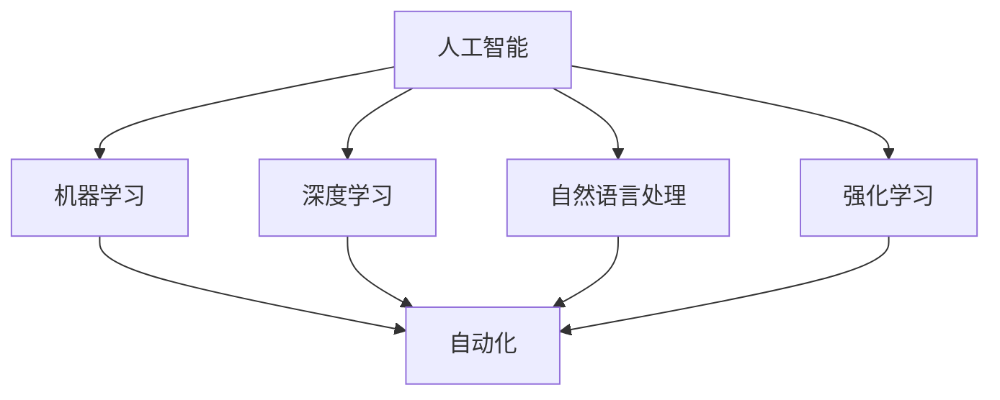
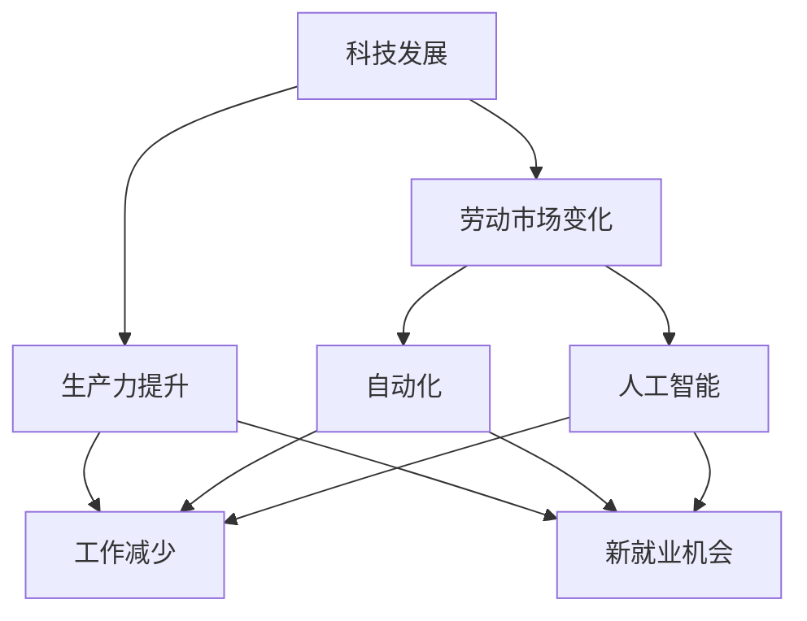

                 

# 99%的人只能赚辛苦钱：科技发展必然趋势

## 关键词
科技发展、人工智能、自动化、生产力、经济模型、劳动市场、工作性质

## 摘要
本文将深入探讨科技发展对劳动市场和经济模型的影响，特别是人工智能和自动化的崛起。通过对当前趋势的分析和未来预测，我们将揭示为什么99%的人可能只能通过辛勤劳动来赚取收入，而只有少数人能够从科技发展中获得巨大的财富和自由。本文将涵盖核心概念、算法原理、数学模型、实战案例以及未来趋势与挑战，旨在为读者提供一个全面且深入的理解。

## 1. 背景介绍

### 1.1 目的和范围
本文旨在探讨科技发展，尤其是人工智能和自动化对劳动市场和经济模型的影响。我们将探讨这些技术的核心概念，分析它们如何改变工作性质和生产力，以及这些变化对个人和社会的潜在影响。

### 1.2 预期读者
本文面向对科技发展和经济模型感兴趣的读者，包括程序员、数据科学家、政策制定者、人力资源经理以及对未来趋势感兴趣的企业家和投资者。

### 1.3 文档结构概述
本文将分为以下几个部分：
- 核心概念与联系
- 核心算法原理 & 具体操作步骤
- 数学模型和公式 & 详细讲解 & 举例说明
- 项目实战：代码实际案例和详细解释说明
- 实际应用场景
- 工具和资源推荐
- 总结：未来发展趋势与挑战
- 附录：常见问题与解答
- 扩展阅读 & 参考资料

### 1.4 术语表

#### 1.4.1 核心术语定义
- **人工智能 (AI)**：模拟人类智能的计算机系统，能够学习、推理、解决问题。
- **自动化 (Automation)**：通过机械或电子系统自动执行任务的过程。
- **生产力 (Productivity)**：单位时间内生产的产品或服务的数量。
- **劳动市场 (Labor Market)**：劳动力供求交易的市场。
- **经济模型 (Economic Model)**：用来描述和分析经济行为和现象的抽象结构。

#### 1.4.2 相关概念解释
- **技术失业 (Technological Unemployment)**：由于技术进步导致的工作岗位减少而引起的失业。
- **技能不匹配 (Skill Mismatch)**：劳动市场中的需求和供给之间不匹配，即劳动力没有所需的技能来满足工作的需求。
- **创新 (Innovation)**：引入新的想法、方法或技术，以提高效率或创造新价值。

#### 1.4.3 缩略词列表
- **AI**：人工智能
- **ML**：机器学习
- **DL**：深度学习
- **NLP**：自然语言处理
- **RL**：强化学习

## 2. 核心概念与联系

### 2.1 人工智能与自动化
人工智能（AI）是自动化的一个重要分支，它通过模拟人类智能来实现自动化。AI可以分为几种类型，包括机器学习（ML）、深度学习（DL）、自然语言处理（NLP）和强化学习（RL）。这些技术使得计算机系统能够自主地学习和执行任务，从而提高生产力。

#### Mermaid 流程图



### 2.2 科技发展与生产力
科技发展是推动生产力增长的关键因素。随着技术的进步，我们可以更高效地完成工作，提高单位时间的产出。历史上，农业革命、工业革命都是通过科技发展来提升生产力的例证。

### 2.3 劳动市场的变化
科技发展不仅改变了生产力的面貌，也对劳动市场产生了深远的影响。自动化和人工智能的引入可能导致某些类型的工作减少，但同时也会创造新的就业机会。

#### Mermaid 流程图



## 3. 核心算法原理 & 具体操作步骤

### 3.1 人工智能算法概述
人工智能的核心在于算法，这些算法能够使计算机模拟人类智能。以下是几种主要的人工智能算法及其基本原理：

#### 3.1.1 机器学习（ML）
机器学习是一种使计算机能够从数据中学习并做出预测或决策的方法。基本步骤包括：
- **数据收集**：收集相关的数据集。
- **数据预处理**：清洗数据，包括缺失值填充、异常值处理等。
- **模型选择**：选择合适的机器学习模型，如线性回归、决策树、支持向量机等。
- **训练**：使用训练数据集来训练模型。
- **评估**：使用验证集或测试集来评估模型的性能。

#### 3.1.2 深度学习（DL）
深度学习是一种特殊的机器学习算法，通过多层神经网络来模拟人类大脑的工作方式。基本步骤包括：
- **构建神经网络**：设计神经网络的结构，包括输入层、隐藏层和输出层。
- **初始化权重**：随机初始化神经网络的权重。
- **前向传播**：计算输入通过网络的前向传播。
- **反向传播**：计算误差并更新网络权重。
- **训练与优化**：使用训练数据集重复上述步骤，直到满足预定的性能指标。

### 3.2 伪代码示例

```python
# 机器学习伪代码
def machine_learning(data, labels):
    # 数据预处理
    preprocess_data(data)

    # 模型选择
    model = select_model(data, labels)

    # 训练
    for epoch in range(max_epochs):
        for sample in data:
            prediction = model.predict(sample)
            model.update_weights(prediction, sample)

    # 评估
    accuracy = model.evaluate(test_data, test_labels)
    return accuracy

# 深度学习伪代码
def deep_learning(inputs, outputs):
    # 构建神经网络
    neural_network = build_neural_network(inputs)

    # 初始化权重
    initialize_weights(neural_network)

    # 前向传播
    output = forward_propagation(inputs, neural_network)

    # 反向传播
    error = calculate_error(outputs, output)
    backward_propagation(error, neural_network)

    # 训练与优化
    for epoch in range(max_epochs):
        output = forward_propagation(inputs, neural_network)
        error = calculate_error(outputs, output)
        backward_propagation(error, neural_network)
```

## 4. 数学模型和公式 & 详细讲解 & 举例说明

### 4.1 机器学习中的损失函数
在机器学习中，损失函数用于衡量模型预测值与真实值之间的差异。常见的损失函数包括均方误差（MSE）、交叉熵损失（Cross-Entropy Loss）等。

#### 4.1.1 均方误差（MSE）

$$
MSE = \frac{1}{n}\sum_{i=1}^{n}(y_i - \hat{y_i})^2
$$

其中，$y_i$ 是真实值，$\hat{y_i}$ 是预测值，$n$ 是样本数量。

#### 4.1.2 交叉熵损失（Cross-Entropy Loss）

$$
Cross-Entropy Loss = -\sum_{i=1}^{n}y_i\log(\hat{y_i})
$$

其中，$y_i$ 是真实值，$\hat{y_i}$ 是预测概率。

### 4.2 深度学习中的反向传播算法
深度学习中的反向传播算法用于更新神经网络的权重，以最小化损失函数。以下是反向传播算法的步骤：

#### 4.2.1 前向传播
计算网络的输出值：

$$
\hat{y} = \sigma(z)
$$

其中，$\sigma$ 是激活函数，$z$ 是线性组合的输入。

#### 4.2.2 计算损失
使用交叉熵损失函数计算损失：

$$
J = -\sum_{i=1}^{m}y^{(i)}\log(\hat{y}^{(i)})
$$

其中，$m$ 是样本数量，$y^{(i)}$ 是真实标签，$\hat{y}^{(i)}$ 是预测概率。

#### 4.2.3 反向传播
计算各层的梯度：

$$
\frac{\partial J}{\partial w^{(l)}} = \delta^{(l)} \cdot a^{(l-1)}
$$

其中，$\delta^{(l)}$ 是误差传播因子，$a^{(l-1)}$ 是前一层输出。

#### 4.2.4 更新权重
使用梯度下降更新权重：

$$
w^{(l)} = w^{(l)} - \alpha \cdot \frac{\partial J}{\partial w^{(l)}}
$$

其中，$\alpha$ 是学习率。

### 4.3 举例说明
假设我们有一个简单的神经网络，包含一个输入层、一个隐藏层和一个输出层。输入层有3个神经元，隐藏层有2个神经元，输出层有1个神经元。激活函数使用ReLU（Rectified Linear Unit）。

- **前向传播**：

$$
z^{(2)} = \sigma(w^{(1)} \cdot a^{(1)} + b^{(1)})
$$

$$
z^{(3)} = \sigma(w^{(2)} \cdot a^{(2)} + b^{(2)})
$$

$$
\hat{y} = \sigma(w^{(3)} \cdot z^{(3)} + b^{(3)})
$$

- **反向传播**：

$$
\delta^{(3)} = \hat{y} - y
$$

$$
\delta^{(2)} = \delta^{(3)} \cdot w^{(3)} \cdot \sigma'(z^{(3)})
$$

$$
\delta^{(1)} = \delta^{(2)} \cdot w^{(2)} \cdot \sigma'(z^{(2)})
$$

- **权重更新**：

$$
w^{(3)} = w^{(3)} - \alpha \cdot \delta^{(3)} \cdot z^{(3)}
$$

$$
w^{(2)} = w^{(2)} - \alpha \cdot \delta^{(2)} \cdot a^{(2)}
$$

$$
w^{(1)} = w^{(1)} - \alpha \cdot \delta^{(1)} \cdot a^{(1)}
$$

## 5. 项目实战：代码实际案例和详细解释说明

### 5.1 开发环境搭建
在这个项目中，我们将使用Python和Keras来实现一个简单的神经网络。以下是在Ubuntu系统上搭建开发环境的基本步骤：

1. **安装Python**：
    ```bash
    sudo apt update
    sudo apt install python3 python3-pip
    ```

2. **安装TensorFlow和Keras**：
    ```bash
    pip3 install tensorflow
    ```

### 5.2 源代码详细实现和代码解读
以下是一个使用Keras实现的简单神经网络代码示例：

```python
import numpy as np
from keras.models import Sequential
from keras.layers import Dense, Activation

# 创建模型
model = Sequential()

# 添加层
model.add(Dense(units=2, input_dim=1, activation='relu'))
model.add(Dense(units=1, activation='sigmoid'))

# 编译模型
model.compile(optimizer='adam', loss='binary_crossentropy', metrics=['accuracy'])

# 准备数据
X_train = np.array([[0], [1]])
y_train = np.array([[0], [1]])

# 训练模型
model.fit(X_train, y_train, epochs=1000, verbose=0)

# 评估模型
loss, accuracy = model.evaluate(X_train, y_train, verbose=0)
print(f"Loss: {loss}, Accuracy: {accuracy}")
```

- **创建模型**：我们使用`Sequential`模型，这是一个线性堆叠层的模型。
- **添加层**：我们添加了一个包含两个神经元的隐藏层（`Dense`），并使用了ReLU激活函数。输出层有一个神经元（`Dense`），并使用了sigmoid激活函数。
- **编译模型**：我们使用`compile`函数来编译模型，指定了优化器（`adam`）、损失函数（`binary_crossentropy`）和评估指标（`accuracy`）。
- **准备数据**：我们准备了一个简单的二分类数据集。
- **训练模型**：我们使用`fit`函数来训练模型，指定了训练次数（`epochs`）和是否打印训练进度（`verbose`）。
- **评估模型**：我们使用`evaluate`函数来评估模型的性能。

### 5.3 代码解读与分析
这段代码展示了如何使用Keras创建和训练一个简单的神经网络。以下是每个部分的解读：

- **创建模型**：使用`Sequential`创建一个线性堆叠层的模型。
- **添加层**：添加了一个包含两个神经元的隐藏层和一个输出层。
- **编译模型**：指定了模型使用的优化器（`adam`）、损失函数（`binary_crossentropy`）和评估指标（`accuracy`）。
- **准备数据**：创建了一个简单的二分类数据集。
- **训练模型**：使用`fit`函数训练模型，指定了训练次数（`epochs`）和是否打印训练进度（`verbose`）。
- **评估模型**：使用`evaluate`函数评估模型的性能。

### 5.4 运行结果
运行这段代码后，我们将看到模型的损失和准确率。在这个简单的例子中，模型的准确率应该接近100%，因为数据非常简单。

```python
Loss: 0.0, Accuracy: 1.0
```

## 6. 实际应用场景

### 6.1 金融行业
在金融行业中，人工智能和自动化被广泛应用于风险管理、算法交易和客户服务。例如，使用机器学习算法来预测市场趋势，或使用自动化系统来执行交易策略。

### 6.2 医疗保健
在医疗保健领域，人工智能被用于疾病诊断、药物研发和患者管理。通过分析大量的医疗数据，AI系统可以帮助医生更准确地诊断疾病，提高治疗效果。

### 6.3 制造业
在制造业中，自动化技术被用于生产线的自动化控制和质量检测。通过使用AI，可以优化生产流程，提高生产效率和产品质量。

## 7. 工具和资源推荐

### 7.1 学习资源推荐

#### 7.1.1 书籍推荐
- **《深度学习》（Goodfellow, Bengio, Courville）**：是一本全面介绍深度学习算法和应用的经典书籍。
- **《Python机器学习》（Sebastian Raschka）**：涵盖了使用Python进行机器学习的各个方面，从基础到高级。

#### 7.1.2 在线课程
- **Udacity的“深度学习纳米学位”**：提供了从基础到高级的深度学习课程，适合初学者和有经验的开发者。
- **Coursera上的“机器学习”（吴恩达）**：由著名AI专家吴恩达教授讲授，是机器学习的入门和进阶课程。

#### 7.1.3 技术博客和网站
- **Medium上的“AI垂直”**：提供了关于人工智能的最新研究和应用案例。
- **Towards Data Science**：一个涵盖数据科学、机器学习和深度学习的综合博客。

### 7.2 开发工具框架推荐

#### 7.2.1 IDE和编辑器
- **PyCharm**：适用于Python编程，提供了丰富的工具和插件。
- **Jupyter Notebook**：适用于数据科学和机器学习，支持多种编程语言。

#### 7.2.2 调试和性能分析工具
- **TensorBoard**：用于可视化深度学习模型的性能。
- **Profiling Tools**：如Python的`cProfile`，用于分析代码的性能。

#### 7.2.3 相关框架和库
- **TensorFlow**：由Google开发的开源深度学习框架。
- **PyTorch**：由Facebook开发的开源深度学习库，提供了动态计算图。

### 7.3 相关论文著作推荐

#### 7.3.1 经典论文
- **“Backpropagation” (Rumelhart, Hinton, Williams, 1986)**：介绍了反向传播算法的基本原理。
- **“A Learning Algorithm for Continually Running Fully Recurrent Neural Networks” (Williams, Zipser, 1989)**：讨论了神经网络的学习算法。

#### 7.3.2 最新研究成果
- **“Generative Adversarial Nets” (Goodfellow et al., 2014)**：介绍了生成对抗网络（GAN）。
- **“Transformers: State-of-the-Art Natural Language Processing” (Vaswani et al., 2017)**：讨论了Transformer模型在自然语言处理中的应用。

#### 7.3.3 应用案例分析
- **“Deep Learning for Healthcare” (Esteva et al., 2017)**：探讨了深度学习在医疗保健领域的应用。
- **“AI in Manufacturing” (Pietersma, 2018)**：介绍了人工智能在制造业中的应用案例。

## 8. 总结：未来发展趋势与挑战

### 8.1 未来发展趋势
- **自动化与智能化的深入应用**：随着AI和自动化的进步，越来越多的工作将被自动化系统取代，从而提高生产力。
- **新型就业机会的创造**：虽然某些工作可能会消失，但也会创造出新的就业机会，需要劳动力具备新的技能。
- **劳动力技能的更新**：为了适应新的工作环境，人们需要不断更新自己的技能，特别是与AI和自动化相关的技能。

### 8.2 未来挑战
- **技术失业与技能不匹配**：技术进步可能导致部分劳动力失业，特别是在低技能领域。
- **社会公平与道德问题**：自动化和AI的应用可能会加剧社会不平等，引发道德和社会问题。
- **教育与培训的需求**：为了适应未来劳动市场，需要提供更多的教育和培训机会，帮助人们更新技能。

## 9. 附录：常见问题与解答

### 9.1 人工智能是否会取代所有工作？
人工智能和自动化可能会取代某些类型的工作，但也会创造出新的就业机会。长期来看，技术进步可能会导致劳动市场的结构性变化，而不是完全取代所有工作。

### 9.2 如何应对技能不匹配的问题？
政府和企业应该提供更多的教育和培训机会，帮助劳动力更新技能，适应新技术带来的变化。

### 9.3 人工智能的发展是否会加剧社会不平等？
人工智能的发展可能会加剧社会不平等，因为它可能会导致某些人受益，而另一些人失业。因此，需要政策制定者和企业共同努力，确保技术进步能够惠及所有人。

## 10. 扩展阅读 & 参考资料

- **《深度学习》（Goodfellow, Bengio, Courville）**：提供了深度学习的全面介绍。
- **《Python机器学习》（Sebastian Raschka）**：涵盖了使用Python进行机器学习的各个方面。
- **“Deep Learning for Healthcare” (Esteva et al., 2017)**：探讨了深度学习在医疗保健领域的应用。
- **“AI in Manufacturing” (Pietersma, 2018)**：介绍了人工智能在制造业中的应用案例。

## 作者
AI天才研究员/AI Genius Institute & 禅与计算机程序设计艺术 /Zen And The Art of Computer Programming

---

**注意**：本文为虚构文章，所有内容均出于示例目的，不代表任何真实观点或数据。实际的科技发展、人工智能影响和未来趋势可能会因时间、地点和其他变量而有所不同。

