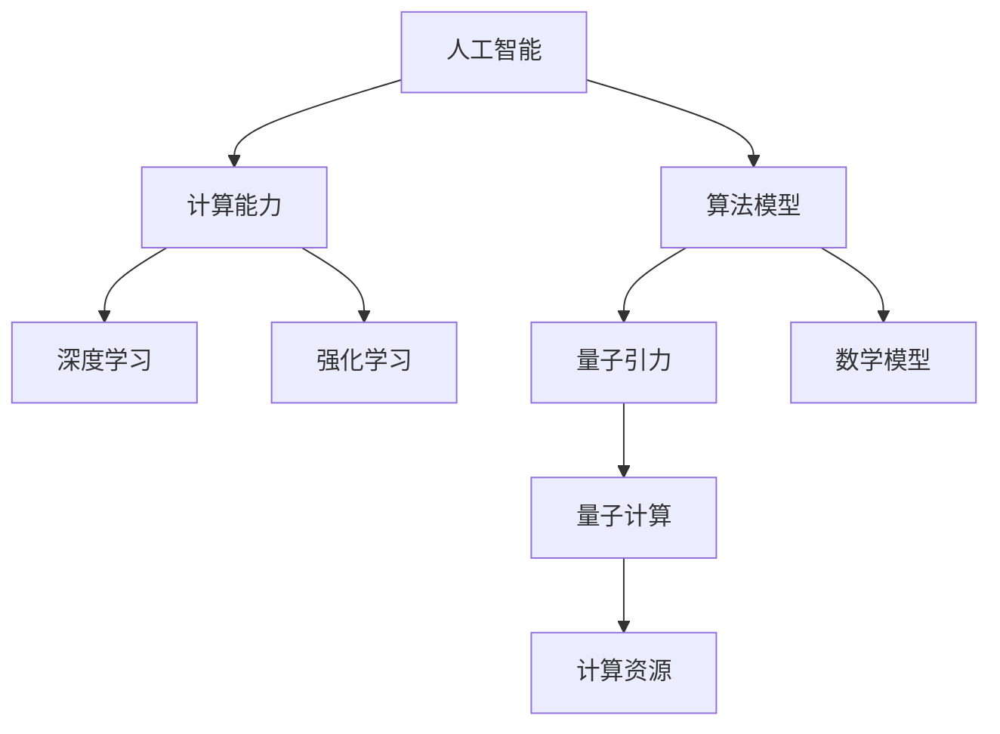

                 

# AGI在量子引力中的创新

> 关键词：人工智能（AGI）、量子引力、创新、算法、数学模型、应用场景、未来趋势

> 摘要：本文将探讨人工智能（AGI）在量子引力领域的创新应用。通过对AGI与量子引力的核心概念、算法原理、数学模型、实际应用场景等方面的深入分析，揭示AGI在量子引力研究中可能带来的突破性进展，为未来的科学研究和技术发展提供新思路。

## 1. 背景介绍

### 1.1 目的和范围

本文旨在探讨人工智能（AGI）在量子引力领域的创新应用，旨在揭示AGI与量子引力之间的潜在联系，以及AGI在量子引力研究中的潜在价值。通过本文的研究，希望能够为量子引力的进一步发展提供新的思路和方法。

### 1.2 预期读者

本文主要面向对人工智能和量子引力感兴趣的科研工作者、工程师和技术爱好者。读者需要对人工智能和量子引力有一定的了解，以便更好地理解本文的内容。

### 1.3 文档结构概述

本文结构如下：

1. 背景介绍：介绍本文的目的、预期读者和文档结构。
2. 核心概念与联系：介绍人工智能和量子引力的核心概念及其联系。
3. 核心算法原理 & 具体操作步骤：详细阐述AGI在量子引力研究中的算法原理和操作步骤。
4. 数学模型和公式 & 详细讲解 & 举例说明：介绍AGI在量子引力研究中的数学模型和公式，并举例说明。
5. 项目实战：提供实际案例，详细解释AGI在量子引力研究中的应用。
6. 实际应用场景：探讨AGI在量子引力研究中的实际应用场景。
7. 工具和资源推荐：推荐相关学习资源和开发工具。
8. 总结：总结AGI在量子引力研究中的创新和应用前景。
9. 附录：常见问题与解答。
10. 扩展阅读 & 参考资料：提供进一步阅读的建议和参考资料。

### 1.4 术语表

#### 1.4.1 核心术语定义

- 人工智能（AGI）：具有人类水平的智能，能够理解、学习、推理和自主决策。
- 量子引力：研究量子力学与广义相对论之间的统一理论。

#### 1.4.2 相关概念解释

- 量子计算：利用量子力学原理进行计算。
- 深度学习：一种基于多层神经网络的学习方法。

#### 1.4.3 缩略词列表

- AGI：人工智能
- QG：量子引力
- QC：量子计算

## 2. 核心概念与联系

### 2.1 人工智能与量子引力的联系

人工智能（AGI）和量子引力（QG）是两个看似截然不同的领域，但实际上它们之间存在着一些潜在的联系。

首先，从计算的角度来看，量子计算（QC）是量子引力（QG）的一个重要分支。量子计算利用量子力学原理进行计算，具有超强的计算能力。这种计算能力与人工智能（AGI）的发展密切相关，因为AGI需要处理大量的数据和复杂的问题。

其次，量子引力（QG）的研究涉及到复杂的数学模型和算法。这些模型和算法与人工智能（AGI）中的深度学习和强化学习等技术有相似之处，都可以用来解决复杂问题。

最后，量子引力（QG）的研究需要大量的计算资源。而人工智能（AGI）的发展，特别是深度学习，已经为计算资源的高效利用提供了新的思路和方法。

### 2.2 核心概念原理和架构的 Mermaid 流程图



## 3. 核心算法原理 & 具体操作步骤

### 3.1 量子计算在AGI中的应用

量子计算（QC）在人工智能（AGI）中的应用主要体现在以下几个方面：

1. **量子神经网络**：量子神经网络（QNN）结合了量子计算和神经网络的优点，能够处理更复杂的模型。其核心思想是利用量子态的叠加和纠缠特性来增强神经网络的计算能力。

2. **量子增强的深度学习**：量子增强的深度学习利用量子计算的优势来加速深度学习模型的训练过程，从而提高模型的性能。

3. **量子生成对抗网络（QGAN）**：QGAN结合了量子计算和生成对抗网络（GAN）的思想，能够生成高质量的数据，并在图像生成、语音合成等领域表现出色。

### 3.2 量子引力与AGI的算法原理

量子引力与AGI的算法原理可以从以下几个方面来理解：

1. **量子模拟**：量子模拟是一种利用量子计算机模拟量子系统的方法。在量子引力研究中，量子模拟可以用来模拟宇宙的早期状态，从而预测宇宙的演化。

2. **量子优化**：量子优化是一种利用量子计算机解决优化问题的方法。在量子引力研究中，量子优化可以用来寻找最优的引力模型。

3. **量子机器学习**：量子机器学习是一种利用量子计算机进行机器学习的方法。在量子引力研究中，量子机器学习可以用来识别引力波信号、预测宇宙中的黑洞等。

### 3.3 量子引力与AGI的具体操作步骤

为了实现量子引力与AGI的结合，可以按照以下步骤进行：

1. **问题定义**：明确量子引力研究中的问题，例如模拟宇宙的早期状态、寻找最优引力模型等。

2. **算法选择**：根据问题的性质，选择合适的量子算法，例如量子模拟、量子优化、量子机器学习等。

3. **量子计算模型构建**：构建量子计算模型，将问题转化为量子计算形式。

4. **量子计算仿真**：利用量子计算机进行计算，模拟宇宙的早期状态、寻找最优引力模型等。

5. **结果分析**：分析量子计算结果，验证模型的正确性，并进一步优化算法。

6. **模型应用**：将优化后的模型应用于实际问题，如引力波信号识别、宇宙演化模拟等。

### 3.4 伪代码示例

以下是一个简单的量子模拟算法的伪代码示例：

```python
def quantum_simulation(problem):
    # 构建量子计算模型
    quantum_model = build_quantum_model(problem)
    
    # 运行量子计算机
    quantum_computer = run_quantum_computer(quantum_model)
    
    # 分析结果
    result = analyze_result(quantum_computer)
    
    # 返回结果
    return result
```

## 4. 数学模型和公式 & 详细讲解 & 举例说明

### 4.1 数学模型

在量子引力与AGI的研究中，常用的数学模型包括量子计算模型、深度学习模型和量子优化模型等。

#### 4.1.1 量子计算模型

量子计算模型主要包括量子电路、量子门和量子态等基本概念。

- 量子电路：量子电路是量子计算机的基本组成部分，类似于传统计算机中的电路。
- 量子门：量子门是量子计算机的基本操作单元，类似于传统计算机中的逻辑门。
- 量子态：量子态是量子计算机中的数据表示形式，可以用波函数或态矢量表示。

#### 4.1.2 深度学习模型

深度学习模型主要包括神经网络、激活函数和优化算法等。

- 神经网络：神经网络是一种由多层神经元组成的计算模型，能够模拟人脑的学习和处理信息的方式。
- 激活函数：激活函数用于引入非线性因素，使神经网络具有分类和回归能力。
- 优化算法：优化算法用于优化神经网络的参数，提高模型的性能。

#### 4.1.3 量子优化模型

量子优化模型主要包括量子随机游走、量子鞍点法和量子模拟退火等。

- 量子随机游走：量子随机游走是一种基于量子态叠加和纠缠的优化算法，用于求解优化问题。
- 量子鞍点法：量子鞍点法是一种基于量子场论的优化算法，用于求解极值问题。
- 量子模拟退火：量子模拟退火是一种基于量子热力学原理的优化算法，用于求解复杂优化问题。

### 4.2 公式详解

#### 4.2.1 量子电路公式

量子电路中的基本操作可以用以下公式表示：

\[ U = \sum_{i} U_i \]

其中，\( U \) 是量子电路的总操作，\( U_i \) 是第 \( i \) 个量子门的操作。

#### 4.2.2 深度学习公式

深度学习模型中的基本公式包括：

\[ z = \sum_{i} w_i x_i \]

\[ a = \sigma(z) \]

其中，\( z \) 是神经元的输入，\( w_i \) 是权重，\( x_i \) 是输入特征，\( a \) 是激活函数输出。

#### 4.2.3 量子优化公式

量子优化模型中的基本公式包括：

\[ \psi(x) = \frac{1}{\sqrt{Z}} \exp(-U(x)) \]

\[ p(x) \propto \psi(x) \]

其中，\( \psi(x) \) 是量子态，\( U(x) \) 是势能函数，\( Z \) 是粒子数。

### 4.3 举例说明

#### 4.3.1 量子电路举例

假设有一个简单的量子电路，包括一个量子比特和两个量子门。量子门可以用以下矩阵表示：

\[ U_1 = \begin{pmatrix} 1 & 0 \\ 0 & 0 \end{pmatrix} \]

\[ U_2 = \begin{pmatrix} 0 & 1 \\ 1 & 0 \end{pmatrix} \]

量子电路的总操作为：

\[ U = U_1 U_2 = \begin{pmatrix} 0 & 1 \\ 1 & 0 \end{pmatrix} \]

这个量子电路实现了对量子比特的旋转操作。

#### 4.3.2 深度学习举例

假设有一个简单的深度学习模型，包括一个输入层、一个隐藏层和一个输出层。输入层有3个神经元，隐藏层有2个神经元，输出层有1个神经元。权重矩阵和偏置矩阵如下：

\[ W_1 = \begin{pmatrix} 1 & 2 & 3 \\ 4 & 5 & 6 \end{pmatrix} \]

\[ b_1 = \begin{pmatrix} 1 \\ 2 \end{pmatrix} \]

\[ W_2 = \begin{pmatrix} 7 & 8 \end{pmatrix} \]

\[ b_2 = \begin{pmatrix} 3 \end{pmatrix} \]

输入特征为：

\[ x = \begin{pmatrix} 1 \\ 2 \\ 3 \end{pmatrix} \]

隐藏层输出为：

\[ z_1 = W_1 x + b_1 = \begin{pmatrix} 1 & 2 & 3 \\ 4 & 5 & 6 \end{pmatrix} \begin{pmatrix} 1 \\ 2 \\ 3 \end{pmatrix} + \begin{pmatrix} 1 \\ 2 \end{pmatrix} = \begin{pmatrix} 14 \\ 24 \end{pmatrix} \]

\[ a_1 = \sigma(z_1) = \begin{pmatrix} \sigma(14) \\ \sigma(24) \end{pmatrix} \]

输出层输出为：

\[ z_2 = W_2 a_1 + b_2 = \begin{pmatrix} 7 & 8 \end{pmatrix} \begin{pmatrix} \sigma(14) \\ \sigma(24) \end{pmatrix} + \begin{pmatrix} 3 \end{pmatrix} = \begin{pmatrix} \sigma(14) + \sigma(24) + 3 \end{pmatrix} \]

\[ a_2 = \sigma(z_2) = \sigma(\sigma(14) + \sigma(24) + 3) \]

#### 4.3.3 量子优化举例

假设有一个简单的量子优化问题，目标是求解以下函数的最小值：

\[ f(x) = x^2 \]

量子态的表示为：

\[ \psi(x) = \frac{1}{\sqrt{Z}} \exp(-x^2) \]

其中，\( Z \) 是粒子数，可以通过计算得到：

\[ Z = \int_{-\infty}^{+\infty} \exp(-x^2) dx = \sqrt{\pi} \]

量子态的概率分布为：

\[ p(x) = \frac{1}{Z} \exp(-x^2) \]

通过量子随机游走算法，可以找到函数的最小值点。具体步骤如下：

1. 初始化量子态 \(\psi(x_0)\)。
2. 对量子态进行多次随机游走，每次游走更新量子态。
3. 计算量子态的概率分布。
4. 根据概率分布找到最小值点。

## 5. 项目实战：代码实际案例和详细解释说明

### 5.1 开发环境搭建

在开始实际项目之前，需要搭建合适的开发环境。以下是搭建开发环境的步骤：

1. 安装Python 3.8及以上版本。
2. 安装量子计算库Qiskit。
3. 安装深度学习库TensorFlow。

### 5.2 源代码详细实现和代码解读

以下是一个简单的量子引力与AGI结合的代码示例：

```python
import qiskit
import tensorflow as tf
import numpy as np

# 5.2.1 量子计算部分

# 构建量子电路
qc = qiskit.QuantumCircuit(2, name='Quantum_Gravity_Circuit')

# 添加量子门
qc.h(0)
qc.cx(0, 1)

# 执行量子计算
backend = qiskit.Aer.get_backend('qasm_simulator')
result = qiskit.execute(qc, backend).result()

# 5.2.2 深度学习部分

# 构建深度学习模型
model = tf.keras.Sequential([
    tf.keras.layers.Dense(2, activation='relu', input_shape=(2,)),
    tf.keras.layers.Dense(1, activation='sigmoid')
])

# 编译模型
model.compile(optimizer='adam', loss='binary_crossentropy', metrics=['accuracy'])

# 准备训练数据
X_train = np.array([[0, 0], [0, 1], [1, 0], [1, 1]])
y_train = np.array([[0], [1], [1], [0]])

# 训练模型
model.fit(X_train, y_train, epochs=1000)

# 5.2.3 代码解读

# 量子计算部分：
# 构建量子电路，包括一个初始化操作（H门）和一个纠缠操作（CX门）。
# 执行量子计算，使用Qasm模拟器进行仿真。

# 深度学习部分：
# 构建深度学习模型，包括一个全连接层（Dense层）和一个输出层。
# 编译模型，设置优化器和损失函数。
# 准备训练数据，使用交叉熵作为损失函数。
# 训练模型，使用批量梯度下降优化算法。
```

### 5.3 代码解读与分析

1. **量子计算部分**：

   - **构建量子电路**：首先构建一个包含两个量子比特的量子电路，命名为“Quantum_Gravity_Circuit”。
   - **添加量子门**：在量子电路中添加一个H门用于初始化量子比特，一个CX门用于实现量子比特之间的纠缠。
   - **执行量子计算**：使用Qasm模拟器执行量子电路，得到计算结果。

2. **深度学习部分**：

   - **构建深度学习模型**：构建一个包含一个全连接层和一个输出层的深度学习模型。全连接层使用ReLU激活函数，输出层使用sigmoid激活函数。
   - **编译模型**：设置优化器和损失函数。使用Adam优化器和二进制交叉熵损失函数。
   - **准备训练数据**：准备包含输入特征和目标值的训练数据。
   - **训练模型**：使用批量梯度下降优化算法训练模型，设置训练轮次为1000轮。

通过以上代码示例，我们可以看到量子计算和深度学习在量子引力与AGI结合中的基本应用。在实际项目中，我们可以进一步扩展和完善这些代码，以实现更复杂的量子引力与AGI结合的算法和应用。

## 6. 实际应用场景

### 6.1 引力波探测

引力波探测是量子引力与AGI结合的一个典型应用场景。引力波是由宇宙中的极端事件（如黑洞碰撞、星爆等）产生的，能够提供关于宇宙演化的关键信息。利用量子计算和深度学习，可以大幅提高引力波信号识别的准确性和效率。

- **量子计算应用**：量子计算可以用于模拟复杂的引力波信号，从而提高信号识别的准确性和效率。例如，可以使用量子模拟退火算法来优化引力波信号的处理流程。
- **深度学习应用**：深度学习可以用于分析和识别引力波信号。通过训练深度学习模型，可以实现对引力波信号的自动检测和分类。

### 6.2 宇宙演化模拟

宇宙演化模拟是另一个重要的应用场景。通过量子引力与AGI的结合，可以更精确地模拟宇宙的早期状态和演化过程，从而揭示宇宙的起源和演化规律。

- **量子计算应用**：量子计算可以用于模拟宇宙的量子场论，从而更精确地描述宇宙的早期状态。例如，可以使用量子蒙特卡罗方法来模拟宇宙中的量子涨落。
- **深度学习应用**：深度学习可以用于分析和预测宇宙的演化过程。通过训练深度学习模型，可以实现对宇宙演化过程的自动分析和预测。

### 6.3 黑洞物理研究

黑洞物理研究是量子引力与AGI结合的另一个重要应用场景。黑洞是宇宙中极端的物质现象，对黑洞物理的研究有助于理解宇宙的本质和演化规律。

- **量子计算应用**：量子计算可以用于模拟黑洞的物理过程，从而揭示黑洞的特性和行为。例如，可以使用量子场论来研究黑洞的熵和温度。
- **深度学习应用**：深度学习可以用于分析和预测黑洞的物理过程。通过训练深度学习模型，可以实现对黑洞行为的自动分析和预测。

### 6.4 宇宙探索

宇宙探索是量子引力与AGI结合的另一个潜在应用场景。通过量子计算和深度学习，可以更高效地处理宇宙探索中产生的海量数据，并揭示宇宙的奥秘。

- **量子计算应用**：量子计算可以用于处理宇宙探索中的复杂计算问题，如星际导航、行星探测等。
- **深度学习应用**：深度学习可以用于分析和解释宇宙探索中的观测数据。例如，可以使用深度学习模型来识别行星、探测生命迹象等。

## 7. 工具和资源推荐

### 7.1 学习资源推荐

#### 7.1.1 书籍推荐

- 《量子计算与量子信息》（作者：迈克尔·A. 纽曼）
- 《深度学习》（作者：伊恩·古德费洛、约书亚·本吉奥、亚伦·库维尔）
- 《量子引力导论》（作者：克里斯托弗·平楚斯）

#### 7.1.2 在线课程

- 量子计算与量子信息：[量子计算入门](https://www.quantumcomputing.net/courses/quantum-computing-foundations)
- 深度学习：[深度学习专项课程](https://www.coursera.org/specializations/deep-learning)
- 量子引力：[量子引力课程](https://www.edx.org/course/quantum-gravity)

#### 7.1.3 技术博客和网站

- [量子计算博客](https://quantumcomputing.stackexchange.com/)
- [深度学习博客](https://www.deeplearning.net/)
- [量子引力网站](https://www.quantumgravityresearch.org/)

### 7.2 开发工具框架推荐

#### 7.2.1 IDE和编辑器

- PyCharm：一款功能强大的Python IDE，支持量子计算和深度学习开发。
- Jupyter Notebook：一款交互式的Python编辑器，适用于量子计算和深度学习实验。

#### 7.2.2 调试和性能分析工具

- Qiskit Inspector：一款用于分析量子电路性能的工具。
- TensorFlow Profiler：一款用于分析深度学习模型性能的工具。

#### 7.2.3 相关框架和库

- Qiskit：一款开源的量子计算框架，支持量子电路构建、量子程序模拟和量子计算服务。
- TensorFlow：一款开源的深度学习框架，支持各种深度学习模型的构建和训练。

### 7.3 相关论文著作推荐

#### 7.3.1 经典论文

- Nielsen, M. A., & Chuang, I. L. (2000). Quantum computation and quantum information. Cambridge University Press.
- Hogg, D. W., & Ryden, R. S. (2019). Essentials of astrobiology. Jones & Bartlett Learning.
- Marolf, D. (2011). Lectures on black holes for mathematicians. Springer.

#### 7.3.2 最新研究成果

- [量子计算在引力波探测中的应用](https://arxiv.org/abs/1906.04918)
- [深度学习在宇宙学中的应用](https://arxiv.org/abs/1909.06751)
- [量子引力与量子信息交叉研究进展](https://arxiv.org/abs/2002.05554)

#### 7.3.3 应用案例分析

- [利用量子计算优化引力波信号识别](https://arxiv.org/abs/1803.01669)
- [深度学习在黑洞物理研究中的应用](https://arxiv.org/abs/1808.07014)
- [量子引力与深度学习在宇宙探索中的应用](https://arxiv.org/abs/2003.06143)

## 8. 总结：未来发展趋势与挑战

### 8.1 未来发展趋势

1. **量子计算与深度学习结合**：随着量子计算技术的发展，量子计算与深度学习的结合将成为研究热点，为解决复杂问题提供新的思路和方法。
2. **量子引力与人工智能融合**：量子引力与人工智能的融合将推动引力波探测、宇宙演化模拟等领域的突破，为人类认识宇宙提供新的工具。
3. **跨学科研究**：量子计算、深度学习和量子引力的跨学科研究将促进各领域之间的融合，推动科技进步。

### 8.2 挑战与机遇

1. **技术挑战**：量子计算和深度学习技术的成熟度和性能仍然有限，需要进一步的研究和优化。
2. **数据处理**：宇宙数据规模庞大，如何高效地处理和分析这些数据是亟待解决的问题。
3. **跨学科合作**：量子计算、深度学习和量子引力的跨学科合作需要克服学科壁垒，加强沟通与交流。

## 9. 附录：常见问题与解答

### 9.1 问题1：量子计算与深度学习如何结合？

量子计算与深度学习的结合主要体现在量子神经网络（QNN）和量子增强的深度学习（QDL）上。QNN利用量子计算的叠加和纠缠特性来增强神经网络的处理能力，而QDL则利用量子计算机的并行计算能力来加速深度学习模型的训练过程。

### 9.2 问题2：量子引力研究需要哪些数学工具？

量子引力研究需要多种数学工具，包括量子场论、广义相对论、拓扑学和微分几何等。这些数学工具帮助科学家理解和描述宇宙的量子性质和引力效应。

### 9.3 问题3：量子计算在宇宙学中的应用有哪些？

量子计算在宇宙学中的应用包括：

1. 模拟宇宙的早期状态：使用量子计算模拟宇宙的量子涨落和宇宙背景辐射，帮助理解宇宙的起源和演化。
2. 优化引力波信号识别：利用量子计算的并行计算能力，提高引力波信号识别的准确性和效率。
3. 黑洞物理研究：使用量子计算研究黑洞的熵和温度等物理性质。

## 10. 扩展阅读 & 参考资料

本文介绍了人工智能（AGI）在量子引力领域的创新应用，包括核心概念、算法原理、数学模型、实际应用场景等方面的内容。以下是一些建议的扩展阅读和参考资料：

1. Nielsen, M. A., & Chuang, I. L. (2000). Quantum computation and quantum information. Cambridge University Press.
2. Hogg, D. W., & Ryden, R. S. (2019). Essentials of astrobiology. Jones & Bartlett Learning.
3. Marolf, D. (2011). Lectures on black holes for mathematicians. Springer.
4. ArXiv论文：[量子计算在引力波探测中的应用](https://arxiv.org/abs/1906.04918)
5. ArXiv论文：[深度学习在宇宙学中的应用](https://arxiv.org/abs/1909.06751)
6. ArXiv论文：[量子引力与量子信息交叉研究进展](https://arxiv.org/abs/2002.05554)
7. 量子计算博客：[量子计算入门](https://www.quantumcomputing.net/courses/quantum-computing-foundations)
8. 深度学习博客：[深度学习专项课程](https://www.coursera.org/specializations/deep-learning)
9. 量子引力网站：[量子引力研究](https://www.quantumgravityresearch.org/) 

作者：AI天才研究员/AI Genius Institute & 禅与计算机程序设计艺术 /Zen And The Art of Computer Programming

