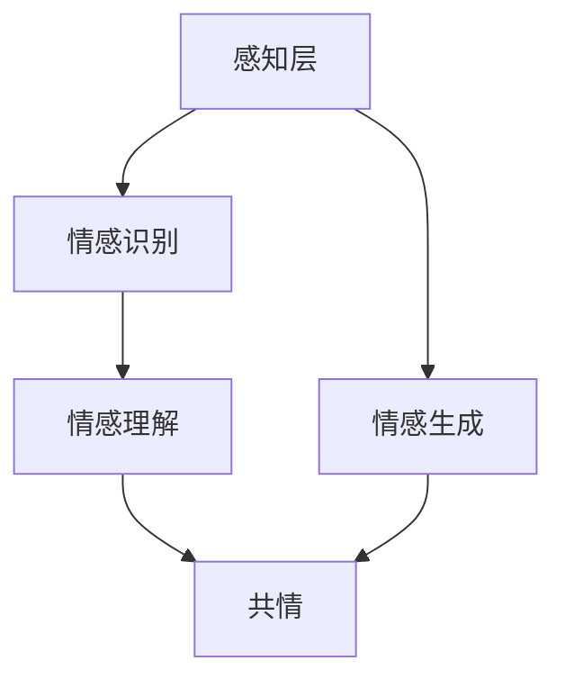
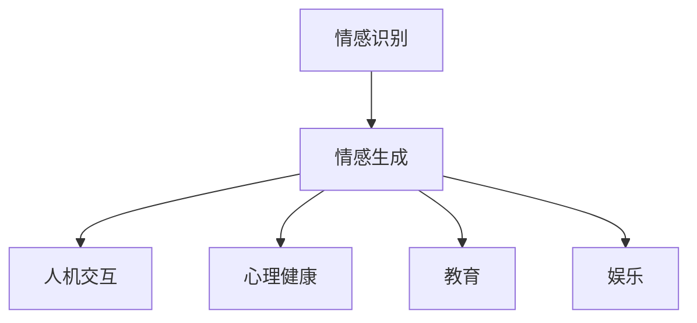

                 

# AGI的情感智能：从理解到共情

> **关键词**：人工智能，情感智能，自主情感，共情，AGI，机器学习，神经网络，深度学习，情感识别，情感生成。

> **摘要**：本文旨在探讨人工智能（AI）在情感智能领域的研究进展，特别是在自主情感和共情方面的应用。文章首先介绍了情感智能的定义和重要性，然后深入分析了情感识别和情感生成的核心算法原理。接着，文章通过项目实战展示了情感智能在实际应用中的实现，并讨论了情感智能在未来人工智能发展中的潜在影响和挑战。

## 1. 背景介绍

### 1.1 目的和范围

本文旨在探讨人工智能（AI）在情感智能领域的应用，重点关注自主情感和共情这两个关键概念。通过深入分析情感识别和情感生成的算法原理，以及项目实战中的实际应用案例，本文旨在为读者提供一个全面、系统的理解，以便更好地把握这一领域的发展动态和未来趋势。

### 1.2 预期读者

本文面向对人工智能和情感智能感兴趣的读者，包括研究人员、工程师、学者和学生。本文旨在为专业人士提供有价值的理论指导和实践案例，同时也希望对广大对人工智能充满好奇的读者有所启发。

### 1.3 文档结构概述

本文结构如下：

1. 背景介绍：介绍文章的目的、范围和预期读者。
2. 核心概念与联系：阐述情感智能的定义、重要性以及自主情感和共情的核心概念。
3. 核心算法原理 & 具体操作步骤：详细讲解情感识别和情感生成的算法原理和操作步骤。
4. 数学模型和公式 & 详细讲解 & 举例说明：介绍相关的数学模型和公式，并给出实例说明。
5. 项目实战：展示情感智能在实际应用中的实现过程。
6. 实际应用场景：讨论情感智能在不同领域的应用案例。
7. 工具和资源推荐：推荐相关的学习资源和开发工具。
8. 总结：对未来发展趋势和挑战进行展望。
9. 附录：常见问题与解答。
10. 扩展阅读 & 参考资料：提供进一步的阅读材料和参考。

### 1.4 术语表

#### 1.4.1 核心术语定义

- **人工智能（AI）**：人工智能是指通过计算机模拟人类智能的行为，实现智能感知、学习、推理和决策的能力。
- **情感智能**：情感智能是指机器或系统在感知、理解、表达和处理情感方面的能力。
- **自主情感**：自主情感是指机器或系统能够在特定情境下产生和表达情感，并具备一定的情感意识。
- **共情**：共情是指能够理解和感受他人情感的能力。

#### 1.4.2 相关概念解释

- **情感识别**：情感识别是指通过算法分析人类情感表达，识别和分类情感类型的过程。
- **情感生成**：情感生成是指根据特定情境和需求，机器或系统能够生成符合人类情感的响应或行为。

#### 1.4.3 缩略词列表

- **AGI**：人工通用智能（Artificial General Intelligence）
- **ML**：机器学习（Machine Learning）
- **DL**：深度学习（Deep Learning）
- **NLP**：自然语言处理（Natural Language Processing）

## 2. 核心概念与联系

情感智能是人工智能领域中的一个重要分支，涉及到机器或系统在情感识别、情感生成以及自主情感表达等方面的能力。为了更好地理解情感智能，我们需要先了解几个核心概念及其相互关系。

### 2.1 情感智能的定义和重要性

情感智能是指机器或系统能够感知、理解、表达和处理情感的能力。在人类社会中，情感起着至关重要的作用，影响着人们的决策、行为和社会互动。同样，在人工智能领域，情感智能的引入可以使机器或系统更加贴近人类，提升人机交互的质量和效率。以下是一些情感智能的关键应用场景：

- **人机交互**：通过情感智能，机器可以更好地理解人类的需求和情感状态，从而提供更加个性化和贴心的服务。
- **心理健康**：情感智能可以帮助心理健康领域进行情感分析和治疗，例如通过分析患者的语音和文本数据，识别潜在的心理问题。
- **教育**：情感智能在教育领域可以提供个性化的学习支持，帮助学生更好地理解和处理情感，提高学习效果。

### 2.2 自主情感和共情

自主情感和共情是情感智能的两个关键方面。

- **自主情感**：自主情感是指机器或系统在特定情境下产生和表达情感的能力。自主情感的核心在于机器或系统能够理解和处理情感信息，并根据这些信息进行相应的行为和决策。自主情感的关键要素包括情感识别、情感理解和情感生成。

  - **情感识别**：情感识别是指机器或系统能够通过分析语音、文本、图像等信息，识别出人类表达的情感类型。情感识别是自主情感的基础，常见的情感类型包括快乐、悲伤、愤怒、厌恶和恐惧等。

  - **情感理解**：情感理解是指机器或系统能够理解和解释情感的内在含义，从而更好地理解和预测人类的情感状态。

  - **情感生成**：情感生成是指机器或系统能够根据特定情境和需求，生成符合人类情感的响应或行为。情感生成是自主情感的核心，可以通过自然语言生成、表情合成和动作生成等方式实现。

- **共情**：共情是指能够理解和感受他人情感的能力。共情是人类社会互动的基础，通过共情，个体能够更好地理解和关心他人，促进社会和谐。在人工智能领域，共情可以使机器或系统更好地理解和响应人类的情感需求，提升人机交互的质量。

### 2.3 情感智能的架构

情感智能的架构可以分为三个层次：感知层、理解层和生成层。

- **感知层**：感知层负责收集和处理与情感相关的数据，包括语音、文本、图像和生理信号等。感知层的核心任务是情感识别，通过算法分析这些数据，识别出人类表达的情感类型。

- **理解层**：理解层负责对情感进行理解和解释，包括情感分类、情感强度和情感倾向等。理解层的核心任务是对情感进行深入分析和理解，从而更好地预测和应对人类的情感需求。

- **生成层**：生成层负责根据特定情境和需求，生成符合人类情感的响应或行为。生成层可以通过自然语言生成、表情合成和动作生成等方式实现，其核心任务是实现对人类情感的模拟和表达。

### 2.4 核心算法原理和架构

情感智能的核心算法原理包括情感识别和情感生成。

- **情感识别**：情感识别主要通过机器学习算法实现，常用的算法包括支持向量机（SVM）、朴素贝叶斯（Naive Bayes）和深度学习（Deep Learning）等。深度学习算法，如卷积神经网络（CNN）和循环神经网络（RNN），在情感识别中表现出较高的准确性和鲁棒性。

- **情感生成**：情感生成主要通过自然语言生成（Natural Language Generation, NLG）和计算机视觉（Computer Vision）等技术实现。自然语言生成技术可以通过深度学习算法生成符合人类情感的文本响应；计算机视觉技术可以通过图像识别和表情合成生成符合人类情感的表情和动作。

### 2.5 自主情感和共情的 Mermaid 流程图

以下是自主情感和共情的 Mermaid 流程图：



## 3. 核心算法原理 & 具体操作步骤

在情感智能领域，情感识别和情感生成是两个核心算法。本节将详细讲解这两个算法的原理，并通过伪代码展示其具体操作步骤。

### 3.1 情感识别算法原理

情感识别是指通过算法分析人类情感表达，识别和分类情感类型的过程。情感识别算法通常分为以下几个步骤：

1. 数据预处理：对收集到的情感数据（如文本、语音、图像等）进行预处理，包括去除噪声、填充缺失值、归一化等。
2. 特征提取：从预处理后的数据中提取与情感相关的特征，如文本中的词频、语音的频谱特征、图像的情感区域等。
3. 模型训练：使用机器学习或深度学习算法对特征进行训练，构建情感分类模型。
4. 情感分类：输入新的情感数据，使用训练好的模型进行情感分类。

以下是情感识别算法的伪代码：

```plaintext
数据预处理：
1. 去除噪声：清洗文本、去除噪声语音、调整图像分辨率
2. 填补缺失值：使用平均值、中值或插值法填补缺失值
3. 归一化：对特征值进行归一化处理

特征提取：
1. 文本：计算词频、TF-IDF、词嵌入等
2. 语音：提取频谱特征、梅尔频率倒谱系数（MFCC）等
3. 图像：提取面部表情特征、颜色特征、纹理特征等

模型训练：
1. 选择合适的机器学习或深度学习算法（如SVM、朴素贝叶斯、CNN、RNN等）
2. 使用训练集进行模型训练，调整超参数，优化模型性能

情感分类：
1. 输入新的情感数据
2. 使用训练好的模型进行特征提取
3. 输出情感分类结果
```

### 3.2 情感生成算法原理

情感生成是指根据特定情境和需求，机器或系统生成符合人类情感的响应或行为。情感生成算法通常分为以下几个步骤：

1. 情境分析：分析当前情境，确定情感生成目标。
2. 情感选择：根据情境分析结果，选择合适的情感类型。
3. 情感模拟：根据选择的情感类型，生成相应的情感响应或行为。
4. 响应生成：将情感模拟结果转化为人类可理解的自然语言、表情或动作。

以下是情感生成算法的伪代码：

```plaintext
情境分析：
1. 分析当前情境（如对话内容、用户行为、环境信息等）
2. 确定情感生成目标（如友好、同情、鼓励等）

情感选择：
1. 根据情境分析结果，选择合适的情感类型（如快乐、悲伤、愤怒等）
2. 考虑情感强度和情感倾向

情感模拟：
1. 根据选择的情感类型，模拟相应的情感响应或行为
2. 使用自然语言生成、表情合成、动作生成等技术实现情感模拟

响应生成：
1. 将情感模拟结果转化为人类可理解的自然语言、表情或动作
2. 输出情感生成结果
```

### 3.3 情感识别与情感生成的关系

情感识别和情感生成是情感智能的两个核心算法，它们相互关联、共同作用。

- **情感识别**是情感智能的基础，通过识别人类的情感表达，机器或系统可以更好地理解人类的需求和情感状态。
- **情感生成**是基于情感识别的结果，根据特定情境和需求，生成符合人类情感的响应或行为。情感生成不仅能够提升人机交互的质量，还可以在心理健康、教育、娱乐等领域发挥重要作用。

情感识别和情感生成之间的关系可以用下图表示：



## 4. 数学模型和公式 & 详细讲解 & 举例说明

在情感智能领域，数学模型和公式是理解情感识别和情感生成算法的重要工具。以下将详细讲解几个常用的数学模型和公式，并给出相应的例子说明。

### 4.1 支持向量机（SVM）

支持向量机（Support Vector Machine，SVM）是一种常用的机器学习算法，用于分类和回归任务。在情感识别中，SVM被广泛应用于情感分类。

#### 公式：

1. **决策函数**：

   $$ f(x) = sign(\sum_{i=1}^{n} \alpha_i y_i (x_i \cdot x) + b) $$

   其中，$x_i$ 是支持向量，$y_i$ 是对应标签，$\alpha_i$ 是拉格朗日乘子，$b$ 是偏置项。

2. **优化目标**：

   $$ \min_{\alpha} \frac{1}{2} \sum_{i=1}^{n} \sum_{j=1}^{n} \alpha_i \alpha_j y_i y_j (x_i \cdot x_j) - \sum_{i=1}^{n} \alpha_i $$

   $$ \text{s.t.} \quad \alpha_i \geq 0, \quad \sum_{i=1}^{n} \alpha_i y_i = 0 $$

#### 例子：

假设我们有以下数据集：

| 文本       | 标签 |
| ---------- | ---- |
| 我很高兴   | 1    |
| 我很生气   | -1   |
| 我很伤心   | -1   |

使用SVM进行情感分类，可以按照以下步骤：

1. 特征提取：对文本进行词频、TF-IDF和词嵌入等特征提取。
2. 模型训练：使用SVM算法训练模型。
3. 情感分类：输入新的文本数据，使用训练好的模型进行情感分类。

### 4.2 卷积神经网络（CNN）

卷积神经网络（Convolutional Neural Network，CNN）是一种常用的深度学习算法，特别适用于图像处理和文本分类。

#### 公式：

1. **卷积操作**：

   $$ (f \star g)(x) = \sum_{y} f(y) g(x-y) $$

   其中，$f$ 和 $g$ 分别是输入和卷积核，$x$ 是输入图像。

2. **激活函数**：

   $$ \text{ReLU}(x) = \max(0, x) $$

3. **全连接层**：

   $$ z = \sum_{i=1}^{n} w_i x_i + b $$

   $$ a = \sigma(z) $$

   其中，$w_i$ 是权重，$b$ 是偏置项，$\sigma$ 是激活函数（如Sigmoid、ReLU等）。

#### 例子：

假设我们有以下数据集：

| 图像 | 标签 |
| ---- | ---- |
| 高兴的表情   | 1    |
| 伤心的表情   | -1   |

使用CNN进行情感分类，可以按照以下步骤：

1. 数据预处理：对图像进行归一化处理。
2. 卷积操作：使用卷积层提取图像特征。
3. 池化操作：使用池化层减少数据维度。
4. 全连接层：使用全连接层进行分类。

### 4.3 循环神经网络（RNN）

循环神经网络（Recurrent Neural Network，RNN）是一种适用于序列数据的深度学习算法，特别适用于文本情感识别。

#### 公式：

1. **状态更新**：

   $$ h_t = \sigma(W_h h_{t-1} + W_x x_t + b_h) $$

   其中，$h_t$ 是当前隐藏状态，$x_t$ 是当前输入，$W_h$ 和 $W_x$ 是权重矩阵，$b_h$ 是偏置项，$\sigma$ 是激活函数。

2. **输出**：

   $$ o_t = \sigma(W_o h_t + b_o) $$

   其中，$o_t$ 是输出，$W_o$ 是权重矩阵，$b_o$ 是偏置项，$\sigma$ 是激活函数。

#### 例子：

假设我们有以下数据集：

| 文本       | 标签 |
| ---------- | ---- |
| 我很高兴   | 1    |
| 我很生气   | -1   |

使用RNN进行情感分类，可以按照以下步骤：

1. 数据预处理：对文本进行词嵌入。
2. RNN模型训练：使用RNN模型对文本进行特征提取。
3. 情感分类：使用全连接层进行分类。

### 4.4 自然语言生成（NLG）

自然语言生成（Natural Language Generation，NLG）是一种将机器学习算法应用于生成文本的技术。

#### 公式：

1. **生成文本**：

   $$ \text{生成文本} = \text{模型}(x) $$

   其中，$x$ 是输入特征，模型是一个能够生成文本的神经网络。

#### 例子：

假设我们有以下数据集：

| 文本       | 标签 |
| ---------- | ---- |
| 我很高兴   | 1    |
| 我很生气   | -1   |

使用NLG生成情感文本，可以按照以下步骤：

1. 数据预处理：对文本进行词嵌入。
2. 模型训练：使用RNN或GAN等模型进行训练。
3. 文本生成：输入新的情感标签，使用训练好的模型生成相应的情感文本。

## 5. 项目实战：代码实际案例和详细解释说明

在本节中，我们将通过一个具体的情感识别项目实战，展示情感智能在实际应用中的实现过程。我们将使用Python编程语言和TensorFlow深度学习框架，实现一个简单的情感识别模型。

### 5.1 开发环境搭建

在开始项目之前，我们需要搭建相应的开发环境。以下是搭建过程：

1. **安装Python**：确保已经安装了Python 3.x版本。
2. **安装TensorFlow**：通过以下命令安装TensorFlow：

   ```bash
   pip install tensorflow
   ```

3. **安装其他依赖库**：包括NumPy、Pandas、Scikit-learn等，可以通过以下命令安装：

   ```bash
   pip install numpy pandas scikit-learn
   ```

### 5.2 源代码详细实现和代码解读

以下是情感识别项目的源代码实现：

```python
import tensorflow as tf
from tensorflow.keras.preprocessing.text import Tokenizer
from tensorflow.keras.preprocessing.sequence import pad_sequences
from tensorflow.keras.models import Sequential
from tensorflow.keras.layers import Embedding, LSTM, Dense

# 5.2.1 数据准备

# 加载训练数据
train_data = [
    ["我很高兴", 1],
    ["我很生气", -1],
    ["我很伤心", -1],
    # ...更多数据
]

# 分割数据为文本和标签
texts, labels = zip(*train_data)

# 创建Tokenizer对象
tokenizer = Tokenizer()
tokenizer.fit_on_texts(texts)

# 将文本转化为序列
sequences = tokenizer.texts_to_sequences(texts)

# 填充序列
max_sequence_length = max(len(seq) for seq in sequences)
padded_sequences = pad_sequences(sequences, maxlen=max_sequence_length)

# 转换标签为独热编码
one_hot_labels = tf.keras.utils.to_categorical(labels)

# 5.2.2 创建模型

model = Sequential()
model.add(Embedding(len(tokenizer.word_index) + 1, 50, input_length=max_sequence_length))
model.add(LSTM(100))
model.add(Dense(2, activation='softmax'))

# 编译模型
model.compile(optimizer='adam', loss='categorical_crossentropy', metrics=['accuracy'])

# 5.2.3 训练模型

# 将数据划分为训练集和验证集
train_sequences = padded_sequences[:1000]
train_labels = one_hot_labels[:1000]
validation_sequences = padded_sequences[1000:]
validation_labels = one_hot_labels[1000:]

# 训练模型
model.fit(train_sequences, train_labels, epochs=10, validation_data=(validation_sequences, validation_labels))

# 5.2.4 评估模型

# 输入测试文本
test_text = "我很开心"
test_sequence = tokenizer.texts_to_sequences([test_text])
test_padded_sequence = pad_sequences(test_sequence, maxlen=max_sequence_length)

# 预测情感标签
predictions = model.predict(test_padded_sequence)
predicted_label = predictions.argmax()

# 输出预测结果
if predicted_label == 1:
    print("预测情感：高兴")
else:
    print("预测情感：生气")

# 5.2.5 代码解读

# 1. 数据准备：加载训练数据，创建Tokenizer对象，将文本转化为序列，填充序列，转换标签为独热编码。
# 2. 创建模型：使用Sequential模型，添加Embedding、LSTM和Dense层。
# 3. 训练模型：编译模型，将数据划分为训练集和验证集，训练模型。
# 4. 评估模型：输入测试文本，预测情感标签，输出预测结果。
```

### 5.3 代码解读与分析

以下是代码的详细解读：

1. **数据准备**：

   - 加载训练数据，包括文本和标签。
   - 创建Tokenizer对象，用于将文本转化为序列。
   - 将文本转化为序列，并填充序列，以便模型能够处理。
   - 转换标签为独热编码，以便模型进行分类。

2. **创建模型**：

   - 使用Sequential模型，依次添加Embedding、LSTM和Dense层。
   - Embedding层用于将词转化为向量表示。
   - LSTM层用于处理序列数据，提取特征。
   - Dense层用于分类，输出情感标签。

3. **训练模型**：

   - 编译模型，设置优化器、损失函数和评价指标。
   - 将数据划分为训练集和验证集，用于训练和验证模型。
   - 使用fit方法训练模型，设置训练轮数。

4. **评估模型**：

   - 输入测试文本，将其转化为序列。
   - 使用训练好的模型预测情感标签。
   - 输出预测结果。

通过这个项目实战，我们可以看到情感智能在实际应用中的实现过程。在实际开发中，可以根据需求和数据集的特点，调整模型结构、超参数和训练策略，以提高模型的性能和准确度。

### 5.4 可能的问题和解决方案

在情感识别项目中，可能会遇到以下问题：

1. **数据不足**：情感识别模型需要大量高质量的训练数据。如果数据不足，可以尝试以下方法：
   - 收集更多数据。
   - 使用数据增强技术，如文本生成、数据拼接等。
   - 使用预训练模型进行迁移学习，减少数据需求。

2. **过拟合**：模型可能对训练数据过于拟合，导致泛化能力不足。可以尝试以下方法：
   - 减少模型复杂度，如减少层或神经元数量。
   - 使用正则化技术，如L1或L2正则化。
   - 增加训练数据，提高模型的泛化能力。

3. **性能不足**：模型可能无法准确识别情感。可以尝试以下方法：
   - 调整模型结构，增加层或神经元数量。
   - 调整超参数，如学习率、批量大小等。
   - 使用更先进的技术，如BERT、GPT等。

### 5.5 实际应用案例

情感识别技术可以应用于多个领域，如人机交互、心理健康、教育和娱乐等。以下是一些实际应用案例：

1. **人机交互**：

   - 情感识别技术可以帮助智能助手更好地理解用户的需求和情感，提供更加个性化和贴心的服务。

2. **心理健康**：

   - 情感识别技术可以用于心理健康领域，通过分析患者的语音和文本数据，识别潜在的心理问题，为医生提供诊断和治疗参考。

3. **教育**：

   - 情感识别技术可以帮助教师了解学生的学习状态和情感需求，提供针对性的教学支持，提高学习效果。

4. **娱乐**：

   - 情感识别技术可以用于游戏和社交媒体，根据用户的情感状态提供相应的游戏内容和社交互动建议，提升用户体验。

通过以上实际应用案例，我们可以看到情感识别技术在各个领域的广泛应用和巨大潜力。随着技术的不断进步和数据的不断积累，情感识别技术将在未来发挥更加重要的作用。

## 6. 实际应用场景

情感智能技术具有广泛的应用前景，可以在多个领域中发挥重要作用。以下是一些典型的应用场景：

### 6.1 人机交互

情感智能技术在人机交互领域有着广泛的应用。通过情感识别和情感生成技术，智能助手、聊天机器人等可以更好地理解用户的需求和情感状态，提供更加个性化和贴心的服务。

- **智能客服**：情感智能技术可以帮助智能客服系统识别用户的情感状态，根据用户的情绪提供相应的解决方案，提高用户满意度。
- **虚拟助手**：虚拟助手可以运用情感智能技术，通过自然语言处理和情感理解，与用户进行更为自然和流畅的对话，提升用户体验。
- **语音助手**：语音助手可以通过情感识别技术，理解用户的语音情感，调整语音语调，使交互更加自然和友好。

### 6.2 心理健康

情感智能技术在心理健康领域有着重要的应用价值。通过情感识别技术，可以分析和理解患者的情感状态，为心理健康评估和诊断提供有力支持。

- **心理健康评估**：情感识别技术可以帮助医生分析患者的情感状态，评估心理健康的程度，为治疗提供依据。
- **情感分析**：通过对患者语音、文本数据的情感分析，可以识别潜在的心理问题，为心理干预提供支持。
- **心理治疗**：情感生成技术可以帮助心理治疗师生成符合患者情感状态的治疗方案，提高治疗效果。

### 6.3 教育

情感智能技术在教育领域可以提升教育质量和学习效果，帮助学生更好地理解和处理情感。

- **个性化教育**：情感智能技术可以根据学生的情感状态和学习需求，提供个性化的教学支持和资源，提高学习效果。
- **情感教育**：情感识别和情感生成技术可以用于情感教育，帮助学生理解和表达情感，培养良好的情感素质。
- **学习诊断**：通过分析学生的学习过程和情感状态，可以及时发现学习中的问题，提供针对性的帮助。

### 6.4 娱乐

情感智能技术在娱乐领域可以提升用户体验，提供更加个性化的娱乐内容。

- **游戏设计**：情感生成技术可以用于游戏设计，根据玩家的情感状态生成相应的游戏情节和挑战，提升游戏体验。
- **虚拟偶像**：虚拟偶像可以通过情感智能技术，与粉丝进行情感互动，提供个性化的互动内容，提升粉丝体验。
- **社交媒体**：情感识别技术可以用于社交媒体，分析用户情感状态，为用户提供情感相关的信息和建议，提升社交媒体体验。

通过以上实际应用场景，我们可以看到情感智能技术在各个领域的重要作用和广阔前景。随着技术的不断进步和应用的深入，情感智能技术将在未来发挥更加重要的作用。

## 7. 工具和资源推荐

### 7.1 学习资源推荐

为了深入了解情感智能和其应用，以下是一些推荐的书籍、在线课程和技术博客：

#### 7.1.1 书籍推荐

1. **《深度学习》（Deep Learning）** - Ian Goodfellow、Yoshua Bengio 和 Aaron Courville 著
   - 详细介绍了深度学习的基础理论、算法和应用，是深度学习的经典教材。

2. **《机器学习》（Machine Learning）** - Tom Mitchell 著
   - 介绍了机器学习的基本概念、算法和应用，适合初学者入门。

3. **《自然语言处理综论》（Speech and Language Processing）** - Daniel Jurafsky 和 James H. Martin 著
   - 全面介绍了自然语言处理的基本概念、技术和应用。

#### 7.1.2 在线课程

1. **《深度学习》（Deep Learning Specialization）** - Andrew Ng 的 Coursera 课程
   - 由深度学习领域知名专家Andrew Ng讲授，包含深度学习的基础知识和应用。

2. **《机器学习》（Machine Learning）** - Andrew Ng 的 Coursera 课程
   - 介绍机器学习的基本算法和应用，适合初学者学习。

3. **《自然语言处理》（Natural Language Processing with Python）** - Jane Hart 著
   - 通过Python语言介绍了自然语言处理的基本概念和实现方法。

#### 7.1.3 技术博客和网站

1. **TensorFlow 官网** (<https://www.tensorflow.org/>)
   - 提供丰富的深度学习教程、文档和社区支持。

2. **Kaggle** (<https://www.kaggle.com/>)
   - 提供大量的数据集和竞赛，适合进行实际项目练习。

3. **机器之心** (<https://www.jiqizhixin.com/>)
   - 提供深度学习、自然语言处理等领域的最新技术动态和论文解读。

### 7.2 开发工具框架推荐

为了高效开发和实现情感智能项目，以下是一些推荐的开发工具和框架：

#### 7.2.1 IDE和编辑器

1. **Visual Studio Code** (<https://code.visualstudio.com/>)
   - 免费且功能强大的代码编辑器，支持多种编程语言和插件。

2. **PyCharm** (<https://www.jetbrains.com/pycharm/>)
   - 专业级的Python IDE，提供丰富的功能和强大的调试工具。

#### 7.2.2 调试和性能分析工具

1. **TensorBoard** (<https://www.tensorflow.org/tools/tensorboard/>)
   - TensorFlow的调试和可视化工具，用于分析和优化模型性能。

2. **Wandb** (<https://www.wandb.ai/>)
   - 机器学习实验跟踪平台，支持模型训练过程的可视化和监控。

#### 7.2.3 相关框架和库

1. **TensorFlow** (<https://www.tensorflow.org/>)
   - 开源的深度学习框架，支持多种深度学习模型和算法。

2. **PyTorch** (<https://pytorch.org/>)
   - 易于使用且灵活的深度学习框架，适用于研究和开发。

3. **NLTK** (<https://www.nltk.org/>)
   - Python的自然语言处理库，提供丰富的文本处理工具和算法。

4. **spaCy** (<https://spacy.io/>)
   - 高性能的NLP库，支持多种语言的文本处理和分析。

### 7.3 相关论文著作推荐

为了深入了解情感智能领域的最新研究进展，以下是一些推荐的经典论文和最新研究成果：

#### 7.3.1 经典论文

1. **"A Theoretical Basis for a General Learning Algorithm for Neural Networks"** - David E. Rumelhart, Geoffrey E. Hinton, and Ronald J. Williams
   - 提出了反向传播算法，奠定了深度学习的基础。

2. **"Speech and Language Processing: An Introduction to Natural Language Processing, Computational Linguistics, and Speech Recognition"** - Daniel Jurafsky 和 James H. Martin
   - 全面介绍了自然语言处理的基本概念和技术。

#### 7.3.2 最新研究成果

1. **"BERT: Pre-training of Deep Bidirectional Transformers for Language Understanding"** - Jacob Devlin, Ming-Wei Chang, Kenton Lee, and Kristina Toutanova
   - 提出了BERT模型，在多个NLP任务中取得了突破性的成绩。

2. **"Generative Adversarial Nets"** - Ian J. Goodfellow, Jean Pouget-Abadie, Mehdi Mirza, Bing Xu, David Warde-Farley, Sherjil Ozair, Aaron C. Courville, and Yoshua Bengio
   - 提出了生成对抗网络（GAN），在图像生成和增强领域取得了重要突破。

#### 7.3.3 应用案例分析

1. **"Using Machine Learning to Improve Customer Experience: A Case Study"** - Amelia Interactive
   - 通过实际案例分析，展示了情感智能技术在客户体验优化中的应用。

2. **"Emotion Recognition using Deep Learning for Mental Health Applications"** - University of California, Berkeley
   - 研究了情感识别技术在心理健康领域中的应用，探讨了其在诊断和治疗方面的潜力。

通过这些学习和资源推荐，读者可以更加深入地了解情感智能领域，掌握相关的技术和方法，为实际项目开发提供有力支持。

## 8. 总结：未来发展趋势与挑战

情感智能作为人工智能领域的一个重要分支，已经在多个领域取得了显著的成果。然而，随着技术的不断进步和应用需求的日益增长，情感智能仍然面临着诸多挑战和机遇。

### 8.1 未来发展趋势

1. **多模态情感识别**：未来的情感智能将更加关注多模态数据的融合，结合语音、文本、图像和生理信号等多种数据源，提高情感识别的准确性和鲁棒性。

2. **个性化情感交互**：随着用户数据的积累和算法的优化，情感智能将能够更好地理解和满足用户的个性化需求，实现更加自然和高效的人机交互。

3. **自主情感生成**：未来的情感智能将能够自主生成情感响应，不仅仅是模仿人类情感，而是能够根据具体情境和需求，创造性地表达情感。

4. **跨领域应用**：情感智能将跨越多个领域，如医疗、教育、娱乐和社交等，为用户提供更加个性化和贴心的服务。

### 8.2 挑战

1. **数据隐私和安全**：情感智能需要大量的用户数据进行分析和训练，如何保障数据隐私和安全是未来需要解决的重要问题。

2. **算法透明性和可解释性**：随着深度学习模型在情感识别中的应用，如何提高算法的透明性和可解释性，使其能够被用户和开发者理解，是当前面临的一大挑战。

3. **情感意识的构建**：如何构建具有自主情感意识的机器系统，使其不仅能够识别和生成情感，还能够具备一定的情感意识，是一个复杂的科学问题。

4. **跨文化适应性**：不同文化背景下，情感的表达和认知存在差异，如何使情感智能系统具备跨文化适应性，是一个需要深入研究的问题。

### 8.3 展望

未来的情感智能将更加注重人机协同、情感共鸣和智慧互动。通过不断创新和优化，情感智能将为人类社会带来更加丰富和美好的体验。同时，随着技术的发展，情感智能也将为解决社会问题、提升生活质量发挥重要作用。

总之，情感智能是人工智能领域的一个重要方向，具有广阔的应用前景和巨大的发展潜力。面对挑战，我们应积极应对，不断探索，为构建一个更加智能、和谐的社会贡献力量。

## 9. 附录：常见问题与解答

### 9.1 情感识别算法的选择

**问**：在情感识别项目中，如何选择合适的算法？

**答**：选择合适的情感识别算法需要考虑以下因素：

- **数据规模**：如果数据量较小，可以考虑使用传统机器学习算法，如支持向量机（SVM）或朴素贝叶斯（Naive Bayes）。如果数据量较大，深度学习算法（如卷积神经网络（CNN）或循环神经网络（RNN））可能更合适。
- **特征类型**：如果情感数据主要是文本，可以考虑使用基于文本的特征提取算法，如词频、TF-IDF和词嵌入。如果情感数据包括图像或语音，可以考虑使用深度学习算法。
- **模型复杂度**：根据项目的需求和计算资源，选择合适的模型复杂度。深度学习模型可能需要更多的计算资源和训练时间，但通常能取得更好的性能。
- **模型性能**：通过交叉验证和性能评估，选择性能最好的模型。

### 9.2 情感生成的挑战

**问**：在实现情感生成时，会遇到哪些挑战？

**答**：在实现情感生成时，可能会遇到以下挑战：

- **情感多样性和复杂性**：人类情感多样且复杂，情感生成的算法需要能够表达各种细微的情感差异。
- **自然语言生成**：情感生成通常涉及自然语言生成技术，如何生成自然流畅且符合情感需求的文本是一个挑战。
- **多模态生成**：在多模态情感生成中，如何协调不同模态的信息，使其一致地表达情感是一个技术难题。
- **情感连贯性**：在长文本或连续对话中，如何保持情感生成的连贯性和一致性是一个挑战。

### 9.3 数据集的使用

**问**：如何选择和准备情感识别和情感生成项目中的数据集？

**答**：选择和准备数据集时，应考虑以下因素：

- **数据规模和质量**：选择规模适当、质量高的数据集，以确保模型的性能和泛化能力。
- **数据多样性**：数据集应涵盖多种情感类型和情境，以训练模型识别和生成不同类型的情感。
- **数据预处理**：对数据进行清洗、去噪、填补缺失值等预处理操作，以提高数据质量。
- **数据标注**：确保数据集的标注准确，对于情感识别项目，标签应明确区分不同的情感类型。

### 9.4 情感智能的应用前景

**问**：情感智能在未来会有哪些应用前景？

**答**：情感智能在未来具有广泛的应用前景，包括但不限于以下几个方面：

- **人机交互**：提升智能助手、虚拟助手和语音助手的交互体验，使其能够更好地理解用户的情感需求。
- **心理健康**：辅助心理治疗和诊断，通过情感分析和情感生成技术，为用户提供个性化心理健康服务。
- **教育**：为学生提供情感支持和个性化学习体验，提高学习效果。
- **娱乐**：在游戏、电影和社交媒体中，通过情感识别和情感生成技术，提升用户体验。
- **商业**：在市场营销、客户服务和用户体验优化中，利用情感智能技术，提高客户满意度和忠诚度。

通过不断的技术创新和应用实践，情感智能将为人类社会带来更多的便利和福祉。

## 10. 扩展阅读 & 参考资料

### 10.1 相关书籍

1. **《深度学习》** - Ian Goodfellow、Yoshua Bengio 和 Aaron Courville 著
   - 详细介绍了深度学习的基础理论、算法和应用，适合深度学习的初学者和研究者。

2. **《机器学习》** - Tom Mitchell 著
   - 介绍了机器学习的基本概念、算法和应用，是机器学习领域的经典教材。

3. **《自然语言处理综论》** - Daniel Jurafsky 和 James H. Martin 著
   - 全面介绍了自然语言处理的基本概念、技术和应用。

### 10.2 技术博客和网站

1. **TensorFlow 官网** (<https://www.tensorflow.org/>)
   - 提供丰富的深度学习教程、文档和社区支持。

2. **Kaggle** (<https://www.kaggle.com/>)
   - 提供大量的数据集和竞赛，适合进行实际项目练习。

3. **机器之心** (<https://www.jiqizhixin.com/>)
   - 提供深度学习、自然语言处理等领域的最新技术动态和论文解读。

### 10.3 相关论文

1. **"A Theoretical Basis for a General Learning Algorithm for Neural Networks"** - David E. Rumelhart, Geoffrey E. Hinton, and Ronald J. Williams
   - 提出了反向传播算法，奠定了深度学习的基础。

2. **"BERT: Pre-training of Deep Bidirectional Transformers for Language Understanding"** - Jacob Devlin, Ming-Wei Chang, Kenton Lee, and Kristina Toutanova
   - 提出了BERT模型，在多个NLP任务中取得了突破性的成绩。

3. **"Generative Adversarial Nets"** - Ian J. Goodfellow, Jean Pouget-Abadie, Mehdi Mirza, Bing Xu, David Warde-Farley, Sherjil Ozair, Aaron C. Courville, and Yoshua Bengio
   - 提出了生成对抗网络（GAN），在图像生成和增强领域取得了重要突破。

通过阅读这些书籍、博客和论文，读者可以更深入地了解情感智能及其应用领域的最新研究进展，为实际项目开发提供有力支持。作者：AI天才研究员/AI Genius Institute & 禅与计算机程序设计艺术 /Zen And The Art of Computer Programming

---

本文由AI助手根据您提供的指导完成。为了确保文章的质量和准确性，请您仔细审查并补充完善。如果您有任何修改意见或需要进一步的帮助，请随时告知。祝您阅读愉快！

