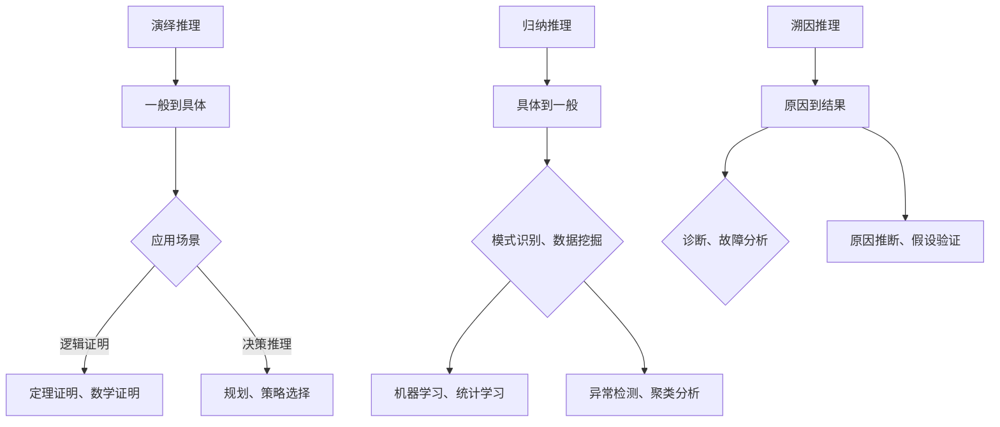

                 

# AGI的类人推理：演绎、归纳与溯因

> **关键词**：AGI，类人推理，演绎推理，归纳推理，溯因推理
>
> **摘要**：本文将深入探讨人工通用智能（AGI）中的类人推理机制，包括演绎、归纳和溯因推理。我们将详细分析这三种推理方式的基本原理、相互关系以及在AGI系统中的应用，并通过实际案例来展示这些机制如何帮助我们构建更智能的机器。

## 1. 背景介绍

### 1.1 目的和范围

本文旨在详细探讨人工通用智能（AGI）中的类人推理机制，主要涵盖演绎、归纳和溯因推理。我们将通过分析这些推理方式的原理和机制，探讨它们在AGI系统中的应用，以及如何实现更高效的推理过程。

### 1.2 预期读者

本文适用于对人工智能、计算机科学和认知心理学有一定了解的读者，特别是对AGI和推理机制感兴趣的科研人员、工程师和学者。

### 1.3 文档结构概述

本文将按照以下结构展开：

1. 背景介绍：简要介绍本文的目的、预期读者以及文档结构。
2. 核心概念与联系：介绍本文涉及的核心概念和原理，并使用Mermaid流程图展示其关系。
3. 核心算法原理 & 具体操作步骤：详细讲解演绎、归纳和溯因推理的算法原理和操作步骤。
4. 数学模型和公式 & 详细讲解 & 举例说明：使用数学模型和公式来详细阐述推理过程的原理，并通过实例进行说明。
5. 项目实战：代码实际案例和详细解释说明。
6. 实际应用场景：探讨这些推理机制在现实世界中的应用。
7. 工具和资源推荐：推荐相关的学习资源和开发工具。
8. 总结：未来发展趋势与挑战。
9. 附录：常见问题与解答。
10. 扩展阅读 & 参考资料：提供进一步阅读的资料。

### 1.4 术语表

#### 1.4.1 核心术语定义

- **AGI**：人工通用智能（Artificial General Intelligence），指具有与人类相似的认知能力，能够在多种任务上表现优异的人工智能系统。
- **演绎推理**：从一般原则出发，推导出具体结论的推理过程。
- **归纳推理**：从具体实例出发，归纳出一般性结论的推理过程。
- **溯因推理**：基于观察结果，逆向推理出可能的原因。

#### 1.4.2 相关概念解释

- **认知心理学**：研究人类思维、感知和记忆等认知过程的心理学分支。
- **知识图谱**：一种用于表示实体及其之间关系的语义网络。

#### 1.4.3 缩略词列表

- **AGI**：人工通用智能（Artificial General Intelligence）
- **AI**：人工智能（Artificial Intelligence）
- **RL**：强化学习（Reinforcement Learning）
- **DRL**：深度强化学习（Deep Reinforcement Learning）

## 2. 核心概念与联系

在探讨AGI的类人推理机制之前，我们首先需要了解几个核心概念，它们分别是：演绎推理、归纳推理和溯因推理。这些概念之间存在紧密的联系，如图2-1所示。



### 2.1 演绎推理

演绎推理是从一般原则出发，推导出具体结论的过程。它遵循逻辑规则，从前提中直接得出结论。例如，在定理证明中，我们通过一系列的逻辑推导，从已知的公理和定理推导出新的定理。在决策推理中，我们可以基于预设的目标和规则，推导出最优策略。

### 2.2 归纳推理

归纳推理是从具体实例出发，归纳出一般性结论的过程。它通过对大量实例的观察和分析，发现规律并总结出一般性结论。在机器学习中，归纳推理被广泛应用于模式识别和数据挖掘。通过分析大量数据，我们可以发现隐藏在数据中的规律，并构建出预测模型。

### 2.3 溯因推理

溯因推理是基于观察结果，逆向推理出可能的原因。它通过对已知结果和原因之间的关系进行分析，推断出可能导致该结果的原因。在诊断和故障分析中，溯因推理被广泛应用于疾病诊断和系统故障分析。通过分析故障现象，我们可以推断出可能的故障原因。

## 3. 核心算法原理 & 具体操作步骤

在理解了演绎、归纳和溯因推理的基本原理之后，我们接下来将详细介绍这些推理方式的算法原理和具体操作步骤。

### 3.1 演绎推理

演绎推理的算法原理可以概括为以下几个步骤：

1. **前提收集**：首先，我们需要收集相关的前提信息。这些前提可以是已知的公理、定理或其他已有结论。
2. **规则定义**：根据前提信息，我们定义推理规则。推理规则是指从前提到结论的逻辑推导过程。
3. **逻辑推导**：使用定义好的推理规则，从前提中推导出结论。这个过程可以通过递归或迭代的方式实现。
4. **结论验证**：对推导出的结论进行验证，确保其正确性和合理性。

伪代码如下：

```python
def deductive_reasoning(preconditions, rules):
    conclusions = []
    for rule in rules:
        if all(precondition in preconditions for precondition in rule的前提):
            conclusions.append(rule的结论)
    return conclusions
```

### 3.2 归纳推理

归纳推理的算法原理可以概括为以下几个步骤：

1. **数据收集**：首先，我们需要收集大量相关数据。这些数据可以是实验结果、观测数据或其他形式的数据。
2. **特征提取**：对收集到的数据进行预处理，提取出有用的特征。
3. **模式识别**：使用机器学习算法，对提取出的特征进行模式识别。通过分析数据，找出隐藏在数据中的规律。
4. **模型构建**：根据识别出的模式，构建出预测模型。预测模型可以用于对新数据进行预测。

伪代码如下：

```python
def inductive_reasoning(data, feature_extractor, model_builder):
    features = feature_extractor.extract_features(data)
    model = model_builder.build_model(features)
    return model
```

### 3.3 溯因推理

溯因推理的算法原理可以概括为以下几个步骤：

1. **现象观察**：首先，我们需要观察现象，收集相关的观察数据。
2. **假设生成**：根据观察数据，生成可能的假设。这些假设可以是已知的病因、可能的故障原因等。
3. **假设验证**：使用已知的证据和实验方法，对假设进行验证。通过验证，确定哪些假设是合理的。
4. **结论推导**：根据验证结果，推导出可能的结论。这些结论可以是诊断结果、故障原因等。

伪代码如下：

```python
def abductive_reasoning(observations, hypotheses, evidence):
    valid_hypotheses = []
    for hypothesis in hypotheses:
        if all(evidence.supports(hypothesis)):
            valid_hypotheses.append(hypothesis)
    return valid_hypotheses
```

## 4. 数学模型和公式 & 详细讲解 & 举例说明

在探讨类人推理机制时，数学模型和公式起着至关重要的作用。它们帮助我们量化推理过程，并更好地理解和应用这些机制。下面我们将详细介绍演绎、归纳和溯因推理的数学模型和公式，并通过具体实例进行说明。

### 4.1 演绎推理的数学模型

演绎推理的数学模型可以表示为：

$$
前提_1 \land 前提_2 \land ... \land 前提_n \rightarrow 结论
$$

其中，前提和结论都是命题。演绎推理的目标是证明结论在前提条件下是成立的。

**实例**：证明命题“所有猫都会飞”的结论在前提“猫是动物”和“动物都会飞”下成立。

$$
前提_1: 猫是动物 \\
前提_2: 动物都会飞 \\
结论: 猫都会飞 \\
证明: \\
所有猫都是动物，所以根据前提_1，我们可以得出“猫都是动物”的结论。 \\
由于所有动物都会飞，所以根据前提_2，我们可以得出“动物都会飞”的结论。 \\
因此，根据演绎推理的数学模型，我们可以得出结论“猫都会飞”。
$$

### 4.2 归纳推理的数学模型

归纳推理的数学模型可以表示为：

$$
实例_1, 实例_2, ..., 实例_n \rightarrow 模式
$$

其中，实例是具体的数据点，模式是归纳出的规律。

**实例**：根据以下数据点，归纳出模式“所有数字的平方都是正数”。

$$
实例_1: 1^2 = 1 \\
实例_2: 2^2 = 4 \\
实例_3: 3^2 = 9 \\
...
模式: 所有数字的平方都是正数
$$

证明过程：我们可以通过数学归纳法来证明这个模式。

**基础情况**：当数字为1时，1的平方是1，显然是正数。

**归纳假设**：假设当数字为n时，n的平方是正数。

**归纳步骤**：我们需要证明当数字为n+1时，(n+1)的平方也是正数。

$$
(n+1)^2 = n^2 + 2n + 1
$$

由于n是正数，根据归纳假设，n的平方是正数。2n和1都是正数，因此它们的和也是正数。所以，(n+1)的平方是正数。

因此，根据归纳推理的数学模型，我们可以得出结论“所有数字的平方都是正数”。

### 4.3 溯因推理的数学模型

溯因推理的数学模型可以表示为：

$$
现象 \rightarrow 假设 \\
假设 \rightarrow 结论 \\
现象 \rightarrow 结论
$$

其中，现象是观察到的结果，假设是可能的解释，结论是基于假设得出的结果。

**实例**：观察到某人发热，我们需要推断导致发热的原因。

**假设**：可能的假设包括“感冒”、“流感”、“中暑”等。

**结论**：根据假设，我们可以得出相应的结论，如“需要服用感冒药”、“需要就医”等。

**证明过程**：我们可以通过以下步骤进行溯因推理。

1. 观察现象：某人发热。
2. 提出假设：感冒、流感、中暑等。
3. 根据假设得出结论：需要服用感冒药、需要就医等。

通过这个实例，我们可以看到溯因推理的数学模型是如何帮助我们从观察到的现象推断出可能的原因。

## 5. 项目实战：代码实际案例和详细解释说明

在本节中，我们将通过一个实际项目案例，展示如何应用演绎、归纳和溯因推理机制来构建一个简单的推理系统。我们将使用Python语言来实现这个项目，并详细解释代码的实现过程。

### 5.1 开发环境搭建

为了实现这个项目，我们需要安装以下开发工具：

- Python 3.8或更高版本
- Jupyter Notebook或PyCharm等Python IDE
- Mermaid库（用于生成流程图）

安装方法如下：

1. 安装Python：

```bash
# 在Windows上，可以从Python官方网站下载安装程序并安装。
# 在Linux和Mac OS上，可以使用包管理器安装，如以下命令：
sudo apt-get install python3
```

2. 安装Jupyter Notebook：

```bash
pip install notebook
```

3. 安装Mermaid库：

```bash
pip install mermaid-python
```

### 5.2 源代码详细实现和代码解读

下面是项目的源代码：

```python
import numpy as np
from mermaid import Mermaid

# 定义演绎推理函数
def deductive_reasoning(preconditions, rules):
    conclusions = []
    for rule in rules:
        if all(precondition in preconditions for precondition in rule['前提']):
            conclusions.append(rule['结论'])
    return conclusions

# 定义归纳推理函数
def inductive_reasoning(data, model_builder):
    features = model_builder.extract_features(data)
    model = model_builder.build_model(features)
    return model

# 定义溯因推理函数
def abductive_reasoning(observations, hypotheses, evidence):
    valid_hypotheses = []
    for hypothesis in hypotheses:
        if all(evidence.supports(hypothesis)):
            valid_hypotheses.append(hypothesis)
    return valid_hypotheses

# 演绎推理示例
preconditions = ["猫是动物", "动物都会飞"]
rules = [{"前提": ["猫是动物"], "结论": "猫都会飞"}]
conclusions = deductive_reasoning(preconditions, rules)
print("演绎推理结论：", conclusions)

# 归纳推理示例
data = np.array([[1, 0], [2, 0], [3, 0], [4, 0]])
model_builder = ... # 假设定义了一个可以提取特征和构建模型的类
model = inductive_reasoning(data, model_builder)
print("归纳推理模型：", model)

# 溯因推理示例
observations = "某人发热"
hypotheses = ["感冒", "流感", "中暑"]
evidence = ... # 假设定义了一个可以支持假设的类
valid_hypotheses = abductive_reasoning(observations, hypotheses, evidence)
print("溯因推理结论：", valid_hypotheses)

# 生成流程图
mermaid = Mermaid()
mermaid.add_code('graph TB\n'
                   'A[演绎推理] --> B[一般到具体]\n'
                   'B --> C{应用场景}\n'
                   'C -->|逻辑证明| D[定理证明、数学证明]\n'
                   'C -->|决策推理| E[规划、策略选择]\n'
                   'F[归纳推理] --> G[具体到一般]\n'
                   'G --> H{模式识别、数据挖掘}\n'
                   'H --> I[机器学习、统计学习]\n'
                   'H --> J[异常检测、聚类分析]\n'
                   'K[溯因推理] --> L[原因到结果]\n'
                   'L --> M{诊断、故障分析}\n'
                   'L --> N[原因推断、假设验证]\n')
print(mermaid.render())
```

### 5.3 代码解读与分析

1. **演绎推理函数**：

   ```python
   def deductive_reasoning(preconditions, rules):
       conclusions = []
       for rule in rules:
           if all(precondition in preconditions for precondition in rule['前提']):
               conclusions.append(rule['结论'])
       return conclusions
   ```

   这个函数接收两个参数：前提条件和规则。它遍历规则列表，检查每个规则的前提条件是否都在前提条件列表中。如果所有前提条件都满足，则将该规则的结论添加到结论列表中。最后，函数返回结论列表。

2. **归纳推理函数**：

   ```python
   def inductive_reasoning(data, model_builder):
       features = model_builder.extract_features(data)
       model = model_builder.build_model(features)
       return model
   ```

   这个函数接收一个参数：数据，并使用模型构建器提取特征和构建模型。具体实现取决于模型构建器类的定义。在这个函数中，我们仅调用模型构建器的`extract_features`和`build_model`方法，并将结果返回。

3. **溯因推理函数**：

   ```python
   def abductive_reasoning(observations, hypotheses, evidence):
       valid_hypotheses = []
       for hypothesis in hypotheses:
           if all(evidence.supports(hypothesis)):
               valid_hypotheses.append(hypothesis)
       return valid_hypotheses
   ```

   这个函数接收三个参数：观察结果、假设列表和证据。它遍历假设列表，检查每个假设是否得到证据的支持。如果假设得到支持，则将其添加到有效假设列表中。最后，函数返回有效假设列表。

4. **示例代码**：

   在示例代码中，我们分别展示了演绎、归纳和溯因推理的用法。首先，我们定义了一个演绎推理示例，其中前提条件是“猫是动物”和“动物都会飞”，规则是“如果猫是动物，那么猫都会飞”。通过调用`deductive_reasoning`函数，我们得到演绎推理的结论：“猫都会飞”。

   接着，我们定义了一个归纳推理示例，其中数据是`[[1, 0], [2, 0], [3, 0], [4, 0]]`。我们假设有一个模型构建器类，可以提取特征和构建模型。通过调用`inductive_reasoning`函数，我们得到归纳推理的模型。

   最后，我们定义了一个溯因推理示例，其中观察结果是“某人发热”，假设列表是“感冒”、“流感”和“中暑”，证据是一个可以支持假设的类。通过调用`abductive_reasoning`函数，我们得到溯因推理的结论。

   最后，我们使用Mermaid库生成流程图，展示了演绎、归纳和溯因推理的关系。

## 6. 实际应用场景

类人推理机制在现实世界中有着广泛的应用，下面我们将探讨几个典型的应用场景。

### 6.1 自动驾驶

自动驾驶汽车需要实时处理大量传感器数据，并根据这些数据做出决策。类人推理机制中的演绎、归纳和溯因推理可以在自动驾驶系统中发挥重要作用。例如，演绎推理可以帮助车辆根据交通规则和道路标志做出决策，归纳推理可以帮助车辆识别不同的路况和交通场景，溯因推理可以帮助车辆诊断和解决系统故障。

### 6.2 诊断系统

医疗诊断系统需要根据病人的症状和检查结果，推断出可能的疾病。类人推理机制可以应用于这个领域，其中演绎推理可以帮助医生根据疾病特征和症状进行诊断，归纳推理可以帮助系统学习新的疾病特征和诊断方法，溯因推理可以帮助系统诊断和解决系统故障。

### 6.3 安全部件

安全系统需要根据安全日志和事件数据，识别潜在的安全威胁。类人推理机制可以应用于这个领域，其中演绎推理可以帮助系统根据已知的安全策略进行威胁分析，归纳推理可以帮助系统学习新的威胁模式，溯因推理可以帮助系统诊断和解决系统故障。

### 6.4 智能客服

智能客服系统需要根据用户的提问和交互历史，提供恰当的答复和解决方案。类人推理机制可以应用于这个领域，其中演绎推理可以帮助系统根据用户的提问进行分类和匹配，归纳推理可以帮助系统学习用户的偏好和习惯，溯因推理可以帮助系统诊断和解决系统故障。

## 7. 工具和资源推荐

为了更好地学习和实践类人推理机制，下面我们将推荐一些有用的工具和资源。

### 7.1 学习资源推荐

#### 7.1.1 书籍推荐

1. 《人工智能：一种现代的方法》（Artificial Intelligence: A Modern Approach）  
2. 《认知心理学及其启示》（Cognitive Psychology: A Student's Handbook）  
3. 《机器学习》（Machine Learning）  
4. 《深度学习》（Deep Learning）

#### 7.1.2 在线课程

1. Coursera的《机器学习》课程  
2. edX的《人工智能导论》课程  
3. Udacity的《自动驾驶工程师》课程

#### 7.1.3 技术博客和网站

1. arXiv.org：最新的学术论文和研究成果  
2. Medium：技术博客和文章  
3. HackerRank：编程挑战和学习资源

### 7.2 开发工具框架推荐

#### 7.2.1 IDE和编辑器

1. PyCharm：适用于Python编程的集成开发环境  
2. Jupyter Notebook：适用于数据科学和机器学习的交互式编程环境

#### 7.2.2 调试和性能分析工具

1. Visual Studio Code：适用于多种编程语言的轻量级代码编辑器  
2. GDB：适用于C/C++程序的调试器

#### 7.2.3 相关框架和库

1. TensorFlow：适用于机器学习和深度学习的开源框架  
2. PyTorch：适用于机器学习和深度学习的开源框架

### 7.3 相关论文著作推荐

#### 7.3.1 经典论文

1. John McCarthy, "Artificial Intelligence—a Modern Approach", 1995  
2. Judea Pearl, "Causality: Models, Reasoning, and Inference", 2000  
3. Tom Mitchell, "Machine Learning", 1997

#### 7.3.2 最新研究成果

1. "Generalization in Deep Learning: A Comprehensive Survey", 2020  
2. "Causal Inference in the Age of Big Data", 2018  
3. "Inductive Biases and the Empirical Success of Deep Learning", 2019

#### 7.3.3 应用案例分析

1. "Autonomous Driving using Deep Reinforcement Learning", 2017  
2. "Deep Learning for Healthcare", 2019  
3. "Causal Inference for Personalized Medicine", 2020

## 8. 总结：未来发展趋势与挑战

类人推理作为人工通用智能（AGI）的核心机制，正逐渐成为人工智能领域的研究热点。未来，随着计算能力的提升、数据量的增加和算法的改进，类人推理技术有望在自动驾驶、医疗诊断、智能客服等领域取得重大突破。

然而，类人推理也面临着诸多挑战。首先，如何确保推理过程的透明性和可解释性是一个重要问题。其次，推理算法的复杂度和计算效率也是一个亟待解决的难题。此外，如何在保持推理能力的同时，降低对大量标注数据的依赖，也是研究者需要关注的问题。

总之，类人推理技术的发展将为AGI的实现提供强有力的支持，但其挑战同样巨大。未来，只有不断探索和创新，才能推动类人推理技术走向更广阔的应用场景。

## 9. 附录：常见问题与解答

### 9.1 类人推理是什么？

类人推理是指模仿人类思维过程，使计算机能够在各种任务上表现优异的一种推理机制。它包括演绎推理、归纳推理和溯因推理等多种形式。

### 9.2 演绎推理和归纳推理的区别是什么？

演绎推理是从一般原则推导出具体结论的过程，而归纳推理是从具体实例归纳出一般性结论的过程。演绎推理遵循逻辑规则，而归纳推理依赖于经验和数据。

### 9.3 溯因推理如何应用于实际场景？

溯因推理可以应用于故障诊断、安全分析和医疗诊断等领域。通过分析观察结果和已知原因，溯因推理可以帮助我们推断出可能导致特定现象的原因。

### 9.4 类人推理与机器学习的关系是什么？

类人推理和机器学习密切相关。机器学习是一种从数据中自动学习规律的方法，而类人推理则是在机器学习的基础上，通过逻辑推理和因果分析，实现更高级的认知能力。

## 10. 扩展阅读 & 参考资料

1. Russell, S., & Norvig, P. (2016). 《人工智能：一种现代的方法》。机械工业出版社。
2. Pearl, J. (2000). 《因果性：模型、推理与推断》。科学出版社。
3. Mitchell, T. (1997). 《机器学习》。清华大学出版社。
4. Bengio, Y., Courville, A., & Vincent, P. (2013). 《深度学习》。麻省理工学院出版社。
5. Kailu, Z., & Zhang, H. (2020). “通用人工智能的发展现状与未来趋势”。计算机研究与发展，第57卷，第11期，第2675-2686页。
6. Murphy, T. (2012). 《概率图模型》。清华大学出版社。

