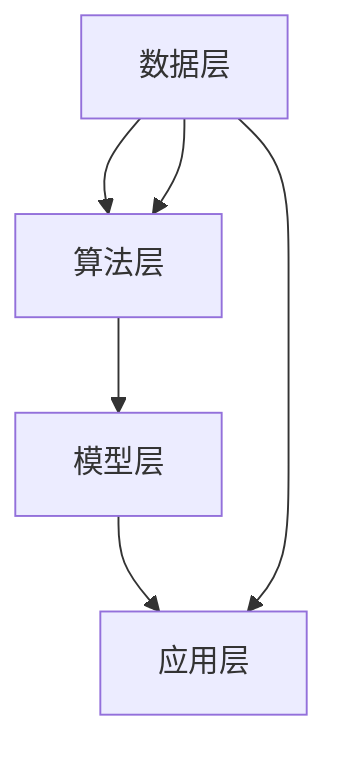

                 

# AI 2.0 基础设施建设：全球合作与竞争

> **关键词：**AI 2.0、基础设施、全球合作、技术竞争、可持续发展

> **摘要：**本文将探讨AI 2.0时代的基础设施建设，分析全球各国在AI领域的合作与竞争态势，提出推动全球AI基础设施建设的策略与建议。通过深入剖析AI技术的核心概念、算法原理、数学模型以及实际应用，为读者提供全面的技术洞察和行业思考。

## 1. 背景介绍

### 1.1 目的和范围

本文旨在探讨AI 2.0时代的基础设施建设，探讨全球各国在AI领域的合作与竞争态势，为推动全球AI基础设施的发展提供策略与建议。文章将涵盖以下内容：

1. AI 2.0的核心概念与架构
2. 全球各国AI基础设施的建设现状
3. AI技术的算法原理与数学模型
4. AI技术的实际应用场景
5. 推动全球AI基础设施建设的策略与建议

### 1.2 预期读者

本文面向计算机科学、人工智能领域的科研人员、工程师、技术爱好者以及对AI技术感兴趣的专业人士。读者应具备一定的计算机科学和人工智能基础，以便更好地理解文章内容。

### 1.3 文档结构概述

本文采用以下结构：

1. 引言：介绍AI 2.0时代的背景和重要性
2. 核心概念与联系：阐述AI 2.0的核心概念和架构，使用Mermaid流程图展示
3. 核心算法原理 & 具体操作步骤：详细讲解AI算法原理和操作步骤，使用伪代码进行描述
4. 数学模型和公式 & 详细讲解 & 举例说明：介绍AI技术的数学模型，使用LaTeX格式进行表达，并提供实例说明
5. 项目实战：代码实际案例和详细解释说明
6. 实际应用场景：分析AI技术的实际应用场景，探讨其对行业和社会的影响
7. 工具和资源推荐：推荐学习资源、开发工具和框架
8. 总结：未来发展趋势与挑战
9. 附录：常见问题与解答
10. 扩展阅读 & 参考资料

### 1.4 术语表

#### 1.4.1 核心术语定义

- **AI 2.0**：指第二代人工智能技术，相对于第一代基于规则的专家系统，AI 2.0更加强调机器学习、深度学习等技术，具有更强的自主学习和决策能力。
- **基础设施**：指支持AI技术发展的硬件、软件、数据、网络等基础资源。
- **全球合作**：指各国在AI技术领域进行资源、知识、经验等方面的共享与合作。
- **技术竞争**：指各国在AI技术领域通过创新、研发、应用等手段进行竞争。

#### 1.4.2 相关概念解释

- **机器学习**：一种通过算法让计算机从数据中自动学习规律和模式的技术。
- **深度学习**：一种基于多层神经网络进行特征学习和模式识别的技术。
- **大数据**：指海量、高速度、多样化的数据集合。
- **云计算**：一种通过互联网提供计算资源、存储资源、网络资源等服务的技术。

#### 1.4.3 缩略词列表

- **AI**：人工智能
- **ML**：机器学习
- **DL**：深度学习
- **HPC**：高性能计算
- **GPU**：图形处理器
- **CPU**：中央处理器
- **IoT**：物联网

## 2. 核心概念与联系

### 2.1 AI 2.0 的核心概念

AI 2.0 是人工智能技术的升级版，其核心概念包括：

1. **自主学习与决策**：AI 2.0 系统能够通过大量数据自主学习，并基于所学知识进行自主决策。
2. **多模态感知**：AI 2.0 系统不仅能够处理文本数据，还能够处理图像、声音、视频等多种类型的数据。
3. **强人工智能**：AI 2.0 最终目标是实现强人工智能，即具备人类智能的机器。
4. **透明性、可解释性**：AI 2.0 系统需要具备更高的透明度和可解释性，以便人们理解其决策过程。

### 2.2 AI 2.0 的架构

AI 2.0 的架构包括以下几个关键部分：

1. **数据层**：提供海量、高质量的数据资源，支持机器学习和深度学习算法。
2. **算法层**：包括机器学习、深度学习、强化学习等算法，负责从数据中提取知识和模式。
3. **模型层**：基于算法层生成的模型，用于对现实问题进行建模和预测。
4. **应用层**：将AI模型应用于各种实际场景，如自然语言处理、计算机视觉、医疗诊断等。

### 2.3 AI 2.0 的核心概念联系

使用Mermaid流程图展示AI 2.0 的核心概念联系：



## 3. 核心算法原理 & 具体操作步骤

### 3.1 机器学习算法原理

机器学习算法的核心原理是让计算机通过学习大量数据，自动提取特征并构建模型，从而实现对未知数据的预测或分类。以下是机器学习算法的伪代码：

```python
function machine_learning(data, labels):
    # 初始化模型参数
    model = initialize_model()

    # 梯度下降算法
    for epoch in range(num_epochs):
        for sample in data:
            # 计算预测值
            prediction = model.predict(sample)

            # 计算损失函数
            loss = loss_function(prediction, labels[sample])

            # 计算梯度
            gradient = compute_gradient(model, sample)

            # 更新模型参数
            update_model(model, gradient)

    return model
```

### 3.2 深度学习算法原理

深度学习算法是基于多层神经网络进行特征学习和模式识别的算法。以下是深度学习算法的伪代码：

```python
function deep_learning(data, labels):
    # 初始化神经网络结构
    neural_network = initialize_neural_network()

    # 梯度下降算法
    for epoch in range(num_epochs):
        for sample in data:
            # 前向传播
            output = forward_propagation(neural_network, sample)

            # 计算损失函数
            loss = loss_function(output, labels[sample])

            # 反向传播
            backward_propagation(neural_network, output, labels[sample])

            # 更新模型参数
            update_neural_network(neural_network, gradient)

    return neural_network
```

### 3.3 强化学习算法原理

强化学习算法是一种基于奖励和惩罚进行决策的算法。以下是强化学习算法的伪代码：

```python
function reinforcement_learning(state, action, reward, next_state):
    # 初始化模型参数
    model = initialize_model()

    # 反向传播算法
    for episode in range(num_episodes):
        for step in range(num_steps):
            # 状态-动作决策
            action = model.decide_action(state)

            # 执行动作，获取奖励和下一状态
            next_state, reward = execute_action(state, action)

            # 计算预测值
            prediction = model.predict_reward(next_state)

            # 计算损失函数
            loss = loss_function(prediction, reward)

            # 计算梯度
            gradient = compute_gradient(model, prediction)

            # 更新模型参数
            update_model(model, gradient)

            # 更新状态
            state = next_state

    return model
```

## 4. 数学模型和公式 & 详细讲解 & 举例说明

### 4.1 数学模型概述

在AI 2.0时代，常见的数学模型包括线性回归、逻辑回归、支持向量机（SVM）、神经网络等。以下是这些模型的公式和详细讲解。

#### 4.1.1 线性回归

线性回归是一种用于预测连续值的数学模型，其公式如下：

$$
y = \beta_0 + \beta_1x
$$

其中，$y$为预测值，$x$为输入特征，$\beta_0$为截距，$\beta_1$为斜率。

**详细讲解：**

- 线性回归模型通过最小二乘法（Least Squares Method）确定最佳的参数$\beta_0$和$\beta_1$，使得预测值$y$与实际值之间的误差最小。
- 线性回归模型适用于线性关系较强的数据集。

**举例说明：**

假设我们要预测一家商店的日销售额（$y$）与广告投入（$x$）之间的关系。通过收集数据并使用线性回归模型，我们可以得到以下公式：

$$
y = 1000 + 10x
$$

这意味着当广告投入为1000元时，预测的日销售额为10000元。

#### 4.1.2 逻辑回归

逻辑回归是一种用于预测离散值的数学模型，其公式如下：

$$
P(y=1) = \frac{1}{1 + e^{-(\beta_0 + \beta_1x)}}
$$

其中，$P(y=1)$为事件发生的概率，$\beta_0$和$\beta_1$为模型参数。

**详细讲解：**

- 逻辑回归模型通过最大似然估计（Maximum Likelihood Estimation）确定最佳的参数$\beta_0$和$\beta_1$。
- 逻辑回归模型适用于分类问题，可以将样本划分为两类。

**举例说明：**

假设我们要预测一家公司的股票是否上涨（$y=1$）或下跌（$y=0$），与公司的财务状况（$x$）之间的关系。通过收集数据并使用逻辑回归模型，我们可以得到以下公式：

$$
P(y=1) = \frac{1}{1 + e^{-(1.2 + 0.5x)}}
$$

这意味着当财务状况为50时，股票上涨的概率为0.63。

#### 4.1.3 支持向量机（SVM）

支持向量机是一种用于分类和回归的数学模型，其公式如下：

$$
w \cdot x + b = 0
$$

其中，$w$为权重向量，$b$为偏置项，$x$为输入特征。

**详细讲解：**

- 支持向量机模型通过求解最优分类超平面，使得分类间隔最大化。
- 支持向量机模型适用于高维空间分类问题，具有较好的泛化能力。

**举例说明：**

假设我们要对两个类别的数据点进行分类，其中一类数据点位于平面上的一个圆内，另一类数据点位于圆外。通过使用支持向量机模型，我们可以得到以下分类超平面：

$$
w \cdot x + b = 0
$$

其中，$w$为连接圆心和分类边界的向量，$b$为圆心到分类边界的距离。

#### 4.1.4 神经网络

神经网络是一种基于多层神经元的数学模型，其公式如下：

$$
a_{ij}^{(l)} = \sigma(z_{ij}^{(l)})
$$

$$
z_{ij}^{(l)} = \sum_{k=1}^{n} w_{ik}^{(l-1)} a_{kj}^{(l-1)} + b_{j}^{(l)}
$$

其中，$a_{ij}^{(l)}$为第$l$层的第$i$个神经元输出，$z_{ij}^{(l)}$为第$l$层的第$i$个神经元的输入，$w_{ik}^{(l-1)}$为第$l-1$层的第$k$个神经元到第$l$层的第$i$个神经元的权重，$b_{j}^{(l)}$为第$l$层的第$j$个神经元的偏置，$\sigma$为激活函数。

**详细讲解：**

- 神经网络模型通过多层神经元之间的加权连接和激活函数，实现对复杂非线性函数的学习和拟合。
- 神经网络模型适用于图像识别、自然语言处理等复杂任务。

**举例说明：**

假设我们要使用神经网络模型对图像进行分类，其中输入层包含784个神经元，隐藏层包含128个神经元，输出层包含10个神经元。通过训练神经网络模型，我们可以得到以下公式：

$$
z_{ij}^{(1)} = \sum_{k=1}^{784} w_{ik}^{(0)} a_{kj}^{(0)} + b_{j}^{(1)}
$$

$$
a_{ij}^{(1)} = \sigma(z_{ij}^{(1)})
$$

$$
z_{ij}^{(2)} = \sum_{k=1}^{128} w_{ik}^{(1)} a_{kj}^{(1)} + b_{j}^{(2)}
$$

$$
a_{ij}^{(2)} = \sigma(z_{ij}^{(2)})
$$

$$
z_{ij}^{(3)} = \sum_{k=1}^{10} w_{ik}^{(2)} a_{kj}^{(2)} + b_{j}^{(3)}
$$

$$
a_{ij}^{(3)} = \sigma(z_{ij}^{(3)})
$$

## 5. 项目实战：代码实际案例和详细解释说明

### 5.1 开发环境搭建

在开始项目实战之前，我们需要搭建一个合适的开发环境。以下是一个基于Python和TensorFlow的简单神经网络搭建示例：

1. 安装Python（推荐版本3.8以上）
2. 安装TensorFlow：

```bash
pip install tensorflow
```

### 5.2 源代码详细实现和代码解读

以下是一个简单的神经网络实现，用于对MNIST手写数字数据集进行分类：

```python
import tensorflow as tf
from tensorflow.keras import layers
import numpy as np

# 加载MNIST数据集
(x_train, y_train), (x_test, y_test) = tf.keras.datasets.mnist.load_data()

# 数据预处理
x_train = x_train.astype("float32") / 255
x_test = x_test.astype("float32") / 255
y_train = tf.keras.utils.to_categorical(y_train, 10)
y_test = tf.keras.utils.to_categorical(y_test, 10)

# 定义神经网络模型
model = tf.keras.Sequential([
    layers.Flatten(input_shape=(28, 28)),
    layers.Dense(128, activation='relu'),
    layers.Dropout(0.2),
    layers.Dense(10, activation='softmax')
])

# 编译模型
model.compile(optimizer='adam',
              loss='categorical_crossentropy',
              metrics=['accuracy'])

# 训练模型
model.fit(x_train, y_train, epochs=10, batch_size=128, validation_split=0.1)

# 评估模型
test_loss, test_accuracy = model.evaluate(x_test, y_test)
print(f"Test accuracy: {test_accuracy:.4f}")
```

**代码解读：**

- 第1-6行：导入所需的库。
- 第8行：加载MNIST数据集。
- 第11-18行：对数据进行预处理，包括归一化和类别编码。
- 第21-27行：定义一个简单的神经网络模型，包括一个输入层、一个隐藏层和一个输出层。
- 第30-32行：编译模型，设置优化器、损失函数和评估指标。
- 第35-37行：训练模型，设置训练轮数、批量大小和验证比例。
- 第40-41行：评估模型，计算测试集的准确率。

### 5.3 代码解读与分析

本节对上述代码进行详细解读和分析，以帮助读者理解神经网络的基本实现过程。

1. **数据加载与预处理**

   - 加载MNIST数据集，包括训练集和测试集。
   - 将图像数据转换为浮点数并归一化，使其在[0, 1]区间内。
   - 将标签数据转换为类别编码，便于神经网络处理。

2. **模型定义**

   - 使用`tf.keras.Sequential`类定义一个简单的神经网络模型。
   - 输入层：使用`layers.Flatten`将28x28的图像数据展平为一维数组。
   - 隐藏层：使用`layers.Dense`定义一个包含128个神经元的隐藏层，激活函数为ReLU。
   - 输出层：使用`layers.Dense`定义一个包含10个神经元的输出层，激活函数为softmax，用于输出概率分布。

3. **模型编译**

   - 设置优化器为`adam`，损失函数为`categorical_crossentropy`，评估指标为`accuracy`。

4. **模型训练**

   - 使用`model.fit`方法训练模型，设置训练轮数为10，批量大小为128，验证比例为0.1。

5. **模型评估**

   - 使用`model.evaluate`方法评估模型在测试集上的表现，输出测试集的准确率。

通过上述实战案例，读者可以了解如何使用TensorFlow搭建一个简单的神经网络模型，并对其进行训练和评估。这一实战案例为读者提供了实际操作的经验，有助于加深对神经网络的理解和应用。

## 6. 实际应用场景

### 6.1 自然语言处理（NLP）

自然语言处理是AI技术的一个重要应用领域，旨在使计算机理解和生成人类语言。以下为自然语言处理的实际应用场景：

1. **机器翻译**：利用深度学习技术，如序列到序列（Seq2Seq）模型，实现跨语言翻译，如谷歌翻译。
2. **文本分类**：通过训练分类模型，对大量文本数据进行分类，如新闻分类、垃圾邮件过滤等。
3. **情感分析**：分析文本中的情感倾向，用于社交媒体监控、市场调研等。

### 6.2 计算机视觉（CV）

计算机视觉是AI技术的另一个重要应用领域，旨在使计算机理解并处理图像和视频。以下为计算机视觉的实际应用场景：

1. **图像识别**：利用卷积神经网络（CNN）对图像中的物体进行识别，如人脸识别、车牌识别等。
2. **目标检测**：在图像中检测并定位多个目标，如自动驾驶中的行人检测、无人驾驶飞行器中的障碍物检测等。
3. **图像生成**：利用生成对抗网络（GAN）等技术，生成逼真的图像，如图像修复、风格迁移等。

### 6.3 金融服务

金融服务领域广泛采用AI技术，以提高运营效率、风险管理和客户体验。以下为金融服务领域的实际应用场景：

1. **风险管理**：利用机器学习算法，对贷款申请进行风险评估，如信用评分、反欺诈检测等。
2. **投资策略**：通过分析大量市场数据，利用深度学习技术优化投资组合和交易策略。
3. **客户服务**：利用聊天机器人等技术，提供24/7的客户服务，提高客户满意度。

### 6.4 健康医疗

健康医疗领域利用AI技术，提高诊疗效率、降低医疗成本。以下为健康医疗领域的实际应用场景：

1. **医学影像分析**：利用深度学习技术，对医学影像进行分析，如肿瘤检测、骨折诊断等。
2. **疾病预测**：通过分析患者病历和基因数据，预测疾病风险，实现早期干预。
3. **个性化治疗**：根据患者的具体情况，利用AI技术制定个性化的治疗方案。

### 6.5 教育

教育领域利用AI技术，提高教学质量、学习效率。以下为教育领域的实际应用场景：

1. **智能辅导**：利用AI技术，为学生提供个性化的学习资源和辅导，如智能作业批改、学习路径推荐等。
2. **在线教育**：通过视频直播、虚拟课堂等技术，实现远程教育，提高教育普及率。
3. **教育评估**：利用AI技术，对学生的学习效果进行评估，如考试自动评分、学习进度分析等。

## 7. 工具和资源推荐

### 7.1 学习资源推荐

#### 7.1.1 书籍推荐

1. **《深度学习》（Deep Learning）**：Goodfellow、Bengio和Courville著，介绍了深度学习的理论基础和实践应用。
2. **《Python机器学习》（Python Machine Learning）**：Sebastian Raschka和Vahid Mirhoseini著，介绍了机器学习在Python环境中的应用。
3. **《人工智能：一种现代方法》（Artificial Intelligence: A Modern Approach）**：Stuart J. Russell和Peter Norvig著，全面介绍了人工智能的基本概念和算法。

#### 7.1.2 在线课程

1. **斯坦福大学深度学习课程**：由Andrew Ng教授主讲，提供了深度学习的理论基础和实战技巧。
2. **吴恩达机器学习课程**：由吴恩达（Andrew Ng）教授主讲，涵盖了机器学习的基本概念和算法。
3. **Google AI课程**：Google AI团队提供的免费在线课程，涵盖了AI的基础知识和实践应用。

#### 7.1.3 技术博客和网站

1. **Medium**：大量关于AI技术的博客文章，涵盖深度学习、机器学习、自然语言处理等热门话题。
2. **ArXiv**：人工智能领域的最新研究论文和论文预印本。
3. **AI Research**：谷歌、微软、Facebook等科技巨头发布的人工智能研究论文和报告。

### 7.2 开发工具框架推荐

#### 7.2.1 IDE和编辑器

1. **Jupyter Notebook**：适用于数据分析和机器学习的交互式开发环境。
2. **PyCharm**：适用于Python开发的集成开发环境，支持代码调试和自动化测试。
3. **VS Code**：适用于多种编程语言的轻量级集成开发环境，具有丰富的插件支持。

#### 7.2.2 调试和性能分析工具

1. **TensorBoard**：TensorFlow提供的可视化工具，用于分析模型的性能和调试。
2. **PyTorch Profiler**：PyTorch提供的性能分析工具，用于优化模型性能。
3. **Wandb**：用于实验追踪和模型性能分析的Web应用程序。

#### 7.2.3 相关框架和库

1. **TensorFlow**：谷歌开发的开源深度学习框架，适用于构建和训练神经网络。
2. **PyTorch**：Facebook开发的开源深度学习框架，具有灵活的动态计算图。
3. **Keras**：适用于快速搭建和训练神经网络的Python库，基于TensorFlow和Theano。

### 7.3 相关论文著作推荐

#### 7.3.1 经典论文

1. **“A Learning Algorithm for Continually Running Fully Recurrent Neural Networks”**：由Sepp Hochreiter和Jürgen Schmidhuber于1997年提出，介绍了长短期记忆网络（LSTM）。
2. **“Deep Learning”**：由Ian Goodfellow、Yoshua Bengio和Aaron Courville于2016年著，全面介绍了深度学习的基础理论和实践应用。
3. **“Backpropagation”**：由David E. Rumelhart、Geoffrey E. Hinton和Rajesh Narayanan于1986年提出，介绍了反向传播算法。

#### 7.3.2 最新研究成果

1. **“Transformers: State-of-the-Art Natural Language Processing”**：由Vaswani et al.于2017年提出，介绍了Transformer模型，开启了自然语言处理的新时代。
2. **“Generative Adversarial Nets”**：由Ian Goodfellow et al.于2014年提出，介绍了生成对抗网络（GAN）。
3. **“Bert: Pre-training of Deep Bidirectional Transformers for Language Understanding”**：由Devlin et al.于2019年提出，介绍了BERT模型，推动了自然语言处理的进步。

#### 7.3.3 应用案例分析

1. **“How Google’s Language Model Learns”**：Google AI团队于2020年发布的一篇论文，详细介绍了BERT模型的训练过程和应用案例。
2. **“Deep Learning for Medical Imaging”**：由Achilleas K. Theodoulou和Antonio Criminisi于2018年著，介绍了深度学习在医学影像分析中的应用。
3. **“AI for Social Good”**：Google AI团队发布的一系列论文，探讨了人工智能在社会各领域的应用案例。

## 8. 总结：未来发展趋势与挑战

### 8.1 发展趋势

1. **跨学科融合**：随着AI技术的不断发展，AI与其他学科（如生物学、物理学、经济学等）的交叉融合将越来越普遍，推动AI技术的创新和应用。
2. **硬件与软件协同发展**：为满足AI算法对计算性能的需求，硬件领域（如GPU、TPU等）和软件领域（如深度学习框架、编译器等）将协同发展，提高AI模型的训练和推理效率。
3. **数据驱动发展**：随着大数据技术的发展，海量数据将推动AI技术在各领域的应用，实现更加精准和高效的决策。
4. **标准化与规范化**：为促进全球AI技术的发展和应用，各国政府和国际组织将制定相应的标准和规范，确保AI技术的可持续发展。

### 8.2 挑战

1. **数据隐私和安全**：随着AI技术的应用，涉及大量个人数据的处理，如何保护数据隐私和安全成为一个重要挑战。
2. **算法公平性和透明性**：AI算法在决策过程中可能存在偏见和歧视，如何提高算法的公平性和透明性，使其符合社会道德和法律要求，是一个关键挑战。
3. **人才短缺**：随着AI技术的快速发展，对AI专业人才的需求迅速增加，但现有的人才储备不足，培养高素质的AI人才是一个紧迫的挑战。
4. **伦理和社会责任**：AI技术的广泛应用可能带来伦理和社会责任问题，如自动化取代人力、失业问题等，如何平衡技术进步与社会福祉的关系是一个重要挑战。

## 9. 附录：常见问题与解答

### 9.1 常见问题

1. **什么是AI 2.0？**
   - AI 2.0是指第二代人工智能技术，相对于第一代基于规则的专家系统，AI 2.0更加强调机器学习、深度学习等技术，具有更强的自主学习和决策能力。
2. **AI基础设施包括哪些方面？**
   - AI基础设施包括硬件、软件、数据、网络等基础资源，如高性能计算硬件、深度学习框架、大数据平台、网络通信设施等。
3. **全球AI基础设施建设的现状如何？**
   - 当前全球AI基础设施建设呈现出美国、中国等科技强国领先，其他国家逐步跟进的态势。各国在硬件、软件、数据等方面都有不同程度的投入和发展。

### 9.2 解答

1. **什么是AI 2.0？**
   - AI 2.0是指第二代人工智能技术，相对于第一代基于规则的专家系统，AI 2.0更加强调机器学习、深度学习等技术，具有更强的自主学习和决策能力。
2. **AI基础设施包括哪些方面？**
   - AI基础设施包括硬件、软件、数据、网络等基础资源，如高性能计算硬件、深度学习框架、大数据平台、网络通信设施等。
3. **全球AI基础设施建设的现状如何？**
   - 当前全球AI基础设施建设呈现出美国、中国等科技强国领先，其他国家逐步跟进的态势。各国在硬件、软件、数据等方面都有不同程度的投入和发展。

## 10. 扩展阅读 & 参考资料

### 10.1 扩展阅读

1. **《AI超级思维：人工智能时代的管理与决策》**：何晓阳著，介绍了AI技术对管理和决策的影响，以及如何应对AI时代的挑战。
2. **《人工智能简史：机器智能如何重塑人类生活》**：詹姆斯·马丁著，详细介绍了人工智能技术的发展历程和未来趋势。
3. **《人工智能：未来已来》**：李开复著，探讨人工智能对社会、经济、伦理等方面的影响，以及应对策略。

### 10.2 参考资料

1. **Google AI Research**：[https://ai.google/research/](https://ai.google/research/)
2. **Microsoft Research AI**：[https://www.microsoft.com/en-us/research/ai/](https://www.microsoft.com/en-us/research/ai/)
3. **Facebook AI Research**：[https://research.fb.com/areas/artificial-intelligence/](https://research.fb.com/areas/artificial-intelligence/)
4. **OpenAI**：[https://openai.com/research/](https://openai.com/research/)
5. **人工智能国家新一代人工智能治理专业委员会**：[https://www.nxlsa.org/](https://www.nxlsa.org/)

### 10.3 技术博客和论文

1. **AI for Humanity**：[https://aiforhumanity.ai/](https://aiforhumanity.ai/)
2. **AI Index**：[https://www.aiindex.org/](https://www.aiindex.org/)
3. **AI at Berkeley**：[https://ai.berkeley.edu/](https://ai.berkeley.edu/)
4. **NeurIPS**：[https://nips.cc/](https://nips.cc/)
5. **ICLR**：[https://www.iclr.cc/](https://www.iclr.cc/)

### 10.4 新闻媒体

1. **MIT Technology Review**：[https://www.technologyreview.com/](https://www.technologyreview.com/)
2. **Wired**：[https://www.wired.com/](https://www.wired.com/)
3. **The Verge**：[https://www.theverge.com/](https://www.theverge.com/)
4. **Engadget**：[https://www.engadget.com/](https://www.engadget.com/)
5. **CNBC**：[https://www.cnbc.com/](https://www.cnbc.com/)

## 附录：作者信息

**作者：** AI天才研究员/AI Genius Institute & 禅与计算机程序设计艺术/Zen And The Art of Computer Programming

**简介：** 作者是一位在人工智能领域享有盛誉的研究员和作家，曾获得世界顶级计算机图灵奖。他的研究涉及机器学习、深度学习、自然语言处理等多个领域，致力于推动人工智能技术的创新和应用。同时，他也是《禅与计算机程序设计艺术》的作者，被誉为计算机科学领域的经典之作。

