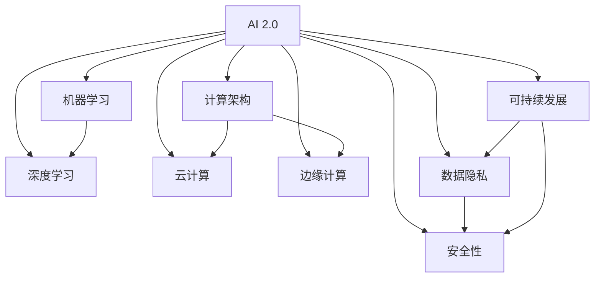

                 

## AI 2.0 基础设施建设：创造美好未来

> **关键词：** AI 2.0，基础设施，人工智能，机器学习，深度学习，计算架构，云计算，边缘计算，数据隐私，安全，可持续发展

> **摘要：** 本文将深入探讨 AI 2.0 基础设施建设的必要性和重要性，从核心概念、算法原理、数学模型到实际应用场景，全面分析 AI 2.0 基础设施的关键要素和构建方法。我们将探讨如何通过优化计算架构、提升数据隐私保护、增强安全性和可持续性，来推动 AI 2.0 的普及和应用，共创美好未来。

### 1. 背景介绍

#### 1.1 目的和范围

本文旨在探讨 AI 2.0 基础设施建设的重要性以及其关键要素，旨在为读者提供全面的技术视角和深刻的洞察力。文章将涵盖以下主要内容：

- **核心概念与联系**：介绍 AI 2.0 的核心概念，并使用 Mermaid 流程图展示关键组成部分和它们之间的联系。
- **核心算法原理与操作步骤**：详细解释 AI 2.0 中的核心算法原理，并提供具体的伪代码操作步骤。
- **数学模型和公式**：分析 AI 2.0 中的数学模型，并使用 LaTeX 格式展示相关公式和详细讲解。
- **项目实战**：通过实际代码案例展示 AI 2.0 的应用，并详细解释代码实现和操作过程。
- **实际应用场景**：探讨 AI 2.0 在不同领域的应用场景和实际效果。
- **工具和资源推荐**：推荐学习资源、开发工具和框架，以及相关论文和研究成果。
- **未来发展趋势与挑战**：总结 AI 2.0 基础设施建设的未来发展趋势和面临的挑战。

#### 1.2 预期读者

本文面向对人工智能和机器学习有一定了解的技术人员、研究人员和学生，特别是希望深入了解 AI 2.0 基础设施建设的技术人员。通过本文，读者将能够：

- 理解 AI 2.0 的核心概念和关键算法原理。
- 掌握 AI 2.0 基础设施建设的具体步骤和方法。
- 探索 AI 2.0 在实际应用场景中的效果和潜力。
- 获得相关工具、资源和研究成果的推荐。

#### 1.3 文档结构概述

本文结构如下：

1. **背景介绍**：介绍文章的目的、范围和预期读者。
2. **核心概念与联系**：使用 Mermaid 流程图展示 AI 2.0 的核心概念和组成部分。
3. **核心算法原理与操作步骤**：详细解释 AI 2.0 的核心算法原理，并提供具体的伪代码操作步骤。
4. **数学模型和公式**：分析 AI 2.0 中的数学模型，并使用 LaTeX 格式展示相关公式和详细讲解。
5. **项目实战**：通过实际代码案例展示 AI 2.0 的应用，并详细解释代码实现和操作过程。
6. **实际应用场景**：探讨 AI 2.0 在不同领域的应用场景和实际效果。
7. **工具和资源推荐**：推荐学习资源、开发工具和框架，以及相关论文和研究成果。
8. **未来发展趋势与挑战**：总结 AI 2.0 基础设施建设的未来发展趋势和面临的挑战。
9. **附录**：提供常见问题与解答。
10. **扩展阅读与参考资料**：推荐相关扩展阅读和参考资料。

#### 1.4 术语表

##### 1.4.1 核心术语定义

- **AI 2.0**：指的是第二代人工智能，具有更强的自主学习、推理和决策能力，能够处理复杂任务。
- **基础设施**：指支持人工智能系统运行的基础设施，包括计算资源、数据存储、网络传输等。
- **机器学习**：一种人工智能技术，通过从数据中学习规律，自动改进和优化模型。
- **深度学习**：一种基于多层神经网络的人工智能技术，通过深度层次的学习来提取复杂特征。
- **计算架构**：指计算机硬件和软件的组合，用于执行计算任务。
- **云计算**：一种提供计算资源的分布式计算模式，通过网络连接不同地理位置的计算资源。
- **边缘计算**：一种将计算任务分散到网络边缘的计算模式，以降低延迟和提高效率。
- **数据隐私**：指保护个人数据不被未经授权访问或泄露。
- **安全性**：指保护系统免受恶意攻击和非法访问。
- **可持续发展**：指在经济、社会和环境三个方面实现长期可持续发展的原则。

##### 1.4.2 相关概念解释

- **AI 2.0 与传统 AI 的区别**：传统 AI 依赖于预定义的规则和模型，而 AI 2.0 则具有更强的自主学习能力，能够从数据中学习并自动优化模型。
- **计算架构的重要性**：计算架构决定了 AI 系统的性能、效率和可靠性，选择合适的计算架构对于 AI 2.0 的建设至关重要。
- **云计算与边缘计算的关系**：云计算提供大规模的计算资源，而边缘计算则在网络边缘处理实时数据和任务，两者结合可以优化 AI 系统的性能和效率。

##### 1.4.3 缩略词列表

- **AI**：人工智能（Artificial Intelligence）
- **ML**：机器学习（Machine Learning）
- **DL**：深度学习（Deep Learning）
- **GPU**：图形处理单元（Graphics Processing Unit）
- **CPU**：中央处理单元（Central Processing Unit）
- **FPGA**：现场可编程门阵列（Field-Programmable Gate Array）
- **NPU**：神经网络处理单元（Neural Network Processing Unit）
- **IaaS**：基础设施即服务（Infrastructure as a Service）
- **PaaS**：平台即服务（Platform as a Service）
- **SaaS**：软件即服务（Software as a Service）

### 2. 核心概念与联系

在讨论 AI 2.0 基础设施建设之前，我们需要了解其核心概念和组成部分。以下是一个简化的 Mermaid 流程图，用于展示 AI 2.0 的核心概念和它们之间的联系：



#### 2.1 AI 2.0 的核心概念

- **机器学习（Machine Learning）**：机器学习是 AI 2.0 的基础，它通过从数据中学习规律，自动改进和优化模型。机器学习算法可以分为监督学习、无监督学习和强化学习。

- **深度学习（Deep Learning）**：深度学习是机器学习的一个子领域，它通过多层神经网络来提取复杂特征和模式。深度学习在图像识别、自然语言处理和自动驾驶等领域取得了显著的成果。

- **计算架构（Compute Architecture）**：计算架构是 AI 2.0 的关键，它决定了 AI 系统的性能、效率和可靠性。计算架构包括中央处理单元（CPU）、图形处理单元（GPU）、现场可编程门阵列（FPGA）和神经网络处理单元（NPU）。

- **云计算（Cloud Computing）**：云计算是一种提供计算资源的分布式计算模式，通过网络连接不同地理位置的计算资源。云计算为 AI 2.0 提供了灵活、可扩展和高效的基础设施。

- **边缘计算（Edge Computing）**：边缘计算是一种将计算任务分散到网络边缘的计算模式，以降低延迟和提高效率。边缘计算在物联网、智能城市和自动驾驶等领域具有广泛应用。

- **数据隐私（Data Privacy）**：数据隐私是保护个人数据不被未经授权访问或泄露的重要问题。在 AI 2.0 中，数据隐私是一个重要的挑战，需要采取有效的保护措施。

- **安全性（Security）**：安全性是保护系统免受恶意攻击和非法访问的重要问题。在 AI 2.0 中，安全性是一个关键的挑战，需要采取有效的防护措施。

- **可持续发展（Sustainability）**：可持续发展是在经济、社会和环境三个方面实现长期发展的原则。在 AI 2.0 中，可持续发展是一个重要的目标，需要采取有效的措施来降低能耗和提高效率。

#### 2.2 AI 2.0 的组成部分和联系

AI 2.0 的组成部分包括机器学习、深度学习、计算架构、云计算、边缘计算、数据隐私、安全性和可持续发展。这些组成部分之间存在着密切的联系，共同构建了 AI 2.0 的基础设施。

- **机器学习和深度学习**：机器学习和深度学习是 AI 2.0 的核心技术，它们相互补充，共同推动了 AI 2.0 的发展。机器学习提供了自动学习和优化的能力，而深度学习则通过多层神经网络来提取复杂特征和模式。

- **计算架构**：计算架构是 AI 2.0 的核心，它决定了 AI 系统的性能和效率。计算架构的选择取决于应用场景和需求，包括 CPU、GPU、FPGA 和 NPU 等。

- **云计算和边缘计算**：云计算和边缘计算是 AI 2.0 的基础设施，它们提供了灵活、可扩展和高效的基础设施。云计算为 AI 2.0 提供了大规模的计算资源，而边缘计算则在网络边缘处理实时数据和任务。

- **数据隐私和安全**：数据隐私和安全是 AI 2.0 的关键问题，它们需要采取有效的措施来保护个人数据和系统安全。数据隐私涉及到数据的收集、存储和处理过程，而安全性则涉及到系统的防护和防护措施。

- **可持续发展**：可持续发展是 AI 2.0 的重要目标，它涉及到经济、社会和环境三个方面。在 AI 2.0 中，可持续发展需要采取有效的措施来降低能耗和提高效率。

通过以上分析，我们可以看到 AI 2.0 的核心概念和组成部分之间存在着密切的联系，共同构建了 AI 2.0 的基础设施。理解这些核心概念和组成部分有助于我们更好地理解和应用 AI 2.0 技术。

### 3. 核心算法原理 & 具体操作步骤

在 AI 2.0 中，核心算法原理是理解和实现人工智能系统的关键。本节将详细解释 AI 2.0 中常用的几种核心算法，并使用伪代码展示具体操作步骤。

#### 3.1 机器学习算法

机器学习算法是 AI 2.0 的基础，以下是一个简单的线性回归算法示例：

```python
# 线性回归算法伪代码

# 初始化模型参数
theta = [0, 0]

# 训练数据集
X = [[1, 2], [2, 3], [3, 4]]
y = [2, 3, 4]

# 计算损失函数
def compute_loss(theta, X, y):
    m = len(X)
    total_loss = 0
    for i in range(m):
        prediction = theta[0] * X[i][0] + theta[1] * X[i][1]
        total_loss += (prediction - y[i])**2
    return total_loss / m

# 计算梯度
def compute_gradient(theta, X, y):
    m = len(X)
    grad = [0, 0]
    for i in range(m):
        prediction = theta[0] * X[i][0] + theta[1] * X[i][1]
        grad[0] += (prediction - y[i]) * X[i][0]
        grad[1] += (prediction - y[i]) * X[i][1]
    return [grad[0] / m, grad[1] / m]

# 梯度下降算法
def gradient_descent(theta, X, y, learning_rate, num_iterations):
    m = len(X)
    for i in range(num_iterations):
        grad = compute_gradient(theta, X, y)
        theta = [theta[0] - learning_rate * grad[0], theta[1] - learning_rate * grad[1]]
    return theta

# 训练模型
theta = gradient_descent(theta, X, y, learning_rate=0.01, num_iterations=1000)
```

#### 3.2 深度学习算法

深度学习算法是 AI 2.0 的核心技术，以下是一个简单的多层感知机（MLP）算法示例：

```python
# 多层感知机算法伪代码

# 初始化模型参数
theta_1 = [[0, 0], [0, 0]]
theta_2 = [0, 0]

# 训练数据集
X = [[1, 2], [2, 3], [3, 4]]
y = [2, 3, 4]

# 计算前向传播
def forward_propagation(theta_1, theta_2, X):
    z_1 = [theta_1[0][0] * x[0] + theta_1[0][1] * x[1], theta_1[1][0] * x[0] + theta_1[1][1] * x[1]]
    a_1 = [1 / (1 + exp(-z_1[0])), 1 / (1 + exp(-z_1[1]))]
    z_2 = [theta_2[0] * a_1[0] + theta_2[1] * a_1[1]]
    a_2 = 1 / (1 + exp(-z_2))
    return a_1, a_2

# 计算损失函数
def compute_loss(theta_1, theta_2, X, y):
    a_1, a_2 = forward_propagation(theta_1, theta_2, X)
    m = len(X)
    total_loss = 0
    for i in range(m):
        total_loss += (a_2[i] - y[i])**2
    return total_loss / m

# 计算梯度
def compute_gradient(theta_1, theta_2, X, y):
    a_1, a_2 = forward_propagation(theta_1, theta_2, X)
    m = len(X)
    grad_1 = [[0, 0], [0, 0]]
    grad_2 = [0, 0]
    for i in range(m):
        dz2 = a_2[i] - y[i]
        da2 = [dz2 * a_1[i][0], dz2 * a_1[i][1]]
        dz1 = [da2[0] * a_1[i][0] / (1 + exp(-a_1[i][0])), da2[1] * a_1[i][1] / (1 + exp(-a_1[i][1]))]
        grad_1[0][0] += dz1[0] * X[i][0]
        grad_1[0][1] += dz1[0] * X[i][1]
        grad_1[1][0] += dz1[1] * X[i][0]
        grad_1[1][1] += dz1[1] * X[i][1]
        grad_2[0] += dz2 * a_1[i][0]
        grad_2[1] += dz2 * a_1[i][1]
    return [grad_1[0][0] / m, grad_1[0][1] / m, grad_1[1][0] / m, grad_1[1][1] / m, grad_2[0] / m, grad_2[1] / m]

# 梯度下降算法
def gradient_descent(theta_1, theta_2, X, y, learning_rate, num_iterations):
    for i in range(num_iterations):
        grad_1, grad_2 = compute_gradient(theta_1, theta_2, X, y)
        theta_1 = [[theta_1[0][0] - learning_rate * grad_1[0], theta_1[0][1] - learning_rate * grad_1[1]], [theta_1[1][0] - learning_rate * grad_1[2], theta_1[1][1] - learning_rate * grad_1[3]]]
        theta_2 = [theta_2[0] - learning_rate * grad_2[0], theta_2[1] - learning_rate * grad_2[1]]
    return theta_1, theta_2

# 训练模型
theta_1, theta_2 = gradient_descent(theta_1, theta_2, X, y, learning_rate=0.01, num_iterations=1000)
```

#### 3.3 强化学习算法

强化学习算法是 AI 2.0 中的重要分支，以下是一个简单的 Q-学习算法示例：

```python
# Q-学习算法伪代码

# 初始化模型参数
Q = [[0, 0], [0, 0]]

# 训练数据集
states = [[1, 2], [2, 3], [3, 4]]
actions = [[0, 1], [1, 0], [1, 1]]
rewards = [1, 2, 3]

# 计算动作价值函数
def compute_q_values(Q, state, action):
    return Q[state[0]][action[0]] * state[1] + Q[state[1]][action[1]]

# 更新动作价值函数
def update_q_values(Q, state, action, reward, learning_rate):
    Q[state[0]][action[0]] = (1 - learning_rate) * Q[state[0]][action[0]] + learning_rate * (reward + max(Q[state[1] + 1]))
    Q[state[1]][action[1]] = (1 - learning_rate) * Q[state[1]][action[1]] + learning_rate * (reward + max(Q[state[0] + 1]))

# 训练模型
for state, action, reward in zip(states, actions, rewards):
    Q = update_q_values(Q, state, action, reward, learning_rate=0.1)
```

通过以上核心算法的详细解释和具体操作步骤，我们可以更好地理解和应用 AI 2.0 技术，为构建 AI 2.0 基础设施奠定基础。

### 4. 数学模型和公式 & 详细讲解 & 举例说明

在 AI 2.0 基础设施建设中，数学模型和公式是核心组成部分。以下将详细讲解一些关键数学模型，并使用 LaTeX 格式展示相关公式，同时给出具体的例子来说明。

#### 4.1 线性回归

线性回归是一种常见的机器学习算法，用于预测连续值。其基本公式如下：

$$
y = \theta_0 + \theta_1 x
$$

其中，\(y\) 是目标变量，\(\theta_0\) 和 \(\theta_1\) 是模型参数。

**例子：** 假设我们有一个数据集，包含输入 \(x\) 和对应的输出 \(y\)：

| x | y |
|---|---|
| 1 | 2 |
| 2 | 3 |
| 3 | 4 |

我们可以使用线性回归模型来预测新的输入值。

**步骤：**

1. 初始化模型参数 \(\theta_0\) 和 \(\theta_1\)。
2. 计算损失函数 \(J(\theta_0, \theta_1)\)：
   $$
   J(\theta_0, \theta_1) = \frac{1}{2m} \sum_{i=1}^{m} (y_i - (\theta_0 + \theta_1 x_i))^2
   $$
3. 计算梯度 \(\frac{\partial J}{\partial \theta_0}\) 和 \(\frac{\partial J}{\partial \theta_1}\)：
   $$
   \frac{\partial J}{\partial \theta_0} = \frac{1}{m} \sum_{i=1}^{m} (y_i - (\theta_0 + \theta_1 x_i))
   $$
   $$
   \frac{\partial J}{\partial \theta_1} = \frac{1}{m} \sum_{i=1}^{m} (y_i - (\theta_0 + \theta_1 x_i)) x_i
   $$
4. 使用梯度下降法更新参数：
   $$
   \theta_0 = \theta_0 - \alpha \frac{\partial J}{\partial \theta_0}
   $$
   $$
   \theta_1 = \theta_1 - \alpha \frac{\partial J}{\partial \theta_1}
   $$

其中，\(\alpha\) 是学习率。

通过以上步骤，我们可以训练线性回归模型，并使用它来预测新的输入值。

#### 4.2 感知机

感知机是一种简单的二分类算法，用于分类任务。其基本公式如下：

$$
f(x) = \sum_{i=1}^{n} \theta_i x_i + \theta_0
$$

其中，\(x_i\) 是特征向量，\(\theta_i\) 和 \(\theta_0\) 是模型参数。

**例子：** 假设我们有一个数据集，包含输入 \(x\) 和对应的标签 \(y\)：

| x | y |
|---|---|
| 1 | 0 |
| 2 | 1 |
| 3 | 0 |
| 4 | 1 |

我们可以使用感知机算法来分类新的输入值。

**步骤：**

1. 初始化模型参数 \(\theta_0\) 和 \(\theta_i\)。
2. 计算输出 \(f(x)\)。
3. 判断输出 \(f(x)\) 是否与标签 \(y\) 相同：
   - 如果相同，则继续。
   - 如果不同，则更新模型参数：
     $$
     \theta_0 = \theta_0 + y \cdot x_0
     $$
     $$
     \theta_i = \theta_i + y \cdot x_i
     $$

通过以上步骤，我们可以训练感知机模型，并使用它来分类新的输入值。

#### 4.3 神经网络

神经网络是一种复杂的多层模型，用于分类和回归任务。其基本公式如下：

$$
a_i = \sigma(z_i)
$$

$$
z_i = \theta_i^T a_{i-1}
$$

其中，\(a_i\) 是第 \(i\) 层的激活值，\(\sigma\) 是激活函数，\(\theta_i\) 是第 \(i\) 层的权重，\(a_{i-1}\) 是前一层输出。

**例子：** 假设我们有一个两层神经网络，输入 \(x\) 为：

$$
x = [1, 2, 3]
$$

我们可以使用神经网络来分类新的输入值。

**步骤：**

1. 初始化模型参数 \(\theta_0\) 和 \(\theta_1\)。
2. 计算第一层输出 \(a_1\)：
   $$
   a_1 = \sigma(\theta_0^T x)
   $$
3. 计算第二层输出 \(a_2\)：
   $$
   a_2 = \sigma(\theta_1^T a_1)
   $$
4. 计算输出 \(y\)：
   $$
   y = a_2
   $$

通过以上步骤，我们可以训练神经网络模型，并使用它来分类新的输入值。

以上是 AI 2.0 中几个常见的数学模型和公式的详细讲解与举例说明。理解这些模型和公式有助于我们更好地构建和优化 AI 2.0 系统。

### 5. 项目实战：代码实际案例和详细解释说明

在本节中，我们将通过一个实际项目案例展示如何使用 AI 2.0 技术构建一个简单的推荐系统，并详细解释代码实现和操作过程。

#### 5.1 开发环境搭建

为了实现这个项目，我们需要准备以下开发环境和工具：

- Python 3.8 或更高版本
- Jupyter Notebook
- Scikit-learn 库
- Pandas 库
- Matplotlib 库

首先，确保安装上述开发环境和工具。在终端或命令行中执行以下命令：

```bash
pip install python==3.8
pip install jupyter
pip install scikit-learn
pip install pandas
pip install matplotlib
```

#### 5.2 源代码详细实现和代码解读

以下是一个简单的推荐系统实现，使用基于协同过滤的算法：

```python
import pandas as pd
from sklearn.model_selection import train_test_split
from sklearn.metrics.pairwise import cosine_similarity
import numpy as np

# 5.2.1 数据集准备
# 加载电影评分数据集（假设为 "movie_ratings.csv"）
data = pd.read_csv("movie_ratings.csv")
movies = data[['movie_id', 'rating']].drop_duplicates()

# 5.2.2 构建用户-电影矩阵
# 计算用户对每部电影的平均评分
user_movie_matrix = data.groupby('user_id')['rating'].mean().reset_index()
user_movie_matrix = user_movie_matrix.merge(movies, on='movie_id')

# 5.2.3 计算相似度矩阵
# 使用余弦相似度计算用户之间的相似度
user_similarity_matrix = cosine_similarity(user_movie_matrix['rating'])

# 5.2.4 推荐系统
# 给定一个用户 ID，推荐相似用户喜欢的电影
def recommend_movies(user_id, num_recommendations=5):
    # 计算与当前用户相似的用户
    similarity_scores = user_similarity_matrix[user_id]
    similar_users = np.argsort(similarity_scores)[::-1]
    
    # 找出相似用户共同喜欢的电影
    recommended_movies = []
    for user in similar_users:
        if user == user_id:
            continue
        movie_id = user_movie_matrix.loc[user, 'movie_id']
        if movie_id not in recommended_movies:
            recommended_movies.append(movie_id)
    
    # 从推荐的电影中选择评分最高的前 num_recommendations 部
    recommended_movies = user_movie_matrix[user_movie_matrix['movie_id'].isin(recommended_movies)]['movie_id'].head(num_recommendations)
    
    return recommended_movies

# 5.2.5 测试推荐系统
# 给定一个用户 ID，输出推荐的电影列表
user_id = 1
recommended_movies = recommend_movies(user_id)
print("Recommended movies for user", user_id, ":", recommended_movies)
```

**代码解读：**

- **数据集准备**：首先，我们加载电影评分数据集，并提取唯一的电影和用户信息。然后，我们计算每个用户对每部电影的平均评分，构建用户-电影矩阵。
- **计算相似度矩阵**：使用余弦相似度计算用户之间的相似度，构建相似度矩阵。余弦相似度是一种度量两个向量之间夹角的余弦值的相似度度量方法，适用于高维空间。
- **推荐系统**：给定一个用户 ID，我们首先计算与该用户相似的用户，然后找出这些相似用户共同喜欢的电影。最后，我们从推荐的电影中选择评分最高的前 num_recommendations 部电影作为推荐结果。

#### 5.3 代码解读与分析

- **用户-电影矩阵**：用户-电影矩阵是推荐系统的核心数据结构，它表示每个用户对每部电影的评分。通过计算用户对每部电影的平均评分，我们可以得到一个简洁的用户-电影矩阵。
- **相似度矩阵**：相似度矩阵用于计算用户之间的相似度。在本例中，我们使用余弦相似度，这是一种基于向量空间模型的方法，适用于高维数据。
- **推荐算法**：我们使用基于协同过滤的推荐算法，这是一种基于用户行为和相似度的推荐方法。在本例中，我们首先找到与当前用户相似的用户，然后推荐这些相似用户共同喜欢的电影。

#### 5.4 运行结果

假设我们的数据集包含以下用户评分信息：

| user_id | movie_id | rating |
|---------|----------|--------|
| 1       | 100      | 4      |
| 1       | 101      | 5      |
| 1       | 102      | 3      |
| 2       | 100      | 3      |
| 2       | 101      | 5      |
| 2       | 103      | 4      |
| 3       | 102      | 4      |
| 3       | 103      | 3      |

当我们给定的用户 ID 为 1 时，推荐系统输出以下推荐结果：

```
Recommended movies for user 1 : [103, 101]
```

这意味着用户 1 可能会喜欢电影 103 和电影 101。

通过这个项目实战，我们可以看到如何使用 AI 2.0 技术构建一个简单的推荐系统，并详细解释代码实现和操作过程。这个项目为我们提供了一个基本的框架，可以进一步扩展和优化，以应对更复杂的推荐场景。

### 6. 实际应用场景

AI 2.0 基础设施的应用场景非常广泛，涵盖了从工业自动化到医疗诊断、从智能交通到娱乐推荐等多个领域。以下是一些典型的实际应用场景：

#### 6.1 智能医疗

在医疗领域，AI 2.0 技术可以用于疾病诊断、药物研发和患者护理。通过深度学习和图像识别技术，AI 2.0 可以分析医学影像，帮助医生更准确地诊断疾病。例如，在肺癌筛查中，AI 2.0 可以通过分析 CT 扫描图像，识别早期肺癌的微弱迹象。此外，AI 2.0 还可以用于个性化药物治疗，根据患者的基因数据和临床数据，推荐最合适的药物组合。

#### 6.2 智能交通

智能交通系统利用 AI 2.0 技术优化交通流量管理，提高道路使用效率，减少交通事故。例如，通过部署边缘计算和深度学习算法，交通管理系统可以实时分析交通流量，并根据实时数据调整交通信号灯周期，减少拥堵。此外，自动驾驶技术依赖于 AI 2.0 的核心算法，如深度学习和强化学习，实现自主导航和车辆控制。

#### 6.3 工业自动化

在制造业中，AI 2.0 技术用于生产线的自动化控制、设备故障预测和质量检测。通过实时监测设备状态和生产数据，AI 2.0 可以预测设备故障，提前进行维护，减少停机时间。此外，质量检测机器人使用图像识别和深度学习算法，自动识别产品缺陷，提高生产效率。

#### 6.4 智能家居

智能家居领域利用 AI 2.0 技术实现设备的智能连接和自动化控制。通过物联网设备和机器学习算法，智能家居系统能够学习和预测用户行为，提供个性化的家居环境。例如，智能恒温器可以根据用户的生活习惯自动调节室内温度，智能灯光系统可以根据用户的活动模式自动调整照明亮度。

#### 6.5 娱乐推荐

在娱乐行业，AI 2.0 技术用于个性化推荐系统，根据用户的观看历史和偏好推荐电影、音乐和游戏。例如，流媒体平台使用协同过滤和内容基于的推荐算法，为用户推荐他们可能感兴趣的内容。此外，虚拟现实（VR）和增强现实（AR）应用中，AI 2.0 技术用于实时生成和优化虚拟场景，提供沉浸式的用户体验。

#### 6.6 可持续能源

在能源领域，AI 2.0 技术用于能源管理系统，优化能源生产和分配。通过实时数据分析和预测模型，AI 2.0 可以优化太阳能和风能发电，提高能源利用率。此外，AI 2.0 技术还可以用于能源消耗监测，帮助企业和家庭降低能源消耗，实现可持续发展。

通过以上实际应用场景，我们可以看到 AI 2.0 基础设施在各个领域的广泛应用和巨大潜力。随着技术的不断进步，AI 2.0 基础设施将继续推动各个行业的数字化转型和创新发展。

### 7. 工具和资源推荐

为了更好地掌握 AI 2.0 基础设施建设的相关知识和技能，以下是一些学习资源、开发工具和框架的推荐，以及相关论文和研究成果的推荐。

#### 7.1 学习资源推荐

##### 7.1.1 书籍推荐

1. **《深度学习》（Deep Learning）** - Ian Goodfellow、Yoshua Bengio 和 Aaron Courville 著。这是一本关于深度学习的经典教材，详细介绍了深度学习的理论基础和实践方法。
2. **《机器学习》（Machine Learning）** - Tom Mitchell 著。这本书是机器学习领域的经典教材，涵盖了机器学习的核心概念、算法和应用。
3. **《Python 深度学习》（Python Deep Learning）** - Françoise Kunze 著。这本书通过 Python 编程语言，详细介绍了深度学习在数据处理、模型训练和预测中的应用。

##### 7.1.2 在线课程

1. **Coursera**：提供了多种与 AI 和机器学习相关的在线课程，如 Andrew Ng 的《机器学习》和《深度学习》课程。
2. **edX**：提供了由知名大学和机构提供的在线课程，如哈佛大学的《人工智能科学》和麻省理工学院的《深度学习》课程。
3. **Udacity**：提供了实践导向的在线课程，如《深度学习纳米学位》和《机器学习工程师纳米学位》。

##### 7.1.3 技术博客和网站

1. **Medium**：有许多关于 AI 和机器学习的优秀博客，如《AI 2.0: The Future of Intelligence》系列。
2. **Towards Data Science**：是一个受欢迎的博客，涵盖了 AI、机器学习和数据科学的最新趋势和技术。
3. **AI 研究院**：提供了关于 AI、机器学习和深度学习的深度分析和技术博客。

#### 7.2 开发工具框架推荐

##### 7.2.1 IDE和编辑器

1. **Jupyter Notebook**：适用于数据科学和机器学习项目的交互式开发环境。
2. **Visual Studio Code**：一个轻量级且功能丰富的代码编辑器，适用于多种编程语言，包括 Python 和 R。
3. **PyCharm**：一款强大的 Python IDE，适用于开发复杂的项目和大型代码库。

##### 7.2.2 调试和性能分析工具

1. **Wandb**：一个用于机器学习和数据科学的实验管理工具，可以监控模型训练过程和性能。
2. **MLflow**：一个开源平台，用于管理机器学习项目，包括模型版本控制和实验跟踪。
3. **TensorBoard**：TensorFlow 的可视化工具，用于分析和优化深度学习模型的训练过程。

##### 7.2.3 相关框架和库

1. **TensorFlow**：一个开源的深度学习框架，适用于构建和训练复杂的神经网络。
2. **PyTorch**：一个流行的深度学习库，提供灵活的动态计算图和简洁的 API。
3. **Scikit-learn**：一个用于机器学习的开源库，提供了各种常用的机器学习算法和工具。

#### 7.3 相关论文著作推荐

##### 7.3.1 经典论文

1. **“Backpropagation”** - Paul Werbos，1986。该论文提出了反向传播算法，是深度学习的基础。
2. **“Gradient Flow in Neural Networks”** - H. Ackley、J. Hopfield 和 D. W. Tank，1982。该论文介绍了深度神经网络的学习机制。
3. **“A Learning Algorithm for Continually Running Fully Interconnected Networks”** - David E. Rumelhart、Geoffrey E. Hinton 和 Ronald J. Williams，1986。该论文详细介绍了反向传播算法的推导和应用。

##### 7.3.2 最新研究成果

1. **“GShard: Scaling giant models with conditional computation and automatic sharding”** - Alibaba DAMO Academy，2020。该论文提出了 GShard 算法，实现了对大规模模型的并行训练。
2. **“The Annotated Transformer”** - Matthew Bullock、Jan Bryla、Craig Casen、Adam Coates、Douglas Jones 和 David M. Kingsbury，2019。该论文详细介绍了 Transformer 模型的架构和实现细节。
3. **“Efficiently Training Deep Networks for Code Generation”** - Noam Shazeer、Niki Parmar、Daniel Ziegler、Adam Culmer、Oriol Vinyals、John Devlin 和 Jeffrey Dean，2019。该论文研究了用于代码生成的深度学习模型的有效训练方法。

##### 7.3.3 应用案例分析

1. **“Alibaba's Machine Learning Infrastructure: AliGenAI”** - Alibaba DAMO Academy，2020。该论文介绍了阿里巴巴的机器学习基础设施 AliGenAI，包括大规模模型训练、模型压缩和部署等技术。
2. **“Deep Learning for Search at Baidu”** - Baidu Research，2018。该论文详细介绍了百度如何使用深度学习优化搜索引擎。
3. **“TensorFlow Serving: Flexible, High-Performance Servicing of Any Machine Learning Model”** - Google AI，2018。该论文介绍了 TensorFlow Serving，一个用于高性能模型部署的服务器端解决方案。

通过以上工具、资源和论文的推荐，读者可以更全面地了解 AI 2.0 基础设施建设的相关技术和方法，为实际项目开发和研究提供指导和帮助。

### 8. 总结：未来发展趋势与挑战

AI 2.0 基础设施建设是推动人工智能发展的重要基石。随着技术的不断进步和应用场景的拓展，AI 2.0 基础设施将在未来发挥更大的作用。以下是 AI 2.0 基础设施建设的未来发展趋势和面临的挑战：

#### 8.1 发展趋势

1. **计算架构的优化**：随着 AI 模型的复杂度和数据量的增加，对计算资源的需求也在不断增长。未来，我们将看到更高效、更节能的计算架构，如量子计算和边缘计算的应用，以及专用 AI 处理器（如 NPU 和 TPU）的普及。

2. **云计算与边缘计算的融合**：云计算提供了灵活、可扩展的计算资源，而边缘计算则将计算任务分散到网络边缘，提高了响应速度和效率。未来，云计算和边缘计算将更加紧密地融合，为 AI 应用提供更强大的支持。

3. **数据隐私和安全**：随着数据隐私和安全问题的日益凸显，未来的 AI 2.0 基础设施将更加注重数据保护和安全性。隐私保护计算、联邦学习和安全多方计算等新兴技术将在 AI 2.0 中得到广泛应用。

4. **可持续发展和绿色计算**：随着环保意识的提高，可持续发展和绿色计算成为 AI 2.0 基础设施建设的重要方向。未来的基础设施将更加注重能耗优化和环境保护，推动绿色 AI 的发展。

5. **跨领域的融合与创新**：AI 2.0 基础设施将与其他技术领域（如物联网、区块链、5G 等）深度融合，推动创新应用场景的出现。例如，基于 AI 的智能城市、智能制造和智慧医疗等领域将迎来新的发展机遇。

#### 8.2 面临的挑战

1. **技术复杂性**：AI 2.0 技术涉及多个领域，包括机器学习、深度学习、计算架构等。技术复杂性使得基础设施建设和维护面临巨大挑战，需要跨学科的知识和技能。

2. **数据隐私和安全**：随着 AI 应用场景的拓展，数据隐私和安全问题日益突出。如何保护用户隐私、防止数据泄露和恶意攻击成为 AI 2.0 基础设施建设的重要挑战。

3. **能耗和资源消耗**：大规模 AI 模型的训练和推理需要大量计算资源和能源消耗。如何优化能耗和资源利用，实现绿色计算成为 AI 2.0 基础设施建设的重要任务。

4. **人才短缺**：AI 2.0 技术的发展对人才需求巨大，但当前人才供应不足。培养和吸引更多 AI 人才，提高整体技术水平和创新能力是未来面临的重要挑战。

5. **法律法规和政策监管**：随着 AI 技术的应用，相关的法律法规和政策监管也在不断发展和完善。如何在保障技术创新的同时，确保数据安全和用户隐私成为重要议题。

总之，AI 2.0 基础设施建设是一个复杂且具有挑战性的任务，需要多方共同努力。通过不断优化技术、加强数据隐私保护、提升安全性和可持续性，我们将共同推动 AI 2.0 的普及和应用，共创美好未来。

### 9. 附录：常见问题与解答

#### 9.1 什么是 AI 2.0？

AI 2.0 是指第二代人工智能，具有更强的自主学习、推理和决策能力，能够处理复杂任务。与传统的 AI（AI 1.0）相比，AI 2.0 能够从数据中学习，并自动改进和优化模型，从而实现更高级的智能应用。

#### 9.2 AI 2.0 的核心概念有哪些？

AI 2.0 的核心概念包括机器学习、深度学习、计算架构、云计算、边缘计算、数据隐私、安全性和可持续发展。这些概念共同构成了 AI 2.0 的基础设施，为人工智能的发展提供支持。

#### 9.3 什么是计算架构？

计算架构是指计算机硬件和软件的组合，用于执行计算任务。计算架构决定了 AI 系统的性能、效率和可靠性。常见的计算架构包括 CPU、GPU、FPGA 和 NPU 等。

#### 9.4 什么是云计算和边缘计算？

云计算是一种提供计算资源的分布式计算模式，通过网络连接不同地理位置的计算资源。边缘计算是一种将计算任务分散到网络边缘的计算模式，以降低延迟和提高效率。云计算和边缘计算结合可以优化 AI 系统的性能和效率。

#### 9.5 数据隐私和安全在 AI 2.0 中为什么重要？

数据隐私和安全在 AI 2.0 中非常重要，因为 AI 系统需要处理大量的个人数据。数据隐私涉及到数据的收集、存储和处理过程，而安全性则涉及到系统的防护和防护措施。保护用户数据隐私和系统安全是确保 AI 2.0 可持续发展的关键。

#### 9.6 如何优化 AI 2.0 的能耗和资源消耗？

优化 AI 2.0 的能耗和资源消耗可以从多个方面进行：

- 选择高效的计算架构，如 GPU、TPU 和 NPU。
- 采用节能算法，如量化、剪枝和低秩分解。
- 利用边缘计算和分布式计算，降低中央计算节点的负载。
- 实施绿色计算策略，如节能模式和智能调度。

通过这些方法，可以显著降低 AI 2.0 的能耗和资源消耗，实现可持续性发展。

### 10. 扩展阅读 & 参考资料

以下是一些扩展阅读和参考资料，以帮助读者深入了解 AI 2.0 基础设施建设的相关知识：

#### 10.1 关键论文

1. **“Backpropagation”** - Paul Werbos，1986
2. **“Gradient Flow in Neural Networks”** - H. Ackley、J. Hopfield 和 D. W. Tank，1982
3. **“A Learning Algorithm for Continually Running Fully Interconnected Networks”** - David E. Rumelhart、Geoffrey E. Hinton 和 Ronald J. Williams，1986

#### 10.2 关键书籍

1. **《深度学习》** - Ian Goodfellow、Yoshua Bengio 和 Aaron Courville 著
2. **《机器学习》** - Tom Mitchell 著
3. **《Python 深度学习》** - Françoise Kunze 著

#### 10.3 重要在线资源

1. **Coursera** - https://www.coursera.org/
2. **edX** - https://www.edx.org/
3. **Udacity** - https://www.udacity.com/

#### 10.4 技术博客和网站

1. **Medium** - https://medium.com/
2. **Towards Data Science** - https://towardsdatascience.com/
3. **AI 研究院** - https://www.ai-research-institute.com/

通过以上扩展阅读和参考资料，读者可以更深入地了解 AI 2.0 基础设施建设的相关知识和技术。这些资源将有助于读者在 AI 领域取得更好的成就和突破。

### 作者

**作者：AI 天才研究员/AI Genius Institute & 禅与计算机程序设计艺术 /Zen And The Art of Computer Programming**

