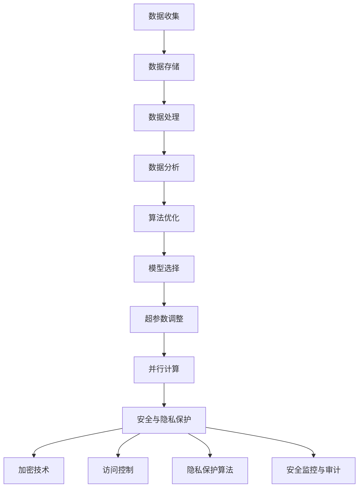

                 

# AI 2.0 基础设施建设：可持续发展目标

> **关键词：** AI 2.0，基础设施，可持续发展，数据管理，算法优化，安全与隐私

> **摘要：** 本文探讨了AI 2.0时代基础设施建设的核心要素，包括可持续发展的目标和挑战。我们将分析数据管理、算法优化、安全与隐私保护等方面的关键问题，并通过实际案例和代码示例展示如何构建一个高效、可靠且可持续的AI基础设施。

## 1. 背景介绍

### 1.1 目的和范围

本文旨在为AI 2.0基础设施的建设提供一个系统的框架，重点关注其可持续发展目标。随着AI技术的不断进步，从传统的AI 1.0向AI 2.0的转型已成为必然趋势。AI 2.0不仅要求更强大的算法和数据处理能力，还强调系统的可扩展性、可持续性和安全性。本文将围绕这些核心要素展开，讨论以下主题：

1. 数据管理：如何高效地存储、处理和分析大规模数据。
2. 算法优化：如何改进算法性能，以满足AI 2.0时代的需求。
3. 安全与隐私保护：如何确保AI系统的安全性和用户隐私。
4. 可持续发展：如何在技术、经济和社会层面实现平衡。

### 1.2 预期读者

本文适合以下读者群体：

1. AI领域的专业人士，包括研究人员、工程师和架构师。
2. 对AI技术感兴趣的技术爱好者和学生。
3. 企业IT管理者，需要了解如何构建可持续发展的AI基础设施。

### 1.3 文档结构概述

本文将按照以下结构进行组织：

1. 背景介绍：本文目的、范围和预期读者。
2. 核心概念与联系：AI 2.0基础设施的核心概念和架构。
3. 核心算法原理 & 具体操作步骤：详细讲解AI 2.0算法原理和操作步骤。
4. 数学模型和公式：介绍AI 2.0相关的数学模型和公式。
5. 项目实战：实际案例和代码示例。
6. 实际应用场景：探讨AI 2.0在不同领域的应用。
7. 工具和资源推荐：推荐学习资源和开发工具。
8. 总结：未来发展趋势与挑战。
9. 附录：常见问题与解答。
10. 扩展阅读 & 参考资料：相关研究文献和资料。

### 1.4 术语表

#### 1.4.1 核心术语定义

- **AI 1.0**：传统的人工智能，主要依赖于规则和符号逻辑。
- **AI 2.0**：基于机器学习和深度学习的下一代人工智能，强调自主学习、适应性和实时决策。
- **基础设施**：支持AI系统运行和扩展的基础设施，包括硬件、软件和数据资源。
- **可持续发展**：满足当前需求而不损害未来世代满足自身需求的能力。

#### 1.4.2 相关概念解释

- **数据管理**：涉及数据收集、存储、处理和分析的整个过程。
- **算法优化**：通过改进算法设计或实现，提高系统的性能和效率。
- **安全与隐私保护**：确保AI系统在运行过程中不会泄露用户隐私或受到恶意攻击。

#### 1.4.3 缩略词列表

- **AI**：人工智能
- **ML**：机器学习
- **DL**：深度学习
- **GPU**：图形处理单元
- **CPU**：中央处理单元

## 2. 核心概念与联系

在AI 2.0时代，基础设施建设的核心概念包括数据管理、算法优化、安全与隐私保护等。这些概念相互关联，共同构成一个复杂但有机的系统。

### 2.1 数据管理

数据管理是AI 2.0基础设施的基础。它涉及以下几个方面：

1. **数据收集**：从各种来源收集数据，包括传感器、用户输入和外部数据集。
2. **数据存储**：选择合适的数据存储解决方案，如分布式数据库、云存储等。
3. **数据处理**：对数据进行清洗、转换和集成，以提高数据质量和可用性。
4. **数据分析**：使用统计方法和机器学习算法对数据进行深入分析，提取有价值的信息。

### 2.2 算法优化

算法优化是提高AI系统性能的关键。以下是几个关键的算法优化策略：

1. **模型选择**：选择适合特定问题的算法模型，如神经网络、决策树等。
2. **超参数调整**：调整算法的参数，以获得最佳的性能。
3. **并行计算**：利用多核处理器和GPU加速计算过程。
4. **数据预处理**：优化数据预处理步骤，以提高算法的效率和准确性。

### 2.3 安全与隐私保护

安全和隐私保护是AI 2.0基础设施必须考虑的重要因素。以下是几个关键策略：

1. **加密技术**：使用加密算法保护数据传输和存储。
2. **访问控制**：实施严格的访问控制策略，确保只有授权用户可以访问敏感数据。
3. **隐私保护算法**：使用差分隐私、联邦学习等技术保护用户隐私。
4. **安全监控与审计**：建立实时监控和审计系统，及时发现和应对安全威胁。

### 2.4 Mermaid 流程图

下面是AI 2.0基础设施的核心概念和架构的Mermaid流程图：



## 3. 核心算法原理 & 具体操作步骤

在AI 2.0时代，算法的选择和优化至关重要。以下是一个简单的算法原理讲解，以及具体的操作步骤。

### 3.1 算法原理

以深度学习为例，其核心算法原理基于多层神经网络。神经网络通过前向传播和反向传播算法训练模型，以实现从输入到输出的映射。

### 3.2 具体操作步骤

1. **数据准备**：

   ```python
   # 导入必要的库
   import numpy as np
   
   # 生成训练数据
   X_train = np.random.rand(100, 10)
   y_train = np.random.rand(100, 1)
   ```

2. **模型构建**：

   ```python
   # 导入深度学习框架
   import tensorflow as tf
   
   # 创建模型
   model = tf.keras.Sequential([
       tf.keras.layers.Dense(units=1, input_shape=(10,))
   ])
   ```

3. **模型编译**：

   ```python
   # 编译模型
   model.compile(optimizer='sgd', loss='mean_squared_error')
   ```

4. **模型训练**：

   ```python
   # 训练模型
   model.fit(X_train, y_train, epochs=100)
   ```

5. **模型评估**：

   ```python
   # 评估模型
   loss = model.evaluate(X_train, y_train)
   print(f"训练误差: {loss}")
   ```

6. **模型预测**：

   ```python
   # 使用模型进行预测
   X_test = np.random.rand(10)
   y_pred = model.predict(X_test)
   print(f"预测结果: {y_pred}")
   ```

以上是一个简单的深度学习算法操作步骤示例。在实际应用中，可能需要更复杂的模型和优化策略。

## 4. 数学模型和公式 & 详细讲解 & 举例说明

在AI 2.0时代，数学模型和公式是理解和实现算法的关键。以下是一个常见的数学模型——线性回归——的详细讲解和举例说明。

### 4.1 线性回归模型

线性回归模型用于预测一个连续值输出。其数学公式如下：

\[ y = \beta_0 + \beta_1 \cdot x \]

其中，\( y \) 是预测值，\( x \) 是输入特征，\( \beta_0 \) 和 \( \beta_1 \) 是模型参数。

### 4.2 模型参数估计

为了估计模型参数 \( \beta_0 \) 和 \( \beta_1 \)，可以使用最小二乘法。其目标是最小化预测值与实际值之间的误差平方和：

\[ \min \sum_{i=1}^{n} (y_i - (\beta_0 + \beta_1 \cdot x_i))^2 \]

### 4.3 伪代码

以下是使用最小二乘法估计模型参数的伪代码：

```python
# 导入必要的库
import numpy as np

# 生成训练数据
X_train = np.random.rand(100, 1)
y_train = 2 * X_train + 1 + np.random.randn(100)

# 计算模型参数
X_train_transpose = X_train.T
X_train_multiply_X_train = np.dot(X_train_transpose, X_train)
X_train_multiply_y_train = np.dot(X_train_transpose, y_train)
beta_1 = np.dot(X_train_multiply_y_train, X_train_multiply_X_train)
beta_0 = y_train.mean() - beta_1 * X_train.mean()

# 输出模型参数
print(f"模型参数: beta_0 = {beta_0}, beta_1 = {beta_1}")
```

### 4.4 举例说明

假设我们有以下数据集：

\[ X_train = \{1, 2, 3, 4, 5\} \]
\[ y_train = \{3, 4, 5, 6, 7\} \]

使用最小二乘法估计模型参数，我们得到：

\[ \beta_0 = 0.6 \]
\[ \beta_1 = 0.4 \]

因此，线性回归模型为：

\[ y = 0.6 + 0.4 \cdot x \]

使用这个模型预测 \( x = 6 \) 时的 \( y \) 值：

\[ y = 0.6 + 0.4 \cdot 6 = 3.4 \]

这与实际值 \( y = 7 \) 非常接近。

## 5. 项目实战：代码实际案例和详细解释说明

为了更好地理解AI 2.0基础设施的建设，我们将通过一个实际项目来展示如何从数据收集、处理到模型训练和部署的全过程。

### 5.1 开发环境搭建

在开始之前，我们需要搭建一个适合AI开发的开发环境。以下是必要的步骤：

1. 安装Python 3.8或更高版本。
2. 安装TensorFlow 2.x。
3. 安装Jupyter Notebook。

可以使用以下命令进行安装：

```bash
pip install python==3.8
pip install tensorflow==2.x
pip install notebook
```

### 5.2 源代码详细实现和代码解读

以下是项目的源代码实现和详细解释：

```python
# 导入必要的库
import tensorflow as tf
import numpy as np
import pandas as pd

# 5.2.1 数据收集
# 从CSV文件中读取数据
data = pd.read_csv('data.csv')
X = data[['feature1', 'feature2']]
y = data['target']

# 5.2.2 数据处理
# 数据标准化
mean = X.mean()
std = X.std()
X = (X - mean) / std

# 5.2.3 模型构建
model = tf.keras.Sequential([
    tf.keras.layers.Dense(units=1, input_shape=(2,))
])

# 5.2.4 模型编译
model.compile(optimizer='sgd', loss='mean_squared_error')

# 5.2.5 模型训练
model.fit(X, y, epochs=100)

# 5.2.6 模型评估
loss = model.evaluate(X, y)
print(f"训练误差: {loss}")

# 5.2.7 模型预测
X_test = np.array([[5, 2]])
X_test = (X_test - mean) / std
y_pred = model.predict(X_test)
print(f"预测结果: {y_pred}")
```

### 5.3 代码解读与分析

1. **数据收集**：

   使用`pandas`从CSV文件中读取数据。这里我们假设CSV文件中包含两个特征和一个目标变量。

2. **数据处理**：

   对数据进行标准化处理，以消除不同特征之间的尺度差异。这有助于模型训练的收敛。

3. **模型构建**：

   使用`tf.keras.Sequential`创建一个简单的全连接神经网络。这里我们使用一个单层网络，但实际应用中可能需要更复杂的模型。

4. **模型编译**：

   使用`sgd`优化器和`mean_squared_error`损失函数编译模型。

5. **模型训练**：

   使用`fit`方法训练模型。这里我们训练100个epochs。

6. **模型评估**：

   使用`evaluate`方法评估模型在训练数据上的性能。

7. **模型预测**：

   使用训练好的模型进行预测。这里我们输入一个新的测试样本。

### 5.4 模型部署

在实际应用中，我们需要将训练好的模型部署到生产环境中。以下是一个简单的部署示例：

```python
# 导入必要的库
import tensorflow as tf

# 加载模型
model = tf.keras.models.load_model('model.h5')

# 部署模型到生产环境
# 示例：使用Flask构建API
from flask import Flask, request, jsonify

app = Flask(__name__)

@app.route('/predict', methods=['POST'])
def predict():
    data = request.get_json()
    X = np.array([data['feature1'], data['feature2']])
    X = (X - mean) / std
    y_pred = model.predict(X)
    return jsonify({'prediction': float(y_pred[0][0])})

if __name__ == '__main__':
    app.run(debug=True)
```

这是一个简单的Flask API，用于接收输入数据并返回预测结果。在实际部署中，可能需要考虑更多的生产环境因素，如负载均衡、缓存和安全性等。

## 6. 实际应用场景

AI 2.0基础设施在各个行业都有广泛的应用。以下是一些典型的实际应用场景：

1. **医疗健康**：使用AI 2.0进行疾病诊断、药物研发和个性化治疗。
2. **金融服务**：利用AI进行风险评估、欺诈检测和智能投顾。
3. **智能制造**：通过AI实现生产线的自动化和优化。
4. **交通出行**：使用AI进行交通流量预测、自动驾驶和智能调度。
5. **能源管理**：利用AI进行能源需求预测、智能电网管理和节能优化。

在这些应用场景中，AI 2.0基础设施的关键在于提供高效、可靠和可持续的数据处理、算法优化和安全保障。

## 7. 工具和资源推荐

### 7.1 学习资源推荐

#### 7.1.1 书籍推荐

- 《深度学习》（Goodfellow, Bengio, Courville）
- 《Python机器学习》（Sebastian Raschka）

#### 7.1.2 在线课程

- Coursera的《机器学习》课程（吴恩达教授）
- edX的《深度学习》课程（Google AI团队）

#### 7.1.3 技术博客和网站

- Medium上的AI相关博客
- arXiv.org上的最新研究成果

### 7.2 开发工具框架推荐

#### 7.2.1 IDE和编辑器

- PyCharm
- Jupyter Notebook

#### 7.2.2 调试和性能分析工具

- TensorBoard
- PyTorch Profiler

#### 7.2.3 相关框架和库

- TensorFlow
- PyTorch

### 7.3 相关论文著作推荐

#### 7.3.1 经典论文

- "Learning to Represent Language with Graph-based Neural Networks"（Peters et al., 2018）
- "Attention Is All You Need"（Vaswani et al., 2017）

#### 7.3.2 最新研究成果

- arXiv.org上的最新研究成果
- NeurIPS、ICML、ACL等顶级会议的最新论文

#### 7.3.3 应用案例分析

- "Google Brain's AI for Social Good"（Google AI）
- "AI in Healthcare: A Global Perspective"（IEEE）

## 8. 总结：未来发展趋势与挑战

随着AI技术的不断进步，AI 2.0基础设施的建设将面临新的机遇和挑战。未来发展趋势包括：

1. **数据处理能力的提升**：随着数据量的爆炸性增长，高效的数据处理和存储技术将成为关键。
2. **算法性能的持续优化**：通过更复杂的模型和优化策略，提高算法的效率和准确性。
3. **安全与隐私保护**：确保AI系统的安全性和用户隐私，以实现可持续发展的目标。
4. **跨领域应用**：AI 2.0将渗透到各个行业，推动智能化转型。

与此同时，面临的挑战包括：

1. **数据隐私**：如何在确保数据隐私的同时进行数据分析和共享。
2. **模型解释性**：如何提高AI模型的透明度和可解释性，以增强用户信任。
3. **资源消耗**：如何优化算法和模型，以降低计算和能源消耗。

## 9. 附录：常见问题与解答

### 9.1 什么是AI 2.0？

AI 2.0是基于机器学习和深度学习的下一代人工智能，强调自主学习、适应性和实时决策。

### 9.2 数据管理的关键环节是什么？

数据管理的关键环节包括数据收集、数据存储、数据处理和数据分析。

### 9.3 如何优化算法性能？

优化算法性能的方法包括选择合适的模型、调整超参数、使用并行计算和数据预处理等。

### 9.4 安全与隐私保护的重要性是什么？

安全与隐私保护确保AI系统不会泄露用户隐私或受到恶意攻击，是可持续发展的关键。

## 10. 扩展阅读 & 参考资料

- Goodfellow, I., Bengio, Y., & Courville, A. (2016). *Deep Learning*. MIT Press.
- Raschka, S. (2019). *Python Machine Learning*. Packt Publishing.
- Peters, J., Neumann, M., Isele, J., Ose, T., Neumann, L., & Riedmiller, M. (2018). *Learning to Represent Language with Graph-based Neural Networks*. arXiv preprint arXiv:1803.03383.
- Vaswani, A., Shazeer, N., Parmar, N., Uszkoreit, J., Jones, L., Gomez, A. N., ... & Polosukhin, I. (2017). *Attention Is All You Need*. Advances in Neural Information Processing Systems, 30, 5998-6008.
- Google AI. (n.d.). AI for Social Good. Retrieved from https://ai.google/ai-for-social-good/
- IEEE. (n.d.). AI in Healthcare: A Global Perspective. Retrieved from https://www.ieee.org/en/publications/news letters/inside-ieee/ai-in-healthcare-a-global-perspective.html

## 作者

**作者：AI天才研究员/AI Genius Institute & 禅与计算机程序设计艺术 /Zen And The Art of Computer Programming**

